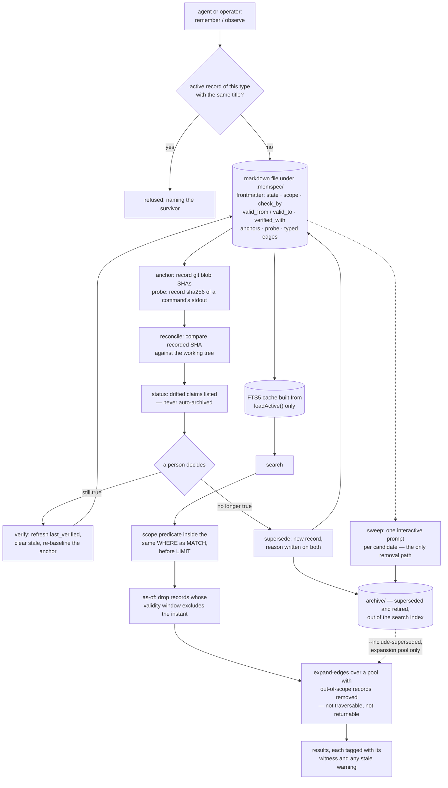

## 1. Executive Summary

Memspec's thesis is in one sentence of its own README: *"Calendar TTL is the
wrong signal for facts about code."* A claim gets anchored to the git blob SHAs
of the files it depends on; when those files change, `reconcile` flags the claim
for review. The loop the project names as its differentiator is
`anchor → reconcile → verify | supersede`, and it is the only mechanism in this
corpus that makes a stored belief accountable to the artifact it is about rather
than to a clock.

MIT; 156 commits between 4 April and 16 September 2026 from two contributors;
12,667 lines of TypeScript under `src/` against 12,148 lines of test carrying
471 cases across 49 files, at version 0.11.0. The screen found one auto-run
surface (three Claude Code hooks), one build-time execution path
(`prepublishOnly: npm run check`), one unpinned dependency surface, and three
manifests dated inside the seven-day cooldown — the read was made from a shallow
clone, which dates every file to the tip commit, so that is the release date
rather than three independent changes; nothing was installed, built or run.

**Six of seven capability marks**, and the reasoning behind them is written in
the source rather than inferred from it. Three passages carry the report:

- On the scope predicate living inside the SQL rather than over the returned
  page: it must, because filtering afterwards *"would starve small scopes out of
  existence"* — and the test that proves it seeds sixty out-of-scope records
  that outrank two in-scope ones on every BM25 signal.
- On why the graph walker cannot traverse *through* an out-of-scope record:
  traversable-but-unreturnable would leak the foreign graph's shape, because at
  depth two or three the neighbours of a record you may not see get pulled in,
  and *"one project's edge edits silently change another's retrieval."*
- On why an unrecognised `--scope` throws instead of answering: *"a scope
  nothing matches doesn't return 'no results', it returns 'unscoped and
  universal records only'… Silent under-retrieval is the worst possible failure
  for a memory store — the caller concludes the knowledge isn't there."*

**The lifecycle earns `trust_state` in its strong form.** The FTS index is built
from `loadActive()` alone, so a superseded record is not ranked down — it cannot
seed a query. Reaching one is an explicit `--include-superseded`, and even then
it enters the graph-walk pool only, never the seeds.

**Validity is genuinely separate from the review schedule.** `valid_from` and
`valid_to` say when a fact holds in the world; `created`, `last_verified` and
`check_by` say things about the record. `--as-of` filters on the first and the
MCP tool's own description states the orthogonality. Eight committed cases pin
the boundary behaviour, including both open-ended bounds.

**Removal is a person's job.** `sweep` prompts once per candidate and is
*"deliberately CLI-only: removal is an operator act, not an agent surface"*; a
closed stdin stops the loop rather than continuing. Operator-sourced records
cannot be superseded or have an edge removed without an override that MCP is not
allowed to pass.

**What is withheld and what is stale.** `tombstone` — the duplicate refusal
points at an existing survivor and records nothing about the rejected write, so
the same claim in different words is accepted. And one mechanism is declared and
unconsumed: `memspec init` writes `min_confidence: 0.7` and
`ranking: {relevance, confidence, recency}` into the config, two call sites
thread them into the FTS options, `MemspecStore.search` passes `minConfidence`
on into `fts.search`, and `FtsIndex.search` destructures `limit`, `types` and
`scope` and stops. The weights refer to a confidence field v0.3 removed and
replaced with `verified_with`; the config still offers the knob.

## 2. Mental Model

A memory here is a claim somebody could be wrong about, written down in a form
that can be checked.

The claim is a markdown file. Its body is prose; its frontmatter is the part the
tool reasons over — what type of claim it is, whether it is current, when it
should be looked at again, which files it depends on, which other claims it
refines or contradicts, and which window of world-time it describes. Being a
file means git is the history and `grep` is the fallback, and the SQLite index
beside it is disposable by design.

Ageing is two independent questions the project keeps apart. *Should someone look
at this again?* is `check_by`, and passing it sets a `stale` flag that prints a
warning and withholds nothing. *Was this true at the moment I care about?* is
`valid_from`/`valid_to`, and asking it with `--as-of` removes records outright.
A claim can be overdue for review and still true, or current in the review
schedule and false for the date you asked about.

Correction is never an edit. `supersede` writes a new record, links both
directions, and puts the reason on both — so the wrong version survives with an
explanation attached, out of search but reachable through the lineage chain.

The anchor is what makes the whole thing more than a notes file. `memspec anchor
<id> src/auth/jwt.ts` records the blob SHA of that file. `reconcile` walks every
anchored claim and compares. A drifted claim does not archive itself; it appears
in `memspec status`, waiting for a person to say whether the claim survived the
change.



## 3. Architecture

One npm package, no service. `src/commands/` holds eighteen verbs — `remember`,
`observe`, `search`, `context`, `anchor`, `probe`, `verify`, `reconcile`,
`supersede`, `relate`, `sweep`, `status`, `normalize`, `distill`, `export`,
`migrate`, `init`, `unrelate` — and `src/lib/` the machinery: `store`,
`composite-store`, `fts`, `embeddings`, `graph-walk`, `scope`, `registry`,
`anchors`, `lineage`, `decay`, `frontmatter`, `schema`, `config`, `usage`,
`probe`, `source`, `brownfield`, `import-openclaw`, `agent-addon`.

The layering is deliberate. `MemspecStore` reads and writes markdown;
`CompositeStore` merges a project store with a global one at read time, project
records taking priority, with a comment recording a bug the design had — priority
once acted as an absolute gate rather than a ranking input, and a whole layer
went invisible. `FtsIndex` is a cache that knows it is a cache: it checks its own
schema against the running version, because a cache written by an older memspec
has the right tables and the wrong columns and an mtime that says it is fresh.

Migration is treated as a first-class problem rather than a footnote. Pre-0.3
lifecycle values are mapped on read (`captured → active`, `corrected →
superseded`, `decayed → retired`, `archived → retired`), `ext.code_anchors` is
promoted to a top-level `anchors` field, an absent `verified_with` is inferred
from the strongest available witness, and the old confidence float is kept under
`ext.legacy_confidence` *"for archaeology only"*. There is a 588-line `migrate`
command and a `MIGRATION-v0.3.md` beside it.

Three release tarballs — 0.7.2, 0.8.0 and 0.9.0 — are committed at the
repository root. They are build output rather than source, and a reader cloning
this tree gets them.

## 4. Essential Implementation Paths

- **Write.** `runRemember` → resolve the active scope from cwd → load candidates
  visible from that scope → refuse when an active record of the same type has the
  same title, naming the survivor → dedupe the typed edge lists inline → write a
  ULID-named markdown file into the store the `claims:` config routes to.
- **Anchor and reconcile.** `anchor` runs the equivalent of `git hash-object` per
  file and stores `{file, sha}` → `reconcile` re-hashes, including uncommitted
  edits, and records the drifted ids → `status` reports them → `verify` refreshes
  `last_verified`, clears `stale`, re-baselines the anchor and records the
  witness, or `supersede` writes the replacement.
- **Search.** `runSearch` → resolve or validate the scope, throwing on an unknown
  name → parse `--as-of` before touching the store, so a bad ISO string fails
  loudly rather than letting `NaN` comparisons pass everything → FTS5 with the
  scope predicate inside the `WHERE` → temporal filter → optional edge expansion
  over a scope-filtered pool → optional dense rerank → render, tagging each row
  with its witness, its stale warning and its `expanded_via`.
- **Expand.** `graph-walk` follows `refines`, `supports`, `depends_on`,
  `conflicts_with`, `supersedes` and `superseded_by` to a bounded depth and
  expansion count, over a `Map<id, item>` built from records visible in the
  active scope — so an out-of-scope record is neither a destination nor a
  waypoint.
- **Retract an edge.** `runUnrelate` → require a reason → refuse on an
  operator-sourced record unless overridden, and refuse the override outright
  over MCP → remove the edge, drop the paired provenance mark for a
  `conflicts_with` → append `{type, to, removed_at, removed_by, reason}` to
  `ext.edge_removals`, with override use folded into the reason.
- **Remove.** `sweep` → iterate stale-flagged candidates → one `readline` prompt
  each → archive on confirmation; a closed stdin ends the loop rather than
  continuing without an answer.

## 5. Memory Data Model

The frontmatter is worth reading as a design document, because the comments say
what each field is for and what it deliberately is not.

**Kind and type.** A `claim` carries a type — `fact` (90-day default review),
`decision` (180), `procedure` (90) — and an `observation` carries none but has a
hard `expires` at seven days. Separating a durable claim from a point-in-time
note at the schema level means the expiry policies do not have to argue.

**Lifecycle.** `active | superseded | retired`, with the four pre-0.3 values
mapped on read. This is the field that decides visibility.

**Witness.** `verified_with` is one of `anchor`, `probe`, `operator`, `evidence`,
`assertion`, ordered by strength in the comment and described as *"provenance,
not a confidence score."* `anchor` and `probe` are called mechanical witnesses: a
blob SHA and the sha256 of a stored command's stdout, both re-checked on demand
and — the comment is explicit — never on a read path, because probes execute
shell commands.

**Review versus validity.** `check_by` is a review schedule whose expiry sets a
flag; `valid_from`/`valid_to` is a truth window whose expiry removes the record
from an as-of query. The type definition states the difference in one line: past
`check_by` means review is overdue, past `valid_to` means the fact no longer
holds.

**Scope.** Single-valued by design — *"a record belongs to one project or to
everyone"* — with absent and `universal` kept apart because *"classified as
global" and "not yet classified" are different facts about a record.*

**Edges.** Six typed lists, plus `supersede_reason` and, in `ext`,
`edge_sources` marking which `conflicts_with` edges a caller deliberately wired
rather than ones a since-removed lexical heuristic inferred, and `edge_removals`
recording retractions.

**Source tier.** `operator | agent | import`, inferred from the source at write
time, gating the override protections.

## 6. Retrieval Mechanics

BM25 over a porter-stemmed FTS5 index with title at ten, tags at five and body
at one, and a four-step fallback chain — exact-AND, then prefix-AND, then
exact-OR, then prefix-OR — so precision is preferred when every term matches and
a multi-term question does not return nothing because one term is absent.

Three filters reach the query. Type is a plain `IN`. Scope is the predicate in
the same `WHERE` as `MATCH`, and the comment explains the ordering: a scope
holding three records *"can't compete for a twenty-row page against three
hundred out-of-scope records that match the same terms."* Validity is applied
over the loaded set with `isValidAsOf`.

Expansion is the second arm. Each seed's typed edges are followed to a bounded
depth, and every surfaced neighbour carries `expanded_via` naming the match and
the link that brought it in — so a reader can tell a direct hit from a
second-order one. `--include-superseded` widens the pool to archived records so
the walk can reach a predecessor, and even then the seeds stay active-only.

The scope wall on expansion is the part worth copying. The seed pass is filtered
in SQL; the expansion pass reads its own pool, so without a second filter *"a hit
in scope A follows a `refines` edge and returns a record from scope B."* The
implementation removes out-of-scope records from the pool rather than from the
results, and the comment states the side channel that motivates it and the bound
on the cost: the only paths severed are ones routing through a genuinely foreign
record, because unscoped and universal records stay visible everywhere.

**One knob does nothing.** `FtsSearchOptions` declares `minConfidence` and a
`ranking` object of `relevance`, `confidence` and `recency`; `runSearch` and
`runContext` populate them from the active profile; `MemspecStore.search`
destructures `minConfidence` and hands it to `fts.search`; and
`FtsIndex.search` destructures `limit`, `types` and `scope` and stops. The
value travels three layers and is never compared to anything. The default config
`memspec init` writes still carries `min_confidence: 0.7` and
`ranking: { relevance: 0.4, confidence: 0.3, recency: 0.3 }` — weights over a
confidence field that v0.3 removed. What actually adjusts the boot ordering is a
separate mechanism, the `usage_boost` computed from `usage.jsonl`.

## 7. Write Mechanics

A write is refused before it is deduplicated. `remember` compares against active
records of the same type visible from the current scope and, on an exact title
match, refuses with the survivor's id — the README's promise that memory
*"accretes corrections via `supersede` instead of silent duplicates."* The band
below that surfaces high-similarity candidates as a hint rather than a refusal.
The limit is the key: an exact title match within a type catches the same claim
written twice, not the same claim written differently.

Correction never mutates. `supersede` writes the new record, sets `supersedes`
on it and `superseded_by` on the old one, and puts the reason on both, so a
reader arriving at either end of the chain finds the explanation. Operator
records are protected: superseding one requires `--override-operator`, and the
override is folded into the persisted reason so the record says it was used.

Anchoring and probing are the two mechanical witnesses. An anchor is cheap and
safe to check on any path; a probe stores a command and the hash of its output
and is re-run only when a person asks, because running it is executing a shell
command. Keeping that distinction in the type definition rather than in a
comment somewhere is the right place for it.

Removal has exactly one door. `sweep` walks the stale-flagged set and prompts per
item, and the loop breaks when stdin closes mid-prompt — so a piped or
non-interactive invocation retires nothing rather than everything.

## 8. Agent Integration

Fourteen MCP tools with descriptions written for the model that will read them:
`memspec_search` opens with *"Search project memory before answering questions or
starting work"* and documents `expand_edges`, `as_of` and `include_superseded`
in the same string. The `unrelate` tool's description states its own refusal
before the model tries it — an operator-sourced record's edge cannot be removed
over MCP, and the reason given is that a terminal is where a human is present to
authorize it. That one is enforced rather than described: `runUnrelate` computes
`const overrideOperator = !viaMcp && (options.overrideOperator ?? false)`, and
`viaMcp` comes from a `channel: 'mcp'` the server supplies and the tool schema
does not expose. The channel, not the flag, decides.

`memspec_supersede` is the exception worth naming, because it looks like the
same protection and is not. `override_operator` is one of its declared
parameters — *"Required to supersede operator-sourced records; logged into the
persisted reason"* — and `handleSupersede` forwards it into `assertSupersedable`
with no channel clamp, so an agent that wants to supersede operator knowledge
supplies its own authorization and the record notes that it did. The persisted
reason gains `[override_operator used on operator-sourced record]`, which makes
the act auditable after the fact; it does not make it refused. Removal and edge
retraction are gated by the channel; supersession is gated by a boolean the
caller fills in. Neither the tool description nor the CLI help says so.

Three Claude Code hooks. The session-start hook resolves the store through four
candidates in order — `$MEMSPEC_ROOT`, `<cwd>/.memspec`, ancestors up to home,
then `~/.memspec` — and its own comment sets the contract: if nothing is found or
the CLI is unavailable, it exits 0 with empty context, because *"it must never
block or confuse the session."* A hook that fails open is the only kind worth
installing.

The project generates an agent addon rather than rewriting `CLAUDE.md` wholesale,
which keeps the file the agent reads a thing the user owns.

## 9. Reliability, Safety, and Trust

**Trust state — awarded.** The lifecycle decides visibility, not rank: the index
is built from the active set, so a superseded record is absent from search.
Beside it two things that are deliberately *not* the mark, and the project is
clear about both. `verified_with` is provenance and annotates every result
without filtering any. `stale` warns — the rendered line reads `[STALE — verify
or supersede before relying on this]` — and withholds nothing, which is the
correct choice for a review flag and worth distinguishing from a truth claim.

**Bitemporal — awarded.** Two axes, both used, and the code says which is which.
The `--as-of` parse happening before the store query, with a comment naming the
failure it prevents, is the detail that shows the filter was thought about rather
than added.

**Scope enforced — awarded twice.** In SQL before LIMIT, and as a pool exclusion
on the graph walk. The corpus contains several systems where a scope predicate
was duplicated and one copy drifted; this one duplicates it on purpose,
`isVisibleFromScope` carrying the comment *"mirrors the SQL in
`FtsIndex.runFtsQuery`; kept here so non-FTS consumers and tests can assert the
same rule"* — the duplication is named, and a test asserts the rule.

**Audit log — awarded, and narrow.** `ext.edge_removals` records who removed
which edge, when and why, and exists because edges were append-only until v0.10,
so *"a wrong `conflicts_with` was permanent."* It covers edge retractions only.
Every other mutation is auditable through git, which this atlas counts as a
different mechanism and does not credit here. `usage.jsonl` is a retrieval log —
the other half of the pattern, and not this.

**Human review — awarded, on removal rather than on the source tier.** `sweep`
is the only path that takes a record out, it is absent from all fourteen MCP
tools, and it runs a prompt per candidate or reads an answers file whose
unlisted ids mean keep — so the non-interactive mode fails towards retaining.
Drift surfaces rather than acts; the dream pass and the promotion-candidate
section of `status` produce candidates that nothing applies, and the tool
description says *"nothing is auto-promoted"* rather than leaving it to be
inferred. Edge retraction on an operator record is clamped off for the MCP
channel in code.

The qualification this report got wrong the first time: superseding an operator
record is *not* refused over MCP. `override_operator` is a declared parameter of
`memspec_supersede`, forwarded without a channel check, so the agent authorizes
itself. The mark stands on removal and retraction, where the boundary is real,
and the source tier is a softer thing than the earlier reading described.

**Negative evaluation — awarded.** The scoping suite proves exclusion against a
populated page whose in-scope members are named, and the test's comment records
that the author removed the SQL predicate and confirmed the test fails.

**Tombstone — withheld.** The duplicate refusal is a write-time check against
existing active records; nothing durable records the rejected write, and nothing
is consulted later to prevent the same claim returning in different words. The
near-miss is real, because the machinery is present: a `conflicts_with` edge and
a `supersede_reason` are the vocabulary a value-level rejection record would use.

**Two things to hold against it.** The declared-and-unconsumed config is a
smaller edge than it was. v0.11 normalizes raw BM25 per result set before the
weighted combination, with the reason written down — unbounded scores in the
3–15 range meant *"the relevance weight is the only dial that ever moves the
ranking"* — so `relevance` and `recency` now do something, and the `confidence`
weight is ignored behind a comment saying it is retained for compatibility and
that the field is gone. `min_confidence: 0.7` is still written by the scaffold,
still threaded through `search.ts` and the store into the FTS options, and still
never read: `fts.ts` declares `minConfidence` in its options interface and the
query never mentions it. And the honesty of the whole design rests on somebody
running `reconcile`, answering `sweep` and reading the dream output; the store
never retires a claim it decided was wrong, which is the right default and puts
the burden on an operator who may not come back.

## 10. Tests, Evals, and Benchmarks

321 cases across 39 files on `node:test` with `node:assert/strict`, plus 8,640
lines of test code against 9,710 of source. The files are named after the
properties rather than the modules — `record-scoping`, `layered-stores-retrieval`,
`archive-expansion`, `temporal-validity`, `operator-tier`, `anchor-containment`,
`repair-inferred-conflicts`, `removed-commands` — and the assertions carry
messages that state the requirement rather than the expression.

**One test does what this atlas asks of every test and few do.** The
scope-starvation case at `test/record-scoping.test.ts:156` seeds sixty
out-of-scope records whose query term sits in title and tags against two
in-scope records that carry it only in the body, asks for five rows, and asserts
exactly the two in-scope titles come back. Its comment then records the mutation
check: *"Verified by removing the SQL predicate and re-running: this test fails
with `0 !== 2`, and it is the only one in the file that does."* A test that has
been shown to fail is a different artifact from one that has only ever passed,
and writing down which one it was is a small act of engineering discipline worth
naming.

**The benchmark page is the most careful disclosure in this round.** Both
datasets are pinned by sha256 — LoCoMo category-2 temporal and LongMemEval-S
knowledge-update — and the page states that the LongMemEval hash *differs* from
the earlier runs because the upstream file was revised, rather than quietly
comparing across it. The saturated 1.000 result is reported *"for continuity, not
bragging rights"*, with the reason: ground-truth session ids are lexically
distinctive and the slice cannot differentiate retrieval strategies at this
protocol. The unchanged LoCoMo figures are called *"regression evidence, not a
new claim."* Latency is marked not comparable to the earlier table because the
machine changed. The limits are equally plain: n=20 per dataset, retrieval only,
no model in the loop, and the multi-condition harness that produced the original
comparison was removed from the tree and survives only at a git tag.

No paper, and none claimed.

## 11. For Your Own Build

### Steal

- **Anchor a claim to the artifact it is about.** A blob SHA per depended-on file
  turns "this fact may be stale" from a guess about elapsed time into a fact
  about the repository. Re-baseline the anchor when the claim is re-verified.
- **Keep the review schedule and the truth window apart.** Overdue for review and
  no longer true are different states, they expire on different clocks, and
  conflating them means a fact that changed one day into a ninety-day window
  still looks fine for the remaining eighty-nine.
- **Put the scope predicate inside the query, and prove it with a starved page.**
  A post-filter over a returned page looks identical in every small test and
  silently returns nothing once one scope outweighs another.
- **Exclude an out-of-scope record from the traversal pool, not from the
  results.** Traversable-but-unreturnable leaks the shape of the graph you are
  not allowed to see, and lets one partition's edge edits change another's
  retrieval.
- **Throw on an unknown scope name.** Silent under-retrieval reads as "the
  knowledge isn't there", which is the one wrong answer a memory store must never
  give confidently.
- **Give removal exactly one door and put a person behind it.** One prompt per
  item, and stop when stdin closes rather than proceeding unattended.
- **Record the mutation check in the test's comment.** *"Removing the SQL
  predicate makes this test fail with `0 !== 2`"* is worth more to the next
  reader than any amount of coverage percentage.

### Avoid

- **Leaving a tuning knob in the generated config after removing what it tuned.**
  `min_confidence` and a `confidence` ranking weight are still written by `init`
  and carried three layers down without ever being compared to anything — over a
  field the schema dropped two minor versions ago.
- **Deduplicating on an exact title.** It catches the accident and misses the
  paraphrase, which is the case a claim store actually accumulates.
- **Ordering a vocabulary you never compare.** The witness ladder documents a
  strength order from `anchor` down to `assertion` and no read path uses it — the
  ordering is currently a comment.
- **Committing release tarballs to the source tree.** Three of them are here.

### Fit

Memspec suits a developer or a small team who want project knowledge to live in
the repository, reviewable in diffs, and who are willing to run a maintenance
loop — because the mechanisms that keep it honest are operator-driven by design.
It is the right shape when memory has grown past a paragraph in `AGENTS.md` into
a list of claims that need to track code, expire, supersede and link, which is
the case its own comparison table makes. It is the wrong shape when nobody will
answer a prompt: nothing here retires a claim on its own, and a store whose
`reconcile` is never run keeps drifted facts flagged and retrievable.

## 12. Open Questions

- Will `min_confidence` and the `ranking` weights be wired to the witness ladder,
  or removed from the generated config? Either resolves the mismatch; leaving
  both is the only outcome that misleads.
- Should the duplicate refusal reach past an exact title? The similarity band
  already computes candidates and surfaces them as a hint.
- Is a rejected write worth recording? `conflicts_with` and `supersede_reason`
  are most of the vocabulary a value-level tombstone would need.
- Does the layered-store merge label which layer a result came from? The
  composite store already had one bug where priority acted as a gate rather than
  a ranking input.

## Appendix: File Index

| Path | Lines | What it holds |
| --- | --- | --- |
| `src/lib/types.ts` | 130 | The frontmatter contract: lifecycle states (12-13), the witness ladder (24-30), scope semantics (44-48), `check_by` versus `valid_from`/`valid_to` (52, 64-69), the `ext` conventions including `edge_sources` and `edge_removals` (72-83), `CodeAnchor` and `ProbeWitness` |
| `src/lib/scope.ts` | 100 | `resolveScopeForCwd`, `assertKnownScope` with the silent-under-retrieval argument, `isVisibleFromScope` mirroring the SQL |
| `src/lib/fts.ts` | 258 | The FTS5 cache, its own schema-version check, the four-step fallback chain, the scope predicate inside `WHERE` (205-212), and the unread `minConfidence`/`ranking` options (21-35) |
| `src/commands/search.ts` | 446 | `isValidAsOf` (70-79), scope resolution and validation (261-266), the as-of parse before the store query (275-289), the expansion pool's hard wall (310-327) |
| `src/lib/store.ts` | 401 | Markdown load and write, the lazy stale flag, `loadActive` (262) and `loadSuperseded` (273), `moveToArchive` (302), the FTS build from the active set (333-339) |
| `src/lib/composite-store.ts` | 334 | Project-over-global layering, and the comment recording the priority-as-gate bug (188) |
| `src/commands/remember.ts` | 479 | Scope-aware candidate load, the exact-title refusal (250-262), the similarity hint band, inline edge dedup |
| `src/commands/relate.ts` | 263 | `relate` and `runUnrelate` (187-262) with the required reason and the `ext.edge_removals` append |
| `src/commands/supersede.ts` | 242 | The operator-tier protection and the override note folded into the reason (50-57) |
| `src/commands/sweep.ts` | 60 | The one removal path: interactive per candidate, stopping on closed stdin |
| `src/commands/reconcile.ts` | 258 | Anchor drift detection including uncommitted edits |
| `src/mcp.ts` | 541 | Eleven tools; the `as_of` description (70), the `unrelate` channel refusal (473-478) |
| `test/record-scoping.test.ts` | — | The scoping suite, including the starvation case and its recorded mutation check (145-176) |
| `test/temporal-validity.test.ts` | — | Eight as-of boundary cases and frontmatter round-trip |
| `BENCHMARK.md` | 38 | LoCoMo and LongMemEval-S at pinned hashes, n=20, with the saturation and comparability caveats stated |

Searches behind the absence claims above, run from the repository root:

```sh
grep -rn 'minConfidence\|\.ranking' src --include='*.ts'          # populated from the profile, threaded through MemspecStore.search into fts.search, never destructured by FtsIndex.search
grep -rn 'verified_with' src --include='*.ts' | grep -i 'filter\|where\|<\|>'   # two hits, both GraphML export attributes; no read path filters on the witness
grep -rn -i 'audit\|journal\|append.only' src --include='*.ts'    # ext.edge_removals and the usage log; no general mutation journal
grep -rn -i 'arxiv\|bibtex\|CITATION' README.md SPEC.md BENCHMARK.md  # nothing: no paper
```

## History

**2026-09-19** — [`7c0a47f36d75585db0701b9828592433a0fa1c7b`](https://github.com/siimvene/memspec/commit/7c0a47f36d75585db0701b9828592433a0fa1c7b) — `trust_state` re-tested at the unchanged pin; the mark holds and the three-way distinction deserves more room than the record gave it. The index-time filter is exact: `search` builds the FTS index from `loadActive()`, so a non-active record is absent from the structure a query searches rather than dropped from its results. What the record left implicit is that `superseded` and `retired` are withheld *differently*, on purpose. `--include-superseded` puts superseded records into the graph-walk pool as targets only — the code says seeds stay active-only — while `retired` is kept out even of that, with the reason in the comment: *"a retraction is a deletion of intent, not a target the walker should follow into."* Supersession says this was true and something replaced it, so a walker may reach it on request; retirement says this should not have been said, so nothing reaches it. And the four pre-0.3 state names are mapped forward on read (`decayed` and `archived` both to `retired`), so a record written by an older writer stays inside the state machine instead of falling out of it. Nothing was installed and no suite was run.

**2026-09-18** — [`7c0a47f36d75585db0701b9828592433a0fa1c7b`](https://github.com/siimvene/memspec/commit/7c0a47f36d75585db0701b9828592433a0fa1c7b) — re-pinned from `c8f68a9` to the 0.11.0 release gate of 16 September 2026; 59 files changed, +7,251 lines, and `src/`, `test/`, `bin/`, `hooks/` and `scripts/` all moved, so the tree was re-screened and re-read rather than diffed. Re-screened at the new pin: one auto-run surface, one build-time execution path, one unpinned dependency surface, three manifests inside the cooldown by the shallow clone's tip date; nothing was installed, built or run. Six marks held, with one corrected in place: the `human_review` record claimed operator-sourced records could be neither superseded nor unrelated over MCP, and only the second half is true — `memspec_supersede` declares `override_operator` as a tool parameter and forwards it without a channel check, while `runUnrelate` clamps the override off with `!viaMcp`. That was wrong at the previous pin too, not an upstream change. A second correction of the same kind: the retrieval row described optional dense reranking against an OpenAI-compatible endpoint or Ollama, but nothing under `src/` imported `embeddings.ts` at the old pin either — it was a scaffolding prompt and a config key, and v0.11 deleted the module, the flags and the prompts, so `stack_retrieval` loses `vector`. Upstream moved on the ranking finding this report made: relevance is now normalized per result set so the profile ratios apply, and the `confidence` weight is ignored behind a comment naming the reason; `min_confidence` is still dead. New in v0.11 and described here for the first time: question groups with an `open`/`resolved` state and resolution by elimination that is reported and never automatic, an append-only `outcomes.jsonl` of what happened after a retrieval, content-addressed committed evidence files, a `scopes_require` write refusal, and a non-interactive `--answers` mode for `sweep` whose unlisted ids default to keep.

**2026-09-10** — [`c8f68a9a415b26cff5f555406437720dcfe81299`](https://github.com/siimvene/memspec/commit/c8f68a9a415b26cff5f555406437720dcfe81299) — first reading, at the head of `main`, the last commit of 20 August 2026. Screened before reading: one auto-run surface in the three Claude Code hooks, one build-time execution path (`prepublishOnly`), one unpinned dependency surface with a lockfile 21 days old, and no manifest inside the cooldown; nothing was installed, built or run, and the read was made from a full clone. Six marks. The reading covered the frontmatter contract, the store and composite store, the FTS index and its scope predicate, the temporal filter, the graph walk, the write and supersede paths, the edge-retraction audit, the sweep prompt, the MCP surface and the hooks; the transcript ingestion pipeline, the embeddings reranker, the migration command and the export path were read as context rather than as subject.
