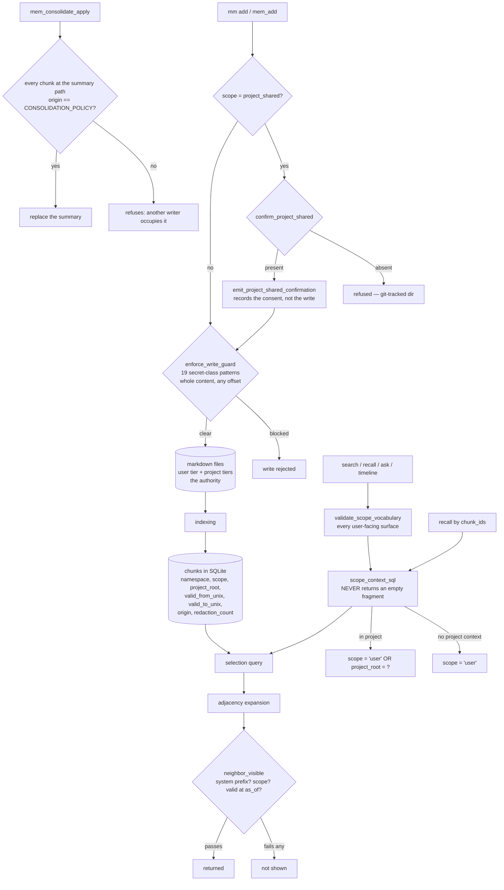

## 1. Executive Summary

memtomem is long-term memory for coding agents built on markdown files the
user keeps: the files are the authority, SQLite is an index over them, and the
README's promise is that "your files stay yours, and core usage is hook-free by
default." The core package is version 0.6.2 under Apache-2.0 — the workspace
carries 1,996 commits since 28 March 2026, with 157,951 lines of Python in the
core against 297,851 lines across 520 test files — and the README labels the
0.x line alpha.

The thing worth the visit is how it enforces scope.

Memory lives in three tiers — `user`, `project_shared`, `project_local` — and
the enforcement is a SQL fragment, `scope_context_sql`, composed into every
chunk query. The design decision that makes it hold is stated in the
docstring: the fragment "is non-empty in every case — never returns `("", [])`
— so callers cannot accidentally drop the context rule by treating an empty
fragment as 'no filter'." With no project context it pins `scope = 'user'` and
excludes every project tier, with the reasoning written down — the caller did
not pin to a project, so the store cannot tell whose `project_shared` chunks
would be safe to show. A caller's own `ScopeFilter` is layered on as intent and
can only narrow, or explicitly opt into a cross-project read.

Three things then stop that rule eroding.

`neighbor_visible` re-checks scope, system namespaces and temporal validity on
a chunk reached by adjacency rather than by the query — the seam where a
graph-expanding retriever usually leaks — and its docstring is careful about
the asymmetry: an explicit filter *widens* neighbour visibility and never
narrows it, "[t]hat asymmetry is what makes this a visibility rule rather than
a second copy of the selection query."

`test_scope_vocabulary_architectural_guard.py` keeps a registry of every
function that accepts a scope, asserts that each declared surface actually
calls the vocabulary gate, and — the part that matters —
`test_no_unclassified_scope_sinks` fails when a *new* scope sink appears in
neither the validated nor the permissive set. A future read surface cannot
quietly skip the gate; the test breaks first.

And `test_recall_by_chunk_ids_still_honors_the_project_boundary` pins the rule
that most id-addressed fetches get wrong. A caller holding all three chunk ids
gets back exactly the two in scope, because the id-restricted path routes
through `recall_chunks` rather than a raw batch getter. Its docstring says it
plainly: "'I know its id' is not authorization."

Around that sit two guards worth naming. Consolidation refuses to write a
summary onto a virtual path occupied by chunks it does not own — `origin !=
ORIGIN_CONSOLIDATION_POLICY` means "a real file or another writer's chunks
appear to occupy it" — and refuses outright when the path holds too many chunks
to establish ownership. And the write path runs content through a
credential-redaction guard whose 19 secret-class patterns are documented as
byte-identical to a named commit of a sibling project, with an asymmetric sync
rule for which side may lead.

The limits are stated by the code rather than discovered against it. The
consent that clears a write into a git-tracked directory is a boolean
parameter, and `emit_project_shared_confirmation` says what its audit line
means: "a human (or an agent acting for one) authorised a git-tracked write" —
so this is a recorded consent, not human review, and no mark follows from it.
The self-export HMAC marker "proves **local provenance** … NOT that every chunk
passed redaction", and the docstring lists exactly which rows can slip through:
legacy pre-guard rows, prior `force_unsafe` writes, and folder-indexed content
from before that path had a gate.

Three marks: `scope_enforced`, `bitemporal`, `negative_eval`.

## 2. Mental Model

A **chunk** is a slice of a markdown file with its heading hierarchy, a
namespace, tags, a scope tier, a project root, and optionally a validity
window declared in the file's frontmatter.

A **scope** is `user`, `project_shared` or `project_local`. The first is shared
across projects; the other two belong to a project identified by an absolute
`project_root`, so one user-local database can hold several worktrees of the
same project without colliding.

A **context boundary** is the always-on rule: out-of-project reads see `user`
only; in-project reads see `user` plus that project's tiers. It is not a
default the caller overrides — it is the floor the caller's filter narrows.

An **as-of instant** gates `valid_from_unix` and `valid_to_unix`, which come
from the file, not from the indexer.

## 3. Architecture

| Area | Role |
| --- | --- |
| `storage/sqlite_scope.py` | `scope_context_sql` — the always-on boundary |
| `search/visibility.py` | `neighbor_visible`, `chunk_valid_at`, the adjacency fence |
| `models.py` | `ChunkMetadata`, `NamespaceFilter`, `ScopeFilter` and their parsers |
| `memory_scope.py` | The scope-tier to canonical-directory resolver shared by CLI and server |
| `privacy.py` | The redaction guard, its pattern provenance and the consent audit |
| `provenance.py` | The HMAC self-export marker and its threat model |
| `tools/consolidation_engine.py` | Summary-path ownership and the refusal to consolidate over foreign chunks |
| `server/tools/` | The MCP surface: `mem_add`, `mem_search`, `mem_recall`, `mem_consolidate*` |
| `quality/` | Experiment, replay, gate, fingerprints — a retrieval-quality harness |
| `packages/memtomem-*` | Claude Code plugins, Kimi skills, an OpenCode integration |

## 4. Essential Implementation Paths

- `storage/sqlite_scope.py:29-69` — the fragment, and why it is never empty.
- `search/visibility.py:50-92` — validity and the adjacency rule.
- `models.py:281-340` — `ScopeFilter`, and where vocabulary is enforced.
- `server/tools/memory_crud.py:700-760` — Gate B then Gate A, in that order.
- `tools/consolidation_engine.py:385-408` — the ownership refusal.
- `provenance.py:1-40` — what the marker proves and what it does not.

## 5. Memory Data Model

A chunk carries retrieval structure (headings, overlap, parent and file
context), classification (namespace, tags, chunk type), scope (tier plus
project root), temporal validity, and provenance (`origin`,
`source_span_hash`, `redaction_count`, `source_read_only`).

There is no status field. Correction happens in the file: edit it, and the
index follows. That is coherent for a markdown-first design and it means the
store has no notion of a claim being superseded — the diff in the user's
repository is the record.

The `origin` field is the exception worth noting, and the comment explains the
choice: ownership over the virtual summary path is decided on `origin` "rather
than on a namespace/tag combination a user chunk can reproduce." The key is
one a user write cannot forge.

## 6. Retrieval Mechanics

Hybrid BM25 and vector search over the indexed chunks, with the scope fragment
and namespace filter composed in, an optional as-of instant, and an adjacency
expansion guarded separately. `validate_scope_vocabulary` runs on every
user-facing read — HTTP, MCP and CLI alike — so a misspelled tier gives the
same answer everywhere, with `run_search` repeating it as a backstop for
in-process callers.

## 7. Write Mechanics

Two gates in a fixed order. Gate B requires `confirm_project_shared=True`
before a write into a git-tracked directory and records that consent with the
surface that obtained it. Gate A is the content chokepoint: the redaction scan
covers the whole content regardless of length, "a secret pasted past any byte
offset still trips it", and it hard-refuses `force_unsafe=True` when the scope
is `project_shared`.

## 8. Agent Integration

An MCP server with the memory CRUD, search, consolidation and timeline tools; a
CLI; an HTTP API with a dashboard; and packaged plugins for Claude Code, Kimi
and OpenCode. Core usage is hook-free by default, which is the README's answer
to memory layers that require a harness change.

## 9. Reliability, Safety, and Trust

The pattern across this codebase is that each guarantee is accompanied by its
own limits, in the file that implements it. That is worth saying plainly
because it is rare: the redaction module records the exact sibling commit its
patterns match and which side may lead; the provenance module states that a
valid marker proves the bundle is a self-export and not that its contents
passed redaction, and enumerates the three categories of row that can slip
through; the consent emitter says its line means a human *or an agent acting
for one* authorised the write.

Two consequences follow for this report's marks. `human_review` is withheld:
the confirmation is a parameter the calling agent can set, and the code says
so. `audit_log` is withheld: the audit lines cover the consent and bypass
gates, not every mutation, and the memory itself is a file whose history lives
in the user's version control rather than in the store.

The remaining risk is inherent to the design rather than a slip. With no status
on a chunk, a stale memory is corrected by changing the file. That is the right
answer for a markdown-first system and it means everything this atlas asks
about supersession, tombstones and belief is answered by git rather than by
memtomem.

## 10. Tests, Evals, and Benchmarks

520 test files, nearly twice the source in lines, plus a `quality/` package
with experiments, replay, fingerprints and gates for retrieval quality.

Two test shapes are worth copying. The architectural guard converts "every read
surface must call the gate" from a convention into a failing test when a new
surface appears. And `test_search_scope_filter.py` pairs SQL-fragment unit
cases with end-to-end recalls that assert exact content sets, including the
id-addressed case.

## 11. For Your Own Build

### Steal

- **Make the scope fragment impossible to drop.** Returning a non-empty SQL
  fragment in every case, and saying in the docstring that this is why, removes
  the failure mode where a caller treats "no filter" as "no restriction".
- **Register your scope sinks and test the registry.** A test that fails when
  an unclassified sink appears is worth more than any number of per-surface
  tests, because it covers the surface nobody has written yet.
- **Re-check visibility on the adjacency path, and let an explicit filter only
  widen it.** The distinction between a visibility rule and a second selection
  query is the one most graph retrievers blur.
- **Decide ownership on a field a user write cannot reproduce.** `origin` set
  only by the consolidation policy beats any namespace or tag convention.
- **Document what each guarantee does not prove.** The provenance module's
  "what the marker proves — and does not" section is the model.

### Avoid

- **Calling an agent-settable boolean a human confirmation.** memtomem does not
  — but the pattern invites it, and the audit line only means as much as the
  hand that set the flag.

### Fit

Reach for this if you want memory that stays in your own markdown with real
per-project separation and a write path that refuses secrets. Look elsewhere if
you need the store itself to model belief, supersession or forgetting rather
than delegating that to your repository's history.

## 12. Open Questions

- Is there a path to a consent signal that an agent cannot set for itself —
  a terminal prompt, or a host-side approval — for `project_shared` writes?
- The self-export exemption skips the redaction re-scan on bundles that may
  contain pre-guard rows. Is a per-chunk redaction provenance still deferred?
- With validity windows in frontmatter, is a knowledge-time axis — when the
  index learned a fact — planned, or is file history considered sufficient?

## Appendix: File Index

| Path | What to read it for |
| --- | --- |
| `storage/sqlite_scope.py` | The always-on boundary and its three cases |
| `search/visibility.py` | The adjacency fence and validity check |
| `models.py` | Chunk metadata and the two filters |
| `privacy.py` | The redaction guard and its cross-project sync rule |
| `provenance.py` | The HMAC marker and an honest threat model |
| `tools/consolidation_engine.py` | Summary-path ownership |
| `tests/test_scope_vocabulary_architectural_guard.py` | The registry test |
| `tests/test_search_scope_filter.py` | The boundary, including the id case |

## History

**2026-09-16** — [`95baf6286f0eb779e6850a41a59b771daca9ccf5`](https://github.com/memtomem/memtomem/commit/95baf6286f0eb779e6850a41a59b771daca9ccf5) — first reading, at a commit dated 16 September 2026. Screened before opening, from a shallow clone: seventeen files, one auto-run surface (a `.claude-plugin/` directory), two build-time execution points, two unpinned surfaces, seven dependency files inside the cooldown, and `CLAUDE.md` read as data. Nothing was installed, built or run.
