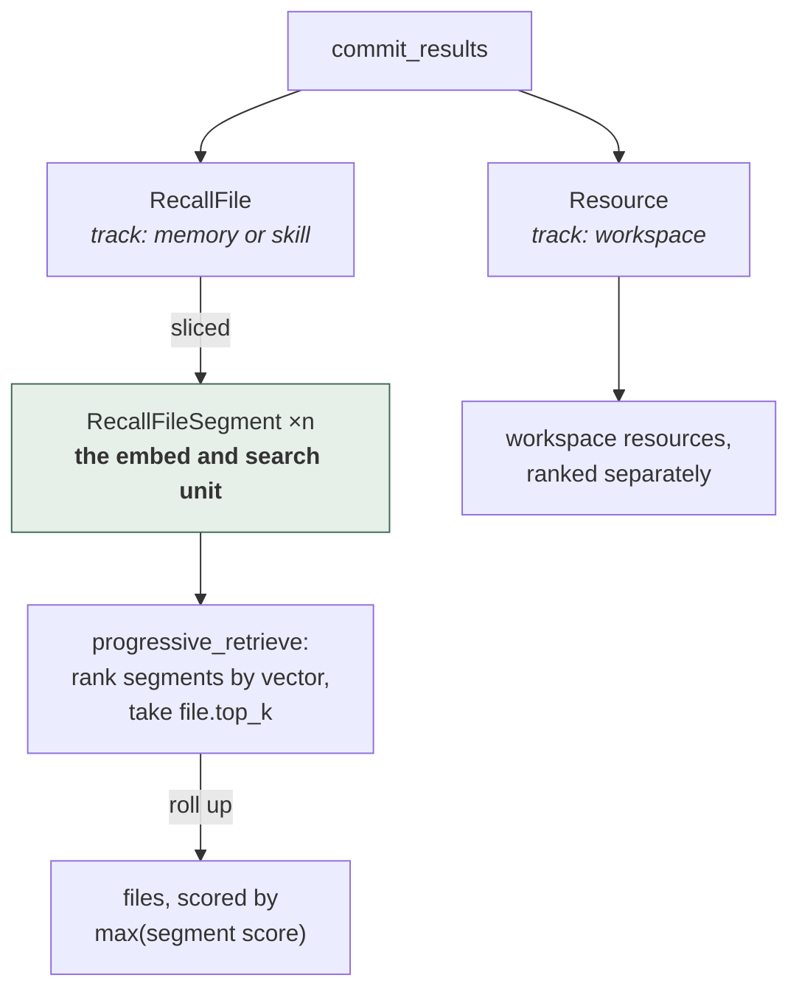

## 1. Executive Summary

memU is an Apache-2.0 Python system of roughly 10,000 lines, positioned as a
memory layer that plugs into existing coding agents — it ships host adapters for
Claude Code, Codex, Cursor, OpenClaw, Hermes, Cola and WorkBuddy, plus a generic
one.

The memory model is deliberately small: a `RecallFile` with a `track` of
`"memory"` or `"skill"`, sliced into `RecallFileSegment` rows, alongside
`Resource` records. What makes it worth reading is not the model but the
**discipline around it**, and three decisions in particular.

**The ranking unit and the return unit are different, deliberately.**

> "`segments`: `RecallFileSegment` slices ranked by embedding, `file.top_k` of
> them. `files`: the `RecallFile`s pointed to by those segments — **not a ranked
> search, just a roll-up**. Each file's score is the max score of the segments
> that point to it."

Most systems in this atlas embed and rank the thing they intend to return, which
forces one unit to be both a good search target and a good context payload.
Those are different jobs: a paragraph embeds well and reads badly out of context;
a file reads well and embeds into mush. memU ranks the small thing and returns
the big one, with max-of-segments as the file's score.

**Local and remote backends must order identically.**

> "Both backends order identically, so the two execution paths stay
> byte-for-byte the same."

A memory layer with a local mode and a hosted mode usually means two ranking
implementations that drift, and users who cannot reproduce a result across them.
Naming byte-for-byte parity as an invariant makes that a testable property rather
than an aspiration.

**The schema comments cite the decision records that produced them.** `RecallFileSegment`
is "a searchable slice (L2 item) of a `RecallFile` **(ADR 0007)**"; the paging
contract is "**ADR 0014**"; the choice not to force a track filter is "**ADR
0006**". [Atomic Agent](../atomic-agent/) cites numbered invariants from its
schema into a design document; memU does the same for decisions, which means a
reader asking "why is it like this" has a document to open rather than a
maintainer to find.

Reservations: this is a well-engineered retrieval and sync layer with **no
epistemic model at all** — no trust state, no provenance, no supersession, no
tombstone, and no scope beyond `where` filters. It knows how to find and move
memories, and nothing about whether they are true or whose they are.

## 2. Mental Model

A memory becomes retrievable and stops being retrievable, and that is the whole
state machine:



Segments are the search unit and files are the answer unit, with a file scored by
its **best** segment rather than its average — so one strong passage surfaces a
long file instead of being diluted by it.

There is no supersession, no rejection and no expiry. Re-slicing a file drops
and recreates its segments; the file itself is updated in place. Nothing records
that a memory was wrong, and nothing can express that it was.

## 3. Architecture

`src/memu/` — `agentic_backend.py` (the protocol), `app/` (service, agentic,
client pool, settings), `database/` (factory, interfaces, models, repositories,
and `sqlite`/`postgres`/`inmemory` implementations), `embedding/`, `vector.py`,
`hosts/` (per-agent adapters plus `bridging`, `retrieval`, `scheduling`,
`templates`), `cli.py`, `cloud.py`.

The protocol is three methods:

```python
class AgenticMemoryBackend(Protocol):
    """The three memory capabilities consumed by CLIs and host adapters."""
    async def list_all_recall_files(...) -> dict     # keyset page, opaque cursor
    async def progressive_retrieve(query, where) -> dict
    async def commit_results(recall_files, resource, user) -> dict
```

with the note that `MemoryService` "satisfies this protocol structurally for
local execution" and that "remote implementations can provide the same surface
without adding transport concerns to the local service composition root".

### Deployment and ergonomics

Runs against SQLite with no other service, or Postgres when you want one; an
in-memory backend exists for tests. Host adapters install into the agent you
already use, so adoption is per-agent configuration rather than a new runtime.
Embeddings need a provider.

The three-method protocol is the ergonomic centre: a host integration has three
things to implement or call, which is a much smaller contract than most systems
here expose.

## 4. Essential Implementation Paths

### Rank the slice, return the file

Splitting the search unit from the return unit is the transferable idea. The
roll-up rule — a file scores as the **max** of its segments, not the sum or the
mean — is the right default and worth stating: sum rewards long files for having
more chances to match, and mean punishes a file that contains one excellent
paragraph among many irrelevant ones. Max asks "does this file contain the best
answer", which is the question.

The segments are also explicitly **not ordered**:

> "Segments carry no ordinal: how a file is sliced is track-specific and not
> necessarily sequential, so position would not be informative."

Declining to store a field because it would be misleading, and writing down why,
is the kind of decision most schemas leave as an accident.

### A denormalization with its invariant written down

`track` is stored on the segment as well as the file, and the comment explains
both the reason and the safety argument:

> "denormalized here so retrieval can filter segments by track with a plain
> column predicate instead of a join. It is immutable for a segment's lifetime
> (segments are drop-and-recreated when a file is re-sliced), **so it never
> drifts from the file**."

Denormalized columns rot when nobody records what keeps them consistent. Here the
invariant — segments are never mutated, only replaced — is what makes the copy
safe, and it is stated next to the copy.

### Keyset pagination on domain identity

`list_all_recall_files` pages by `(track, name, id)` with an opaque
`next_cursor`, and the docstring explains the choice:

> "ordering on the domain identity `(track, name)` (unique within a scope,
> immutable under commit) is what makes that walk skip- and duplicate-free."

Offset pagination over a table that is being written to skips and repeats rows.
Keyset pagination on a stable, immutable key does not. For a memory store being
walked by an agent while a background process writes to it, that is a correctness
property rather than a performance one — and it is the sort of thing that is
invisible until a sync silently misses records.

### Retrieval that is explicitly not clever

> "Single-shot, LLM-free retrieval… **no intention routing, sufficiency checks,
> or summarization**."

Stating what a retrieval path deliberately does *not* do is unusual and useful.
It sets an expectation that reads as a design position rather than a missing
feature, and it means the latency and cost of a recall are predictable: one
embedding call, two ranked scans, no model in the loop.

The contrast with [Waku Agent](../waku-agent/) is instructive — Waku puts a small
model in front of retrieval to decide whether to retrieve at all; memU removes
models from the read path entirely. Both are defensible; neither is the
unexamined default of calling an LLM because it is there.

### Skills as a track, not a subsystem

A `RecallFile` is on the `"memory"` track or the `"skill"` track, and
`list_all_recall_files` deliberately does not force a track filter (ADR 0006), so
skills come back alongside memories.

Compare [OpenViking](../openviking/), which unifies memory, resources and skills
in one hierarchy, and the [skills as procedural memory](../../patterns/skills-as-procedural-memory/)
pattern. memU's version is the cheapest: one column, one shared retrieval path,
no second subsystem. What it gives up is the verified-execution gate that pattern
asks for — a skill here is a file, and nothing establishes that it works.

## 5. Memory Data Model

`BaseRecord` gives every row `id`, `created_at`, `updated_at`. `RecallFile` adds
`name`, `track`, `description`, `content`, `embedding`. `RecallFileSegment` adds
`recall_file_id`, `track`, `text`, `embedding`. `Resource` adds `url`,
`local_path`, `caption`, `embedding`, `track`.

What is absent is the whole rubric: no trust state, no provenance beyond
timestamps, no supersession or tombstone, no audit, no human review surface, no
scope key. The `where` filter is a query facility, not a boundary — nothing in
the model establishes who a record belongs to.

For a layer that installs into seven different coding agents, the absent scope
model is the notable one: memories from every host land in the same store, and
the separation between them is whatever the caller passes in `where`.

## 6. Retrieval Mechanics

One embedding of the query, segments ranked by vector similarity to `file.top_k`,
files rolled up by max segment score, workspace resources ranked separately to
`resource.top_k`. No lexical arm, no rerank, no fusion.

Vector-only retrieval carries the failure the
[hybrid retrieval fusion](../../patterns/hybrid-retrieval-fusion/) pattern
describes — exact identifiers and rare tokens are exactly what embeddings miss —
and for a memory serving coding agents, identifiers are a large fraction of what
gets asked about.

## 7. Write Mechanics

`commit_results` takes recall files, resources and user state together and writes
them in one call, which keeps a host adapter's write path to a single operation.
Re-slicing drops and recreates segments.

### Operational cost

The read path costs one embedding call and two scans — no LLM, so recall latency
is predictable and does not depend on a provider's queue. The write path is a
database write; whatever produced the memory content ran in the host, so the
model cost sits outside this layer.

There is no background rewrite of the store, so token burn does not scale with
corpus size — a consequence of having no consolidation, which is also why nothing
here improves memory over time.

## 8. Agent Integration

Adapters for Claude Code, Codex, Cursor, OpenClaw, Hermes, Cola and WorkBuddy,
plus `generic`, with `bridging`, `scheduling`, `templates` and `host_cli.py`
shared between them. This is among the broadest host coverage in the atlas,
alongside [ai-memory](../ai-memory/).

## 9. Reliability, Safety, and Trust

Strengths:

- **Search unit separated from return unit**, with max-of-segments as the
  roll-up.
- **Local and remote ordering parity** stated as an invariant.
- **Decision records cited from the schema**, so "why is it like this" is
  answerable.
- **A denormalization with its safety argument** written beside it.
- **Keyset pagination on immutable domain identity**, so a walk under concurrent
  writes neither skips nor repeats.
- **A three-method protocol**, small enough to implement remotely.
- **Explicitly LLM-free retrieval**, so recall cost and latency are predictable.
- **Skills as a track**, not a parallel subsystem.
- **Three storage backends** behind one repository interface.

Gaps:

- **No trust state, provenance, supersession, tombstone, or audit.**
- **No scope model**, in a layer that serves seven hosts from one store.
- **Vector-only retrieval**, in a domain full of exact identifiers.
- **No consolidation**, so memory does not improve and duplicates are not merged.
- **Skills are unverified files**, with no execution gate.

## 10. Tests, Evals, and Benchmarks

A `tests/` tree exists and the in-memory backend is built for it. Nothing was run
for this review, and no retrieval-quality benchmark was found.

The invariant the design most invites testing is its own: that the local and
remote paths order identically. That is deterministic, needs no judge, and is the
kind of property that silently breaks the first time one backend gains a tiebreak
the other lacks.

## 11. For Your Own Build

### Steal

- **Rank the slice, return the file.** Embedding and reading want different unit
  sizes, and forcing one unit to do both jobs makes retrieval worse at one of
  them.
- **Score a container by the max of its parts**, not the sum or mean — sum
  rewards length, mean punishes a good paragraph in a long document.
- **Page on immutable domain identity**, not offsets, when something walks the
  store while it is being written.
- **Write the invariant next to the denormalization.** A copied column is safe
  only because of a rule, and that rule should not live in someone's memory.
- **Say what your retrieval deliberately does not do.** "No intention routing,
  sufficiency checks, or summarization" sets an expectation and prevents a
  feature request from being read as a bug report.
- **Decline to store a field that would mislead**, and record why.
- **Cite the decision record from the schema comment.**

### Avoid

- **Serving many hosts from one store with no scope key.** `where` filters are a
  query facility, not a boundary, and the difference matters the first time two
  projects share a store.
- **Vector-only retrieval for coding agents**, where identifiers are a large
  share of queries.

### Fit

Right when you want one memory layer across several coding agents and you want
the read path cheap, predictable and model-free — the three-method protocol makes
that a small integration, and the engineering discipline is above the atlas
average. Wrong when memory has to be trusted, corrected, or separated: there is
no epistemic model here at all, and adding one later means adding a schema this
one deliberately does not have. Read it as a retrieval and sync layer that is
honest about being exactly that.

## 12. Open Questions

- Is the local/remote ordering parity tested, or only asserted in a docstring?
- What separates two hosts' memories in one store beyond a caller-supplied
  `where`?
- Does anything merge duplicate recall files, or does the store accumulate them?
- What establishes that a skill-track file works, given there is no execution
  gate?
- How are `file.top_k` and `resource.top_k` chosen?

## Appendix: File Index

- Protocol: `src/memu/agentic_backend.py` (`AgenticMemoryBackend`,
  `list_all_recall_files`, `progressive_retrieve`, `commit_results`).
- Retrieval: `src/memu/app/agentic.py` (`progressive_retrieve`,
  `_recall_segments`, `_collect_files`, `_recall_resources`).
- Model: `src/memu/database/models.py` (`BaseRecord`, `Resource`, `RecallFile`,
  `RecallFileSegment`).
- Repositories and backends: `src/memu/database/repositories/`,
  `sqlite/`, `postgres/`, `inmemory/`.
- Host adapters: `src/memu/hosts/` (`claude_code`, `codex`, `cursor`,
  `openclaw`, `hermes`, `cola`, `workbuddy`, `generic`, `bridging`).
