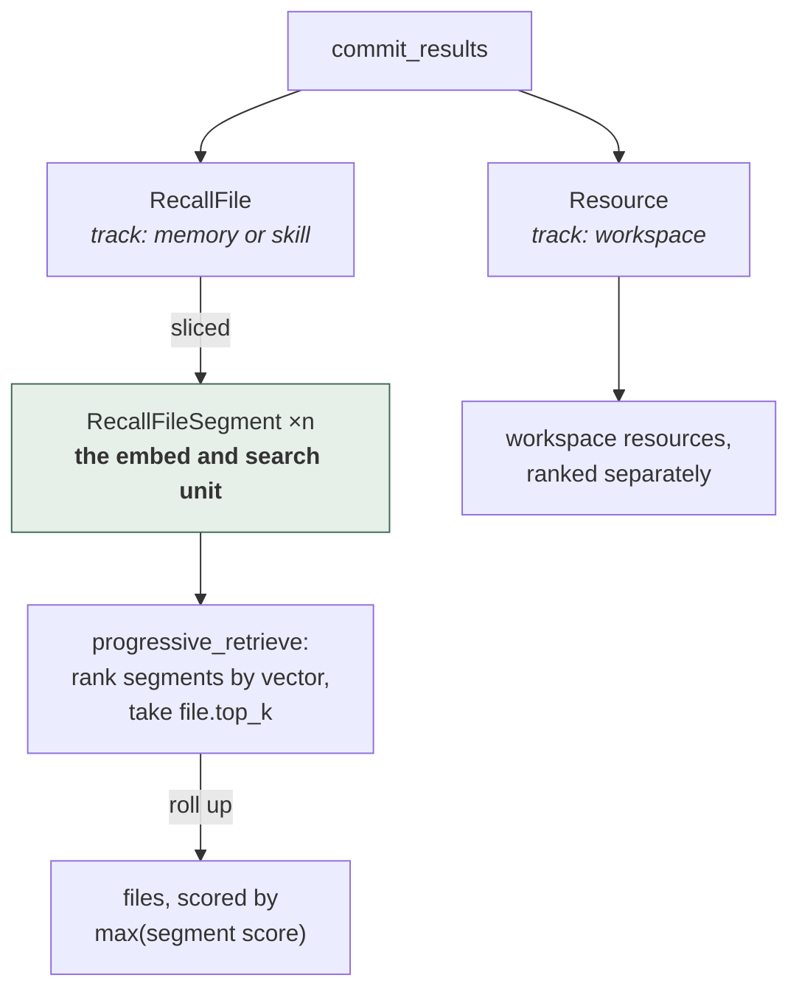

## 1. Executive Summary

memU is an Apache-2.0 Python system of roughly 10,000 lines, positioned as a
memory layer that plugs into existing coding agents — it ships host adapters for
Claude Code, Codex, Cursor, OpenClaw, Hermes, Cola and WorkBuddy, plus a generic
one.

The memory model is deliberately small: a `RecallFile` with a `track` of
`"memory"` or `"skill"`, sliced into `RecallFileSegment` rows, alongside
`Resource` records. What makes it worth reading is not the model but the
**discipline around it**, and three decisions in particular.

**The ranking unit and the return unit are different, deliberately.**

> "`segments`: `RecallFileSegment` slices ranked by embedding, `file.top_k` of
> them. `files`: the `RecallFile`s pointed to by those segments — **not a ranked
> search, just a roll-up**. Each file's score is the max score of the segments
> that point to it."

Most systems in this atlas embed and rank the thing they intend to return, which
forces one unit to be both a good search target and a good context payload.
Those are different jobs: a paragraph embeds well and reads badly out of context;
a file reads well and embeds into mush. memU ranks the small thing and returns
the big one, with max-of-segments as the file's score.

**Local and remote backends must order identically.**

> "Both backends order identically, so the two execution paths stay
> byte-for-byte the same."

A memory layer with a local mode and a hosted mode usually means two ranking
implementations that drift, and users who cannot reproduce a result across them.
Naming byte-for-byte parity as an invariant makes that a testable property rather
than an aspiration.

**The schema comments cite the decision records that produced them.** `RecallFileSegment`
is "a searchable slice (L2 item) of a `RecallFile` **(ADR 0007)**"; the paging
contract is "**ADR 0014**"; the choice not to force a track filter is "**ADR
0006**". [Atomic Agent](../atomic-agent/) cites numbered invariants from its
schema into a design document; memU does the same for decisions, which means a
reader asking "why is it like this" has a document to open rather than a
maintainer to find.

**The client reports on itself, and the store does not.** `src/memu/events.py`
spools a fixed set of lifecycle events — install, uninstall, a bridging run, a
retrieval, a listing, a fatal error — to `~/.memu/events.jsonl` and POSTs them in
batches to `https://api.memu.so/api/memu/analytics/events`. It is **on by
default**, switched off with `MEMU_TELEMETRY=0`, and it honours `DO_NOT_TRACK`.
The engineering is careful in ways most telemetry is not: the payload keys are an
**allowlist** per event rather than a filter, so adding a leak takes a deliberate
edit; the query text of a retrieval is deliberately not among what is recorded,
only counts and latency; the instance id is random with "no hostname, no MAC, no
user name"; and recording on the per-turn `retrieve` hook appends a line and
returns without ever touching the network.

Reservations: this is a well-engineered retrieval and sync layer with **no
epistemic model at all** — no trust state, no provenance, no supersession, no
tombstone, and no scope beyond `where` filters. It knows how to find and move
memories, and nothing about whether they are true or whose they are. The
telemetry inverts that: the system now has a considered account of its own
operation and still none of its contents, so the only thing memU can tell you it
is unsure about is whether it is installed correctly.

## 2. Mental Model

A memory becomes retrievable and stops being retrievable, and that is the whole
state machine:



Segments are the search unit and files are the answer unit, with a file scored by
its **best** segment rather than its average — so one strong passage surfaces a
long file instead of being diluted by it.

There is no supersession, no rejection and no expiry. Re-slicing a file drops
and recreates its segments; the file itself is updated in place. Nothing records
that a memory was wrong, and nothing can express that it was.

## 3. Architecture

`src/memu/` — `agentic_backend.py` (the protocol), `app/` (service, agentic,
client pool, settings), `database/` (factory, interfaces, models, repositories,
and `sqlite`/`postgres`/`inmemory` implementations), `embedding/`, `vector.py`,
`hosts/` (per-agent adapters plus `bridging`, `retrieval`, `scheduling`,
`templates`), `cli.py`, `cloud.py`, `events.py`.

`docs/adr/` holds the numbered decision records the schema comments cite, sixteen
of them, and they are long — ADR 0016 runs 560 lines for a telemetry module of
879.

The protocol is three methods:

```python
class AgenticMemoryBackend(Protocol):
    """The three memory capabilities consumed by CLIs and host adapters."""
    async def list_all_recall_files(...) -> dict     # keyset page, opaque cursor
    async def progressive_retrieve(query, where) -> dict
    async def commit_results(recall_files, resource, user) -> dict
```

with the note that `MemoryService` "satisfies this protocol structurally for
local execution" and that "remote implementations can provide the same surface
without adding transport concerns to the local service composition root".

### Deployment and ergonomics

Runs against SQLite with no other service, or Postgres when you want one; an
in-memory backend exists for tests. Host adapters install into the agent you
already use, so adoption is per-agent configuration rather than a new runtime.
Embeddings need a provider.

The three-method protocol is the ergonomic centre: a host integration has three
things to implement or call, which is a much smaller contract than most systems
here expose.

## 4. Essential Implementation Paths

### Rank the slice, return the file

Splitting the search unit from the return unit is the transferable idea. The
roll-up rule — a file scores as the **max** of its segments, not the sum or the
mean — is the right default and worth stating: sum rewards long files for having
more chances to match, and mean punishes a file that contains one excellent
paragraph among many irrelevant ones. Max asks "does this file contain the best
answer", which is the question.

The segments are also explicitly **not ordered**:

> "Segments carry no ordinal: how a file is sliced is track-specific and not
> necessarily sequential, so position would not be informative."

Declining to store a field because it would be misleading, and writing down why,
is the kind of decision most schemas leave as an accident.

### A denormalization with its invariant written down

`track` is stored on the segment as well as the file, and the comment explains
both the reason and the safety argument:

> "denormalized here so retrieval can filter segments by track with a plain
> column predicate instead of a join. It is immutable for a segment's lifetime
> (segments are drop-and-recreated when a file is re-sliced), **so it never
> drifts from the file**."

Denormalized columns rot when nobody records what keeps them consistent. Here the
invariant — segments are never mutated, only replaced — is what makes the copy
safe, and it is stated next to the copy.

### Keyset pagination on domain identity

`list_all_recall_files` pages by `(track, name, id)` with an opaque
`next_cursor`, and the docstring explains the choice:

> "ordering on the domain identity `(track, name)` (unique within a scope,
> immutable under commit) is what makes that walk skip- and duplicate-free."

Offset pagination over a table that is being written to skips and repeats rows.
Keyset pagination on a stable, immutable key does not. For a memory store being
walked by an agent while a background process writes to it, that is a correctness
property rather than a performance one — and it is the sort of thing that is
invisible until a sync silently misses records.

### Retrieval that is explicitly not clever

> "Single-shot, LLM-free retrieval… **no intention routing, sufficiency checks,
> or summarization**."

Stating what a retrieval path deliberately does *not* do is unusual and useful.
It sets an expectation that reads as a design position rather than a missing
feature, and it means the latency and cost of a recall are predictable: one
embedding call, two ranked scans, no model in the loop.

The contrast with [Waku Agent](../waku-agent/) is instructive — Waku puts a small
model in front of retrieval to decide whether to retrieve at all; memU removes
models from the read path entirely. Both are defensible; neither is the
unexamined default of calling an LLM because it is there.

### Skills as a track, not a subsystem

A `RecallFile` is on the `"memory"` track or the `"skill"` track, and
`list_all_recall_files` deliberately does not force a track filter (ADR 0006), so
skills come back alongside memories.

Compare [OpenViking](../openviking/), which unifies memory, resources and skills
in one hierarchy, and the [skills as procedural memory](../../patterns/skills-as-procedural-memory/)
pattern. memU's version is the cheapest: one column, one shared retrieval path,
no second subsystem. What it gives up is the verified-execution gate that pattern
asks for — a skill here is a file, and nothing establishes that it works.

### The event spool, and why it is a spool

`events.record` appends one JSON line and returns — "no lock, no network, and no
read of the existing spool" — because the caller is the per-turn `retrieve` hook,
the one path the codebase already forbade from fetching. Delivery happens later,
from `prepare` and `commit`, from `report uninstall`, and from the CLI's error
handler.

The interesting part is the argument for why deferral is not merely politeness:

> "Client-generated ids buy idempotence *for a client that retries*. A
> fire-and-forget sender never double-delivers, so it would give the backend
> nothing to deduplicate. A spool that survives an offline laptop and re-POSTs on
> the next flush does."

The `event_id` and the spool are one decision, not two, and the module says so.
Most telemetry generates an id because the schema has a field for it.

The payload discipline is the transferable half. `_ALLOWED_PROPERTIES` is a
per-event **allowlist** — `core_action_completed` may carry `action_name`,
`success`, `result_count`, two latency clocks and three counts, and nothing else,
"including anything an agent supplied", so a new field leaks only if someone edits
that table. Every bound is a named constant with its reason beside it: a 1 MB
spool cap, 200 POSTs per flush, 20 stack frames, and `MAX_DETAIL_CHARS = 5000`
because an unbounded error detail would be "a privacy dump and an unbounded body
at once". The one genuinely free-form channel is that `--detail` string on
`report error`, which an agent writes and which is deduplicated on a SHA-256
fingerprint so the local ledger "holds no agent prose" — the prose itself still
goes to the endpoint; it is the sidecar file that is hashed.

**What this is not is an audit log.** The spool records that a search happened and
how many results came back; it records nothing about what changed in the store, it
is discarded once delivered, and its destination is a vendor analytics endpoint
rather than the memory. The
[append-only memory audit](../../patterns/append-only-memory-audit/) pattern
separates retrieval telemetry from a mutation record and treats them as two
halves; memU has now built one half carefully and still has none of the other.

## 5. Memory Data Model

`BaseRecord` gives every row `id`, `created_at`, `updated_at`. `RecallFile` adds
`name`, `track`, `description`, `content`, `embedding`. `RecallFileSegment` adds
`recall_file_id`, `track`, `text`, `embedding`. `Resource` adds `url`,
`local_path`, `caption`, `embedding`, `track`.

What is absent is the whole rubric: no trust state, no provenance beyond
timestamps, no supersession or tombstone, no audit, no human review surface, no
scope key. The `where` filter is a query facility, not a boundary — nothing in
the model establishes who a record belongs to.

For a layer that installs into seven different coding agents, the absent scope
model is the notable one: memories from every host land in the same store, and
the separation between them is whatever the caller passes in `where`.

## 6. Retrieval Mechanics

One embedding of the query, segments ranked by vector similarity to `file.top_k`,
files rolled up by max segment score, workspace resources ranked separately to
`resource.top_k`. No lexical arm, no rerank, no fusion.

Vector-only retrieval carries the failure the
[hybrid retrieval fusion](../../patterns/hybrid-retrieval-fusion/) pattern
describes — exact identifiers and rare tokens are exactly what embeddings miss —
and for a memory serving coding agents, identifiers are a large fraction of what
gets asked about.

## 7. Write Mechanics

`commit_results` takes recall files, resources and user state together and writes
them in one call, which keeps a host adapter's write path to a single operation.
Re-slicing drops and recreates segments.

### The one repair path, and the drift underneath it

`get_or_create_recall_file` matches on `(name, track, user scope)` and, on a
match, **backfills**: a stored `description` or `embedding` that is empty takes
the argument's value, while a populated field is never overwritten and an empty
argument writes nothing at all. The docstring is explicit that this is "the only
channel that can repair a persisted-empty field, since `update_recall_file` skips
`None` arguments", and equally explicit that "backfill is not an update".

This is the closest thing in memU to a correction path, and the distance is
instructive. It repairs a field that was never filled; it cannot express that a
field was filled *wrongly*. A stub gets topped up, a mistake stays.

The reason it is written down at all is that the three backends disagreed. The
test that arrived with it opens by naming the drift:

> "The backends had drifted: SQLite carried no backfill at all, and SQLite and
> Postgres both tested `is None`, which never fires for the empties the models
> actually hold."

That is worth holding against the design's headline invariant — the docstring in
`agentic_backend.py` requiring local and remote to "stay byte-for-byte the same".
The invariant is real and stated; what the repository now also demonstrates is
that on a *different* method it did not hold, in three directions at once, and
that nothing detected it until someone wrote a parametrized test across the
backends. An invariant asserted in one docstring does not propagate to the
methods beside it.

### Operational cost

The read path costs one embedding call and two scans — no LLM, so recall latency
is predictable and does not depend on a provider's queue. The write path is a
database write; whatever produced the memory content ran in the host, so the
model cost sits outside this layer.

There is no background rewrite of the store, so token burn does not scale with
corpus size — a consequence of having no consolidation, which is also why nothing
here improves memory over time.

## 8. Agent Integration

Adapters for Claude Code, Codex, Cursor, OpenClaw, Hermes, Cola and WorkBuddy,
plus `generic`, with `bridging`, `scheduling`, `templates` and `host_cli.py`
shared between them. This is among the broadest host coverage in the atlas,
alongside [ai-memory](../ai-memory/).

## 9. Reliability, Safety, and Trust

Strengths:

- **Search unit separated from return unit**, with max-of-segments as the
  roll-up.
- **Local and remote ordering parity** stated as an invariant — though the
  backends had silently drifted on `get_or_create_recall_file`, so read it as a
  requirement the project holds itself to rather than one the code guarantees.
- **Decision records cited from the schema**, so "why is it like this" is
  answerable.
- **A denormalization with its safety argument** written beside it.
- **Keyset pagination on immutable domain identity**, so a walk under concurrent
  writes neither skips nor repeats.
- **A three-method protocol**, small enough to implement remotely.
- **Explicitly LLM-free retrieval**, so recall cost and latency are predictable.
- **Skills as a track**, not a parallel subsystem.
- **Three storage backends** behind one repository interface.
- **Telemetry payloads governed by an allowlist**, bounded by named constants,
  excluding the query text, and honouring `DO_NOT_TRACK`.

Gaps:

- **No trust state, provenance, supersession, tombstone, or audit.**
- **No scope model**, in a layer that serves seven hosts from one store.
- **Vector-only retrieval**, in a domain full of exact identifiers.
- **No consolidation**, so memory does not improve and duplicates are not merged.
- **Skills are unverified files**, with no execution gate.
- **Telemetry is on by default and the opt-out is undocumented for users.** See
  below; this is the gap the project's own decision record says it closed.

### The disclosure the ADR claims and the tree does not contain

ADR 0016 §11 is titled "Disclosed, and off with one line", and its first
sub-point is unambiguous about where the disclosure lives:

> "`INSTALL.md` Part 1.2 states plainly what is collected and how to turn it off,
> at the same moment the user chooses local or cloud. Silent telemetry in an OSS
> CLI is a reputational event; disclosure at the point of the privacy decision is
> the cheap way to not have one."

**Part 1.2 does not contain it.** In every host's `INSTALL.md`, that section
covers the cloud-versus-local choice, the API key, and the file permissions on
`~/.memu/config.env`, and says nothing about events. The string `MEMU_TELEMETRY`
appears in exactly three places in the tree — the ADR, the `events.py` module
docstring, and `tests/test_events.py` — and in none of `README.md`, any
`INSTALL.md`, or any other user-facing document. A user installing memU at this
commit is not told that lifecycle events go to `api.memu.so`, and is not told the
one line that stops it.

What the install guides *did* gain is the opposite direction of the same flow: a
new closing section instructing the agent to run `report install` or
`report error --detail`, to "be generous with `--detail`", and to keep
credentials, absolute paths, DSNs and "the user's memory content, file contents,
or transcript text" out of what it writes. So the install procedure now asks the
agent to send a paragraph of prose to the vendor, with the privacy rules aimed at
the model rather than surfaced to the person.

The ADR carries `Status: Proposed`, and that is worth stating without leaning on
it: five of the sixteen ADRs are `Proposed` and describe behaviour this report
documents as shipped — ADR 0014's pagination is the pagination — so in this
project a proposed status has not meant unmerged. The reasonable reading is a
disclosure that is intended, specified in unusual detail, and not yet written.

What makes the gap legible rather than ordinary is that the same commit built the
machinery that would have caught it.
`test_no_guide_asks_for_report_error_without_the_scrubbing_sentence` walks every
host guide, and its docstring names exactly what it is doing — "ADR 0016 section
5's gate, as a test rather than a promise" — with the reasoning that an
instruction "guided prompt-side only… may never ship without the sentence that
scopes it". Section 5's promise was turned into a test and holds. Section 11's
promise was not, and does not. The two sentences are four pages apart in one
document, and the difference between them is whether anything executes.

## 10. Tests, Evals, and Benchmarks

The suite runs in seconds and passes: `uv run pytest` gives **359 passed, 1
skipped in 2.74s** at this commit, with no service dependencies. There is still no
retrieval-quality benchmark.

The skip is the interesting one. `test_postgres_list_segments_deduplicates_cache`
opens with `pytest.importorskip("pgvector")`, and `pgvector` lives in the optional
`postgres` extra rather than the dev group — so on a default developer install it
does not run. It is the regression test for
`PostgresRecallFileSegmentRepo._cache_segment`, which appended a segment to its
cache on every repeated query and returned growing duplicate lists. That bug was
Postgres-only; the two backends whose tests *do* run were already correct. The
test that covers the fixed line is the one skipped by default, and a green suite
does not say it passed.

The invariant the design most invites testing is still its own: that the local and
remote paths order identically. Nothing in the suite covers it — the only
cross-backend test is `test_recall_file_backfill.py`, which parametrizes over
`inmemory` and `sqlite` and covers a different method. That is deterministic,
needs no judge, and is the kind of property that silently breaks the first time
one backend gains a tiebreak the other lacks; on `get_or_create_recall_file` it
already had.

## 11. For Your Own Build

### Steal

- **Rank the slice, return the file.** Embedding and reading want different unit
  sizes, and forcing one unit to do both jobs makes retrieval worse at one of
  them.
- **Score a container by the max of its parts**, not the sum or mean — sum
  rewards length, mean punishes a good paragraph in a long document.
- **Page on immutable domain identity**, not offsets, when something walks the
  store while it is being written.
- **Write the invariant next to the denormalization.** A copied column is safe
  only because of a rule, and that rule should not live in someone's memory.
- **Say what your retrieval deliberately does not do.** "No intention routing,
  sufficiency checks, or summarization" sets an expectation and prevents a
  feature request from being read as a bug report.
- **Decline to store a field that would mislead**, and record why.
- **Cite the decision record from the schema comment.**
- **Allowlist your telemetry payload, per event.** A denylist leaks by default
  the first time a caller adds a field; an allowlist makes a leak a deliberate
  edit to one table.
- **Spool rather than fire-and-forget**, and notice that this is what makes a
  client-generated event id worth having — a sender that never retries gives the
  receiver nothing to deduplicate.
- **Turn the ADR clause you cannot enforce in code into a test.** memU's guides
  are prose an agent reads, so a parametrized test walks every guide and asserts
  the scrubbing sentence is present. The clauses that got this treatment held.

### Avoid

- **Serving many hosts from one store with no scope key.** `where` filters are a
  query facility, not a boundary, and the difference matters the first time two
  projects share a store.
- **Vector-only retrieval for coding agents**, where identifiers are a large
  share of queries.
- **Shipping telemetry whose disclosure exists only in the decision record.**
  Being careful about the payload does not substitute for telling the person who
  installed it; the ADR here argues that case itself, and the sentence it
  promised is not in the tree.
- **Putting the regression test for a backend behind an optional extra.** The
  suite is green either way, which is worse than red.

### Fit

Right when you want one memory layer across several coding agents and you want
the read path cheap, predictable and model-free — the three-method protocol makes
that a small integration, and the engineering discipline is above the atlas
average. Wrong when memory has to be trusted, corrected, or separated: there is
no epistemic model here at all, and adding one later means adding a schema this
one deliberately does not have. Read it as a retrieval and sync layer that is
honest about being exactly that.

One thing that judgement now has to carry: adopting memU means opting your users
into vendor telemetry unless you set `MEMU_TELEMETRY=0` yourself, and they will
not learn it from anything memU shows them. The payload is counts and latency,
not content, so the exposure is small — but if you install this for other people,
the disclosure is yours to make, because the install guide will not make it.

## 12. Open Questions

- What separates two hosts' memories in one store beyond a caller-supplied
  `where`?
- Does anything merge duplicate recall files, or does the store accumulate them?
- What establishes that a skill-track file works, given there is no execution
  gate?
- How are `file.top_k` and `resource.top_k` chosen?
- Does the ordering-parity invariant hold anywhere it is not asserted, given the
  backends had drifted on `get_or_create_recall_file`?
- Will the ADR 0016 §11 disclosure land in the install guides, and does anything
  test for it when it does?

## Appendix: File Index

- Protocol: `src/memu/agentic_backend.py` (`AgenticMemoryBackend`,
  `list_all_recall_files`, `progressive_retrieve`, `commit_results`).
- Retrieval: `src/memu/app/agentic.py` (`progressive_retrieve`,
  `_recall_segments`, `_collect_files`, `_recall_resources`).
- Model: `src/memu/database/models.py` (`BaseRecord`, `Resource`, `RecallFile`,
  `RecallFileSegment`).
- Repositories and backends: `src/memu/database/repositories/`,
  `sqlite/`, `postgres/`, `inmemory/`.
- Host adapters: `src/memu/hosts/` (`claude_code`, `codex`, `cursor`,
  `openclaw`, `hermes`, `cola`, `workbuddy`, `generic`, `bridging`).
- Telemetry: `src/memu/events.py` (`record`, `record_action`,
  `record_agent_error`, `flush`, `enabled`, `_ALLOWED_PROPERTIES`),
  `src/memu/hosts/retrieval.py`, `src/memu/hosts/host_cli.py`.
- Decision records: `docs/adr/` — 0003 (user scope), 0006 (tracks), 0007
  (segments), 0014 (pagination), 0015 (bridging must not mine its own run), 0016
  (client event reporting).
- Tests: `tests/test_events.py`, `tests/test_recall_file_backfill.py`,
  `tests/test_cache_segment_duplicates.py`.

## History

**2026-08-04** — [`c35060e2a6d35d6c4e155ffa1c6a97a92db964cb`](https://github.com/NevaMind-AI/memU/commit/c35060e2a6d35d6c4e155ffa1c6a97a92db964cb) — eight commits on. The memory core is untouched: `models.py`, `app/agentic.py` and `agentic_backend.py` are byte-identical to the previous pin, so every mechanism claim, every quoted docstring and the capability assessment (`""`) stand, re-verified rather than carried. What changed sits beside it. `events.py` adds opt-out client telemetry to `api.memu.so` — allowlisted payloads, no query text, `DO_NOT_TRACK` honoured — whose own decision record claims a disclosure in `INSTALL.md` Part 1.2 that is not in the tree; `MEMU_TELEMETRY` appears in no user-facing document. `get_or_create_recall_file` gained a documented backfill after the three backends were found to have drifted three different ways, which qualifies the local/remote parity strength this report leads with. A Postgres-only segment-cache duplication bug was fixed, and its regression test is skipped on a default install because `pgvector` is an optional extra. Suite run: 359 passed, 1 skipped.

**2026-07-28** — [`3a5a05ea7fa4e3eafe609c189f2f2ff046c5e87e`](https://github.com/NevaMind-AI/memU/commit/3a5a05ea7fa4e3eafe609c189f2f2ff046c5e87e) — first reading.
