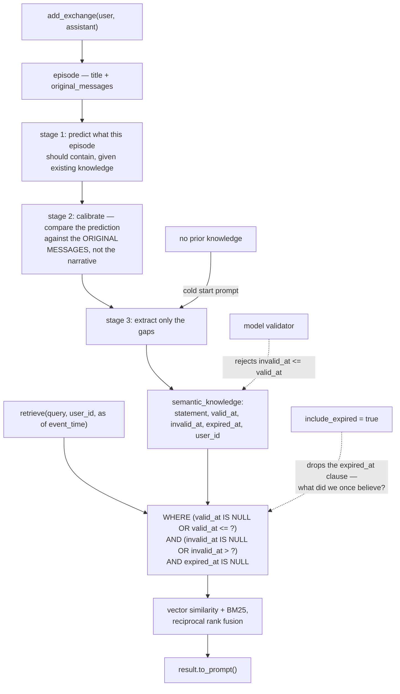

## 1. Executive Summary

memv is an Apache-licensed Python memory library — SQLite or Postgres, hybrid
retrieval, pluggable LLM and embedding adapters — with a single organising idea
stated in its first line:

> "Most memory systems extract everything and rely on retrieval to filter it.
> memv extracts only what the model **failed to predict** — importance emerges
> from prediction error, not upfront scoring."

**That is a genuinely different answer to the hardest question in this atlas.**
Almost every system here decides what to store by asking a model to *score*
importance, or by storing everything and hoping the ranker copes. Both fail the
same way: an LLM asked "how important is this?" has no reference point, so it
either flags everything or flags what sounds dramatic.

`PredictCalibrateExtractor` gives it a reference point. The loop, from the
docstring:

> "1. Predict what the episode should contain (given existing knowledge)
> 2. Compare prediction vs actual episode
> 3. Extract only what we FAILED to predict"

If the model, knowing what it already knows, can guess what the conversation
said, that content adds nothing. What survives is the surprise — which is what
"important" should have meant all along. The idea is credited to
[Nemori](https://arxiv.org/abs/2508.03341) and the citation is in the module
docstring, not just the README.

**And there is a discipline note inside it worth as much as the mechanism:**

> "Episode content is for RETRIEVAL (narrative is fine)
> Extraction source is ONLY original messages (ground truth)"

The episode's narrative summary is used to *find* things and never to *extract*
from. So a summarisation error can degrade recall but cannot become a stored
fact. Separating the lossy representation from the authoritative one, and saying
which is which at the top of the extractor, is the kind of boundary most
pipelines blur.

**The second mechanism is the cleanest bitemporal implementation in the atlas** —
section 5.

## 2. Mental Model

Exchanges become episodes. Each episode is compared against what is already
known; only the unpredicted part becomes knowledge. Knowledge carries both when
it was true and when the system stopped believing it, and queries can ask as of
either.



## 3. Architecture

`src/memv/` splits into `processing` (extraction, prompts), `memory` (the
pipeline), `storage` (SQLite and Postgres), `retrieval`, `embeddings`, `llm`,
`mcp`, `dashboard`, `cache`, `models`, `protocols`, `config`.

`protocols.py` defines `LLMClient` and the embedding interface, and the adapters
are separate — `OpenAIEmbedAdapter`, `PydanticAIAdapter("openai:gpt-4o-mini")` —
so the model choices are constructor arguments rather than configuration
sprawl. The quick start is nine lines and includes both adapters explicitly,
which is honest about what the library needs.

12,000 lines of Python, 15 test files, an mkdocs site, and a `notes/`
directory.

## 4. Essential Implementation Paths

**Extract** — `src/memv/processing/extraction.py` (the Nemori citation `:1-6`,
`PredictCalibrateExtractor` and its flow `:34-47`, `extract` `:52-75`,
`_predict` `:77`), `src/memv/processing/prompts.py`
(`prediction_prompt`, `extraction_prompt_with_prediction`,
`cold_start_extraction_prompt`).

**Query as of a time** — `src/memv/storage/sqlite/_knowledge.py` (the as-of
predicates `:78-93`, the user-scoped reads `:108-122`).

**Guard the interval** — `src/memv/models.py` (`check_temporal_range`
`:123-127`, the validity checks `:64`, `:100`).

## 5. Memory Data Model

`semantic_knowledge` carries a `statement`, a `user_id`, and **three time
columns doing two jobs**:

- `valid_at` / `invalid_at` — when the fact was true in the world.
- `expired_at` — when the system stopped believing it.

The read is the textbook form:

```sql
WHERE (valid_at IS NULL OR valid_at <= ?)
  AND (invalid_at IS NULL OR invalid_at > ?)
  AND expired_at IS NULL
```

with `include_expired` dropping the last clause. So "what was true on this date"
and "what did we once believe" are different questions with different answers,
both askable. That is what the `bitemporal` mark certifies, and this
implementation is cleaner than most — the two dimensions are separate columns
with separate semantics rather than one timestamp doing double duty.

A `check_temporal_range` model validator rejects `invalid_at <= valid_at`, so an
interval that ends before it begins cannot be stored. Small, and it is the
invariant a bitemporal store most often loses.

There is no status enum and no tombstone. `expired_at` is the withdrawal
mechanism, and it is a timestamp rather than a reason — so the store knows *when*
it stopped believing something and not *why*.

## 6. Retrieval Mechanics

Vector similarity plus BM25 fused by reciprocal rank, over the as-of filtered
set, scoped by `user_id = ?` — a stored key on the read path, earning
`scope_enforced`.

Filtering by validity *before* ranking is the right order: a system that ranks
first and filters after can return five results and show two.

`result.to_prompt()` as the retrieval surface — returning something formatted for
injection rather than a raw row list — is a small API decision that prevents
every caller inventing its own serialisation.

## 7. Write Mechanics

`add_exchange` then `process(user_id)` — capture is cheap and synchronous,
extraction is a separate call. Splitting them means the expensive predict-then-
calibrate pass can be batched or deferred without blocking the conversation.

The cold-start path is handled explicitly: with no existing knowledge there is
nothing to predict against, so a separate prompt uses the episode content plus
the original messages. A predict-calibrate system that did not special-case its
empty state would extract nothing from the first conversation.

## 8. Agent Integration

A Python library first — `uv add memvee` — with an MCP surface and a dashboard
beside it. `async with memory:` as the lifecycle and `await memory.process(...)`
as the explicit extraction trigger make the cost visible in the calling code
rather than hidden in a background thread.

## 9. Reliability, Safety, and Trust

**Two marks: bitemporal and scope enforced.**

**Trust state — withheld.** `expired_at` withholds a statement from the default
read, which is close, and it is a timestamp rather than a discrete status with a
reason; nothing distinguishes "expired because superseded" from "expired because
refuted", which is the distinction [cortex-engine](../cortex-engine/) makes the
case for.

**Tombstone, audit log, human review, negative eval — no.**

**The risk is that the whole design rests on an unmeasured judgement.** Prediction
error decides what is stored, so a prediction that is too good silently discards
real information, and a prediction that is too poor stores everything the system
was built to avoid storing. Nothing in the tree measures the extraction rate, the
false-discard rate, or how either moves with the prediction model — and the
cheaper the prediction model, the more it will fail to predict, so the storage
volume is coupled to a model choice the library leaves to the caller.

That is not an argument against the idea. It is the measurement the idea needs,
and [AgentWorkingMemory](../agent-working-memory/)'s `discardRegret` — counting
the near-discards that were later accessed — is the shape it would take.

## 10. Tests, Evals, and Benchmarks

**A LongMemEval harness with no committed results.** `benchmarks/longmemeval/`
holds `run.py`, `add.py`, `search.py`, `evaluate.py`, `dataset.py`, `config.py`
and a `_checkpoint.py` — the checkpointing is the detail that says someone
actually ran it, since nobody builds resume logic for a benchmark they intend to
run once. `benchmarks/results/` exists and is empty in the tree.

So the harness is real, the intent is real, and a reader cannot see a number. For
a project whose central claim is that a *different extraction criterion* produces
better memory, the comparison that matters — predict-calibrate against
extract-everything, on the same corpus with the same retriever — is exactly what
this harness could produce, and it would be a genuine contribution rather than
another leaderboard row.

15 test files against 12,000 lines.

**I ran nothing.**

## 11. For Your Own Build

### Steal

- **Decide what to store by what you failed to predict.** Ask the model what the
  episode should contain given what you already know, compare against the actual,
  keep the gap. An importance score has no reference point; a prediction error
  does.
- **Extract only from the original messages, never from your own summary.** "Episode
  content is for RETRIEVAL (narrative is fine); extraction source is ONLY original
  messages (ground truth)" — so a summarisation error costs you recall and cannot
  become a stored fact.
- **Special-case the cold start.** With no prior knowledge there is nothing to
  predict against; a separate prompt is required or the first conversation
  yields nothing.
- **Separate valid time from belief time as two columns, and query both.**
  `valid_at`/`invalid_at` for when it was true, `expired_at` for when you stopped
  believing it, with an `include_expired` switch. "What was true then" and "what
  did we think then" are different questions.
- **Reject an interval that ends before it starts.** A model validator on
  `invalid_at <= valid_at` costs one function and catches the commonest
  bitemporal data defect.
- **Filter by validity before ranking, not after.** Otherwise you ask for five
  results and show two.
- **Split capture from extraction.** `add_exchange` then `process` means the
  expensive pass is deferrable and its cost is visible at the call site.
- **Return something formatted for injection.** `result.to_prompt()` stops every
  caller inventing a serialisation.
- **Cite the paper in the module, not the README.** The Nemori reference sits
  above the class that implements it.

### Avoid

- **Do not leave the criterion unmeasured.** Prediction error decides everything
  stored; too-good a prediction discards real information and too-poor a one
  stores everything. Nothing measures the rate, and it moves with whichever model
  the caller passes in.
- **Do not build a checkpointed benchmark harness and commit no results.** The
  comparison this project needs — predict-calibrate against extract-everything on
  one corpus — is the one its own harness is built to run.
- **Do not let `expired_at` carry the reason.** A timestamp records when belief
  ended and not whether the fact was superseded or refuted.

### Fit

The right choice if you are building on a Python stack and want an extraction
criterion with an actual argument behind it rather than an importance prompt.
The bitemporal store is well-built and would be worth the dependency on its own.

`processing/extraction.py` is worth reading whatever you build — it is 200-odd
lines and it reframes the storage decision in a way most of this atlas has not
considered.

## 12. Open Questions

- **What fraction of exchanges survive extraction?** The rate is the design's
  central parameter and is unmeasured.
- **How does the extraction rate move with the prediction model?** A weaker
  predictor stores more, by construction.
- **Has the LongMemEval harness been run?** `_checkpoint.py` suggests yes; no
  results are committed.
- **What sets `expired_at`?** The column is queried; the writer was not traced.

## Appendix: File Index

**Extraction** — `src/memv/processing/extraction.py` (the Nemori citation and
framing `:1-6`, `ExtractionResponse` `:28-32`, `PredictCalibrateExtractor` with
the three-stage flow and the retrieval-versus-ground-truth note `:34-47`,
`extract` `:52-75`, `_predict` `:77`), `src/memv/processing/prompts.py`

**Bitemporal storage** — `src/memv/storage/sqlite/_knowledge.py` (the as-of
query with and without `include_expired` `:75-93`, the user-scoped list and
count `:108-122`), `src/memv/models.py` (the validity checks `:64`, `:100`,
`check_temporal_range` `:123-127`)

**Retrieval** — `src/memv/retrieval/`, `src/memv/embeddings/`,
`src/memv/cache.py`

**Interfaces** — `src/memv/protocols.py`, `src/memv/llm/`, `src/memv/mcp/`,
`src/memv/dashboard/`

**Benchmark** — `benchmarks/longmemeval/{run,add,search,evaluate,dataset,config,_checkpoint}.py`,
`benchmarks/results/` (empty), `benchmarks/data/`

## History

**2026-08-09** — [`fd314bac28247df1149edfbf0d1f7881690ef448`](https://github.com/vstorm-co/memv/commit/fd314bac28247df1149edfbf0d1f7881690ef448) — first reading. Screened before reading; the tree was read, never installed, and the LongMemEval harness was not run.
