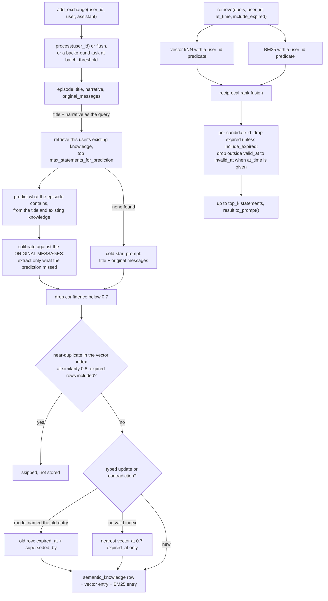

## 1. Executive Summary

memv is an MIT-licensed Python memory library whose write path stores only what a
model failed to predict: given what it already knows about a user, the model
guesses what an episode contains, and only the gap against the original messages
is extracted. That criterion is the design's whole bet, and nothing in the tree
measures it — no extraction rate, no discard count — while the one committed
benchmark result is a 30-question baseline run without the ablation the harness
carries a preset for.

The README states the idea in its first line:

> "Most memory systems extract everything and rely on retrieval to filter it.
> memv extracts only what the model **failed to predict** — importance emerges
> from prediction error, not upfront scoring."

An importance prompt gives a model nothing to compare against, so it flags
everything or flags what sounds dramatic. `PredictCalibrateExtractor` gives it a
reference point. The loop, from the docstring:

> "1. Predict what the episode should contain (given existing knowledge)
> 2. Compare prediction vs actual episode
> 3. Extract only what we FAILED to predict"

If the model, knowing what it already knows, can guess what the conversation
said, that content adds nothing. What survives is the surprise. The module
docstring credits the idea to Nemori, and the README links the paper,
[arXiv:2508.03341](https://arxiv.org/abs/2508.03341).

Prediction error is not the only gate. The extraction prompts exclude general
knowledge and assistant-supplied material, the pipeline drops anything the model
rates below 0.7 confidence, and a near-duplicate check at similarity 0.8 skips
repeats (`src/memv/memory/_pipeline.py:179`, `:193-199`, `:221-227`).

The extractor carries a discipline note beside the mechanism:

> "Episode content is for RETRIEVAL (narrative is fine)
> Extraction source is ONLY original messages (ground truth)"

The narrative is read as the query that fetches existing knowledge for the
prediction and in episode-merge decisions; the extractor reads only
`original_messages` (`src/memv/memory/_pipeline.py:156-160`,
`src/memv/processing/extraction.py:117-130`). A summarisation error can degrade
recall and cannot become a stored fact.

The store is bitemporal: `valid_at` and `invalid_at` for when a statement was
true, `expired_at` for when the store stopped believing it, filtered separately
at retrieval. The filter runs in Python after fusion rather than in SQL, so an
as-of query can return fewer results than it asked for (section 6).

## 2. Mental Model

Exchanges become episodes. The episode's title is used to predict its content
from the user's existing knowledge, and the gap against the original messages
becomes knowledge statements. A statement stops being believed when a later
extraction supersedes it or a caller invalidates it, which stamps `expired_at`
and, when the model named the entry it replaces, `superseded_by`. It stops being
true in the world at `invalid_at`, which only an as-of query consults. No field
records why belief ended.

```mermaid
%% caption: the write path predicts from the episode title, calibrates against the original messages, gates on confidence and near-duplicates, then supersedes; the read path filters by user inside each index and by time after fusion
flowchart TD
    EX["add_exchange(user_id, user, assistant)"] --> PR["process(user_id) or flush,<br/>or a background task at batch_threshold"]
    PR --> EP["episode: title, narrative, original_messages"]
    EP -->|"title + narrative as the query"| EK["retrieve this user's existing knowledge,<br/>top max_statements_for_prediction"]
    EK --> P["predict what the episode contains,<br/>from the title and existing knowledge"]
    EK -->|"none found"| CS["cold-start prompt:<br/>title + original messages"]
    P --> C["calibrate against the ORIGINAL MESSAGES:<br/>extract only what the prediction missed"]
    C --> G["drop confidence below 0.7"]
    CS --> G
    G --> D{"near-duplicate in the vector index<br/>at similarity 0.8, expired rows included?"}
    D -->|"yes"| X["skipped, not stored"]
    D -->|"no"| S{"typed update or contradiction?"}
    S -->|"model named the old entry"| IW["old row: expired_at + superseded_by"]
    S -->|"no valid index"| VF["nearest vector at 0.7:<br/>expired_at only"]
    S -->|"new"| K["semantic_knowledge row<br/>+ vector entry + BM25 entry"]
    IW --> K
    VF --> K
    Q["retrieve(query, user_id, at_time, include_expired)"] --> V["vector kNN with a user_id predicate"]
    Q --> T["BM25 with a user_id predicate"]
    V --> F["reciprocal rank fusion"]
    T --> F
    F --> TF["per candidate id: drop expired unless include_expired;<br/>drop outside valid_at to invalid_at when at_time is given"]
    TF --> R["up to top_k statements, result.to_prompt()"]
```

## 3. Architecture

`src/memv/` splits into `processing` (segmentation, episodes, extraction,
prompts, temporal parsing), `memory` (the public API, the pipeline, task
management), `storage` (SQLite and Postgres), `retrieval`, `embeddings`, `llm`,
`mcp`, `dashboard`, `cache`, `models`, `protocols` and `config`.

`protocols.py` defines `LLMClient` and the embedding interface, and the adapters
are separate — `OpenAIEmbedAdapter`, Voyage, Cohere and fastembed embedders, and
`PydanticAIAdapter("openai:gpt-4o-mini")` — so the model choices are constructor
arguments rather than configuration sprawl. The README's quick start constructs
both adapters explicitly.

SQLite runs on `sqlite-vec` and FTS5; Postgres on pgvector and `tsvector`. Both
keep the knowledge rows, a vector index and a text index as separate tables with
their own `user_id` columns. `notes/` holds the project's plan and progress log,
including the one benchmark result (section 10).

## 4. Essential Implementation Paths

**Extract** — `src/memv/processing/extraction.py` (the Nemori credit `:1-6`,
`PredictCalibrateExtractor` and its flow `:34-47`, `extract` `:52-75`,
`_predict` `:77-95`, `_extract_gaps` `:97-137`), `src/memv/processing/prompts.py`
(`prediction_prompt`, `extraction_prompt_with_prediction`,
`cold_start_extraction_prompt`).

**Store and supersede** — `src/memv/memory/_pipeline.py` (`_process_episode`
`:135-219`, `_handle_supersedes` `:229-253`, the vector fallback `:255-265`),
`src/memv/storage/sqlite/_knowledge.py` (`invalidate` `:130-138`,
`invalidate_with_successor` `:140-148`).

**Retrieve** — `src/memv/retrieval/retriever.py` (`_search_knowledge`
`:86-123`, `_passes_temporal_filter` `:125-140`), the user predicates in
`src/memv/storage/sqlite/_vector_index.py:79-92` and
`src/memv/storage/sqlite/_text_index.py:70-81`.

**Guard the interval** — `src/memv/models.py` (`KnowledgeInput.check_temporal_range`
`:123-127`, the validity checks `:64`, `:100`).

## 5. Memory Data Model

`semantic_knowledge` carries a `statement`, a `user_id`, a `source_episode_id`
that is null for injected knowledge, an `importance_score` holding the
extractor's confidence, and five time and lineage columns:

- `valid_at` / `invalid_at` — when the statement was true in the world, from
  the model's ISO output or parsed from its `temporal_info` by
  `backfill_temporal_fields`.
- `created_at` / `expired_at` — when the store recorded it and when it stopped
  believing it.
- `superseded_by` — the successor's id, written only when the extractor names the
  superseded entry by its index.

That separation is what the `bitemporal` mark certifies: "what was true on this
date" and "what does the store believe" are different questions. The transaction
axis is a switch rather than a query: `include_expired` admits everything ever
recorded, and no parameter asks what the store believed on a given date.

The knowledge store carries the as-of predicate in SQL
(`src/memv/storage/sqlite/_knowledge.py:75-93`, the Postgres twin at
`src/memv/storage/postgres/_knowledge.py:64-86`). Its `get_valid_at` and
`get_current` have no caller outside `tests/` and no `user_id` predicate. The
read that runs is the Python filter in section 6.

`KnowledgeInput.check_temporal_range` rejects `invalid_at <= valid_at`
(`src/memv/models.py:123-127`), and `KnowledgeInput` is the direct-injection
model. The extraction path builds `SemanticKnowledge` from `ExtractedKnowledge`,
and neither carries the check, so an inverted interval from the model or from the
backfill parser is stored (`src/memv/memory/_pipeline.py:168-176`, `:201-209`).

There is no status enum and no tombstone. The extractor types each statement
`new`, `update` or `contradiction` (`src/memv/models.py:147-156`); the pipeline
uses the type to trigger supersession and does not store it. So a row records
when belief ended and, on one of the two supersession paths, what replaced it,
but not whether it was superseded or refuted.

## 6. Retrieval Mechanics

Vector similarity and BM25 are each searched with the caller's `user_id` inside
the query, then fused by reciprocal rank with `k = 60` and `vector_weight` 0.5
(`src/memv/retrieval/retriever.py:96-104`, `:142-170`). That is the
`scope_enforced` mark. BM25 and both Postgres arms apply the predicate before the
`LIMIT`. The SQLite vector arm bounds its sqlite-vec scan with `k = top_k * 10`
and applies `user_id` on the joined mapping table, so in a store another user
dominates, a user's own statements can fall outside the candidate pool — a recall
loss, not a leak (`src/memv/storage/sqlite/_vector_index.py:79-92`).

Time is filtered after ranking, in Python. Each fused candidate from the
`top_k * 3` per arm is fetched by id and dropped unless it is current — skipped
under `include_expired` — and, when `at_time` is given, valid at that moment
(`src/memv/retrieval/retriever.py:106-140`). So an as-of query over a history of
mostly superseded statements returns fewer than `top_k`, and returns nothing when
the valid statements sit below the candidate cut.

Without `at_time`, the event-time check is skipped: a statement whose
`invalid_at` has passed is returned as long as nothing expired it. The MCP
`search_memory` tool passes neither `at_time` nor `include_expired`
(`src/memv/mcp/server.py:31-35`), so as-of retrieval is a library feature.

`result.to_prompt()` returns a block formatted for injection rather than a row
list, which stops every caller inventing a serialisation
(`src/memv/models.py:135-144`).

## 7. Write Mechanics

`add_exchange` writes two message rows and returns. Extraction runs on
`process(user_id)` or `flush`, or as a background task once `auto_process` is on
and `batch_threshold` messages are buffered (`src/memv/memory/_api.py:31-73`);
nothing is retrievable before it runs. Episodes in one batch are processed
concurrently, up to ten, against the knowledge base as it stood before the batch,
so a repeat within a batch is caught by dedup rather than by prediction
(`src/memv/memory/_pipeline.py:61-70`).

With no existing knowledge the prediction is empty, and a separate prompt
extracts from the episode title and the original messages
(`src/memv/processing/extraction.py:87-90`, `:117-124`). The empty case is
handled by name rather than by comparing against an empty prediction.

An extraction typed `update` or `contradiction` expires one existing row before
the new one is stored. When the model names the superseded entry by its index in
the numbered list it was shown, `invalidate_with_successor` sets `expired_at` and
`superseded_by`. Otherwise the user's nearest vector at similarity 0.7 or above is
expired with no successor recorded (`src/memv/memory/_pipeline.py:229-265`). That
index still holds expired rows; when one is nearest, the `AND expired_at IS NULL`
guard turns the update into a no-op and the current row stays current.

The near-duplicate check runs before supersession, against the same index, and
`invalidate` never removes a vector. With dedup on, which is the default, a
statement matching an expired one at 0.8 is skipped: a fact that was superseded
and later becomes true again cannot be re-learned from conversation
(`src/memv/config.py:43-44`, `src/memv/memory/_pipeline.py:193-199`).
`delete_knowledge` removes both index entries and lifts that
(`src/memv/memory/_api.py:178-186`). The dashboard's knowledge delete removes
only the row, so its vector goes on suppressing re-extraction
(`src/memv/dashboard/app.py:394-396`). Every supersession test runs with dedup off
(`tests/test_memory_e2e.py:644-887`).

## 8. Agent Integration

A Python library first — `uv add memvee` — with `async with memory:` as the
lifecycle and `await memory.process(...)` as the explicit extraction trigger, so
by default the cost is visible in the calling code.

The MCP server registers five tools — `search_memory`, `add_memory`,
`add_conversation`, `list_memories` and `delete_memory` — and each takes an
optional `user_id` that overrides the server's default
(`src/memv/mcp/server.py:146-215`). The scope key is an argument the model fills,
so on this surface isolation holds against a model that does not name another
user and not against one that does; `delete_memory` checks ownership against the
same argument. `add_conversation` runs extraction inline, which its docstring
warns can take 10 to 30 seconds or more.

`python -m memv.dashboard <db_path>` opens a Textual terminal browser over a
SQLite file with delete actions, reading every user's knowledge through
`get_all()`. The library's `get_knowledge` and `invalidate_knowledge` take an id
and no user (`src/memv/memory/_api.py:166-175`).

## 9. Reliability, Safety, and Trust

**Three marks: bitemporal, scope enforced and negative eval.**

**Negative eval — present.** `tests/test_retriever.py:84-96` stores one statement
for each of two users and queries user B with user A's exact statement, asserting
it absent beside the positive control on user A. `:130-158` asserts an expired
statement is excluded by default and returned under `include_expired`, and
`:108-127` that a statement outside its interval is excluded at `at_time`.
`tests/test_memory_e2e.py` repeats the isolation (`:111-146`) and the
invalidation pair (`:405-435`) through `Memory.retrieve` after extraction. With
the `user_id` predicates removed, BM25 would return user A's statement to user B,
so the isolation case can fail.

**Trust state — withheld.** `expired_at` withholds a statement from the default
read, and it is a timestamp rather than a status. The `update` and
`contradiction` types trigger supersession and are then dropped, so nothing
distinguishes "expired because superseded" from "expired because refuted", which
is the distinction [cortex-engine](../cortex-engine/) makes the case for.

**Tombstone — withheld.** Supersession and invalidation are keyed on a row. The
value-keyed suppression that exists is a side effect of dedup reading an index
that expiry never prunes (section 7): it blocks re-extraction of an expired
statement with no record that anything was rejected, and it blocks a fact that
became true again as readily as one that was refuted.

**Audit log — withheld.** The README promises *Full audit trail preserved* for
contradiction handling. What exists is the retained expired row and, on the
index path, `superseded_by`. `delete_knowledge`, `clear_by_episodes` and
`clear_user` issue `DELETE`, episode merging deletes the merged episode, and the
vector fallback records no successor, so no mutation is recorded.

**Human review — withheld.** The dashboard displays and deletes after the write;
nothing waits for approval.

**The risk is that the whole design rests on an unmeasured judgement.** Prediction
error decides what is stored, so a prediction that is too good silently discards
real information, and one that is too poor stores what the design exists to
avoid. The cheaper the prediction model, the more it fails to predict, so storage
volume is coupled to a model choice the library leaves to the caller.

The notes record fact counts across two changes: rescoping the prompts to
user-specific facts took one run from 2035 statements to 441, and a segmentation
fix cut facts by 54% (`notes/PROGRESS.md:123`, `notes/PLAN.md:114`). Neither is a
count against the prediction; the extractor logs how many items each episode
yields (`src/memv/processing/extraction.py:134`), and no discard rate is recorded.
[AgentWorkingMemory](../agent-working-memory/)'s `discardRegret` — counting the
near-discards that were later accessed — is the shape that measurement would take.

## 10. Tests, Evals, and Benchmarks

**A LongMemEval harness with ablation presets and one committed result.**
`benchmarks/longmemeval/` holds `run.py`, `add.py`, `search.py`, `evaluate.py`,
`dataset.py`, `config.py` and `_checkpoint.py`. `config.py` names five presets,
among them `no_predict_calibrate`, which sets `max_statements_for_prediction=0`
so every episode takes the cold-start path — the extract-everything arm the
design needs comparing against (`benchmarks/longmemeval/config.py:7-19`).
`benchmarks/results/` holds only `.gitkeep`.

The result is a table in `notes/PLAN.md:119-129`: a balanced 30-question run,
five per question type, on `gpt-4o-mini`, dated 7 April 2026, task-averaged
36.7%, with a failure analysis per type. Single-session preferences score 0 of 5,
and knowledge updates 3 of 5, with an off-by-one in the supersede index blamed
for falling back to vector search. The run is the default configuration only; no
run of `no_predict_calibrate` is recorded and the raw outputs are not committed.

The suite is 244 test functions in 15 files, and CI runs it against SQLite and
Postgres (`.github/workflows/ci.yml:45`, `:73`). The negative cases are in
section 9. The supersession tests run with dedup off, so the interaction in
section 7 is unasserted.

I ran nothing; the counts above come from reading the tree.

## 11. For Your Own Build

### Steal

- **Decide what to store by what you failed to predict.** Ask the model what the
  episode should contain given what you already know, compare against the actual,
  keep the gap. An importance score has no reference point; a prediction error
  does.
- **Extract only from the original messages, never from your own summary.** "Episode
  content is for RETRIEVAL (narrative is fine); extraction source is ONLY original
  messages (ground truth)" — so a summarisation error costs you recall and cannot
  become a stored fact.
- **Special-case the cold start.** With no prior knowledge there is nothing to
  predict against; name the case and give it its own prompt.
- **Separate valid time from belief time as two columns, and query both.**
  `valid_at`/`invalid_at` for when it was true, `expired_at` for when you stopped
  believing it, with an `include_expired` switch. "What was true then" and "what
  do we believe" are different questions.
- **Pair each must-not-return case with its positive control.** memv's isolation
  test asserts user A sees the statement and user B does not, and its expiry test
  is paired with the `include_expired` read that returns it.
- **Split capture from extraction.** `add_exchange` then `process` means the
  expensive pass is deferrable and its cost is visible at the call site.
- **Return something formatted for injection.** `result.to_prompt()` stops every
  caller inventing a serialisation.
- **Name the source in the module.** The Nemori credit sits in the docstring
  above the class that implements it.

### Avoid

- **Do not leave the criterion unmeasured.** Prediction error decides everything
  stored; too good a prediction discards real information and too poor a one
  stores everything. Nothing counts the discards, and the rate moves with
  whichever model the caller passes in.
- **Do not stop at the baseline when the ablation preset exists.** The harness
  names `no_predict_calibrate`; the one recorded run is the default
  configuration.
- **Do not filter by time after the candidate cut.** memv fetches `top_k * 3` per
  arm and then drops expired and out-of-interval rows, so an as-of query can
  return fewer than `top_k`, or nothing.
- **Do not let dedup read expired rows.** A superseded statement left in the
  vector index blocks the same fact from being learned again.
- **Do not validate the interval on one write path only.** `check_temporal_range`
  guards injection; the extraction path stores whatever the model and the date
  parser produce.
- **Do not discard the reason belief ended.** The extractor says `update` or
  `contradiction`; the row keeps a timestamp.
- **Do not let the model fill the scope key.** Every MCP tool takes `user_id` as
  an optional argument.

### Fit

The right choice if you are building on a Python stack, want an extraction
criterion with an argument behind it, and will measure it yourself. The
bitemporal columns are sound, and the read path's post-fusion filter and the
dedup interaction need fixing before as-of queries or corrections carry weight.
For a multi-user deployment behind MCP, the scope key has to come from the
server, not the tool call.

`processing/extraction.py` is 151 lines and reframes the storage decision; read
it whatever you build.

## 12. Open Questions

- **What fraction of exchanges survive extraction?** The rate is the design's
  central parameter and is unmeasured.
- **How does the extraction rate move with the prediction model?** A weaker
  predictor stores more, by construction.
- **What does `no_predict_calibrate` score on the same 30 questions?** The preset
  exists; no run is recorded.
- **Is re-assertion after supersession meant to be blocked?** Dedup skips a
  statement matching an expired one, and no test runs supersession with dedup on.

## Appendix: File Index

**Extraction** — `src/memv/processing/extraction.py` (the Nemori credit and
framing `:1-6`, `ExtractionResponse` `:28-32`, `PredictCalibrateExtractor` with
the three-stage flow and the retrieval-versus-ground-truth note `:34-47`,
`extract` `:52-75`, `_predict` `:77-95`, `_extract_gaps` `:97-137`),
`src/memv/processing/prompts.py`, `src/memv/processing/temporal.py`
(`backfill_temporal_fields`)

**Pipeline** — `src/memv/memory/_pipeline.py` (concurrent episodes `:61-70`,
`_process_episode` `:135-219`, the confidence filter `:221-227`,
`_handle_supersedes` `:229-253`, the vector fallback `:255-265`),
`src/memv/memory/_api.py` (`add_exchange` `:31-73`, `delete_knowledge`
`:178-186`), `src/memv/config.py` (dedup defaults `:43-44`)

**Bitemporal storage** — `src/memv/storage/sqlite/_knowledge.py` (`add`
`:16-35`, the as-of store methods with test-only callers `:57-96`, the
user-scoped list and count `:98-128`, `invalidate` and
`invalidate_with_successor` `:130-148`), `src/memv/storage/postgres/_knowledge.py`,
`src/memv/models.py` (the validity checks `:64`, `:100`, `check_temporal_range`
`:123-127`, `ExtractedKnowledge` `:147-156`)

**Retrieval** — `src/memv/retrieval/retriever.py` (`_search_knowledge`
`:86-123`, `_passes_temporal_filter` `:125-140`, `_rrf_fusion` `:142-170`),
`src/memv/storage/sqlite/_vector_index.py` (`search` `:75-108`),
`src/memv/storage/sqlite/_text_index.py` (`search` `:64-95`),
`src/memv/embeddings/`, `src/memv/cache.py`

**Interfaces** — `src/memv/protocols.py`, `src/memv/llm/`,
`src/memv/mcp/server.py` (the tools `:151-215`), `src/memv/dashboard/app.py`

**Tests** — `tests/test_retriever.py` (isolation `:84-96`, time `:108-158`),
`tests/test_memory_e2e.py` (isolation `:111-146`, invalidation `:405-435`,
injected interval `:524-543`, supersession `:644-887`)

**Benchmark** — `benchmarks/longmemeval/{run,add,search,evaluate,dataset,config,_checkpoint}.py`,
`benchmarks/results/` (only `.gitkeep`), `benchmarks/data/`, the baseline table
in `notes/PLAN.md:119-129`

## Appendix: Recorded Searches

Run in a full clone at the pinned revision, from the repository root.

| Claim | Check | Result at this pin |
| --- | --- | --- |
| One committed benchmark result, a table in a planning note; no raw output and no ablation run | `git ls-tree -r --name-only HEAD \| rg '^bench(mark)?s?/'`, then `rg -n -i 'task-averaged\|no_predict' notes/ benchmarks/` | The harness plus `benchmarks/results/.gitkeep` and `benchmarks/data/.gitkeep`. Among the second search's hits, `notes/PLAN.md:129` and `:434` carry the 36.7% baseline, and `no_predict_calibrate` appears only in `benchmarks/longmemeval/config.py`. |
| The SQL as-of methods have no production caller | `rg -n 'get_valid_at\|get_current\(' --type py . \| rg -v 'def '` | Seven hits, all in `tests/test_knowledge_store.py`. |
| The interval check guards injection only | `rg -n 'invalid_at <=' src/` | `src/memv/models.py:125`, inside `KnowledgeInput`. |
| Expiry never removes a vector | `rg -n 'vector_index\.delete' src/` | `src/memv/memory/_api.py:184`, in `delete_knowledge` only. |
| `superseded_by` is written on one path | `rg -n 'invalidate_with_successor\(\|\.invalidate\(' src/memv/memory` | `_pipeline.py:243` with a successor; `_pipeline.py:265` and `_api.py:175` without. |
| No extraction rate or discard count is computed | `rg -n -i 'discard\|extraction.rate\|surviv\|false.negative' src/ benchmarks/ notes/ tests/` | Three hits, all in `tests/test_memory_e2e.py` and none a rate: a docstring on the confidence filter and two comments on deletion. |
| No review state on knowledge | `rg -n -i 'pending\|approv\|review' src/` | `ProcessStatus.PENDING` on processing tasks, pending-message wording in the MCP server, and the dashboard's delete preview; nothing on `semantic_knowledge`. |
| No mutation log | `rg -n 'CREATE TABLE' src/` | `messages`, `episodes`, `semantic_knowledge` and the vector and text index tables in each backend. |
| Supersession tests run with dedup off | `rg -n 'enable_knowledge_dedup' tests/test_memory_e2e.py` | `False` at `:675`, `:725`, `:774`, `:820`, `:873`. |

## History

**2026-09-30** — [`21891376f0bf58c8523895c1bebe29df49125677`](https://github.com/vstorm-co/memv/commit/21891376f0bf58c8523895c1bebe29df49125677) — audit at the same commit; upstream had not moved. `negative_eval` is added: `tests/test_retriever.py` and `tests/test_memory_e2e.py` assert that another user's statement, an expired one and one outside its interval are not retrieved; marks go from two to three, and the scope record's "no cross-user test" clause and its anchor are corrected. Five published claims were wrong: the licence is MIT, not Apache; the as-of SQL drawn as the read path has no caller outside tests, and retrieval filters time after fusion; the interval validator covers injection only; a 30-question LongMemEval baseline is committed in `notes/PLAN.md`; `extraction.py` is 151 lines. Added in [section 7](#7-write-mechanics): dedup reads expired vectors, so a superseded fact cannot be re-learned. Screen: two auto-run `.claude/` files, two build-time execution points; nothing installed, built or run.

**2026-09-15** — [`21891376f0bf58c8523895c1bebe29df49125677`](https://github.com/vstorm-co/memv/commit/21891376f0bf58c8523895c1bebe29df49125677) — second reading. One commit since the previous pin, a documentation change raising the stated Python requirement to 3.10 across three files; no source changed. Screened again: two auto-run findings, both contributor tooling in `.claude/` — a hook running `ruff` on edited files and a macOS notification sound, and a committed `settings.local.json` that is a personal permission allowlist rather than configuration anyone else needs; nothing fetches remote code, and nothing was installed or run. Both marks were re-tested at the producer and hold, and each now carries the evidence record it had been asserted without. The one check that could have gone the other way: the knowledge store's `get_valid_at` and `get_current` apply the temporal predicates with no user filter, and a search for their callers finds only the store's own tests. The retrieval path the library exposes filters by user inside both indexes and applies the temporal check afterwards.

**2026-08-09** — [`fd314bac28247df1149edfbf0d1f7881690ef448`](https://github.com/vstorm-co/memv/commit/fd314bac28247df1149edfbf0d1f7881690ef448) — first reading. Screened before reading; the tree was read, never installed, and the LongMemEval harness was not run.
