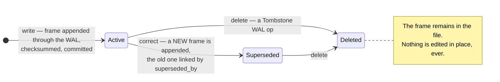

## 1. Executive Summary

Memvid is an Apache-2.0 Rust system of roughly 64,000 lines that packs a memory
— content, embeddings, search structure and metadata — into **one file** with no
sidecars. The name comes from a borrowed idea rather than a stored medium: the
README is explicit that it "draws inspiration from video encoding, not to store
video, but to organize AI memory as an append-only, ultra-efficient sequence of
Smart Frames."

The frame is the unit and it is immutable. Frames carry checksums, are committed
through an internal WAL, and never change once written; a correction appends a
new frame that supersedes the old one:

```rust
pub enum FrameStatus { Active, Superseded, Deleted }
```

with `supersedes` / `superseded_by` links, `mark_frame_superseded`, and a
`FrameWalOp::Tombstone`.

On top of that sits a structured layer that this atlas has been asking for
without finding: memory cards keyed by **`entity:slot`** — "the entity (e.g.
`user`)" and "the slot/attribute (e.g. `employer`)" — with two read paths:

```rust
/// Get the current (most recent, non-retracted) memory for an entity:slot.
pub fn get_current_memory(&self, entity: &str, slot: &str) -> Option<&MemoryCard>

/// The most recent non-retracted card at that time, if any.
pub fn get_memory_at_time(&self, entity, slot, timestamp)
```

That pair is the interesting thing. **Most systems here can tell you what they
believe. Memvid can tell you what it believed last March**, without a separate
bi-temporal schema, because the store is an append-only log and history is the
default rather than a retained extra. `replay_ops.rs` extends the same idea to
sessions: "session management for time-travel replay functionality, enabling
recording and replaying of agent sessions."

Slots also carry a **cardinality** — whether a predicate "allows multiple values
per entity" — which is the distinction that decides whether a second value is a
contradiction or an addition. [Memanto](../memanto/) needed a human to make that
call per conflict; Memvid can often make it from the schema.

Reservations, and one is loud. The README leads with "**+35% SOTA on LoCoMo**",
"+76% multi-hop" and "+56% temporal vs. the industry average". No committed raw
result artifacts for those figures were located at this commit. This atlas has a
named antipattern for exactly that shape, and the numbers should be read as
claims until the artifacts appear. Beyond that: correction is frame-keyed rather
than value-keyed, and the ACL module is thin relative to the rest.

## 2. Mental Model

How a thing becomes a belief, and how it stops being one:



Because nothing is overwritten, three different reads are possible:
`get_current(entity, slot)` for what is believed now,
`get_at_time(entity, slot, t)` for what was believed at `t`, and a session replay
for what the agent actually saw, in order. The append-only file is what makes the
second and third questions answerable at all.

The consequence worth stating: **a correction here never destroys the thing it
corrected.** Supersession is a link, not an overwrite, so the pre-correction
state remains addressable. That is the property [Graphiti](../graphiti/) achieves
by closing validity intervals and [Core Memory](../core-memory/) by retaining
superseded beads — Memvid gets it from the storage format rather than the schema.

## 3. Architecture

`src/memvid/` holds the system; the larger modules are `doctor.rs` (1,687),
`ask.rs` (1,615), `lifecycle.rs` (1,598), plus `enrichment.rs` (688),
`frame.rs` (681), `acl.rs` (339) and `audit.rs` (328), alongside `mutation.rs`,
`replay_ops.rs`, `timeline.rs`, `segments.rs`, `mesh.rs`, `planner.rs`,
`sketch.rs`, `ticket.rs`, `maintenance.rs` and `workers.rs`. Search, encryption,
enrichment and analysis live in sibling trees.

`lifecycle.rs` states the file contract directly:

> "Enforce single-file invariant (no sidecars) and take OS locks. Bootstrap
> headers, internal WAL, and TOC on create, and recover them on open. Validate
> TOC/footer layout, recover the latest valid footer when needed. Wire up index
> state (lex/vector/time) **without mutating payload bytes**."

### Deployment and ergonomics

A Rust binary and one `.mv2` file. No Postgres, no vector service, no queue, no
container — the memory is a file you can copy, version, or send. That is the
lightest deployment story in the atlas alongside [OptMem](../optmem/), and unlike
OptMem it carries vector search, a graph, encryption and ACLs inside the same
artifact.

The single-file invariant is enforced rather than assumed, and the format
recovers a valid footer on open, so a crash mid-write is a designed-for case
rather than a corruption report.

## 4. Essential Implementation Paths

### Immutability as the correction mechanism

Most systems in this atlas treat immutability as an audit feature bolted beside
a mutable store: an event log next to rows that get updated. Memvid inverts it.
The payload is never mutated, so the audit trail is not a parallel record that
can disagree with the data — it *is* the data.

This closes a gap the [append-only memory audit](../../patterns/append-only-memory-audit/)
pattern warns about, where "two audit trails that disagree are worse than one".
There is only one trail here because there is only one way to change anything.

It also makes `get_at_time` cheap rather than a feature. Systems that overwrite
must add validity columns and remember to maintain them; a store that only
appends gets time travel by construction, and has to work to *lose* it.

### `entity:slot` with cardinality

Card addressing by entity and slot is a small schema decision with a large
consequence. Most systems here store a memory as free text and discover conflicts
by embedding similarity, which is why their conflict detectors are LLM passes
with unmeasured precision. Addressing by `(entity, slot)` makes "is there already
a value for this?" a lookup.

The `Cardinality` on a slot then answers the question that lookup raises. If
`employer` is single-valued, a second value is a contradiction; if `skill` is
multi-valued, it is an addition. [Memanto](../memanto/)'s `keep_both` resolution
exists because a human has to make that judgement per conflict — with a schema
that declares cardinality, the common cases do not need a human at all.

The schema is *inferred* (`SchemaSummaryEntry` reports `inferred_type`,
`entity_count`, `value_count`, `unique_values`, and whether a predicate "has a
built-in schema definition"), which is the pragmatic choice for memory extracted
from conversation, and also means the cardinality that governs conflict handling
is itself a guess that can be wrong.

### Session replay

`replay_ops.rs` provides "recording and replaying of agent sessions". Combined
with `timeline.rs` and as-of card reads, the store answers a question no other
system in this atlas can: *what did the agent know when it made that decision?*

That is the debugging primitive for agent memory. Every report here that asks
"why did retrieval prefer this path" or "how did that wrong fact get in" is
asking for a replay, and reconstructing one from a store that overwrites is
guesswork.

### Enrichment with engine provenance

`record_enrichment`, `get_unenriched_frames(engine_kind, engine_version)` and
`is_frame_enriched` track derivation **by engine kind and version**.

This is the embedding-migration problem the atlas lists as an under-covered
dimension, handled more thoroughly than [Memory Engine](../memory-engine/)'s
`embedding_version`: rather than stamping a number on a vector, Memvid can ask
which frames have not been processed by a given engine at a given version, which
makes a re-enrichment campaign a query and a resumable worker rather than a
migration script.

### A `doctor`

At 1,687 lines, `doctor.rs` is the largest module. A memory format that claims
crash safety, footer recovery and a single-file invariant needs a diagnostic tool
proportionate to those claims, and the atlas has seen this pairing before — in
[MemPalace](../mempalace/)'s repair tooling and [OptMem](../optmem/)'s errors that
print their own fix.

## 5. Memory Data Model

Two layers. Frames are immutable, checksummed, statused
(`Active | Superseded | Deleted`), and linked by supersession. Memory cards are
structured `entity:slot` values with a cardinality, riding on frames.

What is absent:

- **Trust state, on a narrower reading than the first one applied.** A frame is
  `Active`, `Superseded` or `Deleted`, and nothing marks it candidate, verified or
  rejected — which is why the first reading called the mark absent. The rubric's
  test is not that vocabulary but *"at least one state that withholds a memory
  from being treated as true"*, and two of the three do exactly that: both search
  entry points filter `frame.status == FrameStatus::Active` before scoring. The
  mark is carried from 2026-09-17. What remains absent is a judgement about
  truth — the status is a lifecycle position, and provenance is checksums and
  enrichment lineage rather than an epistemic claim.
- **No value-level tombstone.** `FrameWalOp::Tombstone` marks a *frame*. Re-ingesting
  the same source produces a new frame with a new id, and the entity:slot lookup
  makes the collision *visible* — which is more than most systems manage — but
  nothing blocks it, and the tombstone does not carry the rejected value forward
  as a constraint on future writes.
- **No multi-tenant scope.** `acl.rs` is 339 lines against a 64,000-line system;
  the unit of isolation is the file.

## 6. Retrieval Mechanics

Lexical (`lex.rs`), vector (with configurable compression) and graph
(`graph_search.rs`) search over frames, with a dedicated `search/` tree, plus the
structured card lookups. Indexes for lexical, vector and time are wired up on
open "without mutating payload bytes", so the index is a projection of an
immutable payload — the [evidence before belief](../../patterns/evidence-before-belief/)
shape at the storage layer.

## 7. Write Mechanics

Append-only through an internal WAL with committed, immutable frames. Supersession
links are written as part of the mutation path (`mark_frame_superseded`), and
tombstones are a WAL operation rather than a row update.

### Operational cost

Writes are local and do not require a model call, so the write path does not
block on an LLM. Enrichment — embeddings and derived structure — runs in workers
against unenriched frames, so there is a lag between a frame being durable and
being semantically retrievable; the enrichment query makes that lag *observable*,
which is unusual, but no figure for it was found.

The append-only format trades disk for immutability: every correction adds rather
than replaces, so the file grows with edit history, and `maintenance.rs` and
segments exist to manage that. No stated footprint numbers were located.

## 8. Agent Integration

A Rust library and CLI over a portable file. There is no MCP server, no hosted
service and no framework adapters in the tree — the integration story is that the
memory is a file another program opens, which is coherent with the single-file
thesis and narrower than most systems here.

## 9. Reliability, Safety, and Trust

Strengths:

- **Immutable frames**, so a correction cannot destroy what it corrected.
- **As-of reads per `entity:slot`**, giving time travel from the format rather
  than a schema.
- **Session replay**, the debugging primitive the rest of this atlas lacks.
- **Cardinality on slots**, which decides contradiction versus addition without a
  human.
- **Enrichment tracked by engine kind and version**, making re-embedding a query.
- **Single-file invariant enforced**, with WAL, TOC and footer recovery on open.
- **Checksums per frame**, and a `doctor` proportionate to the format's claims.
- **The predecessor survives its correction inside the file**, with status,
  checksum and enrichment provenance intact — which is what the `audit_log` mark
  rests on here, and a stronger answer to *what did this say before* than a
  side-table of events.
- **Two of the three frame statuses withhold a frame from every search**, filtered
  in both search builders before scoring.
- **One artifact to deploy**, with search, graph, encryption and ACL inside it.

Gaps:

- **Headline benchmark numbers without committed artifacts.** "+35% SOTA on
  LoCoMo" is the strongest quality claim in the atlas and the least evidenced at
  this commit.
- **Frame-keyed correction**, so re-ingestion is visible but unblocked.
- **A thin ACL** relative to the system, and no multi-tenant model.
- **The op sequence is not retained.** The WAL is truncated at checkpoint, so the
  file keeps the *effect* of every mutation and not the order they arrived in. The
  replay session log would supply that, and it records `Put` and `Find` while the
  `Delete` and `Update` variants of its own `ActionType` enum have no producer
  anywhere in the tree — the one surface that could record a correction as an
  event never does.
- **`audit.rs` is not an audit log.** It builds a provenance report for a
  *question*: which sources answered it. That is the rubric's explicit "not this",
  and this report rested its `audit_log` mark on the name for seven weeks; the
  mark stands on the frame log instead.
- **Inferred cardinality** governing conflict semantics, so a wrong inference
  makes a contradiction look like an addition or the reverse.
- **Growth with edit history**, unquantified.

## 10. Tests, Evals, and Benchmarks

**There are 497 test functions and the first reading counted none of them.**
`tests/` holds eleven integration files with 91 `#[test]` functions —
`crash_recovery`, `doctor_recovery`, `encryption_capsule`, `lifecycle`,
`model_consistency`, `mutation`, `replay_integrity`, `search`, `single_file`,
`test_implicit_and`, `xlsx_structured` — and `src/` carries a further 406 in
seventy in-source `#[cfg(test)]` modules, which is where the memory-card logic is
covered. Nothing was run for this review.

That split is worth stating because it nearly produced a false finding here. A
grep for `get_at_time`, `get_current`, `supersede` and `tombstone` across
`tests/` returns **nothing**, which reads as an untested bitemporal mechanism —
the mechanism this report's headline mark rests on. It is tested, in
`src/types/memories_track.rs`'s own test module, and the enumeration was simply
too narrow. For a Rust repository, `tests/` is the integration directory and not
the suite.

**The deletion test cannot fail.** `tests/mutation.rs::delete_frame_marks_deleted`
creates one frame, deletes it, reopens the file and asserts:

```rust
assert!(
    stats.frame_count == 0 || stats.frame_count == 1,
    "Frame count should be 0 or 1 after delete"
);
```

with a comment above it reading *"Both are valid - the key is no panic
occurred"*. After deleting the only frame the count is necessarily zero or one,
so the assertion holds for any implementation, including one where delete does
nothing. The test never queries for the deleted content. The status filter that
makes deletion real — `frame.status == FrameStatus::Active` in both search
builders — has no committed case at all.

The README's LoCoMo figures could not be traced to committed raw results. Per
this atlas's standing convention that a reproducible harness and a reproduced
result are different claims, they are recorded here as claims. The gap matters
more than usual because the numbers are the loudest in the corpus: three
percentage claims stated as fact in the first screen of the README.

The measurement this design uniquely enables and does not report is **as-of
accuracy** — given a question about a past state, does `get_at_time` return what
the agent actually believed then? That is deterministic, needs no judge, and the
replay machinery already produces the ground truth.

## 11. For Your Own Build

### Steal

- **Get time travel from the format, not the schema.** An append-only payload
  with supersession links gives as-of reads by construction; a mutable store has
  to add validity columns and then maintain them forever.
- **Address memory by `entity:slot`.** It turns "do we already have a value for
  this?" from an embedding-similarity guess into a lookup, which is the step that
  makes conflict detection cheap and measurable.
- **Put cardinality on the slot.** Whether a predicate admits multiple values is
  what separates a contradiction from an addition, and it is a schema fact, not a
  judgement call.
- **Record enrichment by engine kind and version**, so "which records need
  re-embedding under the new model" is a query and the campaign is resumable.
- **Make the index a projection over bytes you never mutate**, so the audit trail
  and the data cannot disagree.
- **Ship a doctor proportionate to your format's claims.** Crash safety and
  footer recovery need a diagnostic tool, not a promise.

### Avoid

- **Frame-keyed tombstones** presented as deletion. Marking a container does not
  constrain what a later write may re-assert.
- **Headline percentages without committed artifacts.** The stronger the claim,
  the more the missing raw results cost — and here the claim is the first thing a
  reader sees.
- **Inferring the schema that governs your conflict semantics** without measuring
  how often the inference is wrong.

### Fit

Right for a single-tenant, portable memory where history matters and you can
carry a Rust binary — a personal assistant, a desktop agent, an artifact you hand
to someone else. Wrong where you need multi-tenant isolation, epistemic status,
or a hosted API: the ACL is thin, there is no trust model, and the integration
surface assumes a program that can open a file. The file-as-memory bet is real
and it is a bet: everything gets simpler except sharing.

## 12. Open Questions

- Where are the raw LoCoMo results, and what configuration produced them?
- Does `FrameWalOp::Tombstone` prevent an equivalent card being written again, or
  only mark the frame?
- How is `Cardinality` inferred, and how often is it wrong on a slot that decides
  contradiction versus addition?
- How large does a `.mv2` file get relative to its source material after a year
  of corrections?
- What is the lag between a frame committing and being retrievable after
  enrichment?
- Does `acl.rs` gate reads inside search, or filter results afterwards?

## Appendix: File Index

- Frame model and status: `src/types/common.rs` (`FrameStatus`),
  `src/memvid/frame.rs`.
- Mutation and supersession: `src/memvid/mutation.rs` (`mark_frame_superseded`,
  `FrameWalOp::Tombstone`).
- Structured cards: `src/memvid/memory.rs` (`put_memory_card`,
  `get_current_memory`, `get_memory_at_time`, `SchemaSummaryEntry`,
  `Cardinality`).
- Time travel: `src/memvid/replay_ops.rs`, `src/memvid/timeline.rs`.
- File format and recovery: `src/memvid/lifecycle.rs`, `footer.rs`, `lockfile.rs`.
- Enrichment: `src/memvid/enrichment.rs`, `src/enrichment_worker.rs`.
- Diagnostics: `src/memvid/doctor.rs`, `maintenance.rs`.
- Access and audit: `src/memvid/acl.rs`, `src/memvid/audit.rs`.

## History

**2026-09-17** — [`e6bd9f7b9c38cd8d5370fa0fc936ac1dcd751813`](https://github.com/memvid/memvid/commit/e6bd9f7b9c38cd8d5370fa0fc936ac1dcd751813) — re-read at the same commit, still the tip; the last commit upstream is 14 July 2026 and it edits the README. Nothing in the code could have moved, so this reading audited the first one. Screened again: no auto-run surface, no build-time execution path beyond the Rust toolchain file, nothing inside the cooldown; nothing was installed, built or run.

**Two marks added, one re-grounded, and a test that cannot fail.**

`trust_state` is carried. The first reading declined it because nothing marks a card candidate, verified or rejected — but the rubric asks for *"at least one state that withholds a memory from being treated as true"*, and `FrameStatus` has two: both search entry points filter `frame.status == FrameStatus::Active` before scoring, and the writers run inside WAL replay rather than being declarative. `negative_eval` is carried on `test_get_at_time` in `memories_track.rs`: two cards for `user:location`, `New York` at document date 1000 and `San Francisco` at 2000, with the as-of read at 1500 asserted to return `New York` and at 2500 `San Francisco` — a must-not on a corrected value with its own control two lines later.

`audit_log` stands but not where this report put it. The first reading pointed at *"an audit module"*; `src/memvid/audit.rs` builds a provenance report for a **question** — which sources answered it — which is the rubric's explicit "not this". The mark belongs to the frame log itself: a correction appends a frame carrying `supersedes`, WAL replay marks the predecessor `Superseded` rather than removing it, and a `Tombstone` op marks its target `Deleted`, so the predecessor and its checksum stay in the file. Three limits are now on the record — the WAL is truncated at checkpoint, so the *order* mutations arrived in is not retained; the replay session log records `Put` and `Find` while the `Delete` and `Update` variants of its own `ActionType` enum have no producer anywhere in the tree; and it sits behind a non-default feature.

**The suite is far larger than the first reading said, and its deletion test is unfalsifiable.** `tests/` holds 91 `#[test]` functions across eleven files, and `src/` a further 406 in seventy in-source modules — 497 in total, against a first reading that said only that the trees exist. `tests/mutation.rs::delete_frame_marks_deleted` creates one frame, deletes it, and asserts `stats.frame_count == 0 || stats.frame_count == 1` under a comment reading *"Both are valid - the key is no panic occurred"*; after deleting the only frame that holds for any implementation, including one where delete does nothing, and the test never queries for the deleted content.

**A near-miss in this reading's own method, recorded because it would have been the day's worst error.** A grep for `get_at_time`, `get_current`, `supersede` and `tombstone` across `tests/` returns nothing, which reads as an untested bitemporal mechanism — the mechanism this report's headline mark rests on. It is tested, in the source file's own `#[cfg(test)]` module. For a Rust repository `tests/` is the integration directory, not the suite, and the instrument check that caught it was counting `#[test]` under `src/`.

`stack_storage` was empty and `stack_source` seeded; they are now `files` and `reviewed`. The LoCoMo figures are unchanged and still uncorroborated in the tree.

**2026-07-28** — [`e6bd9f7b9c38cd8d5370fa0fc936ac1dcd751813`](https://github.com/memvid/memvid/commit/e6bd9f7b9c38cd8d5370fa0fc936ac1dcd751813) — first reading.
