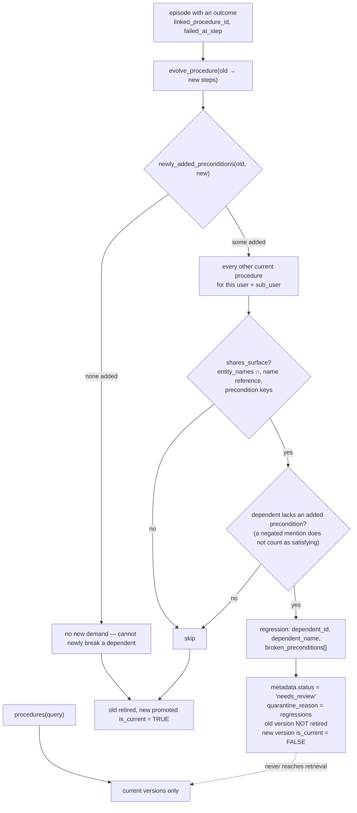

## 1. Executive Summary

Mengram is an Apache-2.0 memory service — Postgres, Cohere multilingual
embeddings and rerank across 23 languages, Python and npm SDKs, an MCP server, a
hosted console and a self-host Dockerfile. It separates facts, episodes and
**procedures**: "workflows that evolve from failures".

**The mechanism worth the report is a regression test for memory.**

When a procedure is revised, `cloud/regression_gate.py` checks the revision
against every other current procedure before promoting it:

> "The one open problem the 2025-26 procedural-memory literature leaves
> unclaimed: revising workflow A can silently break workflow B that depended on
> it. Every paper (MACLA 2512.18950, PRAXIS 2511.22074, GovMem 2607.02579,
> EvoSkill, AFTER) evaluates procedures in isolation. This module detects the
> interference before a revision is promoted, and quarantines it for review
> instead of shipping it to an agent."

The algorithm is small and its scope is honestly bounded — only a *newly added*
precondition can newly break a dependent:

```python
added = newly_added_preconditions(old_proc, new_proc)
if not added:
    return []  # a revision that adds no new demand can't newly break a dependent
for b in candidates:
    if not shares_surface(new_proc, b):
        continue
    broken = [k for k in added if dependent_lacks_precondition(b, k)]
```

And the failure behaviour is the part to copy. On a detected regression the store
sets `metadata["status"] = "needs_review"`, records the regressions as
`quarantine_reason`, **skips the `UPDATE … SET is_current = FALSE` on the old
version**, and writes the new one with `is_current = not gated`:

> "Only retire the old current version if the new one is safe to promote… If
> gated, it lands as NOT current (quarantined) — the last known-good version
> stays authoritative until review."

With the philosophy stated in the module header: *"ties go to safety
(quarantine), never silently promote a possibly-breaking revision."*

**Every other system in this atlas that corrects a memory applies the correction
and hopes nothing depended on the old one.** This is the only one that asks.

**And it built the benchmark for the problem** — section 10 — along with the
finding that nothing surfaces the quarantine it creates, section 9.

## 2. Mental Model

Three memory kinds with separate APIs: `search()` for facts, `episodes()` for
events, `procedures()` for workflows. A failed episode can evolve the procedure
it was linked to, producing a new version — and that promotion is gated.



## 3. Architecture

`cloud/` holds the store and the gate, `api/` the service, `engine/` the memory
kinds, `sdk/` the clients, plus `integrations/`, an Obsidian plugin, a VS Code
extension, `evals/`, `benchmarks/` (LoCoMo) and `benchmark/procinterfere/`.
About 39,000 lines, Apache-2.0, with a hosted tier and a `Dockerfile.selfhost`.

`cloud/regression_gate.py` is deliberately dependency-free: "Pure functions — no
DB, no model calls on the hot path. The store wires these in around
evolve_procedure()." Keeping the safety check as pure functions is what makes
both the unit tests and the benchmark possible without a database or an API key.

The procedure schema is the substrate the gate needs: `steps` as
`[{step, action, detail}]`, `entity_names[]` with a GIN index,
`trigger_condition`, `success_count`, `fail_count`, `version`,
`parent_version_id`, `is_current`, `metadata.preconditions`, `sub_user_id` —
plus a `procedure_evolution` table recording `version_before`, `version_after`,
the diff and the originating `episode_id`.

## 4. Essential Implementation Paths

**Gate** — `cloud/regression_gate.py` (`_tokens`, `_procedure_text`,
`shares_surface`, `newly_added_preconditions`, `dependent_lacks_precondition`,
`find_regressions` `:122-143`).

**Apply** — `cloud/store.py` `evolve_procedure` (the gate call `:5678-5697`, the
quarantine metadata `:5699-5703`, the conditional retire `:5705-5711`, the
`is_current = not gated` insert `:5713-5727`).

**Retrieve** — `cloud/store.py` `search_procedures_text` ("current versions
only"), `search_procedures`.

**Measure** — `benchmark/procinterfere/` (`README.md`, `cases.jsonl`, `run.py`),
`tests/test_regression_gate.py`.

## 5. Memory Data Model

Facts, episodes and procedures are separate kinds with separate query surfaces,
and only procedures carry the machinery this report is about.

A procedure's `metadata.preconditions` is what the gate reasons over, and
`entity_names[]` plus precondition-key overlap is what "shared surface" means in
v1. The design spec names a third signal — normalised verbs and tool tokens from
`steps[].action` — as a follow-up "needs a small action-tokenizer", so the
current surface test is structural rather than semantic.

`procedure_evolution` gives the correction history: what changed, from which
version to which, and which episode caused it.

## 6. Retrieval Mechanics

Multilingual hybrid retrieval with Cohere embeddings and rerank; `ask()` returns
a synthesised answer with citations. Procedure search is over **current versions
only**, which is what makes `is_current = FALSE` an effective quarantine rather
than a label.

`user_id` and `sub_user_id` are arguments to every procedure read
(`get_procedures(user_id, limit=200, sub_user_id=sub_user_id)`), so a stored
scope key reaches the query — `scope_enforced`. The gate itself is scoped the
same way: a revision is only checked against procedures in its own
user/sub-user, which is correct and also means cross-tenant interference is out
of scope by construction.

## 7. Write Mechanics

Procedures evolve from failed episodes. The gate sits between building the new
version and promoting it, and the ordering is the important part: **the old
version is not retired until the new one is known safe.** A naive implementation
retires first and inserts second, leaving a window — and, if the gate fails,
leaving no current version at all.

The gate's own failure mode is handled the other way:

```python
except Exception as e:
    logger.warning(f"regression gate skipped ({e})")
```

A gate that throws is skipped and the revision promotes. That is fail-*open* on
the safety check, and it is the one place the module's stated philosophy — "ties
go to safety" — is not applied: an exception is not a tie, but it is also not
evidence of safety. Quarantining on gate failure would cost a false positive and
buy the invariant.

## 8. Agent Integration

`pip install mengram-ai` or `npm install mengram-ai`, an MCP server, an Obsidian
plugin, a VS Code extension, and `mengram try` — a local-only preview that "see[s]
what memory would know about you… no account, nothing leaves your machine"
before you sign up. Letting someone evaluate the extraction quality without an
account is a good instinct.

The README's install instruction is a prompt to paste into an agent, pointing at
`https://mengram.io/agent-install.txt`, which the agent fetches and follows. It
is convenient and it is also an instruction-following flow whose contents live
off-repository and can change without a commit; a reader evaluating supply-chain
exposure should note that the pinned artifact is not what runs.

## 9. Reliability, Safety, and Trust

**Trust state — awarded.** `metadata.status = "needs_review"` together with
`is_current = FALSE` is a discrete state that withholds a revision from
retrieval, and procedure search is current-versions-only, so the exclusion is
real.

**Scope enforced — awarded**, per section 6.

**Human review — withheld, and this is the gap that matters.** The gate
quarantines "for review". Nothing in `api/`, `cloud/` or `sdk/` references
`needs_review` outside the store that writes it: **no endpoint lists the
quarantine queue, and no endpoint approves or rejects a gated revision.**

The consequence is that the safe behaviour is also a dead end. A revision that
trips the gate is stored, marked, and never seen again — while the old version
stays authoritative indefinitely, including in the case where the revision was
correct and the dependent procedure was the thing that needed updating. The
mechanism's first half is the novel part and its second half is a listing
endpoint.

**The gate fails open**, per section 7.

**Tombstone, bitemporal, audit log, negative eval — no.**
`procedure_evolution` records diffs, which is close to an audit trail for
procedures, and it is scoped to one memory kind rather than being a record of
mutations in general.

## 10. Tests, Evals, and Benchmarks

**`tests/test_regression_gate.py` tests each predicate in both directions** —
`shares_surface_by_entity` and `no_shared_surface`, `newly_added_preconditions`
and `no_new_preconditions`, `dependent_lacks_precondition` and
`dependent_already_satisfies`, `regression_detected` and
`no_regression_when_dependent_satisfies` — plus two cases a naive implementation
gets wrong: `test_same_procedure_never_shares_with_itself` and
`test_negated_mention_does_not_count_as_satisfying`.

**`benchmark/procinterfere/` is a new public benchmark for a problem nobody was
measuring**, and its framing is careful:

> "The first benchmark for **cross-procedure interference**… Every
> procedural-memory system from 2025–2026 evaluates learned skills **in
> isolation** — MACLA, PRAXIS, Memp, EvoSkill, AFTER… The AFTER authors list it
> as an open problem: *'whether skills can be optimized independently without
> cross-skill interference.'* Nobody measures it. This does."

The metric is **silent-regression rate** — "the % of memory revisions that break
a dependent procedure and get promoted anyway, with no flag" — reported beside a
**false-quarantine** rate, so over-flagging is measured too. 18 paired cases
across 12 domains, `should_flag` marking the breaking ones, runnable with "no
account, no key — the gate is pure deterministic code."

The reported table is `latest-wins` 100% / `append-only` 100% / `mengram-gate`
0% silent regression, all at 0% false quarantine.

**That table is a specification check, not evidence of generalisation**, and the
distinction matters. The 18 cases were authored alongside the rule they exercise,
and the two baselines are described accurately as what they are — "the industry
default: the newest version of a procedure always wins. No interference check" —
so a rule that flags added preconditions will score 100% against a rule that
checks nothing. Nothing here shows the gate catching an interference pattern its
author did not anticipate.

**The contribution is the metric and the case format, not the score.**
`silent-regression rate` alongside `false-quarantine` is a well-chosen pair, the
cases are one JSONL file, and "contributions of new interference patterns
welcome" is the right invitation. If another project's revisions were run through
it, that would be evidence.

Elsewhere: `evals/extraction_cases.yaml` with a runner, and a LoCoMo harness in
`benchmarks/`. 13 test files.

**One stale artifact.** `procedural-regression-gate-spec.md` is headed
`**Status:** design` and describes the gate as unbuilt, naming the bug in its own
code — "`store.evolve_procedure()` (`cloud/store.py:5551`) marks the old version
`is_current = FALSE` and writes a new `is_current = TRUE` version — with **zero
check on any other procedure that shared surface with it**… Today nothing detects
it." The gate has since shipped and the header was not updated. Writing the bug
in your own correction path down, with a file and a line, and locating it in five
papers by arXiv id, is worth more than the stale status line costs.

**I ran nothing.**

## 11. For Your Own Build

### Steal

- **Test a correction against the memories that might depend on it.** Before
  promoting a revised procedure, ask which other procedures share its surface and
  whether the revision adds a demand they do not satisfy. Nothing else in this
  atlas asks.
- **Bound the check so it is cheap and defensible.** Only a *newly added*
  precondition can newly break a dependent, so a revision that adds no demand
  short-circuits immediately.
- **Do not retire the old version until the new one is safe.** The conditional
  `UPDATE … SET is_current = FALSE` means a gated revision leaves the last
  known-good version authoritative, rather than leaving no current version at
  all.
- **Make the safety check pure functions.** No DB and no model calls means it is
  unit-testable, benchmarkable and runnable by a stranger with no API key.
- **Test each predicate in both directions, and include the subtle negatives.**
  "A negated mention does not count as satisfying" and "a procedure never shares
  surface with itself" are the two a first implementation gets wrong.
- **Report a false-positive rate beside your detection rate.** A quarantine gate
  with no false-quarantine column is a gate you cannot tune.
- **Write the bug in your own code down, with the file and the line**, and locate
  it in the literature by arXiv id. Five papers all leaving the same problem open
  is the strongest possible argument that it is worth solving.
- **Let people evaluate before they sign up.** `mengram try`, local only, no
  account.

### Avoid

- **Do not quarantine into a queue nobody can read.** `needs_review` is written
  and no endpoint lists or resolves it, so the gate's correct behaviour has no
  exit. A listing endpoint and an approve/reject pair complete the mechanism.
- **Do not fail open on a safety check.** `except: logger.warning("regression
  gate skipped")` promotes the revision when the gate throws. An exception is not
  evidence of safety.
- **Do not score your rule against cases written for your rule and call it a
  benchmark result.** 0% against two unchecked baselines on 18 self-authored
  cases is a specification test; the benchmark's value is the metric and the
  format, and it becomes evidence when someone else's system runs on it.
- **Do not leave a spec headed "design" after you built the thing.** A reader
  checking whether the gate exists finds a document saying it does not.

### Fit

Worth adopting if your agents learn procedures and you have ever had one
revision quietly invalidate another — which, per its own literature review, is
a problem the field has agreed to defer. The gate is 200-odd lines of pure
functions and could be lifted into a different store with the same procedure
shape.

Read `benchmark/procinterfere/README.md` and `cloud/regression_gate.py` even if
you adopt nothing. Between them they name a failure this atlas has been circling
— what happens to everything that depended on the memory you just corrected — and
make it measurable.

## 12. Open Questions

- **How is a quarantined revision resolved?** No endpoint was found; whether the
  hosted console exposes one could not be established from the repository.
- **Has ProcInterfere been run against another system?** The value of the
  benchmark depends on it.
- **Did the action-tokenizer land?** The spec names tools/verbs as the third
  shared-surface signal and v1 uses entities and preconditions.
- **What does `agent-install.txt` contain?** The install path fetches and follows
  an off-repository document.

## Appendix: File Index

**The gate** — `cloud/regression_gate.py` (the literature framing and philosophy
`:1-21`, the procedure shape `:13-20`, `_tokens` `:34`, `_procedure_text` `:40`,
`find_regressions` `:122-143`)

**Applying it** — `cloud/store.py` (`evolve_procedure`: the gate call
`:5678-5697`, the skip-on-exception `:5696-5697`, the quarantine metadata
`:5699-5703`, the conditional retire `:5705-5711`, `is_current = not gated`
`:5713-5727`), `search_procedures_text` ("current versions only")

**The spec** — `procedural-regression-gate-spec.md` (the stale `Status: design`
header `:3`, the five papers and their open problems `:5-11`, the HN-safe
positioning `:13-17`, "The bug this closes (in our own code)" `:19-27`, the
existing tables `:29-37`, "shared surface" `:39-50`, the v1 mechanism `:52-`)

**The benchmark** — `benchmark/procinterfere/README.md` (the framing and the five
arXiv citations `:1-15`, the silent-regression metric `:17-21`, the results table
`:22-40`, the run instructions `:42-49`, what a case looks like `:51-`),
`benchmark/procinterfere/cases.jsonl` (18 cases), `run.py`

**Tests and evals** — `tests/test_regression_gate.py` (`:23-90`),
`evals/extraction_cases.yaml`, `evals/run_extraction_evals.py`,
`benchmarks/locomo_bench.py`

## History

**2026-08-09** — [`99bfd824c374d85f021290f6f78de357243ebf9a`](https://github.com/alibaizhanov/mengram/commit/99bfd824c374d85f021290f6f78de357243ebf9a) — first reading. Screened before reading; the tree was read, never installed, and no benchmark was run. The gate described as unbuilt in the repository's own spec was found implemented and wired into `evolve_procedure`.
