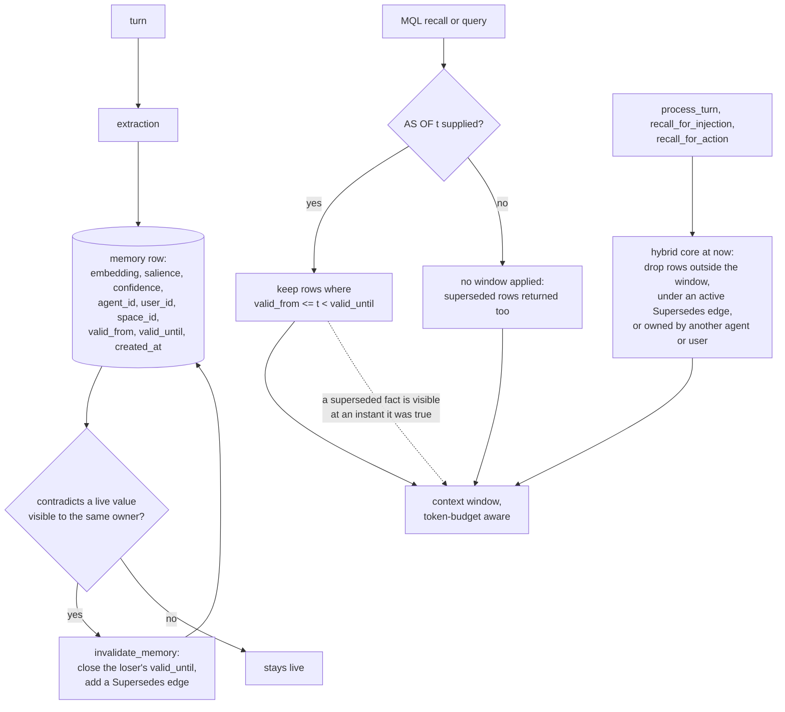

## 1. Executive Summary

MenteDB is a memory engine written as a database: its own page store, a
write-ahead log, HNSW and BM25 indexes, a graph crate and a replication crate,
under Python and TypeScript SDKs. What is notable is a query language with two
time axes, whose `AS OF t` judges each memory against the instant asked for.
What is weak is scope: the owner ids are optional arguments, and the query
language and the server's recall routes pass none.

**The query language carries both time axes, and the semantics are argued in
the AST.** `Field` carries `Created` for record time and `ValidAt` for validity,
and the comment on `ValidAt` states what `AS OF` means and why:

> Temporal validity at a point in time: `AS OF <t>` keeps only memories that were
> valid at timestamp `t` (valid_from <= t < valid_until), so a query can see what
> was true at a past moment, including facts later superseded.

The last clause is the design decision. A store that tracks validity usually
uses it to *drop* what is currently invalid; this one judges each memory
against the instant asked for, so a superseded fact is visible when you ask
about a moment it was true. `invalidate_memory` closes a window rather than
deleting a row, which is what makes that possible
(`crates/mentedb/src/lib.rs:1966`). The cost sits on the other side of the
default: without `AS OF`, the MQL executor applies no window at all, so a bare
`RECALL` returns a superseded row beside its replacement (section 6).

**The test that pins it is the best thing in the repository.**
`as_of_recalls_the_validity_window_including_superseded_facts` stores three
memories — one always valid, one superseded at t=1000, one valid only from
t=2000 — and asks at three instants:

```rust
// AS OF 500: stable + superseded are valid; future is not yet valid.
assert!(has(&at_500, "stable fact"));
assert!(has(&at_500, "was true early then replaced"));
assert!(!has(&at_500, "becomes true later"));
```

Every negative sits beside a positive over the same populated store, so none
can pass on an empty result. That earns `negative_eval`, and it is the kind that
is about a particular memory rather than a rate. The user- and agent-isolation
suites assert scope the same way (section 10).

**Beside it is a regression written from a real failure.**
`crates/mentedb/tests/memory_dedup.rs:84` opens with the bug it exists for: *"i
use next.js for the front end" then "now i use react for the front end" left
BOTH facts live, and recall kept answering with the stale one*. It records that
the old rule *"only created an edge, never invalidating the loser out of
recall."* It asserts that the loser's `valid_until` is set, which is the
mechanism rather than the outcome: the hybrid recall path drops the closed row,
and a bare MQL recall returns it regardless.

Three marks — `bitemporal`, `scope_enforced` and `negative_eval` — and four
withheld: `trust_state`, `tombstone`, `audit_log` and `human_review`.
`scope_enforced` rests on the hybrid recall core, and its bound is in section 6.

## 2. Mental Model

A memory is a row with a validity window, and time is the axis everything turns
on. Two read entrances disagree about the default instant.



The dotted edge is what separates this from a store that hides invalid rows.
The `ALL` box is the price of putting validity in the query: an MQL caller who
does not name an instant gets every window.

## 3. Architecture

Fourteen crates, and the separation is the kind a database has rather than the
kind a library has. `mentedb-storage` owns pages and the WAL, `mentedb-index`
owns HNSW, BM25, the tag bitmap and the `created_at` index, `mentedb-query` owns
the AST, parser and planner, and `mentedb-core` holds the shared types.
`mentedb-cognitive` holds write inference and the trajectory tracker, and
`mentedb-context` holds context assembly and delta tracking. `mentedb-graph`,
`mentedb-consolidation`, `mentedb-extraction`, `mentedb-embedding`,
`mentedb-replication`, `mentedb-server` and `mentedb-cli` sit around them, and
`mentedb` is the facade that owns the recall paths.

**What has to be running is nothing.** It is an embedded engine — open a
directory, get a `MenteDb`. The server crate and the Docker compose file are for
when you want it hosted, and the Python and TypeScript SDKs bind the same core.

**Hosted scale-out separates accounts physically.**
`crates/mentedb/src/sharding.rs` leases each account's single-writer database
to one node. Inside one database, agents and users are separated by the owner
ids in section 6 and nothing else.

The WAL is `//! Write-Ahead Log: append-only log for crash recovery` with a
documented on-disk entry format carrying an LSN, a page id, compressed data and a
CRC32. It is durability infrastructure — see section 9 for why that is not the
audit mark.

## 4. Essential Implementation Paths

- **Memory type** — `crates/mentedb-core/src/memory.rs`: ids and scope (41-70),
  validity window (76-80), `created_at` (58), `is_valid_at` (156-162).
- **Query language** — `crates/mentedb-query/src/ast.rs`: `Field` including
  `Created` and `ValidAt` (80-95), `Operator` (97-113);
  `crates/mentedb-query/src/parser.rs` — `AS OF` lowering (156-177), `Agent` and
  `Space` fields (346-347), parse tests (709, 731);
  `crates/mentedb-query/src/planner.rs` — `TemporalScan` planning (151-200).
- **MQL execution** — `crates/mentedb/src/lib.rs`: `recall` (1429), `query`
  (1445), `recall_reranked` (1458), `execute_plan` (3228), the `TemporalScan`
  arm (3341-3354), `filter_matches` and its permissive default (3478-3519).
- **Hybrid recall** — `crates/mentedb/src/lib.rs`: `recall_hybrid_scoped_at_mode`
  (1726), its supersede and window-and-owner checks (1781-1801); the unscoped
  wrappers `recall_similar_filtered` (1501), `recall_hybrid_at` (1670),
  `recall_hybrid_at_mode` (1694); `recall_for_action` (1567).
- **Turn and injection** — `crates/mentedb/src/process_turn.rs`: `process_turn`
  (299), `recall_turn_context` (315), `retrieve_context` (454-529);
  `crates/mentedb/src/injection.rs`: `recall_for_injection` (330-350).
- **Invalidation** — `crates/mentedb/src/lib.rs:1966` (`invalidate_memory`),
  write inference (2588-2654), the `InvalidateMemory` action (2684-2710).
- **Scope** — `crates/mentedb/src/lib.rs:737-754` (`agent_visible`,
  `user_visible`); the enrichment reads `all_entity_names` (4182-4188) and
  further comparisons (4226, 4517, 4559); cluster ownership (3046-3058).
- **Server** — `crates/mentedb-server/src/handlers.rs`: `/v1/recall` (263),
  `/v1/search` (291), `/v1/process_turn` (428) and its token check (471-482);
  `crates/mentedb-server/src/grpc.rs`: `recall` (259), `search` (281).
- **Storage** — `crates/mentedb-storage/src/engine.rs`, `wal.rs`.
- **Indexes** — `crates/mentedb-index/src/hnsw.rs`, `bm25.rs`, `manager.rs`.
- **Tests** — `crates/mentedb/tests/integration.rs` (AS OF at 1856),
  `memory_dedup.rs` (84), `user_isolation.rs`, `agent_isolation.rs`,
  `scenarios.rs`, `realistic.rs`, `process_turn.rs`.

## 5. Memory Data Model

A memory carries content, an embedding, a `MemoryType`, a `Salience`, a
`Confidence`, an access count and timestamps, plus three identifiers —
`agent_id`, `user_id`, `space_id` — and an optional `valid_from` / `valid_until`
pair. `user_id` defaults to the nil user for rows written before the field
existed, and nil-owned rows are shared on that axis.

`space_id` is stored and not read on any retrieval path. Its readers are
`ForgetEngine::plan_forget` (`crates/mentedb-consolidation/src/forget.rs:57-62`)
and the server's space grant route, which is the one caller of the space ACL's
`check_access` (`crates/mentedb-server/src/handlers.rs:830`).

`Confidence` is a number and `Salience` is a number. There is no discrete
status: `crates/mentedb-core/src/conflict.rs:22` defines a `Resolution` enum —
`KeepLatest`, `KeepHighestConfidence`, `Merge(String)`, `Manual(String)` — which
is a *strategy* for choosing between versions rather than a state recorded on
either, and `ConflictResolver` has no caller outside tests. The live conflict
path is write inference (section 7).

**`trust_state` is withheld**, and the near-miss is a tag. `process_turn`
stores speculative turns as ghost memories at confidence 0.3 tagged
`ghost-memory` and `unconfirmed` (`crates/mentedb/src/process_turn.rs:1021-1040`),
and `recall_for_injection` excludes the tag (`crates/mentedb/src/injection.rs:362-365`,
`:492`). That is a write-time genre: no writer in `crates/` removes either tag,
and `process_turn`'s own `retrieve_context` does not filter it.

## 6. Retrieval Mechanics

**There are two read entrances.** MQL is parsed, planned and executed against
the indexes (`execute_plan`, `crates/mentedb/src/lib.rs:3228`). The hybrid core,
`recall_hybrid_scoped_at_mode` (`:1726`), fuses HNSW and BM25, applies decay, an
optional reranker and an MMR pass, and is what `process_turn`,
`recall_for_injection` and `recall_for_action` call. Both feed a token-budgeted
context window.

**Validity depends on the entrance.** The hybrid core drops a row outside its
window at the instant given and a row under an active `Supersedes` or
`Contradicts` edge (`:1781-1801`). MQL applies a window only through the
`ValidAt` filter `AS OF` adds; a bare `RECALL` loads rows without checking one.
The docstring on `invalidate_memory` says an invalidated memory is *"excluded
from current recall results"* (`:1968-1969`), which holds for the hybrid core
and not for MQL.

**The two axes combine in one statement on some plans only.** On a vector plan
every leaf is post-filtered, so `Created` and `AS OF` both apply. A non-vector
statement with a `Created` range is planned as `TemporalScan`
(`crates/mentedb-query/src/planner.rs:151-200`), and its executor arm matches the
remaining filters with `..` and discards them (`lib.rs:3341-3354`), `AS OF`
included.

**Scope is a predicate in the hybrid core.** Every candidate is loaded and
dropped unless `agent_visible(node.agent_id, agent) && user_visible(node.user_id,
user)` holds (`:1797-1801`). Each admits the caller's own rows and nil-owned
shared rows (`:737-754`). The turn path, the injection path, and the dedup and write-inference candidate
pools pass the owner ids through it, and `recall_for_action` applies the same
two predicates to its own candidates (`:1597-1599`).
The enrichment reads take the ids as mandatory arguments, and consolidation
refuses a cluster that mixes owners (`:3046-3058`).

**The bound is who passes the ids.** Both are `Option`, and `None` recalls
globally on that axis — `agent_isolation.rs:98-114` asserts it. MQL passes none:
`Field` has no user member, and `Agent` and `Space` parse
(`parser.rs:346-347`) but `filter_matches` has no arm for either and returns
`true` for any unhandled field (`lib.rs:3517`). `WHERE agent = <id>` is
accepted and returns every agent's rows.

**The server does not supply them either.** `/v1/recall`, `/v1/search`, the gRPC
`recall` and `search` methods and the WebSocket `query` message call `recall` or
`recall_similar` without reading the token's agent id
(`crates/mentedb-server/src/handlers.rs:263-310`,
`crates/mentedb-server/src/grpc.rs:259-294`). `/v1/process_turn` compares the
body's `agent_id` with the token only when the body names one (`handlers.rs:471-482`),
so a scoped token that omits it runs an unscoped turn. Read, not run.

## 7. Write Mechanics

`process_turn` extracts memories from a turn and stores them; writes are
synchronous into the page store behind the WAL, and retrievable immediately.
`recall_turn_context` and `ingest_turn` split the turn so a caller can answer
before ingestion runs.

**Supersession closes a window rather than deleting a row**, which is the write
half of the AS OF design. When a new value contradicts a live one visible to the
same owner, the loser's `valid_until` is set and a `Supersedes` edge is added
(`crates/mentedb/src/lib.rs:2684-2710`). The dedup regression records what that
fixed: before it, the rule *"only created an edge, never invalidating the loser
out of recall"*, so both facts stayed live.

**`tombstone` is withheld.** The recorded grep returns an HNSW deletion marker
(`crates/mentedb-index/src/hnsw.rs:663`), a vector whose page is gone
(`crates/mentedb-index/src/manager.rs:224`) and a gossip departure marker
(`crates/mentedb/src/sharding/gossip.rs:38`). Each is keyed on an id or a node,
not on a value.

**The closed window is not consulted when a value returns.** Write inference
draws its comparison candidates from the hybrid core at `now`
(`lib.rs:2600-2612`), and dedup does the same (`:1220-1231`). Both drop rows
outside their window, so a re-extracted stale value is compared only against
live rows and is stored as a new live row. The record that could refuse it is
filtered out before the comparison runs.

## 8. Agent Integration

A Rust library first, with Python and TypeScript SDKs, a CLI, and a server crate
with REST, gRPC, WebSocket and an admin MQL endpoint. Two surfaces matter to an
agent. MQL gives the full language, including `AS OF`, and no scope.
`process_turn` and `recall_for_injection` are the turn-shaped surfaces, and
they carry scope when the caller passes it.

The Python binding narrows that. Its `recall_for_injection` takes an agent id and
hardcodes `user_id: None` (`sdks/python/src/lib.rs:430-462`), so a Python caller
has no user axis on that path. Its `recall_for_action` passes a trigger string
and four arguments (`:504`) to an engine method that takes an embedding and
five (`crates/mentedb/src/lib.rs:1567-1574`), a signature that changed on
28 July 2026. The CI workflow checks and tests the workspace, which does not
include `sdks/` (`.github/workflows/ci.yml:21`, `:36`). The binding was read,
not built.

## 9. Reliability, Safety, and Trust

The WAL, the CRC32 per entry and the replication crate are the reliability story,
and they are the parts of this that look most like a database.

**The server's auth is per agent and applied per route.** A JWT names an agent
id. `GET` and `DELETE /v1/memories/{id}` refuse a memory another agent owns, and
the gRPC `store` method refuses a mismatched agent id
(`crates/mentedb-server/src/grpc.rs:187-193`). The recall and search routes
authenticate the token and do not scope by it (section 6), so a token for one
agent recalls every agent's content through `/v1/recall` and every agent's ids
through `/v1/search`. With no JWT secret configured, the
middleware admits every request (`crates/mentedb-server/src/auth.rs:155-163`).

**`audit_log` is withheld, deliberately.** A write-ahead log is an append-only
record of mutations, which is close enough to the words of the rubric to need an
answer. Its purpose here is crash recovery, its entries are physical — an LSN, a
page id, compressed page data — and it carries no actor, no action vocabulary and
no reason. It cannot answer *who changed this memory and why*, only *what bytes
must be replayed*, and `truncate` discards entries once the pages are durable
(`crates/mentedb-storage/src/wal.rs:238`). The atlas treats git history the
same way: a real mechanism, noted in prose, not this mark.

The second near-miss is `ForgetEngine::generate_audit_log`
(`crates/mentedb-consolidation/src/forget.rs:92-113`). It formats a reason, an
owner and deletion counts into a string that `plan_forget` returns; nothing
persists it, and its callers are tests.

**`human_review` is withheld** for absence — no memory waits in a state for a
person to resolve it. `Resolution::Manual(String)` is a strategy value with no
caller outside tests. `test_pipeline_audit.py` at the repository root is a
manual verification script that requires a live OpenAI or Anthropic key, not a
review surface and not a committed test.

## 10. Tests, Evals, and Benchmarks

Substantial Rust test suites — `integration.rs` at 1,910 lines, `realistic.rs`
at 1,119, `scenarios.rs` at 1,089 — plus `benchmarks/longmemeval/`, whose
`requirements.txt` pins nothing and whose runner calls OpenAI and Anthropic, so
re-running it is neither free nor reproducible from the tree alone.

**The AS OF test has four negatives, each beside a positive.** It asks at 500,
1500 and 3000 over the same three-memory store, and at each instant asserts the
stable fact is present before asserting a superseded or not-yet-valid one is
absent (`crates/mentedb/tests/integration.rs:1856-1910`). None can pass against
a retriever that returned nothing.

**Scope is tested the same way, on the hybrid core.**
`user_scoping_is_orthogonal_to_agent` stores two users' memories under one agent
and asserts user A's own is returned before asserting no returned row carries
user B's text (`crates/mentedb/tests/user_isolation.rs:238-286`).
`scoped_user_still_sees_own_and_global` (`:124-158`) and
`scoped_recall_isolates_agents` (`crates/mentedb/tests/agent_isolation.rs:48-114`)
pair each exclusion with the caller's own and a shared memory.

Two cases in `user_isolation.rs` assert absence only.
`other_users_memory_never_leaks_into_a_turn` (`:91-120`) and
`scoped_recall_excludes_other_users_even_as_top_match` (`:160-188`) assert that a
secret is missing and nothing is present, so each passes on an empty result.

The server suite asserts that `GET` and `DELETE` refuse another agent's memory
(`crates/mentedb-server/tests/integration.rs:670-724`). Its `/v1/recall` and
`/v1/search` cases run on an app built without auth, and no case runs a scope
through MQL, which is where section 6 finds it absent.

**The result is committed, and it recomputes.** `benchmarks/longmemeval/results/`
holds four files: the raw per-question hypotheses, the official judge's labels
(`hypotheses_baseline-shared_q0-500.jsonl.eval-results-gpt-4o-2024-08-06`, 500
rows), a Markdown report and `longmemeval_s_results.jsonl`. Counting
`label == 1` across the judge file gives **460/500**, which is the README's
headline of 92.0% exactly. The README publishes the per-category distribution
rather than the single number — 100% on single-session assistant questions down
to 85.7% on multi-session reasoning — and names that weakest category itself.

No paper of its own, and no `CITATION.cff`. A grep of the README,
`ARCHITECTURE.md`, `VISION.md` and `docs/` for `arxiv`, `bibtex`, `@article`,
`@misc`, `citation` and `doi` returns exactly one match — the
[LongMemEval](https://arxiv.org/abs/2410.10813) link in the benchmark section,
which is the benchmark's paper rather than MenteDB's.

Nothing was run. The screen reports two cargo `build.rs` build-time execution
points, floating benchmark requirements and an agent-instructions file.

## 11. For Your Own Build

### Steal

**Make validity a query field, not a filter the store applies for you.** `AS OF t`
judging each row against the instant asked for — rather than dropping whatever is
invalid now — is the difference between a store that has history and a store that
can be *asked* about history. It costs one enum member and one comparison.

**Invalidate by closing a window, never by deleting.** The row stays readable at
an earlier instant, which is what makes the previous point possible.

**Put the semantics in the AST comment.** The three lines on `ValidAt` say what
the operator does and what it deliberately does not do. A reader of the planner
does not have to reconstruct the intent from the comparison.

**Write the regression test from the symptom.** *"i use next.js for the front
end" then "now i use react"* names the user-visible failure, and the comment adds
the mechanism that failed. Then assert the symptom as well as the mechanism: a
recall that must not return the loser covers a second read path, and a field
assertion does not.

**Pair every negative with a positive in the same result.** Four
`assert!(!has(...))` calls in the AS OF test would prove nothing on their own,
and the two scope cases here that skip the pairing prove nothing either.

### Avoid

**A filter evaluator whose default is `true`.** `filter_matches` accepts any
field it does not handle, so a scope clause parses, plans and filters nothing.
An unknown field in a read predicate should be an error.

**Optional scope that defaults to global.** `None` meaning every owner makes a
forgotten argument a cross-tenant read, and the routes that omit it here are
the server's. Make the unscoped call a separate, named method.

**Reading a WAL as an audit trail.** It is append-only and it records mutations
and it is the wrong thing to point at when someone asks what happened to a
memory. Two mechanisms, two purposes.

### Fit

This suits a team that wants memory with database properties — durability,
replication, an index they can reason about — and that will call the engine's
turn and injection paths with both owner ids from code it controls. The temporal
model is the best reason to choose it: if your application needs to ask what it
believed last March, `AS OF` answers that directly.

It is the wrong fit where the hosted server's routes are the boundary between
tenants, where a wrong value must be unable to return, or where a reviewer needs
somewhere to stand. The first is a gap in the server; the second and third are
absences in the engine.

## 12. Open Questions

- **Is `/v1/recall` meant for a trusted caller only?** It authenticates the token
  and ignores its agent id; an admin-only intent would explain it, and the route
  is outside the `/v1/admin` prefix.
- **Should `Agent` and `Space` in MQL filter or fail?** The parser accepts them,
  a planner test asserts `Field::Agent` reaches the plan, and nothing evaluates
  it.
- **Is the `TemporalScan` filter drop known?** Its planner builds `remaining` and
  the executor discards it, so the intent and the behaviour disagree in the tree.
- **What does the replication crate do with a closed validity window?** Two
  replicas disagreeing about when a fact stopped being true is the interesting
  failure, and it was not traced here.

## Appendix: File Index

**Core types**

- `crates/mentedb-core/src/memory.rs` — ids (41-50), type and embedding (52-56),
  `created_at` (58), scores (64-66), `space_id` (68), validity (76-80),
  `is_valid_at` (156-162)
- `crates/mentedb-core/src/conflict.rs` — `Resolution` (22)
- `crates/mentedb-core/src/edge.rs`, `tier.rs`

**Query**

- `crates/mentedb-query/src/ast.rs` — `Field` with `Created` and `ValidAt` (80-95),
  `Operator` (97-113)
- `crates/mentedb-query/src/parser.rs` — `AS OF` lowering (156-177), `Agent` and
  `Space` (346-347), parse tests (709, 731)
- `crates/mentedb-query/src/planner.rs` — `TemporalScan` with `remaining` (151-200)
- `crates/mentedb-query/tests/integration.rs` — `Field::Agent` reaches the plan (58)

**Engine**

- `crates/mentedb/src/lib.rs` — `agent_visible`, `user_visible` (737-754),
  dedup candidates (1220-1231), `recall` (1429), `query` (1445),
  `recall_similar_filtered` (1501), `recall_for_action` (1567),
  `recall_hybrid_scoped_at_mode` (1726, checks 1781-1801), `invalidate_memory`
  (1966-1982), write inference (2588-2654), supersession (2684-2710), cluster
  ownership (3046-3058), `execute_plan` (3228), `TemporalScan` arm (3341-3354),
  `filter_matches` (3478-3519), `all_entity_names` (4182-4188), further scope
  comparisons (4226, 4517, 4559)
- `crates/mentedb/src/process_turn.rs` — `process_turn` (299), `retrieve_context`
  (454-529), ghost memories (1021-1040)
- `crates/mentedb/src/injection.rs` — `recall_for_injection` (330-350), ghost
  exclusion (362-365, 492)
- `crates/mentedb/src/sharding.rs` — per-account leases
- `crates/mentedb-storage/src/engine.rs`, `wal.rs` (format at 3-8, `truncate` at 238)
- `crates/mentedb-index/src/hnsw.rs`, `bm25.rs`, `manager.rs`
- `crates/mentedb-consolidation/src/forget.rs` — `plan_forget`, `generate_audit_log` (92-113)

**Server and SDKs**

- `crates/mentedb-server/src/handlers.rs` — `/v1/recall` (263), `/v1/search` (291),
  `/v1/process_turn` (428, token check 471-482)
- `crates/mentedb-server/src/grpc.rs` — `store` agent check (187-193), `recall` (259),
  `search` (281)
- `crates/mentedb-server/src/auth.rs` — `auth_middleware` (155)
- `sdks/python/src/lib.rs` — `recall_for_injection` (430-462), `recall_for_action` (489-505)

**Tests and benchmarks**

- `crates/mentedb/tests/integration.rs` — AS OF (1856-1910), `valid_until` (135)
- `crates/mentedb/tests/memory_dedup.rs` — the production-bug regression (84-120)
- `crates/mentedb/tests/user_isolation.rs` — paired scope cases (124-158, 238-286),
  absence-only cases (91-120, 160-188)
- `crates/mentedb/tests/agent_isolation.rs` — scoped and unscoped recall (48-114)
- `crates/mentedb/tests/scenarios.rs`, `realistic.rs`, `process_turn.rs`
- `benchmarks/longmemeval/` — the harness, and `results/` with the committed judge labels

### Commands behind the absence claims

```sh
grep -rn -i "tombstone" crates --include="*.rs"
grep -rn -iE "review|approve|human" crates --include="*.rs" | grep -v tests
grep -rn -iE "arxiv|bibtex|@article|@misc|citation|doi\b" README.md ARCHITECTURE.md VISION.md docs/
ls CITATION.cff
grep -rnE "Field::(Agent|Space)" --include="*.rs" .
grep -rn "space_id" --include="*.rs" crates sdks | grep -v "/tests/"
grep -rn "check_access" --include="*.rs" crates | grep -v "/tests/"
grep -rnE "ghost-memory|\"unconfirmed\"" --include="*.rs" crates sdks
grep -rnE "ForgetEngine|generate_audit_log" --include="*.rs" crates sdks
grep -rnE "Resolution::|ConflictResolver" --include="*.rs" crates sdks
grep -n "run:" .github/workflows/ci.yml
grep -nE "v1/(recall|search)" crates/mentedb-server/tests/integration.rs
```

## History

**2026-09-26** — [`4ba993dcf52f0a17065a9a2484fe59777dcd45d4`](https://github.com/nambok/mentedb/commit/4ba993dcf52f0a17065a9a2484fe59777dcd45d4) — audit at an unchanged pin; upstream `main` has not moved. Marks unchanged; four published claims were wrong. `scope_enforced` rested on the entity reads and is re-anchored on the hybrid recall core the turn and injection paths use ([section 6](#6-retrieval-mechanics)). The report said MQL can express agent scope; `Agent` parses and nothing evaluates it. It said no case asserts cross-user absence; `user_isolation.rs` does ([section 10](#10-tests-evals-and-benchmarks)). It said a query without `AS OF` keeps rows valid now; MQL applies no window. Also found: `TemporalScan` discards `AS OF`, the server's recall routes ignore the token's agent, and the Python SDK's `recall_for_action` call does not match the engine. Screened: two cargo `build.rs` execution points, floating benchmark requirements, an agent-instructions file. Nothing installed, built or run.

**2026-09-13** — [`4ba993dcf52f0a17065a9a2484fe59777dcd45d4`](https://github.com/nambok/mentedb/commit/4ba993dcf52f0a17065a9a2484fe59777dcd45d4) — first reading. Screened first: two cargo `build.rs` build-time execution points and a benchmark requirements file pinning nothing, so nothing was installed and `cargo test` was not run. Three marks. `bitemporal` is earned on two queryable fields rather than two columns — `Created` and `ValidAt` are both members of the planner's `Field` enum — which is the distinction that cost another system in this corpus the same mark on the same day. `audit_log` is withheld on a deliberate reading: the write-ahead log is append-only and records mutations, and its entries are physical pages with no actor, action or reason, so it answers what must be replayed rather than what changed and why. `scope_enforced` is earned on the typed reads that take the ids as mandatory parameters, with the bound recorded that the primary `recall` takes only a query string.
