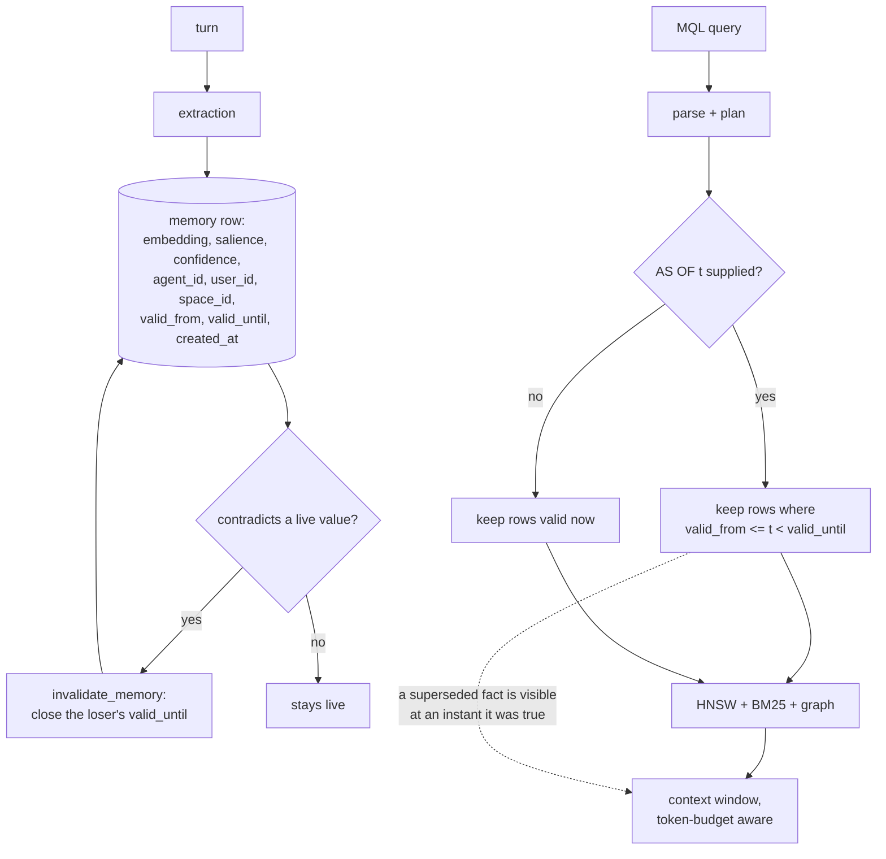

## 1. Executive Summary

MenteDB is a memory engine written as a database — about 61,800 lines of Rust
across fourteen crates, with its own page store, a write-ahead log, an HNSW vector
index, a BM25 index, a graph crate, a replication crate, and Python and TypeScript
SDKs over the top.

**Its distinctive contribution is a query language with two time axes**, and the
semantics are argued in the AST rather than left to a reader. `Field` carries
`Created` for record time and `ValidAt` for validity, both usable in one
statement, and the comment on `ValidAt` states what `AS OF` means and why:

> Temporal validity at a point in time: `AS OF <t>` keeps only memories that were
> valid at timestamp `t` (valid_from <= t < valid_until), so a query can see what
> was true at a past moment, including facts later superseded.

The last clause is the design decision. Most stores in this atlas that track
validity use it to *drop* what is currently invalid; this one judges each memory
against the instant asked for, so a superseded fact is visible when you ask about
a moment it was true and hidden when you ask about now. `invalidate_memory`
(`crates/mentedb/src/lib.rs:1966`) closes a window rather than deleting a row,
which is what makes that possible.

**The test that pins it is the best thing in the repository.**
`as_of_recalls_the_validity_window_including_superseded_facts` stores three
memories — one always valid, one superseded at t=1000, one valid only from t=2000
— and then asks at two instants:

```rust
// AS OF 500: stable + superseded are valid; future is not yet valid.
assert!(has(&at_500, "stable fact"));
assert!(has(&at_500, "was true early then replaced"));
assert!(!has(&at_500, "becomes true later"));
```

Every negative sits beside a positive over the same populated store, so neither
can pass on an empty result. That earns `negative_eval`, and it is the kind that
is about a particular memory rather than a rate.

**Beside it is a regression written from a real failure.**
`crates/mentedb/tests/memory_dedup.rs:84` opens with the bug it exists for: *"i
use next.js for the front end" then "now i use react for the front end" left BOTH
facts live, and recall kept answering with the stale one*, and it records that the
old rule *"only created an edge, never invalidating the loser out of recall."* A
test that names the production symptom and the mechanism that failed is worth more
than three that assert a happy path.

Three marks. `scope_enforced` is earned with a bound worth reading in section 6,
and the other three are withheld.

## 2. Mental Model

A memory is a row with a validity window, and time is the axis everything turns
on.



The dotted edge is what separates this from a store that simply hides invalid
rows.

## 3. Architecture

Fourteen crates, and the separation is the kind a database has rather than the
kind a library has: `mentedb-storage` owns pages and the WAL, `mentedb-index`
owns HNSW and BM25, `mentedb-query` owns the AST, parser and planner,
`mentedb-graph`, `mentedb-consolidation`, `mentedb-extraction`,
`mentedb-embedding`, `mentedb-replication`, `mentedb-server` and `mentedb-cli`
sit around them, and `mentedb-core` holds the types they share.

**What has to be running is nothing.** It is an embedded engine — open a
directory, get a `MenteDb`. The server crate and the Docker compose file are for
when you want it hosted, and the Python and TypeScript SDKs bind the same core.

The WAL is `//! Write-Ahead Log: append-only log for crash recovery` with a
documented on-disk entry format carrying an LSN, a page id, compressed data and a
CRC32. It is durability infrastructure — see section 9 for why that is not the
audit mark.

## 4. Essential Implementation Paths

- **Memory type** — `crates/mentedb-core/src/memory.rs`: ids and scope (41-70),
  validity window (76-80), `created_at` (58).
- **Query language** — `crates/mentedb-query/src/ast.rs`: `Field` including
  `Created` and `ValidAt` (80-95), `Operator` (97-113);
  `crates/mentedb-query/src/parser.rs` — `AS OF` parse tests (709, 731).
- **Recall** — `crates/mentedb/src/lib.rs`: `recall` (1429), `query` (1445),
  `recall_reranked` (1458), `recall_similar_filtered` (1501),
  `recall_for_action` (1567).
- **Invalidation** — `crates/mentedb/src/lib.rs:1966` (`invalidate_memory`),
  dedup and supersession around `:2674-2693`.
- **Scope on reads** — `crates/mentedb/src/lib.rs:4182-4188` (`all_entity_names`),
  `:4226`, `:4517`, `:4559`, cluster ownership at `:3054`.
- **Storage** — `crates/mentedb-storage/src/engine.rs`, `wal.rs`.
- **Indexes** — `crates/mentedb-index/src/hnsw.rs`, `bm25.rs`.
- **Tests** — `crates/mentedb/tests/integration.rs` (AS OF at 1856),
  `memory_dedup.rs` (84), `scenarios.rs`, `realistic.rs`, `process_turn.rs`.

## 5. Memory Data Model

A memory carries content, an embedding, a `MemoryType`, a `Salience`, a
`Confidence`, an access count and timestamps, plus three identifiers —
`agent_id`, `user_id`, `space_id` — and an optional `valid_from` / `valid_until`
pair.

`Confidence` is a number and `Salience` is a number. There is no discrete status:
`crates/mentedb-core/src/conflict.rs` defines a `Resolution` enum with
`KeepLatest` and `KeepHighestConfidence`, which is a *strategy* for choosing
between two rows rather than a state recorded on either. **`trust_state` is
withheld** — the rubric asks for a status that can withhold a memory, and a
confidence float ranks rather than withholds.

## 6. Retrieval Mechanics

MQL is parsed to an AST, planned, and run against HNSW, BM25 and the graph, with
results assembled into a token-budgeted context window.

**Scope is enforced where a parameter demands it and expressible everywhere
else.** The entity and cluster reads take the keys as mandatory positional
arguments — `all_entity_names(&self, user: UserId, agent: AgentId)` compares
`mem.agent_id != agent || mem.user_id != user` before using a row, and the
consolidation path refuses a cluster containing another user's memory
(`:3054`). Those are real read-path predicates on a stored key, and they earn the
mark.

The bound is the primary path. `recall(&self, query: &str)` takes only an MQL
string, so whether a general recall is scoped depends on whether the caller wrote
`Agent` or `Space` into the query. A deployment that serves two users from one
database and does not template the scope into every query has no boundary on that
path. `Agent` and `Space` are `Field` members, so the language can express it; the
engine does not insist.

## 7. Write Mechanics

`process_turn` extracts memories from a turn and stores them; writes are
synchronous into the page store behind the WAL, and retrievable immediately.

**Supersession closes a window rather than deleting a row**, which is the write
half of the AS OF design. When a new value contradicts a live one, the loser's
`valid_until` is set. The dedup regression records what that fixed: before it, the
rule *"only created an edge, never invalidating the loser out of recall"*, so both
facts stayed live and recall kept answering with the stale one.

**`tombstone` is withheld.** Nothing keys a record on a rejected value:

```sh
grep -rn -i "tombstone" crates --include="*.rs"
```

Nothing in the storage engine at the pinned commit. A superseded memory keeps its
content and its closed window, so the store remembers *that* a value stopped
being true and can still return it for an earlier instant — which is more than
most manage and is not the same as refusing to re-assert it. The same fact
extracted again tomorrow is a new live row.

## 8. Agent Integration

A Rust library first, with Python and TypeScript SDKs, a CLI, and a server crate
with an admin query endpoint. The integration surface is MQL: an agent that can
compose a query gets the full language, including `AS OF`.

## 9. Reliability, Safety, and Trust

The WAL, the CRC32 per entry and the replication crate are the reliability story,
and they are the parts of this that look most like a database.

**`audit_log` is withheld, deliberately.** A write-ahead log is an append-only
record of mutations, which is close enough to the words of the rubric to need an
answer. Its purpose here is crash recovery, its entries are physical — an LSN, a
page id, compressed page data — and it carries no actor, no action vocabulary and
no reason. It cannot answer *who changed this memory and why*, only *what bytes
must be replayed*, and a checkpoint discards it once the pages are durable. The
atlas treats git history the same way: a real mechanism, noted in prose, not this
mark.

**`human_review` is withheld** for absence — there is no surface where a person
inspects or adjudicates a memory. `test_pipeline_audit.py` at the repository root
is a manual verification script that requires a live OpenAI or Anthropic key, not
a review surface and not a committed test.

## 10. Tests, Evals, and Benchmarks

Substantial Rust test suites — `integration.rs` at 1,910 lines, `realistic.rs` at
1,119, `scenarios.rs` at 1,089 — plus `benchmarks/longmemeval/`, which carries a
requirements file pinning nothing and calling OpenAI and Anthropic, so the
benchmark is a harness rather than a committed result.

The two tests that matter are described in section 1. What makes the AS OF one
count is that its three negatives each sit beside a positive over the same
three-memory store, so none can pass against a retriever that returned nothing —
the failure mode that makes most negative assertions in this corpus worthless.

No paper: a grep of the README, `ARCHITECTURE.md`, `VISION.md` and `docs/` for
`arxiv`, `bibtex`, `@article`, `Citation` and `doi` returns nothing, and there is
no `CITATION.cff`.

Nothing was run. The screen reports two cargo `build.rs` build-time execution
points and a floating benchmark requirements file.

## 11. For Your Own Build

### Steal

**Make validity a query field, not a filter the store applies for you.** `AS OF t`
judging each row against the instant asked for — rather than dropping whatever is
invalid now — is the difference between a store that has history and a store that
can be *asked* about history. It costs one enum member and one comparison.

**Invalidate by closing a window, never by deleting.** The row stays readable at
an earlier instant, which is what makes the previous point possible.

**Put the semantics in the AST comment.** The three lines on `ValidAt` say what
the operator does and what it deliberately does not do. A reader of the planner
does not have to reconstruct the intent from the comparison.

**Write the regression test from the symptom.** *"i use next.js for the front
end" then "now i use react"* names the user-visible failure, and the comment adds
the mechanism that failed — an edge was created and the loser was never
invalidated out of recall. Both halves are needed for the test to survive a
refactor.

**Pair every temporal negative with a positive at the same instant.** Three
`assert!(!has(...))` calls in that test would prove nothing on their own.

### Avoid

**Letting the primary read path take no scope.** `recall(query: &str)` is a clean
signature and it means the boundary lives in whatever string the caller composed.
The typed reads beside it demand the ids; the one an agent is most likely to call
does not.

**Reading a WAL as an audit trail.** It is append-only and it records mutations
and it is still the wrong thing to point at when someone asks what happened to a
memory. Two mechanisms, two purposes.

### Fit

This suits a team that wants memory with database properties — durability,
replication, an index they can reason about, and a query language they can
template — and that will template the scope into those queries themselves. The
temporal model is the best reason to choose it: if your application needs to ask
what it believed last March, very little else in this atlas answers that as
directly.

It is the wrong fit where the boundary must be enforced by the engine rather than
by the query, where a wrong value must be unable to return, or where a reviewer
needs somewhere to stand. Those are all absences rather than weaknesses of the
parts that exist.

## 12. Open Questions

- **Should `recall` take the scope?** Every typed read beside it does, and the
  asymmetry is the one thing between this and an enforced boundary.
- **Does anything consult `valid_until` when extracting?** A fact invalidated
  last week and re-extracted today becomes a new live row, and the closed window
  beside it is the record that could have prevented it.
- **Is `space_id` used anywhere on a read path?** It is on the row beside
  `agent_id` and `user_id`, and it did not appear in the comparisons those two do.
- **What does the replication crate do with a closed validity window?** Two
  replicas disagreeing about when a fact stopped being true is the interesting
  failure, and it was not traced here.

## Appendix: File Index

**Core types**

- `crates/mentedb-core/src/memory.rs` — ids (41-50), type and embedding (52-56),
  `created_at` (58), scores (64-66), `space_id` (68), validity (76-80)
- `crates/mentedb-core/src/conflict.rs` — `Resolution` (22)
- `crates/mentedb-core/src/edge.rs`, `tier.rs`

**Query**

- `crates/mentedb-query/src/ast.rs` — `Field` with `Created` and `ValidAt` (80-95),
  `Operator` (97-113)
- `crates/mentedb-query/src/parser.rs` — `AS OF` parse tests (709, 731)

**Engine**

- `crates/mentedb/src/lib.rs` — `recall` (1429), `query` (1445),
  `recall_similar_filtered` (1501), `recall_for_action` (1567),
  `invalidate_memory` (1966), supersession (2674-2693), cluster ownership (3054),
  `all_entity_names` (4182-4188), further scope comparisons (4226, 4517, 4559)
- `crates/mentedb-storage/src/engine.rs`, `wal.rs` (format at 3-8)
- `crates/mentedb-index/src/hnsw.rs`, `bm25.rs`

**Tests and benchmarks**

- `crates/mentedb/tests/integration.rs` — AS OF (1856-1900), `valid_until` (135)
- `crates/mentedb/tests/memory_dedup.rs` — the production-bug regression (84-122)
- `crates/mentedb/tests/scenarios.rs`, `realistic.rs`, `process_turn.rs`
- `benchmarks/longmemeval/`

### Commands behind the absence claims

```sh
grep -rn -i "tombstone" crates --include="*.rs"
grep -rn -iE "review|approve|human" crates --include="*.rs" | grep -v tests
grep -rn -i "arxiv|bibtex|@article|citation|doi" README.md ARCHITECTURE.md VISION.md docs/
ls CITATION.cff
```

## History

**2026-09-13** — [`4ba993dcf52f0a17065a9a2484fe59777dcd45d4`](https://github.com/nambok/mentedb/commit/4ba993dcf52f0a17065a9a2484fe59777dcd45d4) — first reading. Screened first: two cargo `build.rs` build-time execution points and a benchmark requirements file pinning nothing, so nothing was installed and `cargo test` was not run. Three marks. `bitemporal` is earned on two queryable fields rather than two columns — `Created` and `ValidAt` are both members of the planner's `Field` enum — which is the distinction that cost another system in this corpus the same mark on the same day. `audit_log` is withheld on a deliberate reading: the write-ahead log is append-only and records mutations, and its entries are physical pages with no actor, action or reason, so it answers what must be replayed rather than what changed and why. `scope_enforced` is earned on the typed reads that take the ids as mandatory parameters, with the bound recorded that the primary `recall` takes only a query string.
