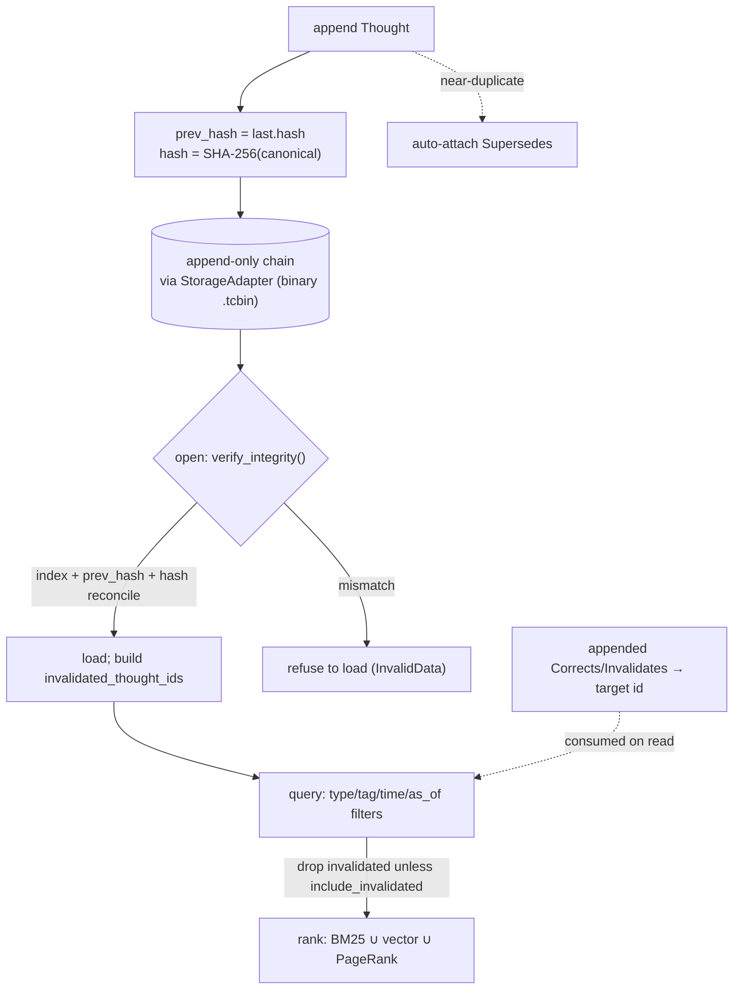

## 1. Executive Summary

MentisDB is an MIT-licensed Rust memory daemon — around 47,000 lines under `src/`,
`lib.rs` alone 10,925 — that stores an agent's "thoughts" as an **append-only,
SHA-256 hash-chained log** and exposes it over MCP so the same durable memory can
be shared across Claude Code, Codex, Copilot, Cursor and other harnesses. Beside
the memory log sits a second store with the same append-only discipline: a
**git-like, immutable, Ed25519-signable skill registry** where every upload is a
new version and history is never overwritten. The pitch is durability that
survives context resets, model swaps and team turnover, and the code backs the
central claim more literally than most systems in this atlas.

The mechanism worth the report is the chain, and it is real. A `Thought` carries an
`index`, a `prev_hash` linking it to the record before it, and a `hash` that is a
SHA-256 over a canonical encoding of its own contents (`lib.rs:2614,2678,2682`;
`compute_thought_hash`, `:10796`). On open, `verify_integrity` re-checks the index
sequence, the `prev_hash` linkage and the recomputed hash of **every** record, and
if anything fails to reconcile the chain **refuses to load** — returning
`InvalidData "Thought chain integrity verification failed"` rather than serving a
tampered history (`:5042`, gate at `:4508-4526`). That is `audit_log` earned
without strain: a sequenced, append-only, integrity-verified mutation record in the
system's own store, and it is the strongest form of it in the corpus because the
verification is load-bearing rather than advisory.

Two more marks follow from the design. Correction never mutates: there is no
update or delete path anywhere, so a wrong thought is corrected by appending a new
one that carries a `Supersedes`/`Corrects`/`Invalidates` relation to the old id;
the superseded ids are collected into a set on open and **excluded from default
reads**, and committed tests assert exactly that a superseded thought is not
returned (`tests/invalidation_search_tests.rs:36`) — `negative_eval`. And relations
carry `valid_at`/`invalid_at` fields distinct from the record's commit
`timestamp`, with an `as_of` query and an `is_invalidated_as_of` check and a test
that a point-in-time read keeps a thought valid at that time — a real, if
relation-hosted, `bitemporal` axis.

The honest limits are the ones the code itself half-documents. Tamper-evidence is
**detection, not prevention** — an actor with file-write access can rewrite the
whole chain's hashes, which the whitepaper says plainly. Two fields (`entity_type`,
`source_episode`) are **excluded from the canonical hash** (`:10802-10808`), so
they are not covered by the guarantee. Thought signing is advertised but **only
skill signatures are verified** — a thought's `thought_signature` is stored and
hashed but no code checks it. And scope is an opt-in tag, not an enforced boundary.
None of these sinks the design; they bound what "tamper-evident, signed memory"
means here, and the report states each in place.

## 2. Mental Model

A memory is a **Thought**: a semantically typed entry in an append-only chain,
where the chain — not the row — is the unit of integrity.

```text
append(thought):
  prev_hash = last thought's hash        (empty for the genesis)
  hash      = SHA-256(canonical(thought including prev_hash))
  index     = position in the chain
  -> push; if near-duplicate of an existing thought, auto-attach Supersedes

open(chain):
  verify_integrity():  for every record, re-check index, prev_hash link, recomputed hash
                       any mismatch -> refuse to load (InvalidData)
  build invalidated_thought_ids from Supersedes/Corrects/Invalidates relations

query(...):
  filter by type/role/tags/concepts/confidence/importance/time (+ optional as_of)
  drop invalidated ids unless include_invalidated
  rank by BM25 ∪ vector cosine ∪ personalized PageRank
```

The unit is richly typed on two orthogonal axes. A `ThoughtType` is one of thirty
semantic variants — `Finding`, `Insight`, `FactLearned`, `Decision`, `Constraint`,
`Mistake`, `Correction`, `LessonLearned`, `AssumptionInvalidated`, `Reframe`,
`Goal`, `LLMExtracted` and more (`lib.rs:1762`) — and a `ThoughtRole` places it in
memory structure: `Memory`, `WorkingMemory`, `Summary`, `Compression`,
`Checkpoint`, `Handoff`, `Audit`, `Retrospective` (`:1869`). This is the most
expressive memory-type vocabulary in the corpus, and the types are not decorative:
`Corrects`/`Invalidates` relations drive the exclusion set, and the retrieval
filters read the types.

The state that matters is not a status field — there is none — but the
*derived* invalidation set and the *verified* integrity of the chain. Trust here is
integrity: what protects a memory is not a confidence score (though `confidence`
exists as an optional float) but the fact that the record is chained and re-hashed
on load, so a silently altered history does not open.



## 3. Architecture

A single daemon, two append-only stores, a swappable persistence seam.

- **`src/lib.rs`** (10,925) — the engine: `Thought`, `ThoughtType`/`ThoughtRole`,
  the chain, `compute_thought_hash`, `verify_integrity`, `query`, supersession, the
  `StorageAdapter` trait and the binary backend.
- **`src/server.rs`** (8,652) — the HTTP servers: streamable MCP at `POST /`,
  legacy `/tools/list` + `/tools/call`, REST, and Ed25519 verification for skill
  uploads; default MCP port 9471 (HTTPS 9473), optional bearer auth.
- **`src/skills.rs`** (2,725) — the git-like skill registry.
- **`src/search/`** — `lexical.rs` (BM25), `vector.rs` + `hnsw_backend.rs` +
  `fastembed_provider.rs` (cosine over local embeddings), `ppr.rs`/`graph.rs`
  (personalized PageRank), `sidecar.rs` (vector sidecar), `ranked.rs`,
  `bundle.rs`, `query_expansion.rs`.
- **`src/integrations/targets/`** — harness config generators (claude_code,
  claude_desktop, codex, copilot_cli, vscode_copilot, gemini, grok, qwen,
  opencode).
- **`src/dashboard.rs`** (3,335) + `src/dashboard_static/` — a built-in web UI.

**Storage.** The durable store is an append-only, hash-chained log persisted
through a `StorageAdapter` trait (`lib.rs:396`) with `load_thoughts`,
`append_thought`, `flush`. Only one concrete backend ships — `BinaryStorageAdapter`
(`:630`), a length-prefixed bincode `.tcbin` file; JSONL is legacy read/migrate
only, and Postgres/S3/in-memory/encrypted are named in a doccomment as
"implement your own", not provided (`:390-395,503-509`). Embeddings are not on the
record: they live in a `VectorSidecarEntry { thought_id, vector }`
(`search/sidecar.rs:22`), kept in sync on append. So the honest storage stack is
files, not a database — a fact worth knowing for an operator expecting SQLite.

### Deployment and ergonomics

- **A standalone daemon many harnesses share.** One `mentisdb` process holds the
  chain and speaks MCP over HTTP; the `integrations/targets` generators write the
  connection config into each coding agent, which is how "one brain across tools"
  is realized. Optional bearer-token auth (`MENTISDB_BEARER_TOKEN_ACCESS`) and
  HTTPS are provided.
- **Integrity is a startup cost, by design.** Opening a chain re-hashes every
  record; on a large chain that is linear work, and it is the price of the refuse-
  to-load guarantee.
- The screen found no auto-run surface, one build-time exec and one unpinned
  surface; nothing was installed or run, and the chain and registry semantics were
  read against ~487 committed Rust tests.

## 4. Essential Implementation Paths

- **Append + chain** — `lib.rs:4925` sets `prev_hash` from the last record;
  `compute_thought_hash` (`:10796`) bincode-encodes a `CanonicalThought` (including
  `prev_hash`) and SHA-256-digests it (`:10852`).
- **Verify on open** — `verify_integrity` (`:5042`) re-checks index/link/hash for
  every record; the open path refuses on failure (`:4508-4526`); also exposed via a
  server integrity endpoint (`server.rs:4584`).
- **Supersession** — a relation `Supersedes | Corrects | Invalidates` targeting a
  prior id (`:1969`); `invalidated_thought_ids` built at open (`:4500-4506`) and
  updated on append (`:5005`); default `query()` drops invalidated ids
  (`:5750`, `if !query.include_invalidated && self.is_invalidated(...)`); a
  near-duplicate (Jaccard ≥ threshold) auto-attaches `Supersedes` (`:4910-4920`).
- **Bitemporal read** — `ThoughtRelation.valid_at`/`invalid_at` (`:2199-2210`); the
  `as_of` query param (`:3189`) and `is_invalidated_as_of` (`:8304`).
- **Retrieval** — `query()` filter loop (`:5748`); `search/lexical.rs` BM25,
  `search/vector.rs` cosine over `FastEmbedProvider` (AllMiniLML6V2,
  `search/fastembed_provider.rs:40`), `search/ppr.rs` personalized PageRank;
  chain traversal via `resolve_context`/`traverse_thoughts` (`:5083`).
- **Skill registry** — `skills.rs`: `SkillEntry`/`SkillVersion` (`:415,:388`),
  first version `Full` then unified-diff `Delta` via `diffy` (`:1240`), reconstruct
  + re-hash on read (`verify_skill_registry_integrity`, `:2698`); the server
  verifies the Ed25519 signature before storing and, when the agent has registered
  keys, requires it (`server.rs:4297-4319`, `verify_ed25519_signature`, `:7097`).

## 5. Memory Data Model

A `Thought` (`lib.rs:2614`) carries: `schema_version`, `id` (UUID), `index`,
`timestamp`, `session_id`, `agent_id`, `signing_key_id`, `thought_signature`,
`thought_type`, `role`, `content`, `confidence` (`Option<f32>`), `importance`,
`tags`, `concepts`, `refs`, `relations` (`Vec<ThoughtRelation>`), `entity_type`,
`source_episode`, `prev_hash`, `hash`. Embeddings are deliberately absent from the
record and held in the vector sidecar.

Three facts about the model decide three marks.

**Integrity is the model's spine, and it is genuine — with two stated holes.** The
hash covers a canonical encoding including `prev_hash`, so the chain is
tamper-evident and verified on open. But `entity_type` and `source_episode` are
**excluded** from the canonical hash (`:10802-10808`, with an in-code warning), so
a writer with file access can alter those two fields without breaking the chain;
and the guarantee is detection, not prevention. This is `audit_log` — a real
append-only sequenced integrity-checked store — reported with its perimeter drawn.

**Validity time is separate from record time, on the relation.** `timestamp` is
commit time; `valid_at`/`invalid_at` on a relation express when the *claim* holds,
and `as_of` reads honor it (`is_invalidated_as_of`, tested at
`invalidation_search_tests.rs:158`). `bitemporal` is earned, with the caveat that
validity lives on the relation rather than directly on the fact.

**There is no discrete status field.** `confidence` is a float, the invalidation
set is a derived boolean, and `Mistake`/`Correction`/`AssumptionInvalidated` are
*types*, not a candidate/verified/rejected status. So `trust_state` is withheld —
the epistemics are expressed as types and relations, not as a status the store
gates on.

## 6. Retrieval Mechanics

Recall is multi-signal and the fusion is the point. A query runs BM25 over the
lexical index, cosine over the fastembed vectors in the sidecar, and personalized
PageRank over the concept/relation graph, then combines them, with filters on
type, role, agent, tags, concepts, text, confidence, importance and time
(`ThoughtQuery`, `:2713`; filter loop `:5748`). Chain traversal follows `refs` and
typed relations to assemble context around a hit (`resolve_context`, `:5083`). The
embeddings are real and local (fastembed AllMiniLM), so semantic recall works
offline without an API key.

The retrieval property that earns a mark is the exclusion. Default queries drop
the invalidated set, so a superseded or corrected thought does not surface unless a
caller explicitly asks for the full history with `include_invalidated` — the
auditor's escape hatch. Committed tests pin this as a *must-not-retrieve* property
(`default_search_excludes_superseded_thoughts`,
`corrects_and_invalidates_exclude_targets_from_ranked_search`,
`context_bundles_exclude_invalidated_seeds`), which is `negative_eval` in its
strong form — material that exists in the store must not appear in a result.

## 7. Write Mechanics

Writes are appends, full stop. There is no update, edit, delete, or truncate path
for a thought (confirmed by absence across `lib.rs`), which is what makes the
hash chain sound: nothing in the API can rewrite history, so the only way to
change what the store believes is to append a superseding thought. The old record
physically remains and is reachable with `include_invalidated`, which is the right
shape for an audit-grade memory — the correction and the thing it corrected are
both on the record, in order.

Correction is therefore a supersession pointer, and this is exactly where the
`tombstone` mark is withheld and the reason is worth stating: a `Supersedes`
relation targets a specific prior **id**, not the **value**. Nothing records a
rejected *value* keyed on content, so re-asserting the same wrong content later
produces a fresh, un-blocked thought — the chain will hold "X", then "not X
(supersedes #7)", and then, if the idea recurs, "X" again as a new unlinked
record. The near-duplicate auto-supersession (Jaccard overlap on append) softens
this for near-identical text but is a similarity heuristic, not a durable
rejected-value record.

Background work is light and append-shaped: near-duplicate detection and
vector-sidecar sync at append time, integrity verification at open. There is no
LLM consolidation pass; the semantic typing is supplied by the caller (or an
`LLMExtracted` type marks model-authored thoughts).

## 8. Agent Integration

MentisDB is a daemon with an MCP surface. Tools (`server.rs:2451-2590`, all
`mentisdb_*`) cover the memory lifecycle — `append`, `append_retrospective`,
`search`, `lexical_search`, `ranked_search`, `federated_search`, `context_bundles`,
`recent_context`, `get_thought`, `traverse_thoughts`, `merge_chains`, `branch_from`
— plus the skill registry (`upload_skill`, `search_skill`, `read_skill`,
`skill_versions`, `deprecate_skill`, `revoke_skill`) and agent/key management. The
`integrations/targets` generators wire the daemon into a dozen coding agents, so
the "one brain, many harnesses" claim is a concrete config-writing step, not a
slogan.

The skill registry is the second memory surface and is
[skills as procedural memory](../../patterns/skills-as-procedural-memory/) done
with unusual rigor: a git-like immutable version store where the first version is
stored whole and subsequent ones as unified diffs (`diffy`), history is never
overwritten (`deprecate`/`revoke` flip status only), each version is
content-hashed and re-verified on load, and — unlike thoughts — the Ed25519
signature is actually verified at the server before a version is stored, and
required once an agent has registered keys. So the registry's provenance guarantee
is real where the thought log's is aspirational.

Scope is the weak seam. A `MemoryScope` (`user`/`session`/`agent`) exists but is
stored as a `scope:…` tag and applied only when a caller opts into `with_scope`
(`:3337`); the engine does not filter by requester identity, so omitting the
filter returns all scopes. `scope_enforced` is withheld: the key is present and
the enforcement is not.

## 9. Reliability, Safety, and Trust

The trust model is integrity, and it is the strongest integrity story in the
atlas — with a clearly drawn perimeter.

- **The chain refuses to open if tampered.** Verification is not a background
  audit that logs a warning; it gates the load and returns an error, so a corrupted
  or edited history fails closed rather than serving quietly. This is the property
  most "append-only" stores in the corpus claim and few enforce.
- **Tamper-evidence is detection, not prevention.** An actor with write access to
  the `.tcbin` file can recompute the whole chain's hashes; the whitepaper says so.
  So the guarantee is "you will know if it was altered by someone who did not
  rewrite the chain", not "it cannot be altered". For a local single-user daemon
  that is the right and honest bound.
- **Two fields sit outside the hash.** `entity_type` and `source_episode` are not
  covered, with an in-code warning — a small hole in an otherwise complete
  guarantee, worth knowing before relying on those fields.
- **Thought signatures are stored, not verified.** The whitepaper's summary line
  says each thought is "signed by the agent that produced it"; in code the
  signature is stored and hashed but no path verifies it, and only *skill*
  signatures are checked. The body of the whitepaper is more careful ("can also be
  Ed25519-signed"); the report treats thought signing as recorded-not-enforced.

Operationally the daemon is self-contained: local files, local embeddings, optional
bearer auth and HTTPS, a built-in dashboard. The privacy surface is the disk plus
whatever the daemon is bound to; there is no multi-tenant enforcement, consistent
with the withheld scope mark.

## 10. Tests, Evals, and Benchmarks

The suite is large and aimed at the guarantees: ~487 test functions across 31
`tests/*.rs` files plus in-module tests, and 7 benches
(`benches/thought_chain.rs`, `hnsw_scale.rs`, `skill_registry.rs` among them). The
integrity, supersession and bitemporal properties are pinned by name —
`default_search_excludes_superseded_thoughts`,
`corrects_and_invalidates_exclude_targets_from_ranked_search`,
`context_bundles_exclude_invalidated_seeds`, and
`as_of_keeps_thoughts_valid_at_that_time` — which is why three marks rest on tests
rather than on prose.

What is absent is retrieval-quality measurement: the benches measure throughput and
scale (chain append, HNSW at scale, registry ops), not whether the BM25/vector/PPR
fusion returns the right thoughts, and there is no committed LoCoMo-style eval. The
correctness the tests establish is structural — the chain verifies, the superseded
are excluded, the as-of read is honored — not the recall quality of the ranker,
which is the measurement the multi-signal design most invites. A `WHITEPAPER.md`
describes the ledger, the SHA-256 tamper-evidence and the semantic typing; there is
no external arXiv paper.

## 11. For Your Own Build

### Steal

- **Verify the chain on open and refuse to load a tampered one.** A hash chain
  that is only checked by a background audit is a chain nobody trusts; gating the
  load on `verify_integrity` and returning an error is what makes "append-only"
  mean something. It is linear work at startup and worth it for an audit-grade
  memory.
- **Correct by appending a typed supersession, and keep the old record.** No
  update, no delete — a `Supersedes`/`Corrects`/`Invalidates` relation to the prior
  id, an invalidation set built on open, and an `include_invalidated` escape hatch
  for auditors. The correction and its target are both on the record, in order.
- **Put validity time on the relation and offer an `as_of` read.** Separating when
  a claim *holds* from when it was *recorded* costs a couple of fields and a filter
  and buys real point-in-time queries.
- **Make the skill registry immutable and actually verify its signatures.**
  Whole-then-diff version storage, content-hash re-verification on load, and
  server-side Ed25519 verification (required once keys are registered) is a
  provenance guarantee for procedural memory that most skill stores skip.

### Avoid

- **Do not advertise a guarantee the code only half-keeps.** "Every thought is
  signed" when only skills are verified, and "tamper-evident ledger" when two
  fields sit outside the hash, are the two places the prose outruns the code —
  state the perimeter or close it.
- **Do not confuse tamper-evidence with tamper-resistance.** A local file whose
  hashes anyone with write access can recompute is detectable-if-naively-edited,
  not immutable; say which one you have.
- **Do not key correction on the id and call it a tombstone.** Supersession by
  target id does not stop the same wrong *value* recurring as a fresh record; if
  re-assertion is a risk, key a rejection on the content.
- **Do not ship a scope key you do not enforce.** An opt-in `scope:` tag returns
  everything when the caller forgets it; enforce by identity or do not imply
  isolation.

### Fit

This suits a builder who wants an audit-grade, local, multi-harness memory and
values integrity over convenience — a single daemon whose history is verifiable,
whose corrections are on the record, and whose skills are versioned and signed.
The Rust core is dependency-light, the embeddings are local, and the MCP surface
plugs into the coding agents people actually use. The skill registry alone is worth
lifting.

Walk away if you need enforced multi-tenant scope, tamper-*resistance* rather than
tamper-evidence, or verified provenance on the thoughts themselves today — those
are perimeter, aspiration and gap respectively. And treat the storage as files: if
you expected a database backend, only the binary log ships, and the swappable
adapter is a trait waiting for one.

## 12. Open Questions

- Will thought signatures be verified, or is signing intended to stay a
  skills-only guarantee? The fields are on every thought.
- Are `entity_type` and `source_episode` meant to stay outside the canonical hash,
  and what relies on those uncovered fields?
- How good is the BM25/vector/PageRank fusion at returning the right thoughts?
  The benches measure scale, nothing measures recall quality.
- Will a non-binary storage adapter (Postgres/encrypted) ship, or is the trait a
  DIY seam? Only the binary backend and legacy JSONL exist.
- Is scope meant to become identity-enforced, or is opt-in tag filtering the
  intended model for a single-user daemon?

## Appendix: File Index

- `src/lib.rs` — `Thought`, `ThoughtType`/`ThoughtRole`, chain append, `compute_thought_hash`, `verify_integrity`, `query`, supersession/invalidation, `StorageAdapter` + `BinaryStorageAdapter`, `as_of`.
- `src/server.rs` — MCP/REST servers, tool dispatch, `verify_ed25519_signature` (skills), integrity endpoint.
- `src/skills.rs` — git-like immutable skill registry (`SkillEntry`/`SkillVersion`, diff storage, integrity re-check).
- `src/search/` — `lexical.rs` (BM25), `vector.rs`/`hnsw_backend.rs`/`fastembed_provider.rs` (vector), `ppr.rs`/`graph.rs` (PageRank), `sidecar.rs`, `ranked.rs`.
- `src/integrations/targets/` — harness config generators.
- `tests/invalidation_search_tests.rs` — superseded/invalidated exclusion and `as_of` tests.
- `WHITEPAPER.md` — the ledger, tamper-evidence and typing design.

## History

**2026-08-15** — [`ec020f7c1f67fd6c03409c98453b217d74add475`](https://github.com/CloudLLM-ai/mentisdb/commit/ec020f7c1f67fd6c03409c98453b217d74add475) — first reading. Screened before opening: no auto-run surface, one build-time exec, one unpinned surface; nothing was installed or run. The SHA-256 hash chain and its refuse-to-load verification, the append-only supersession with the invalidation-set exclusion, the relation-hosted `valid_at`/`invalid_at` with `as_of`, and the Ed25519-verified skill registry were read from `src/lib.rs`, `src/server.rs` and `src/skills.rs` and cross-checked against the committed `invalidation_search_tests.rs` and the wider suite. `bitemporal`, `audit_log` and `negative_eval` are earned; `trust_state` (types and a derived set, no status field), `scope_enforced` (opt-in tag, not identity-enforced) and `tombstone` (supersession keyed on id, not value) are withheld. The two hash-excluded fields and the unverified thought signatures were confirmed in code against the whitepaper's claims. No external paper exists; a `WHITEPAPER.md` is in the tree.
