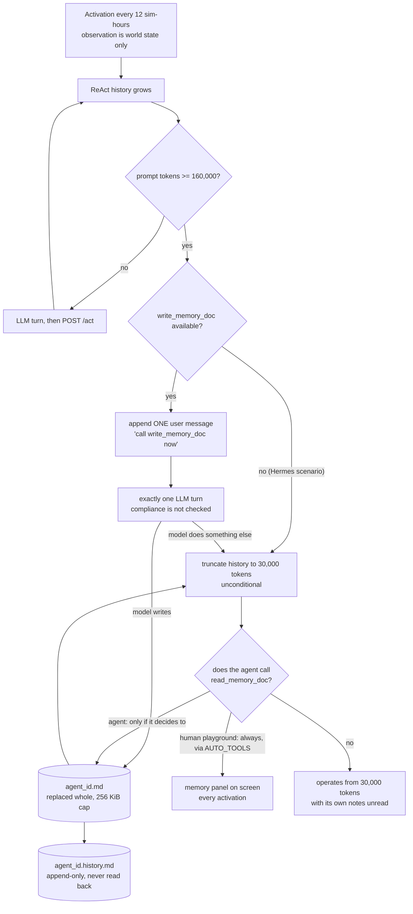

## 1. Executive Summary

MerchantBench is not a memory system. It is a 365-day, order-level e-commerce
simulation from Alibaba Group's 1688 and Zhejiang University, built to ask
whether an agent can hold a coherent commercial policy across a horizon long
enough that its own earlier decisions constrain it. It is in this atlas because
of what it ships alongside the simulator: a single agent-facing memory
mechanism, deliberately minimal, wired into a run whose context window is
truncated repeatedly — and an outcome metric that prices the consequences of
getting memory wrong in RMB rather than in recall@k.

The memory is two tools and two files. `write_memory_doc` replaces one Markdown
document; `read_memory_doc` returns it whole. Every accepted write appends the
full new text, a version marker, the simulation step and a wall-clock stamp to a
sibling `.history.md` that nothing ever reads back. That is the entire design:
no schema, no index, no embedding, no TTL, no trust field, no delete.

Three things make it worth a senior engineer's time.

First, **the failure mode is measured, not hypothesised.** The paper
([arXiv:2607.28956](https://arxiv.org/abs/2607.28956), submitted 31 July 2026,
revised 4 August 2026) reports 48 runs of 365 simulated days and two named memory
failures with dates attached: a Claude Opus 4.8 run whose shelf contracted from
47 active listings on Day 54 to three by Day 322 on a false inference it kept
acting on, and a Qwen3.7-Max run that misremembered Day 285 as the endpoint on
Day 282 and stopped restocking with 83 days left, correcting only when simulated
time passed the imagined deadline. Both are beliefs that were wrong and stayed
wrong; both are legible because the version history is on disk.

Second, **the compaction boundary is where the design is honest and where it is
thin.** The reference ReAct baseline compacts at 160,000 estimated tokens down to
30,000. Before truncating it appends exactly one user message telling the model
that history is about to be cut and that it should call `write_memory_doc` now.
The truncation then happens whether or not the model complied — nothing checks,
nothing retries, no `tool_choice` forces it. Afterwards, nothing re-injects the
document. The agent's own memory is reachable only by a tool call it must
initiate from a context that was just cut to 30,000 tokens.

Third, **the human baseline does not play by those rules.** The browser
playground fetches `read_memory_doc` automatically at every activation as part of
its `AUTO_TOOLS` bootstrap and renders the result into a persistent, editable
panel. The three human participants — who finished with 3.7× the net assets of
the best LLM configuration — never had to remember to look at their memory. It
was on the screen.

Where it is strongest: a deterministic, seeded, well-tested simulator (724 cases
across 42 files, 25,292 lines of tests against 29,163 lines of non-test Python),
an idempotency layer with fingerprint conflict detection, and a leaderboard that
distinguishes a metric reported as zero from a metric never reported at all.
Where it is weakest, for this atlas's purposes: the memory mechanism it ships is
never isolated. The switch to ablate it is one uncommented line in
`env/scenarios/default.yaml`, and no committed scenario uses it. The framework
arm that scored highest is the arm in which both memory tools are switched off.

Apache-2.0, 11 commits, first dated 31 July 2026, pinned here at
[`f44ce969aeccfd65d1eef6afe50f69868e510946`](https://github.com/KhanCold/merchantbench/commit/f44ce969aeccfd65d1eef6afe50f69868e510946)
(17 August 2026).

## 2. Mental Model

A memory is one Markdown document. It has no fields, no identity beyond the file
path, and no lifecycle the environment models. There is exactly one state — the
current text — and exactly one transition, total replacement.

What the environment does model is the *record* of those transitions. Every
accepted write appends the whole new document to a history file that no tool
exposes and no code path reads. So the system holds two things with different
epistemics: a document that is whatever the model last believed, and a log of
everything it believed before, visible only to whoever is holding the run
directory afterwards. The agent cannot recover a superseded belief; the analyst
can reconstruct the exact turn a wrong one entered.

Nothing in the system judges the content. There is no candidate state, no
verification, no confidence, no provenance. When the paper describes a Claude
Opus 4.8 run maintaining "day stamped operating hypotheses labeled as validated
or rejected", that labelling is prose the model chose to write inside a text
blob — under [Hermes](../hermes-agent/), whose own memory tool lives in a different
repository, and in a scenario where MerchantBench's memory tools are denied
outright. The environment stores no such distinction and enforces none.

The interesting epistemic event is therefore not a write. It is the compaction
boundary: the moment the conversational record of *why* the agent believes
something is deleted, and the only thing that survives is whatever prose it
managed to save one turn earlier.



## 3. Architecture

A Flask server, a SQLite database, and a run directory of files. Nothing else has
to be running; no API key is needed to store anything, and no key is needed at
all unless you drive it with an LLM baseline.

- **Simulator** — `env/core/simulator.py` holds one `Environment` per run and
  ticks hourly. The default scenario runs `horizon_steps: 8760` at
  `step_hours: 1` with `master_seed: 42`, and the file states the contract
  plainly: same seed plus same scenario yields an identical trajectory.
  `activation_period: 12` means the agent is woken 730 times over the year, with
  `max_turns_per_step: 30`.
- **World state** — `env/storage/db.py` creates twelve tables (`runs`, `agents`,
  `products`, `store_listings`, `orders`, `order_status`, `cash_log`, `events`,
  `metrics`, `daily_aggregates`, `hourly_dist`, `supplier_events`). **None of
  them is a memory table.** Agent memory never touches SQLite.
- **Agent memory** — two files per agent per run, under
  `runs/<run_id>/agent/memory/`. Both are Markdown, both are human-readable, both
  are repairable with a text editor, and both are deleted with the run
  (`env/web/runner.py:1725`).
- **Tool surface** — `env/tools/registry.py` declares 26 `ToolSpec`s and
  `env/tools/observation.py` declares two more. The default scenario denies
  `market_brief` and `hot_search_terms`, leaving 26 tools reachable. That is
  exactly the inventory the paper's Table 2 lists, and it recomputes: 26 declared
  minus the two default-denied plus `get_observation` and `list_tools`.
- **Transport** — `POST /runs/<rid>/agents/<aid>/act` takes OpenAI-shaped
  messages, executes the environment tool calls inside them, and returns tool
  results. `env/web/routes_agent.py` is the whole agent-facing API.
- **Consumers** — a Python SDK (`agent/sdk/`), a deterministic rule-based
  baseline, the ReAct compaction baseline, a submission template with a
  Dockerfile, a Docker eval harness (`eval/run_eval.py`), a batch runner, and a
  browser playground for human participants.

### Deployment and ergonomics

`python3.11 -m venv`, `pip install -r requirements.txt`, `python run.py --port
5050`. Docker is needed only for the containerized evaluation. Four requirement
files pin nothing with `==` — `Flask>=3.0`, `numpy>=1.26`, `openai>=1.40`,
`jieba>=0.42.1` and the rest float — which for a benchmark whose selling point is
determinism is worth noting: the trajectory is seeded, the dependency set is not.

The store is fully local and fully offline for the rule-based baseline and the
whole test suite. Only the LLM baselines need an OpenAI-compatible endpoint, and
`README.md` is explicit that credentials are read at runtime and must not be
embedded in an agent image.

## 4. Essential Implementation Paths

**Capture / write.** `write_memory_doc(env, agent_id, content)` at
`env/tools/tools.py:2214-2227`. It coerces non-strings, rejects anything over
`_MEMORY_DOC_MAX_BYTES = 256 * 1024` with an error and no write, creates the
directory, truncates and rewrites the file, then calls `_append_memory_history`.
Synchronous, on the agent's turn, no LLM in the loop.

**Extraction / consolidation.** None exists. There is no summarizer, no fact
extractor, no dedupe, no merge. Whatever the model emits is the memory.

**Retrieval.** `read_memory_doc(env, agent_id)` at `:2200-2208` returns the whole
file, or `{"ok": True, "content": "", "bytes": 0}` when it does not exist. No
query parameter, no ranking, no filter, no index. The absence is total and it is
the right call for a document this size.

**Context assembly.** The observation the agent receives each activation is world
state — cash, listings, orders, anomalies — assembled in
`env/tools/observation.py`. The memory document is **not** in it. The only
mention memory gets is one line of the system brief at `:445-447`: *"Use any
available tools and skills, including analysis, automation, and memory tools when
provided, to improve long-run decisions and maximize net_assets."* Everything
else about memory is the agent's initiative.

**Update / delete / forget.** Overwrite is the only mutation. There is no delete
tool, no expiry, no supersession marker, no conflict handling. Forgetting happens
by not writing something down.

**The compaction path**, which is where this repository is actually interesting,
lives in the baseline rather than the environment:
`agent/baselines/react_160k_compact_30k.py`.

- `_maybe_add_compaction_reminder` (`:483-523`) runs at the top of every hop. If
  the last prompt exceeded `DEFAULT_COMPACT_TRIGGER_TOKENS = 160000` it appends
  one user message — *"Call write_memory_doc now if important details should be
  kept"* — and sets `compaction_pending = True`.
- If `write_memory_doc` is not among the available tools it skips the warning and
  truncates immediately, appending a notice after the fact.
- `_compact_history_if_pending` (`:530-539`) trims to
  `DEFAULT_COMPACT_KEEP_TOKENS = 30000` at the end of that same hop
  (`:671`, `:718`, `:749`), unconditionally. Compliance is never checked.
- `_act_context` (`:541`) sets `context["compacted"] = True` for exactly the hop
  that carried the reminder, which is what the leaderboard counts.

So the model gets one turn, and one turn only, and the environment learns only
that a compaction happened — never whether anything was saved.

**Idempotency.** `env/web/routes_agent.py:1053-1063` derives
`f"{agent_id}:{env.t}:{tc_id}"` for any mutating tool and fingerprints it with
the canonicalized arguments; `Environment.with_idempotency`
(`env/core/simulator.py:1457`) replays the cached result or returns
`idempotency_conflict` with HTTP 409 when the same call id arrives with different
arguments. Because a replay never re-enters the handler, a retried write appends
no second history version — the history records distinct writes, not network
retries.

**Tests.** `tests/test_memory_doc_tools.py`, 146 lines, four cases, covered in
section 10.

## 5. Memory Data Model

There is no schema. The unit is a file:

```text
runs/<run_id>/agent/memory/<agent_id>.md          # current, replaced whole
runs/<run_id>/agent/memory/<agent_id>.history.md  # every version, appended
```

The history entry is the only structured thing in the memory subsystem
(`env/tools/tools.py:2175-2197`):

```python
f.write(f"{MEMORY_VERSION_MARKER}{version} -->\n")
f.write(f"## Memory version {version}\n")
f.write(f"- step: {env.t}\n")
f.write(f"- wall_ms: {wall_ms}\n")
f.write(f"- bytes: {size}\n\n")
f.write(content)
```

`MEMORY_VERSION_MARKER` is `"<!-- merchantbench-memory-version "`
(`env/compat.py:25`), with `"<!-- realshop-memory-version "` retained as a legacy
form so a run started under the project's old name still counts correctly.

**Scoping** is the run and the agent id, expressed as the path.
`_memory_doc_path` sanitizes with `re.sub(r"[^A-Za-z0-9_.-]+", "_", agent_id)`
and falls back to `"agent"` if stripping leaves nothing, so a hostile id cannot
traverse out of the memory directory. There is no user, tenant, project or
session dimension, and none is needed: a run is the unit of everything here.

**Temporal fields** are worth stating precisely, because they look like more than
they are. Each history entry carries `step` — the simulation hour, from 0 to 8759
— and `wall_ms`, the real-world instant. Two clocks, and both of them are record
time: one says when in the simulated year the write happened, the other when in
the operator's afternoon. Neither says anything about the period over which the
recorded belief was *true*. That is the difference between two timestamps and
bitemporality, and it is why the mark is withheld.

**Provenance and trust: absent.** No source field, no confidence, no status.
Nothing separates a fact the agent read from a tool result from a conclusion it
invented. The paper's two failure cases are both invented conclusions, and there
is no field in which their invented-ness could have been recorded.

## 6. Retrieval Mechanics

Nothing to rank. `read_memory_doc` is a file read.

The mechanics that matter here are about *whether the document is read at all*,
and there the design has a clear asymmetry with a measured population on each
side of it.

For an agent, reading is voluntary and unprompted. The observation does not carry
the document. The system brief mentions that memory tools exist. After a
compaction the agent holds 30,000 tokens of recent history plus a notice that the
rest is gone — and from there it has to decide, on its own, to spend a tool call
recovering its own notes.

For a human participant, reading is automatic.
`env/web/templates/_human_playground_script.html:114-121` puts
`["read_memory_doc", {}]` in the `AUTO_TOOLS` bootstrap alongside the store
snapshot and open orders, and `human_playground.html:124-130` renders the result
into a `memory-panel` textarea with read and save buttons and a dirty/saved
status line. The human never issues the read. It has already happened.

Both populations are in the paper's Table 1. The humans finished at 217.61
thousand RMB in mean final net assets; the best LLM configuration, Hermes with
Qwen3.7-Max, at 59.46. That is 27.34%, which is the abstract's 27.3% recomputed
exactly from the table. The gap has many causes — the humans also issued 8,311
tool calls and generated 9,442 orders, more than any agent — and this report does
not claim the memory panel is the reason. It claims something narrower and
checkable: the two populations were not given the same read path to their own
memory, and the difference was never measured.

**Failure modes** are the ones a whole-document read implies. There is no
over-recall problem and no stale-hit problem, because there is no selection. What
there is instead: everything the document says is in context every time it is
read, so a wrong sentence written on Day 54 is re-presented, at full weight, on
Day 322 — which is the shape of the Opus 4.8 failure the paper describes.

## 7. Write Mechanics

Writes are agent-initiated, synchronous, and total. There is no background path
and no lag: `write_memory_doc` returns after the file is on disk, so a memory is
retrievable on the next tool call. Nothing re-reads or rewrites the store on a
schedule, so there is no token bill that scales with corpus size — the only cost
of memory here is the tokens the agent spends writing and reading it.

Three properties of the overwrite deserve attention.

**It is all-or-nothing.** There is no append, no patch, no section edit. To add
one line the agent must reproduce the entire document. Every write is therefore
also an opportunity to silently drop everything it failed to reproduce, and the
version history is the only place that loss is visible.

**It is capped at 256 KiB, and the cap fails closed.** Over-limit content returns
`{"ok": False, "error": "content too large (...)"}` and writes nothing — neither
the document nor a history entry. An agent that ignores tool errors keeps
operating on a memory that is one revision behind what it thinks it wrote.

**The version counter is derived from the agent's own text.**
`_append_memory_history` computes the next version by counting marker occurrences
in the existing history, and it appends `content` unescaped. A document
containing the literal string `<!-- merchantbench-memory-version ` — which an
agent writing notes about this very mechanism could plausibly produce — inflates
the count and skips version numbers. Stored content is unaffected and the log
stays complete; the numbering is what breaks. The fix is to count the headings
the writer controls, or to escape the marker on the way in.

**Injection.** The agent's context is full of third-party text — product titles,
supplier profiles, the daily market brief — and nothing in `env/` sanitizes any
of it. The only functions named for sanitizing operate on experiment-group
configuration (`env/web/experiment_groups.py`) and on LLM message shape
(`react_160k_compact_30k.py:150`). In the public artifact the catalog is
synthetic and this is inert. It is not inert for the operator running the
private variant, where product listings are real merchant-written text from a
live marketplace, flowing into a document that is re-read verbatim into later
contexts with no marker distinguishing what the agent concluded from what a
seller wrote.

## 8. Agent Integration

The integration surface is HTTP and deliberately framework-neutral. An agent
registers, polls an observation, and posts assistant messages containing tool
calls to `/act`; the environment executes the ones it recognizes and returns
results. `agent/submission_template/` ships a Dockerfile for hosted evaluation.
Adapting another framework means writing a loop, not a plugin.

**Agency over memory is total and unassisted.** The model decides whether to
write, what to write, and whether to read. Nothing is injected, nothing is
suggested beyond one line of the brief, and no hook fires at the session
boundary. The single piece of scaffolding in the whole design is the compaction
reminder, and it is advisory.

**The scope key is not addressable by the model**, which is the part of this
design most worth copying. `read_memory_doc` declares `_NO_PARAMS`;
`write_memory_doc` declares only `content`. `dispatch_tool`
(`env/tools/dispatch.py:143-163`) inspects the handler signature and passes
`agent_id` from the request path, and rejects any argument the schema does not
name with `unknown arguments for ...`. A model cannot ask for another agent's
memory because there is no field in which to ask.

That guarantee is a tool-layer guarantee, not a transport one. `act` checks only
that `agent_id in env.agents` before proceeding
(`env/web/routes_agent.py:901-905`); there is no token, no signature, no
per-agent credential anywhere in the agent-facing routes. Any process that can
reach the port can act as any registered agent and read its memory. For a
single-operator benchmark harness on `127.0.0.1` that is a reasonable
simplification, and it should be stated rather than assumed: the isolation is
against a confused model, not against a hostile client.

**The framework arms do not share a memory substrate**, and this is the finding
most likely to matter to a reader of the paper. `env/scenarios/agents/hermes.yaml`
denies four tools:

```yaml
agent:
  tool_denylist:
    - market_brief
    - hot_search_terms
    - read_memory_doc
    - write_memory_doc
```

The Hermes arm therefore ran with 24 MerchantBench tools, not the 26 the paper's
experimental setup describes, and the two removed are exactly the memory tools —
because Hermes brings its own `memory` tool and `session_search`. That memory
lives in [its own repository](../hermes-agent/) — and the paper did not run the
upstream: the README points at `KhanCold/hermes-agent` on a `realshop-integration`
branch, a MerchantBench-specific adapter, so neither the fork nor the upstream is
inside this pin. The ReAct arm
kept the document. So the paper's two frameworks differ in code execution,
planning, skills *and* memory model at once, and the paper's memory observations
— including Opus 4.8's 261 memory calls with validated/rejected hypothesis labels
— are observations of a mechanism that is not in this repository.

## 9. Reliability, Safety, and Trust

**Provenance: none.** **Verification: none.** **Uncertainty: unrepresentable.**
The memory layer cannot say "I think" — it can only store a sentence. Both
documented failures are cases where the model's belief was wrong and the store
had no way to hold that possibility, and no reader — human or agent — could tell
a recorded observation from a recorded guess.

**Data loss** has a specific and likely shape. Not corruption: whole-document
replacement by a model reproducing 200 KiB of Markdown from memory. Nothing
diffs the incoming document against the outgoing one, nothing warns on a large
shrink, and the write succeeds regardless. The `.history.md` file makes the loss
*auditable* after the fact, which is the honest thing to say about it: the design
records what happened, and prevents nothing.

**Concurrency.** `_RUNTIME_EVENTS_LOCK` guards the runtime event file, but
`_append_memory_history` and the document write hold no lock. Within a run this
is safe by construction — one agent, one activation at a time, `max_turns_per_step
= 30` — and the idempotency layer catches duplicate submissions of the same tool
call id. Two clients posting concurrently as the same agent id would interleave;
nothing in the design contemplates that, and nothing in the routes prevents it.

**Deletion semantics** are coarse and honest: deleting a run removes the run
directory and the memory with it (`env/web/runner.py:1725`). There is no
per-memory delete and no way to redact one sentence from the history file, which
matters if a run against the private catalog ever wrote personal data into a
merchant note.

**Backup and replication: none.** The run directory is the only copy.

**Two marks withheld, with the reason.** `trust_state` fails because the labelling
the paper observed — hypotheses marked validated or rejected — is prose inside an
opaque blob, in a different framework's memory, not a field this system stores or
reads; nothing here could filter on it. `human_review` fails for a subtler reason
worth stating: there *is* a human editing a memory document in a browser panel,
but that human is the operator playing the game and writing their own notes. No
surface in this repository shows one party an agent's memory for approval,
correction or adjudication. The playground is a first-person memory editor, not a
review queue.

## 10. Tests, Evals, and Benchmarks

**The suite is large and the memory part of it is small and good.** 724 cases
across 42 files, 25,292 lines against 29,163 lines of non-test Python. Fourteen
`pytest.skip` calls, and the two that matter are honest about the artifact rather
than about the environment: `tests/test_registry.py:124` skips a check against an
internal design document that "is not in the artifact", and
`tests/test_daily_report_tool.py:111` skips the daily-report header check when the
365 bundled market reports are absent — which they are, permanently, in the public
release. The remaining skips gate JavaScript helper tests on Node.js. No skip in
this repository hides a behavioural gap behind a green badge.

`tests/test_memory_doc_tools.py` has four cases and none of them is vacuous:

- `test_memory_doc_tools_appear_in_schema_and_list_tools` — both tools reach the
  agent through `/tools/schema` and through `list_tools` after scenario
  filtering.
- `test_memory_doc_read_write_round_trips_markdown` — asserts the empty read is
  `{"ok": True, "content": "", "bytes": 0}`, then exact content and byte count
  after a write.
- `test_memory_doc_writes_keep_markdown_history_file` — two writes, then asserts
  the current document is the second, the history contains exactly two version
  markers, both headings, `step: 0`, both bodies, and `history.index(first) <
  history.index(second)`. The ordering assertion is the one that makes this a
  test of append-only behaviour rather than of file existence.
- `test_memory_doc_is_isolated_by_agent_id` — writes distinguishable content
  under two registered agents and asserts each read returns its own, exactly.
  Both scopes are populated before either is read, so the case cannot pass on an
  empty result, and the equality cannot survive a leak. This is the whole basis
  of the `negative_eval` mark, and it is one case.

**What is not tested.** No case exercises the 256 KiB rejection path. No case
covers the version-marker inflation described in section 7. Nothing asserts that
`read_memory_doc` returns the document across a compaction, because compaction
lives in the baseline and `tests/test_react_160k_compact_30k.py` tests the
trimming arithmetic rather than the memory round trip through it. And nothing
tests the behaviour that the whole design turns on: that an agent which never
calls `read_memory_doc` after a compaction is operating blind.

**The score does not read memory.** `eval/scoring.py` is 76 lines and computes
one headline number — the last point of the `net_assets` series, with a
documented fallback to summing the live cash dict when the series is empty. That
is the entire metric. There is no memory-quality term, no recall check, no
retention check. Memory is scored only through its consequences, which is both
this benchmark's most interesting property and the reason it cannot attribute a
result to memory.

**The leaderboard does two things well and one thing on trust.**
`env/web/leaderboard.py:238-243` defines a `Memory` tool category over
`{read_memory_doc, write_memory_doc}`, so per-run memory tool usage is broken out
rather than pooled. And `capability_state` / `coverage_rank` (`:2093-2098`) render
each runtime metric as `unavailable`, `partial` or `complete` rather than folding
a metric nobody reported into a zero — the ReAct baseline declares
`"memory_compactions": "reported"` and `"skills_evolutions": "not_applicable"`
(`react_160k_compact_30k.py:373-376`), so a zero for ReAct skill evolution reads
as *not applicable* instead of as *evolved nothing*. That distinction is rarer
than it should be and worth stealing. The thing taken on trust: `memory_compactions`
comes from `context.compacted`, which the **agent** sets. The environment counts
compactions it is told about.

**Nothing is committed from a run.** No JSON, no CSV, no JSONL, no database, no
trace, anywhere in the tree. The 48 runs behind the paper are not reproducible
from committed output; the code that would produce them is here, and the results
are not.

**Two evidence streams the paper runs on are absent from the artifact**, and the
README says so directly: the 98,843 real product records become a deterministic
synthetic catalog of 1,000 products and 200 suppliers, and the 365 daily market
reports are not redistributable. That second absence has a consequence the README
does not draw out: the paper's rule-based baseline selects replacement listings
"using keywords from the daily market report", so it is not reproducible from the
public artifact either.

**What does recompute, exactly.** Table 1's human mean of 217.61 and the best LLM
configuration's 59.46 give 27.34%, matching the abstract's 27.3%. And Table 2's
26-tool inventory matches the registry minus the default denylist plus the two
observation tools. Both published numbers survive being checked against this
commit, which is more than most benchmark papers offer.

**The ablation that is one line away.** `env/scenarios/default.yaml:195-199`:

```yaml
  tool_denylist:
    - market_brief
    - hot_search_terms
    # - read_memory_doc
    # - write_memory_doc
```

The apparatus for a memory ablation is complete: the denylist is honored at
`/tools/schema`, at `/act`, and inside `dispatch_tool`; the baseline already
handles the tools being absent by skipping the reminder and truncating
immediately; the score is a single number; the simulator is seeded. Two
uncommented lines and three runs would price this benchmark's own memory
mechanism. No committed scenario does it. What is available instead is a
confound: the Hermes arm has the memory doc denied and beats the ReAct arm for
seven of the eight models (Kimi K2.6 is the exception, 23.96 against 24.99), and
also brings code execution, planning and skills — so the comparison says nothing
about memory, and the experiment that would has not been run. Meanwhile the
deterministic rule-based baseline, which has no memory and no model, finishes at
24.48 and beats six of the sixteen LLM configurations, which bounds how much of
the spread any memory mechanism could be explaining.

## 11. For Your Own Build

### Steal

- **Make the scope key unaddressable by the model.** Do not put `user_id` or
  `agent_id` in the tool schema and validate it; leave it out of the schema
  entirely and inject it from the authenticated context, then reject unknown
  arguments. `dispatch_tool` does this in a dozen lines and the resulting
  guarantee needs no test to hold — though there is one anyway.
- **Append the full superseded text on every overwrite.** A whole-document
  memory is easy to reason about and easy to destroy in one bad write. A sibling
  append-only history costs one file handle, needs no schema, and converts "the
  agent's notes are wrong" into "the agent's notes went wrong at version 14,
  step 1296". Both of the paper's failure diagnoses depend on it existing.
- **Distinguish a metric reported as zero from a metric never reported.** The
  `unavailable` / `partial` / `complete` coverage state beside every self-reported
  runtime metric is the right shape for any dashboard aggregating telemetry it
  does not control, and it costs one declaration per agent.
- **Score memory through consequences, at least once.** Recall benchmarks measure
  whether the right thing came back. This one measures what happens to the
  business when the wrong thing did, over a horizon long enough for a Day 54
  mistake to still be compounding on Day 322. Both kinds of measurement are worth
  having, and almost nobody builds the second.

### Avoid

- **A one-turn advisory warning before an unconditional truncation.** If the
  context is going away regardless, the save is not optional and should not be
  modelled as a request. Force the call, or perform the save yourself from the
  history you are about to discard, or at minimum record whether the agent
  complied so a failure is attributable afterwards. This design does none of the
  three, and cannot distinguish an agent that chose not to save from one that
  never understood it was asked.
- **Truncating the context and then not re-injecting the memory.** Compaction is
  precisely the moment the agent is least able to notice it should go looking.
  Whatever survived should be placed back in front of the model, not left behind
  a tool call the model has to think of. It is the read-path twin of the failure
  [a memory the system can route around](../../benchmarks/#a-memory-the-system-can-route-around-is-one-nobody-ever-exercises)
  describes on the write side: there, a memory nothing forces the model to use;
  here, a memory nothing puts in front of it.
- **Deriving a version number by counting a marker in text the agent wrote.**
  Any counter computed over untrusted content is controllable by whoever writes
  the content. Count something you control, or escape on the way in.
- **Shipping the ablation switch and not pulling it.** If a mechanism is
  configurable off in one line and the harness is seeded, the arm without it is
  three runs away. A benchmark that ships a memory tool and never measures the
  version of itself without one has left its most answerable question unanswered.

### Fit

This is not a memory system anyone should adopt, and it does not present itself
as one. The memory here is scaffolding — the least mechanism that lets an agent
survive 730 activations and a repeatedly truncated context — and read as a memory
design it is a demonstration of how little is needed to make the question
interesting rather than a proposal for how to answer it.

Who should read it: anyone building a long-horizon agent evaluation, and anyone
whose memory design has never been tested against a horizon where an early wrong
belief has 300 days to compound. The simulator is deterministic, well tested,
Apache-2.0 and standable in three commands, and the tooling around scenarios,
idempotency and telemetry coverage is better than the memory layer it carries.

Who should walk away: anyone hoping to reproduce the paper's numbers. The real
catalog and the daily market reports are gone from the artifact by design, no run
output is committed, and both the human and rule-based baselines depend on
something the public tree does not contain. What you can reproduce is the
*shape* of the experiment on synthetic data, which for a builder testing their
own memory layer against a long horizon may be the more useful half anyway.

## 12. Open Questions

- **Does the memory document pay for itself?** Unanswerable from this tree, and
  two uncommented lines plus three seeded runs from being answerable. It is the
  question this repository is best positioned to settle and has not.
- **How often does an agent read its memory after a compaction, and does the rate
  predict the score?** The traces would show it; no trace is committed and the
  leaderboard aggregates tool calls per category rather than per compaction
  boundary.
- **How much does the human playground's auto-loaded memory panel contribute to
  the human-agent gap?** Requires running human participants without the panel,
  which is a study rather than a code question — but the asymmetry is in the code
  and unremarked in the paper.
- **What did the failing documents actually say?** The Opus 4.8 and Qwen3.7-Max
  diagnoses are exactly the analysis `.history.md` is for. The files exist on the
  authors' disks; nothing equivalent is published.
- **Does the private variant sanitize merchant-written product text before it
  reaches the agent?** `env/data/build_private_real_db.py` is in the tree at 2,367
  lines, but the data it builds from is not, so the ingestion path cannot be
  checked end to end.
- **How far has the MerchantBench Hermes fork diverged from upstream on the
  memory path?** [Hermes](../hermes-agent/) bounds `MEMORY.md` hard and freezes it
  into the system prompt at session start; whether the `realshop-integration`
  branch of `KhanCold/hermes-agent` keeps that shape across 730 activations is
  the question the paper's 261 memory calls hang on, and it is outside this pin.

## Appendix: File Index

**Memory storage and write path**
- `env/tools/tools.py:2159-2228` — `_memory_doc_path`, `_memory_history_path`,
  `_append_memory_history`, `read_memory_doc`, `write_memory_doc`,
  `_MEMORY_DOC_MAX_BYTES`.
- `env/compat.py:25-26` — `MEMORY_VERSION_MARKER`, `LEGACY_MEMORY_VERSION_MARKERS`.

**Tool surface and scope enforcement**
- `env/tools/registry.py:500-524` — the two memory `ToolSpec`s.
- `env/tools/dispatch.py:114-176` — `dispatch_tool`, argument validation,
  `agent_id` injection, denylist.
- `env/web/routes_agent.py:901-1095` — `/act`, idempotency key derivation,
  scenario denylist.

**Context assembly**
- `env/tools/observation.py:435-460` — the system brief; the one line that
  mentions memory.
- `agent/baselines/react_160k_compact_30k.py:51-57,:315-328,:483-539` —
  compaction constants, reminder and notice text, the reminder and truncation
  methods.

**World state (no memory)**
- `env/storage/db.py` — twelve tables of simulation state.
- `env/core/simulator.py:1457-1490` — `with_idempotency`.
- `env/scenarios/default.yaml`, `env/scenarios/agents/hermes.yaml` — horizon,
  seed, activation period, denylists.

**Human surface**
- `env/web/templates/_human_playground_script.html:114-121,:1072-1073` —
  `AUTO_TOOLS`, memory response handling.
- `env/web/templates/human_playground.html:124-130` — the memory panel.

**Measurement**
- `eval/scoring.py` — the entire headline metric.
- `env/web/leaderboard.py:238-243,:1505-1535,:2093-2160` — memory tool category,
  `memory_compactions`, telemetry coverage states.

**Tests**
- `tests/test_memory_doc_tools.py` — four cases.
- `tests/test_react_160k_compact_30k.py` — compaction arithmetic.
- `tests/test_registry.py:124`, `tests/test_daily_report_tool.py:111` — the two
  artifact-absence skips.

## History

**2026-08-30** — [`f44ce969aeccfd65d1eef6afe50f69868e510946`](https://github.com/KhanCold/merchantbench/commit/f44ce969aeccfd65d1eef6afe50f69868e510946) — first reading, at the eleventh commit. Screened before reading: no auto-run hooks and no build-time execution, four requirement files floating on `>=`; nothing was installed and nothing was run. Three marks. The memory mechanism is two tools and two files, and the report is built around the compaction boundary rather than around the store, because that is where the design makes its one consequential choice. The paper's headline recomputes from its own Table 1 (59.46 / 217.61 = 27.34%) and its 26-tool inventory recomputes from the registry minus the default denylist; the memory ablation the scenario file is two commented lines away from does not exist.
