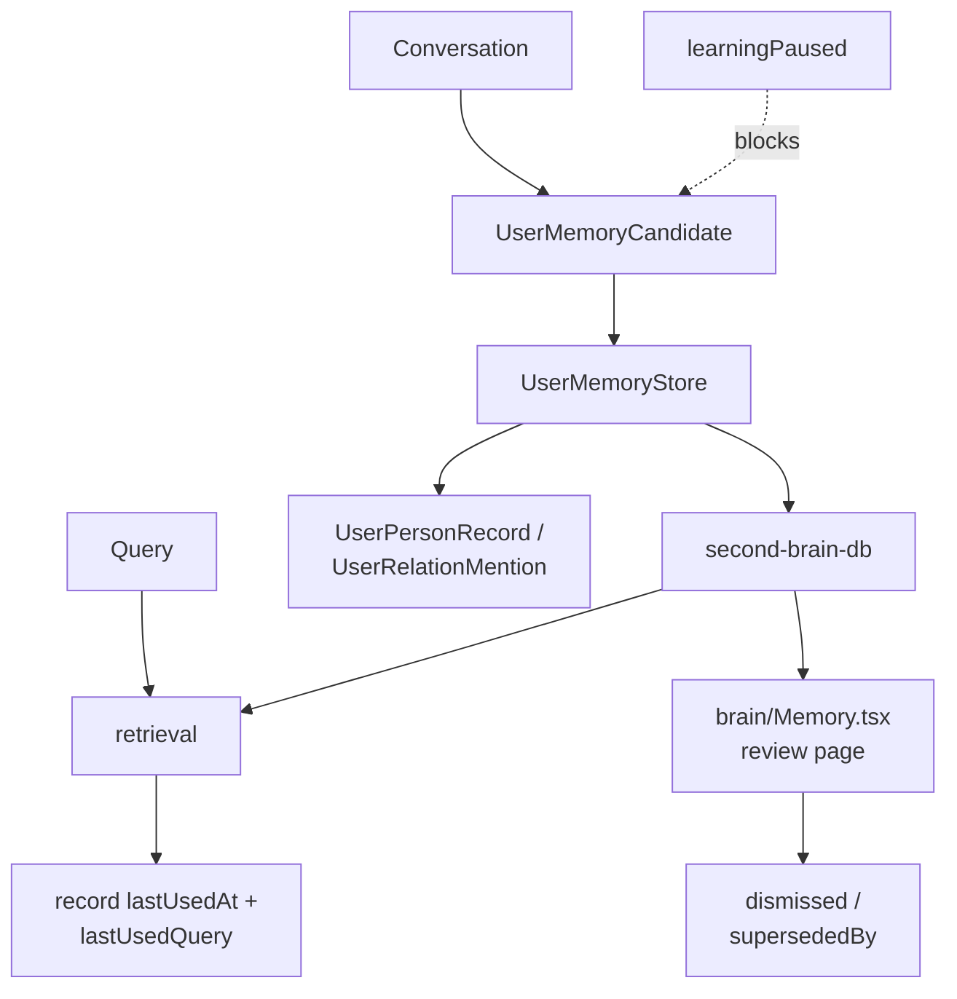

## 1. Executive Summary

Mercury is an MIT-licensed personal agent with a ~2,400-line memory subsystem — `user-memory.ts` (1,052 lines), `second-brain-db.ts`, `store.ts` — and a `brain/Memory.tsx` review page in its UI.

It is the smallest system in this batch and has the most opinionated record model. `UserMemoryRecord` carries **three independent graded scores** where most systems have one:

```typescript
confidence: number;   // how sure are we this is true
importance: number;   // how much does it matter
durability: number;   // how long should it last
```

Separating durability from importance is the unusual move. A fact can matter enormously today and be worthless next week (an active deadline) or matter mildly and hold for years (a dietary restriction). Systems that fold both into one "importance" field cannot express the difference, and their decay policies suffer for it — the atlas's [decay and reinforcement](../../patterns/decay-and-reinforcement/) pattern warns against applying one half-life to every memory kind, and this schema is what avoiding that looks like.

Three further details are distinctive:

**A subconscious tier.** `scope` is `durable | active | subconscious`. The first two are familiar; `subconscious` is a below-recall holding tier, counted separately in `UserMemorySummary.subconsciousTotal`. It is a middle state between "forgotten" and "in play" that almost nothing else here models.

**Learning can be paused.** `UserMemorySummary.learningPaused` exposes a switch that stops the agent forming new memories. For a personal assistant that observes continuously, a user-facing off switch is a genuine privacy control, and the atlas has not seen one before.

**Usage records the query, not just the count.** Alongside `lastUsedAt` sits `lastUsedQuery` — the actual query that last surfaced this memory. That is a far better debugging signal than a counter: it answers "why does this keep coming up?"

Reservations: `dismissed` is a boolean rather than a durable value-level tombstone, and no memory benchmark was found.

## 2. Mental Model

```typescript
interface UserMemoryRecord {
  id: string;
  type: UserMemoryType;
  summary: string;
  detail?: string | null;
  scope: 'durable' | 'active' | 'subconscious';
  evidenceKind: 'direct' | 'inferred' | 'manual' | 'system';
  source: 'conversation' | 'system';
  confidence: number;
  importance: number;
  durability: number;
  evidenceCount: number;
  provenance?: string | null;
  dismissed: boolean;
  supersededBy?: string | null;
  createdAt: number; updatedAt: number;
  lastSeenAt: number;
  lastUsedAt?: number | null;
  lastUsedQuery?: string | null;
}
```

A candidate is a strictly smaller shape, which is a good sign — a proposed memory cannot arrive pre-loaded with usage history or supersession:

```typescript
interface UserMemoryCandidate {
  type; summary; detail?;
  evidenceKind?: 'direct' | 'inferred';
  confidence; importance; durability;
}
```

Note that a candidate's `evidenceKind` is narrowed to `direct | inferred` — `manual` and `system` are reserved for records the extraction path cannot create.

Alongside user memories sit `UserPersonRecord` and `UserRelationMention`, so Mercury models **people and relations** as well as facts — a light social graph closer to [Honcho](../honcho/)'s peer modelling than to a flat preference store.

```text
conversation
  → candidate { evidenceKind: direct | inferred, confidence, importance, durability }
  → UserMemoryStore
      scope: durable | active | subconscious
      evidenceCount increments on corroboration
      dismissed / supersededBy for correction
  → retrieval → RetrievedUserMemory
      lastUsedAt, lastUsedQuery recorded
  → brain/Memory.tsx review UI
```

## 3. Architecture

- `src/memory/user-memory.ts` (1,052 lines) — `UserMemoryStore` and the record model.
- `src/memory/second-brain-db.ts` — persistence.
- `src/memory/store.ts`, `index.ts` — surface.
- `src/memory/user-memory.test.ts` — tests.
- `ui/src/pages/brain/Memory.tsx` — the operator review page.



## 4. Essential Implementation Paths

### Three scores instead of one

`confidence`, `importance`, and `durability` are orthogonal questions, and keeping them apart lets each drive a different mechanism: confidence should gate whether a memory is asserted, importance should influence ranking, and durability should drive decay. Systems in this atlas that conflate them end up with the failures the pattern library documents — [Holographic](../holographic/) folding truth and reachability into one `trust_score` is the clearest counterexample.

Whether Mercury actually uses all three independently was not traced end to end; the schema permits it, which is the precondition.

### The subconscious tier

A memory in `subconscious` scope is retained but below active recall, and `UserMemorySummary` reports its count separately from the total. This gives the system a graceful middle path: rather than deleting a memory that has stopped being useful, demote it, and keep the option of promotion if it becomes relevant again.

It also gives the user something honest to look at — "you have 412 memories, 180 of them subconscious" describes the store's real shape in a way a single total does not.

### `evidenceKind` and `evidenceCount`

`direct | inferred | manual | system` records *how* a memory came to exist, and `evidenceCount` counts corroborations. Together these support the write policy the atlas repeatedly recommends: a directly-stated fact corroborated three times should not be treated like a single inference. That the candidate type cannot set `manual` or `system` means the extraction path cannot forge provenance — a small but real integrity property, and the same instinct as [RainBox](../rainbox/)'s actor model, expressed through type narrowing rather than an actor enum.

### `lastUsedQuery`

Recording the query that last used a memory is the best small debugging affordance in this batch. Retrieval counters tell you a memory is popular; the query tells you *why*, which is what you need to diagnose a memory that keeps surfacing inappropriately. It is also exactly the input a human needs on a review page to judge whether a memory is earning its place.

### `learningPaused`

A user-facing switch that stops new memory formation. For an always-listening assistant this is a meaningful control, and it belongs in the same family as sensitivity levels and scoped exceptions — mechanisms that let a user shape what the system is allowed to know rather than only correcting it afterwards.

## 5. Memory Data Model

Persistence is `second-brain-db.ts`; people and relations sit alongside memories.

Gaps:

- **`dismissed` is a boolean on the record**, not a value-level tombstone. Dismissing memory X does not prevent an equivalent memory X′ from being extracted tomorrow with a fresh id — the laundering path the [rejected-value tombstone](../../patterns/rejected-value-tombstone/) pattern exists to close.
- **`provenance` is an optional string**, so the link back to evidence is free-text rather than a structured reference.
- **No scope beyond the three-level tier** — no project or workspace boundary, which is defensible for a single-user personal assistant and would not survive multi-user use.
- **No conflict state.** `supersededBy` records that a replacement happened; nothing marks two live memories as disagreeing.

## 6. Retrieval Mechanics

`RetrievedUserMemory` is the retrieval shape, and usage is recorded on every hit. Ranking mechanics were not traced in detail; the presence of three graded scores plus recency fields gives the necessary inputs, and `subconscious` scope provides the filter that keeps demoted memories out of ordinary recall.

## 7. Write Mechanics

Candidates enter with `confidence`, `importance`, and `durability` already estimated, then become records. `evidenceCount` increments on corroboration rather than creating duplicates. `learningPaused` gates the whole path.

No verification tier was found — a candidate with high enough confidence appears to become a record without a separate promotion step, so the three scores are estimates made at extraction time rather than judgments earned over time.

## 8. Agent Integration

Memory is internal, with `brain/Memory.tsx` providing the review surface. That page is worth more than its size suggests: the atlas consistently finds that systems with an operator-facing memory view (RainBox's `/memory`, Magic Context's dashboard) develop better correction semantics, because someone can see what went wrong.

## 9. Reliability, Safety, and Trust

Strengths:

- **Three orthogonal grades** — confidence, importance, durability.
- **A subconscious tier** between active and forgotten.
- **Provenance kind with narrowed candidate types**, so extraction cannot claim manual or system origin.
- **Corroboration counting** rather than duplicate records.
- **`lastUsedQuery`** as a diagnostic signal.
- **A user-facing learning pause.**
- **An operator review page.**
- **People and relations modelled** alongside facts.

Gaps:

- **`dismissed` without a value tombstone**, so dismissal is not durable against re-extraction.
- **No verification tier** between candidate and record.
- **Free-text provenance.**
- **No conflict state.**
- **Single-user assumptions** throughout.
- **No memory benchmark.**

## 10. Tests, Evals, and Benchmarks

`user-memory.test.ts` sits beside the implementation. Nothing was run for this review, and no memory-quality benchmark was found.

The measurement this design invites is whether its three scores are independently predictive — whether `durability` estimated at write time actually predicts how long a memory stays useful. That is answerable from `lastUsedAt` history, and the data to answer it is already being recorded.

## 11. For Your Own Build

### Steal

- **Separate durability from importance.** How much a memory matters and how long it should last are different questions, and one field cannot answer both. This is the schema-level fix for the atlas's warning against a single global half-life.
- **A subconscious tier.** Demotion is a better default than deletion for memory that has merely stopped being relevant, and it gives you an honest way to describe the store's size.
- **Narrow the candidate type.** If extraction cannot construct `evidenceKind: 'manual'`, provenance cannot be forged — an integrity property enforced by the type system rather than by a check.
- **Record the query that used a memory**, not just a counter.
- **Give the user a pause switch** for learning.
- **Count corroborations on the record** instead of writing duplicates.

### Avoid

- **Dismissal without a tombstone**, in a system that extracts automatically.
- **Scores assigned once at extraction** with no path to revision.
- **Free-text provenance** that cannot be followed programmatically.
- **No conflict representation.**

### Fit

Borrow:

- The three-score model, especially the durability/importance split.
- The `durable | active | subconscious` tiering.
- The narrowed candidate type as a provenance-integrity trick.
- `lastUsedQuery`.
- The learning-pause control.

Do not copy:

- `dismissed` as a boolean if automatic extraction can regenerate the memory.
- Write-time score estimates as if they were earned confidence.

## 12. Open Questions

- Are the three scores used independently, or does ranking collapse them?
- What promotes or demotes a memory between `active` and `subconscious`, and is it reversible on use?
- Should dismissal write a value-level tombstone?
- Does `durability` estimated at extraction predict actual useful lifetime? The recorded usage data could answer this.
- How do person and relation records participate in retrieval?

## Appendix: File Index

- Record model and store: `src/memory/user-memory.ts` (`UserMemoryRecord`, `UserMemoryCandidate`, `UserMemorySummary`, `RetrievedUserMemory`, `UserPersonRecord`, `UserRelationMention`, `UserMemoryStore`).
- Persistence: `src/memory/second-brain-db.ts`, `src/memory/store.ts`.
- Surface: `src/memory/index.ts`.
- Review UI: `ui/src/pages/brain/Memory.tsx`.
- Tests: `src/memory/user-memory.test.ts`.

## History

**2026-07-27** — [`6e174a4b5ea77bbc753bff5f89c76db9303439d1`](https://github.com/cosmicstack-labs/mercury-agent/commit/6e174a4b5ea77bbc753bff5f89c76db9303439d1) — first reading.
