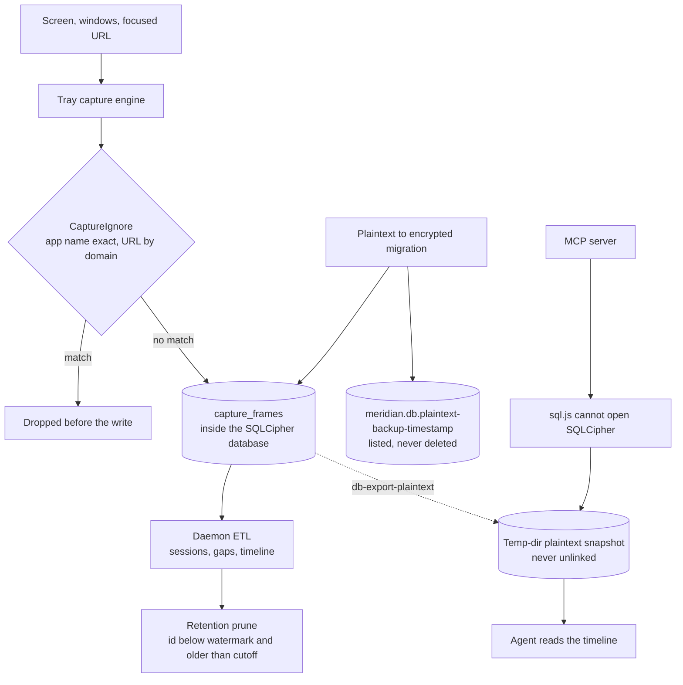

## 1. Executive Summary

Meridian is an MIT-licensed desktop tool that watches a day of screen activity
and turns it into a timeline, a daily summary and updated tickets — 144,686 lines
of Rust with 2,033 test functions, 2,831 commits, a Tauri tray doing capture
in-process, a daemon running the ETL, and an MCP server so an agent can read the
result.

It carries no capability marks, and for this category that is the expected
outcome rather than a criticism: there is no trust state on an OCR frame, no
tenancy in a single-user local database, no mutation ledger, and nothing keyed on
a removed value. What a memory of this kind is judged on is what it captures, what
it refuses to capture, and what leaves the machine — so that is what this report
is about.

The refusal machinery is good. An ignore list drops a frame **before it is
written**, matching an app name exactly or the focused tab's URL at domain
granularity, and the setting states its own limit in capitals: *"GOING FORWARD
ONLY; already captured history is left untouched."* The unit tests assert both
polarities, including the trap a naive implementation fails — `youtube.com` in
the list must drop `m.youtube.com` and must **not** drop `notyoutube.com`.

The database is SQLCipher-encrypted with a raw 256-bit key, and the module
explains why it is applied as a raw key rather than a passphrase: full-entropy
material is already in hand, so key derivation *"only adds latency, not
security."*

And then there are two plaintext copies.

The first is deliberate. Migrating an existing plaintext database to encryption
writes the original to `meridian.db.plaintext-backup-<timestamp>` beside it. The
only code that looks at that file afterwards is a helper that *lists* leftovers to
tell a fresh install apart from a crashed migration. Nothing in the tree deletes
it.

The second is structural. The MCP package reads the database with a WebAssembly
SQLite build that cannot open a SQLCipher file, so on every read it shells out to
`meridian db-export-plaintext` and reads the resulting snapshot from the system
temp directory. That snapshot is created, returned to the caller, and never
unlinked anywhere in the package.

So a machine where the encryption migration has run and an agent has read the
memory once holds the screen-activity database three times: encrypted where it
belongs, in the clear beside it, and in the clear in `/tmp`.

## 2. Mental Model

The tray captures; the daemon interprets. That split is stated as an inversion of
the usual ownership — `capture_frames` is *written by the tray* and *read by the
daemon*, and the module says so twice because every other table in the database
runs the other way.

A frame is an app name, a window name, a timestamp and extracted text. The text
column is a deliberate either/or: OCR output in one, accessibility-tree text in
the other, exactly one populated per row, mirroring the upstream schema this
replaced so the reader could be repointed mechanically.

Above the frames, an ETL builds sessions, detects gaps, and produces the day's
timeline, tasks and worklog drafts.

## 3. Architecture



## 4. Essential Implementation Paths

- **Ignore.** `CaptureIgnore::should_drop_frame(app, url)` is built from the two
  settings lists at the frame consumer; the app match is exact and
  case-insensitive after trimming, the URL match is on the host at domain
  granularity with subdomains included
  (`tray/src-tauri/src/capture_ignore.rs`, wired at `tray/src-tauri/src/lib.rs:1699-1815`).
- **Write.** `insert_capture_frame` writes one row per frame, populating exactly
  one of the two text columns (`meridian-core/src/capture.rs`).
- **Retain.** The prune deletes with `WHERE id <= ?1 AND timestamp < ?2`, the
  first bound being the ETL watermark, so a frame is never removed before it has
  been processed (`src/etl/capture_retention.rs:64-125`).
- **Encrypt.** `open_pool_with_key` applies `PRAGMA key = "x'<hex>'"` with a
  64-hex-character key; `encrypt_in_place` upgrades an existing plaintext
  database and leaves the timestamped backup
  (`meridian-core/src/db_crypto.rs:600-645`).
- **Export.** `export_plaintext` attaches a new database and runs
  `sqlcipher_export`, overwriting the output if it exists (`:647-690`).

## 5. Memory Data Model

There is no belief here to model. A frame records what was on screen, not a claim
about the world, and nothing on the row carries a status, a confidence or a
provenance beyond which of the two extraction methods produced the text.

That is why every capability mark is absent, and the absences are of the
uninteresting kind: `trust_state` because an OCR frame is an observation rather
than an assertion; `bitemporal` because a frame has one timestamp, when it was
seen, which is both axes at once for a screenshot; `tombstone` because retention
deletes by id range with nothing keyed on content; `audit_log` because no table
records mutations; `scope_enforced` because there is one user and one database,
and the ignore list is a write filter rather than a read predicate; and
`human_review` because nothing is approved before it takes effect.

The one design decision in the row worth naming is the either/or text column,
which preserves the distinction between what was read off the pixels and what was
read out of the accessibility tree. A downstream consumer that cares about
reliability can tell them apart; the reader that does not care coalesces them.

## 6. Retrieval Mechanics

Timeline and session queries over the rolled-up tables, plus an MCP server for an
agent. The MCP path is where this report's second finding lives, and it is worth
being precise about the mechanism rather than the blame: `sql.js` is a WebAssembly
SQLite with no SQLCipher support, so it genuinely cannot open the file. Exporting
a snapshot is a reasonable way to make an agent-facing reader work at all.

What is missing is the other half of the transaction. The snapshot path appears
exactly once in the package — where it is constructed — and there is no `unlink`,
no cleanup on process exit, and no expiry. The key reaches the exporting child
process through `MERIDIAN_DB_KEY` in its environment.

The package also carries, in a comment above that path, a cross-user bug it
already found and fixed. An earlier version derived the snapshot filename from an
8-byte prefix of the path hash, and:

> "/Users/a" is exactly eight bytes, which makes `/Users/alice/...` and
> `/Users/alison/...` collide. Since the caches key on `dbPath` rather than on
> this derived path, two paths can be resolved concurrently, and a collision lets
> one database's export overwrite the other between its export and its read —
> serving one user's data for a request against another's.

Finding that, explaining it in the code, and widening the hash is exactly right.
It also shows the authors are thinking about this path carefully, which makes the
missing cleanup look like an oversight rather than a position.

## 7. Write Mechanics

The ignore list is the mechanism that matters and it is built correctly. Dropping
before the write rather than filtering on read means an ignored app's pixels never
reach the database, so a later bug in a query cannot expose them. The settings
comment states the matching rules and the forward-only limit, and there is a
separate `capture_secondary_monitors` toggle with its own reason given — a second
monitor can show a meeting or a personal window the user does not want tracked.

The tests are the part to copy. `should_drop_frame` is asserted true for
`"Messages"`, `"messages"` and `"  MESSAGES  "`, and asserted **false** for
`"Messages Pro"` — so an exact match cannot become a prefix match — and for
`"Slack"` and for a frame with no app name. On the URL side, `youtube.com` drops
`https://m.youtube.com/` and `http://youtube.com`, and does **not** drop
`https://notyoutube.com/`. That last assertion is the one that separates a domain
match from a string-suffix match, and it is the bug this rule usually ships with.

The retention prune is equally careful in a smaller way: deleting only rows at or
below the ETL watermark means the retention window can never race the interpreter
and delete a frame that has not yet been turned into a session.

## 8. Agent Integration

An MCP server package reads the database and exposes the timeline to an agent,
and the tray carries a Claude Code settings file with session hooks and committed
git hooks — all read here as data, none executed.

The ETL carries one agent-aware behaviour worth noting: frames from a VS Code
window whose terminal tab is running a coding agent are skipped, to avoid
double-counting work the indexer already accounts for. The tests around that skip
are about a subtle consequence rather than the skip itself — a skipped frame must
still advance the gap detector's clock, because otherwise six minutes of
back-to-back agent frames look like a six-minute absence and the session is split
by a spurious sleep gap. *A skip must not look like an absence* is a good general
statement of the problem with any filter applied inside a time series.

## 9. Reliability, Safety, and Trust

For a tool that records the screen, the security posture is the whole assessment,
so here is the balance as read.

**What is done well.** Capture can be excluded per app and per domain, before the
write, with semantics documented and tested in both directions. The database is
encrypted at rest with a correctly-applied raw key. Retention cannot outrun the
ETL. A cross-user collision in the export path was found and fixed with the
reasoning left in place. The README's privacy paragraph is short and does not
overclaim: activity stays in one encrypted database, only what a summary needs
goes to the configured provider, diagnostics are opt-out and stripped.

**What is not.** Two copies of that database can exist in the clear, and nothing
in the repository removes either:

- `meridian.db.plaintext-backup-<timestamp>`, written by the encryption migration
  and only ever *listed* afterwards, by a helper whose stated job is to tell a
  fresh install from a crashed one.
- `$TMPDIR/meridian-mcp-plaintext-<hash>.db`, written on every MCP read and
  returned to the caller with no cleanup path.

Neither is hidden — both are documented in the code that creates them — and the
first is a defensible safety net for a migration that must not lose data. But the
claim a user reads is *"one encrypted database on your machine"*, and after a
migration and one agent read it is one encrypted database and two unencrypted
ones. For screen-capture material, where the threat model includes another process
or another user on the same machine, that is the finding.

A smaller note in the same area: the export passes the database key to a child
process through its environment, which is readable from outside the process on
some platforms.

## 10. Tests, Evals, and Benchmarks

2,033 test functions; nothing was run here. The ones that bear on this report are
the ignore-filter unit tests and the ETL skip integration tests, and both are
written the way this atlas likes — each names the failure it prevents, and the
ETL file's header lists its invariants before any code.

No capability mark is earned by them, and `negative_eval` is the one worth
explaining rather than merely omitting. The must-not assertions here are about
what is *written* — an ignored app's frame must be dropped — and about the shape
of a derived timeline. None asserts that particular material must not come back
from a query, which is the property the mark names. In a capture system the two
are closely related, since not writing is how not retrieving is achieved; they are
still different assertions, and only one of them survives a bug in the read path.

## 11. For Your Own Build

- **Filter before the write, not on the read.** An ignored application's pixels
  that never reach the database cannot be exposed by a later query bug. It also
  makes the guarantee explainable to a user in one sentence.
- **Say that an exclusion is forward-only.** Adding an app to an ignore list
  feels like it should scrub the history, and does not. Putting that in the
  setting's own documentation — in capitals, here — is the difference between a
  surprise and a decision.
- **Test the suffix trap.** A domain rule that drops `m.youtube.com` must not drop
  `notyoutube.com`, and an app rule that drops `Messages` must not drop
  `Messages Pro`. Both are one assertion each and both are the bug that ships.
- **Delete the plaintext you made.** A migration backup and an export snapshot are
  each reasonable to create and each need an owner for their removal. A file whose
  only subsequent reader is a helper that lists it has nobody deleting it.
- **A skip must not look like an absence.** Filtering inside a time series moves
  the clock as well as the data; a skipped frame that does not advance the gap
  detector turns a filter into a phantom six-minute nap.
- **Gate retention on the consumer's watermark.** Deleting only what has already
  been processed makes a retention window and a slow interpreter independent
  rather than a race.

## 12. Open Questions

- Is the migration backup meant to be removed after a successful startup, or kept
  indefinitely as a recovery path? Nothing in the tree does either deliberately.
- Could the MCP reader hold the snapshot in memory, or unlink it after opening,
  so a read leaves nothing behind? The current file survives the process.
- The ignore list matches an app name exactly. Is a window-title rule wanted for
  applications that show both work and private content in the same process?

## Appendix: File Index

- Capture and ignore: `meridian-core/src/capture.rs:1-30` (the inverted ownership
  and the either/or text column), `tray/src-tauri/src/capture_ignore.rs` (the
  filter and its tests at 140-166), `tray/src-tauri/src/lib.rs:1699-1815` (the
  wiring), `meridian-core/src/settings.rs:308-326` (`ignored_apps`,
  `ignored_urls`, `capture_secondary_monitors` and their documented semantics).
- Encryption: `meridian-core/src/db_crypto.rs:1-25` (callers and key format),
  `:314-345` (`interrupted_migration_leftovers`), `:600-645` (`encrypt_in_place`
  and the backup), `:647-690` (`export_plaintext`).
- MCP reader: `packages/meridian-mcp/src/db-cache.ts:100-145` (the snapshot path,
  the collision comment and the export call).
- Retention: `src/etl/capture_retention.rs:64-125`.
- ETL skip: `tests/etl_coding_agent_skip.rs:1-30` (the invariants),
  `tests/etl_gaps.rs`.

**Searches recorded for the negative claims**

```sh
grep -rn "remove_file" --include='*.rs' . | grep -i "backup\|plaintext"   # 0 — neither plaintext copy is deleted
grep -rn "meridian-mcp-plaintext" --include='*.ts' .                      # 1 — the construction, no unlink
grep -rn "ignored_apps\|ignored_urls" --include='*.rs' .                  # settings, the filter, the wiring
grep -rn "capture_frames" --include='*.rs' . | grep -i "delete\|prune"    # the watermark-gated retention pass
```

## History

**2026-09-17** — [`a100468211b3f1f79c1d71ff01921d9cc47327bb`](https://github.com/Meridiona/meridian/commit/a100468211b3f1f79c1d71ff01921d9cc47327bb)
— first reading, at the head of `main`, 2,831 commits in. Screened with
`scripts/screen_repo.py` first: two auto-run surfaces (a `.claude/settings.json`
carrying session hooks and four committed git hooks), and three build-time
execution paths including two cargo build scripts and an npm `prepublishOnly`.
Both auto-run surfaces were read as data and neither executed; nothing was
installed, built or run, and no capture was started. No capability marks, which
for a screen-capture memory is the expected shape rather than a criticism: a frame
is an observation with no status to filter on, one timestamp rather than two axes,
one user and one database rather than a scope, and a retention prune by id range
with nothing keyed on content. `negative_eval` is withheld on a distinction — the
ignore filter's tests assert what must not be *written*, which is how this system
achieves what is not retrieved, but is not an assertion about what a query
returns. Three separate absence claims in this reading were wrong on the first
search and corrected on a second: the ignore list, the retention pass and the
per-app controls all exist under vocabulary the first greps missed.
