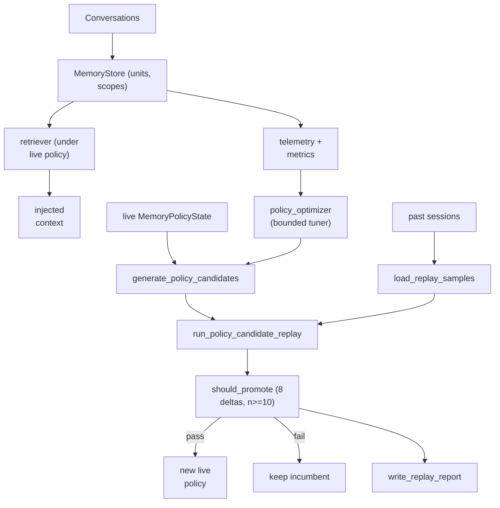

## 1. Executive Summary

MetaClaw is an MIT-licensed memory system from aiming-lab, shipping as an OpenClaw plugin with a written plugin spec (`openclaw-metaclaw-memory/OPENCLAW_PLUGIN_SPEC.md`). Its memory package is roughly 10,400 lines of Python, with a further ~5,000-line manager in the plugin sidecar.

It answers a question no other system in this atlas asks: **how do you know your retrieval policy is any good, and what would it take to change it safely?**

Every other system here has retrieval parameters — fusion weights, top-k, token budgets — chosen by hand and never revisited. [Generative Agents](../generative-agents/) has `gw = [0.5, 3, 2]` with two abandoned settings left in comments and no ablation. [Holographic](../holographic/) fuses at 0.4/0.3/0.3. [RainBox](../rainbox/) uses 0.55/0.30/0.15. None can tell you whether those numbers are right.

MetaClaw closes the loop, and closes it carefully:

```text
generate_policy_candidates(current)      # bounded grid over mode, budgets, weights
  -> run_policy_candidate_replay(...)    # replay real past turns under each candidate
  -> comparison deltas vs. the incumbent
  -> should_promote(comparison, criteria)
  -> promote, or keep the incumbent
```

`should_promote` requires a **minimum of 10 replay samples** and demands the candidate not regress on eight separate measures — query overlap, continuation overlap, response overlap, specificity, focus score, value density, grounding score, and coverage — plus a cap on how many additional zero-retrieval samples it may introduce.

This is the disciplined version of a loop the atlas is otherwise right to be suspicious of. The recurring warning here is "telemetry mistaken for truth": [Holographic](../holographic/) lets a downvote silently push a fact below the retrieval floor, and RainBox deliberately keeps feedback as a review signal behind a human gate. MetaClaw is not doing that. It tunes **retrieval policy** — how much to inject, which mode, what weights — never a memory's confidence. Usage data changes how memory is *found*, not whether it is *believed*. That is the distinction the atlas should have drawn explicitly, and MetaClaw draws it in code.

The reservations are ordinary: the memory model has no rejected state, the replay metrics are overlap-based proxies rather than task outcomes, and the promotion gate's thresholds are themselves hand-chosen defaults.

**Three findings from re-reading it at the same commit belong here rather than in the fine print.**

**The store carries more of the rubric than the first reading credited.** `list_active` — the only read the retriever uses — is `WHERE scope_id = ? AND status = ?`, so the three-value `MemoryStatus` filters retrieval rather than merely annotating a row, and it has live writers on five supersession call sites and an expiry pass that compares `expires_at` to the clock rather than testing it for presence. A `memory_events` table records one row per mutation from eight call sites and is on by default. And `tests/test_memory_system.py` — 11,440 lines and 529 cases, a file the first reading did not open — puts two managers on one store and asserts each user's material is absent from the other's retrieval result. Three marks are added on that basis, taking the report from one to four.

**The forward half of the supersession lineage is written in one place, and the garbage collector reads only that half.** `supersede()` sets `status` and `superseded_by` on the old row; the new row's `supersedes` list is populated **only** by the merge path (`store.py:651`). `garbage_collect` computes `orphans = superseded_ids - referenced`, where `referenced` is gathered from active rows' `supersedes` lists — so every unit superseded by the consolidator or the manager's dedup is an orphan by that definition and is hard-deleted on the next collection, with no event logged for the deletion. The lineage the design relies on is invisible to the one routine that deletes on the strength of it.

**The memory package is vendored twice, and the copies have diverged.** `openclaw-metaclaw-memory/sidecar/metaclaw/memory/` is a second copy of all eighteen modules; seven differ, `store.py` by 414 changed lines and `manager.py` by 178. The differences are not cosmetic in kind: the main copy takes a `threading.RLock` and the sidecar a `threading.Lock`, and the main copy logs FTS failures at debug where the sidecar swallows them with `pass`. A reader adopting the plugin is not running the code in `metaclaw/memory/`, and this report's anchors are to the main package.

## 2. Mental Model

Two objects matter, and keeping them apart is the whole design.

**The memory unit** — ordinary, and deliberately so:

```python
MemoryUnit(
    memory_id, scope_id, content, summary,
    source_session_id, source_turn_start, source_turn_end,
    memory_type,            # episodic | semantic | preference
                            # project_state | working_summary | procedural_observation
    status,                 # active | superseded | archived
    importance=0.5, confidence=0.7,
    access_count=0, reinforcement_score=0.0,
    superseded_by="",
    created_at, updated_at, last_accessed_at, expires_at,
)
```

Note that `confidence`, `importance`, `access_count`, and `reinforcement_score` are four separate fields. Reinforcement is tracked without being allowed to masquerade as belief — the split [Verel](../verel/) argues for.

**The policy** — the thing that actually gets learned:

```python
MemoryPolicyState(
    retrieval_mode, max_injected_units, max_injected_tokens,
    ...retrieval weight parameters..., notes[]
)
```

The self-upgrade lifecycle:

```text
past sessions -> load_replay_samples()
    MemoryReplaySample(session_id, turn, scope_id,
                       query_text, response_text, next_state_text)

generate_policy_candidates(current)
    Phase 1: grid over retrieval_mode x max_injected_units x max_injected_tokens
    Phase 2: perturbations of the current weight parameters
    (deduplicated by candidate key)

for each candidate: run_policy_candidate_replay()
    -> MemoryReplayResult(sample_count, avg_retrieved, avg_query_overlap,
                          avg_continuation_overlap, avg_response_overlap,
                          avg_specificity, ...)

should_promote(comparison, MemoryPromotionCriteria)
    sample_count >= 10
    every delta >= its floor  (specificity may drop at most 0.05)
    zero-retrieval increase <= 2
    -> promote the candidate, or keep the incumbent

write_replay_report()  -> auditable record of the decision
```

## 3. Architecture

`metaclaw/memory/` (~10,400 lines):

- `manager.py` (5,151) — the orchestrator.
- `store.py` (1,798) — persistence.
- `self_upgrade.py` (876) and `upgrade_worker.py` (435) — the tuning loop and its background driver.
- `replay.py` (558) — replay samples, candidate replay, replay reports.
- `consolidator.py` (315) — consolidation.
- `retriever.py` (299) — retrieval.
- `embeddings.py` (179), `policy_optimizer.py` (173), `policy_store.py` (130), `candidate.py` (127), `promotion.py`, `scope.py`, `models.py`, `metrics.py`, `telemetry.py`.

Plus `openclaw-metaclaw-memory/` — the OpenClaw plugin with its own sidecar manager (~5,000 lines), a plugin spec, and a plan document.



## 4. Essential Implementation Paths

### Candidate generation (`candidate.py`)

`generate_policy_candidates` builds a **bounded** set in two phases: a grid over retrieval mode, injected-unit count, and injected-token budget; then perturbations of the current weight parameters. Candidates are deduplicated by a key tuple, and every candidate is annotated with `"candidate_generated"` in its notes.

The bounding matters. This is not gradient descent over an open parameter space — it is a small, enumerable neighbourhood around the live policy, which keeps each upgrade cycle cheap and each change auditable.

### Replay (`replay.py`)

`MemoryReplaySample` captures `query_text`, `response_text`, and `next_state_text` for a turn. Candidate policies are then evaluated by re-running retrieval over these historical turns and scoring what they would have surfaced, producing a `MemoryReplayResult` with `sample_count`, `avg_retrieved`, and the overlap and quality averages.

This is offline counterfactual evaluation: what *would* this policy have retrieved for turns we have already seen, and how well would that have matched what actually mattered next? It requires no live traffic split and no user exposure, which is the practical reason such loops are usually skipped.

The honest limitation is that the metrics are lexical-overlap proxies (`query_overlap`, `continuation_overlap`, `response_overlap`) plus derived scores like specificity, focus, value density, grounding, and coverage. They approximate "did retrieval surface useful material" without measuring whether the task succeeded. A policy that games overlap without helping the agent would pass.

### The promotion gate (`promotion.py`)

```python
@dataclass
class MemoryPromotionCriteria:
    min_query_overlap_delta: float = 0.0
    min_continuation_overlap_delta: float = 0.0
    min_response_overlap_delta: float = 0.0
    min_specificity_delta: float = -0.05
    min_focus_score_delta: float = 0.0
    min_value_density_delta: float = 0.0
    min_grounding_score_delta: float = 0.0
    min_coverage_score_delta: float = 0.0
    min_sample_count: int = 10
    max_zero_retrieval_increase: int = 2
```

Every gate is a **non-regression** floor at 0.0, except specificity, which is allowed to drop by up to 0.05 — an explicit acknowledgement that broader retrieval trades a little precision for coverage. The `max_zero_retrieval_increase` guard is the sharpest of them: a candidate that improves averages while more often returning *nothing* is rejected, which is exactly the failure a mean would hide.

This is [Verel](../verel/)'s promotion-gate idea moved up a level. Verel gates whether an induced rule becomes a trusted memory; MetaClaw gates whether a retrieval policy becomes the live one.

### The bounded tuner (`policy_optimizer.py`)

```python
class MemoryPolicyOptimizer:
    """Bounded policy tuner that adapts retrieval parameters based on store state
    and telemetry signals. ... All changes stay within hard bounds."""
```

`propose()` reads store statistics — active count, dominant memory type, memory density, active-by-type distribution — and telemetry, then proposes an adjusted policy. It short-circuits on low volume: *"don't tune weights before having enough data."* Proposals still go through replay and the promotion gate; the optimizer suggests, it does not decide.

### Memory types

`MemoryType` includes `PROCEDURAL_OBSERVATION` alongside `EPISODIC`, `SEMANTIC`, `PREFERENCE`, `PROJECT_STATE`, and `WORKING_SUMMARY` — procedural knowledge as a first-class kind, connecting to the [skills as procedural memory](../../patterns/skills-as-procedural-memory/) pattern, though without Voyager's execution gate.

## 5. Memory Data Model

`MemoryStatus` is `active | superseded | archived`, and it is not decoration: `list_active` filters on it in SQL, so only an active unit can reach a prompt. `superseded_by` carries correction lineage, `expires_at` is a TTL the read path compares to the clock (`not u.expires_at or u.expires_at > now_iso`) rather than testing for presence — which is the shape a sibling system in this corpus got wrong by accident. `scope_id` runs through the store, the retriever, the policy and the metrics, so policies are tuned per scope rather than globally — a detail that matters, since the right injection budget for a small project differs from a large one.

**The lineage is one-directional and the collector reads the other direction.** `supersede()` writes `status` and `superseded_by` on the superseded row. The forward list, `supersedes`, is written in exactly one place — the merge path at `store.py:651`, `supersedes=[id_a, id_b]` — and `garbage_collect` derives its `referenced` set from active rows' `supersedes` lists. Five live `supersede()` call sites in `consolidator.py` and `manager.py` write neither, so their superseded rows are orphans by that definition and are removed by `DELETE FROM memories` on the next collection. What survives a collection is the lineage of merges; what does not is the lineage of consolidation.

**Temporal:** `created_at` and `updated_at` are record time, `expires_at` is a validity end. There is no validity start and no as-of read, so `bitemporal` is withheld.

**Tombstone:** withheld. `archived` and `superseded` remove a unit from retrieval, and the dedup key in the consolidator is content-derived rather than a record of a rejected value, so nothing prevents the same content being re-extracted and admitted again.

Gaps against the strongest models here:

- **No rejected state and no tombstone.** `archived` removes a memory from play but nothing prevents re-derivation.
- **`confidence` is set but its provenance is unclear** — it defaults to 0.7 and no verification path comparable to [Magic Context](../magic-context/)'s file-backed verification appears in the memory package.
- **Source is a session and turn range**, which is real provenance, but there is no actor model distinguishing user assertion from model inference.

## 6. Retrieval Mechanics

Retrieval runs under the live `MemoryPolicyState`: a retrieval mode, an injected-unit cap, a token budget, and weight parameters, with embeddings available through `embeddings.py`. The interesting property is not any single mechanism but that **all of it is a parameter vector the system can evaluate and change**.

`reinforcement_score` and `access_count` exist and feed metrics. The atlas's standing caution about popularity loops applies to any use of them in ranking — but note that here the loop is at least *measured*: if reinforcement degraded retrieval quality, the replay comparison would show it and the gate would reject the policy.

## 7. Write Mechanics

Memories are written from conversation, consolidated by `consolidator.py`, and superseded through `superseded_by`. Writes are not gated by trust the way [RainBox](../rainbox/) gates them by actor; the sophistication here is concentrated in the read path and its tuning, not the write path.

## 8. Agent Integration

`openclaw-metaclaw-memory/` packages the system as an [OpenClaw](../openclaw/) plugin with a documented plugin spec and a sidecar carrying its own ~5,000-line manager. It therefore inherits the boundary described in the [pluggable memory provider](../../patterns/pluggable-memory-provider/) pattern: OpenClaw's contract has no deletion hook or scope parameter, so MetaClaw's internal `scope_id` model is richer than the interface mounting it can express.

## 9. Reliability, Safety, and Trust

Strengths:

- **A measured, gated change loop** for retrieval policy — unique in this atlas.
- **Non-regression gating across eight metrics** with a minimum sample size.
- **An explicit zero-retrieval guard** catching the failure that averages hide.
- **Bounded candidate generation**, keeping upgrades enumerable and cheap.
- **Low-volume short-circuit** preventing tuning on noise.
- **Replay reports** written for each decision, so a policy change is auditable.
- **Reinforcement kept in its own field**, separate from confidence.
- Per-scope policies rather than one global setting.
- **A drained review queue for the policy, which is the nearest thing here to human review.** A candidate the automatic gate refuses is appended to a queue; `approve_review_candidate` promotes it and removes it, `reject_review_candidate` removes it without promoting, and both append to a review history. It adjudicates the policy that governs retrieval rather than any memory's content, which is why `human_review` is withheld — but a queue with two operator verbs that both drain it is more than most systems here offer for anything.
- **A per-memory annotation table** (`add_annotation(memory_id, content, author)`) with an author field, which is a place a person can comment on a memory without being a place a person approves one.

Gaps:

- **Proxy metrics.** Lexical overlap and derived scores are not task success; a policy could improve them without helping.
- **The gate's thresholds are themselves defaults** — hand-chosen constants governing a loop built to remove hand-chosen constants.
- **No rejected-value tombstone**; `archived` is not durable against re-derivation.
- **Two mutations write no event.** `update_content` rewrites a memory's text in place with no `_log_event` call and no record of the prior content, and `garbage_collect` hard-deletes orphaned superseded rows without one. The audit table therefore records that something was superseded and not that it was later destroyed.
- **Event logging is best-effort by construction**: `_log_event`'s body ends in `except Exception: pass`, so an audit row can fail to appear without any signal.
- **The supersession lineage the collector consults is written only by the merge path**, so consolidation's superseded rows are deleted as orphans.
- **`confidence` without a verification path.**
- **Ten samples is a low bar** for eight simultaneous comparisons; the gate is closer to a smoke test than a statistical one.
- **The same engine ships in a second repository.** `metaclaw/memory/store.py`,
  `consolidator.py` and `models.py` are byte-identical to
  `simplemem/evolver/` in the same lab's [SimpleMem](../simplemem/), so the
  findings here and there describe one code base — including the
  `garbage_collect` gap above. Two reports, one piece of evidence.
- **The whole memory package is vendored twice and has diverged**, not merely duplicated: seven of eighteen modules differ, `store.py` by 414 changed lines and `manager.py` by 178, and the sidecar's store takes a non-reentrant `threading.Lock` where the main copy takes an `RLock`. Both copies' `list_active` are identical, so the marks hold either way, but "MetaClaw's memory" names two code bases and a reader has to say which one they mean.

## 10. Tests, Evals, and Benchmarks

The evidence posture is better than most in the atlas. The repository commits a benchmark harness under `benchmark/` with two datasets (`metaclaw-bench` and `metaclaw-bench-small`), each with `all_tests.json`, an `eval/` directory, and OpenClaw config, state, and workspace fixtures — so runs are reproducible against a pinned agent setup. `scripts/` carries `run_memory_ablation.py`, `run_memory_ablation_direct.py`, `run_v03_benchmark.py`, and an Azure variant.

**Dedicated memory ablation scripts are rare here.** Most systems in this atlas measure end-to-end task performance, if anything; MetaClaw isolates the memory subsystem's contribution.

**The unit suite is substantial and the first reading did not name it.** `tests/test_memory_system.py` is 11,440 lines and 529 test functions with 1,301 assertions, and its negative assertions are where the `negative_eval` mark comes from: `test_scope_isolation_in_request_flow` ingests one turn per user against a shared store and asserts each user's material is absent from the other's `retrieve_for_prompt` result, with the failure message written into the assertion — *"User A saw User B's memory"*. A workspace case at `:240` and an entity case at `:2528` are the same shape. The orphan-collection behaviour has a case at `:3000`, and it is the clearest example in this report of a test that asserts an intention while bypassing the mechanism. It never calls `store.garbage_collect`: under a comment reading *"Simulate GC: remove superseded not referenced by active units"* it re-implements the routine's three steps inline and asserts against its own copy. And it constructs the surviving unit as `MemoryUnit(memory_id="gc-active", …, supersedes=["gc-old-referenced"])` by hand — supplying exactly the forward reference that no production path except the merge writes. So the case passes on a store no production path can produce, and a change to `garbage_collect` itself would not fail it.

Neither the suites nor the benchmarks were run for this review, and no published headline numbers were reproduced. The measurement the design most needs and does not obviously have is a link from its replay proxies to real task outcomes — evidence that improving `avg_response_overlap` improves what the agent actually does.

## 11. For Your Own Build

### Steal

- **Treat the retrieval policy as a versioned object that must earn promotion.** Generate bounded candidates, replay them against real history, and require non-regression on several measures before one goes live. Nothing else in this atlas can answer "are our fusion weights right?" — this can.
- **Offline counterfactual replay.** Evaluating candidate policies on past turns needs no live traffic split and exposes no users.
- **Guard the distribution, not just the mean.** `max_zero_retrieval_increase` catches a policy that improves averages while failing more often.
- **Short-circuit tuning at low volume.**
- **Tune reachability, never belief.** Usage data may change how memory is found; it must not change whether memory is true. This is the principled resolution of the atlas's telemetry-versus-truth tension.
- **Write a report for every policy decision**, so an automated change remains auditable.

### Avoid

- **Optimizing a proxy.** Overlap metrics are a stand-in for usefulness, and any closed loop optimizes what it measures.
- **Meta-parameters that are themselves unmeasured constants.**
- **A ten-sample gate** across eight comparisons.
- **Supersession without tombstones** in a system that consolidates automatically.
- **Confidence recorded without a verification path.**

### Fit

Borrow:

- The whole candidate → replay → gate → promote loop; it is the most valuable idea in the repository and is largely independent of the rest of the design.
- `MemoryPromotionCriteria` as a shape: a dataclass of non-regression floors plus a sample-count minimum is a readable, reviewable policy gate.
- The zero-retrieval guard.
- Per-scope policies.

Do not copy:

- The proxy metrics as-is; wire the gate to whatever outcome you can actually observe.
- The memory model as a trust store — it has no rejected state and no verification.

## 12. Open Questions

- Do the replay proxies correlate with task success? Without that link the loop is optimizing a shadow.
- Who tunes the tuner? `MemoryPromotionCriteria`'s defaults govern every future change and are not themselves evaluated.
- Is ten samples enough for eight simultaneous non-regression tests, or does the gate pass noise?
- Should the loop ever be allowed to touch `confidence`? The current answer appears to be no, which seems right and would be worth stating as an invariant.
- How does a policy promoted for one scope interact with a scope whose memory distribution later changes?

## Appendix: File Index

- Policy candidates: `metaclaw/memory/candidate.py`.
- Promotion gate: `metaclaw/memory/promotion.py` (`MemoryPromotionCriteria`, `should_promote`).
- Offline replay: `metaclaw/memory/replay.py` (`MemoryReplaySample`, `MemoryReplayResult`, `run_policy_candidate_replay`, `write_replay_report`).
- Tuning loop: `metaclaw/memory/self_upgrade.py`, `upgrade_worker.py`.
- Bounded tuner: `metaclaw/memory/policy_optimizer.py`; policy state: `policy_store.py`.
- Memory model: `metaclaw/memory/models.py` (`MemoryUnit`, `MemoryType`, `MemoryStatus`).
- Store, retrieval, consolidation: `store.py`, `retriever.py`, `consolidator.py`, `embeddings.py`.
- Scope, metrics, telemetry: `scope.py`, `metrics.py`, `telemetry.py`.
- OpenClaw plugin: `openclaw-metaclaw-memory/OPENCLAW_PLUGIN_SPEC.md` and `sidecar/metaclaw/memory/manager.py`.
- Benchmarks and ablations: `benchmark/data/metaclaw-bench*/`, `scripts/run_memory_ablation*.py`, `scripts/run_v03_benchmark*.py`.

**Searches recorded for the negative claims** (run at this pin)

```sh
grep -rn "MemoryStatus.SUPERSEDED\|status = 'archived'" metaclaw openclaw-metaclaw-memory --include="*.py"
                            # every writer of status: supersede(), expire_stale(), two
                            # archive paths in the manager. The state has live writers.
grep -rn "supersedes=" metaclaw --include="*.py"
                            # two hits outside the row hydrator: the merge path and the
                            # CLI import. Nothing else writes the forward list.
grep -rn "\.supersede(\|garbage_collect(" metaclaw openclaw-metaclaw-memory --include="*.py"
                            # five non-merge supersede call sites; garbage_collect reachable
                            # from the CLI and the manager
grep -rn "_enable_event_log" metaclaw/memory/store.py     # default True, no caller overrides it
grep -rniE "def .*(approve|review|pending|confirm)" metaclaw/memory
                            # the review queue is over policy candidates, not memory content
grep -rniE "valid_from|as_of" metaclaw/memory              # nothing: one validity bound only
git rev-list --count <pin>..HEAD                            # 0 — the pin is still the tip of main
```

The negative-assertion survey needed two passes and the first was wrong: a grep for
`assert not` and `not in` over an eleven-thousand-line `unittest` file returned
nothing at all, because every assertion in it is `self.assertNotIn` or
`self.assertFalse`. The mark in this report rests on cases that first search
reported as absent.

## History

**2026-09-17** — [`922caf3a1cd093fb316e95183a8acc8aa47b3b21`](https://github.com/aiming-lab/MetaClaw/commit/922caf3a1cd093fb316e95183a8acc8aa47b3b21) — re-read at the same commit, which is still the tip of `main`: `rev-list --count <pin>..HEAD` returns 0 and the last upstream commit is 2026-06-07. Nothing upstream had moved, so this reading audited the first one against the code, and the store turned out to carry more of the rubric than the first reading credited. Screened again: no auto-run surface, two build-time execution paths, five unpinned manifests, nothing inside the seven-day cooldown; nothing was installed and nothing was run.

**Three marks are added, taking the report from one to four.** `trust_state`, because `MemoryStatus` is filtered in `list_active`'s SQL rather than merely stored, and has live writers on five supersession call sites plus an expiry pass that compares `expires_at` to the clock. `audit_log`, because `memory_events` is a named append-only table written by `_log_event` from eight mutation sites, enabled by default with no caller overriding it, and read back by `get_event_log`. And `negative_eval`, because `tests/test_memory_system.py` — 11,440 lines and 529 cases, a file the first reading never opened — puts two managers on one store and asserts each user's material is absent from the other's `retrieve_for_prompt` result. The first reading's absence claims were as wide as the paths it enumerated, which here were `benchmark/` and `scripts/` and not `tests/`.

**Two findings about the code, both checkable in one command each.** The supersession lineage is one-directional: `supersede()` writes `superseded_by` on the old row, the forward `supersedes` list is written only by the merge path, and `garbage_collect` derives its live set from that forward list — so every unit the consolidator supersedes is an orphan by the collector's definition and is hard-deleted, with no event recorded. And the memory package is vendored twice with the copies diverged — seven of eighteen modules differ, `store.py` by 414 changed lines, including an `RLock` in the main copy that is a plain `Lock` in the sidecar — so "MetaClaw's memory" names two code bases.

The committed test for the collector is the sharpest instance of a pattern this atlas keeps finding: it never calls `garbage_collect`, re-implementing the routine inline under a comment that says *"Simulate GC"*, and it hand-builds the surviving unit with the `supersedes` reference no production path except the merge writes. It passes on a store the system cannot produce.

`stack_storage` and `stack_retrieval` were empty and seeded; they are now `sqlite` and `lexical, vector` from the FTS table and the embedding arm, and the source is `reviewed`. The appendix carries the searches, including the one that first returned nothing because an eleven-thousand-line `unittest` file has no bare `assert not` in it.

**2026-07-27** — [`922caf3a1cd093fb316e95183a8acc8aa47b3b21`](https://github.com/aiming-lab/MetaClaw/commit/922caf3a1cd093fb316e95183a8acc8aa47b3b21) — first reading. Screened before reading; nothing was installed or run.
