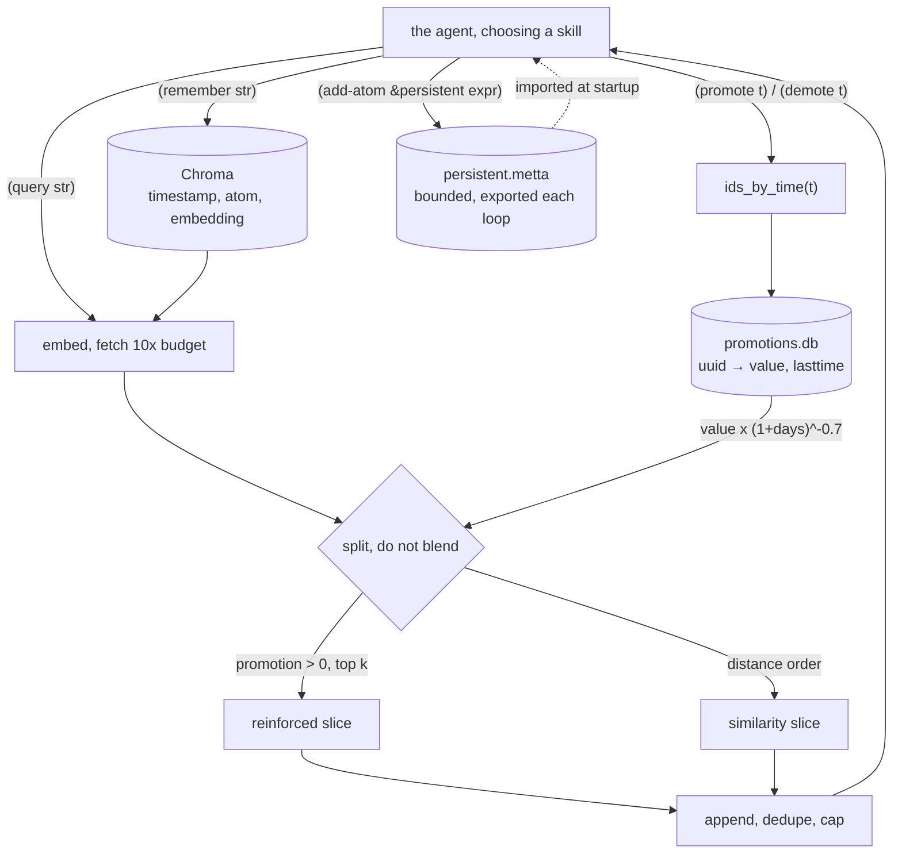

## 1. Executive Summary

MeTTaClaw is an agent written in MeTTa, running on PeTTa — a MeTTa implementation
over SWI-Prolog — whose author states the constraint the whole design follows
from: *"The agent core comprises approximately 200 lines of code."* MIT, Patrick
Hammer, 19 files, about 1,800 lines including the Python bridges, 160 commits
since 21 February 2026. There are no tests.

**Long-term memory is a tool the agent operates, and nothing writes on its
behalf.** The README says so as a design position rather than a limitation:
memory is *"deliberately maintained by the agent via `(remember string)` for
adding memory items and `(query string)` for querying related memories."* No
extractor watches the conversation, no consolidation pass runs, and no
background worker touches the store. A memory exists because the model decided
to call a function.

**The mechanism worth the report is that the model also rates its own memories,
and the rating is a tool call.** Two more skills sit beside remember and query,
described to the model in the skill list: *"Promote a memory that you found
useful, to make it easier to be recalled in the future in similar context:
promote time_string"*, and *"Demote a memory that you do not find useful or not
anymore, to remove its promotion advantage: demote time_string"*. Almost
everything in this atlas that carries a utility signal infers it from retrieval
telemetry — a memory that was returned becomes a memory that is trusted, which
is the feedback loop the corpus's failure-mode section names most often. Here the
signal is an explicit judgement, made after use, by the agent that used it.

**And recall refuses to merge the two priors it holds.** `query` embeds the
string, over-fetches `promotionInflationFactor × maxRecallItems` — ten times the
budget, so 100 candidates for a 10-item recall — then builds two lists: the
top-`maxRecallItems` by promotion among candidates whose promotion is above zero,
and the raw distance-ordered list. It returns
`unique-atom (append $bestpromoted $closest)` capped at the sum of the two
budgets. The reinforced memories come first, the similar ones follow, and no
score combines them. [NexusMem](../nexusmem/) solves the same problem — two
query-independent priors that can overturn the query — by bounding how far they
may move a result; this solves it by keeping the lists apart and letting the
model see both.

**Three things bound how far to trust the design.** The rater is the model whose
recall the rating improves, so `promote` is a system asking a language model to
grade the usefulness of what it just read, with no outcome behind it. Promotion
is keyed on a **timestamp** rather than a memory id — `(promote $time)` resolves
`ids_by_time` and moves every item written in that second — so the unit of
reinforcement is the moment, not the memory, which is either an elegant
episode-level signal or an imprecise one depending on how much the agent wrote at
once. And there is no test of any kind in the repository, so every property above
is a reading of the code rather than of a passing assertion.

`capabilities: ""`. Assessed against all seven: promotion is a float rather than
a discrete state, `demote` decrements a score rather than recording a rejected
value, there is one time axis, no scope key, no mutation log and no committed
evaluation case.

## 2. Mental Model

A memory becomes durable when the agent says so, and it never stops being
durable. `(remember str)` embeds the string and writes it to Chroma with a
timestamp; nothing in the tree deletes a memory item, and `demote` — the only
verb that sounds like removal — reduces a number.

What changes over time is *standing*. Each memory has a promotion value in
`[0, 10]`, incremented by one on promote and decremented by one on demote, and
read through a decay:

```text
promotion × (1 + Δdays)^−0.7
```

So a memory promoted once and left alone loses most of its advantage over a few
weeks, and a memory promoted repeatedly holds it. Standing decays; existence does
not. A memory whose effective promotion reaches zero drops out of the reinforced
list and stays reachable through similarity, which is a soft suppression rather
than a tombstone: the agent can say "stop preferring this" and cannot say "this
was wrong."

The epistemics that would let it say the second are present in the tree and live
somewhere else. `lib_nal.metta` implements Non-Axiomatic Logic, exposed to the
agent as a callable tool with truth values written `(stv frequency confidence)`,
including revision — *"`|-` also works for revision, to merge evidence even when
the term of both premises is the same"* — and temporal inference through `|-t`.
So the agent has a calculus for combining conflicting evidence, and its memory
items do not carry truth values for that calculus to combine. The two halves are
adjacent and unwired to each other.



## 3. Architecture

Nothing runs as a service and there is no package manifest — the screen returned
**NOTHING SCANNED**, which is a finding rather than a clean result: no npm,
Python, Rust or Go manifest exists for the tool to read, so the dependency
surface was checked by hand. Installation is documented as cloning the
repository *into* PeTTa's `repos/` directory and running `run.metta` from
PeTTa's root, with an `OPENAI_API_KEY` in the environment. SWI-Prolog is the
substrate; `src/skills.pl` is Prolog.

State is four files and one external service. `memory/history.metta` is an
append-only transcript. `memory/promotions.db` is SQLite in WAL mode holding a
`kv` table of 16-byte UUID keys to `value REAL` and `lasttime REAL`.
`memory/persistent.metta` is the exported AtomSpace. `memory/prompt.txt` is the
system prompt. The memory items themselves live in Chroma through
`lib_chromadb`, which is supplied by PeTTa rather than by this repository — so
the vector store's behaviour, including what its delete does, is outside the tree
and outside this reading.

## 4. Essential Implementation Paths

**Write** — `(remember $str)` in `src/memory.metta`: embed, then
`lib_chromadb.remember` with the string, the embedding and
`get_time_as_string`. Two lines, no validation, no dedupe, no size cap.

**Embed** — `(embed $str)` routes to a local model or OpenAI on one config key,
`embeddingprovider`, defaulting to OpenAI in this repository.

**Reinforce** — `(promote $time)` and `(demote $time)` resolve
`lib_chromadb.ids_by_time($time)`, read each id's current decayed promotion, and
write back `min(10, v+1)` or `max(0, v−1)` with `lasttime` set to now, then
`promotion_commit()`. The clamp at both ends is deliberate and small: a memory
cannot be promoted into permanence or demoted into negative standing.

**Decay** — `(get-promotion $current_time $uuid)` is where the ledger becomes a
score: `value × (1 + Δseconds/86400)^−0.7`. It is computed on read, so nothing
has to sweep the store.

**Recall** — described in section 1; the shape is over-fetch, split, append,
dedupe, cap.

**Episodes** — `(episodes $time)` calls `helper.around_time`, which opens
`history.metta`, reads **every line into a buffer**, finds the line whose
timestamp is closest to the target, and returns a window of `k` lines either
side with line numbers. It is a full linear scan and a full in-memory copy per
call, which is fine for a transcript of a few thousand lines and is the first
thing to break as one grows.

**Procedural memory** — `src/loop.metta` calls `bound-space! &persistent` with a
character cap and `export! &persistent` to `memory/persistent.metta` each loop;
`lib_mettaclaw.metta` imports that file at startup. The skill list tells the
agent it may `add-atom &persistent`, that *"functions added there are also
persisted and can be called directly via the metta command"*, and how to inspect
it. So the agent extends its own callable vocabulary across sessions, under a
size bound — procedural memory in the literal sense, in about three lines of
plumbing.

## 5. Memory Data Model

A memory item is a triple: a timestamp string, the atom, and its embedding. The
README states the representational position plainly — *"the agent remains
flexible in choosing the representation for the atom itself. Consequently, the
agent is not hardcoded to any particular memory representation, and different
formats can co-exist in the same atom space."*

That is a real design choice with a real cost. The upside is that the agent can
learn a representation that suits a domain, and that another Hyperon component
can operate on the same atoms. The downside is that nothing can be relied on:
there is no schema, no required field, no type, so no code can filter, validate
or migrate memories, and two memories written a week apart may not be comparable
as data. Every mechanism this atlas looks for — a status, a scope, a provenance
field, a validity interval — would have to be a convention inside the atom, held
by the model.

The promotion ledger is the only structured metadata, and it is deliberately kept
outside the item: a separate SQLite row keyed by the Chroma uuid, holding a value
and the time it was last set.

## 6. Retrieval Mechanics

One arm, vector similarity, over-fetched ten-fold and then re-ranked by a second
signal that is allowed to promote but never to exclude. The parameters are five
integers set in `initMemory`: `maxRecallItems 10`, `maxSimilarityRecall 10`,
`maxEpisodeRecallLines 20`, `promotionInflationFactor 10`, `mostPromotedMemories
10`.

**The over-fetch is what makes the reinforcement signal reachable.** A promoted
memory that ranks 40th by distance cannot be recovered by re-ranking the top 10;
fetching 100 gives promotion a chance to lift it. The cost is that the whole
promotion computation runs over 100 rows per query, each one a SQLite read
through the Python bridge.

`best-promoted-memories` is a separate path that ignores the query entirely and
returns the globally most-promoted items, writing them to
`memory/promoted_memories.metta` as it goes — a rebuildable projection of what
the agent currently considers most useful, regenerated from the ledger rather
than maintained.

There is no lexical arm, no reranker, no scope filter and no threshold. A query
always returns up to 20 items and cannot return nothing when the store is
non-empty.

## 7. Write Mechanics

**Writes are synchronous and unconditional.** `remember` embeds and inserts; the
embedding call is the only latency, and a failure there propagates rather than
being swallowed. There is no queue, no batching and no write lag beyond the
round trip.

**Nothing deduplicates.** The same fact remembered twice is two items with two
embeddings, both retrievable, both independently promotable. In a system whose
only garbage collection is the model choosing not to write, that is the growth
path to watch.

**There is no correction and no deletion.** The tree contains no delete call
against Chroma, no supersession pointer, no expiry and no rejected-value record.
A memory the agent later decides is wrong can be demoted to zero standing, which
costs it the reinforced slice and leaves it in the similarity slice — so a wrong
memory that is textually similar to the query still arrives, now without the
marker that the agent had judged it unhelpful. The demote verb is described to
the model as removing *"its promotion advantage"*, which is exactly what it does
and less than the word suggests.

**History is separate and append-only.** Each turn appends the timestamp, the
human message when there is one, the response, and `ERROR_FEEDBACK` when the
previous action errored — so failures are written into the transcript the next
prompt reads, which is the cheapest possible form of learning from error.

## 8. Agent Integration

Memory reaches the model as skills, not as injected context: `remember`, `query`,
`episodes`, `pin`, `promote`, `demote`, beside shell, file I/O, web search,
communication channels and `metta` for arbitrary expression evaluation. The
prompt carries the skill list, a character-capped tail of the history, and the
promoted memories.

The `metta` skill is the widest surface in the system and the most interesting
one. Through it the agent can invoke Non-Axiomatic Logic — the skill list gives
worked examples of inheritance, implication with variables, negated knowledge as
`(stv 0.0 0.9)`, revision, and temporal operators — and can write to the
persistent AtomSpace. An agent that can define and persist a MeTTa function is an
agent that can extend the language its future self speaks.

It is also unbounded execution. `shell string` is a skill, `metta sexpression`
evaluates arbitrary MeTTa, and there is no approval gate, no allow-list and no
sandbox in the tree. That is consistent with the project's stated criteria —
simplicity, ease of prototyping, transparency — and it means the memory
mechanisms are the least dangerous part of the design.

## 9. Reliability, Safety, and Trust

**All seven marks are withheld.** Promotion is a float, not a state. `demote`
reduces a number rather than recording a value as rejected. One timestamp is the
only time axis. There is no scope key, so nothing separates one project's
memories from another's. `history.metta` records the conversation rather than
mutations to the store, and `promotions.db` is updated in place with no history
of what a value was before. There is no review surface and no test.

**The near-miss worth naming is Non-Axiomatic Logic.** NAL truth values are a
frequency and a confidence with a defined revision rule for merging evidence
about the same term, which is a more principled epistemic representation than the
confidence floats this atlas usually finds — and it is available to the agent as
a tool while the memory items it would apply to carry no truth values at all. A
memory system with a truth-maintenance calculus one function call away, and no
place to put the truth values, is an unusual shape and a promising one.

**The trust question the design cannot answer** is whether the promotion signal
means anything. A model is asked whether a memory it just used was useful, and
its answer changes what it will be shown next time. There is no outcome, no task
success, no external rater — so the loop rewards memories the model *believes*
helped, and a model confident in a wrong memory reinforces it. That is a
different failure from the usual telemetry loop, and not obviously a smaller one;
what makes it better is that it is legible, because a promotion is an explicit
action in the transcript rather than a counter incrementing invisibly.

## 10. Tests, Evals, and Benchmarks

**None.** No test file, no fixture, no benchmark, no evaluation script and no
committed run output. The README shows a grid-world demonstration adapted from
NACE as an animation, which is a demonstration rather than a measurement.

There is no paper in the repository and no `CITATION.cff`. The README credits
*"the MeTTaClaw proposal"* and an agent core *"inspired by Nanobot"*, and points
at NACE for the environment; none of those is an evaluation of this memory
design.

I ran nothing. The screen returned NOTHING SCANNED — no manifest of any kind — so
the dependency surface was read by hand: the Python bridges import `chromadb`
indirectly through PeTTa, and the OpenAI and local-embedding paths are selected
by one config key.

## 11. Patterns Worth Stealing

### Steal

**Make the utility signal a tool call, not a counter.** `promote` and `demote`
put the judgement in the transcript, where a person can read it, argue with it,
and see which memory the agent thought helped. A `used_count` incremented inside
the retrieval path records that something was returned; this records that
something was *judged*.

**Return two rankings instead of one blended score.** When a store holds a
query-dependent signal and a query-independent one, appending the two lists and
deduplicating is the cheapest correct answer. Nothing has to be tuned, no prior
can silently overturn the query, and the reader sees both.

**Over-fetch by a stated factor when a second signal re-ranks.**
`promotionInflationFactor × maxRecallItems` is one named constant that makes the
difference between a reinforcement signal that can reach a distant memory and one
that can only reorder the top of the list.

**Decay standing on read, not on a schedule.** `value × (1 + Δdays)^−0.7`
computed at query time removes a background sweep from the design entirely, and
the number is always current.

**Bound and export the procedural space every loop.** `bound-space!` plus
`export!` plus an import at startup gives an agent a durable, size-capped place
to define functions it can call later, in three lines.

### Avoid

**Do not let the beneficiary be the rater without saying so.** The model that
benefits from a memory ranking higher is the model deciding it should. That is a
defensible choice for a prototype and it should be visible in any system that
copies it.

**Do not key reinforcement on a timestamp.** `(promote $time)` moves every item
written in that second. Two unrelated memories written together are promoted or
demoted together, forever.

**Do not ship a store with no deduplication and no deletion.** Both are absent
here, and the only bound on growth is the model's restraint.

**Do not leave the truth calculus and the memory items unconnected.** NAL is
right there.

### Fit

Take this if you are exploring what a memory design looks like when the agent
owns every decision about it — what to write, what was useful, what to stop
preferring — and you want to read the whole thing in an afternoon. As a research
substrate it is unusually legible: 200 lines of core, five configuration
integers, and a symbolic layer that is genuinely different from the rest of this
corpus.

Do not take it as a component. There is no packaging, it requires PeTTa and
SWI-Prolog, the vector store is supplied by the host project, there are no
tests, and the agent has an ungated shell. The parts that transfer are the three
ideas in the steal list, and they transfer as ideas rather than as code.

## 12. Antipatterns / Risks

- **The reinforcement signal has no ground truth.** Promotion is the model's
  opinion of its own recall, with no outcome behind it.
- **Promotion is keyed on time, not identity.** Every memory written in the same
  second shares a fate.
- **No deduplication.** Repeated facts accumulate as independent, independently
  promotable items.
- **No deletion, no supersession, no rejected-value record.** Demotion to zero
  leaves the memory in the similarity slice, minus the signal that the agent
  judged it unhelpful.
- **No schema.** The representation is the agent's choice by design, so no code
  can validate, filter or migrate a memory.
- **`around_time` reads the whole transcript per call**, buffering every line, to
  find one timestamp.
- **No scope.** One collection, one agent; nothing separates contexts.
- **No tests.** In a repository this small that is a choice rather than an
  oversight, and it means the promotion arithmetic — the part most likely to be
  subtly wrong — has never been asserted.
- **An ungated shell and arbitrary MeTTa evaluation**, with memory writable by
  the same channel.

## 13. Build-vs-Borrow Takeaways

Borrow the two-list recall and the explicit promote/demote verbs. Both are small,
both are independent of MeTTa, and both address problems this atlas documents
repeatedly: priors that silently overturn the query, and utility signals inferred
from the fact of retrieval.

Do not borrow the storage layer. It is a thin wrapper over a vector store the
repository does not contain, with no schema and no lifecycle.

The comparison worth making before you copy anything is with
[OmegaClaw-Core](../omegaclaw-core/), which shares this repository's early
history and removed the promotion machinery entirely. Two forks of one 200-line
core, one keeping a reinforcement ledger and a two-list recall, the other
retrieving by similarity alone with twenty items and a live test suite. Neither
has published a comparison, and the pair is the closest thing the corpus has to a
controlled experiment on whether the signal is worth its complexity.

## 14. Open Questions

- Does promotion improve anything? No measurement exists here, and the fork that
  dropped it did not say why.
- What happens when two memories in one second deserve opposite verdicts?
- Would attaching NAL truth values to memory items let revision resolve
  contradictions the promotion score can only rank?
- The persistent AtomSpace is bounded by characters. What is evicted when it
  fills, and who decides?

## 15. Appendix: File Index

| Path | What it holds |
| --- | --- |
| `src/memory.metta` | Every memory verb: remember, query, promote, demote, episodes, and the decay |
| `src/helper.py` | The SQLite promotion ledger and `around_time`'s linear scan of the transcript |
| `src/skills.metta` | The skill list handed to the model, including the promote and demote wording |
| `src/loop.metta` | The agentic loop, and the `bound-space!`/`export!` of the persistent AtomSpace |
| `lib_mettaclaw.metta` | Imports `persistent.metta` at startup |
| `lib_nal.metta`, `lib_nal7.metta` | Non-Axiomatic Logic, callable from the `metta` skill |
| `memory/prompt.txt` | The system prompt |
| `memory/history.metta` | The append-only transcript, tailed by character count |
| `lib_llm_ext.py` | Model and embedding bridges, local and OpenAI |

## History

**2026-08-21** — [`7b30527b0896cf0b9377ed2b37aef93711b0aab0`](https://github.com/patham9/mettaclaw/commit/7b30527b0896cf0b9377ed2b37aef93711b0aab0) — first reading. The screen returned **NOTHING SCANNED**: the repository carries no package manifest of any kind, so the dependency surface was read by hand rather than parsed, and that is recorded as an unread surface rather than a clean one. Nothing was installed, PeTTa was not cloned and no agent was run; every claim is from reading the 19 files in the tree. `capabilities: ""` — assessed against all seven, with the Non-Axiomatic Logic near-miss stated in section 9. The shared early history with [OmegaClaw-Core](../omegaclaw-core/) was established by comparing root commits, which are identical in both repositories.
