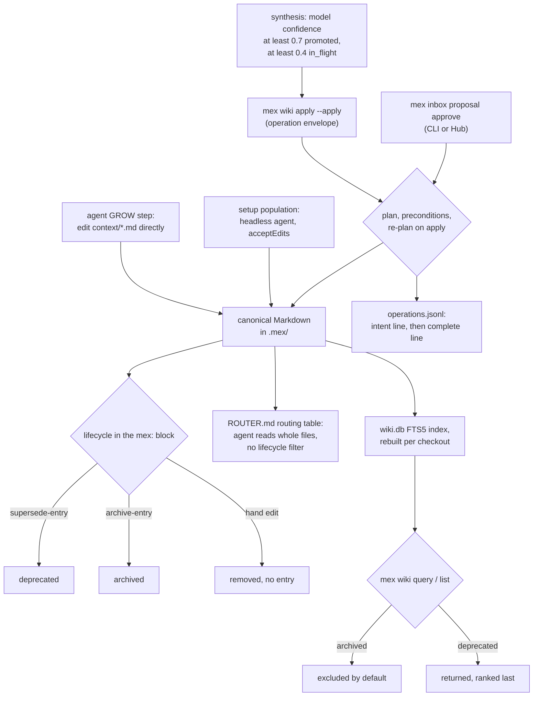

## 1. Executive Summary

MEX is a repository-resident project memory for coding agents and the engineers
beside them. Canonical knowledge is Markdown under `.mex/` — architecture,
decisions, conventions, patterns, specs — shared through ordinary Git, with
per-checkout SQLite indexes for full-text search over the Wiki and for a
Tree-sitter code graph. A `mex-agent` CLI, instruction anchors for six agent
hosts, two skills and a loopback Hub web UI sit on top.

What is notable is how claims stay tied to code. A Wiki entity can ground to a
code-graph node by id, identity fingerprint and body hash, and drift checks flag
the claim when that code moves or changes. Structured writes go through an
operation layer with preconditions, re-planning and a crash-safe, body-free
ledger.

What is weak is that the default write path goes around all of it. The shipped
agent instructions tell the agent to edit `context/` files directly after each
task, and the router tells it to read those files whole, so neither the ledger
nor the lifecycle filter touches the ordinary loop.

The engineering density is high: 33,811 lines for the Wiki layer and 35,771 for
the Team workflows (Members, Inbox, Relays, Activity), with comments that state
the invariant each quirk protects. The code graph is a code index, not memory,
and this report covers it only where Wiki groundings depend on it. The
committed benchmark (`evaluate/RESULTS.md`) measures graph retrieval, not
memory.

Two marks. `audit_log`, for the operation ledger, and `negative_eval`, for a
committed case asserting an archived entity stays out of a default listing with
both controls. Section 9 names the five withheld, including a stricter
lifecycle predicate declared and tested with no caller.

## 2. Mental Model

A memory is a Wiki entity: a typed block of Markdown bound to a heading, with a
`mex:` metadata block holding its id, lifecycle, revision, relations, sources,
provenance and groundings (`src/wiki/model/entity.ts:164-180`). Beside it sit
three other stores that hold claims: free-text notes in
`.mex/events/decisions.jsonl`, Inbox proposals, and Relay handoffs.

**A thing becomes a belief by being written into a scaffold file.** Most
arrive by the agent editing Markdown under the GROW checklist
(`templates/ROUTER.md:64-69`), or by the Hub setup's population step, which
launches a headless Claude session with `--permission-mode acceptEdits` to write
the scaffold (`src/setup/headless-population.ts:110`;
`src/agent-command.ts:38-50`). A smaller share arrives through `mex wiki apply`,
Inbox approval or model synthesis, all of which run the operation layer.

**Lifecycle is governance, and it is one enum** — `in_flight`, `promoted`,
`deprecated`, `archived` (`entity.ts:84-97`). The comment is explicit that
grounding health is a separate, derived, per-checkout axis, so one branch's code
drift cannot rewrite what the team agreed. `in_flight` is not a candidate that
waits: it is included in default retrieval, and synthesis assigns it to any
unit whose self-reported confidence is at least 0.4 and below 0.7
(`src/wiki/synthesis/candidates.ts:175-179`).

**A belief stops being one in three ways, and only one of them hides it.**
`supersede-entry` sets the old entity to `deprecated` and adds a `supersedes`
relation on the replacement (`src/wiki/operations/operations.ts:825-845`).
`archive-entry` sets `status: archived` and leaves body, relations and sources
in place (`:813-821`). A hand edit deletes it; no operation deletes. Query
excludes `archived` by default and returns `deprecated`, ranked after the other
states (`src/wiki/query/rank.ts:44-56`, `:91-96`).

**Notes are history, not knowledge.** `mex log` appends a line with a kind
(`decision`, `note`, `risk`, `todo`) and an optional free-text `status`
(`src/events.ts:92-108`). The instructions call them *"historical notes, not
accepted current knowledge"* (`templates/AGENTS.md:60`), and nothing reads the
status.

## 3. Architecture

`mex-agent` is a Node 22.5+ TypeScript CLI (`package.json`, bin `mex`). The
canonical store is files: entity-bearing Markdown under `.mex/context/`,
`.mex/patterns/`, `.mex/specs/` and `.mex/topics/`, JSONL under
`.mex/events/`, one Markdown file per Activity event under
`.mex/events/activity/`, and Team artefacts (members, workstreams, inbox,
relays). Everything under `.mex/local/` stays in the checkout: drafts, the
current-member selection, jobs and a receipt-signing key.

Two SQLite databases are derived. `wiki.db` indexes entities, relations,
topics, sources, groundings and diagnostics, with an FTS5 table over title,
summary, body, aliases and metadata (`src/wiki/index/schema.ts:98-126`,
`:248`). `graph.db` is the code graph built from bundled Tree-sitter grammars
for TypeScript, JavaScript, Python and Rust. Both are rebuilt by explicit
commands (`mex wiki rebuild-index`, `mex graph rebuild`) and reads never
migrate or rebuild them silently.

The Hub is a local web UI served on `127.0.0.1` from the same process, with a
server-side session and CSRF token (`src/hub/`). An MCP server exists as a
workspace (`packages/mex-mcp/`, five tools: check, heartbeat, log, read-file,
timeline) and is not published. CLI and Hub telemetry is on by default and can
be disabled (`TELEMETRY.md`).

### Deployment and ergonomics

Nothing runs but the CLI. No API key is needed to store or retrieve; a model
is needed only for setup population, synthesis and `mex sync`, and those shell
out to an installed Claude Code, Codex or OpenCode CLI. The store is Markdown
and JSONL a person reads and edits in any editor, and sharing is `git push`.
The cost is operational discipline: indexes go stale after every pull or branch
switch until someone rebuilds them, and MEX never pushes or pulls itself.

## 4. Essential Implementation Paths

**Direct write (default).** The instruction files installed by setup tell the
agent to update `ROUTER.md` and the relevant `context/` file after meaningful
work and bump `last_updated` (`templates/AGENTS.md:50-55`;
`templates/ROUTER.md:64-69`). No MEX code runs on this path. `mex check` later
validates the result.

**Operation write.** `mex wiki apply <file> --apply` → `runApply`
(`src/wiki/cli/commands.ts:381-430`), which the comment calls *"the agent's write
door"* → `wikiApplyOperation` (`src/wiki/service/write.ts:137-166`) →
`applyOperation` in `src/wiki/operations/apply.ts`, *"the only module under
`src/wiki/` that writes Markdown"*. Apply re-plans from the current tree, checks
each entity's content-hash precondition, optionally binds to a preview hash,
writes the gaining file before the losing one, and appends the intent and
completion ledger lines (`apply.ts:538-551`, `:586-595`). Without `--apply` it
prints the diff and writes nothing.

**Operation vocabulary.** Eleven types: create, update, set-property, add and
remove relation, add and remove source, set-grounding, supersede, move and
archive (`src/wiki/model/operation.ts:42-54`). No delete.

**Synthesis.** `mex wiki build` and `mex wiki prepare` emit clustered context
and prompts; `mex wiki propose <response>` validates the model's units, drops
any below confidence 0.4, and turns the rest into operation plans with
lifecycle chosen by `statusForConfidence` (`candidates.ts:175-179`). The global
pass can merge a group into one canonical unit and deprecate the rest
(`src/wiki/synthesis/global-pass.ts:529-566`). Plans are written only by
`mex wiki apply --apply`.

**Inbox.** `mex inbox draft save` keeps a local draft; `mex inbox publish`
writes a canonical proposal in state `pending`; `mex inbox proposal approve`,
`reject`, `withdraw`, `mark-stale` and `repair` move it
(`src/team/inbox/cli/builder.ts:63-82`). Approval re-checks target revisions,
previews the Wiki operation, stamps `reviewer` and `reviewedAt` from the
resolved actor, applies the Wiki write and records an Activity event
(`src/team/workflow/repository-team-workflow-port.ts:2506-2560`). The same
actions are Hub services (`src/hub/services.ts:2597-2600`).

**Search.** `mex wiki query` → `wikiSearch` → `WikiQuerySession.search`
(`src/wiki/query/session.ts:187-230`): exact id, then FTS5 over title, summary,
and body with aliases and metadata, each hit passed through `isVisible`, then
the total order in `compareHits` (`rank.ts:111-125`). The Hub reads through
`contract-session.ts`, whose filter adds `status <> 'archived'` unless asked
(`src/wiki/query/contract-session.ts:1436-1441`).

**Notes.** `mex log` → `appendEvent` (`src/events.ts:92-108`), one
`appendFileSync`. `mex timeline` → `runTimeline` (`:111-160`) reads the last
8 MiB or 10,000 lines, filters by kind, date, literal substring and exact file,
and returns at most 200 entries within 64 KiB (`:74-81`).

**Drift.** `mex check` runs the checkers under `src/drift/checkers/` and scores
from 100, ten per error and three per warning (`src/drift/scoring.ts:3-24`).
`mex sync` hands the brief to one interactive agent session
(`src/sync/index.ts:32-54`).

## 5. Memory Data Model

| Field | Where | Notes |
| --- | --- | --- |
| `id` | `mex:` block | `mx_` plus a ULID; never a free string |
| `type` | `mex:` block | fourteen Wiki types plus seven Team-owned readable types; unregistered types are a diagnostic |
| `status` | `mex:` block | `in_flight`, `promoted`, `deprecated`, `archived` |
| `revision` | `mex:` block | starts at 1, incremented only by accepted operations |
| `relations` | `mex:` block | typed edges, including `supersedes`; cycles refused |
| `sources` | `mex:` block | evidence, kept apart from provenance |
| `grounds_to` | `mex:` block or frontmatter | node id, MinHash fingerprint, body hash, file, commit, `verifiedAt` |
| `provenance` | `mex:` block | `createdBy` and `lastModifiedBy` with kind human, agent or system; times; agent session id |

The interface is `WikiEntity` (`entity.ts:164-180`); `WikiGrounding` is at
`src/wiki/model/grounding.ts:50-80`. Location offsets and two content hashes
are computed at index time and are the operation preconditions.

**Time.** Provenance carries `createdAt` and `lastModifiedAt`, a grounding
carries `verifiedAt`, and each operation and note carries a `timestamp`. None
is a validity interval. The shipped decisions template adds a second status
in prose — `**Date:**` and `**Status:** Active | Superseded by` in each entry
(`templates/context/decisions.md:48-49`) — which no reader parses.

**Scope is the repository.** A scaffold belongs to one checkout and one branch.
Members are *"attribution, not a sign-in or permission system"*
(`README.md:135`), resolved from a local selection or the Git identity
(`src/team/identity/actor-resolver.ts:46-60`). No entity carries a scope key.

**The operation ledger** is `AuditEntry` (`src/wiki/operations/audit.ts:80-96`):
format version, phase, op id, type, entity ids, minted ids, actor, timestamp,
reason, files, payload hash, revisions and session id.

## 6. Retrieval Mechanics

The retrieval an agent performs by default is file reading. The anchor points
to `.mex/AGENTS.md`, which points to `ROUTER.md`, whose frontmatter edges name
context files with a condition each; the agent opens whole files. Every entity
in a file comes with it, whatever its lifecycle, and the only sign of an
archived entity is the `status: archived` line in its HTML comment.

The indexed paths are opt-in. Search ranks by which field matched, then
lifecycle (`promoted`, `in_flight`, `deprecated`), then worst grounding health,
then title and id, with nothing falling back to row order (`rank.ts:44-56`,
`:111-125`). Because field rank comes first, a deprecated entity whose title
matches outranks a promoted entity matched in its body.

Grounding health *"lowers rank and never hides"* (`rank.ts:58-64`), on the
stated argument that a hidden stale entity sends the user off to write a
duplicate. That argument is applied to lifecycle too: only `archived` is
filtered.

`wiki related` walks relations and backlinks bounded by depth, count and an
estimated token budget (`session.ts:241-260`). `wiki for-code` and `mex impact`
return entities grounded to given code nodes, including ones a rename
reconciled, with the same archived default (`src/wiki/query/for-code.ts:142`).

Timeline matching is a lowercase literal substring and exact recorded paths.
The README warns that *"a filtered empty result does not prove the full
history has no match"* (`README.md:345`), and JSON output carries `truncated`
and `sourceTruncated`.

## 7. Write Mechanics

Writes are explicit and synchronous. On the default path the agent edits a file
with its own tools and nothing else happens. On the operation path a plan is
computed, previewed, and written only with `--apply`; the precondition is the
entity's own content hash, so a concurrent edit to an unrelated entity in the
same file is carried through and one to the subject blocks as
`CONTENT_HASH_CONFLICT` (`apply.ts:10-26`).

**Model output is gated on structure, not on truth.** Synthesis validates ids
against the context the model was given and re-derives groundings from the
live graph before writing (`candidates.ts:13-34`). The confidence thresholds are
constants and deliberately not configurable. What they decide is only
`promoted` versus `in_flight`, and both are retrieved by default.

**Correction is supersession or archival.** Both keep the old text.
Supersession needs an existing or inline replacement and refuses a cycle.
Deletion exists only as a hand edit, which no ledger records.

**Agent-generated content is labelled, not filtered.** Operation provenance
records `kind: agent` when the envelope says so; the repository's own ledger
shows two operations by actor `codex`. Nothing screens content.

### Operational cost

- Write: synchronous, no model call on either path; an operation fsyncs the
  Markdown and two ledger lines.
- Background: none. `mex check` and `mex sync` run on request, or after each
  commit when `mex watch` installed its hook.
- Read: the router loads whole files chosen by the agent, so injection is
  bounded only by the scaffold's size; the CLI reads are bounded by count,
  bytes and estimated tokens and report truncation.
- Synthesis and population re-read clusters of the repository through a model;
  their cost scales with the code, not the day's activity.

## 8. Agent Integration

Setup writes an instruction anchor for each selected host (Claude Code, Codex,
Cursor, Windsurf, GitHub Copilot, OpenCode) and, for Claude Code and Codex, the
`mex-inbox` and `mex-relay` skills under `.claude/skills/` or `.agents/skills/`.
There is no session hook; loading memory depends on the host following the
anchor.

The agent's interface is the whole CLI. The skills require a semantic preview
and *"fresh explicit confirmation"* before publish, approve or reject
(`skills/mex-inbox/SKILL.md:36-43`). That is a request to the model.

One place constrains the agent in code. Headless Claude during setup population
is pre-approved for read-only graph commands and the note log and nothing else
of MEX's (`src/agent-command.ts:15-31`). Headless Codex in the same step runs
`exec --sandbox workspace-write`, which does not ask (`:51-56`).

Adapting to another agent means copying an instruction anchor; the CLI emits
JSON envelopes and `mex capabilities --json` describes itself.

## 9. Reliability, Safety, and Trust

**The ledger is careful and partial.** The intent line carries the ids a create
will mint, so a replay after a crash reuses them instead of duplicating
knowledge (`audit.ts:14-27`). The writer re-reads prior bytes before and after
appending and refuses a swapped file or symlink. It excludes bodies, prompts and
transcripts by construction (`:30-36`). Its own header scopes it: *"Manual
Markdown edits stay valid with no entry here"* (`:38`). The repository's own
ledger holds 134 lines: 130 from migration, all stamped with the fixed default
`2026-01-01T00:00:00.000Z` (`src/wiki/migration/migrate.ts:437`), and four from
two agent operations.

**The ledger has a ceiling.** `appendAudit` throws once the file would exceed
4,096 non-empty lines or 2 MiB (`audit.ts:69-71`, `:598-614`). The
diagnostic a reader then sees says a line *"is not valid JSON"*. What apply
reports at the cap was not traced.

**Integrity is not identity.** The README says so: signed previews and the
plan/apply boundary *"protect mutation integrity—not authentication, OS
isolation, repository permissions, or proof that a human issued the command"*.
The operation actor is taken from the envelope.

**Git is the replication layer.** Two checkouts can edit the same entity and
meet as a Git conflict; Relays state there is no cross-clone lock.

**Uncertainty is partly representable.** Grounding health says the code under a
claim changed. Nothing says a claim is disputed.

Capability marks:

- `audit_log` — awarded on the operation ledger; the default direct-edit path
  is outside it.
- `negative_eval` — awarded; evidence in section 10.
- `tombstone` — a rejected Inbox proposal keeps `reviewRationale` on the
  proposal record; nothing checks a later draft or synthesis unit against
  rejected content.
- `trust_state` — the lifecycle has no state that withholds a claim from being
  used except `archived`, which is retirement. `ACTIVE_LIFECYCLE_STATES`
  excludes `deprecated` and is documented as *"included in default active
  retrieval"* (`entity.ts:96-97`), but `isActiveEntity` has no caller outside
  its test; the live predicate `isVisible` returns `deprecated`. The
  `includeInFlight: false` option exists and no production caller passes it.
- `bitemporal` — timestamps are record times; no validity interval exists.
- `scope_enforced` — the partition is the repository. Relay recipients filter
  only an opt-in `--perspective mine` view (`repository-team-workflow-port.ts:1207-1216`).
- `human_review` — a proposal waits in `pending`, and the agent can clear it:
  `mex inbox proposal approve` is on the CLI it runs, and the actor resolves
  from the same checkout identity as a person's. The Wiki is also writable
  directly, so Inbox is not the only door.

## 10. Tests, Evals, and Benchmarks

Nothing was built or run for this report; everything below is from reading the
tests at the pin. CI runs `npm run test`, which is `vitest run` over the root
suite (`.github/workflows/ci.yml:48`; `vitest.config.ts`).

**The negative case.** `query.test.ts` indexes one file holding a promoted,
an in_flight, a deprecated and an archived entity (`:94-99`). *"excludes
archived entities by default"* asserts the listing contains the promoted title,
omits `Rotate passwords`, and that the archived id is still in the index
(`:173-180`); the next case asserts it returns with `includeArchived`. The
code-driven twin is `for-code.test.ts:161-164`. Neither suite has a skip path.

**Ranking.** The same file asserts promoted before in_flight before deprecated
and that a stale entity ranks down without disappearing. It asserts the
deprecated one is returned, which is the design.

**The ledger.** `operations.test.ts:240` applies each operation type, checks
unrelated bytes are untouched, the audit line is appended and a replay is a
no-op. `integrity.test.ts` asserts the log survives deleting `wiki.db`
(`:230`), a malformed line degrades to a diagnostic (`:274`), a body never
reaches the log (`:387`), and a count past the cap is reported (`:332-335`).

**An unwired predicate, tested.** `src/wiki/model/__tests__/entity.test.ts:74-78`
pins `isActiveEntity` to exclude `deprecated`. The function has no production
caller.

**Evaluation.** `evaluate/RESULTS.md` reports a 12-task, one-repetition pilot
of `mex graph scope` against file search, dated 19 and 20 August 2026: 7 of 12
blind-correct against 6 of 12, with 54.5% fewer new tokens. It measures code
retrieval. Per-session artefacts go to `.mex/eval-results/`, which `.gitignore`
excludes, so the table does not recompute from the tree.
`EVAL_SYSTEM_PLAN.md` lists LongMemEval, MemoryAgentBench, LoCoMo and others as
deferred memory milestones. No paper of the project's own is cited in the tree.

**Not covered.** No test asserts what an agent following the router reads.
Nothing asserts that a superseded entity stays out of anything.

## 11. For Your Own Build

### Steal

- **Ground each claim to a code symbol by identity and by body hash.** The
  fingerprint finds the symbol after a move; the hash says it changed. Keep
  both in the canonical file so drift survives an index rebuild.
- **Keep governance and health on separate axes.** A per-checkout "stale" must
  never rewrite what the team marked promoted.
- **Journal an operation with an intent line that carries the ids it will
  mint.** Replay after a crash then finishes the create instead of duplicating
  it.
- **Build ledger records field by field and assert a body cannot enter.**
  Privacy by construction beats a redaction pass.
- **Precondition on the entity's own hash and re-plan at apply time,** so an
  edit to another entity in the same file does not block and an edit to the
  subject does.

### Avoid

- **A governed gateway beside an ungoverned default.** If the instructions tell
  the agent to edit files directly, the ledger, preconditions and review cover
  the rare path.
- **Filtering on the query path while the agent reads files.** Put the
  lifecycle predicate where the context is assembled, or render retired
  entities out of the files the router names.
- **A stricter predicate nobody calls.** `isActiveEntity` states the right
  default and is only tested.
- **Letting model confidence choose the lifecycle.** A self-reported 0.7 buys
  `promoted` with no reviewer in the loop beyond whoever runs apply.
- **A hard ceiling on an append-only log without rotation.**

### Fit

This suits a team already disciplined about Git review that wants its
architecture, decisions and handoffs in the repository, tied to code, and is
willing to run rebuild commands after pulls. Its guarantees are about integrity
and drift, not about who wrote a claim or whether it is still believed. A reader
who needs memory to be correctable with an audit trail on every change, or
filtered by what the team has retired, would have to route all agent writes
through `mex wiki apply` and change the router's reads. It is the wrong shape for a
personal recall store of chat facts: nothing extracts from conversation, and
nothing ranks by relevance beyond FTS5 over titles and bodies.

## 12. Open Questions

- What does `mex wiki apply` return once `operations.jsonl` passes 4,096 lines,
  and is there a documented way to roll the ledger?
- How often do real teams route writes through operations rather than direct
  edits? The repository's own ledger suggests rarely.
- Does the Hub's Context view or Search show deprecated entities with any
  marking beyond order?
- Is the fixed migration timestamp intended for production runs, given the
  comment beside it says a reader should see the run's own time?
- Is `isActiveEntity` intended to replace `isVisible` on some path?

## Appendix: File Index

- **Model:** `src/wiki/model/entity.ts`, `src/wiki/model/operation.ts`,
  `src/wiki/model/grounding.ts`, `src/wiki/model/diagnostic.ts`.
- **Write path:** `src/wiki/cli/commands.ts`, `src/wiki/service/write.ts`,
  `src/wiki/operations/apply.ts`, `src/wiki/operations/operations.ts`,
  `src/wiki/operations/audit.ts`, `src/wiki/migration/migrate.ts`.
- **Synthesis:** `src/wiki/synthesis/candidates.ts`,
  `src/wiki/synthesis/global-pass.ts`, `src/wiki/synthesis/prompts.ts`.
- **Retrieval:** `src/wiki/index/schema.ts`, `src/wiki/query/session.ts`,
  `src/wiki/query/rank.ts`, `src/wiki/query/for-code.ts`,
  `src/wiki/query/contract-session.ts`, `src/wiki/service/read.ts`.
- **Notes:** `src/events.ts`, `src/cli.ts:893-960`.
- **Team:** `src/team/inbox/cli/builder.ts`,
  `src/team/workflow/repository-team-workflow-port.ts`,
  `src/team/identity/actor-resolver.ts`, `src/team/activity/repository.ts`.
- **Integration:** `templates/AGENTS.md`, `templates/ROUTER.md`,
  `skills/mex-inbox/SKILL.md`, `src/agent-command.ts`, `src/sync/index.ts`,
  `src/watch.ts`, `packages/mex-mcp/src/tools/`.
- **Tests:** `src/wiki/query/__tests__/query.test.ts`,
  `src/wiki/query/__tests__/for-code.test.ts`,
  `src/wiki/operations/__tests__/operations.test.ts`,
  `src/wiki/operations/__tests__/integrity.test.ts`,
  `src/wiki/model/__tests__/entity.test.ts`; `evaluate/RESULTS.md`.

### Recorded searches

Checked against the checkout at the pinned revision.

- `grep -rn -E 'isActiveEntity|ACTIVE_LIFECYCLE_STATES' src packages test --include='*.ts' --include='*.tsx'` — the definition in `entity.ts` and `entity.test.ts` only.
- `grep -rn -E 'includeInFlight|includeArchived|statuses:' src packages --include='*.ts' --include='*.tsx'`, excluding tests — `includeInFlight` appears only in `rank.ts`.
- `grep -rn -E 'appendAudit' src --include='*.ts'`, excluding tests — three calls, all in `apply.ts`.
- `grep -rn -iE 'rotat|compact' src/wiki/operations/*.ts` — no ledger rotation.
- `grep -rn -E '"rejected"' src/team --include='*.ts'`, excluding tests — codecs, state lists and the reject transition; no read that compares new content with a rejected proposal.
- `grep -rn -il 'tombstone' src packages templates skills` — no match.
- `grep -rn -E '\b(valid_?[Ff]rom|valid_?[Tt]o|valid_?[Aa]t|valid_?[Uu]ntil|invalid_?[Aa]t|effective_?[Ff]rom)\b' src packages --include='*.ts'` — no match.
- `grep -rn -iE 'self.?approv|selfApprov|isTTY|isatty' src/team` — no actor or terminal check on approval.
- `grep -rn -E 'SessionStart|PreCompact|UserPromptSubmit' src --include='*.ts'` — no match; `src/watch.ts` installs only a Git post-commit hook.
- `grep -rliE 'arxiv|bibtex|@article|@misc|doi\.org' . --exclude-dir=.git --exclude-dir=node_modules` — `EVAL_SYSTEM_PLAN.md` only, citing third-party benchmarks; no `CITATION.cff`.
- `find evaluate -type f | grep -iE 'result|run|session|transcript'` — `RESULTS.md` and runner code; no committed run artefacts.

## History

**2026-09-26** — [`5b6e02c9efa047f62cda247f7b01113b0ec7aab5`](https://github.com/mex-memory/mex/commit/5b6e02c9efa047f62cda247f7b01113b0ec7aab5) — first reading, at the head of `main`, a commit dated 25 September 2026. Two marks, `audit_log` and `negative_eval`. Screened before reading: one auto-run surface (`.claude-plugin/marketplace.json`, a skills marketplace entry that runs nothing on its own), one build-time execution point (npm `prepare`), five dependency files inside the cooldown — every file in a depth-1 clone dates to the tip — and five unpinned surfaces; `AGENTS.md` and `CLAUDE.md` recorded as data. No `.gitmodules`; `.gitattributes` carries no filter. Read with `grep` and `sed`; nothing installed, built or run. The code graph is covered only where Wiki groundings depend on it.
