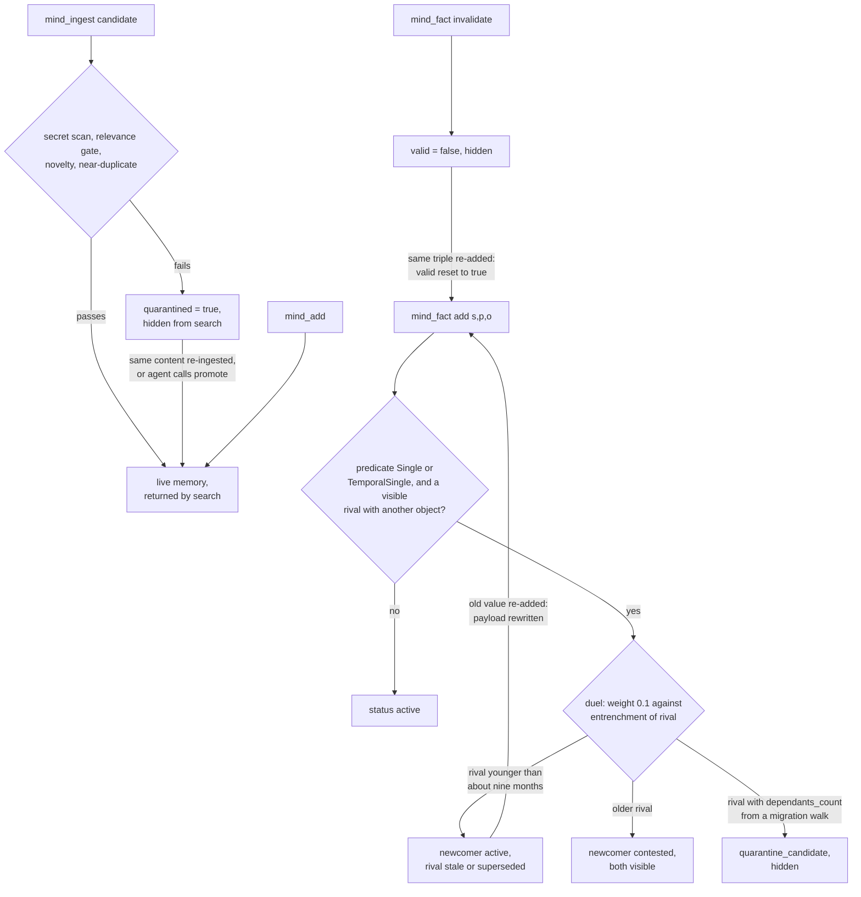

## 1. Executive Summary

MGI-Mind is a single Rust binary that gives an assistant long-term memory over
MCP, backed by a local Qdrant it downloads and runs on loopback. It stores three
things: text memories with hybrid dense and sparse retrieval and a
cross-encoder rerank; fact triples governed by a *duel rule* that resolves a
contradiction on a single-valued predicate; and error-to-fix procedures and
skills. A relevance gate sends low-signal ingest candidates to a quarantine
instead of dropping them.

What is notable is the discipline around the fact state. One function decides
which statuses are hidden, and the Qdrant filter is derived from it, so the
fact query and the duel cannot disagree about what is current. The fact duel
holds a per-axis lock and a cross-process file lock. The audit log is
append-only and hash-chained, and the committed benchmark files recompute to the
published recall figures exactly.

What is weak is that several advertised mechanisms do less than the README says.
On the default path every contradiction of a fact younger than about nine months
flips it, and re-adding the old value flips it back. The inheritance discount
has no producer, the doubt window ships in shadow mode, and the "bi-temporal"
facts carry one time axis. Library scope is a caller's option on MCP. Under
HTTP tokens it is enforced on memory search, but JSON recall still hands a
scoped token the global facts and procedures that the route gate refuses it.

Three marks: `trust_state` on the fact status, `audit_log` on the memory and
fact-invalidation trail, and `negative_eval` on two CI-run duel tests. Section 9
names the four withheld.

## 2. Mental Model

There are two belief stores with different admission rules, and they do not
share a state machine.

**A memory becomes a belief when it is written, and stays one until deleted or
archived.** `mind_add` writes directly. `mind_ingest` runs a secret scan, a
cheap relevance gate on length, blacklists and decision markers, and a token
novelty check against three neighbours (`src/ingest.rs:293-381`). A candidate
that fails is stored with `quarantined = true` and a reason, and ordinary search
excludes it (`src/storage.rs:351-366`). The same content arriving again promotes
it, so repetition is the admission test. Nothing judges whether a memory is true.

**A fact becomes current by winning a duel.** A triple is keyed on its own
value, a UUIDv5 of subject, predicate and object (`src/knowledge.rs:274-277`).
For a predicate registered `Single` or `TemporalSingle`, a new object that
differs from a visible valid one triggers `resolve_against_existing`. The duel
compares the newcomer's weight with the entrenchment of the strongest rival and
returns flip, contested or quarantine (`src/duel.rs:277-285`). A flip writes
the newcomer `active` and retires the loser: `stale` for `Single`, `superseded`
for `TemporalSingle`, each with `valid_until = now` (`src/duel.rs:400-431`).

**On the default path the duel is close to last-writer-wins.** A new fact's
weight is `0.1 · log2(2) = 0.1` in the default `ChatOnly` mode
(`src/knowledge.rs:449-456`; `src/install_mode.rs:57-61`). Entrenchment sums
three log terms and divides by 50, and the only term a live write produces is
age, because `dependants_count` is written only by `mgimind migrate-v14
dependants --apply` (`src/migrate_v14.rs:404`). A flip needs entrenchment below
0.1 / 1.5, which age alone satisfies for under about nine months. Older facts
land in `contested`, where both values stay visible. `quarantine_candidate`
needs a dependants count nothing on the live path writes. This was computed
from the code, not run.

**How a fact stops being one.** A loser is hidden, not deleted. `invalidate`
sets `valid = false`. Neither is durable against the same value arriving again:
`add_fact_core` rebuilds the whole payload with `valid = "true"` and a fresh
duel status and upserts it over the old row (`src/knowledge.rs:493-518`). So
re-asserting a dampened value duels the current winner, which is itself young,
and flips back. Re-adding an invalidated triple revives it.

## 3. Architecture

`mgimind` is a CLI whose `mcp` subcommand is the MCP server over stdio and whose
`serve-http` subcommand is a loopback HTTP surface over the same dispatcher
(`src/mcp.rs:352`; `src/http_api.rs:1-18`). Embedding runs in process through
ONNX Runtime: `multilingual-e5-base` by default, with a `bge-reranker-base`
cross-encoder on by default (`src/config.rs:108-113`). The models stay warm for
the life of the MCP process.

Qdrant holds four collections: `memories`, with named dense and sparse vectors
and payload indexes on library, author, source, type and `created_at`;
`_kg_facts`, vectorless; `_kg_predicates`, the cardinality registry; and
`_mod_procstats`, derived procedure statistics (`src/storage.rs:26-35`).
Procedures and skills live in `memories` as typed points in the `_procedures`
and `_skills` libraries (`src/storage.rs:2445`, `:3369`).

Files under `$MGIMIND_HOME` hold the rest: `audit.log`, per-agent session logs,
pinned blocks rendered at the top of every briefing, the access journal used by
decay, and the AES-GCM vault, which is terminal-only.

Inside the MCP process a background loop re-tests entrenched facts hourly by
default, yields while a tool call is in flight, and caps each tick at 50 facts
(`src/doubt.rs:62-71`; `src/mcp.rs:73-79`). An optional local extractor, a
Qwen GGUF behind `llama-server`, exists only with `--features extractor`, which
the default build leaves off (`Cargo.toml`).

### Deployment and ergonomics

One binary plus what `doctor --fix` downloads: Qdrant, ONNX Runtime, and two
quantized models the README puts at about 270 and 280 MB, checked against
pinned SHA-256 where pinned. A Docker image bundles everything. No API key is
needed and nothing leaves the machine. Qdrant's store is not readable by hand;
`export --format md` and `backup` are the repair route, and the audit log is
grep-able NDJSON.

## 4. Essential Implementation Paths

**Memory write.** `mind_add` → `storage::add_memory_authored`
(`src/storage.rs:1295-1432`): refuse an unregistered library, refuse a secret,
chunk at 500 characters with overlap, embed, keep the original `created_at` for
an existing id, upsert, and append an `Add` audit row.

**Ingest.** `mind_ingest` → `ingest::run_ingest_authored`
(`src/ingest.rs:232-514`). For a memory candidate: secret scan, `check_cheap`,
then `top_k_neighbor_content` and `novelty_ratio` against `min_novelty`. A
quarantine verdict first tries `promote_from_quarantine` on the same id, then
checks for a live duplicate, then calls `add_quarantined`. A pass with
`nearest_score ≥ 0.95` is skipped as a near-duplicate and parked in quarantine
with reason `near_dup_drop` (`:391-437`). Fact and procedure candidates go to
their own stores, unless a library-scoped HTTP token set `_confine_extraction`.

**Memory search.** `mind_search` → `storage::search_filtered`
(`src/storage.rs:2118-2250`): embed the query, record it in the activity buffer
for the doubt window, build the filter with `memory_query_filter_ex`, run dense
and sparse prefetches fused by RRF, rerank, truncate to the tier, and record
access counts in process.

**Fact write.** `mind_fact add` → `knowledge::add_fact_core`
(`src/knowledge.rs:382-556`): take the per-axis mutex and a cross-process file
lock, look up the cardinality, fetch visible rivals, run the duel, upsert, then
`retire_loser`. The HTTP route returns the verdict (`recorded`, `won`,
`contested`, `quarantined`); the MCP text path returns only an id.

**Fact read.** `mind_fact query` → `query_facts`, `query_fact_history` or
`query_fact_as_of` (`src/mcp.rs:1071-1082`). `query_facts` filters `valid =
true`, excludes the hidden statuses, matches the term as full text on any of
the three fields, and runs the doubt-window drift check
(`src/knowledge.rs:591-643`).

**Unified recall.** `mind_recall_all` fuses facts, a `search` with no library,
and procedures (`src/mcp.rs:391-437`).

**Session start.** `mind_context` → `cli::build_context`
(`src/cli.rs:2775-2942`): an operating rule, pinned blocks, the skill catalogue,
the last session, the 20 newest facts, the library list and a quarantine digest.

**Forget.** `mind_delete` → `delete_memory`, with the content snapshotted into
the audit row (`src/storage.rs:3199-3236`). `consolidate --apply` merges
near-duplicates, then archives or prunes cold memories
(`src/consolidate.rs:276-293`).

## 5. Memory Data Model

| Store | Key | Fields that matter |
| --- | --- | --- |
| memory point | UUIDv5 of `library` and trimmed content | `content`, `hash`, `library`, `type`, `source`, `author`, `created_at`, `updated_at`, `quarantined`, `quarantine_reason`, `archived`, `embed_model`, chunk position |
| fact point | UUIDv5 of subject, predicate, object | `valid` as a string, `status`, `created_at`, `updated_at`, `valid_until`, `author`, `origin_context_id`, later `dependants_count`, `confidence_score`, doubt count |
| predicate | UUIDv5 of the predicate | cardinality: `Single`, `TemporalSingle` or `Multi`, default `Multi` |
| procedure | UUIDv5 of normalised error and fix | trigger error, context, fix, provenance; counts in `_mod_procstats` |

**Scope is a library on memories and nothing on facts.** A memory carries
`library`, and a query may filter on one or several. Facts, procedures, skills,
sessions and pinned blocks are global (`src/http_api.rs:670-681`).

**Time.** A fact's validity interval is `[created_at, valid_until)`
(`src/knowledge.rs:781-785`). Both ends are system clock values written at
assertion and at retirement. There is no field for when a fact became true in
the world, so `as_of` answers what the store held at an instant.

**Content addressing has consequences.** Editing a memory writes a new point
and deletes the old one (`src/storage.rs:1194-1207`). Re-adding identical text
upserts the same point and clears any `quarantined` or `archived` flag, because
the payload is rebuilt.

## 6. Retrieval Mechanics

Memory retrieval is hybrid by default: a dense arm over e5 vectors and a sparse
arm over a hashed term-frequency vector, each limited to `rerank_top_k` (20)
and fused with RRF inside one Qdrant Query API call. The cross-encoder then
re-scores and sorts, and the score is mapped through a sigmoid
(`src/storage.rs:2169-2230`). Tiers truncate the text to about 100 or 500
characters, or return it whole.

**The base filter excludes procedures, quarantined points and archived points,
and nothing else** (`src/storage.rs:351-366`). Skills are typed `skill` in the
same collection (`src/storage.rs:3369`), so a skill body can surface in
`mind_search`.

**Not every reader applies it.** `history` scrolls the collection newest-first
with no filter (`src/storage.rs:3969-4014`), so `mind_history` lists
quarantined candidates, archived memories, procedures and skills as recent
memories. `by_author` excludes quarantined points and not archived ones
(`src/storage.rs:4030-4034`).

Fact retrieval is a full-text payload match, not semantic. The doubt window
measures, per surfaced fact, how far the current query centroid has drifted
from the context the fact was written in, using corpus-mean-centred cosine. In
`enforce` mode with a calibrated threshold it sorts doubted facts last. The
default mode is `shadow`, which only records (`src/config.rs:15-17`;
`src/doubt.rs:211-230`). Nothing is hidden by doubt in either mode.

Retrieval is tool-mediated. `mind_should_search` classifies a query and returns
advice; it cannot force a search.

## 7. Write Mechanics

Every write is an explicit tool or CLI call; the default build calls no model.
Memory writes block on embedding, one batched pass per add, and are searchable
as soon as the upsert returns, since writes use `wait(true)`.

**Deduplication is by identity and by neighbourhood.** Identical text in the
same library lands on the same id. Ingest also skips a candidate whose nearest
neighbour scores at least 0.95, and parks it in quarantine so a later
re-assertion can restore it. `mind_add` and HTTP `/memory/add` skip the
relevance gate entirely, which is why HTTP adds a per-author write quota
(`src/http_api.rs:492-531`).

**Agent-generated content is treated like the user's.** The relevance gate
checks form, not truth. `mind_web` fetches a page and can save it to a library.
The secret scanner refuses a key-like string and points at the vault, on every
write path including quarantine (`src/storage.rs:1309-1319`, `:1456-1462`).

**The inheritance discount has no producer.** `doubt::mark_inherited` says it
is *"Called by `mind_session(action="last")` and the briefing path"*
(`src/doubt.rs:910-915`). Its only callers are its own unit tests, and
`add_fact_core` hard-codes `from_live_session: true` (`src/knowledge.rs:449-456`).
The README's claim that facts carried in from memory count at half weight
describes a function nothing calls.

### Operational cost

- Write: synchronous embed and upsert; facts are vectorless and pay two locks
  and a few payload reads. No LLM on the default path.
- Background: one re-test pass per hour by default, at most 50 facts per tick,
  each a payload read and a `confidence_score` write. No whole-store rewrite
  runs unattended; `consolidate` is an operator command.
- Read: one embed, one fused query, and a cross-encoder pass over 20 candidates,
  which the README puts at one to two seconds on CPU. Injection is whatever the
  agent asks for, at the tier it picks; `mind_context` is bounded by its fixed
  sections.

## 8. Agent Integration

The README counts 29 live MCP tools plus deprecated aliases. The model holds
every verb: add, ingest, search, fact add and invalidate, predicate
registration, quarantine list, promote and expire, restore, delete, export and
import, sessions and pinned blocks. Vault tools return terminal instructions,
never a secret.

No host hook is installed. `AI_INSTRUCTIONS.md` asks the assistant to call
`mind_session(action="last")`, `mind_session(action="start")` and `mind_context`
at the start of every session, search before answering, and close the session
with a summary. Continuity therefore depends on the model following the
instruction file. A separate CLI command ingests a finished Claude Code
transcript through the same gate (`src/session_ingest.rs:1-15`).

The HTTP surface is the multi-agent door. A token can be anonymous, named, or
named and confined to libraries. A named token's identity overrides any
`X-Agent` header for authorship (`src/http_api.rs:468-481`).

## 9. Reliability, Safety, and Trust

**The status filter has one source of truth, and one reader bypasses it.**
`hidden_wire_strings` derives the Qdrant `must_not` set from
`is_default_visible`, and its comment records the drift that leaked `stale` and
then `quarantine_candidate` before the derivation existed
(`src/knowledge.rs:183-207`). `build_context` does not use it. It checks
`status != "stale" && status != "superseded"` by hand (`src/cli.rs:2817`), so a
`quarantine_candidate` fact appears in the session-start briefing as a current
fact.

**Locking around the duel is careful.** A per-(subject, predicate) async mutex
serialises agents in one process, and `lock_facts_cross_process` extends it to
separate `mgimind` processes, closing the two-winner race the comments name
(`src/knowledge.rs:388-400`).

**Library scope leaks through recall.** For a library-scoped HTTP token,
`scope_gate` refuses `/fact/query` and `/procedure/recall` because they span
all libraries (`src/http_api.rs:670-696`). `/memory/recall` stays allowed, and
its JSON form confines the memory search but also calls `query_facts` and
`procedure::recall(cfg, None, …)` with no library predicate
(`src/http_api.rs:421-465`). Procedures sit in the same `memories` collection
under `_procedures`. The text form is refused to scoped tokens for exactly this
reason (`src/http_api.rs:812-824`), and the JSON form inherits the same reads.

**Audit gaps.** The audit log covers memory mutations and fact invalidation.
`FactAdd`, `ProcedureAdd`, `ProcedureOutcome` and `Consolidate` have no
producer, so the README's line that the audit log keeps a duel's loser
describes the store, not the log. `consolidate --apply` deletes merged and cold
memories through `delete_memories`, which writes no row
(`src/consolidate.rs:279-290`; `src/storage.rs:2373-2388`). An agent's
`mind_quarantine_promote` is logged with actor `relevance-gate`
(`src/storage.rs:1568-1572`).

**Privacy.** Delete removes the point and keeps the truncated content in
`audit.log`. Backups can be encrypted with a passphrase.

Capability marks:

- `trust_state` — awarded. The fact `status` enum carries states that withhold a
  value, and the fact query and the duel's rival set filter on them.
- `audit_log` — awarded, scoped to memory mutations and fact invalidation; the
  gaps are above.
- `negative_eval` — awarded; section 10.
- `tombstone` — withheld. The rejected value *is* the key of a fact row, which
  is the shape the mark asks for, but the writer never consults it: re-adding
  a stale or invalidated triple rebuilds its payload and runs a fresh duel. A
  quarantined memory is promoted by re-assertion, the opposite of a tombstone.
- `bitemporal` — withheld. `created_at` and `valid_until` are both record-time
  stamps; no field carries when a fact held in the world.
- `scope_enforced` — withheld. On MCP and for unscoped or anonymous HTTP tokens
  the library is an optional caller filter, and `mind_recall_all`,
  `mind_history` and `mind_context` take none. For scoped tokens, JSON
  `/memory/recall` returns global facts and procedures from the shared
  collection without a predicate.
- `human_review` — withheld. The agent holds `mind_quarantine_promote`,
  `mind_quarantine(action="promote"|"expire")` and `mind_fact_invalidate`, and
  no state waits on a person.

## 10. Tests, Evals, and Benchmarks

Nothing was built or run for this report; everything below is from reading the
tests and the committed result files at the pin.

**The negative cases.** `duel_rule_dampens_loser_on_single_cardinality`
registers a `Single` predicate, adds `old_winner` and then
`new_value_should_flip` over MCP, and asserts the query contains the new value
and not the old (`tests/cli_integration.rs:829-894`).
`temporal_single_supersedes_prior_value` asserts `Munich` present and `Berlin`
absent in the default query, and the reverse in the history query (`:896-969`).
Each has its positive control in the same response. CI's integration job sets
`MGIMIND_IT_QDRANT` and runs this target against a Qdrant service
(`.github/workflows/ci.yml:85-96`).

**A falsifiable scope canary that CI never runs.**
`http_v2_acl_flood_verdict_contract` plants a canary in a library a scoped
token cannot see, proves the admin token finds it, proves the scoped token
finds its own content, and then asserts the canary is absent from search,
by-agent, browse and JSON recall (`tests/http_integration.rs:709-829`). The
suite returns early without three environment variables (`:502-510`). CI runs
`cargo test --all` without them and runs only `--test cli_integration` with
them. The case does not probe facts or procedures, which is where recall leaks.

**Computed and frozen.** `calibration.rs` runs a fixed corpus of conflict
scenarios through the duel formulas with a match-rate floor and a frozen set of
divergences. It exercises the formulas with synthetic entrenchment inputs, not
the counts a live write produces.

**Benchmarks recompute.** I recomputed R@1, R@5 and R@10 from three committed
per-question files and each matched its log: 85.2, 98.2 and 99.4% for MiniLM
without rerank
(`benchmark/results/2026-06-02-cpu-overnight/run01_minilm_rerank_off/raw.json`),
then 91.6, 98.2 and 99.8% with rerank and 85.6, 97.6 and 99.4% without, on the
v0.12.1 regression pods. The metric is session-level retrieval recall on
LongMemEval-S, and `BENCHMARKS.md` says it is not QA accuracy. The headline row
is labelled the zero-config default and names `all-MiniLM-L6-v2`, while
`MindConfig::default` selects `multilingual-e5-base`; the committed e5 runs are
FP16 on a GPU. The STALE belief-revision run is a partial, with the caveats the
README states.

**Not covered.** No test re-asserts a stale or invalidated fact. No test
exercises `build_context` with a `quarantine_candidate` fact. No paper belongs
to the project; the arXiv identifiers in `docs/design/` and
`src/bench_stale.rs` cite other work.

## 11. For Your Own Build

### Steal

- **Derive the read filter from the visibility rule.** One function says which
  statuses are hidden, and the database predicate is generated from it, so a new
  status cannot be written and left visible by a filter nobody updated.
- **Lock the contradiction check across processes, not just tasks.** A
  per-axis mutex plus a file lock around read, decide, write and retire is the
  smallest thing that makes "one current value" true.
- **Quarantine instead of drop, and log why.** A rejected candidate kept with a
  reason is recoverable and countable; a briefing that summarises the pile by
  reason makes the gate auditable.
- **Write the negative test with its positive control in the same response.**
  The duel tests assert the winner present and the loser absent from one query,
  so an empty result fails.
- **Chain audit lines by hash** and ship the verifier with the writer.

### Avoid

- **A contradiction rule whose weights have no live producer.** When the only
  entrenchment a write can earn is age, the duel reduces to recency, and a
  re-assertion of the old value wins the rematch.
- **Rebuilding a keyed row's payload on re-add.** If the key is the value, the
  rejected state on that row is the tombstone; overwrite it and the rejection
  is gone.
- **Hand-written status checks in secondary readers.** The briefing, the
  history list and the by-author scroll each re-derive what to hide, and each
  derives something different.
- **A route gate and a composite route that disagree.** Refusing `/fact/query`
  and serving facts from `/memory/recall` is one decision taken twice.

### Fit

This suits one person running one or a few assistants on one machine who wants
good local retrieval, explicit facts and a store that keeps its own audit
trail, and who can tolerate a Qdrant process and about 550 MB of models. It is
a poor fit where facts must survive contradiction by a newer but wrong
assertion, because the default duel favours whichever value arrived last. It is
also a poor fit as a multi-tenant boundary until recall is confined like
search. The validity model is better read as a well-instrumented research
scaffold than as a belief system to rely on.

## 12. Open Questions

- Does any deployment run `migrate-v14 dependants --apply` routinely, and how
  does the duel behave once dependants counts exist?
- Is `/memory/recall` returning facts and procedures to scoped tokens
  intended, given that `/fact/query` and `/procedure/recall` are refused?
- Will `mark_inherited` be wired, and to which reader?
- What does `enforce` mode do to fact ranking on a real store once
  `calibrate` proposes a threshold?
- Do the HTTP integration tests run anywhere outside a developer machine?

## Appendix: File Index

- **Storage/schema:** `src/storage.rs` (collections, filters, memory and
  quarantine writes, history, procedures, skills), `src/knowledge.rs` (facts,
  `EntryStatus`, cardinality, history and as-of), `src/config.rs`.
- **Write path:** `src/ingest.rs`, `src/relevance.rs`, `src/secrets.rs`,
  `src/duel.rs`, `src/install_mode.rs`, `src/provenance.rs`, `src/procedure.rs`,
  `src/skill.rs`.
- **Retrieval path:** `src/storage.rs:2118-2250`, `src/reranker.rs`,
  `src/embedder.rs`, `src/doubt.rs`, `src/activity.rs`.
- **Context assembly:** `src/cli.rs:2775-2942`, `src/session.rs`.
- **Background workers:** `src/doubt.rs:785-900`, `src/confidence.rs`,
  `src/access.rs`, `src/consolidate.rs`, `src/migrate_v14.rs`.
- **MCP/API/SDK:** `src/mcp.rs`, `src/http_api.rs`, `src/viewer.rs`,
  `clients/python/mgimind/_client.py`.
- **Audit:** `src/audit.rs`.
- **Tests/evals:** `tests/cli_integration.rs`, `tests/http_integration.rs`,
  `src/calibration.rs`, `.github/workflows/ci.yml`, `BENCHMARKS.md`,
  `benchmark/results/`.

### Recorded searches

Checked against the checkout at the pinned revision.

- `grep -rn 'AuditOp::' src | grep -v '^src/audit.rs'` — producers in `storage.rs`, `ingest.rs`, `knowledge.rs` (invalidate only), `doubt.rs`, `viewer.rs`, `md_reconcile.rs`; none for `FactAdd`, `ProcedureAdd`, `ProcedureOutcome` or `Consolidate`.
- `grep -n 'audit' src/consolidate.rs src/procedure.rs src/skill.rs src/duel.rs` — no audit call; `duel.rs` matches only comments.
- `grep -rn 'mark_inherited\|from_live_session: false' src tests` — `mark_inherited` is called only in `doubt.rs` unit tests; `from_live_session: false` appears only in a `duel.rs` test.
- `grep -rn -E '"(confirmations_count|dependants_count)"' src | grep -v '^src/duel.rs'` — `dependants_count` is written only by `migrate_v14.rs:404`; `confirmations_count` is written only to procedures (`migrate_v14.rs:532`).
- `grep -rn -i -E 'valid_from|valid_at|event_time|occurred_at|observed_at' src` — only `fact_valid_at` and its tests.
- `grep -n 'memory_query_filter' src/storage.rs` — applied by `search_filtered`, `top_k_neighbor_content` and `list_filtered`; `history` (`:3969`) uses none.
- `grep -n 'scoped_route_allowed' -A14 src/http_api.rs` and `sed -n 421,465p src/http_api.rs` — `/memory/recall` allowed; its JSON body calls `query_facts` and `procedure::recall(cfg, None, …)`.
- `grep -n -E 'cargo test --all|cargo test --test cli_integration' .github/workflows/ci.yml` — the integration jobs run only `cli_integration`.
- `grep -rliE 'arxiv|bibtex|@article|@misc|doi\.org' . --exclude-dir=.git` — design notes and `bench_stale.rs` citing other papers; no `CITATION.cff`.
- `grep -rn -i 'SessionStart\|UserPromptSubmit\|PreCompact\|settings.json' src docs AI_INSTRUCTIONS.md README.md` — no match; no host hook is installed.

## History

**2026-10-03** — [`190d1db71331da42bf3ecee3400b67732c9e1de8`](https://github.com/madgodinc/mgi-mind/commit/190d1db71331da42bf3ecee3400b67732c9e1de8) — first reading, at the head of `main`, a commit dated 13 September 2026. Three marks: `trust_state`, `audit_log`, `negative_eval`. Screened before reading: 0 auto-run surfaces, 0 build-time execution points, 0 dependency files inside the cooldown, 1 unpinned surface (`clients/python/pyproject.toml` with no lockfile), and `AGENTS.md` recorded as data; the clone was depth 1, so file dates are the tip's. Nothing was installed, built or run. Benchmark recall was recomputed from the committed per-question files with a standalone script.
