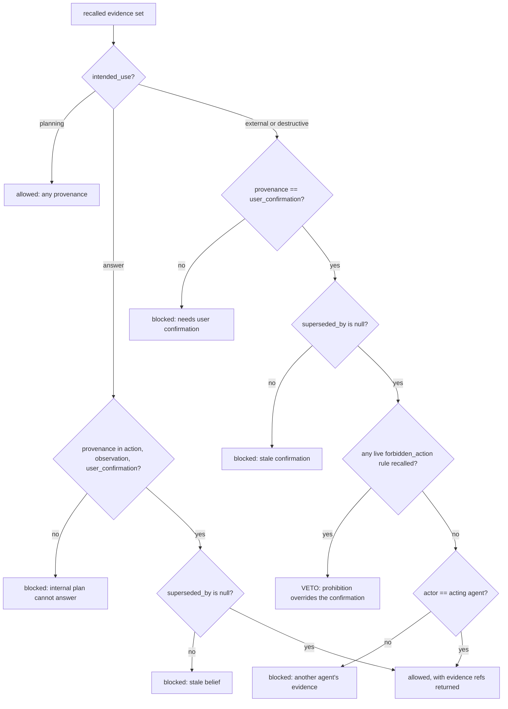

## 1. Executive Summary

Midas is a local memory layer for coding agents: one SQLite file, a Python
library, an MCP server, a TypeScript port, MIT licensed, about 18,700 lines. Its
central bet is stated as a negative — **no LLM at ingest and none at query**.
Nothing is extracted, summarised or rewritten; recall returns the verbatim turn
that was captured, so, in the README's framing, there is no extraction step that
can hallucinate a fact you never said.

That bet buys the properties the project measures: zero marginal cost, zero data
egress, deterministic and reproducible results. It also costs something the
project says out loud — whole-conversation aggregation and summarisation are
listed in the comparison table as "❌ by design", because top-*k* retrieval
cannot cover them.

**The reason this earns a report is `midas/guard.py`.** Every memory carries a
`provenance` from a four-value vocabulary — `planning`, `action`, `observation`,
`user_confirmation` — and every *use* of memory is declared from a four-value
vocabulary — `planning`, `answer`, `external_action`, `destructive_action`. A
static matrix decides which provenances may justify which use. Planning may use
anything. An answer may not rest on an internal plan. An external or destructive
action requires `user_confirmation` and nothing else.

Three refinements make it more than a lookup table:

- **Currency is re-checked at the gate.** A superseded belief cannot justify an
  answer or an action even if it was user-confirmed when current. The comment
  says why: "The guard verifies currency itself rather than trusting recall to
  have filtered the stale record."
- **A prohibition cannot authorize.** A `forbidden_action` rule is stamped as a
  user-confirmed constraint, which would otherwise make it valid authorizing
  evidence. It is explicitly excluded from the supporting set — "a prohibition
  is a gate, not an authorization".
- **A live prohibition vetoes a confirmation in the same evidence set**, so an
  attacker cannot plant an approval beside a standing "never do X" and have the
  approval win.

And the guard is scored the way a guard should be. `eval/memory_safety.py`
reports attack-success rate *and* benign-pass rate together, with the reason
stated in the module docstring: "blocking everything gives ASR 0 *and*
benign_pass 0". The committed suite covers a superseded confirmation, an
unconfirmed observation, a cross-agent action, a planted prohibition, a
confirmation for a *different* action, a provenance-laundering supersession, and
a confirmation in another namespace.

The gap the project also states: the gate trusts the provenance *stamp*. Forging
`user_confirmation` at capture time is out of scope for the guard. What it does
defend is laundering after the fact — `_maybe_supersede` refuses to let a
non-confirmation revise a confirmed belief, so an attacker cannot retire a
prohibition with an observation.

## 2. Mental Model

Midas separates two questions that most memory systems merge into one score.

*Is this memory relevant?* is answered by retrieval — dense plus BM25, fusion,
optional reranking, all local.

*Is this memory allowed to justify what I am about to do?* is answered by the
guard, and the answer does not depend on relevance at all. It depends on where
the memory came from, whether it is still current, who produced it, and what the
agent is about to do with it.

A memory therefore has two independent lifecycles. Its **content** lifecycle is
capture → embed → recall → possibly supersede → possibly forget. Its
**authority** lifecycle is a stamp applied at capture and never upgraded: an
observation does not become a confirmation by being useful, or old, or recalled
often. The only way to gain authority is for the user to confirm something,
which creates a new record.



Every terminal node returns a `MemoryUseDecision` carrying the reason, the
required provenances, the evidence considered and the ids that were blocked — so
a refusal is explainable to the agent and to an auditor, not just a `False`.

## 3. Architecture

There is no service. `midas init` creates a SQLite file and wires up whichever
MCP clients it finds. The library, the MCP server, the CLI and the TypeScript
port all open the same file.

Concurrency across processes is handled without a lock server. The store keeps
an in-memory mirror and probes `PRAGMA data_version`, which changes only when a
*different* connection writes — so each agent process picks up the others'
captures on its next read instead of holding a snapshot from startup. That is a
cheap, correct answer to "several agents share one memory file live", and it is
the kind of detail that is usually solved with a daemon.

Schema migration refuses to open a store written by a newer Midas rather than
guessing, with the error naming the fix (`midas update`). The store can be
opened with `PRAGMA key`, so an encrypted file is a supported configuration.

Nothing runs in the background. There is no worker, no queue, no model to keep
resident unless the operator opts into a local embedder. The operational cost is
a file and a path.

## 4. Essential Implementation Paths

**Capture** — `Memory.remember` (`midas/memory.py`) stamps `provenance`,
`actor`, `source` and `metadata`, embeds, writes through `SQLiteStore.put`
(`midas/sqlite_store.py`), and appends a hash-chained row to `audit_log`.

**Revision** — `_maybe_supersede` (`midas/memory.py:960` onward) decides whether
the new record retires an existing belief, optionally gated by a local NLI
contradiction check.

**Recall** — `Memory.recall` builds a predicate from `kind`, `min_importance`,
`metadata_filter` and `as_of`, runs the hybrid candidate path, then filters
superseded records unless a historical query asked for them.

**Governance** — `decide_memory_use` (`midas/guard.py:114`) takes the recalled
records and the intended use and returns the decision.

**Audit** — `audit_use` (`midas/audit.py`) packages the guard decision, each
evidence record's provenance, its belief history and a completeness score into
one artifact.

**Control plane** — `midas/state.py` (`memory_state`, the live non-superseded
picture) and the diff view (beliefs added, beliefs revised old→new).

## 5. Memory Data Model

One table for content and one for the log:

```
memories(id, content, kind, importance, source, provenance, actor,
         metadata_json, created_at, updated_at, superseded_by, embedding)
audit_log(seq, at, op, record_id, content_sha, prev_hash, hash)
```

`kind` is a seven-value vocabulary — `note`, `chat`, `mission`, `fact`,
`preference`, `constraint`, `commitment` — and the last one carries a comment
worth quoting: "an open loop: work someone said WILL be done (close it via
continuity.close_loop)". Modelling an unfinished intention as a memory kind, and
giving it an explicit closing operation, is a shape this atlas sees rarely.

There is no project table. `midas/projects.py` derives a project view by reading
the explicit `project` tag, else `namespace`, else the capture `origin.cwd` — a
deliberate refusal to add schema for a grouping that three existing signals
already imply.

`superseded_at` lives in `metadata`, not in a column, and is set to the revising
record's `created_at`. Since `created_at` is caller-supplied — importers set it
from the source turn's timestamp — the pair `(created_at, superseded_at)` is a
validity window over event time while `updated_at` and the audit row's `at`
carry record time. That earns `bitemporal`, and the qualification belongs beside
it: the validity axis is one column plus a metadata key, and it collapses onto
record time whenever a caller does not supply an event time.

## 6. Retrieval Mechanics

Dense retrieval over stored embeddings, BM25 (`midas/bm25.py`), optional
fusion, MMR, an ANN index, a ColBERT path and a Matryoshka option — all local,
all optional, all measured.

`recall` accepts `as_of` and resolves each candidate through `_resolve_at`,
walking the supersession chain to the version whose validity window contains the
timestamp, and excluding records created after it. `tests/test_bitemporal.py`
pins the behaviour with three sequential launch dates and asserts that
`as_of=1_500` returns September, `as_of=2_500` returns October, and the current
query returns November.

There is one performance decision worth copying. When no scope filter is active,
the predicate is set to `None` rather than to a trivially-true lambda, so the
hybrid path takes its no-filter fast route — the comment records the measurement
that motivated it: "11.6 s/query on the 246k-turn LongMemEval hybrid run". A
filter that always returns `True` is not free.

The reported retrieval numbers are recall@*k* against gold supporting turns on
full public sets — LongMemEval-`s` 0.92, LoCoMo 0.73, BEAM 0.56 falling to 0.32
at 10M tokens — with a recency-window baseline beside each. Because recall
returns the verbatim source turn, recall@*k* is computable here in a way it is
not for systems that return rewritten facts, which the comparison table says
explicitly.

## 7. Write Mechanics

**Writes do not block on any model.** Ingest is embed-and-store; the README puts
it at 16–116 ms, embed-bound. A memory is retrievable as soon as it is written.

Belief revision is where the write path makes judgements, and it is unusually
careful about which ones it refuses to make. `_maybe_supersede` will not let a
non-`user_confirmation` record retire a `user_confirmation` belief — the comment
names the attack it prevents, that laundering would "bypass the Guard's currency
rule via supersession". With a local NLI model configured it goes further and
requires an actual contradiction rather than similarity, described as "the
principled no-LLM fix" for revision on diverse data where "similar + cue is
often a distinct fact".

`forget_matching` removes records and returns them, and
`audit.forgetting_receipt` turns that list into an erasure certificate: for each
removed record, its id, kind and `sha256(id\x00content)` — "enough to later
prove a specific item was erased, not enough to reconstruct it".

**That receipt is the nearest miss to a tombstone in this batch, and it is not
one.** It is returned to the caller and never persisted by the store; nothing on
the write path consults it or the `content_sha` column in `audit_log` before
accepting a new record. So Midas can prove a value was erased and cannot prevent
the same value being captured again five minutes later. Every ingredient is
present — a content hash, a durable log, a write path that could check — and
the check is absent.

## 8. Agent Integration

An MCP server with tools for capture, recall, `memory_state`, `memory_diff`,
`resume`, `open_loops`, `remember_commitment`, forbidden-action rules and the
guard check. A Python library, a TypeScript MCP port on npm, agent hooks, a
LangGraph store adapter, and a CLI with an inspector.

Every MCP write stamps a structured source (`mcp:{client}:{session}`) and an
origin resolved once at startup — git commit, branch and cwd — so a belief
traces back to the code state it was captured in.

`MIDAS_MCP_NAMESPACE=auto` derives the scope from the git repository name (else
the cwd basename), which gives per-project partitioning of one shared store
without the user configuring anything.

## 9. Reliability, Safety, and Trust

**Audit log — awarded, and it is the strong form.** `audit_log` is append-only
and hash-chained: each row carries `prev_hash` and its own `hash`, `seq` and
`prev` are read and written under the same connection for multi-process safety,
and `verify_audit_log` walks the chain. Rows carry a `content_sha`, never
content, so the log can prove a mutation happened without retaining what was
mutated — which is what makes it compatible with the erasure story rather than
in tension with it. `midas audit` and the inspector both expose verification.

**Scope — awarded, with a caveat that matters.** `metadata_filter` is an
equality predicate applied inside the recall predicate, and every read tool on
the MCP server passes `_ns_filter(namespace)` unconditionally. The strongest
evidence that it is treated as a boundary rather than a tag is at
`midas/memory.py:1083`: neighbour expansion re-applies the filter because
otherwise "a same-thread record from another namespace would leak past the
filter" — someone thought about the second-order path. The caveat is that the
default namespace is the empty string, which means unscoped; the boundary exists
and is enforced when configured, and the shipped default does not configure it.

**Negative eval — awarded.** `eval/memory_safety.py` commits ten attack cases
whose premise is that particular material must not reach or justify a use, with
four benign controls. One is a boundary case in the atlas's sense — a real
`user_confirmation` in namespace `alpha`, recalled under a `beta` filter, which
must not authorize. Others are content cases about a specific record: a
superseded approval, a confirmation for a different action, a prohibition
planted beside a confirmation. `eval/forbidden_eval.py` scores the
forbidden-action path separately.

**Trust state — withheld, and the reason is interesting.** `provenance` is a
discrete four-value field consulted on the decision path, which looks like a
trust state and is not one. It records *where a memory came from*, not whether
anyone believes it: there is no `rejected`, and no state a memory can move into
after review. What Midas has instead is arguably better suited to its purpose —
an authority vocabulary that answers "may this justify an action" — and it is
worth separating the two ideas rather than conflating them because the field
happens to be an enum.

**Human review — withheld.** `user_confirmation` records that a person
confirmed something at capture time. There is no surface where a person
inspects, approves or adjudicates stored memory after the fact.

## 10. Tests, Evals, and Benchmarks

**No paper.** No arXiv reference, DOI, `CITATION.cff` or BibTeX block in the
tree. `BENCHMARKS.md` is the evidence artifact instead.

58 test files, including dedicated suites for the guard
(`test_guard.py`, `test_guard_hardening.py`), the safety eval
(`test_memory_safety.py`), the audit chain (`test_audit_chain.py`), bitemporal
recall, metadata filtering, forget-matching, encrypted stores and the MCP
server. **I did not run them** — the screen flagged an MCP server manifest
declaring a start command and `tests/conftest.py` executing on collection, so
the tree was read and never installed.

The benchmark discipline is the second reason to read this project. Every
headline number names a reproduce command, and `BENCHMARKS.md` publishes the
experiments that failed: hybrid retrieval, reranking, thread diversification,
dual-granularity indexing and naive distillation are each documented as not
helping or actively hurting, with the numbers. One entry records that a change
lifted summarization 0.18 → 0.23 while hurting precise single-turn belief
recall; another that pinning assistant-voiced advice "hurt across the board".
A memory project that keeps a public record of its own negative results is rare
enough in this corpus to be worth naming as the practice, separately from any
particular number.

The numbers themselves are self-reported and the cross-system comparisons are
structural claims about a design class rather than head-to-head reruns, which
the document states.

## 11. For Your Own Build

### Steal

- **Separate relevance from authority.** Two vocabularies — where a memory came
  from, and what it is about to be used for — and a static matrix between them.
  It is perhaps eighty lines and it closes the failure where an agent acts on
  something it merely read.
- **Re-check currency at the gate, not only in recall.** Defence in depth costs
  one `if` and survives a retrieval refactor that stops filtering superseded
  rows.
- **Distinguish a prohibition from an authorization.** A "never do X" rule is
  user-confirmed, so a naive gate treats it as evidence *for* acting. Excluding
  it from the supporting set, and letting it veto, is the difference between a
  rule and a decoration.
- **Score a guard with two numbers.** Attack-success rate alone rewards blocking
  everything. Publishing benign-pass beside it makes the score honest, and the
  module says so in its docstring.
- **Refuse to let a weaker record retire a stronger one.** Supersession
  integrity — only a confirmation may revise a confirmation — closes the
  laundering path that would otherwise defeat the currency rule.
- **Publish the experiments that failed.** Five documented non-improvements in
  `BENCHMARKS.md` are worth more to a reader building something similar than any
  of the wins.
- **Set the predicate to `None` when there is no filter.** An always-true lambda
  cost 11.6 seconds a query at scale, and the codebase records the measurement.

### Avoid

- **Do not stop at proving erasure.** The forgetting receipt is a content hash
  of exactly the thing a tombstone would key on, and it is handed to the caller
  instead of being kept and consulted. Prove *and* prevent, or the certificate
  describes a door that is still open.
- **Do not trust the stamp without asking who can set it.** The guard's whole
  authority model rests on `provenance` being honest at capture. The project
  says this is out of scope; anyone deploying it should decide who is allowed to
  write `user_confirmation`.
- **Do not expect a top-*k* memory to summarise a conversation.** Midas states
  the limit and measures it. A system that hides the same limit will fail the
  same query silently.
- **Do not ship an unscoped default and call it multi-tenant.** The namespace
  mechanism is real; empty is the default, and `auto` is one environment
  variable away.

### Fit

This suits an individual or a small team running coding agents locally who want
memory that costs nothing per message, never leaves the machine, and can be
audited afterwards. The no-LLM bet is the whole design: if you need
whole-conversation summaries or extracted structured facts, this is the wrong
tool and the README says so first.

It is also the clearest reference implementation in this atlas for the specific
idea that *memory should not be allowed to authorize an action by itself*. Even
a team that adopts nothing else should read `midas/guard.py` and
`eval/memory_safety.py` together — they are 490 lines, and the second is what
makes the first checkable.

## 12. Open Questions

- **Who may write `user_confirmation`?** Any caller of `remember` can pass it.
  In an MCP deployment the caller is the agent, which makes the guard's strongest
  rule enforceable only by convention on the write side.
- **What happens when the audit chain fails verification?** `verify_audit_log`
  reports; whether anything refuses to serve memory from a store with a broken
  chain was not traced.
- **Does anything consume the erasure receipt?** The inspector generates one on
  a forget; nothing persists it, so the artifact's audience is a person who
  saved the output.
- **How does supersession behave without NLI?** The precision gate is opt-in
  (`MIDAS_MCP_NLI=0` by default), so the shipped default revises on similarity
  plus a cue — which the code itself calls unreliable on diverse data.

## Appendix: File Index

**The guard** — `midas/guard.py` (`_ALLOWED_BY_USE` at `:22`,
`decide_memory_use` `:114`, the prohibition veto `:186`), `midas/policy.py`,
`midas/access.py`

**Safety evaluation** — `eval/memory_safety.py`, `eval/forbidden_eval.py`,
`eval/benches.py`, `tests/test_memory_safety.py`, `tests/test_guard_hardening.py`

**Audit** — `midas/audit.py` (`forgetting_receipt` `:28`, `belief_history`,
`audit_completeness`, `audit_use`), `midas/sqlite_store.py:116` and `:234`
(`verify_audit_log`), `tests/test_audit_chain.py`

**Belief revision and bitemporality** — `midas/memory.py:960-1020`
(`_maybe_supersede`, `_resolve_head`, `_resolve_at`), `midas/nli.py`,
`tests/test_bitemporal.py`, `tests/test_memory_supersede.py`

**Retrieval** — `midas/memory.py` (`recall`), `midas/bm25.py`, `midas/ann.py`,
`midas/colbert.py`, `midas/sparse.py`, `midas/embeddings.py`,
`midas/turbovec_index.py`

**Scoping** — `midas/memory.py:610-640` (the predicate) and `:1083` (neighbour
expansion), `midas/mcp_server.py:81-148`, `midas/projects.py`,
`tests/test_metadata_filter.py`

**Storage** — `midas/sqlite_store.py`, `midas/store.py`,
`midas/turbovec_store.py`

**Integration** — `midas/mcp_server.py`, `midas/hooks.py`, `midas/cli.py`,
`midas/inspector.py`, `packages/midas-ts/`, `packages/midas-memory-mcp/`

**Control plane** — `midas/state.py`, `midas/continuity.py`,
`midas/coding.py`, `midas/entity.py`

**Benchmarks** — `BENCHMARKS.md`, `eval/` (`datasets.py`, `runner.py`,
`metrics.py`, `multiday.py`, `retention.py`, `distill_ab.py`,
`summarization_ab.py`), `docs/agent-memory-benches.md`

## History

**2026-08-09** — [`ee9953c15a977343eb783de0b9f217aaf46e5b4e`](https://github.com/vornicx/Midas/commit/ee9953c15a977343eb783de0b9f217aaf46e5b4e) — first reading. Screened before reading: one auto-run surface (`server.json`, an MCP manifest declaring a start command), build-time execution in `tests/conftest.py`, three unpinned dependency surfaces. The tree was read, never installed, and no test or benchmark was run.
