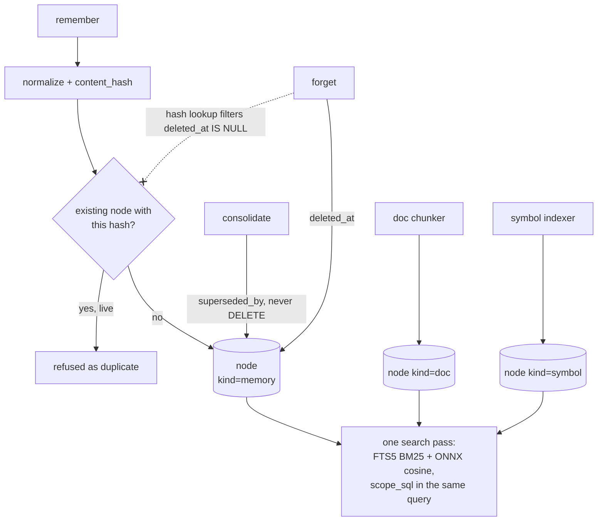

## 1. Executive Summary

Mimir is a 32,100-line Rust workspace under MIT or Apache-2.0, published to
crates.io as `mimir-mem`, that gives a coding agent one local store for three
things most systems keep apart: **typed memories, indexed documentation chunks
and code symbols are all nodes in one SQLite graph**, searched together in a
single pass by BM25 fused with local ONNX embeddings, and exposed through one
globally registered MCP server.

The unification is the design. A `node` row carries a `kind`, a `uid`, content, a
normalized `content_hash`, a `project_id`, JSON `meta` and both `deleted_at` and
`superseded_by`; an `edge` table joins them by typed relation. A symbol node and
a memory node differ by their kind and their meta, not by living in different
stores — so a query about a function can return the note somebody wrote about it
and the symbol itself, ranked against each other rather than merged afterwards
by a caller.

Four mechanisms are worth taking away regardless of the rest. **A deliberate
deletion refuses its own return**: `forget` leaves a tombstone, and `remember`
checks the text and its rewordings against the newest deliberate tombstones
before it writes, refusing with `--force` as the only way back and a
`Resurfacing` finding in the review queue each time it happens
(`crates/mimir-core/src/memory.rs`). **A mutation ledger** records who changed a
memory, when and why, as hashes and never the value (`audit.rs`); its
`superseded_at` is what lets `recall --as-of` judge supersession by when it
happened, separately from the `valid_from`/`valid_to` interval a person declares
(`search/mod.rs`). **A review queue** holds what the store noticed and will not
decide — contradictions, stale groundings, expired conditions, resurfacing facts
— until a person keeps, supersedes or dismisses with a reason (`review.rs`).
**Consolidation supersedes and never deletes**, stated as an invariant in the
module's own header comment and implemented as `UPDATE node SET superseded_by =
?2`, so the merge that collapses two memories leaves both rows and a pointer.
And the **context guard** turns the moment a coding session runs out of window into a memory event:
in `handoff` mode it instructs the agent to write one structured
`session-handoff` memory *before* the user clears, then restores it on the next
`SessionStart`. That is the conversation-window boundary this atlas puts outside
its scope, handled by making one durable memory out of it.

The gap is the familiar one and it is one predicate wide. `remember` computes a
normalized content hash and looks for an existing node with the same hash — under
`AND deleted_at IS NULL`. A memory a user deleted therefore does not match its
own hash, and is re-created as new on the next restatement, with the mechanism
that would have caught it already computed and already indexed.

## 2. Mental Model

Everything is a node, and a node stops being current in two different ways.

**Writes are explicit and deduped by value.** `remember` normalizes the text,
hashes it, and refuses an exact restatement — the committed test uses *"SCRAM auth
rejects non-ASCII passwords"* against *"scram auth  rejects\nnon-ascii
passwords"*, so case, whitespace and line breaks collapse to one hash. That is
the normalization other systems in this atlas bolt on later, present at the
first write.

**Indexing brings the other two kinds in.** Documents are chunked and code is
parsed into symbol nodes with a `stable_id` in meta and an index on it, so a
symbol survives a file being reformatted.

**Retrieval is one query over all three.** FTS5 gives BM25, the `embedding` table
gives cosine, and `scope_sql` composes the project filter into the same statement
rather than filtering afterwards.

**Superseded is not deleted, and deleted is not gone.** The consolidator marks
the older of a near-duplicate pair `superseded_by` the newer; the default read
path excludes both superseded and soft-deleted rows, and `include_superseded`
exists for the caller that wants history.

The dotted edge is the finding: the value-keyed lookup exists and excludes the
rows a deletion produced.

## 3. Architecture

Five crates — `mimir-core` (33 source files: the store, search, consolidation,
briefs, evals, the context guard), `mimir-cli` (28), `mimir-graph`,
`mimir-syntax` and `mimir-proxy`. One SQLite file, migrations in code, no server
dependency. `contrib/` ships a systemd service, a watchdog service and a timer,
which is a level of operational packaging almost nothing else in this corpus
provides.

The screen of this checkout is the cleanest so far: **zero auto-run surfaces,
zero build-time execution, zero unpinned dependency surfaces**, with a
`Cargo.lock` unchanged for fourteen days — so every version it resolves is at
least that old.

## 4. Essential Implementation Paths

- **Schema** — `crates/mimir-core/src/db/migrations.rs`: `node`, `edge`,
  `node_fts`, `embedding`, `recall_event`, `savings_event`, `injection_log`,
  `meta`.
- **Write and dedupe** — `memory.rs`: normalization, `content_hash` lookup.
- **Consolidation** — `consolidate.rs`, with the never-delete invariant in the
  header and `superseded_by` as the mechanism.
- **Scope** — `search::scope_sql`, composed into every read.
- **Context guard** — `context_guard.rs`, `pause` and `handoff` modes.
- **Evals** — `eval/brief.rs` and `eval/fixtures.rs`, with `forbidden_ids`.
- **Symbols** — `mimir-syntax`, `anchors.rs`, `stable_id` in node meta.

## 5. Memory Data Model

The `node` table is the whole model. Indexes tell you what the design considers
hot: `(kind, project_id) WHERE deleted_at IS NULL` for scoped reads,
`content_hash` for dedupe, `substr(uid, -6)` for short-id lookup from a CLI,
and two partial indexes over `json_extract(meta, '$.stable_id')` and
`'$.name'` restricted to `kind = 'symbol'`.

`superseded_by` and `deleted_at` are separate columns doing separate jobs, which
is more than most stores here distinguish: one records that a better version
exists, the other that a person asked for removal. The *why* and the *who* live
beside them: the `mutation` table holds one row per `forget`, `supersede`,
`edit`, `restore` and review decision with an actor, a reason and the
before/after content hashes, `node_revision` keeps the wording an `edit`
replaced, and `review` holds each finding with its disposition. A deliberate
deletion is distinguished from a decay archival by `meta.archived`, which is
what lets the tombstone guard refuse the former and ignore the latter.

## 6. Retrieval Mechanics

Hybrid by construction rather than by configuration: FTS5 BM25 and ONNX
embeddings over the same node set, with the embedding table keyed by `(model,
content_hash)` so a model change is a backfill rather than a silent mismatch —
the guardrail this atlas records MemPalace for, present here as a schema
decision.

The scope filter is composed into the SQL, not applied to the results, so `LIMIT`
means the same thing for every caller. `recall_event` records what came back and
when, and `injection_log` records what was put into a prompt; between them a
reader can answer "why did the agent know that" after the fact.

## 7. Write Mechanics

Writes are synchronous and model-free. An exact restatement is refused at the
hash; near-duplicates survive until consolidation runs, and consolidation
supersedes rather than merging destructively.

The context guard is the most interesting write path. It estimates transcript
size by **byte count rather than tokenization** — cheap enough to run on every
prompt, and stated as an approximation with a tunable ratio instead of pretending
to be exact — and every database access in it **fails open**: a missing session or
a query error degrades to "estimate from the full transcript" or "don't nag"
rather than to an error. A guard that breaks a coding session when its own lookup
fails would be worse than no guard, and the module says so.

## 8. Agent Integration

One globally registered MCP server, so an agent gets memory without per-project
configuration; a CLI with `brief`, `context`, `graph`, `rules`, `savings` and
`rewrite` subcommands; session hooks that drive the context guard; a proxy crate;
and systemd units for running it as a daemon with a watchdog. `savings_event`
exists to quantify what the injection saved, which is a product decision as much
as an engineering one — it makes the value of the memory layer measurable to the
person paying for tokens.

## 9. Reliability, Safety, and Trust

**Scope reaches the query.** `project_id` on the row, `scope_sql` in the
statement, and the read-path index carved to match. That earns `scope_enforced`
in its strongest ordinary form: not a post-filter, not a tag.

**Correction is structural but anonymous.** Supersession and soft delete are
distinct and durable, and neither carries a reason, an actor, or a status. A
reader asking "was this wrong, or just old?" cannot be answered by this schema.

**The tombstone is exact and then loose, in that order.** `remember` looks for
a live exact duplicate first, then for a deliberately forgotten node by the same
content hash, then for a reworded one among the newest 500 deliberate
tombstones, then for a live near-duplicate — an order chosen so a fact someone
brought back with `--force` is a duplicate rather than forever forgotten, and a
loose live match cannot mask an exact tombstone. The reword pass is
deliberately more sensitive than the live near-duplicate pass, because a false
refusal costs one `--force` and a missed tombstone silently undoes a deletion.
Decay archival is excluded from the scan on purpose: nobody decided that.

**The ledger stores hashes, not values.** A `mutation` row carries
`before_hash` and `after_hash` over the normalized text, enough to prove which
value was removed to someone who still holds it and useless for recovering it;
the refusal ledger made the same call first. `forget` also purges the node's
`node_revision` rows, so the deleted wording does not survive in a table recall
never reads but `export` and every backup do. Memories only: chunk and symbol
rows are not audited. `recall_event`, `injection_log` and `savings_event` remain
read-side telemetry beside it.

## 10. Tests, Evals, and Benchmarks

**Deletion is evaluated, not asserted.** `eval/forget.rs` runs a durability
scorecard over a scratch store: capture a fact, forget it, then attack from
every shape — exact re-add, reword, import, consolidation, and a leak search
across every table including revisions and the vector cache — and score each
obligation; an empty store fails every obligation so the scorecard cannot pass
vacuously (`forgotten_facts_survive_every_attack_shape`,
`soft_delete_is_durable_across_the_thirteen_steps`,
`hard_delete_leaves_nothing_anywhere`, `an_empty_store_fails_every_obligation`).

The eval module is the standout. `eval/brief.rs` defines fixture cases carrying
`expected_ids` **and `forbidden_ids`** — the assertion that particular material
must not come back — resolved against a built store. That is the form this atlas
asks for in every pattern page's test list and finds in a minority of systems,
and it earns `negative_eval` without qualification.

Unit tests sit beside the code in Rust convention, including the normalization
case quoted above. CI runs on GitHub Actions; no benchmark numbers are published
in the README, and none is claimed.

## 11. Patterns Worth Stealing

### Steal

**Put memories, docs and symbols in one table with a `kind`.** One index, one
ranking pass, one scope filter. The alternative — three stores and a merge step —
is where relevance comparisons go to die, because nothing ranks a note against
the function it describes.

**State the never-delete invariant in the module that could break it.**
`consolidate.rs` opens with it, and the code matches.

**Key embeddings by `(model, content_hash)`.** A model swap becomes a visible
backfill instead of a silent quality regression.

**Make the context-window cliff produce a memory.** The handoff mode writes one
structured memory before a clear and restores it after — the cheapest useful
answer to a problem this atlas otherwise declares out of scope.

**Fail open in a guard that runs on every prompt**, and say so in the header.

### Avoid

**Do not let a background archival count as a deletion.** The tombstone guard
excludes decay-archived rows on purpose; a guard that refused those would
teach people to pass `--force` by reflex.

**Do not quote the value in the ledger that records its removal.** Hashes
prove which value went; text keeps it alive in a table recall never reads.

### Fit

This is the shape to copy for a single developer's coding agent: local, one file,
no daemon required, MCP-registered once, with the operational packaging to run it
as a service if wanted. It suits a reader who wants strong retrieval and
inspectable state today and can accept that correction is anonymous.

It does not suit a setting where a deletion must be defensible or a memory's
epistemic standing has to be recorded — not because the store could not carry
those columns, but because at this commit it does not, and the machinery around
them (actors, statuses, reasons) is absent rather than partial.

## 12. Antipatterns / Risks

- **No trust state on content**; confidence is the author's number, and wrong
  and stale look identical until a finding reaches the queue.
- **Byte-count context estimation** is a deliberate approximation, and a model
  whose tokenizer diverges from the tuned ratio will trip the guard early or
  late.

## 13. Build-vs-Borrow Takeaways

Borrow the single-table graph, the embedding key, and the eval fixture shape with
`forbidden_ids`. Those three are independent of the rest and each closes a
failure this atlas records repeatedly.

The correction layer is where a fork would start: the columns for supersession
and deletion exist, and what is missing is a reason, an actor and a lookup that
survives a delete.

## 14. Open Questions

- Is the `deleted_at IS NULL` clause in the dedupe lookup deliberate — is
  re-remembering a deleted memory considered the correct behaviour?
- Does anything consume `savings_event` beyond the CLI report, and is the
  estimate validated against real token counts anywhere?
- What resolves a symbol node whose `stable_id` changes because the symbol was
  renamed rather than moved?

## 15. Appendix: File Index

| Path | Role |
| --- | --- |
| `crates/mimir-core/src/db/migrations.rs` | The whole schema: nodes, edges, FTS5, embeddings, event tables |
| `crates/mimir-core/src/memory.rs` | Normalization, content-hash dedupe, scoped listing |
| `crates/mimir-core/src/consolidate.rs` | Supersession with the never-delete invariant stated |
| `crates/mimir-core/src/context_guard.rs` | Pause and handoff modes, byte-count estimation, fail-open |
| `crates/mimir-core/src/eval/brief.rs` | Fixture cases with `expected_ids` and `forbidden_ids` |
| `crates/mimir-cli/src/mcp.rs` | The MCP surface |
| `contrib/` | systemd service, watchdog and timer |

## History

**2026-09-07** — [`ff5b3688da694be0edb38232a1d90843d00a5fa7`](https://github.com/MakerViking/mimir/commit/ff5b3688da694be0edb38232a1d90843d00a5fa7) — re-pinned nineteen commits on, version 0.16.0, 7,588 lines added. Four mechanisms this report withheld at the previous pin exist and are tested: a deliberate tombstone that refuses a forgotten fact and its rewordings on every `remember` (`memory.rs`), a hash-only `mutation` ledger of who changed a memory, when and why (`audit.rs`), a `review` queue a person decides with a reason (`review.rs`, `review_cmd.rs`), and two time axes — `--valid-from/--valid-to` on the node and `--as-of` transaction-time recall judged from the ledger (`search/mod.rs`). Beside them: `node_revision` keeps the wording an edit replaced and is purged by `forget`, an author confidence is stored apart from usage, a falsifiable grounding link and a refusal ledger, a secrets scrubber, receiver-typed call edges in the code graph, and `eval/forget.rs` scores deletion durability against every re-entry shape. `tombstone`, `audit_log`, `human_review` and `bitemporal` are awarded; six of seven marks. Screened before reading: no auto-run surface, no manifest inside the cooldown, nothing installed or run.

**2026-08-07** — [`e005dede938832fd63d5097bbf5145228f693ce3`](https://github.com/MakerViking/mimir/commit/e005dede938832fd63d5097bbf5145228f693ce3) — first reading. Screened before reading: **zero** auto-run surfaces, zero build-time execution paths and zero unpinned dependency surfaces, with `Cargo.lock` present and unchanged for fourteen days, so every version it resolves is at least that old — the cleanest screen recorded in this atlas. Nothing was built or run; the analysis is static. The name is worth flagging for anyone reconciling systems by name rather than by URL: [Perseus Vault](../perseus-vault/) exposes its MCP tools under a `mimir_*` prefix and is an unrelated project.
