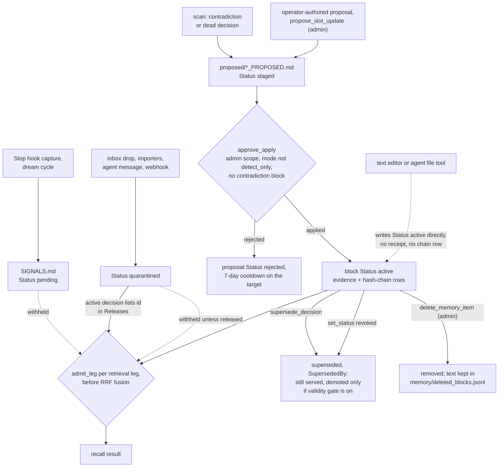

## 1. Executive Summary

MIND-Mem is a local memory for coding agents that keeps decisions, tasks and
entities as typed blocks in plain Markdown, indexes them with SQLite FTS5, and
serves them over an MCP server, a REST API and an `mm` CLI. What is notable is
the write discipline. Every write door is assigned an ingest tier, the tier
decides the block's initial status, and only applying an approved proposal
mints `active`; everything else lands `pending` or `quarantined` and recall
withholds it on every retrieval leg. What is weak is that the discipline lives
in the Python write path while the store is a directory of Markdown that any
editor, and any agent with a file tool, can write into directly.

The engineering around that gate is dense and self-critical. `write_block`
refuses to run without an admission receipt opened by the governance gate
(`src/mind_mem/admission.py:729-760`), and `tests/test_governed_write_paths.py`
reads the source tree and fails the build on a new raw writer. Many module
docstrings name the defect that produced them, with the measurement.

The approve verb is admin-scoped, and the scope of a stdio server comes from its
process environment rather than from the model, which is why `human_review` is
awarded; section 9 states the three routes around it. Five marks:
`trust_state`, `scope_enforced`, `audit_log`, `human_review` and
`negative_eval`. `tombstone` and `bitemporal` are withheld.

The project was renamed from mem-os; the pre-fork history is kept at the bottom
of `CHANGELOG.md`. The README calls the system deterministic and reports
LoCoMo, LongMemEval-S and needle-in-a-haystack results with committed raw rows;
none was re-run for this report.

## 2. Mental Model

A memory is a block: an `[ID]` header followed by `Key: Value` fields, parsed
by `block_parser.py`. Decisions (`D-`), tasks (`T-`), entities, incidents,
signals (`SIG-`), dead ends (`DE-`) and task frames (`TF-`) share the format.

**Status is the belief state, and the door decides it.** `INITIAL_STATUS` maps
each `IngestTier` to the status its writes may carry: external ingest and
agent messages mint `quarantined`, auto-capture mints `pending`, the integrity
scanner mints `open` on contradiction and drift ids only, and `PROPOSAL_APPLY`
alone mints `active` (`src/mind_mem/enums.py:261-273`). `require_admission`
refuses a receipt whose tier would write a servable status it cannot mint, so a
quarantine door cannot carry an `active` block in.

**Recall serves an allow-list, not everything minus a deny-list.**
`RECOGNISED_STATUSES` is the lifecycle vocabulary minus `UNADMITTED`, and a
status nobody named is withheld (`src/mind_mem/admissibility.py:142-190`). The
module's own history is that the earlier deny-list served any status a new
door invented.

**A block becomes believed by approval.** An agent's captured statements wait in
`intelligence/SIGNALS.md` as `pending`. Proposals wait in
`intelligence/proposed/*_PROPOSED.md` as `staged` until `approve_apply` runs
them. A quarantined import becomes servable when an active decision lists its
id in a `Releases` field, and revoking that decision re-quarantines the batch
without touching the imported blocks (`admissibility.py:255-286`).

**A block stops being current in four ways.** A `supersede_decision` op sets
`Status: superseded` with `SupersededBy` and `Supersedes`
(`src/mind_mem/apply_engine.py:1404-1410`). A `set_status` op revokes; the
scanner stages these for contradictions and for decisions no task references. A
rejected proposal is marked `rejected` with its reason. An admin delete removes
the block. Superseded, revoked and rejected blocks remain recallable; history
is treated as part of the product.

## 3. Architecture

The package is a zero-dependency Python core with optional extras
(`pyproject.toml`). A workspace is a directory: `decisions/`, `tasks/`,
`entities/`, `memory/` for daily logs and the chains, `intelligence/` for
signals, contradictions, drift and proposals, and `shared/` plus `agents/<id>/`
for namespaces. The default block store is Markdown; `encrypted` and `postgres`
are the other two backends (`src/mind_mem/storage/__init__.py:28`).

The index is SQLite with FTS5 at `.mind-mem-index/recall.db`
(`src/mind_mem/sqlite_index.py:63`). Vector recall, cross-encoder reranking and
the knowledge graph are optional. The governance gate keeps two append-only
stores per workspace, `memory/evidence_chain.jsonl` and
`memory/hash_chain_v2.db` (`src/mind_mem/governance_gate.py:493-501`).

The MCP server is FastMCP over stdio or HTTP; HTTP refuses to start without a
token unless bound to loopback with an explicit flag. `mm http-serve` and a
FastAPI REST app are further surfaces, each binding the authenticated principal
into the same ACL snapshot the MCP tools read
(`src/mind_mem/mcp/infra/acl.py:132-200`).

Nothing runs continuously by default. The Stop hook runs capture, the scanner
runs when called, and an inbox watcher runs only under `mm inbox-watch`.

### Deployment and ergonomics

`pip install mind-mem` and `mind-mem-init <dir>` produce a working workspace
with no service, no API key and no network. The store is human-readable and
repairable by hand, which is also the bypass described in section 9. A new
workspace starts in `governance_mode: detect_only`
(`src/mind_mem/init_workspace.py:148`), in which the apply engine refuses every
proposal (`apply_engine.py:1712-1718`), so an operator has to switch modes
before anything the agent proposes can become a decision. Approving also needs
`MIND_MEM_SCOPE=admin` in the operator's environment.

## 4. Essential Implementation Paths

**Capture.** The Stop hook runs `python3 -m mind_mem.capture` over the daily log
(`hooks/session-end.sh`). `append_signals` skips any signal whose normalised
content hash is already in `SIGNALS.md` and writes the rest under an
`AUTO_CAPTURE` receipt, so they land `pending` (`src/mind_mem/capture.py:405-428`,
`:269-281`).

**Propose.** `propose_update` validates a rationale of at least eight
non-whitespace characters, runs the compliance screen and the quality gate, and
appends to `SIGNALS.md` only (`src/mind_mem/mcp/tools/governance.py:194-330`).
Scanner proposals come from `generate_proposals`, which stages `set_status
revoked` edits within `per_run` and `per_day` budgets
(`src/mind_mem/intel_scan.py:1187-1301`). The `append_block` ops in
`src/mind_mem` are written by `closed_slots.py:549` and
`importers/quarantine.py:395`.

**Apply.** `approve_apply` checks the id format, runs
`check_proposal_contradictions`, and calls `apply_proposal`
(`governance.py:1146-1190`). `apply_proposal` enforces the mode gate, backlog
limit, a ten-minute no-touch window, fingerprint dedup and a deferred cooldown,
snapshots, writes a receipt, then opens `gate.admit_proposal` before executing
ops under a WAL (`apply_engine.py:1694-1975`).

**Admission.** `GovernanceGate.admit` checks the spec binding for config drift,
creates an evidence object and appends a hash-chain entry under one lock
(`governance_gate.py:580-730`). Every `write_block` calls `require_admission`
(`admission.py:729-760`).

**Recall.** `recall` in `_recall_core.py:1193` resolves an agent namespace,
queries the configured backend, and passes each leg through
`_withhold_inadmissible` (`:714-869`); the hybrid backend does the same per leg
(`hybrid_recall.py:1624`). The MCP `recall` tool resolves the agent id from the
authenticated token (`mcp/tools/recall.py:336-339`).

**Delete.** `delete_memory_item` opens `admit_delete`, removes the block, and
appends the removed text to `memory/deleted_blocks.jsonl`
(`mcp/tools/memory_ops.py:782-812`; `block_store.py:675-689`).

## 5. Memory Data Model

| Field | Where | Notes |
| --- | --- | --- |
| `[ID]` | block header | prefix routes the block to its file (`D-`, `T-`, `SIG-`, `IMP-`, `DE-`) |
| `Status` | block field | the belief state; see section 2 |
| `Date`, `Created`, `Captured` | block fields | record dates; `since`/`until` filter on `Date` |
| `Supersedes`, `SupersededBy` | block fields | written together by `supersede_decision` |
| `Releases` | decision field | ids an active decision admits out of quarantine |
| `ActorId`, `ActorRole`, `SessionId`, `ToolId`, `Purpose`, `ContentSource` | block fields | optional provenance on proposals |
| `ContentHash` | signal field | dedup key for capture |
| `ConstraintSignatures` | decision field | subject, predicate, object, modality, scope and axis key the scanner compares |

**Scope is a path.** `NamespaceManager.can_read` matches a relative path against
the agent's `read` namespaces from `mind-mem-acl.json`
(`src/mind_mem/namespaces.py:208-215`). An agent id of `None` has unrestricted
read inside the workspace.

**Provenance is claimed on the block.** `provenance_class.py` classifies a block
from its own fields, and the module records the gap itself: *"a hand-edited
corpus can claim ``ActorRole: operator`` without an authenticated write"*
(`src/mind_mem/provenance_class.py:255-259`).

**Time is one axis on blocks and one on edges.** Knowledge-graph edges carry
`valid_from` and `valid_until` and no record time
(`src/mind_mem/knowledge_graph.py:863-873`). `edge_grounded_answer.py:38-45`
says so: replay is valid-time only, because *"the store has no
transaction-time axis"*.

## 6. Retrieval Mechanics

Lexical retrieval is BM25F over FTS5 with RM3 expansion and a deterministic
reranker. Vector, graph (cross-reference walk), knowledge-graph and entity
prefetch legs are optional and fused by reciprocal rank. Each leg's candidates
are filtered before fusion, which the module argues from the RRF formula: a
withheld item dropped after fusion leaves its neighbours' ranks shifted, so its
presence is observable (`admissibility.py:59-63`). A test pins that
(`tests/test_recall_admissibility.py:382-408`).

Status ranks and filters differently. Unadmitted statuses are removed. Among
admitted ones, the scan path multiplies an `active` block's score by 1.2
(`_recall_core.py:1553`, `:2128-2130`), and a superseded or revoked decision is
otherwise served beside its successor. `active_only` removes it on request
(`sqlite_index.py:1837`). The validity gate that would demote dead statuses is
off by default (`src/mind_mem/validity_gate.py:31-33`).

`scoring_instant` pins recency to a date, and the recall attestation records
it, so a run replays given the same corpus and config. That is the
determinism the README claims, and it is scoped to the ranking inputs.

Injection is tool-mediated. The MCP `recall` tool takes `query`, `limit`,
`active_only`, `backend`, `explain` and `scoring_instant`; it exposes no
`include_pending` and no `agent_id` (`mcp/tools/recall.py:1248-1283`).

## 7. Write Mechanics

Writes are explicit or hook-driven, and no model is called on the default
path. Capture is regex classification over the daily log with 26 patterns
(`capture.py`). Transcript capture and a session summariser run in the
background from the Stop hook when `auto_ingest.enabled` is set, reading the
most recent JSONL under `~/.claude/projects` (`hooks/session-end.sh`).

Signals are deduplicated by content hash. Proposals are deduplicated by a
fingerprint over their ops while staged or deferred
(`apply_engine.py:1491-1535`). A rejected or deferred proposal blocks new
proposals for the same target for seven days (`:1578-1609`), keyed on the
target block rather than the value.

Agent-written content is handled as untrusted by door: an agent message is
quarantined (`src/mind_mem/agent_messaging.py:17`), external-ingest content
cannot mint a dead end (`src/mind_mem/dead_ends.py:47-49`), and a captured statement is
pending until an operator acts.

Conflicts are detected rather than resolved automatically. The scanner compares
constraint signatures and stages a revoke of the lower-priority decision, and
`apply_proposal` refuses an apply whose proposal contradicts an active block
unless `contradiction.block_on_detect` is set to false
(`apply_engine.py:1786-1800`).

### Operational cost

- Write: synchronous, file-locked, one evidence row and one chain row per
  admission scope. No model call.
- Lag: a capture is recallable only by an operator including pending signals;
  a proposal is recallable after approval, after the ten-minute no-touch window
  between applies.
- Background: none scheduled. Scans and compaction run when called.
- Read: bounded by `limit`; no automatic per-turn injection beyond the
  task-frame resume brief at session start.

## 8. Agent Integration

`mm install-all` and `install.sh` write MCP entries for Claude Code, Codex,
Cursor, Gemini and other clients, each with `MIND_MEM_WORKSPACE` only
(`src/mind_mem/hook_installer.py:247-253`; `install.sh:278-284`). The Claude
Code hooks installed are `mm status` and `mm resume-on-start` at SessionStart
and `mm status` at Stop (`hook_installer.py:322-351`). The plugin-root
`hooks/hooks.json` wires `session-start.sh`, which prints a health line, and
`session-end.sh`, which runs capture.

At the default scope the agent's MCP surface is read-heavy. `recall`, `scan`,
`propose_edge`, `observe_signal`, `report_outcome` and `dream_cycle` are
user-scope; `propose_update`, `approve_apply`, `rollback_proposal` and
`delete_memory_item` are admin (`src/mind_mem/mcp/infra/acl.py:260-330`). An
agent that should propose needs admin scope, which also grants approve; there is
no scope between the two.

Dead ends are the integration idea to note. A `[DE-...]` block records an
approach that failed with declared trigger patterns, and `match_dead_ends` warns
when a task frame's declared approach overlaps them, without blocking
(`dead_ends.py:1-45`).

## 9. Reliability, Safety, and Trust

**The gate is in the package, not in the store.** Every `write_block` needs a
receipt, and a static test holds that for every writer in the source tree. The
Markdown files are outside that reach. An agent with an Edit tool can append a
`Status: active` block to `decisions/DECISIONS.md`; it is served on the next
recall, and the recall path does not consult the chains (Recorded searches).
`provenance_class.py:255-259` names the same gap for provenance fields.

**Approval authority is environmental.** The approve verbs are admin-scoped, and
a stdio server's scope is `os.environ.get("MIND_MEM_SCOPE", "user")`
(`src/mind_mem/mcp/infra/observability.py:117-119`), set by whoever writes the
MCP config. Three routes reach approval without a person: the Qwen stanza in
`docs/client-integrations.md:127-137` gives an agent admin scope;
`python3 -m mind_mem.apply_engine` applies with no scope check
(`apply_engine.py:2386-2410`); and `MIND_MEM_ACL_DISABLED` opens admin tools,
logging each call (`observability.py:120-140`).

**Deletion keeps the text.** `memory/deleted_blocks.jsonl` stores the removed
content with its id (`block_store.py:675-689`). The chain stores hashes, not
content, so erasure means pruning a recovery journal the package writes.

**Concurrency** uses advisory file locks and a re-entrant lock around
evidence-then-chain writes; the code states there is no two-phase commit across
the JSONL and SQLite stores (`governance_gate.py:708-712`).

Capability marks:

- `trust_state` — awarded: `quarantined` and `pending` are minted by named doors
  and withheld per leg; release is by an approved decision.
- `scope_enforced` — awarded on the agent-bound indexed path; an unbound stdio
  session is workspace-wide.
- `audit_log` — awarded: evidence and hash-chain rows on every admitted write,
  delete and scope close.
- `human_review` — awarded with the three routes above as its limit, in the
  same shape as [FAVA Trails](../fava-trails/), where authority also comes from
  the server environment.
- `negative_eval` — awarded; section 10.
- `tombstone` — withheld. Rejection is recorded on the proposal and its target
  cools down for seven days. Capture's content-hash dedup is value-keyed but
  status-blind, and `compact_signals` removes rejected signals after 60 days
  (`src/mind_mem/compaction.py:391-395`). Contrast
  [inspeximus](../inspeximus/), whose ledger is consulted on write.
- `bitemporal` — withheld: edges have valid time and no record time; blocks have
  record dates only.

## 10. Tests, Evals, and Benchmarks

Nothing was installed, built or run for this report; everything below is from
reading the tests at the pin. CI runs `pytest tests/` excluding integration and
stress, with a coverage floor of 70 (`.github/workflows/ci.yml:157`).

**Admissibility, paired.** `tests/test_recall_admissibility.py` drives one
fixture per `Leg` and runs it twice: with the poison `active` it must be served
(`:202-210`), with it `quarantined` it must not (`:213-217`). A missing fixture
for a new leg fails `test_every_leg_has_a_fixture`. The golden at `:417-437`
asserts a non-empty result before adding a quarantined exact-match block, then
equality after.

**Namespace, paired.** `tests/test_indexed_namespace_acl.py:92-118` indexes one
private block and asserts alice gets nothing while bob gets it.

**Red team.** `tests/test_quarantine_redteam.py` plants a canary through the
inbox, agent messages, image drops and the webhook, asserts it is on disk, and
asserts recall does not reach it. The positive control is presence on disk
(`:102-116`), so those cases would also pass against an empty recall; the
paired admissibility suite covers that gap.

**Write invariant.** `tests/test_governed_write_paths.py` parses the source and
checks every `write_block` caller and implementation, with a positive and a
negative control on the matcher.

**Benchmarks.** `EVIDENCE.md` lists each claim with its artifact and marks
every one first-party. Its row 6 cites `src/mind_mem/core/`, which is absent
from the tree, and its row 10 calls supersession "bi-temporal". No paper is
cited; the one BibTeX block is a model-card template in
`train/build_model_card.py`.

**Missing.** No test covers a block written into the Markdown corpus outside the
package, and no retrieval test checks that a superseded decision is outranked by
its successor under the default config.

## 11. For Your Own Build

### Steal

- **Let the door decide the status.** One table maps each ingest source to the
  status it may mint, and the store refuses a write whose receipt names a tier
  that cannot mint the status it carries.
- **Serve an allow-list of statuses.** Withhold anything unnamed, so a new
  door's invented status fails closed.
- **Filter each retrieval leg before fusion.** Filtering after RRF leaks
  withheld items through their neighbours' ranks.
- **Release by decision, not by edit.** Admitting quarantined content through an
  active decision's `Releases` list makes revocation re-quarantine the batch.
- **Pair every exclusion test with the same fixture served.** The leg table
  here is the shape to copy.
- **Take scope from the server's environment or a verified token**, never from
  a tool argument.

### Avoid

- **Governance that stops at the library boundary** when the store is a text
  file the agent can edit.
- **One scope for propose and approve.** An agent that needs to propose here has
  to be given the approve verb too.
- **Serving superseded decisions by default** with a 1.2 boost as the only
  separation.
- **A deletion journal that keeps the text** beside a claim of deletion.

### Fit

This suits a single developer or a small team who wants an agent's durable
decisions to pass a person before they count, and who will run the review queue
and read the diffs. The package is large: roughly 167,000 lines, a hundred-odd
tools, and a documentation set that reads as an ongoing audit. A reader who
wants a memory the agent writes and reads without ceremony should walk away;
the default install refuses every apply until the mode is changed. A reader who
needs the gate to hold against the agent itself needs the workspace outside the
agent's file tools, which is a deployment decision this package leaves to them.

## 12. Open Questions

- How do operators turn a captured signal into a decision proposal in practice?
  No module in `src/mind_mem` writes one from `SIGNALS.md`.
- Does any deployment run the agent's MCP server at user scope and still let it
  propose, given that `propose_update` is admin?
- How large does `SIGNALS.md` grow before the 60-day compaction, and what does
  the content-hash scan cost at that size?
- Would a chain-membership check on the read path be affordable, given the
  per-leg filter already runs?

## Appendix: File Index

- **Status and admission:** `src/mind_mem/enums.py`, `src/mind_mem/admission.py`,
  `src/mind_mem/admissibility.py`, `src/mind_mem/governance_gate.py`.
- **Audit:** `src/mind_mem/evidence_objects.py`, `src/mind_mem/hash_chain_v2.py`,
  `src/mind_mem/lifecycle_evidence.py`.
- **Write path:** `src/mind_mem/capture.py`, `src/mind_mem/apply_engine.py`,
  `src/mind_mem/intel_scan.py`, `src/mind_mem/closed_slots.py`,
  `src/mind_mem/inbox.py`, `src/mind_mem/agent_messaging.py`,
  `src/mind_mem/block_store.py`.
- **Retrieval:** `src/mind_mem/_recall_core.py`, `src/mind_mem/hybrid_recall.py`,
  `src/mind_mem/sqlite_index.py`, `src/mind_mem/validity_gate.py`,
  `src/mind_mem/_recall_constants.py`.
- **Scope and ACL:** `src/mind_mem/namespaces.py`,
  `src/mind_mem/mcp/infra/acl.py`, `src/mind_mem/mcp/infra/observability.py`.
- **MCP:** `src/mind_mem/mcp/tools/governance.py`,
  `src/mind_mem/mcp/tools/recall.py`, `src/mind_mem/mcp/tools/memory_ops.py`.
- **Graph:** `src/mind_mem/knowledge_graph.py`,
  `src/mind_mem/edge_grounded_answer.py`.
- **Integration:** `src/mind_mem/hook_installer.py`, `install.sh`, `hooks/`,
  `docs/client-integrations.md`, `docs/review.md`.
- **Tests:** `tests/test_recall_admissibility.py`,
  `tests/test_indexed_namespace_acl.py`, `tests/test_quarantine_redteam.py`,
  `tests/test_governed_write_paths.py`.

### Recorded searches

Checked against the checkout at the pinned revision.

- `rg -n -i 'valid_from|valid_until|validfrom|validuntil|valid_to\b|bitemporal|bi-temporal|ValidFrom:|ValidUntil:' -g '!CHANGELOG.md' .` — edge fields in `knowledge_graph.py` and `edge_grounded_answer.py`, a `ValidUntil` mapping in `SPEC.md`, and project documents; no block-level validity field.
- `rg -c -i 'tombstone' .` — prose only: `lifecycle_evidence.py` argues against one; `CHANGELOG.md`, `ROADMAP.md` and docs.
- `rg -n '"append_block"|append_block' --type py src/mind_mem` — writers in `closed_slots.py` and `importers/quarantine.py`; nothing reads `SIGNALS.md` into one.
- `rg -n 'MIND_MEM_SCOPE' -g '!tests/**' -g '!CHANGELOG.md'` — read in `observability.py`, `acl.py` and `review_queue.py`; set only in `docs/client-integrations.md:133` and the security review documents.
- `grep -n 'SCOPE\|isatty' src/mind_mem/apply_engine.py` — no match.
- `rg -n 'isatty' src/mind_mem/review_cli.py src/mind_mem/review_batch.py src/mind_mem/review_session.py src/mind_mem/review_queue.py` — no match.
- `rg -n -i 'hash_chain|evidence_chain|EvidenceChain' src/mind_mem/_recall_core.py src/mind_mem/hybrid_recall.py src/mind_mem/admissibility.py` — no match.
- `grep -rliE 'arxiv|bibtex|@article|@misc|doi\.org' . --exclude-dir=.git` — `SPEC.md` (a field description), `ROADMAP.md`, three tests, a script and `train/build_model_card.py`; no citation of a paper describing this system, and no `CITATION.cff`.

## History

**2026-09-26** — [`ddcd7c01ca902e466f05b6861c06f49c3ec4e47a`](https://github.com/star-ga/mind-mem/commit/ddcd7c01ca902e466f05b6861c06f49c3ec4e47a) — first reading, at the head of `main`, a commit dated 24 September 2026. Five marks: `trust_state`, `scope_enforced`, `audit_log`, `human_review`, `negative_eval`. Screened before reading: 5 auto-run surfaces (`.cursorrules`, `.githooks/pre-commit`, `.github/copilot-instructions.md`, `hooks/` and `hooks/hooks.json`), 7 build-time execution points, 7 dependency files inside the cooldown — every file in the depth-1 clone dates to the tip — and 3 unpinned surfaces; `AGENTS.md`, `CLAUDE.md`, `.cursorrules` and `AUDIT_FINDINGS_FOR_CLAUDE.md` treated as data. Nothing installed, built or run.
