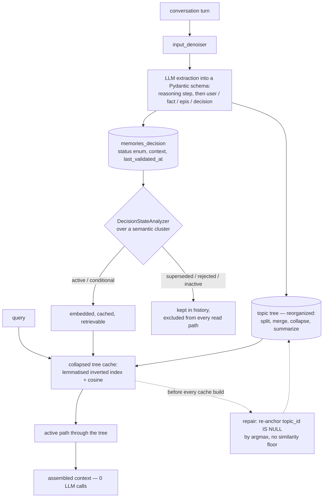

## 1. Executive Summary

MindCache turns conversations into four kinds of typed memory — user, knowledge,
episodic and decision — and files each into a topic tree that reorganizes itself
as the tree grows: splitting nodes, merging duplicates, collapsing single
children, and summarizing branches. It is 10,827 lines of Python, MIT, SQLite by
default with an optional Postgres and pgvector path, embeddings computed locally
through `fastembed`, and an MCP server over five tools.

**The mechanism worth the report is the one the atlas usually finds half-built.**
`DecisionMemory.status` is a database `Enum` — `active`, `inactive`,
`superseded`, `rejected`, `conditional` — set by `DecisionStateAnalyzer`, which
hands a semantically-clustered group of decisions to an LLM and asks which of
them are still in effect, writing back a one-sentence `context` explaining each
verdict and a `last_validated_at` stamp.

What makes it real is where the status is consumed. It is applied as
`status.in_(["active", "conditional"])` in five separate queries: the embedding
job that decides which rows get vectors at all, the tree cache's
missing-embedding check, the tree cache build, the embedding fetch that forms the
similarity candidate set, and the client's own retrieval query. So a decision
superseded *after* it was embedded is excluded at query time as well as at index
time — the leak this atlas has recorded again and again, closed here by filtering
where the candidates are assembled rather than only where they are written.

**The gap is the evidence.** The README carries two badges reading
*"Benchmark-BEAM-1M Passed"* and *"BEAM-10M Passed"*. The repository commits
three result files, one per conversation, twenty questions each. None of them
contains a score. `eval/eval_beam_e2e.py` is a four-stage harness whose fourth
stage judges answers against a rubric and *"write[s] scores back into the same
file"* — and no committed file has been through it: two hold retrieval traces
with `expected` and `rubric` and no answer, the third holds generated answers
with no judgement. The comparison baseline the judge scores against is mem0, and
its answers are loaded from a path outside the tree, skipped with a warning when
absent. Nothing in the repository supports the word *Passed*.

**And the self-healing has no floor.** `repair_detached_memories_for_user` runs
on the read path, before the tree cache is built. Any memory whose `topic_id` is
NULL is re-anchored by cosine similarity — to a sibling from the same source
message if one exists, otherwise to the nearest topic in the tree — using
`np.argmax` with no minimum. A detached memory is therefore always re-filed
under *something*, however unrelated, and since retrieval walks the tree, a
misfiling changes what is findable. There is no "leave it detached" branch and no
review.

## 2. Mental Model

Two structures, and the epistemic content lives in the smaller one.

**The tree is where a memory sits.** Extraction produces a `topics_root` and a
`topics_branch` per bucket, and those become a path. The tree is not static:
`reorganize_tree.py` is 1,788 lines of splitting, merging, reparenting,
deduplicating by normalized name and collapsing single-child chains, with
`nodes_summary.py` building branch summaries above it.

**The status is what a memory currently is**, and only decisions have one:

```text
active       currently in effect          ─┐ retrievable
conditional  applies under conditions      ─┘
superseded   a newer decision replaced it  ─┐
rejected     wrong or abandoned             ├ not retrievable
inactive     no longer relevant            ─┘
```

The analyzer's prompt states the rule it applies: *"If two decisions contradict
each other, the NEWER one (higher ID or higher timestamp) is usually 'active' and
the older one is 'superseded'."* Note *usually* — the ordering is a heuristic
handed to a model, not a constraint, and the model may return any of the five
values for any row in the cluster.

The other three memory types have no status at all. A user preference, a fact or
an episode is written once and remains equally retrievable forever, which makes
the decision path the only place in the system where a claim can stop being true.



## 3. Architecture

- **`Memory_extract/`** — `input_denoiser.py` (381 lines) strips noise before the
  model sees it; `schema.py` carries the extraction contract as Pydantic field
  descriptions, so the schema *is* the prompt; `safe_ai.py` (389) wraps the LLM
  calls; `summary_extractor.py` drives the analyzer and summaries.
- **`Database/`** — `db_setup.py` defines four memory tables sharing a
  `BaseMemory`, plus `Topic`, `TriadBlock`, `ProcessingJob` and `MemoryRegistry`;
  `db_manager.py` (686) owns the job queue; `embedder.py` (340) runs the
  embedding jobs; `reorganize_tree.py` (1,788) and `nodes_summary.py` (756) keep
  the tree usable; `decision_analyzer.py` (106) is the status machine.
- **`retrieval/`** — `root_cache.py` (946) builds and scores the collapsed tree
  cache; `active_path.py` (807) walks it and assembles the context;
  `hybrid_search.py` (55) is an optional cross-encoder reranker;
  `context_bridge.py` and `structs.py` support both.
- **`mcp/server.py`** — five tools: `add_memory`, `process_memory`,
  `search_memory`, `inspect_memories`, `inspect_tree`.

### Deployment and ergonomics

`pip install`, a model key for `litellm`, and a local SQLite file. Embeddings are
computed in-process by `fastembed`, so nothing external is needed for the vector
arm, and spaCy's `en_core_web_sm` backs lemmatisation. Postgres with pgvector is
one environment variable away and changes only the column type.

Two supply-chain notes a reader should weigh before installing: the dependency
list has no lockfile beside it, and it pulls the spaCy model from a GitHub
release URL rather than from an index, so what resolves is not pinned by hash.

## 4. Essential Implementation Paths

**The status write** — `DecisionStateAnalyzer.analyze_cluster`
(`Database/decision_analyzer.py:40`) formats the cluster with ids, timestamps,
current status and context, asks for a strict JSON array back, and validates each
returned status against `{"active", "inactive", "superseded", "rejected",
"conditional"}` before assigning it. An unrecognised value is dropped rather than
written, and a parse failure logs and returns without touching a row — the write
is fail-closed in both directions.

**The status read** — the same predicate in five places:

```python
query = query.filter(MemClass.status.in_(["active", "conditional"]))
```

at `retrieval/root_cache.py:423`, `:465`, `:804`, `:837`, `client.py:300`, and as
a declared filter in the embedder's type map (`Database/embedder.py:168`).

**The scope read** — `user_id` is filtered in the tree cache queries and passed
into `_fetch_memories_batch` and `_fetch_topics_batch`
(`retrieval/active_path.py:589`, `:596`).

**The repair** — `repair_detached_memories_for_user`
(`Database/repair_detached_memories.py`) groups detached rows by `message_id`,
prefers a sibling extracted from the same message, and falls back to the nearest
topic vector.

**The reorganizer's invariant** — no topic delete strands a memory. Five paths
move all four memory collections to the survivor before deleting: the
merge-redirect at `reorganize_tree.py:354`, the sibling dedup at `:504`, the leaf
split at `:1520`, the root merge at `:1182` and the collapse at `:1698`. The
sixth, `CLEANUP-DELETE` at `:535`, deletes only nodes that have neither memories
nor children. I checked all six by hand, and
`tests/test_reorganize_tree.py::test_merge_duplicate_nodes_transfers_memories`
pins one of them.

## 5. Memory Data Model

| Table | Carries | Status |
| --- | --- | --- |
| `memories_user` | preferences, habits, biographical facts | none |
| `memories_knowledge` | context-specific facts learned in conversation | none |
| `memories_episodic` | narrative records of what happened | none |
| `memories_decision` | choices with lasting effect | **five-value enum, indexed** |
| `topics` | the tree, with embeddings and summaries | — |
| `memory_registry` | user and memory type only | — |
| `processing_jobs` | pending, processing, failed | job state |

Every memory carries `content`, `timestamp`, `embedding`, a nullable `topic_id`
and a nullable `message_id` back to the conversation turn that produced it. That
`message_id` is the provenance link, and it is what makes the sibling half of the
repair possible.

The extraction schema is worth reading as a document in its own right: each field
description is a paragraph of formatting rules with worked BAD and GOOD examples,
and `extra = "forbid"` on every model means the LLM cannot invent a field. The
prompt and the validator are the same object, so they cannot drift apart.

## 6. Retrieval Mechanics

Retrieval is deterministic and makes **no LLM call** — the trace logs
`0 LLM calls` on every query. The stages:

1. **Score the collapsed tree cache.** A lemmatised inverted index over node and
   memory text, built with spaCy, scores lexical hits; embedding cosine scores
   semantic ones. `test_morphological_alias.py` pins the lemmatisation.
2. **Walk an active path** through the scored tree, expanding from the best
   anchors and budgeting how much context each contributes.
3. **Optionally rerank** with a Jina cross-encoder, behind the `rerank` extra.

The decision filter applies at stage 1, inside the query that fetches the
embeddings, so a superseded decision is not a candidate at any later stage. That
ordering is the design's strongest property and the one most systems here get
backwards by filtering after ranking, or not at all.

## 7. Write Mechanics

Writes are asynchronous and queued. `client.py` enqueues a `ProcessingJob` with
`status="pending"`, and processing denoises the turn, calls the extractor, anchors
the buckets into the tree, then runs embedding and reorganization jobs. A memory
is therefore not retrievable at the moment it is written, and nothing in the
repository states or measures the interval.

Correction is supersession, and it is the only correction. A decision's content
is never rewritten; a newer decision arrives, the analyzer re-reads the cluster
and moves the older one out of `active`. The superseded row stays with its
`context` explaining what replaced it, which is exactly the discipline this atlas
argues for.

Deletion is a whole-user wipe (`client.py:474` onward, one `delete()` per table)
or nothing. There is no per-memory delete, no expiry and no TTL.

## 8. Agent Integration

The MCP server exposes `add_memory` and `process_memory` on the write side,
`search_memory` on the read side, and `inspect_memories` and `inspect_tree` for
looking at what is stored. The inspection tools render; they do not adjudicate,
so there is no surface where a person approves or rejects a memory — the status
that decides retrievability is written only by the model.

## 9. Reliability, Safety, and Trust

**The status filter is complete across the paths that select candidates**, which
is the finding this report leads with. Its limits are worth stating precisely:
the status is assigned by an LLM over a cluster, the analyzer's own prompt calls
the recency rule *"usually"* true, and nothing records what the status was before
the model changed it. `last_validated_at` tells you when it was last considered,
not what it said before.

**A permissive default with one correct caller.** `_fetch_memories_batch` and
`_fetch_topics_batch` apply the `user_id` filter only `if user_id:`. Each has
exactly one call site and both pass it, so there is no leak at this commit —
but this is the shape the atlas keeps finding one refactor before it becomes one,
and the fix is to make the parameter required rather than to remember.

**The repair has no threshold.** `np.argmax` over cosine similarities always
returns an index, so a detached memory is always re-anchored, and the fallback
branch will attach a memory to the nearest topic in a tree that may contain
nothing related to it. Five tests cover the repair — sibling similarity, topic
fallback, skipping rows without embeddings, persistence, and the no-op case — and
none asserts a floor, because there is none to assert. A minimum similarity, with
detached-and-unrepaired as a legitimate outcome, would turn a silent misfiling
into a visible one.

**No tombstone, and the vocabulary makes the absence sharp.** `rejected` is a
status a decision can hold, but it is keyed to a row id rather than to a value,
and nothing consults it on the write path. Re-extraction of the same claim from a
later conversation creates a new decision row, and the analyzer's cluster view is
the only thing that might notice — a model reading a cluster, not a lookup.

**Failure handling is careful.** The analyzer validates before writing, the
repair rolls back on a failed commit, and job failures are marked rather than
swallowed.

## 10. Tests, Evals, and Benchmarks

**66 test functions across eight files**, run by GitHub Actions on every push,
against a real in-memory SQLite through the ORM rather than against mocks —
`conftest.py` builds the engine and monkeypatches the session factory into each
module under test. The coverage is where it should be: the tree reorganizer (10),
the client (15), the summary builder (9), the safe-AI helpers (11), the denoiser
(8), lemmatisation (6), the repair (5), the MCP server (2).

**The benchmark evidence does not support the badges.** The README shows
BEAM-1M and BEAM-10M as *Passed*. What is committed is three files under
`eval/eval_results/`, twenty questions each, spanning `abstention`,
`contradiction_resolution`, `event_ordering` and other BEAM categories:

| File | Fields present | What is missing |
| --- | --- | --- |
| `beam_conv27.json`, `beam_conv34.json` | `question`, `expected`, `rubric`, `retrieved_context`, `retrieval_latency`, `detected_type` | no answer, no score |
| `beam_conv19.json` | `full_text_prompt`, `generated_answer` | no rubric, no score |

`eval_beam_e2e.py` documents its stage 4 as judging both systems' answers against
the rubric and writing `overall_score` back into the same file. No committed file
carries `overall_score` or `rubric_scores`. The mem0 answers the judge compares
against are read from a path outside the repository and skipped when missing, so
the comparison is not reproducible from this tree either.

This is the [published-numbers-without-artifacts](../../compare/#published-benchmark-numbers-without-committed-artifacts)
pattern in a sharper form than usual: the claim is not a number that cannot be
checked, it is a *pass* with no scored artifact anywhere. Three conversations of
retrieval traces are real evidence of something — that the pipeline runs
end-to-end on BEAM inputs and that the retrieved context is inspectable — and
saying so on the badge would cost the project nothing it currently has.

The one thing the traces do show, and it is worth crediting: `retrieval_latency`
is recorded per question, and the abstention and contradiction-resolution
rubrics are committed beside the questions. Judging those twenty and committing
the output would convert the strongest claim in this repository from a badge into
a result.

## 11. Patterns Worth Stealing

### Steal

- **Filter the epistemic status where candidates are assembled, not where they
  are ranked.** Putting `status.in_(["active", "conditional"])` inside the query
  that fetches embeddings means a decision superseded after indexing is gone from
  the similarity set, without needing to delete or re-embed anything. That single
  placement is the difference between a status that labels and a status that
  governs.
- **Make the schema the prompt.** Pydantic field descriptions carrying the
  formatting rules and BAD/GOOD examples, with `extra = "forbid"`, means the
  instruction and the validator cannot drift.
- **Store the reason beside the verdict.** The analyzer writes a one-sentence
  `context` for every decision it touches — *"Replaced by Decision #45 which
  switched to raw SQL"* — so a superseded row explains itself to the next reader.
- **Keep provenance to the source turn.** `message_id` on every memory is what
  makes sibling-based repair possible at all, and it costs one column.

### Avoid

- **A self-heal with no floor.** `argmax` with no minimum means the repair cannot
  decline, so its worst case is silent misfiling rather than a visible gap.
- **A badge that outruns the artifact.** *Passed* is a claim about a scored run;
  committing the unscored traces beside it makes the gap checkable in about a
  minute, which is how this report found it.
- **An optional scope parameter with a defaulted `None`.** Correct at this commit
  and one careless caller from not being.

### Fit

Right for a single-user assistant that accumulates preferences and decisions over
months and needs the newest decision to win — the topic tree keeps the store
legible at that scale, retrieval costs no model call, and the whole thing runs on
one SQLite file.

Wrong where the memory must be auditable or shared. There is no mutation log, no
human review surface, no per-memory delete, and every epistemic judgement is made
by a model with no record of what it overwrote. It is also wrong if you need to
know the write-to-readable lag, because extraction, embedding and reorganization
are all asynchronous and none of them is timed.

## 12. Antipatterns / Risks

- **Two benchmark badges with no scored artifact in the tree**, and a comparison
  baseline that lives outside it.
- **The repair's missing similarity floor**, running on the read path where its
  effects are invisible.
- **Only decisions carry a status.** A user preference that changes and a fact
  that turns out wrong have no path out of retrieval short of a whole-user wipe.
- **No tombstone**, so a rejected decision can be re-extracted from a later
  conversation as a new row.
- **No audit of status changes.** The analyzer overwrites `status` and `context`
  in place; the previous verdict is gone.
- **An unlocked dependency surface** including a model wheel fetched from a
  release URL.

## 13. Build-vs-Borrow Takeaways

Borrow the placement of the status filter, the reason-beside-verdict field, and
the schema-as-prompt discipline. Those three are small, independent of the rest
of the design, and each fixes a defect this atlas records in systems much larger
than this one.

Build, before relying on it: a floor on the repair, a value-keyed record of
rejected decisions so re-extraction cannot resurrect them, and a status history
so a wrong supersession is recoverable. Then judge the twenty questions per
conversation that are already committed and let the badge say what the artifact
says.

## 14. Open Questions

- **What is the write-to-readable lag?** Extraction is queued, embedding is a
  separate job and the tree cache rebuilds on demand. Nothing in the repository
  measures the interval, and the eval records only retrieval latency.
- **How often does the analyzer change a status it previously set?**
  `last_validated_at` is written on every pass, and re-clustering re-asks the
  question, so a decision could oscillate between `active` and `superseded`
  across runs with nothing recording that it did.
- **What detaches a memory?** Five of the six topic-deleting paths move their
  memories first and the sixth only deletes empty nodes, so the repair is
  defending against something the reorganizer does not obviously do — a partial
  failure, or a memory written before its topic was assigned. The
  repair's existence and its five tests say the case is real; the source is not
  visible in the code.
- **Do the committed BEAM traces pass their own rubrics?** The rubrics and the
  retrieved context are both committed for forty of the sixty questions, so this
  is answerable by anyone with a judge model and no access to the original run.

## Appendix: File Index

| Path | What it holds |
| --- | --- |
| `mindcache/Database/decision_analyzer.py` | The status machine and its prompt |
| `mindcache/Database/db_setup.py` | Four memory tables, the topic tree, the status enum |
| `mindcache/Database/reorganize_tree.py` | Split, merge, collapse, dedup — every delete moves memories first |
| `mindcache/Database/repair_detached_memories.py` | The argmax re-anchor, with no floor |
| `mindcache/Database/embedder.py` | Embedding jobs; the decision filter in the type map |
| `mindcache/retrieval/root_cache.py` | The collapsed tree cache, the inverted index, four status filters |
| `mindcache/retrieval/active_path.py` | Path walk, budgeting, context assembly, zero LLM calls |
| `mindcache/Memory_extract/schema.py` | The extraction contract, written as the prompt |
| `mindcache/mcp/server.py` | Five MCP tools |
| `eval/eval_beam_e2e.py` | Four-stage BEAM harness whose judge stage no committed file has run |
| `eval/eval_results/` | Three conversations, twenty questions each, no scores |
| `tests/` | 66 tests over in-memory SQLite, run by CI |

## History

**2026-08-12** — [`3d18e526f8d72e5681e12e9741d4f195f55e71c8`](https://github.com/faisalhussain-devs/MindCache/commit/3d18e526f8d72e5681e12e9741d4f195f55e71c8) — first reading. The screen reported a `pyproject.toml` changed the day of the reading, a dependency list with no lockfile beside it, and a `tests/conftest.py` that executes on collection, so nothing was installed and no test was run. The status filter's five call sites, the reorganizer's five memory-transferring delete paths and the contents of the three committed eval files were checked by reading and by parsing the JSON.
