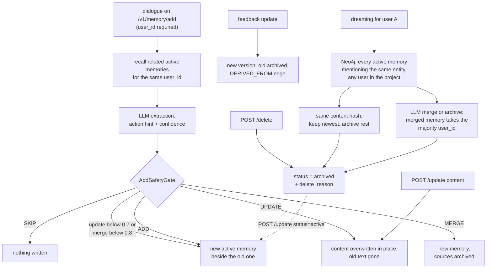

## 1. Executive Summary

MindMemOS is a memory service for agents: a FastAPI server over Qdrant, Neo4j
and Kafka that extracts memories from dialogue with an LLM, retrieves them by
hybrid search, and corrects them through explicit updates, model-planned
feedback and an offline consolidation pass it calls dreaming. What is notable
is the project boundary, derived from the credential and applied at two layers,
and the discipline of routing every write through one mutation plan. What is
weak is everything below the project: user identity is a request field, and
dreaming consolidates across it.

Two memory algorithms share the store. *Vanilla* extracts free-text facts per
conversation chunk, after recalling related memories, and lets a deterministic
gate accept, downgrade or refuse the model's proposed action. *Schema*, the
default in the example configuration, fits dialogue into typed entities whose
dynamic properties are timelines, each value a memory with its own
`validate_from`.

The engineering is careful where it is tested. `project_id` never comes from a
request body, the store re-checks it on id reads, and a `status = active`
predicate sits on search, get, list, add-time recall, graph expansion and the
dreaming Cypher. Model-proposed updates below a confidence threshold are not
applied. Feedback corrections keep the old memory, archived, behind a
`DERIVED_FROM` edge.

The weaknesses are about scope and correction. The dreaming neighbour query
carries no user predicate and its exact-duplicate pass archives by content hash
across the cluster (section 9). List and scroll accept `user_id` and do not
apply it. Delete archives, and the original messages stay in the add record.
The paper, [arXiv:2608.12428](https://arxiv.org/abs/2608.12428) (12 August
2026), describes a schema-evolution search that is not in the tree. The
benchmark schemas are committed as presets named for LoCoMo and PersonaMem.

The licence is MIT as stated in the README; the tree carries no `LICENSE` file,
and GitHub reports no licence for the repository. MindMemOS is not a fork of
[MemOS](../memos/): it names MemOS only as a row in its benchmark tables, and
its package layout, stores and algorithms are its own.

Two marks: `scope_enforced` on the project key and `negative_eval` on a
store-level cross-project case. Section 9 names the five withheld.

## 2. Mental Model

A memory is a sentence the service extracted and believes until something
archives it. There is no candidate state: every write lands `active`, and every
read path filters on `active`. The only other stored value is `archived`, which
five different actors can set. A third literal, `delete`, is declared in
`MemoryStatus` (`typing/memory.py:39`) and has no writer.

**Vanilla: the model proposes, a gate disposes.** For each chunk of dialogue
the builder recalls related active memories for the same user by content hash,
entity overlap and BM25, and hands them to the extraction prompt
(`components/extractor/vanilla/add_recall.py:50-72`). The model returns
candidates with an action hint and a confidence. `AddSafetyGate` skips empty
content and disallowed types, downgrades an `update` below 0.7 or a `merge`
below 0.8 to a plain `ADD`, and downgrades an update without a target
(`_safety_gate.py:71-150`). The downgrade is conservative about overwriting and
generous about duplicating: an uncertain correction becomes a second active
fact beside the one it meant to replace.

**Schema: a property value is a point on a timeline.** An entity type from a
preset JSON defines static and dynamic properties. Each extracted value becomes
a memory carrying `entity_id`, `property_name` and a `validate_from` taken from
the property's own time, and `TemporalEntity` reassembles the timelines at
search time (`components/memory_modeling/schema/temporal_entity.py:109-126`).
Entity ids are `uuid5(project_id, type, name)` (`components/id.py:35-39`), so
one entity node is shared by every user in a project.

**Five ways a memory stops being believed**, all ending in `status = archived`:
an API delete; a vanilla merge, which archives its sources; an explicit or
implicit feedback update or delete; a dreaming merge, archive or
exact-duplicate pass; and an API update that sets `status` itself. Two
corrections do *not* archive: an API update of `content`, and a vanilla
`UPDATE`, both of which overwrite the text in place
(`pipelines/memory_db/writer.py:314-317`). The same verb therefore keeps
history on one path and destroys it on two.

**Archiving is reversible by anyone with the key.** `UpdateRequest.status`
accepts `active` (`api/schemas.py:269`), and the update pipeline lets a
non-active memory through when the request sets it
(`pipelines/update/default.py:34`).

## 3. Architecture

The server package `src/mindmemos` is FastAPI routes over a service facade,
pipelines registered by name, components (chunker, extractor, searcher, text
processing) and an infrastructure layer for Qdrant, Neo4j and Kafka. The SDK
(`src/mindmemos_sdk`) is an HTTP client and CLI; the eval package
(`src/mindmemos_eval`) drives LoCoMo, LongMemEval, MemoryAgentBench,
MemoryArena, PersonaMem and SpreadsheetBench against a running server.

**Qdrant is the source of truth.** One memory collection carries a dense
`semantic` vector and a sparse `bm25` vector per point, plus payload indexes on
the scope and time fields (`infra/db/filters.py`). Beside it sit collections for
entities, sources, add records, search records, the schema add buffer, provider
bindings and skill versions. An optional namespace mode splits collections by
vector dimension, not by project (`tests/infra/db/test_project_collection_namespace.py:85-91`).

**Neo4j is a graph mirror.** `Memory`, `Entity` and `Source` nodes are keyed on
`(project_id, id)`; a `Memory` node carries its content and status and no user
field (`infra/db/models.py:196-208`). Edges are `MENTIONS`, `RELATES_TO`,
`DERIVED_FROM`, `HAS_PROPERTY_MEMORY` and `NEXT_IN_PROPERTY_TIMELINE`. A write
with `consistency="fast"` tolerates a failed graph write and reports
`graph_pending`; `strong` raises.

**Kafka carries every deferred operation**: async add, schema episode drain,
feedback, dreaming and skill evolution each have a topic and a worker
(`workers/`). Tasks for one buffer key are serialised on one partition by
`dispatch_key`.

**Every mutation is a `MemoryDbMutationPlan`**, applied by one writer that
prefetches the affected points with project scoping and then updates, archives
or upserts (`pipelines/memory_db/writer.py:98-168`). Entity, source and
relationship deletes are declared in the plan and reported as unsupported.

### Deployment and ergonomics

Self-hosting means Qdrant, Neo4j and Kafka, started by `make dev` through
`dockers/docker-compose.memory.yml`, plus a chat model, an embedding model and
optionally a reranker behind LiteLLM routers. Nothing is stored without a chat
model: extraction is an LLM call on both algorithms. An optional stack adds
ClickHouse, an OpenTelemetry collector and Grafana dashboards. API keys and
their project bindings are a YAML file reloaded on change. The same code runs
the hosted service at `mindmemos.cn`, and the SDK and plugins target either by
`base_url`. The store is inspectable through Qdrant and Neo4j browsers; a
memory's text is readable, but its entity timeline is spread across points and
edges.

## 4. Essential Implementation Paths

**Add, service.** `POST /v1/memory/add` → `MemoryService.add`
(`api/services/memory_service.py:158-187`) builds the context with
`require_user_id=True`, writes an add record with status `processing` or
`queued`, and calls the pipeline chosen by the key's `memory_algorithm`.

**Add, vanilla.** `VanillaAddPipeline.add_sync` →
`AddCoreBuilder.build` (`components/extractor/vanilla/add_builder.py:456`):
group turns into chunks under token budgets, compact long turns with a summary,
list up to `scan_limit` active memories for the user once per batch
(`add_recall.py:79-87`), recall per chunk, extract, dedup across chunks, gate,
and plan writes. Update, reinforcement and merge-archive commands are built by
pure factories (`_update_commands.py:16-88`).

**Add, schema.** `SchemaAddPipeline` (`pipelines/add/schema/schema_add.py`)
buffers messages, splits episodes, selects entity types from the preset, and
resolves each extracted entity against existing ones by vector recall and an
LLM merge decision before planning property memories
(`components/extractor/schema/schema_planner.py`).

**Search.** `POST /v1/memory/search` → `SearchPipelineImpl.search`
(`pipelines/search/pipeline.py:59-85`) picks the vanilla or schema engine,
optionally wraps it in an agentic loop, then reranks and truncates or packs to
a token budget. The vanilla engine runs Qdrant RRF over dense and sparse
prefetches, appends one-hop graph neighbours that pass the same filter in
Python, attaches `DERIVED_FROM` lineage ids and dedups by text
(`pipelines/search/vanilla/engine.py:96-182`, `:262-266`).

**Get, list, scroll.** `MemoryCatalog` (`pipelines/memory_db/catalog.py:29-104`)
applies the request DSL plus `status = active`, unless `include_inactive` is set.

**Delete.** `DefaultDeletePipeline.delete` → `_delete_memory_command`
(`pipelines/memory_db/writer.py:409-445`): patch `status`, `status_changed_at`
and `metadata.delete_reason`, then archive the Neo4j node.

**Update.** `DefaultUpdatePipeline.update` (`pipelines/update/default.py:21-54`)
→ `_update_memory_command` (`writer.py:294-397`), which re-embeds and overwrites
`content` when given.

**Feedback.** `FeedbackActionExecutor` (`pipelines/feedback/executor.py:51-215`)
applies model-planned `add`, `update` and `delete`. An update writes a new
memory with `parent_ids`, a `DERIVED_FROM` edge, and archives the target with
`derived_to` in its metadata.

**Dreaming.** `POST /v1/memory/dreaming` queues a Kafka task
(`pipelines/dreaming/default.py:112-122`). `_consolidate_memory` clusters hot
memories by shared entity, archives exact duplicates, asks one LLM call to
detect issue groups and another to plan creates, merges, updates, archives and
links, then marks the seed add records `consolidation_status = done`
(`:151-213`, `:408-440`, `:678-760`).

## 5. Memory Data Model

| Field | Notes |
| --- | --- |
| `memory_id` | `uuid5(project_id, request_id, content_hash)` on add, so a retried request upserts the same point (`components/id.py:42-50`); `uuid4` on feedback and dreaming |
| `account_id`, `project_id`, `api_key_uuid` | from the credential |
| `user_id`, `app_id`, `session_id`, `agent_id` | from the request body |
| `content`, `metadata.content_hash` | normalised text and its hash over the text alone |
| `mem_type` | `profile`, `fact`, `experience`, `episodic`, `tool_trace`, `skill_candidate`, `file_knowledge` |
| `mem_extract_type`, `mem_extract_version` | which algorithm and prompt wrote it |
| `status`, `status_changed_at` | `active` or `archived` in practice |
| `validate_from` | event time from the message or property; `validate_to` is declared, indexed and filterable, and nothing assigns it |
| `reinforcement_count` | incremented when a duplicate is re-extracted |
| `parent_ids`, `root_id` | lineage on feedback and dreaming writes |
| `property_name`, `entity_id`, `entity_type` | schema algorithm |
| `created_at`, `update_at` | record time |

The type is `MemoryWrite` (`typing/memory.py:420-452`). Scope is the project on
every point and the user where the request supplied one. Provenance is
`request_id` and, for schema memories, `SourceRef` links to the originating
messages; there is no author field distinct from the request's `user_id`.

**The add record holds the input.** `add_record_v1` stores the request
messages, skill bindings and the per-memory output events, and is patched as
the request moves through `queued`, `processing` and a terminal status
(`pipelines/memory_db/operation_records.py:71-184`). Archiving a memory does not
touch it.

## 6. Retrieval Mechanics

Retrieval is explicit: an HTTP search, a CLI call, or a plugin hook before each
turn. The vanilla engine encodes the query both ways, prefetches up to a
configured factor of the recall size from each arm, and fuses with Qdrant's
RRF. The graph step takes the top seeds, follows `RELATES_TO` and shared
`MENTIONS` one hop in Neo4j, hydrates neighbours by id and keeps only those
that satisfy the request filter in Python (`engine.py:266`). That re-check is
what keeps the graph arm inside a `user_id` filter Neo4j cannot evaluate.

`SearchFinalFilter` applies an optional reranker and a score threshold, then
truncates to `top_k`. With `token_budget` set, `MemoryRetentionSelector` scores
candidates on relevance, query-term overlap, recency and token cost and packs
greedily under a strict budget (`components/searcher/memory_retention.py`).

**The status predicate is on every read in the tree.** Search goes through
`_active_memory_filter` (`pipelines/memory_db/reader.py:179-180`), the catalog
through `_active_filter`, add-time recall and BM25 recall through their own
clause (`add_recall.py:83`, `:149`), and the Neo4j neighbour queries through
`coalesce(status,'active') = 'active'` (`reader.py:243`, `:318`).

**The user predicate is not.** Search applies `user_id` only when the request
carries it (`api/mappers.py:97-100`); `app_id`, `session_id` and `agent_id` are
stripped from search input and never filter it (`:96`). The OpenClaw plugin
passes `--user-id` only when configured (`plugins/openclaw-plugin/src/index.ts:192-194`).
List and scroll accept `user_id` through `ActorIdentityRequest`, whose
docstring calls it identity *"that scope[s] memory operations"*
(`api/schemas.py:82-92`); the mapper strips it (`api/mappers.py:140`, `:151`)
and the catalog never reads it. The SDK fills it with the configured user, so a
user-scoped list from the SDK returns the project. Read, not reproduced.

Lineage rides on results. Each hit carries `derived_from_memory_ids` from a
`DERIVED_FROM*1..` walk (`infra/db/neo4j.py:263-281`). The `archived` lineage
role keys on a hit source, `lineage_archived`, that nothing produces.

## 7. Write Mechanics

Writes happen on the hot path in sync mode and in a Kafka worker in async mode;
the plugins default to async. Every add is an LLM extraction: vanilla sends each
chunk with recalled context and packed history, schema selects entity types,
extracts, resolves entities and plans property memories.

**Duplicate detection is exact, partial, and scoped to the user.** The hash
check scans the first `scan_limit` active memories for the user, 100 by
default, in Qdrant's scroll order rather than by recency (`add_recall.py:79-97`).
The entity-overlap channel reads the same window. Beyond it a re-stated fact
reaches the model as a BM25 candidate or not at all. A duplicate the model marks `reinforce` increments
`reinforcement_count`, idempotent per request id (`_update_commands.py:16-34`).

**Correction is three semantics under one vocabulary.** Vanilla `UPDATE` and
the API update overwrite. Vanilla `MERGE` writes a new memory and archives its
sources. Feedback and dreaming write a new memory with lineage and archive the
parent. Only the last two can answer what a memory said before.

**Nothing blocks a deleted value from returning.** Add-time recall reads only
active memories, so a fact the user deleted is absent from the context the
extractor sees, and the same sentence in a later conversation is extracted
fresh.

### Operational cost

- Write: sync mode blocks on one or more LLM calls per chunk plus embedding;
  async mode returns `queued` and the memory is searchable when the worker
  finishes. On the schema path async messages wait in `schema_add_buffer_v1`
  until the chunker closes an episode; the example config uses rule splitting
  with a 50-message cap and a 999,999-minute time cut, so the lag is set by
  message count. That was read from configuration, not measured.
- Background: dreaming reads a lookback window of add records, then two LLM
  calls per entity cluster; it never sweeps the whole store, and nothing
  schedules it.
- Read: one embedding, one Qdrant query, optional Neo4j hops and rerank. The
  plugin prepends up to `topK` memories, 5 by default, to each prompt, which
  changes the prompt prefix every turn.

## 8. Agent Integration

The OpenClaw and DeepSeek Harness plugins run the SDK's `mindmemos` CLI as a
subprocess: `before_prompt_build` searches with the user's message and prepends
a `<relevant-memories>` block, and `agent_end` stores the last turn only
(`index.ts:119-160`). A subagent session gets a preamble telling it the memories
belong to someone else (`:357-372`). Tool-call text is flattened into the
stored messages so skill usage can be detected and bound to the add record.

`skills/mindmemos-cli/SKILL.md` hands an agent the full verb set — add, search,
get, update, delete, feedback, dreaming — and tells it when to use each. Delete
needs `--yes`, which is a flag the agent types. Skill evolution produces
`draft` versions that the client applies with `mindmemos skill update`, a verb
on the same CLI.

## 9. Reliability, Safety, and Trust

**Project isolation is the strongest thing here.** The project is bound to the
credential, stamped on writes after `ensure_project` refuses a mismatched write
(`mappers/db.py:50-54`), forced into every Qdrant filter, re-inserted at the
store, and re-checked on id reads. A schema-search filter naming a different
project is rejected rather than ignored (`mappers/search_filters.py:93-98`).

**Dreaming crosses the user boundary.** The activity collector selects seed
memories for the requesting user (`pipelines/dreaming/default.py:229-240`). The
Cypher that expands them matches every active `Memory` in the project that
`MENTIONS` the same entity, with no user predicate, and Neo4j nodes carry no
user field to filter on (`:257-283`). The hydrated cluster is filtered by status
only (`:355-361`). Two consequences follow, read and not reproduced:

- `_apply_exact_duplicate_archives` groups the cluster by `content_hash`, a hash
  of the text alone, keeps the newest and archives the rest with
  `duplicate_of:<id>` (`:408-440`). Two users who both said *"I like iced
  Americanos"* about the same entity keep one memory between them, and it
  belongs to whichever was written last.
- The planning prompt sees content, entity and time for each memory and no
  owner (`:479-507`). A merged or created memory takes the most common
  `user_id` among its sources (`:797`, `:832`), so a minority user's fact can
  be archived into another user's memory.

A dreaming request without `user_id` seeds from the whole project, which makes
the same path a project-wide consolidation.

**Deletion is soft.** The public delete archives, and the Qdrant and Neo4j hard
deletes exist in the store with no caller outside tests. The original messages
remain in the add record, and search records keep queries and results. There
is no erase path for a user.

**Audit is partial.** Add and search requests are recorded; update, delete,
feedback and dreaming are not, and recording failures are logged and swallowed
(`operation_records.py:213-220`).

**Uncertainty is not representable.** Confidence gates two actions at write
time and is kept in metadata; no status says "on record, not believed".

Capability marks:

- `scope_enforced` — awarded on the project key; evidence in the frontmatter.
  The user key is caller-supplied and unevenly applied, as above.
- `negative_eval` — awarded; evidence in section 10.
- `tombstone` — none. Archival is keyed on the point; add-time recall excludes
  archived memories, so it cannot see a rejected value to refuse it.
- `trust_state` — `active` and `archived` is a lifecycle axis and it does
  filter everywhere, but there is no candidate state and no path that holds a
  memory as recorded and unconfirmed; every write lands active.
- `bitemporal` — `validate_from` is event time beside `created_at`, and the
  search DSL accepts ranges on it. `validate_to` has no writer, and
  `TemporalEntity.get_property_at_time` has no production caller, so no read
  answers what held at a date.
- `audit_log` — `add_record_v1` records add requests and their output events
  but is patched in place, and direct update, delete, feedback and dreaming
  write nothing to it.
- `human_review` — no memory waits for anyone. Every correcting verb is on the
  CLI the shipped skill hands the agent.

## 10. Tests, Evals, and Benchmarks

I read the tests at the pin and ran none of them. The suite is 1,242 test
functions in 152 files. Most use fakes for Qdrant, Neo4j, Kafka and the model;
a few use `AsyncQdrantClient(":memory:")`. Two functions call a live model and
skip without `--run-llm` (`tests/conftest.py:26-34`). CI runs
`pytest tests/mindmemos_sdk` on an SDK publish and nothing else
(`.github/workflows/publish-mindmemos-sdk.yml:35`).

**The negative case.** `test_project_collection_namespace.py` stores points
under two projects in a real in-process Qdrant and asserts a read by id from the
wrong project returns `None`, after a positive read of the same point
(`:44-48`, `:113-119`). The dense searches in the same file use orthogonal
vectors with `limit=1`, so they would pass without the project filter.

**Scope and status, by construction.** `tests/api/test_search_user_scope.py:55-71`
asserts that a request `user_id` becomes a mandatory `match` in both engines'
filters even when the DSL names another user under `OR`. It inspects the filter
tree and cannot observe retrieval. `test_writer.py` asserts delete patches
`status = archived` and archives the Neo4j node (`:628-657`). No test drives an
archived memory through search, and no test covers dreaming with two users.

**The gate.** `tests/pipelines/add/test_safety_gate.py` covers the thresholds
and downgrades.

**Benchmarks.** `src/mindmemos_eval` runs each benchmark against a live server
and scores LoCoMo with an LLM judge and optional majority vote
(`memory/scorer.py:99-166`). No run output is committed; `docs/eval/README.md`
writes manifests to a `reports/` directory absent from the tree. The README
tables, LoCoMo 94.03 and PersonaMem 70.63 for the schema algorithm, match the
paper's abstract and cannot be recomputed from the repository. The eval configs
point at `config/presets/entity_modeling_locomo.json` and
`entity_modeling_persona.json`, while the deployable default is
`schema_general.json` (`config/mindmemos/dev.example.yaml:153`).

**The paper.** [arXiv:2608.12428](https://arxiv.org/abs/2608.12428), submitted
12 August 2026, names a MindMemEvolve algorithm that *"employs
validation-driven evolutionary search to optimize memory schemas"*. No file in
the tree names it or implements a schema search; the benchmark presets are
committed as JSON. The paper also calls implicit feedback a human-in-the-loop
signal, where the code runs it as a model-planned mutation with no approver.

## 11. For Your Own Build

### Steal

- **Resolve the tenant from the credential and check it again at the store.**
  A filter builder that always prepends the key, and an id read that discards
  any point whose payload names another tenant, are two independent layers.
- **Let a gate downgrade what the model proposes.** Confidence thresholds on
  update and merge, and "no target means add", keep an extractor from
  overwriting on a guess.
- **Re-apply the request filter to graph-expanded hits.** When the graph cannot
  evaluate a predicate, hydrate and filter in the application.
- **Correct by versioning, not overwrite.** Write the new memory, archive the
  old, link them, and return lineage with each hit.

### Avoid

- **Consolidation that selects neighbours by a shared entity without the
  scope key.** Seeds scoped to a user do not scope their neighbours, and a
  dedup by text hash turns two users' identical sentences into one owner.
- **Accepting a scope field and not applying it.** A body field the SDK fills
  and the server strips reads as a filter to every caller.
- **Three meanings of update.** If one correction path keeps history, make
  them all keep it.
- **A soft delete that leaves the source messages in a sibling collection.**

### Fit

This suits a team running a multi-project memory service for agents, with
Qdrant, Neo4j and Kafka already acceptable to operate and a model budget for
extraction on every turn. Treat the project as the tenant, give each end user
their own project if users must not see each other, and do not run dreaming on
a shared project until its neighbour query carries a user predicate. A single
developer wanting local memory for one coding agent will find the stack large
for what it stores.

## 12. Open Questions

- Does the schema search path keep entity descriptions, which are rewritten from
  memories of every user in a project, out of another user's results?
- Would the dreaming planner merge across users in practice, given it cannot see
  them? Running two users with overlapping entities would settle it.
- What does the episode chunker do with a partial episode when no more messages
  arrive?
- Which schema preset does the hosted service use, and how was it produced?
- Is the `lineage_archived` hit source planned, or left from an earlier design?

## Appendix: File Index

- **Types and storage:** `src/mindmemos/mindmemos/typing/memory.py`,
  `typing/memory_db.py`, `infra/db/models.py`, `infra/db/collections/`,
  `infra/db/engine.py`, `infra/db/neo4j.py`, `infra/db/filters.py`,
  `mappers/db.py`, `components/id.py`.
- **Write path:** `pipelines/add/vanilla/vanilla_add.py`,
  `components/extractor/vanilla/{add_builder,add_recall,_safety_gate,_update_commands}.py`,
  `pipelines/add/schema/schema_add.py`, `components/extractor/schema/`,
  `components/memory_modeling/schema/temporal_entity.py`,
  `pipelines/memory_db/writer.py`, `pipelines/memory_db/operation_records.py`.
- **Retrieval:** `pipelines/search/{pipeline,default}.py`,
  `pipelines/search/vanilla/engine.py`, `pipelines/search/schema/engine.py`,
  `components/searcher/`, `pipelines/memory_db/{reader,catalog}.py`,
  `mappers/search_filters.py`.
- **Correction and background:** `pipelines/{update,delete}/default.py`,
  `pipelines/feedback/executor.py`, `pipelines/dreaming/default.py`, `workers/`.
- **API and auth:** `api/routes.py`, `api/schemas.py`, `api/mappers.py`,
  `api/services/memory_service.py`, `api/auth/`, `config/mindmemos/api_keys.yaml`.
- **Integration:** `plugins/openclaw-plugin/src/index.ts`,
  `plugins/deepseek-harness-plugin/src/index.ts`, `skills/mindmemos-cli/SKILL.md`,
  `src/mindmemos_sdk/mindmemos_sdk/memory/`.
- **Tests and evals:** `tests/infra/db/test_project_collection_namespace.py`,
  `tests/api/test_search_user_scope.py`, `tests/pipelines/add/test_safety_gate.py`,
  `tests/pipelines/memory_db/test_writer.py`, `src/mindmemos_eval/`,
  `config/presets/`.

### Recorded searches

Checked against the checkout at the pinned revision.

- `grep -rn 'validate_to' --include='*.py' src | grep -v prompts/` — declarations, a payload index, a DSL allowlist, two pass-throughs and a prompt line; no assignment.
- `grep -rnE 'get_property_at_time|get_property_in_range|filter_by_time|get_properties_in_range' --include='*.py' src` — `filter_by_time` and `get_properties_in_range` from the schema search expander; `get_property_at_time` only inside `temporal_entity.py`.
- `grep -rn 'user_id' src/mindmemos/mindmemos/infra/db/neo4j.py` — no match; in `pipelines/dreaming/default.py`, the dispatch key, the activity scope and the two `_most_common` assignments.
- `grep -rnE 'record_add\(|mark_add_completed\(|append_add_output\(|record_search\(' src` — add pipelines, the add and drain workers, and the service's search path; nothing in update, delete, feedback or dreaming.
- `grep -rnE 'qdrant\.delete_memory|delete_memory_node\(' src | grep -v 'def '` — no match.
- `grep -rn 'lineage_archived' src` — the two readers in `pipelines/search/vanilla/engine.py`; no producer.
- `grep -rniE 'tombstone|blocklist|blacklist|rejected' --include='*.py' src` — LLM router error strings, a skill-evolution log line and a skill prompt; nothing on memories.
- `grep -rniE 'approv|review' src/mindmemos/mindmemos --include='*.py' | grep -v prompts/` — no match.
- `grep -rniE 'memevolve|evolutionary|schema_evol' . --exclude-dir=.git | grep -v uv.lock` — no match; `schema learning` appears in the two READMEs only.
- `grep -rliE 'arxiv|bibtex|@misc|doi\.org|CITATION' . --exclude-dir=.git | grep -v uv.lock` — `README.md` and `README_ZH.md`.
- `find . -iname 'licen*' -not -path './.git/*'` — no match.
- `grep -n pytest .github/workflows/*.yml` — `publish-mindmemos-sdk.yml:35`, `tests/mindmemos_sdk` only.
- `find . -path ./.git -prune -o -type d -name reports -print` — no match.

## History

**2026-09-30** — [`186db4a75122b1d8691933f280bec10191c82c28`](https://github.com/mindscale-noah/MindMemOS/commit/186db4a75122b1d8691933f280bec10191c82c28) — first reading, at the head of `main`, a merge of `develop` dated 29 August 2026. Two marks, `scope_enforced` and `negative_eval`. Screened before reading: 0 auto-run surfaces, 4 build-time execution points (`Makefile`, two plugin `prepublishOnly` scripts, `tests/conftest.py`), 0 dependency files inside the cooldown, and 5 unpinned surfaces (three workspace `pyproject.toml` files beside a root `uv.lock`, and two plugin manifests with lockfiles). `skills/mindmemos-cli/SKILL.md` and its references were read as data. Read with `grep` and `sed` from a depth-1 clone, history from the GitHub API; nothing installed, built or run.
