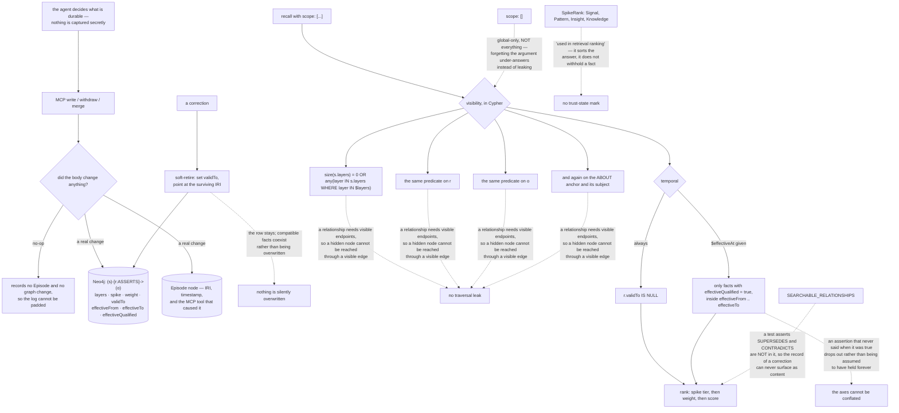

## 1. Executive Summary

Mindreader is an MCP memory server in Rust over Neo4j — MIT, version 0.7.2,
20,225 lines across 24 files, published as a crate, an npm package and a Docker
image. Its thesis is on the first line of the README and it is a refusal:

> "Mindreader gives AI agents a memory they must curate, not a history they can
> search."

The argument is that most agent memory starts from an archive and asks how to
retrieve the right passage later, where this one asks "[w]hat did this agent
learn that is important enough to become durable knowledge?" Each memory is an
explicit relationship — `project → uses → Neo4j` — and the consequences are
stated as commitments: "**No facts are captured secretly.** Mindreader never
listens to conversations or extracts facts on its own", and "**Nothing is
silently overwritten.**"

**The mechanism to take away is the scope default.** Layer memberships are
stored on nodes and edges, and the request carries a union of layer ids. What
makes it unusual is what an empty request means:

> "Empty `scope` is global-only. Named ids form an OR union."

Most systems in this corpus treat an omitted scope as *everything*, which is why
the atlas keeps finding stores where forgetting the argument returns another
project's memories. Here forgetting it returns the global layer and nothing
else, so the accident is an under-answer rather than a leak. The predicate is
thorough too: the visibility check is repeated for the subject, the relationship
and the object, and again for the `ABOUT` anchor and its subject, because
"[r]elationship visibility also requires visible endpoints (enforced in Cypher)."

**The second thing worth copying is a one-line test.** `SUPERSEDES` and
`CONTRADICTS` are asserted *not* to be in `SEARCHABLE_RELATIONSHIPS`. The edges
that record one fact replacing another are bookkeeping about the memory, not
memory, and a store that let them surface as results would hand an agent the
history of a correction as though it were the correction.

**The gap is the epistemic vocabulary.** `SpikeRank` grades a fact as `Signal`,
`Pattern`, `Insight` or `Knowledge`, and its doc comment is precise about what
that does: "Epistemic fact classification used in retrieval ranking (Knowledge
highest)." It sorts. A lone unconfirmed `Signal` still comes back, below the
better-founded facts — the same shape the atlas found one report earlier in
[OKF Agent Memory](../okf-agent-memory/), where the only trust field retrieval
consulted was one that promoted.

## 2. Mental Model

A **fact** is a relationship the agent chose to keep, not a passage it captured.

A **layer** is a visibility membership, and asking for none shows you the global one.

A **retirement** sets `validTo`; the row stays and points at its successor.

A **spike** ranks how well-founded a fact is, and ranking is all it does.

An **Episode** exists only when something actually changed.

## 3. Architecture

| Area | Role |
| --- | --- |
| `src/layers.rs` | Layer-id validation and the visibility-union policy, in one place |
| `src/search.rs` | The Cypher that ranks, and the visibility predicate repeated across it |
| `src/graph.rs` | Bootstrap, writer order, Episode provenance, node serialization |
| `src/merge.rs` | Duplicate detection and soft retirement with expected-row assertions |
| `src/mutation.rs` | What counts as a change, and what a no-op must not record |
| `src/vocabulary.rs` | Which relationships may be searched, and the test that pins it |
| `src/semantic.rs` | Similarity fusion with a bounded, penalized structural context |

## 4. Essential Implementation Paths

`src/layers.rs:1-6` — the visibility policy stated before any code implements
it.

`src/search.rs:503-534` — the same predicate applied to subject, relationship,
object and anchor, beside the `effectiveQualified` gate.

`src/vocabulary.rs:135-136` — two assertions that keep correction bookkeeping
out of search.

`src/graph.rs:1195-1226` — an Episode, and the tool it is attributed to.

`src/mutation.rs:76` — what a no-op must not write.

`src/merge.rs:641-655` — a retirement that checks it affected exactly the number
of relationships it expected, and fails loudly otherwise.

## 5. Memory Data Model

Entities and the `ASSERTS` relationships between them, each carrying layer
memberships, a spike classification, a weight, `validTo` for store validity, and
optional `effectiveFrom`/`effectiveTo` with an `effectiveQualified` flag.
Classes and properties form a catalog forced to `layers = []` so the schema
stays global. Episodes hang off mutations as provenance.

## 6. Retrieval Mechanics

Lexical and label matching fused with semantic similarity and a bounded
structural context that is penalized rather than boosting evidence, ranked by
spike tier, then weight, then score. Every leg carries the visibility predicate
and the `validTo IS NULL` filter.

## 7. Write Mechanics

Writes arrive only through MCP tools and only for what the agent decides to
keep. Corrections coexist with what they correct; withdrawal and duplicate merge
soft-retire by setting `validTo` and recording the survivor. Merge operations
count the rows they touched and raise when the count disagrees with what was
planned — "duplicate retirement affected {retired} relationships; expected
{expected}".

## 8. Agent Integration

One MCP server distributed as a Rust binary, a crate, an npm package and a
Docker image, with a bundled agent skill and a `mcp.json`. Every tool defaults
to a concise response "to minimize result tokens", with `detail:"detailed"`
available when handles, memberships, ranking or audit metadata are needed.

## 9. Reliability, Safety, and Trust

The strong parts are the scope default, the endpoint-closure check, the
correction edges kept out of search, and the row-count assertions on merges. The
limits are that the layer check is visibility rather than authorization — no
identity stands behind the requested union — and that the epistemic
classification only sorts.

## 10. Tests, Evals, and Benchmarks

Tests live inline with the code, including assertions over the generated Cypher
itself: that the query does not contain a particular label branch, that it does
not use `collect(`, and that the searchable-relationship list excludes the
correction edges. There is a CPU-hotspot benchmark. There are no committed
must-not-retrieve cases at the store level, which is the piece that would turn
those vocabulary assertions into a full guarantee.

## 11. For Your Own Build

Make an empty scope mean the narrowest view, not the widest. It converts the
most common scope bug from a disclosure into a missing answer.

Apply the visibility predicate to both endpoints as well as the edge. A
relationship is reachable from either end, and checking only the edge leaves the
other end reachable.

Keep your supersession and contradiction edges out of search, and write the test
that says so. They describe the memory rather than being it.

Decide whether your epistemic tiers rank or withhold, and put the answer in the
doc comment the way this one does. A reader who assumes the wrong one will trust
a `Signal` as though it were `Knowledge`.

## 12. Open Questions

Whether an as-of query should fall back to current facts when nothing is
qualified. The strict behaviour is defensible and the empty result is honest,
but an agent asking what was true last March in a corpus with no effective
bounds gets silence rather than an explanation.

Whether layers are intended to carry any authorization weight. They are a
caller-supplied union with no identity behind it, which is right for separating
a project from a task and wrong for separating two tenants.

## Appendix: File Index

| Path | What to read it for |
| --- | --- |
| `src/layers.rs:1-6` | A scope default that narrows instead of widening |
| `src/search.rs:503-534` | One visibility predicate, applied everywhere it has to be |
| `src/vocabulary.rs:135-136` | Correction bookkeeping barred from search, by test |
| `src/mutation.rs:76` | Why a no-op must leave no trace |
| `src/domain.rs:469-478` | An epistemic classification that ranks rather than gates |

## History

**2026-09-16** — [`d7d1bb39cfeb47a6cfa230511d98764437ad98ad`](https://github.com/bnomei/mindreader/commit/d7d1bb39cfeb47a6cfa230511d98764437ad98ad) — first reading, at a commit dated 13 September 2026. Screened before opening, from a shallow clone: six files scanned, one auto-run surface, no build-time execution points, no unpinned surfaces and three dependency files inside the seven-day cooldown, with `Cargo.lock` present. `AGENTS.md` is addressed to a reading agent and was recorded as data. Nothing was installed, built or run, and no Neo4j server was started, so the Cypher described here is read from the source strings rather than executed.
