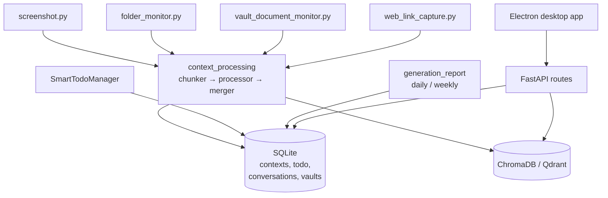

## 1. Executive Summary

MineContext is a local-first desktop assistant that watches what you do —
screenshots, monitored folders, vault documents, web links — and turns it into
seven typed context stores plus generated daily and weekly reports. It is a
ByteDance/Volcengine project, shipped as an Electron app over a FastAPI server
with SQLite and a vector backend.

Architecturally it is [MIRIX](./mirix/)'s neighbour: passive multimodal capture,
typed memory, LLM extraction, a local database. Two things make it worth its own
entry.

**It models prospective memory**, which
[one other system in this atlas](../../compare/#the-category-almost-nothing-models-prospective-memory)
does — memory of what the agent has *undertaken to do* rather than of what
happened. MineContext has a `todo` table with `content`, `start_time`,
`end_time` as a deadline, `urgency`, `assignee`, `reason`, and a `status` integer
whose only two values are pending and completed, with `update_todo_status`
stamping `end_time` on completion. It also has an `INTENT_CONTEXT` type for
"future plans, goal setting, and action intentions", and a `ContextProperties`
model whose `event_time` field is documented as "event occurrence time, **can be
future**".

**And the way it gets those commitments is different from NOOA's in a way that
matters.** NOOA's are declared — the user or agent states an intent. MineContext's
`SmartTodoManager` *generates* them: it reads recent activity insights, pulls the
relevant contexts, checks historical todo completion, and asks a model to extract
tasks with due dates and priorities. It remembers commitments you did not make.

The weaknesses are of a piece with that. There are **no tests** in the Python
package. Contexts and todos carry no scope key. Nothing in the desktop UI is wired
to the delete endpoint the server exposes, so a wrong inferred commitment has no
review path. And a confidence integer is doing the work a trust state would.

## 2. Mental Model

A memory is a **typed context**, and the type is a claim about what kind of thing
was learned:

```text
ENTITY_CONTEXT      who or what an entity is
ACTIVITY_CONTEXT    behavioural trajectories, completed tasks
INTENT_CONTEXT      future plans, goals, action intentions
SEMANTIC_CONTEXT    knowledge, concepts, principles
PROCEDURAL_CONTEXT  operation patterns and task procedures
STATE_CONTEXT       current status, progress, indicators
KNOWLEDGE_CONTEXT   file-derived context
```

Each type carries a written `purpose` in `ContextSimpleDescriptions` and a longer
`ContextDescriptions` entry with `key_indicators` used to classify. Making the
taxonomy a documented artifact the classifier reads is a better practice than
hiding it in a prompt string, and it is close to what
[GenericAgent](./genericagent/) does with written axioms.

The data model keeps evidence:

```text
ContextProperties
  raw_properties: list[RawContextProperties]   ← the source, retained
  create_time      when the system recorded it
  event_time       when it happened — may be in the future
  update_time, call_count, merge_count, duration_count
ExtractedData
  title, summary, keywords, entities, context_type
  confidence: int
  importance: int
```

`create_time` and `event_time` are genuinely separate, and `event_time` is
explicitly allowed to be future — which is the closest this atlas has seen to
using a temporal model to express prospective memory rather than bolting on a
reminder table. The flag for
[bi-temporal validity](../../patterns/bi-temporal-fact-validity/) is still
withheld: there is no validity *interval* to close and no supersession chain, so a
superseded context has no `invalid_at` to write.

Alongside the contexts, todos have the one real lifecycle in the system:

```text
todo:  status 0 (pending) ──update_todo_status(1)──► completed, end_time stamped
```

Everything else is created, merged, and possibly deleted. There is no candidate,
verified, rejected or superseded state, and `confidence` is an integer that
nothing gates on.

Memory is entirely **automatic**. The user starts recording; the system decides
what is worth extracting, what to merge it into, and what they have committed to.

## 3. Architecture



- **Capture** is `opencontext/context_capture/`: `screenshot.py`,
  `folder_monitor.py`, `vault_document_monitor.py`, `web_link_capture.py`.
- **Processing** is `context_processing/` — a `chunker`, a `processor`, and a
  `merger` with `context_merger.py`, `merge_strategies.py` and
  `cross_type_relationships.py`. That last file is the interesting one: merging is
  type-aware and relationships cross types.
- **Storage** is `unified_storage.py` over `sqlite_backend.py` plus
  `chromadb_backend.py` or `qdrant_backend.py`.
- **Consumption** is `context_consumption/`, holding the generation pipeline —
  `smart_todo_manager.py`, `realtime_activity_monitor.py`,
  `generation_report.py` — and the agent chat.

### Deployment and ergonomics

A desktop application. You install it, enter an API key, and press record. That is
a genuinely low barrier compared with the four containers
[MIRIX](./mirix/) wants for a similar job, and the README's privacy section
documents a local-model path.

The consequences of "desktop app" run through the rest of this report: single
user, no tenancy, no scope key, and the assumption that whoever is at the keyboard
is entitled to everything in the store.

The store is SQLite plus a vector index and is inspectable with any SQLite
browser. Repairing a wrong context by hand means finding it in the database,
because — as section 8 records — the UI does not offer it.

## 4. Essential Implementation Paths

**Capture** — `opencontext/context_capture/screenshot.py` and siblings, each
subclassing `base.py`. `RawContextProperties` records `content_format`, `source`,
`create_time`, `content_path` for image and video, `content_text` for text, and an
`enable_merge` flag.

**Processing and merge** — `context_processing/processor/` extracts
`ExtractedData` with a `context_type`, `confidence` and `importance`;
`merger/context_merger.py` and `merge_strategies.py` fold it into existing
contexts, incrementing `merge_count` and `duration_count`;
`cross_type_relationships.py` links across the seven types.

**Todo generation** —
`context_consumption/generation/smart_todo_manager.py:57`,
`generate_todo_tasks(start_time, end_time)`. It calls
`_get_recent_activity_insights`, `_get_task_relevant_contexts`,
`_get_historical_todos(days=7)` — so it knows what you already committed to and
whether you finished — then `_extract_tasks_from_contexts_enhanced`, mapping
`priority` to an integer `urgency` and parsing `due_date`/`due_time` into a
deadline stored as `end_time`.

**Todo storage** — `storage/backends/sqlite_backend.py:94` creates the table (with
in-place `ALTER TABLE` migrations adding `assignee` and `reason`), `:669`
`get_todos(status, limit, offset, start_time, end_time)`, `:712`
`update_todo_status(todo_id, status, end_time)`.

**Retrieval** — `opencontext/tools/retrieval_tools/`, including
`get_todos_tool.py`, which renders `status_label` as `"completed" if
doc.get("status") == 1 else "pending"`.

**Mutation API** — `server/opencontext.py:212` `update_context`, `:219`
`delete_context`, backed by `server/context_operations.py` and exposed at
`POST /contexts/delete` in `server/routes/context.py:69`.

**Generation** — `context_consumption/generation/generation_report.py` produces
`VaultType.DAILY_REPORT`, `WEEKLY_REPORT` and `NOTE` documents.

## 5. Memory Data Model

The good parts are the temporal fields and the retained evidence.

`ContextProperties` holds `raw_properties: list[RawContextProperties]` — the
sources an extracted context was merged from, kept underneath it rather than
discarded. That is [evidence before belief](../../patterns/evidence-before-belief/)
by composition, and the list shape means a merged context accumulates its
provenance instead of losing it. The gap is that a `RawContextProperties` records
a `content_path` and a `create_time` but no pointer back to the screenshot's
pixels once the file is rotated, so provenance is as durable as the capture
directory.

`create_time` versus `event_time` is the other good decision, and the comment
"can be future" is what elevates it. Most systems treat the two timestamps as a
correctness detail for backfill; MineContext uses the separation to represent
things that have not happened.

`call_count`, `merge_count` and `duration_count` are usage counters — a
reinforcement signal in the [decay and reinforcement](../../patterns/decay-and-reinforcement/)
family, though no decay function was found consuming them.

What is missing: **scope**. `user_id` appears in this codebase on the
`conversations` table (the chat UI's own sessions, indexed
`idx_conversations_user_page ON conversations(user_id, page_name)`) and nowhere in
the context or todo schema. Contexts and commitments are global to the
installation. For a single-user desktop app that is a defensible choice; it means
this is not a component you can put behind a shared service without adding the
boundary yourself.

Also missing: any status other than the todo's. `confidence: int` and
`importance: int` are scores, and no read path was found that gates on
`confidence` — so a low-confidence extraction is retrieved like any other.

## 6. Retrieval Mechanics

Retrieval is vector search over the typed stores plus a set of purpose-built
tools under `tools/retrieval_tools/`, of which `get_todos_tool.py` is the clearest
example: it queries by status and time window and renders a human-readable label.

Splitting retrieval into typed tools rather than one `search(query)` is a real
design choice and mostly a good one — asking "what am I supposed to do" and
"what do I know about this person" are different questions with different
rankings, and the agent picks the tool. The cost is the usual one for tool-shaped
retrieval: the model has to know which store the answer lives in, and the seven
types are close enough (`ACTIVITY` versus `PROCEDURAL` versus `STATE`) that a
misrouted query returns nothing rather than something imperfect.

There is no fusion across types and no re-ranking layer;
`cross_type_relationships.py` operates on the write side, linking contexts as they
merge, rather than expanding a query at read time.

The failure mode specific to this design is that retrieval quality depends on
classification quality, and classification is a single LLM decision made once at
write time. A fact filed as `SEMANTIC_CONTEXT` when the user will later ask for it
as `ACTIVITY_CONTEXT` is not mis-ranked; it is absent.

## 7. Write Mechanics

Writes are passive and continuous, which is the product. Screenshots and file
changes arrive without the user acting, get chunked, extracted, typed, and merged.

The merge path is the interesting half. `merge_count` and `duration_count` on
`ContextProperties` mean a context is a *running* object rather than an append —
repeated observation strengthens and extends one row rather than creating many.
Combined with `raw_properties` accumulating, that is a reasonable answer to the
volume problem passive capture creates.

Correction is where it thins out. `update_context` and `delete_context` exist on
the server, and `POST /contexts/delete` is routed. Nothing records that a context
was deleted, so the next capture pass over the same screen content will extract it
again — the standard failure this atlas keeps finding, arriving here through a
capture loop that runs continuously rather than nightly. There is no tombstone, no
supersession, and no way to tell the system that an inferred todo was never a real
commitment.

### Operational cost

- **Synchronous?** No. Capture is passive and processing is downstream.
- **Lag?** Until the processing pipeline handles the chunk; not measured in the
  repository.
- **Whole-store passes?** The report generators read a window rather than the
  whole store, and `SmartTodoManager` pulls seven days of historical todos plus
  windowed contexts — so cost scales with activity rather than with corpus size.
  Continuous screen capture makes "activity" large regardless.
- **Read path?** Per-tool limits. The generated daily and weekly reports are the
  heavier consumers.

## 8. Agent Integration

The integration surface is an Electron desktop app talking to a FastAPI server,
with routes for contexts, vaults, documents, conversations, messages, screenshots,
monitoring, completions and an agent chat. There is no MCP server, so mounting
MineContext's memory under another agent host means the HTTP API.

**The review gap is worth stating precisely, because it is the kind of thing only
reading the code shows.** The server exposes `delete_context` and a
`POST /contexts/delete` route. The desktop frontend has pages for `ai-demo`,
`files`, `home`, `screen-monitor`, `settings` and `vault` — and a search of
`frontend/src/` for a caller of that endpoint finds none. The `vault` page manages
generated documents (notes and reports), not the extracted context store.

So: a system that watches your screen, infers what you have committed to, and
provides no surface on which you can see the inferences and reject one. The
capability exists in the API and is unreachable from the product.
`human_review` is withheld.

## 9. Reliability, Safety, and Trust

Trust is two integers. `confidence` and `importance` are set by the extractor and
no gate consumes them, so a hesitant extraction and a certain one are equally
retrievable.

The privacy posture is the strong part and the README leads with it: local-first,
with a documented local-model path, which for a screen-capture product is the
right default and better than the alternative. The corresponding risk is that
everything the screen showed — credentials in a terminal, another person's message
in a chat window, a document under NDA — is candidate material for extraction into
a store with no scope key, no classification of sensitivity, and no review UI.

Prompt injection has an unusually wide surface, as with any screen-capture system:
text rendered in any visible window is input to the extractor. The specific
amplification here is `SmartTodoManager` — injected text shaped like a task can
become a `todo` row with a deadline and an assignee, which the assistant will then
surface to the user as their own commitment.

Data loss is bounded by the merge model — contexts accumulate rather than being
overwritten — and unbounded on deletion, which leaves no record.

## 10. Tests, Evals, and Benchmarks

**There are no tests.** The Python package under `opencontext/` contains no test
module, and the only files in the repository matching "test" are two frontend
TypeScript files unrelated to testing. There is no eval harness, no benchmark
directory, and no committed results.

For a 500-file project doing continuous multimodal capture and LLM extraction into
a durable store, that is the most consequential fact in this section. The
merge strategies, the seven-way type classification, the todo extraction and the
deadline parsing (`datetime.strptime` on `due_date` and `due_time` strings, inside
a `try` that falls back to a date-only parse) are all untested paths that decide
what the user is told they promised.

`examples/` compensates a little: `example_screenshot_processor.py`,
`example_document_processor.py`, `example_todo_deduplication.py`,
`example_weblink_processor.py`, `verify_folder_monitor.py` and
`regenerate_debug_file.py` are runnable demonstrations of each pipeline, and
`example_todo_deduplication.py` in particular shows the authors are aware that
inferred todos duplicate. They are examples rather than assertions; nothing fails.

The test I would want first is not about memory quality at all: extract a todo
from a document containing a date, assert the deadline. The second is the atlas's
usual one: delete a context, let the capture loop see the same screen again, and
assert what happens.

## 11. For Your Own Build

### Steal

- **Let event time be in the future.** One comment — "event occurrence time, can
  be future" — turns a temporal column into a way to represent intentions. If you
  already separate event time from record time, you are most of the way to
  prospective memory without a second subsystem.
- **Write the type taxonomy down as data.** `ContextSimpleDescriptions` and
  `ContextDescriptions` give every type a `purpose` and `key_indicators` that the
  classifier reads. A taxonomy in a config object can be reviewed, diffed and
  argued about; the same taxonomy inside a prompt string cannot.
- **Keep the raw properties as a list under the merged context.** Accumulating
  provenance through a merge is barely more work than discarding it, and it is the
  difference between a merged memory you can audit and one you cannot.
- **Check historical completion before generating new commitments.**
  `_get_historical_todos(days=7)` before extracting tasks is a small thing that
  stops the assistant re-proposing what you already did.

### Avoid

- **Do not infer commitments without a way to reject them.** A generated todo is a
  claim about the user's intentions, which is a stronger claim than a fact about
  their preferences, and it is the one most likely to be wrong. If the system can
  create them, the user needs one click to say "I never agreed to that" — and the
  system needs to remember the rejection.
- **Do not ship a delete endpoint with no caller.** The capability existing in the
  API makes it look handled in a code review and makes it unavailable to the user.
- **Do not let a confidence integer stand in for a trust state.** Nothing gates on
  it here, which means it is documentation of the extractor's mood.
- **Do not build continuous capture without tests.** The paths that decide what is
  remembered are the ones that run unattended, thousands of times, on content the
  developer never sees.

### Fit

MineContext suits an individual who wants a passive, local, single-machine
assistant that builds context from their own work and produces daily and weekly
reports from it — and who is comfortable that the memory it builds is not
reviewable. Within that brief the ergonomics are the best of the passive-capture
systems here: one app, one key, one button.

It does not suit anyone building a component. There is no scope key, no MCP
surface, no tests, and no tenancy model, and adding those means changing the
schema rather than configuring it.

The judgement that should decide it: MineContext will tell you what you promised.
Ask whether you are willing to be told that by a system with no test suite and no
way to correct it, because the inferred-commitment feature is simultaneously the
most interesting thing here and the one with the highest cost when it is wrong.

## 12. Open Questions

- **Is anything consuming `confidence` or `importance`?** No gating read path was
  found, but the vector backends' filter construction was not exhaustively traced.
- **Does anything decay `call_count`, `merge_count` or `duration_count`?** They
  are maintained and no decay function was found reading them.
- **Was the context-delete route meant to have a UI?** It is routed and
  implemented on the server, and the frontend has no caller at this commit.
- **How are screenshots retained?** `content_path` points at a file; the retention
  and rotation policy for the capture directory was not established, and it
  determines how long provenance survives.
- **What happens when the todo extractor and the user disagree?** There is no
  reject action, so the observable behaviour would need running the app.

## Appendix: File Index

**Models/schema** — `opencontext/models/context.py`, `opencontext/models/enums.py`,
`opencontext/storage/backends/sqlite_backend.py`, `storage/unified_storage.py`

**Capture** — `opencontext/context_capture/screenshot.py`, `folder_monitor.py`,
`vault_document_monitor.py`, `web_link_capture.py`, `base.py`

**Processing/merge** — `opencontext/context_processing/chunker/`, `processor/`,
`merger/context_merger.py`, `merge_strategies.py`, `cross_type_relationships.py`

**Prospective memory** —
`opencontext/context_consumption/generation/smart_todo_manager.py`,
`opencontext/tools/retrieval_tools/get_todos_tool.py`,
`storage/backends/sqlite_backend.py` (`todo` table, `get_todos`,
`update_todo_status`)

**Generation** — `context_consumption/generation/generation_report.py`,
`realtime_activity_monitor.py`

**API/UI** — `opencontext/server/opencontext.py`, `server/context_operations.py`,
`server/routes/{context,vaults,documents,screenshots,agent_chat}.py`,
`frontend/src/renderer/src/pages/`

**Examples (in place of tests)** — `examples/example_screenshot_processor.py`,
`example_todo_deduplication.py`, `example_document_processor.py`,
`verify_folder_monitor.py`
