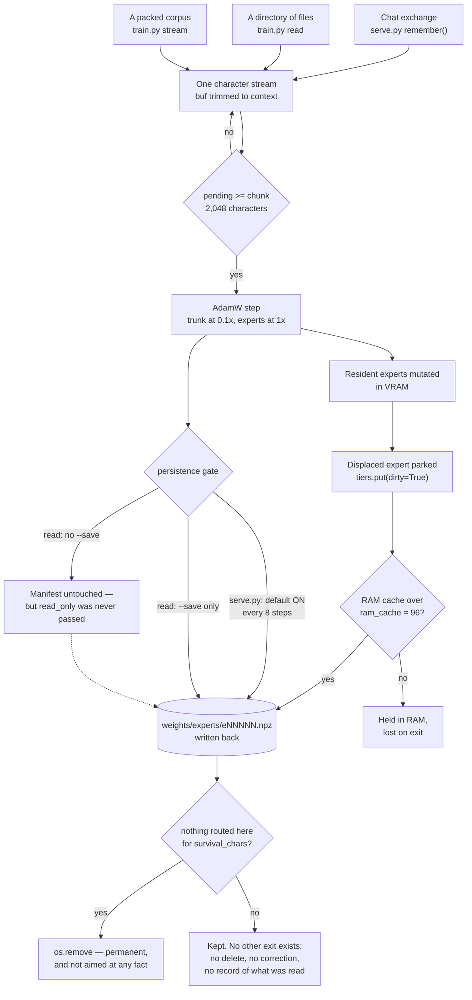

## 1. Executive Summary

mini-AGI is a byte-level language model that trains from scratch on one 8 GB
card and never stops training. It is MIT-licensed, about 10,300 lines of Python
across 31 files, and its git history begins on 19 September 2026 — three days
before this pin — while `runs/samples.txt` carries 855 evaluations over 409
million characters, so the tree is considerably older than the repository that
holds it.

It is in this atlas because of what it does with a conversation. `serve.py` is a
Flask chat server; when a reply finishes, `remember(user_text, bot_text)` marks
the exchange up in the corpus's own `<user>`/`<bot>` form and feeds it to a
`LiveLearner`, which takes an AdamW step for every 2,048 characters of stream
and writes the weights directory back to disk every eight steps. The page calls
that counter **long-term memory**, and the description is exact: there is no
store beside the weights, no record of the exchange, and no path by which
anything learned can later be named.

That makes it the second system here whose memory *is* weights, after
[Second Me](../second-me/) — and a stricter case than that one, because Second
Me keeps the documents in SQLite beside the model and can at least delete the
row. Here the granularity problem the atlas sets out under
[weights as memory](../../appendix/#weights-as-memory-at-adapter-granularity)
arrives in its pure form: the unit of identity is the whole model, a correction
has nothing to name, and the only deletion in the system removes an expert
because *nothing routed to it lately*, which is a statement about capacity and
not about truth.

The surprise is that the machinery around that store is memory-system machinery,
built carefully and for the right reasons. There are three tiers with an LRU
between them; a retrieval step that scores a per-expert key vector against the
hidden states of the text just read, with hysteresis so the working set does not
churn; a growth rule with five brakes, all five wired and all five engaged by
the shipped config; and an eviction rule that deliberately refuses to read the
gate, with the reason written down — *the smallest gates belong to the busiest
experts*, so a gate test deletes the sink and spares the dead. Read as a
capacity manager this is a good design. Read as a memory it has no scope, no
trust state, no audit of what was read, no test, and no delete.

Two findings matter more than the rest, and both are about a write reaching disk
when the operator has been told it will not. `python3 train.py read ~/notes` is
documented as *"a dry read - nothing kept"*, and `cmd_read` calls
`build_paged(wdir, device, args.resident, args.ram_capacity, args.context)`
positionally, so `read_only` takes its default of `False` whatever `--save`
says — while `build_paged`'s own docstring warns that *"paging an expert in
marks it dirty whether or not anything touched it, so a plain read would
otherwise write expert files back under the run."* And `serve.py` learns and
saves by **default**; `--no-learn` is the opt-out. The surface an engineer runs
deliberately asks permission to persist; the surface into which a person types
personal facts does not.

## 2. Mental Model

A memory here is created by being read. There is no extraction step, no
candidate state, and no moment at which a claim becomes a belief — the gradient
step *is* the transition, and it happens to every character equally.

What follows from that is the whole epistemic shape of the system. A fact the
model was told is indistinguishable at rest from a fact it inferred, from a
sentence it hallucinated in its own reply and then read back, and from the
contents of a `.env` file that happened to be under a directory somebody
pointed it at. `minagi/live.py` says so in its own header: *"Learning from a
conversation is learning partly from the model's own output"*, and the file goes
on to record that an earlier, denser variant cost about +0.65 nats on held-out
against +0.02 for real documents of the same length, and that whether the
current regime still costs anything is *"UNKNOWN and would have to be
measured."* That is an honest statement of an unmeasured risk, and it is also
the admission that the write path cannot tell the model's own invention from
evidence.

Forgetting has two meanings here and neither is the one a memory system needs.
The first is catastrophic forgetting, which the project measures and mitigates:
running the trunk at 0.1x the experts' learning rate takes the damage from
reading half a million characters of one subject from +2.2300 nats on the seven
unread subjects to +0.0067. The second is expert pruning, which deletes a file
from `weights/experts/` when nothing has admitted it to the card inside the
survival window. Neither can be aimed. You cannot forget a sentence; you can
only fail to route to a region of parameters for long enough that the region is
deleted, taking whatever else it held.

The one real gate in the design is persistence, and it is placed inconsistently.
In-process the model is mutated immediately and unconditionally; what `--save`
controls is whether `weights_store.save` runs. In `cmd_read` that gate also
holds off growth and pruning, for a stated reason — a dry read that pruned would
leave the directory naming expert files that were no longer there. The forgetting
check it prints at the end (*"reading this cost ground on the held-out set - that
is what forgetting looks like, measured rather than assumed"*) is printed
**before** the save and does not gate it: the operator decided at the command
line, before the evidence existed.



## 3. Architecture

Standing it up costs a CUDA card with 8 GB, Python 3.10 or newer, and four
packages the README names in prose — `torch numpy pyyaml matplotlib` — because
there is no dependency manifest in the tree at all. `screen_repo.py` reports
**NOTHING SCANNED**, and reading the tree by hand explains it rather than
contradicting it: 45 committed files, no `requirements.txt`, no
`pyproject.toml`, no `setup.py`, no lockfile, no Makefile, no
`.github/workflows` (only a `FUNDING.yml`), no `.gitattributes` and no
`.gitmodules`. The reference environment is named in prose as torch 2.6.0+cu124
with numpy 1.24.4, which is a pin a reader can act on and not one a tool can
check.

The store is a directory, and `minagi/store.py` opens by saying so: *"The
weights directory IS the model."* It holds `manifest.json`, `core.npz`
(embeddings, attention, norms, halting head), `routers.npz`, `optim.npz`, and
`experts/eNNNNN.npz` — one file per expert, each carrying `w1`, `w3`, `w2` and
that expert's own Adam moments. Only experts are split out, because an expert is
the unit that is paged, grown and pruned. Writes are atomic: every file is
written to a `.tmp` and renamed. There is exactly one copy — `store.py`'s
`best_val` states the reason, that a snapshot *"would double a figure that is
already 236 MB and grows with the pool"* — so the directory is both the live
model and the only fallback.

Three tiers sit above it, in `minagi/paged.py:48` (`Tiers`): disk holds the
whole pool, an `OrderedDict` keeps `ram_cache` experts as CPU tensors with true
LRU eviction, and `resident` slots hold the working set on the card. Config
defaults are 32 resident, 96 in RAM, growing from 64 experts with a 10 GB disk
ceiling — about 397 experts at 25.2 MB each.

Two entry points write to it. `serve.py` (907 lines) is a Flask app on
127.0.0.1 with a server-sent-events chat endpoint. `train.py` (2,294 lines)
carries four subcommands, of which `read` is the one the project runs and
`stream` is the same mechanism pointed at a packed corpus. `minagi/` is the
model: `paged.py` (1,124) is the pool and the paging, `pool.py` (823) the dense
pool and `AutoGrow`, `recur.py` (655) the recurrent block and the loaders,
`stream.py` (491) the corpus reader, `store.py` (451) persistence,
`plasticity.py` (358) the learning-rate controller, `live.py` (190) the live
learner, `ingest.py` (151) the file walker.

## 4. Essential Implementation Paths

**A chat turn becomes memory.** `serve.py:383` `api_chat` builds the prompt from
the message list, streams the reply under a process-wide `LOCK`, and on
completion calls `serve.py:343` `remember(last_user, "".join(reply))`. That
calls `minagi/live.py` `exchange_text` to wrap the turn in `<user>`/`<bot>`
markers — the same markup the chat corpus uses — and hands it to
`LiveLearner.feed`. Only this turn goes in; the prompt already carried the
conversation, so re-feeding it would re-read the earliest turns once per
exchange.

**A step.** `LiveLearner.feed` appends character ids to `self.buf`, and every
time `pending` reaches `chunk` it trims `buf` to the last `context` characters
and calls `_step`. `_step` runs the forward on `ids[:-1]` predicting `ids[1:]`,
clips the gradient to 1.0, and steps an AdamW with two parameter groups —
`trunk` at `lr * trunk_lr_mult` and `pool` at `lr`. The whole exchange is about
ninety characters against a default chunk of 2,048, so roughly twenty-odd turns
pass before the first optimiser step; `serve.py` reports `pending` and `chunk`
on every reply because *"silence there is indistinguishable from learning being
broken."*

**Persistence.** After each step `remember` checks `learner.due_to_save()` —
`unsaved >= save_every`, default 8 — and calls `LiveLearner.save`, which
delegates to `store.save`. For a paged pool that routes to `_save_paged`:
`pool.flush()` parks every resident expert and writes everything dirty, then
core, routers and optimiser bundles are written and the manifest is rebuilt
around whatever files exist. There is no validation gate on this path. The
`stream` subcommand advances the directory only when held-out improves
(`train.py:311`, `if val < best`); the live and `read` paths write on a timer.

**A file read.** `train.py:557` `cmd_read` collects paths through
`minagi/ingest.py` `collect`, which walks each argument, skips a fixed set of
directory names and any directory whose name starts with `.`, and then decides
text-or-binary by sampling 4,096 bytes and requiring valid UTF-8, no NUL byte
and over 90% printable characters. Each file is read beginning to end, because
*"a document has an order."* The loop is the same chunk-and-step mechanism, with
growth and pruning attached every `grow_every` steps and checkpoints on a timer.

**Deletion.** `paged.py:900` `prune(step, survival, protect)` walks the pool,
keeps anything resident, anything younger than `survival` and anything addressed
inside the trailing window, and for everything else calls `os.remove` on the
expert file, drops it from RAM and from the dirty set, then reindexes the gate,
the telemetry vectors, the segment router and every call-site router. Files are
named by `uid`, never by position, so pruning never renames anything.

## 5. Memory Data Model

There are two units and neither is a memory.

The **expert** is a file. `manifest.json` describes each one with `id`, `file`,
`params`, `bytes`, `moments` and `gate`, and the pool carries eight parallel
tensors beside it: `use`, `age`, `born`, `gate_seen`, `last_seen`, `ever`,
`since`, `admits`, plus `uid` and a `keys` matrix. `born` is the step an expert
joined; `last_seen` is the segment anything last wanted it; `since` is when it
was admitted to the card; `ever` is whether it has been resident at all. All of
these are transaction time in the bi-temporal sense — when the system did
something — and there is no second axis anywhere, because there is no fact whose
validity could begin before the model read it.

The **character stream** is the other unit, and it is not persisted. `LiveLearner`
holds `buf`, trimmed to the context window, and it dies with the process; what
survives is the delta the stream left in the weights. Nothing in the tree records
which file, which conversation or which sentence produced any part of that delta.
The closest artifact is `runs/expert_history.jsonl`, appended once per checkpoint
by `train.py:935` `log_history` with the pool's full telemetry, and
`runs/history.jsonl`, appended by the `stream` subcommand with typed events —
`start`, `step`, `val`, `pruned`, `grew` (carrying `AutoGrow`'s refusal reason),
`saved`, `done`. Both are genuinely append-only and both are about capacity. A
reader with either in hand can say when the pool grew and why growth was held;
neither can answer what the model read, which is the question the
[append-only memory audit](../../patterns/append-only-memory-audit/) mark exists
for, so it is withheld. `runs/` is gitignored apart from `samples.txt`, so
neither file is in the tree to inspect.

No scope key of any kind exists. A search for `user_id`, `session_id`, `tenant`,
`account`, `auth`, `login` and `principal` across every `.py` in the tree returns
four hits, all of them the English word *account* inside comments. The Flask app
has no session, and `STATE` is a module-level dict holding one model.

## 6. Retrieval Mechanics

Retrieval here selects weights rather than text, and it is the most
memory-shaped part of the system.

Before each chunk the pool is asked what the text wants. `paged.py:479`
`demand(x, sites, top_k)` scores the whole pool, and its docstring names the
mistake it exists to avoid: scoring the routers on raw character embeddings
*"looks reasonable and is useless: an embedding carries no context, so every
subject asks for very nearly the same experts."* So demand is scored on the
hidden states the call sites actually routed on while reading the **previous**
chunk, sampled as they went and one chunk stale by construction — a read cannot
see the text it is about to predict.

Two terms are summed. The router term applies each call site's router weights to
those states plus the depth embedding, softmaxes, and accumulates the top-k
mass. The key term is a cosine similarity: `keys` holds one normalised vector
per expert, the hidden states are normalised, and `softmax(|h·k| * 8.0)` is
top-k'd into a second tally. The key term is scaled by what an expert has
earned — its gate relative to the largest, floored at `key_floor` — *before* the
per-character choice rather than after, because *"discounting the tally would
still let an untrained expert win the choice and only then be marked down."* An
expert inside its trial window is exempted from that handicap, since the gate it
would be judged on only moves when it is chosen. Both terms are normalised
separately so that *"where the router has no opinion the key term still
speaks."*

`choose_by_demand` turns the score into a working set with two brakes that any
retrieval cache would recognise: a candidate must beat the weakest evictable
resident by `margin` (0.10) to displace it, and a newly admitted expert is safe
for `dwell_chars` (2,048). One mechanism is deliberately not demand-driven — a
terminating cold-start sweep admits exactly one never-resident expert per chunk,
in index order, until every expert has had a turn, and then stops for good,
because an expert that has never been resident has never trained, so its router
row is noise and it could never be wanted.

While generating, `serve.py` re-chooses every `reselect_chars` (64) and the
comment records that the call used to pass a single character — *"harmless by
accident"*, since `demand` ignores the tensor it is handed whenever it has
collected states, which during a reply it always has.

What none of this does is retrieve a claim. There is no query, no result set, no
ranking over content, and nothing that could be asserted to stay out of one.

## 7. Write Mechanics

**Writes block the agent and the lag is zero-to-never.** `remember` runs inside
the same `LOCK` the reply stream held, so the chat request does not complete
until the step has been attempted. The model is different the instant the step
lands, so there is no retrieval lag in the usual sense. There is also no
guarantee the write survives: the first twenty-odd exchanges take no step at
all, and a process killed before `save_every` steps have accumulated loses what
was learned since the last save.

**No background pass rewrites the store**, and nothing is ever consolidated,
summarised or extracted. Growth and pruning run inline on the reading loop; the
learning-rate controller (`minagi/plasticity.py`) runs at each held-out
evaluation. This is a real simplification and the project is right to claim it:
one mechanism, at one granularity, for a book and for a conversation.

Three things about the write reach disk in ways worth stating precisely.

**The chat server persists by default.** `serve.py`'s flag is `--no-learn`, and
its help text is the clearest statement of the alternative: *"serve without
learning. The weights are then opened read-only and nothing is written back."*
Absent that flag, `ro = not learn` is `False`, the pool is opened read-write, and
the weights directory advances every eight steps.

**The CLI reader does not persist — except that it does.** `cmd_read` prints
*"not saved (pass --save to keep what it learned)"* when the flag is absent, and
`--save` really does gate `weights_store.save`, growth and pruning. It does not
gate the tier writeback. `cmd_read` calls `build_paged` with five positional
arguments (`train.py:645`) and never passes `read_only`, which defaults to
`False` at `train.py:1799`. Every time the working set changes, the displaced
expert is handed back with `tiers.put(..., dirty=True)` (`paged.py:744`), and
`Tiers._trim` writes a dirty entry to disk whenever the RAM cache exceeds
`ram_capacity`. With the shipped `pool.ram_cache: 96` this is inert on a fresh
64-expert model and live on the published one, which the README puts at 174–175
experts. The condition is *pool larger than the RAM cache*, and on the project's
own model it holds.

**A save is not validated on the live path.** `LiveLearner.save` writes
unconditionally; only the `stream` subcommand compares against `best` first, and
only `stream` has the divergence recovery that reloads the directory and halves
the rate. Since there is one copy and no snapshot, a chat session that damages
the model overwrites the thing it would have to be restored from.

## 8. Agent Integration

There is no agent, no tool schema and no MCP surface. A case-insensitive search
for `mcp`, `tool_call`, `function_call`, `tool_use`, `openai` and `anthropic`
across every `.py`, `.yaml` and `.md` in the tree returns nothing — this model
calls no other model, at any point. The integration surface is a browser
page and a CLI.

`serve.py` binds 127.0.0.1 by default and exposes `/api/chat` (SSE),
`/api/state`, and a single-file HTML page that shows which experts are resident
by `uid`, their normalised gates, how far the stream is from its next step, and
a **long-term memory** counter. `uid` is what the page shows rather than the
index, for a reason the code explains: pruning renumbers the pool, so the same
index means different experts at different times.

The most unusual integration is `corpora/self_knowledge.yaml` — 551 lines of
question-and-answer pairs about the model's own architecture, templated with
live values (`{ram_cache}`, `{resident}`), built into a training lane that the
project raised from 0.25% to 12.5% of reading. When the served model answers
*"how do you decide which experts to use?"*, it is reciting a corpus, not
introspecting. This is worth naming precisely because it is the shape a reader
of a memory atlas will misread: the model's account of itself is training data,
so it can be stale, and nothing checks it against the running system.

## 9. Reliability, Safety, and Trust

**Nothing learned can be deleted.** This is the central property and it is not a
gap in an otherwise complete design — it is what the design is. A search for
`unlearn`, `undo`, `rollback`, `revert`, `restore_checkpoint` and `snapshot`
across the tree returns four things: the `stream` subcommand's divergence
recovery, which reloads the single weights directory and halves the learning
rate; `precision.unpack_bf16`, whose docstring says it undoes the packing; and
two comments. None of them can reach a fact. The atlas's usual
question for a store — what does a deletion request reach — has one answer here:
the whole model, by retraining from scratch, which requires still holding the
corpus the request asked you to destroy.

**The file reader has no secret filter.** `ingest._walk` skips directories whose
name begins with `.`, so `~/.ssh` and `~/.aws` are passed over when a parent is
walked. It does not skip *files*. `os.path.splitext(".env")` returns an empty
extension, `SKIP_EXT` cannot match it, and `looks_like_text` accepts any
printable UTF-8 — so a `.env` sitting beside the source in a project directory
is read in full, and a file named directly on the command line bypasses the
hidden-directory rule entirely (`if os.path.isfile(p): out.append(p)`). The
project's own `.gitignore` carries a `# secrets` section listing `.env` and
`.env.*`; the reader that trains on your disk has no equivalent. In a document
store this is a bad afternoon. Here it is permanent.

**Self-training is acknowledged and unmeasured.** `live.py` states that the
model reads its own argmax back as evidence, that a denser earlier variant cost
+0.65 nats, that whether the current regime still costs anything is unknown, and
that a smaller learning rate is not the fix — *"on the model's own argmax that
direction is to confirm it; a lower rate confirms it more slowly."* Naming an
unmeasured risk in the source is better practice than most of this corpus
manages, and it remains unmeasured.

**Where the engineering is genuinely careful.** Adam moments travel in the
expert's own file, so a paged expert never inherits a stranger's momentum.
Residency is matched by identity rather than by slot position, so a re-sorted
demand list does not churn the card. Expert files are named by `uid` so pruning
never renames. Every write is `.tmp`-then-rename. `_save_paged` warns when the
pool holds experts with no file on disk. `read_only` raises rather than silently
skipping if a write is attempted. Routers are reallocated rather than reshaped
in place, with the autograd crash that motivated it recorded in the comment.
Pruning refuses to empty the pool and keeps the most recently wanted expert if
every rule would have deleted everything.

**No capability marks.** `tombstone`, `bitemporal`, `scope_enforced` and
`negative_eval` have no candidate mechanism. `trust_state` is withheld because
`born`, `last_seen`, `gate` and the derived `dying()` are usage lifecycle, not
epistemic status — nothing withholds a memory from being treated as true,
because nothing distinguishes memories. `audit_log` is withheld on the axis
question set out in section 5: `runs/history.jsonl` really is a named
append-only event record with typed kinds and refusal reasons, and every event
it records is a mutation of *capacity*, with no path recording what was read.
`human_review` is withheld because `--save` is a flag set before the reading
starts rather than a state a memory waits in; the forgetting measurement that
would inform the decision is printed after the model has already been changed
and does not gate the save; and the surface a person actually types into
persists without asking.

## 10. Tests, Evals, and Benchmarks

**There is no test in this repository.** `git ls-files` matching `test`, `spec`
or `eval` returns nothing, and a grep for a line beginning `assert`, `def test_`,
`import pytest` or `import unittest` across every `.py` returns nothing. This is
not a suite that cannot fail; it is the absence of one, and it is worth stating
against a codebase whose comments repeatedly cite tests as guarantees —
`serve.py:313` says *"tests/test_sample_routing.py is the guard"* over a tree
with zero files under `tools/` or `tests/`.

The same applies to the analysis tooling. Five distinct `tools/*.py` are cited
in source comments — `birth_probe.py`, `plot_progress.py`, `capture_routing.py`,
`chess_legality.py`, `plot_routing.py` — and the README's data pipeline cites a
sixth, `tools/expand_corpus.py`. None are committed. The consequence is specific
and it bears on the project's headline result: the forgetting table that the
README calls *"the measurement the whole design rests on"* — +2.5871 nats with
the working set frozen, +2.2300 with swapping at full trunk rate, +0.0067 at
0.1x — is published as prose and a PNG, and **the script that produced it is not
in the tree at this commit**. The raw numbers behind `assets/mitigations.png`
and `assets/probe_massed.png` are not committed either. A reader cannot
recompute any of it from this repository.

What *is* committed is `runs/samples.txt`, 102,872 lines covering the whole run:
per-round held-out loss with its standard error, per-subject breakdown, repeat
rate, expert count, and two readings of nine fixed prompts. It is an unusually
honest evaluation artifact — the raw greedy reading is always written first,
because it *"is the only one that says what the model predicts"*, and the
repetition guard's reading is labelled as describing the guard. The README's
variance discipline is the same: it states that the same configuration run twice
lands about 0.014 apart because expert dispatch is non-deterministic on CUDA,
and that *"about 0.03"* is the threshold for a real difference rather than the
printed standard error.

There is no paper. `arxiv`, `bibtex`, `@article`, `Citation` and `doi` across
the tree return a `## Citation` block naming the repository itself and a
seventeen-entry reference list of prior work — Shazeer 2017 for the expert pool,
PonderNet for adaptive depth, RoFormer, ZeRO-Offload, Chinchilla — which is
attribution, not a result. **I ran nothing.** Every claim on this page is read
from source at the pinned commit.

## 11. Patterns Worth Stealing

### Steal

**Refuse the metric that is anti-predictive, and write down why.** `paged.py`
prunes on staleness and refuses a gate term, with the reasoning stated: *"the
smallest gates belong to the busiest experts. One that behaves as a sink -
chosen constantly, contributing little per character - reads as dead on a gate
test, while a high-gate expert nothing has asked for in hundreds of thousands of
segments reads as alive."* Every memory system with a decay or importance score
has this problem in some form, and most of them pick the plausible field. The
transferable move is the sentence, not the metric: name the case where the
obvious score is inverted.

**One definition, two thresholds.** Staleness is computed once in `dying()`; the
pruner deletes past 1.0 of the survival window and the growth brake refuses past
`dying_at` (0.65). A single predicate with two cut points cannot drift apart the
way two predicates do.

**Publish the arms that lost.** The forgetting table carries three
configurations, two of which are bad, and the README says which single config
value separates 50.68% from 99.84%. A memory system that claims a consolidation
or decay policy helps should be able to show the same table.

**Make the protection terminate.** The cold-start sweep admits one
never-resident expert per chunk until every expert has had one turn, then stops
for good — *"no randomness, and no permanent tax."* Exploration reserves in
retrieval usually run forever and cost forever.

**Say what a mechanism is not measured on.** `live.py`'s header is a model of
this: it names the risk, gives the number from the regime that was measured,
says the current regime is unknown, and says why the obvious mitigation does not
work. Compare that with the usual alternative of silence.

### Avoid

**A persistence flag that gates the index and not the data.** `--save` gates the
manifest, growth and pruning; it does not gate the tier writeback, and the
default that would have (`read_only`) is one positional argument away from the
call that needed it. The general shape — a writer and a reader composing a
safety property separately — is worth checking for wherever a "dry run" exists.

**Opt-out persistence on the surface a person talks to.** The asymmetry between
`serve.py`'s `--no-learn` and `cmd_read`'s `--save` is backwards with respect to
what each surface receives.

**Citing tests that are not committed.** Five `tools/*.py` and one
`tests/*.py` are named in source comments as guards, and none exist at this
commit. A comment that names a test is a claim a reader will not check.

**A store with one copy and no gate on the write.** `best_val`'s reasoning about
disk cost is sound and the conclusion — that the directory is both the live model
and the fallback — means the live path can overwrite its own recovery point.

### Fit

This is not a memory system to adopt, and the project does not offer it as one.
It is worth reading if you are weighing whether to put any part of a memory into
weights, because it is the clean case: no document store, no adapter versioning,
no retrieval over text, so every consequence of the choice shows up undiluted.
Read sections 5, 7 and 9 together and you have the argument against
weight-resident memory for anything that must be correctable, made from an
implementation rather than from first principles.

As a *model*, the audience is narrow and well-chosen: one person, one card, one
machine, data they own, no compliance surface, and a willingness to accept that
the thing cannot be edited. For that audience the design is coherent and the
honesty is well above average. The moment a second person, a second project or a
deletion request enters the picture, nothing here transfers — there is no key to
add a predicate to.

## 12. Antipatterns / Risks

- **Irreversibility is total.** Anything read is unnameable afterwards. There is
  no per-record delete, no supersession, no tombstone, and no way to answer
  "where did this come from". For a personal model on your own hardware that is
  a stated trade; anywhere else it is disqualifying.
- **The dry read is not dry on the published model.** `cmd_read` never passes
  `read_only`, so a pool larger than `ram_cache` writes trained expert files back
  under a command that prints *"not saved"*.
- **Secrets are read as text.** No filter excludes `.env`, `id_rsa`,
  `credentials` or `.netrc` from `train.py read`, and a directly named file skips
  even the hidden-directory rule.
- **Self-training is a measured risk left unmeasured in the current regime**, by
  the project's own account.
- **No tests, on a tree whose comments cite them.** Nothing establishes that
  pruning keeps what it should, that the margin prevents churn, or that a reload
  after a save produces the same model — the last of which `live.py` records as
  a bug class that has already bitten (*"the directory then claims the default
  vocabulary of 8192 while holding 265, and will not load again"*).
- **Pruning is permanent and not aimed.** `prune`'s own docstring names the
  cost: *"an expert which is genuinely rare rather than dead is deleted, and
  deletion is permanent."* With `survival_chars` at 100 million and the run at
  409 million characters, the window is wide — but rarity and deadness are the
  same signal to this rule.
- **The headline result is not reproducible from the tree**, because the script
  that produced it is not committed.

## 13. Build-vs-Borrow Takeaways

Borrow the reasoning, not the code. Nothing here is packaged for reuse — no
manifest, no public API, no versioning — and the parts that are genuinely
excellent are decisions rather than modules.

Three of them transfer directly to an ordinary token-store memory. The eviction
rule that reads staleness and refuses the correlated-but-inverted score is the
same shape as choosing between "last accessed" and "importance" in a consolidation
pass. The growth brake with five conditions, each producing a one-line refusal
reason that is logged, is exactly what a memory system's write admission control
should look like and almost never does. And the discipline of publishing the
losing arms beside the winning one is the difference between a claim and a
measurement.

The thing not to borrow is the boundary. If any part of your memory must be
correctable — and the atlas's position is that almost all of it must be — then
the part that lives in weights needs to be the part nobody will ask you to
delete, and you need to have said in advance what a deletion request will not
reach. mini-AGI does not say that, and it is the one sentence its README is
missing.

## 14. Open Questions

- **Does the current live regime cost held-out loss?** `live.py` says it is
  unknown. The instrument already exists — `cmd_read`'s before/after mixture
  scoring — and pointing it at a chat session rather than a directory would
  answer it.
- **What does the dry-read writeback actually change?** The condition is
  established from the code; the magnitude is not. A run on the published
  175-expert model with `ram_cache` at 96 would show how many expert files a
  no-save read rewrites.
- **Is the cold-start sweep reached before the trial ends on a large pool?**
  `choose_by_demand` admits one never-resident expert per chunk, and `prune`
  promises a newborn *"one fair turn"* inside `survival`. At 397 experts and one
  admission per 2,048 characters the sweep takes about 800,000 characters, well
  inside a 100-million-character survival window — but the two rates are not
  coupled anywhere, and nothing asserts the relationship holds if either config
  value moves.
- **What happens to `runs/history.jsonl` on the path the project runs?**
  The typed event log lives only in `stream`; `read` writes periodic telemetry
  snapshots instead. Whether that is deliberate is not recorded.
- **Where did the tree come from?** 16 commits since 19 September 2026 against a
  sample log covering 855 evaluations. The code predates its history, and the
  `tools/` directory the comments reference presumably exists somewhere it has
  not been published.

## 15. Appendix: File Index

| Path | Lines | What it holds |
| --- | --- | --- |
| `train.py` | 2294 | Four subcommands; `cmd_read` is the documented path, `cmd_stream` the one with the typed event log |
| `minagi/paged.py` | 1124 | `Tiers`, `PagedPool`, `demand`, `choose_by_demand`, `prune`, `flush` — the whole paging and deletion mechanism |
| `serve.py` | 907 | Flask chat server, `remember`, the resident-expert view, the long-term-memory counter |
| `minagi/pool.py` | 823 | The dense pool and `AutoGrow` with its five brakes and refusal reasons |
| `minagi/recur.py` | 655 | The recurrent block, `load_any`, `load_recur`, `choose_for` |
| `minagi/stream.py` | 491 | Corpus reading, interleaving, the held-out evaluator |
| `minagi/store.py` | 451 | The weights directory: layout, atomic writes, `_save_paged`, `best_val` |
| `minagi/plasticity.py` | 358 | The learning-rate controller — two weighted fits, effect size over t-statistic |
| `minagi/live.py` | 190 | `LiveLearner`, `exchange_text`, and the unmeasured-risk header |
| `minagi/ingest.py` | 151 | The file walker and the text/binary decision; no secret filter |
| `config.yaml` | 161 | Every threshold named above, all five growth brakes engaged |
| `corpora/self_knowledge.yaml` | 551 | The model's account of itself, as training data |
| `runs/samples.txt` | 102872 | The whole run's evaluation history — the one committed result artifact |

### Recorded searches

Commands run at the repository root, for the absence claims above.

```sh
# No test exists anywhere in the tree (0 results each).
git ls-files | grep -iE 'test|spec|eval'
grep -rnE "^\s*(assert|def test_|import pytest|import unittest)" --include='*.py' .

# No scope key of any kind (4 results, all the English word "account" in comments).
grep -rniE "\b(user_id|session_id|tenant|account|auth|login|principal)\b" --include='*.py' .

# No correction, unlearning or snapshot path (the `stream` divergence reload, and nothing else).
grep -rniE "unlearn|undo|rollback|revert|restore_checkpoint|snapshot" --include='*.py' .

# Nothing copies the weights directory aside before writing it (0 results).
grep -rniE "shutil\.copy|backup|\.bak" --include='*.py' .

# Every tools/*.py cited in a comment, against what is committed (5 cited, 0 present).
grep -rnoE "tools/[A-Za-z_]+\.py" --include='*.py' --include='*.md' . | sort -u
git ls-files | grep -c '^tools/'

# No dependency manifest, hook, devcontainer or checkout filter (0 results).
find . -path ./.git -prune -o \( -name 'requirements*.txt' -o -name 'pyproject.toml' \
  -o -name 'setup.py' -o -name 'setup.cfg' -o -name 'conftest.py' -o -name 'Makefile' \
  -o -name '*.lock' -o -name '.envrc' -o -name '.gitattributes' -o -name 'Dockerfile*' \
  -o -name 'devcontainer.json' \) -print

# No paper: the only Citation block names this repository (17 arXiv links are prior work).
grep -rniE "arxiv|bibtex|@article|@misc|citation|doi" --include='*.md' --include='*.cff' .

# No agent surface and no second model, anywhere including the README (0 results).
grep -rniE "\bmcp\b|tool_call|function_call|tool_use|openai|anthropic" \
  --include='*.py' --include='*.yaml' --include='*.md' .

# read_only is never passed by the reader that documents itself as keeping nothing.
grep -rn "read_only" --include='*.py' .
grep -rn "build_paged" --include='*.py' .
```

## History

**2026-09-22** — [`201852d3cf40c7471ecf4a7ee91311c9c69e7b15`](https://github.com/volotat/mini-AGI/commit/201852d3cf40c7471ecf4a7ee91311c9c69e7b15) — first reading, at the head of the default branch. Screened before anything was read: the tool reported **NOTHING SCANNED** — no manifest, hook or agent file at any path it knows — and a hand read of all 45 committed files explains that rather than contradicting it: no dependency manifest of any kind, no `conftest.py`, no `Makefile`, no `.envrc`, no `.gitattributes`, no `.gitmodules`, and `.github/` holding only `FUNDING.yml`. No auto-run surface, no build-time execution point, and no agent-directed file. Nothing was installed, built or executed; no training run, no serve, no benchmark, so every claim here is read from source. No capability marks.
