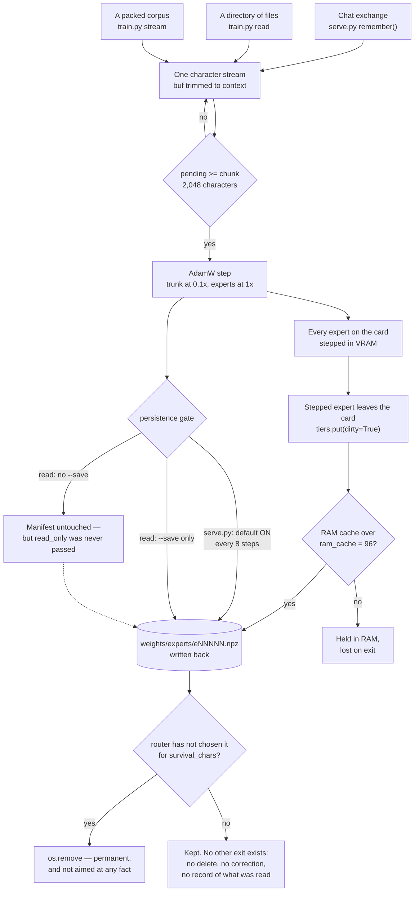

## 1. Executive Summary

mini-AGI is a byte-level language model that trains from scratch on one 8 GB
card and never stops training, so its memory is its weights and every gradient
step is a write. The careful part is capacity management — paging, growth,
pruning — and a forgetting measurement whose raw per-arm scores are committed
beside the probe that produced them. The weak part is everything a memory must
answer for: nothing learned can be named, corrected or deleted, and the surface
a person types into persists by default.

It is in this atlas because of what it does with a conversation. `serve.py` is a
Flask chat server; when a reply finishes, `remember(user_text, bot_text)` marks
the exchange up in the corpus's own `<user>`/`<bot>` form and feeds it to a
`LiveLearner`, which takes an AdamW step for every 2,048 characters of stream
and writes the weights directory back to disk every eight steps. The page calls
that counter **long-term memory**, and the description is exact: there is no
store beside the weights, no record of the exchange, and no path by which
anything learned can later be named.

It is the stricter companion to [Second Me](../second-me/), which keeps the
documents in SQLite beside the model and can at least delete the row. Here the
granularity problem the atlas sets out under
[weights as memory](../../appendix/#weights-as-memory-at-adapter-granularity)
arrives in its pure form: the unit of identity is the whole model, a correction
has nothing to name, and the only deletion in the system removes an expert
because *the router has not chosen it lately*, which is a statement about
capacity and not about truth.

The machinery around that store is memory-system machinery, built carefully and
for stated reasons. There are three tiers with an LRU between them. Each forward
uses the experts its whole text has voted for, so what was on the card changes
what a forward costs and never what it computes. Training forwards add an
exploration bonus whose admissions the prune clock refuses to count. Growth has
five brakes, all wired and all engaged by the shipped config. And eviction
deliberately refuses to read the gate, with the reason written down — *the
smallest gates belong to the busiest experts*. Read as a capacity manager this
is a good design. Read as a memory it has no scope, no trust state, no audit of
what was read, no test, and no delete.

Two findings matter more than the rest, and both are about a write reaching disk
when the operator has been told it will not. `python3 train.py read ~/notes` is
documented as *"a dry read - nothing kept"*, and `cmd_read` builds the pool with
`read_only` at its default of `False` (`train.py:659`, `:1812`). Every chunk is
an optimiser step over the experts on the card, a stepped expert leaves the card
dirty, and the RAM cache writes dirty experts to disk on eviction. The README's
replication recipe copies the weights first — *"a COPY - paging marks experts
dirty"* — while its option table says that without `--save`, *"`weights/` is
untouched"*. And `serve.py` learns and saves by **default**; `--no-learn` is the
opt-out. The surface an engineer runs deliberately asks permission to persist;
the surface into which a person types personal facts does not.

## 2. Mental Model

A memory here is created by being read. There is no extraction step, no
candidate state, and no moment at which a claim becomes a belief — the gradient
step *is* the transition, and it happens to every character equally.

What follows from that is the whole epistemic shape of the system. A fact the
model was told is indistinguishable at rest from a fact it inferred, from a
sentence it hallucinated in its own reply and then read back, and from the
contents of a `.env` file that happened to be under a directory somebody
pointed it at. `minagi/live.py` says so in its own header: *"Learning from a
conversation is learning partly from the model's own output"*. The file records
that an earlier, denser variant cost about +0.65 nats on held-out against +0.02
for real documents of the same length. Whether the current regime still costs
anything is, in its words, *"UNKNOWN and would have to be measured"*. That is an honest statement of an unmeasured risk, and it is also
the admission that the write path cannot tell the model's own invention from
evidence.

Forgetting has two meanings here and neither is the one a memory system needs.
The first is catastrophic forgetting, which the project measures and mitigates:
after 1,048,576 consecutive characters of PG19, a domain the model had never
read, running the trunk at 0.1x the experts' learning rate holds the loss on the
eight known subjects to +0.1297 nats, against +1.2628 at the experts' rate. The
second is expert pruning, which deletes a file from `weights/experts/` when the
router has not chosen it inside the survival window. Neither can be aimed. You
cannot forget a sentence; you can only fail to route to a region of parameters
for long enough that the region is deleted, taking whatever else it held.

The one real gate in the design is persistence, and it is placed inconsistently.
In-process the model is mutated immediately and unconditionally; what `--save`
controls is whether `weights_store.save` runs. In `cmd_read` that gate also
holds off growth and pruning, for a stated reason — a dry read that pruned would
leave the directory naming expert files that were no longer there. The forgetting
check it prints at the end (*"reading this cost ground on the held-out set - that
is what forgetting looks like, measured rather than assumed"*) is printed
**before** the save and does not gate it: the operator decided at the command
line, before the evidence existed.


```mermaid
%% caption: Every path into mini-AGI's memory is a gradient step on raw text, and the only exits are an untargetable expert deletion and the survival of a region the router stopped choosing; the three points where a write reaches disk are marked, one of them on the path documented as keeping nothing.
flowchart TD
  CHAT["Chat exchange<br/>serve.py remember()"] --> STREAM
  FILES["A directory of files<br/>train.py read"] --> STREAM
  CORPUS["A packed corpus<br/>train.py stream"] --> STREAM
  STREAM["One character stream<br/>buf trimmed to context"]
  STREAM --> STEP{"pending >= chunk<br/>2,048 characters"}
  STEP -- "no" --> STREAM
  STEP -- "yes" --> GRAD["AdamW step<br/>trunk at 0.1x, experts at 1x"]
  GRAD --> VRAM["Every expert on the card<br/>stepped in VRAM"]
  VRAM --> DIRTY["Stepped expert leaves the card<br/>tiers.put(dirty=True)"]
  DIRTY --> TRIM{"RAM cache over<br/>ram_cache = 96?"}
  TRIM -- "yes" --> DISK[("weights/experts/eNNNNN.npz<br/>written back")]
  TRIM -- "no" --> HOLD["Held in RAM,<br/>lost on exit"]
  GRAD --> GATE{"persistence gate"}
  GATE -- "serve.py: default ON<br/>every 8 steps" --> DISK
  GATE -- "read: --save only" --> DISK
  GATE -- "read: no --save" --> NOTE["Manifest untouched —<br/>but read_only was never passed"]
  NOTE -.-> DISK
  DISK --> PRUNE{"router has not chosen it<br/>for survival_chars?"}
  PRUNE -- "yes" --> DEL["os.remove — permanent,<br/>and not aimed at any fact"]
  PRUNE -- "no" --> KEEP["Kept. No other exit exists:<br/>no delete, no correction,<br/>no record of what was read"]
```

## 3. Architecture

Standing it up costs a CUDA card with 8 GB, Python 3.10 or newer, and four
packages the README names in prose — `torch numpy pyyaml matplotlib` — because
there is no dependency manifest in the tree at all. `screen_repo.py` reports
**NOTHING SCANNED**, and reading the tree by hand explains it rather than
contradicting it: 56 committed files, no `requirements.txt`, no
`pyproject.toml`, no `setup.py`, no lockfile, no Makefile, no
`.github/workflows` (only a `FUNDING.yml`), no `.gitattributes` and no
`.gitmodules`. The reference environment is named in prose as torch 2.6.0+cu124
with numpy 1.24.4, which is a pin a reader can act on and not one a tool can
check.

The store is a directory, and `minagi/store.py` opens by saying so: *"The
weights directory IS the model."* It holds `manifest.json`, `core.npz`
(embeddings, attention, norms, halting head), `routers.npz` (the gate and one
router row per expert per call site), `optim.npz`, and `experts/eNNNNN.npz` —
one file per expert, each carrying `w1`, `w3`, `w2` and that expert's own Adam
moments. Only experts are split out, because an expert is the unit that is
paged, grown and pruned. Writes are atomic: every file is written to a `.tmp`
and renamed. There is exactly one copy — `store.py`'s `best_val` states the
reason, that a snapshot *"would double a figure that is already 236 MB and
grows with the pool"* — so the directory is both the live model and the only
fallback.

Three tiers sit above it, in `minagi/paged.py:87` (`Tiers`): disk holds the
whole pool, an `OrderedDict` keeps `ram_cache` experts as CPU tensors with true
LRU eviction, and `resident` slots on the card hold what the current forward
admitted. Config defaults are 32 resident, 96 in RAM, growing from 64 experts
with a 10 GB disk ceiling — about 397 experts at 25.2 MB each.

Two entry points write to it. `serve.py` (882 lines) is a Flask app on
127.0.0.1 with a server-sent-events chat endpoint. `train.py` (2,284 lines)
carries three subcommands, of which `read` is the one the project runs,
`stream` is the same mechanism pointed at a packed corpus, and `ponder-probe`
is a diagnostic. `minagi/` is the model: `paged.py` (1,097) is the pool, the
selection rule and the paging, `pool.py` (873) the router and `AutoGrow`,
`recur.py` (525) the recurrent block and the loaders, `stream.py` (470) the
corpus reader, `store.py` (448) persistence, `plasticity.py` (358) the
learning-rate controller, `live.py` (203) the live learner, `ingest.py` (151)
the file walker. `replication/` holds the forgetting probe and its results.

## 4. Essential Implementation Paths

**A chat turn becomes memory.** `serve.py:359` `api_chat` builds the prompt from
the message list, streams the reply under a process-wide `LOCK`, and on
completion calls `serve.py:317` `remember(last_user, "".join(reply))`. That
calls `minagi/live.py` `exchange_text` to wrap the turn in `<user>`/`<bot>`
markers — the same markup the chat corpus uses — and hands it to
`LiveLearner.feed`. Only this turn goes in; the prompt already carried the
conversation, so re-feeding it would re-read the earliest turns once per
exchange.

**A step.** `LiveLearner.feed` appends character ids to `self.buf`, and every
time `pending` reaches `chunk` it trims `buf` to the last `context` characters
and calls `_step`. `_step` runs the forward on `ids[:-1]` predicting `ids[1:]`,
clips the gradient to 1.0, and steps an AdamW with two parameter groups —
`trunk` at `lr * trunk_lr_mult` and `pool` at `lr`. The learner restores the
trainer's moments from `optim.npz` when it starts, so its first save does not
write a fresh optimiser's short history over the trainer's (`live.py:82-94`).
The whole exchange is about ninety characters against a default chunk of 2,048,
so roughly twenty-odd turns pass before the first optimiser step; `serve.py`
reports `pending` and `chunk` on every reply because *"silence there is
indistinguishable from learning being broken."*

**Persistence.** After each step `remember` checks `learner.due_to_save()` —
`unsaved >= save_every`, default 8 — and calls `LiveLearner.save`, which
delegates to `store.save`. For a paged pool that routes to `_save_paged`:
`pool.flush()` parks every expert on the card that a step has changed and
writes everything dirty, then core, routers and optimiser bundles are written
and the manifest is rebuilt around whatever files exist. There is no validation
gate on this path. The `stream` subcommand advances the directory only when
held-out improves (`train.py:308`, `if val < best`); the live and `read` paths
write on a timer.

**A file read.** `train.py:581` `cmd_read` collects paths through
`minagi/ingest.py` `collect`, which walks each argument, skips a fixed set of
directory names and any directory whose name starts with `.`, and then decides
text-or-binary by sampling 4,096 bytes and requiring valid UTF-8, no NUL byte
and over 90% printable characters. Each file is read beginning to end, because
*"a document has an order."* The loop is the same chunk-and-step mechanism, with
growth and pruning attached every `grow_every` steps and checkpoints on a timer.

**Deletion.** `paged.py:875` `prune(step, survival, protect)` walks the pool,
keeps anything on the card, anything younger than `survival` and anything the
router chose inside the trailing window, and for everything else calls
`os.remove` on the expert file, drops it from RAM and from the dirty set, then
reindexes the gate, the telemetry vectors and every call-site router. Files are
named by `uid`, never by position, so pruning never renames anything.

## 5. Memory Data Model

There are two units and neither is a memory.

The **expert** is a file. `manifest.json` describes each one with `id`, `file`,
`params`, `bytes`, `moments` and `gate`, and the pool carries parallel tensors
beside it: `use`, `age`, `born`, `gate_seen`, `last_seen`, `ever`, `admits` and
`recent`, plus `uid`. `born` is the step an expert joined; `last_seen` is the
text count at which the router last chose it; `recent` is its share of recent
training forwards, which sets its exploration bonus; `ever` is whether it has
been on the card at all. All of these are transaction time in the bi-temporal
sense — when the system did something — and there is no second axis anywhere,
because there is no fact whose validity could begin before the model read it.

The **character stream** is the other unit, and it is not persisted. `LiveLearner`
holds `buf`, trimmed to the context window, and it dies with the process; what
survives is the delta the stream left in the weights. Nothing in the tree records
which file, which conversation or which sentence produced any part of that delta.

The closest artifacts are two logs about capacity. `runs/history.jsonl` is
appended by the `stream` subcommand with typed events — `start`, `step`, `val`,
`pruned`, `grew` (carrying `AutoGrow`'s refusal reason), `saved`, `done`.
`runs/expert_history.jsonl` takes one telemetry row per checkpoint from
`train.py:964` `log_history`, dry reads included, and is not append-only: every
`read` session first drops rows past the manifest's character count
(`train.py:918`, `_truncate_history`), so a dry read's rows are erased by the
next session. Neither log can answer what the model read, which is the question
the [append-only memory audit](../../patterns/append-only-memory-audit/) mark
exists for, so it is withheld. `runs/` is gitignored apart from `samples.txt`.

No scope key of any kind exists. A search for `user_id`, `session_id`, `tenant`,
`account`, `auth`, `login` and `principal` across every `.py` in the tree returns
four hits, all of them the English word *account* inside comments. The Flask app
has no session, and `STATE` is a module-level dict holding one model.

## 6. Retrieval Mechanics

Retrieval here selects weights rather than text, and it is the most
memory-shaped part of the system.

**The text chooses.** While a forward has room on the card, every character
ranks the whole pool with its call site's router — one row per expert, so an
expert on disk is scored exactly like one in VRAM — and requests its top 8,
each request carrying the router's probability (`pool.py:382-408`). A forward's
first pass adds those requests to a vote over its whole text since position 0,
and `admit` gives the forward the most-voted experts until the 32 slots are full
(`paged.py:531`). Every character then routes among the admitted experts only; a
character whose request missed takes its best admitted expert instead.

**Residency changes the cost, never the choice.** `admit` never reads what is on
the card. Residency decides only how many admitted experts must be copied in: a
newcomer takes a slot holding nothing this forward admitted, empty first, then
the one admitted longest ago. There is no displacement margin and no dwell
window; stability comes from the vote accumulating over the whole text. The
README reports 2.4 loads per training step over fifteen minutes of training,
and a 140-character reply that loaded no expert after its prompt.

**Writing is the same rule, one character at a time.** Each character of a
reply is a forward of its own through the attention cache, so it adds its
requests to the vote the prompt and the reply so far have cast. A forward from
position 0 begins a new text and advances the prune clock; continuing forwards
do not, so writing a reply does not age the pool (`paged.py:510-515`). An expert
nothing stepped is not written back when it leaves the card (`paged.py:629`), so
a reply that loads experts writes none of them.

**Training explores, and exploration buys no survival.** In a forward that
trains, each expert's score gets a bonus of `explore_bias × e^(−recent / fair)`
wherever something is chosen, never in how much a chosen expert contributes
(`paged.py:487-508`). The prune clock counts only what the router would have
admitted without the bonus (`paged.py:550-556`). The shipped config sets
`explore_bias` to 0.65; the README's prose gives 0.35 as the default, and the
loader falls back to 0.0.

What none of this does is retrieve a claim. There is no query, no result set, no
ranking over content, and nothing that could be asserted to stay out of one.

## 7. Write Mechanics

**Writes block the agent and the lag is zero-to-never.** `remember` runs inside
the same `LOCK` the reply stream held, so the chat request does not complete
until the step has been attempted. The model is different the instant the step
lands, so there is no retrieval lag in the usual sense. There is also no
guarantee the write survives: the first twenty-odd exchanges take no step at
all, and a process killed before `save_every` steps have accumulated loses what
was learned since the last save.

**No background pass rewrites the store**, and nothing is ever consolidated,
summarised or extracted. Growth and pruning run inline on the reading loop; the
learning-rate controller (`minagi/plasticity.py`) runs at each held-out
evaluation. This is a real simplification and the project is right to claim it:
one mechanism, at one granularity, for a book and for a conversation.

Three things about the write reach disk in ways worth stating precisely.

**The chat server persists by default.** `serve.py`'s flag is `--no-learn`, and
its help text is the clearest statement of the alternative: *"serve without
learning. The weights are then opened read-only and nothing is written back."*
Absent that flag, `ro = not learn` is `False`, the pool is opened read-write, and
the weights directory advances every eight steps.

**The CLI reader does not persist — except that it does.** `cmd_read` prints
*"not saved (pass --save to keep what it learned)"* when the flag is absent, and
`--save` gates `weights_store.save`, growth and pruning. It does not gate the
tier writeback. `cmd_read` calls `build_paged` with five positional arguments
(`train.py:659`) and never passes `read_only`, which defaults to `False` at
`train.py:1812`. AdamW steps every slot on every chunk, and an expert a step has
changed is handed back with `tiers.put(..., dirty=True)` when it leaves the card
(`paged.py:629-631`). `Tiers._trim` writes a dirty entry to disk whenever the
RAM cache exceeds `ram_capacity` (`paged.py:167`).

With the shipped `pool.ram_cache: 96` this is inert on a fresh 64-expert model
and live on the project's own: the README reports the run at 128 experts, and
the replication checkpoint it links for download holds 174. The README also
links an undertrained snapshot of the running model on Hugging Face
(`README.md:134`), which `serve.py` opens read-write by default. What lands is a
directory whose expert files have trained against a trunk that `core.npz` does
not hold, because the trunk is written only by a save. `forgetting_probe.py`
states the same mechanism in its docstring and expects a copy; `cmd_read` warns
of nothing.

**A save is not validated on the live path.** `LiveLearner.save` writes
unconditionally; only the `stream` subcommand compares against `best` first, and
only `stream` has the divergence recovery that reloads the directory and halves
the rate. Since there is one copy and no snapshot, a chat session that damages
the model overwrites the thing it would have to be restored from.

## 8. Agent Integration

There is no agent, no tool schema and no MCP surface. A case-insensitive search
for `mcp`, `tool_call`, `function_call`, `tool_use`, `openai` and `anthropic`
across every `.py`, `.yaml` and `.md` in the tree returns nothing — this model
calls no other model, at any point. The integration surface is a browser
page and a CLI.

`serve.py` binds 127.0.0.1 by default and exposes `/api/chat` (SSE),
`/api/state`, and a single-file HTML page that shows which experts are on the
card by `uid`, their normalised gates, how many experts the last character
admitted, how far the stream is from its next step, and a **long-term memory**
counter. `uid` is what the page shows rather than the index, for a reason the
code explains: pruning renumbers the pool, so the same index means different
experts at different times.

The most unusual integration is `corpora/self_knowledge.yaml` — 584 lines of
question-and-answer pairs about the model's own architecture, templated with
live values (`{ram_cache}`, `{explore_bias:g}`), built into a training lane that
the project raised from 0.25% to 12.5% of reading (`train.py:1407`). When the
served model answers *"how do you decide which experts to use?"*, it is
reciting a corpus, not introspecting. The model's account of itself is training
data, so it can be stale, and nothing checks it against the running system.

## 9. Reliability, Safety, and Trust

**Nothing learned can be deleted.** This is the central property and it is not a
gap in an otherwise complete design — it is what the design is. A search for
`unlearn`, `undo`, `rollback`, `revert`, `restore_checkpoint` and `snapshot`
across the tree returns the `stream` subcommand's divergence recovery, which
reloads the single weights directory and halves the learning rate;
`precision.unpack_bf16`, whose docstring says it undoes the packing; and
comments. None of them can reach a fact. The atlas's usual question for a store
— what does a deletion request reach — has one answer here: the whole model, by
retraining from scratch, which requires still holding the corpus the request
asked you to destroy.

**Pruning removes whatever an expert held, in bulk.** The sample log records the
pool at 225 experts at 790.7 million characters and at 128 by 874.2 million: 97
expert files deleted inside one survival window. The log does not record why,
and nothing records what those experts had learned.

**The file reader has no secret filter.** `ingest._walk` skips directories whose
name begins with `.`, so `~/.ssh` and `~/.aws` are passed over when a parent is
walked. It does not skip *files*. `os.path.splitext(".env")` returns an empty
extension, `SKIP_EXT` cannot match it, and `looks_like_text` accepts any
printable UTF-8 — so a `.env` sitting beside the source in a project directory
is read in full, and a file named directly on the command line bypasses the
hidden-directory rule entirely (`if os.path.isfile(p): out.append(p)`). The
project's own `.gitignore` carries a `# secrets` section listing `.env` and
`.env.*`; the reader that trains on your disk has no equivalent. In a document
store this is a bad afternoon. Here it is permanent.

**Self-training is acknowledged and unmeasured.** `live.py` states that the
model reads its own argmax back as evidence and that a denser earlier variant
cost +0.65 nats. It says whether the current regime still costs anything is
unknown, and that a smaller learning rate is not the fix — *"on the model's own argmax that
direction is to confirm it; a lower rate confirms it more slowly."* Naming an
unmeasured risk in the source is better practice than most of this corpus
manages, and it remains unmeasured.

**Where the engineering is careful.** Adam moments travel in the expert's own
file and reach the card just before a step, so a paged expert never inherits a
stranger's momentum. Residency is matched by identity rather than by slot
position, so an expert a forward admits again is never moved. Expert files are
named by `uid` so pruning never renames. Every write is `.tmp`-then-rename.
`_save_paged` warns when the pool holds experts with no file on disk. `read_only`
raises rather than silently skipping if a write is attempted. Routers are
reallocated rather than reshaped in place, with the autograd crash that
motivated it recorded in the comment. Pruning refuses to empty the pool and
keeps the most recently chosen expert if every rule would have deleted
everything.

**No capability marks.** `tombstone`, `bitemporal`, `scope_enforced` and
`negative_eval` have no candidate mechanism. `trust_state` is withheld because
`born`, `last_seen`, `gate` and the derived `dying()` are usage lifecycle, not
epistemic status — nothing withholds a memory from being treated as true,
because nothing distinguishes memories. `audit_log` is withheld on the axis
question set out in section 5: `runs/history.jsonl` is a named append-only
event record with typed kinds and refusal reasons, every event it records is a
mutation of *capacity*, and no path records what was read. `human_review` is
withheld because `--save` is a flag set before the reading starts rather than a
state a memory waits in; the forgetting measurement that would inform the
decision is printed after the model has been changed and does not gate the save;
and the surface a person types into persists without asking.

## 10. Tests, Evals, and Benchmarks

**There is no test in this repository.** `git ls-files` matching `test`, `spec`
or `eval` returns nothing, and a grep for a line beginning `assert`, `def test_`,
`import pytest` or `import unittest` across every `.py` returns nothing. This is
not a suite that cannot fail; it is the absence of one.

Analysis tooling is partly committed. `tools/` holds three plotting scripts —
`plot_dashboard.py`, `plot_experts.py`, `plot_progress.py` — that read the sample
log, the manifest and `expert_history.jsonl` without torch. Four other
`tools/*.py` cited in source comments are not in the tree: `birth_probe.py`,
`capture_routing.py`, `chess_legality.py` and `plot_routing.py`. The
`.gitignore` names a fifth, `tools/expand_corpus.py`, as the corpus generator;
the README's pipeline runs `python3 -m corpora expand`, which is committed. The
comparison of birth schemes that `add_experts` cites lives in
`runs/results/birth_schemes.json`, which is gitignored.

**The forgetting measurement is committed.** `replication/forgetting_probe.py`
(395 lines) scores every held-out domain, trains on one domain at batch 1 with
growth and pruning disabled, and re-scores at fixed marks.
`replication/results/` holds the four arms the README tabulates, each a JSON
file recording its checkpoint step, pool size, learning rate, trunk multiplier
and swap flag beside six rows of per-domain scores up to 1,048,576 characters.
`cl_summary.py` prints the control's verdict before any arm, because the
control reads every lane and so cannot forget.

I recomputed the README's table from those four files with a short script of my
own, using `cl_summary.py`'s formulas: every figure matches to four decimals —
unread-subject damage of +1.2663, +1.2628 and +0.1297 nats, retention of 74.12%,
74.25% and 97.30%, and 44 experts touched in the mitigated arm, in a 174-expert pool. The
control's read lanes improve by 0.0461 nats, which the summary's own rule calls
clean. I ran none of the project's code.

Three limits bound what the files prove. The README says the arms were measured
before the selection rule in section 6 replaced its predecessor, and that the
committed probe runs the current rule, so re-running it measures a different
system from the one that produced the numbers. The checkpoint is on Hugging
Face, not in the tree. And each arm is one run, against the README's own
threshold of *"about 0.03"* for a real difference; the 1.13-nat gap between the
mitigated and unmitigated arms is about 38 times that.

`runs/samples.txt` is the other committed evaluation artifact: 179,243 lines
covering the whole run, with per-round held-out loss and its standard error,
per-subject breakdown, repeat rate, expert count, reading and writing speed, and
two readings of nine fixed prompts. The raw greedy reading is always written
first, because it *"is the only one that says what the model predicts"*, and
the repetition guard's reading is labelled as describing the guard.

There is no paper. `arxiv`, `bibtex`, `@article`, `Citation` and `doi` across
the tree return a `## Citation` block naming the repository itself as
`@software`, and an acknowledgments list of nineteen papers in seventeen entries
— Shazeer 2017 for the expert pool, PonderNet for adaptive depth, RoFormer,
ZeRO-Offload, Chinchilla — plus DeepSeek-V3 cited in the body for the
exploration bonus. That is attribution, not a result.

## 11. Patterns Worth Stealing

### Steal

**Refuse the metric that is anti-predictive, and write down why.** `paged.py`
prunes on staleness and refuses a gate term, with the reasoning stated: *"the
smallest gates belong to the busiest experts. One that behaves as a sink -
chosen constantly, contributing little per character - reads as dead on a gate
test, while a high-gate expert nothing has asked for in hundreds of thousands of
texts reads as alive"*. Every memory system with a decay or importance score
has this problem in some form, and most of them pick the plausible field. The
transferable move is the sentence, not the metric: name the case where the
obvious score is inverted.

**One definition, two thresholds.** Staleness is computed once in `dying()`; the
pruner deletes past 1.0 of the survival window and the growth brake refuses past
`dying_at` (0.65). A single predicate with two cut points cannot drift apart the
way two predicates do.

**Let exploration buy a trial, never survival.** Training forwards give an
under-used expert a bonus that decays with use. `admit` keeps a second vote
without the bonus, and only that vote moves the prune clock; in the config's
words, *"being tried keeps nothing alive, being wanted does"*. A memory system
that resurfaces old items to give them a chance should keep the same separation:
a surfacing it forced is not evidence the item is wanted, and must not count as
reinforcement.

**Publish the arms that lost, with their raw scores.** The forgetting table
carries three massed configurations and an interleaved control, two of the three
bad, and the per-domain scores behind every row are committed beside the probe.
A memory system that claims a consolidation or decay policy helps should be able
to show the same table, and the files that make it.

**Say what a mechanism is not measured on.** `live.py`'s header is a model of
this: it names the risk, gives the number from the regime that was measured,
says the current regime is unknown, and says why the obvious mitigation does not
work. Compare that with the usual alternative of silence.

### Avoid

**A persistence flag that gates the index and not the data.** `--save` gates the
manifest, growth and pruning; it does not gate the tier writeback, and the
default that would have (`read_only`) is one positional argument away from the
call that needed it. The project's probe expects a copy for exactly this reason
and its dry-run command does not. The general shape — a writer and a reader
composing a safety property separately — applies wherever a "dry run" exists.

**Opt-out persistence on the surface a person talks to.** The asymmetry between
`serve.py`'s `--no-learn` and `cmd_read`'s `--save` is backwards with respect to
what each surface receives.

**Citing tooling that is not committed.** Four `tools/*.py` are named in source
comments and a fifth in `.gitignore`, and none exists at this commit. A comment
that names a tool is a claim a reader will not check.

**A store with one copy and no gate on the write.** `best_val`'s reasoning about
disk cost is sound and the conclusion — that the directory is both the live model
and the fallback — means the live path can overwrite its own recovery point.

### Fit

This is not a memory system to adopt, and the project does not offer it as one.
Read it if you are weighing whether to put any part of a memory into weights,
because it is the clean case: no document store, no adapter versioning, no
retrieval over text, so every consequence of the choice shows up undiluted.
Read sections 5, 7 and 9 together and you have the argument against
weight-resident memory for anything that must be correctable, made from an
implementation rather than from first principles.

As a *model*, the audience is narrow and well-chosen: one person, one card, one
machine, data they own, no compliance surface, and a willingness to accept that
the thing cannot be edited. For that audience the design is coherent and the
honesty is well above average. The moment a second person, a second project or a
deletion request enters the picture, nothing here transfers — there is no key to
add a predicate to.

## 12. Antipatterns / Risks

- **Irreversibility is total.** Anything read is unnameable afterwards. There is
  no per-record delete, no supersession, no tombstone, and no way to answer
  "where did this come from". For a personal model on your own hardware that is
  a stated trade; anywhere else it is disqualifying.
- **The dry read is not dry on the project's own model.** `cmd_read` never
  passes `read_only`, so a pool larger than `ram_cache` writes trained expert
  files back under a command that prints *"not saved"*, beside a trunk that was
  not saved.
- **Secrets are read as text.** No filter excludes `.env`, `id_rsa`,
  `credentials` or `.netrc` from `train.py read`, and a directly named file skips
  even the hidden-directory rule.
- **Self-training is a measured risk left unmeasured in the current regime**, by
  the project's own account.
- **No tests.** Nothing establishes that pruning keeps what it should, that
  exploration admissions stay off the prune clock, or that a reload after a save
  produces the same model — the last of which `live.py` records as a bug class
  that has bitten (*"the directory then claims the default vocabulary of 8192
  while holding 265, and will not load again"*).
- **Pruning is permanent and not aimed.** `prune`'s own docstring names the
  cost: *"an expert which is genuinely rare rather than dead is deleted, and
  deletion is permanent."* Rarity and deadness are the same signal to this rule,
  and the run's own log shows 97 experts deleted inside one window.
- **The headline result is reproducible from its numbers, not from its code.**
  The per-arm scores are committed; the selection rule they were measured under
  is not the one the committed probe runs.

## 13. Build-vs-Borrow Takeaways

Borrow the reasoning, not the code. Nothing here is packaged for reuse — no
manifest, no public API, no versioning — and the parts that are excellent are
decisions rather than modules.

Three of them transfer directly to an ordinary token-store memory. The eviction
rule that reads staleness and refuses the correlated-but-inverted score is the
same shape as choosing between "last accessed" and "importance" in a
consolidation pass, and keeping forced resurfacing off that clock is the half
most designs miss. The growth brake with five conditions, each producing a
one-line refusal reason that is logged, is what a memory system's write
admission control should look like and almost never does. And publishing the
losing arms beside the winning one, with the raw scores, is the difference
between a claim and a measurement.

The thing not to borrow is the boundary. If any part of your memory must be
correctable — and the atlas's position is that almost all of it must be — the
part that lives in weights needs to be the part nobody will ask you to delete.
You also need to have said in advance what a deletion request will not reach. mini-AGI does not say that, and it is the one sentence its README is
missing.

## 14. Open Questions

- **Does the current live regime cost held-out loss?** `live.py` says it is
  unknown. The instrument exists — `cmd_read`'s before/after mixture scoring —
  and pointing it at a chat session rather than a directory would answer it.
- **Does the forgetting result hold under the current selection rule?** The
  committed probe runs it; no result under it is committed.
- **What does the dry-read writeback change?** The condition is established
  from the code; the magnitude is not. A no-save read on the 174-expert
  replication checkpoint with `ram_cache` at 96 would show how many expert files
  it rewrites.
- **Why did the pool fall from 225 experts to 128?** The sample log records the
  drop between 790.7 and 874.2 million characters and nothing about its cause;
  `expert_history.jsonl`, which would, is gitignored.
- **What happens to `runs/history.jsonl` on the path the project runs?**
  The typed event log lives only in `stream`; `read` writes periodic telemetry
  snapshots instead, and truncates them on resume. Whether that is deliberate is
  not recorded.
- **Where did the tree come from?** 30 commits since 19 September 2026 against a
  sample log covering 1,552 evaluations. The code predates its history, and four
  of the tools its comments cite have not been published.

## 15. Appendix: File Index

| Path | Lines | What it holds |
| --- | --- | --- |
| `train.py` | 2284 | Three subcommands; `cmd_read` is the documented path, `cmd_stream` the one with the typed event log; `_truncate_history` |
| `minagi/paged.py` | 1097 | `Tiers`, `PagedPool`, `admit`, `begin_forward`, `_rearrange`, `prune`, `flush` — selection, paging and deletion |
| `serve.py` | 882 | Flask chat server, `remember`, the on-card expert view, the long-term-memory counter |
| `minagi/pool.py` | 873 | `PooledMLP._route` with the whole-pool request and the exploration bonus; `AutoGrow` with its five brakes and refusal reasons |
| `minagi/recur.py` | 525 | The recurrent block, `begin_text` at position 0, `load_any`, `load_recur` |
| `minagi/stream.py` | 470 | Corpus reading, interleaving, the held-out evaluator |
| `minagi/store.py` | 448 | The weights directory: layout, atomic writes, `_save_paged`, `best_val` |
| `minagi/plasticity.py` | 358 | The learning-rate controller — two weighted fits, effect size over t-statistic |
| `minagi/live.py` | 203 | `LiveLearner`, its optimiser-moment restore, `exchange_text`, and the unmeasured-risk header |
| `minagi/ingest.py` | 151 | The file walker and the text/binary decision; no secret filter |
| `replication/forgetting_probe.py` | 395 | The forgetting probe: score, read one domain, re-score; expects a copy of the weights |
| `replication/cl_summary.py` | 110 | The table from the four result files, control verdict first |
| `replication/results/*.json` | 149–156 each | Four arms, per-domain scores at six marks, the configuration of each |
| `config.yaml` | 174 | Every threshold named above, all five growth brakes engaged, `explore_bias` 0.65 |
| `corpora/self_knowledge.yaml` | 584 | The model's account of itself, as training data |
| `runs/samples.txt` | 179243 | The whole run's evaluation history |

### Recorded searches

Commands run at the repository root, for the absence claims above.

```sh
# No test exists anywhere in the tree (0 results each).
git ls-files | grep -iE 'test|spec|eval'
grep -rnE "^\s*(assert|def test_|import pytest|import unittest)" --include='*.py' .

# No scope key of any kind (4 results, all the English word "account" in comments).
grep -rniE "\b(user_id|session_id|tenant|account|auth|login|principal)\b" --include='*.py' .

# No correction, unlearning or snapshot path (the `stream` revert path, unpack_bf16, comments).
grep -rniE "unlearn|undo|rollback|revert|restore_checkpoint|snapshot" --include='*.py' .

# Nothing copies the weights directory aside before writing it (0 results).
grep -rniE "shutil\.copy|backup|\.bak" --include='*.py' .

# Every tools/*.py cited, against what is committed (4 cited in comments and
# 1 in .gitignore are absent; 3 are committed).
grep -rnoE "tools/[A-Za-z_]+\.py" --include='*.py' --include='*.md' --include='.gitignore' . | sort -u
git ls-files tools/

# No dependency manifest, hook, devcontainer or checkout filter (0 results).
find . -path ./.git -prune -o \( -name 'requirements*.txt' -o -name 'pyproject.toml' \
  -o -name 'setup.py' -o -name 'setup.cfg' -o -name 'conftest.py' -o -name 'Makefile' \
  -o -name '*.lock' -o -name '.envrc' -o -name '.gitattributes' -o -name 'Dockerfile*' \
  -o -name 'devcontainer.json' -o -name '.gitmodules' \) -print

# No paper: the only Citation block is @software for this repository.
grep -rniE "arxiv|bibtex|@article|@misc|citation|doi" --include='*.md' --include='*.cff' .

# No agent surface and no second model, anywhere including the README (0 results).
grep -rniE "\bmcp\b|tool_call|function_call|tool_use|openai|anthropic" \
  --include='*.py' --include='*.yaml' --include='*.md' .

# read_only is never passed by the reader that documents itself as keeping nothing.
grep -rn "read_only" --include='*.py' .
grep -rn "build_paged" --include='*.py' .

# The expert history is rewritten on every read session.
grep -n "_truncate_history" train.py

# cmd_read prints no writeback warning (1 result: the build_paged docstring).
grep -n -i "dirty\|writeback" train.py
```

## History

**2026-10-01** — [`7361e7a54cea4c48915c3f9f2533a695607466a8`](https://github.com/volotat/mini-AGI/commit/7361e7a54cea4c48915c3f9f2533a695607466a8) — 14 commits past the previous pin. Expert selection was rewritten: the demand score, key vectors, margin, dwell window and cold-start sweep are gone, replaced by a whole-text vote and an exploration bonus the prune clock ignores ([section 6](#6-retrieval-mechanics)). The forgetting probe and its per-arm results are committed and reproduce the README's table ([section 10](#10-tests-evals-and-benchmarks)). The dry-read writeback holds; `expert_history.jsonl` is truncated on resume. Three published claims were wrong at the old pin: `train.py` has three subcommands, not four; `tools/expand_corpus.py` is cited in `.gitignore`, not the README; the reference list held sixteen entries, not seventeen. Screen: **NOTHING SCANNED**; all 56 files read by hand. Nothing installed, built or run. No capability marks.

**2026-09-22** — [`201852d3cf40c7471ecf4a7ee91311c9c69e7b15`](https://github.com/volotat/mini-AGI/commit/201852d3cf40c7471ecf4a7ee91311c9c69e7b15) — first reading, at the head of the default branch. Screened before anything was read: the tool reported **NOTHING SCANNED** — no manifest, hook or agent file at any path it knows — and a hand read of all 45 committed files explains that rather than contradicting it: no dependency manifest of any kind, no `conftest.py`, no `Makefile`, no `.envrc`, no `.gitattributes`, no `.gitmodules`, and `.github/` holding only `FUNDING.yml`. No auto-run surface, no build-time execution point, and no agent-directed file. Nothing was installed, built or executed; no training run, no serve, no benchmark, so every claim here is read from source. No capability marks.
