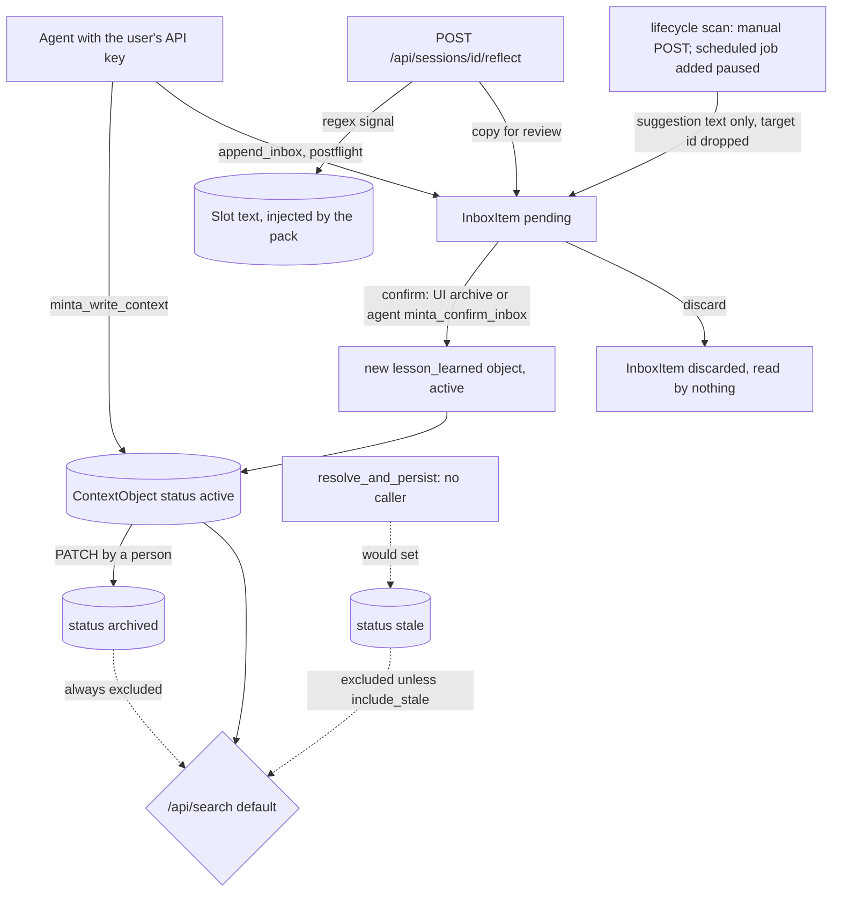

## 1. Executive Summary

Minta is a local memory hub for coding agents: a FastAPI server holding typed
*context objects* in SQLite and Chroma, seven text *slots* per user that are
packed into a context block, an *inbox* where captured corrections wait, and a
lifecycle scanner that looks for stale, redundant and conflicting entries. An
MCP server gives an agent thirteen tools over it. A separate evaluation plane
implements an add-and-search contract for a memory leaderboard.

What is notable is the search path. `/api/search` scopes the vector query by
owner and then re-reads every candidate from SQL under an owner and status
predicate, so a stale vector cannot surface a row the caller may not see. The
user export and delete walk an explicit table inventory, the vector index, the
JSONL logs and the evaluation store.

What is weak is the part the README leads with. The code that would mark a
contradicted memory stale has no caller, the bitemporal check has no caller,
the scheduled scan is added paused, and a confirmed scan finding becomes a new
memory rather than acting on the one it named. The inbox gate is reachable by
the agent it gates.

The repository is the Apache-2.0 open kernel of an open-core product; the
`OPEN_SOURCE_BOUNDARY.md` file assigns expert runtime, rule promotion and
governance to a closed tier. The code imports three of those modules —
`services.production_store`, `services.rule_promotion`,
`services.synthesis_engine` — inside `try: … except: pass`, and they are absent.
Everything this report describes runs without them.

Three marks: `scope_enforced` and `negative_eval` on both stores, and
`audit_log` on the slot plane only. Section 9 names the four withheld.

## 2. Mental Model

A memory is a context object: a titled note of one of nine types
(`preference`, `workflow`, `project_context`, `decision_criteria`,
`lesson_learned`, `writing_style`, `rule`, `ai_brief`, `work_profile`) with a
status of `draft`, `active`, `stale` or `archived`. The model treats an active
object as ground truth: it is returned by search and listed to the agent with
no qualifier. Slots are a second, coarser memory — persona, preferences,
knowledge, counter-examples, skills, pending, rules — free text with a size
limit, injected as a block.

The intended belief lifecycle is candidate, then confirmed, then decayed or
superseded. Captures go to the inbox as `pending`; a person confirms one into an
active object or discards it; the lifecycle scan flags what has gone stale or
conflicts; the conflict resolver marks the loser `stale`, which removes it from
default search. That last transition is the one the README sells.

At this commit three of those edges do not fire. `resolve_and_persist`, the
only code that writes `stale`, is defined in `conflict_detector.py:381-431` and
called nowhere. A lifecycle finding reaches the inbox as its suggestion string
only — the target object's id is dropped in `findings_to_inbox_items`
(`lifecycle_scanner.py:393-412`) — so confirming it creates a new
`lesson_learned` object whose text is the suggestion, and the stale object
stays active. And two write paths skip the inbox entirely:
`minta_write_context` posts `status: "active"` (`minta_mcp.py:154-187`), and
reflection appends to slots before it files an inbox copy for review
(`reflect.py:117-158`).

So in practice a memory is born active or born pending, a pending one becomes
active when anyone holding the user's key confirms it, and an active one stops
being believed only when a person archives or deletes it.

## 3. Architecture

Three FastAPI processes started by `minta_cli.py start`, all bound to
`127.0.0.1`: the data API on 8772 (`server/main.py`), the same app again on
18730 for Autopilot, and the HTTP MCP transport on 18721
(`server/minta_mcp_http.py`). Editors that speak stdio spawn
`server/minta_mcp.py`, which starts the API itself if `/ping` does not answer.

Persistence is SQLAlchemy over `sqlite:///./minta.db` by default, with
`create_all` at import and no migrations. Vectors live in one Chroma
`PersistentClient` collection, `minta_memories`, cosine space, embedded with
`all-MiniLM-L6-v2` through sentence-transformers; a separate 384-dimension
embedding is written into `context_objects.embedding_384` for the conflict
detector. An API-embedding backend (OpenAI, SiliconFlow, DeepSeek) and a FAISS
backend are selectable by environment. Autopilot decisions go to JSONL files
under `logs/autopilot/`.

The evaluation plane is a separate app factory, `server/eval_app.py`, built by
the root `Dockerfile` for a leaderboard: `/add` stores raw messages atomically
in its own SQLite file, `/search` returns ranked user-scoped evidence. It
imports nothing from the business server.

### Deployment and ergonomics

Running it needs Python, the pip requirements and a first-run model download;
`docker compose up -d` builds `Dockerfile.web` with dependencies baked in. It
runs offline after the model is local, and no API key is needed to store
anything, though the MCP write tools need a key registered in the `api_keys`
table. The SQLite file is readable and repairable with any client; the Chroma
directory is not, but `scripts/backfill_vectors.py` rebuilds vectors from the
rows. The web UI is `web/dist/` — compiled bundles with no `web/src/` in the
tree, so its behaviour can be read only from minified strings.

## 4. Essential Implementation Paths

**Capture, explicit.** `minta_write_context` → `POST /api/contextObjects`
(`context_objects.py:104-143`): the router validates the type, derives the id as
`_slugify(title)` plus the last four digits of `time.time()`, accepts any
`status` the payload sends, writes `embedding_384`, commits, then upserts the
Chroma vector with `user_id`, `type` and `status` metadata
(`vector_ops.py:36-48`). Vector failures are logged and swallowed.

**Capture, inbox.** `minta_append_inbox` → `POST /api/inbox/append`
(`inbox.py:160-173`) stores a `pending` item. Autopilot postflight
(`services/autopilot/memory_policy.py:128-211`) matches Chinese trigger words —
记住, 以后, 默认 for writes; 不是, 错了, 不对 for corrections; 改成, 作废,
不再 for updates — against `user_message` only, and
`memory_executor.py:216-319` appends the last 500 characters of it to the inbox
with a type and a scope label in the text.

**Confirm.** The web UI calls `POST /api/inbox/archive` with a type map
(`inbox.py:61-107`); the agent's `minta_confirm_inbox` calls
`POST /api/inbox/{id}/confirm` (`inbox.py:110-148`). Both create an `active`
context object with `source="counter_example"` and confidence
`int(item.confidence * 5)`, and set the item `archived`. Discard sets
`discarded` (`inbox.py:151-157`).

**Retrieval.** `POST /api/search` (`routers/search.py:33-133`) is described in
section 6. Autopilot preflight (`memory_executor.py:124-210`) runs three fixed
queries through it, then reads `GET /api/inbox` and `GET /api/skills`. The MCP
read tools call `GET /api/contextObjects` (`context_objects.py:59-91`), which
returns every status.

**Context assembly.** `GET /api/slots/pack/generate`
(`routers/slots.py:133-181`) passes pinned non-empty slots to
`build_context_pack` (`services/brief_builder.py:26-100`), which orders them by
scene and truncates at `MAX_PACK_CHARS = 3500`.

**Correction and forgetting.** `PATCH /api/contextObjects/{id}`
(`context_objects.py:146-184`) edits fields and toggles `active` and
`archived`; `DELETE` removes the row and calls `drop_object`. Slot overflow goes
through `smart_trim` (`services/retention.py:26-93`).

**Background.** `start_scheduler` (`services/lifecycle_auto_scanner.py:180-213`)
adds `_do_scan` with `next_run_time=None`; `run_full_scan`
(`lifecycle_scanner.py:371-390`) and `findings_to_inbox_items` (`:393-412`) are
also reached through `POST /api/lifecycle/scan`.

**Schema.** `server/models/` — `context_object.py`, `inbox.py`, `slot.py`,
`audit_log.py`, `archived_item.py`, `session.py`, plus retrieval, reward and
bandit logs for an experiment.

**Tests.** `server/tests/`, run in CI by `.github/workflows/ci.yml`; section 10.

## 5. Memory Data Model

`ContextObject` (`models/context_object.py:8-44`) is keyed by a string id that
is global, not per user, so two writes of the same title in the same second
collide on the primary key. Provenance is a `source` enum (`manual`,
`conversation`, `document`, `counter_example`, `skill`) and an owner name.
Temporal fields are `created_at`, `updated_at`, `last_used_at`, `archived_at`
and `archived_reason`. Nothing in the tree writes `last_used_at` outside
`seed_demo.py`, so the staleness scan measures time since the last edit.

The archive branch of `update_object` assigns `obj.archived_by`,
`obj.restored_at` and `obj.restored_by` (`context_objects.py:168-175`). None is
a mapped column, so SQLAlchemy keeps them as Python attributes on the instance
and persists nothing; the comment above them calls them audit stamps.

`InboxItem` (`models/inbox.py:8-21`) holds free text, a suggested type, a float
confidence, tags and a status of `pending`, `archived` or `discarded`. It has no
reference to the object a finding is about.

`Slot` (`models/slot.py:7-35`) is one row per user and label, with
`size_limit`, `pinned`, `scope` (`global` or `project`), `auto_reflected` and a
`retention_score`. `ArchivedItem` keeps text trimmed out of a slot.

Scope is `user_id` throughout, with `NULL` meaning shared. The default slots
label three of seven as `project` scope, and nothing reads the column. There is
no project or agent key on a context object.

The evaluation plane's `Memory` row (`eval_store.py:69-86`) is one message:
`request_id`, `msg_index`, `user_id`, `session_id`, `role`, `raw_content`,
`timestamp_ms` from the caller and `created_at` from the server, with a
deterministic id hashed from request and index.

## 6. Retrieval Mechanics

`/api/search` asks Chroma for `max(top_k * 5, 25)` candidates, capped at 100,
under `where={"user_id": {"$in": [caller, "global"]}}` (`search.py:47-58`). It
then queries SQL for those ids under `user_id = caller OR user_id IS NULL`,
`status != 'archived'`, and `status = 'active'` unless `include_stale`
(`:66-77`). Each surviving hit scores semantic similarity plus 0.25 times the
query-token overlap with title and summary, plus 0.10 times overlap with the
body, plus 0.05 for the caller's own rows, minus 0.20 for an `onboarding`-tagged
row with no title overlap (`:83-101`). Query terms are ASCII words or single
CJK characters. A temporal expression in the query is detected and returned as
an annotation; it does not filter.

The agent reaches this path only through Autopilot. Preflight fires when the
message contains one of the read triggers or a project word, then queries three
buckets mapped to storage types: `preference`; `project_context` and
`decision_criteria`; and `counterexample` (`memory_executor.py:162-166`). No
context object can have type `counterexample` — it is absent from the model's
enum and the router's allow-list — so that bucket is always empty and the
fallback at `:187-196` fills it with the ten newest archived inbox items,
whatever the query. `lesson_learned`, `rule`, `workflow` and `writing_style`
objects, including every confirmed correction, are never queried by preflight.

`minta_search_context` does not use the search route. It fetches the whole
owner list and substring-matches title, summary and tags in the MCP process
(`minta_mcp.py:204-221`), so it returns `stale`, `draft` and `archived` objects
alongside active ones. The status filter lives on one read path of three.

The evaluation plane loads every memory of the user into Python per query
(`eval_store.py:181-194`), scores them by dense similarity, optionally fuses
BM25 and a cross-encoder rerank, expands each seed by a neighbour window inside
the same request, suppresses exact duplicates, and fills to `top_k`
(`eval_retrieval.py:148-299`).

## 7. Write Mechanics

Every business-server write is synchronous and deterministic: no model is
called on the write path except the sentence-transformer embedding, which runs
inline before the commit. A new object is searchable as soon as the request
returns. Postflight's keyword policy runs in the request too.

Deduplication is thin. `route_to_slot` skips an entry whose first 50 characters
already appear in the slot (`reflect.py:121-124`); nothing deduplicates context
objects at write time, and the redundancy scan only reports. The lifecycle scan
re-adds the same findings to the inbox on every run, with no check against
pending items.

Corrections on the reflection path are regex-driven and Chinese-only. A
correction signal decrements the confidence of any active or draft object
sharing two CJK runs with it and tags it `countered`
(`reflect.py:167-214`); English text produces no tokens and touches nothing.

`smart_trim` (`retention.py:26-93`) splits slot content on blank lines, keeps
the newest entries that fit and archives the rest. Reflection appends entries
with single newlines (`reflect.py:126-128`), so an auto-reflected slot is one
entry. When that one entry exceeds the limit, `kept` is empty and the fallback
at `:64-66` keeps its first `size_limit` characters and archives nothing. Once
such a slot is full, each new entry is appended, cut off the tail, and lost,
while the audit row and the inbox copy are still written.

Postflight's comment says authority comes from the user turn
(`memory_policy.py:133-137`). Both `user_message` and `assistant_response` are
arguments the agent supplies to the tool, so the rule separates two strings
from one author.

### Operational cost

Writes block on one local embedding after the model loads. Nothing rewrites the
store in the background. The lifecycle scan is pairwise over up to 100 active
objects for redundancy, and `/api/debt/status` is pairwise over every active
object with an embedding, both on request. The pack is bounded at 3,500
characters while the seven slots allow 14,500, so the scene order decides which
slots are cut. Preflight returns at most ten items per bucket.

## 8. Agent Integration

The Community MCP surface is thirteen tools (`minta_mcp.py:440-713`, asserted
in `tests/test_mcp_tool_surface.py:13-20`): login, read and write context,
search context, append, list, confirm and discard inbox, get pack, get and
update slot, and Autopilot preflight and postflight. Six expert and chat tools
are defined and filtered out by `_ENTERPRISE_ONLY_TOOLS`.

The agent is told to call preflight before every answer and postflight before
finalising, by the tool descriptions, by
`server/templates/agents/claude/CLAUDE.md.j2` (which no code renders) and by the
DeepSeek Harness preset. The preset adds *"Writing memory goes through the inbox
only … the user confirms"*; the same surface holds `minta_write_context`, which
writes active, and `minta_confirm_inbox`.

`minta_cli.py connect` writes editor MCP configuration. Its `_install_hooks`
(`minta_cli.py:427-468`) registers SessionStart, PostToolUse,
PostToolUseFailure and Stop hooks by copying scripts from a `hooks/` directory
that is not in the tree, and returns early when the directory is missing. The
README's hook chain therefore has no in-tree implementation, and nothing in the
tree calls `/api/sessions/{id}/reflect`.

## 9. Reliability, Safety, and Trust

**`scope_enforced` — awarded, on both stores.** The key is on every row and
vector and the predicate is on the read: `search.py:55-74` and
`context_objects.py:59-66` in the business server, `eval_store.py:181-194` in
the evaluation plane. The search route treats the vector filter as advisory and
the SQL join as authoritative, which is the right order. Limits: `NULL`-owner
rows are shared; `Slot.scope` and the inferred project scope never filter
anything; and every capability of the agent is the user's, because the MCP
process authenticates with the user's own key (`auth.py:121-145`).

**`audit_log` — awarded, on the slot plane.** `AuditLog`
(`models/audit_log.py:14-49`) is append-only in normal operation and written by
slot updates, pin changes, clears, reflection and trim archiving, and by session
events. It records lengths, not values. Its declared `context_object` and
`inbox_item` targets have no producer, so the store the search path serves and
every inbox confirmation leave no record. `record_audit` commits after the
mutation and swallows its own failure.

**`human_review` — withheld.** The inbox holds items `pending` until a confirm,
and a person can resolve them in the UI. The agent holds `minta_confirm_inbox`
and `minta_discard_inbox` under the same principal, so the producer can clear
its own queue. Two writers bypass the queue entirely, and a confirmed lifecycle
finding does not act on the object it names.

**`trust_state` — withheld, declared and unwired.** The four-value status is
used as a filter — default search returns `active` only, and the test asserts
it. The epistemic states have no system producer: `resolve_and_persist` sets
`stale` and has no caller; `PATCH` accepts only `active` and `archived`; `draft`
and `stale` exist only when a client sends them at create. The same shape cost
[NexusMem](../nexusmem/) the mark from the other side — a producer and no
filter.

**`bitemporal` — withheld.** `check_temporal_validity` and
`classify_staleness_with_bitemporal` (`decay_engine.py:95-179`) evaluate
`valid_from`, `valid_to`, `valid_until` and `superseded_by`; no model has those
columns and nothing outside the module calls either function. The evaluation
plane keeps a caller's `timestamp_ms` beside the server's `created_at`, which is
event time beside record time, not a validity interval.

**`tombstone` — withheld.** A discarded inbox item keeps its text with status
`discarded`; nothing reads that status, so the same capture can be appended and
confirmed again.

**The scheduled scan does not run.** `start_scheduler` and `_reschedule` pass
`next_run_time=None` to `add_job` (`lifecycle_auto_scanner.py:170, 203`).
APScheduler 3's `add_job` documents that value as *"pass `None` to add the job
as paused"*, and `pause_job` is implemented as the same call. The root
`requirements.txt` pins `apscheduler>=3.10,<4`, and nothing in the tree resumes
the job, while `/api/lifecycle/auto-scan/status` reports a `next_scan_at` five
minutes after startup.

**The HTTP MCP transport authenticates nothing.** `POST /mcp`
(`minta_mcp_http.py:80-118`) parses the raw body as JSON whatever its content
type and dispatches `tools/call` with the server's configured key. The CLI and
compose file bind it to loopback; run directly, `__main__` binds `0.0.0.0`.
CORS limits which origins may read a response, and the one test checks only a
preflight. A cross-origin `text/plain` POST is not preflighted, so a web page
could invoke the write and confirm tools on a running instance. That last step
is inference from the code and was not exercised.

**Deletion is thorough.** `DELETE /api/user/delete-data`
(`routers/user_data.py:155-231`) purges every table in an explicit inventory,
the user's Chroma vectors, the JSONL decision logs, the avatar file and the
evaluation store, commits per category, and reports partial failure.
`tests/test_user_data_inventory.py` checks that the inventory covers every
user-scoped table.

## 10. Tests, Evals, and Benchmarks

The suite is 149 pytest functions in 24 files; CI installs the requirements and
runs it, then builds both images and round-trips `/add` and `/search` inside the
evaluation container. I read the tests; I ran nothing.

The negative assertions are the strongest part.
`test_search_strict_user_isolation` (`test_eval_contract.py:174-188`) stores two
near-identical sentences for two users and asserts each user's result equals
exactly their own sentence under both queries. `test_main_search.py:155-198`
asserts a lexically matching object of another user is absent while the
caller's own is present, and that a `stale` object is absent from default
search and present with `include_stale`. The business-server tests fake the
embedding service, so they exercise the SQL predicate and not Chroma.

Nothing tests the inbox confirm path, the conflict resolver, the scheduler, the
audit writes, `smart_trim`, or the HTTP transport beyond its preflight.

The README's benchmark table — conflict F1 0.81, staleness UFA 0.86,
redundancy 0.67, fragmentation 0.746, LoCoMo Recall@20 97.1% — has no committed
evaluation code or data. `assets/make_benchmark_fig.py` hardcodes the values it
plots, and plots evidence Recall@20 as 82.6. `docs/benchmark_status.md` gives
conflict F1 as 67.8% on its benchmark and 0.81 from a paper. The README says
manuscripts are in preparation; no paper or citation is in the tree.

`docs/eval-proxy/` holds the harnesses for the leaderboard runs and
`matrix_results_20260904.md` a dated ablation table; its raw runs are
gitignored, so the table cannot be recomputed from the tree.

## 11. For Your Own Build

### Steal

- **Make the vector index advisory and the row store authoritative.** Filter
  the vector query by owner, then re-read the candidate ids from the database
  under the owner and status predicate. A stale or mis-tagged vector then costs
  a candidate slot, never a leak.
- **Keep the user-data inventory as one dict and test that it is complete.**
  Export and delete both walk `CONTENT_TABLES`, and a test fails when a
  user-scoped table is missing from it.
- **Make ingest idempotent on a caller request id with a payload hash.** The
  evaluation plane derives message ids from request and index, embeds before
  writing any row, and treats a replay as a no-op while warning on a hash
  mismatch.

### Avoid

- **Dropping the target when a detector hands a finding to a person.** A
  finding that reaches review as prose can be accepted only as a new note. Carry
  the object id and a disposition, and make accepting it change that object.
- **Putting the approve verb on the agent's tool list.** If the agent can call
  confirm, the inbox is a delay, not a gate.
- **Truncating from the head of an append-only buffer.** When the overflow
  handler keeps the first N characters, the newest entry is the one lost.
- **Passing `None` to mean "default" to an API where `None` is meaningful.** In
  APScheduler 3 it pauses the job.

### Fit

Minta suits one developer who wants a local, inspectable notes store their
agents can write to and search, with a web UI and a clean delete. The SQLite
file and the scoped search are sound for that.

It does not yet deliver what its README sells: nothing in the open tree marks a
memory stale on its own, review is advisory, and the confidence and scan
machinery is either Chinese-keyword-driven or unscheduled. A reader choosing it
for contradiction handling should expect to wire the resolver, carry target ids
through the inbox and take confirm off the tool surface first.

## 12. Open Questions

- Do the closed tier's modules — `production_store`, `rule_promotion`,
  `synthesis_engine` — or a hooks package call `resolve_and_persist` or the
  reflection route? Nothing in this tree does.
- Is the paused scheduler intended? The comments say the first scan runs five
  minutes after startup; a running instance's `/api/lifecycle/auto-scan/status`
  and logs would settle it.
- Where do the README's conflict and staleness scores come from? The held-out
  sets and the scripts are not committed.
- What does the compiled UI do on inbox archive with no type assigned? The
  route archives the item without creating an object, and the preflight fallback
  then injects it as a counterexample; the bundle has no source to read.

## Appendix: File Index

- **Storage and schema:** `server/models/context_object.py`,
  `server/models/inbox.py`, `server/models/slot.py`,
  `server/models/audit_log.py`, `server/models/archived_item.py`,
  `server/config.py`, `server/services/embedding_service.py`,
  `server/services/vector_ops.py`.
- **Write path:** `server/routers/context_objects.py`, `server/routers/inbox.py`,
  `server/routers/slots.py`, `server/routers/session.py`,
  `server/services/reflect.py`, `server/services/retention.py`,
  `server/services/autopilot/memory_policy.py`,
  `server/services/autopilot/memory_executor.py`.
- **Retrieval and assembly:** `server/routers/search.py`,
  `server/services/brief_builder.py`.
- **Lifecycle and conflict:** `server/services/lifecycle_scanner.py`,
  `server/services/lifecycle_auto_scanner.py`, `server/routers/lifecycle.py`,
  `server/services/conflict_detector.py`, `server/services/decay_engine.py`,
  `server/routers/debt.py`.
- **MCP and API:** `server/minta_mcp.py`, `server/minta_mcp_http.py`,
  `server/routers/auth.py`, `server/routers/autopilot.py`,
  `server/routers/user_data.py`, `minta_cli.py`.
- **Evaluation plane:** `server/eval_app.py`, `server/eval_store.py`,
  `server/eval_retrieval.py`.
- **Tests:** `server/tests/test_main_search.py`,
  `server/tests/test_eval_contract.py`, `server/tests/test_mcp_tool_surface.py`,
  `server/tests/test_user_data_inventory.py`,
  `server/tests/test_lifecycle_scanner.py`, `.github/workflows/ci.yml`.

### Recorded searches

Checked against the checkout at the pinned revision, from the repository root
unless a directory is named.

- `rg -n 'resolve_and_persist' .` — the definition in `server/services/conflict_detector.py:381` only.
- `rg -n 'temporal_validity|decay_engine import' --type py .` — `decay_engine.py` itself, `conflict_detector.py:46` and `routers/debt.py:13`, neither importing the validity functions.
- `rg -n 'record_audit|AuditLog' --type py` — writers in `reflect.py`, `retention.py`, `routers/session.py`, `routers/slots.py`; the purge in `routers/user_data.py`; none in `context_objects.py` or `inbox.py`.
- `rg -n -i 'audit' server/tests` — only the export and delete inventory lists.
- `rg -n 'discarded' --type py` — the enum and the discard writer.
- `rg -n 'last_used_at' --type py server` — no writer for context objects outside `seed_demo.py`.
- `rg -n 'archived_by|restored_at|restored_by'` — `context_objects.py:170-175` only; no model column.
- `rg -n 'resume_job|resume\(|modify_job|reschedule_job|next_run_time' .` — the two `next_run_time=None` lines.
- `rg -n -i 'apscheduler' requirements.txt server/requirements.txt` — `>=3.10,<4` and `>=3.10`. APScheduler `3.11.0` `src/apscheduler/schedulers/base.py` read through the GitHub API for the `add_job` and `pause_job` semantics.
- `rg -n 'Slot\.scope|\.scope ==|scope=' --type py server | grep -v tests` — the default-slot write at `routers/slots.py:40` only.
- `ls hooks; /usr/bin/git ls-tree -r --name-only HEAD | grep -i hook` — no such directory, no hook file.
- `rg -l -F 'api/sessions' .` — `server/routers/session.py` only.
- `rg -o 'api/(slots|contextObjects|search|lifecycle|debt|sessions|inbox|autopilot)[^"]{0,25}' web/dist/*.js | sort -u` — contextObjects, inbox append, archive and discard, and slots; no search, lifecycle, debt, sessions or autopilot route.
- `rg -n -o 'from services\.[a-z_]+' --type py server`, each checked for a file — `production_store`, `rule_promotion` and `synthesis_engine` absent.
- `rg -n -i 'UFA|held-out|recall@20|67\.8|0\.746|MCR' --type py .` — `assets/make_benchmark_fig.py` and comments only.
- `grep -rliE 'arxiv|bibtex|@article|@misc|doi\.org|CITATION' . --exclude-dir=.git --exclude-dir=dist` — three files, each on the word citation; no paper, no `CITATION.cff`.

## History

**2026-10-03** — [`a4201db8286e463da56920dd8dbdde6996131ea1`](https://github.com/xinchen03/minta/commit/a4201db8286e463da56920dd8dbdde6996131ea1) — first reading, at the head of `main`, a commit dated 20 September 2026. Three marks: `scope_enforced`, `audit_log` (slot plane only) and `negative_eval`. Screened before reading: no auto-run surface, one build-time execution point (`server/tests/conftest.py`), three unpinned dependency surfaces, nothing inside the cooldown, and no agent-instruction file; the Jinja template for a `CLAUDE.md` was read as data. Read with `rg` and `sed`; nothing installed, built or run.
