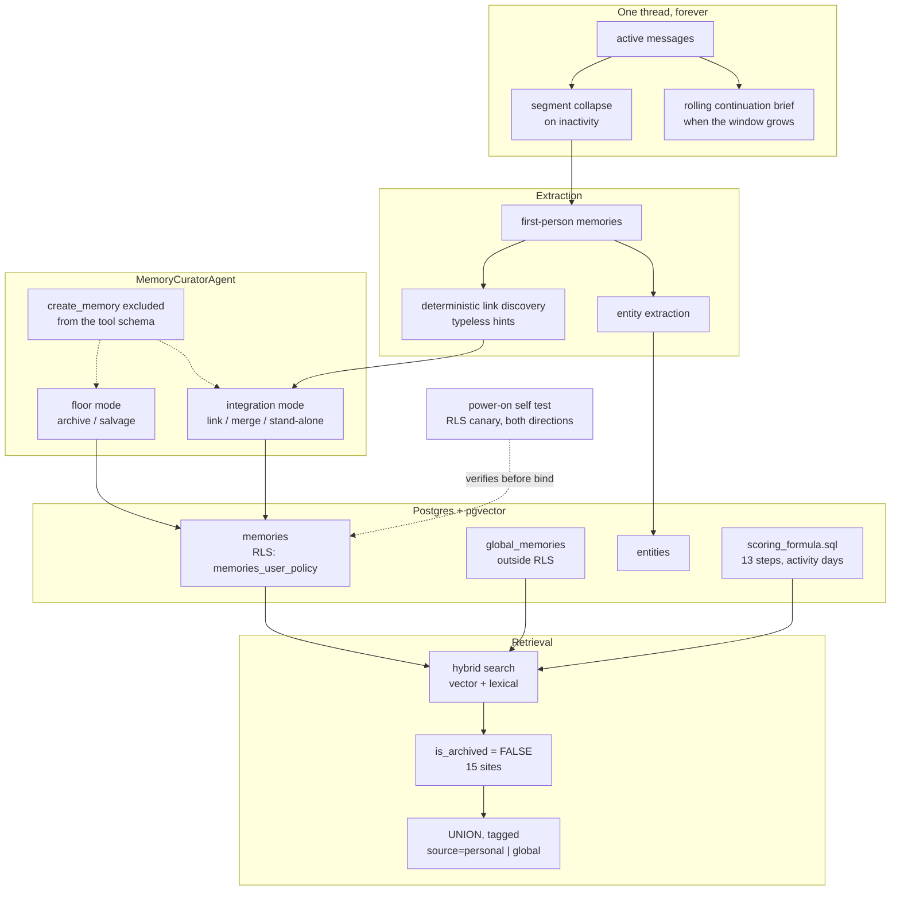

## 1. Executive Summary

MIRA is one person's attempt at a continuous digital entity, and it says so:
*"This is my TempleOS."* The design constraint that produces everything else is
that there is one conversation thread forever and no way to start a new chat.
Older material has to go somewhere, so it collapses — a segment reaching an
inactivity threshold is distilled into first-person memories, and the
conversation carries a rolling continuation brief when it grows too large
before that happens.

Three mechanisms make it worth reading. The **scoring formula** is a
thirteen-step calculation kept in `lt_memory/scoring_formula.sql` and described
there as the single source of truth, with every constant named and explained.
Its best idea is two clocks: decay counts the user's *activity days*, so a
fortnight offline does not degrade the store, while `happens_at` and
`expires_at` count calendar days *"since real-world deadlines don't pause"*.

The **curator** is an agent that links, merges, archives and salvages — and
cannot create. Its docstring says why the tool schema excludes `create_memory`:
*preventing manufactured silt*. A process that prunes must not be able to mint.

The **isolation** is Postgres row-level security on eleven tables, and it is
not left as a schema claim. A pre-server probe plants a canary row, opens two
RLS-scoped connections, and asserts that the owner can see it and another user
cannot — before Hypercorn binds a socket.

The report awards `scope_enforced`, `tombstone` and `negative_eval`. It
withholds `bitemporal`, `audit_log`, `trust_state` and `human_review`, and
section 9 gives the reason for each. The counterweight to all of the above is
in section 10: a `find` for test files across the whole tree returns two, both
about HTTP and URL safety. Nothing committed exercises the memory system.

## 2. Mental Model

A single thread, three states for the material in it.

**Live** is the active conversation, kept while it is relevant. **Collapsed** is
what happens when a segment goes quiet: `status` on a message moves from
`active` to `collapsed`, and the segment is distilled into memories written in
the first person. **Archived** is what happens to a memory the curator decides
is not earning its place — the row stays, and every read stops returning it.

The scoring formula is the pressure that drives the third transition. New
memories start around 0.5 and, in the formula's own phrase, have to "earn their
keep": importance rises with access rate, inbound links, entity links and
explicit LLM mentions, and decays without reinforcement, all passed through a
sigmoid centred so that an average memory lands near 0.5.

## 3. Architecture

## 4. Essential Implementation Paths

- **Domain types:** `lt_memory/models.py` — the `Memory` row and its link
  entries.
- **Data access and the archived predicate:** `lt_memory/db_access.py`.
- **Retrieval:** `lt_memory/hybrid_search.py`, `lt_memory/vector_ops.py`.
- **Ranking:** `lt_memory/scoring_formula.sql`.
- **Graph tending:** `agents/implementations/memory_curator_agent.py`,
  `lt_memory/linking.py`, `lt_memory/entity_merge.py`,
  `lt_memory/hub_discovery.py`.
- **Collapse:** `cns/core/message.py`, `cns/core/events.py`.
- **Isolation contract:** `deploy/mira_service_schema.sql`,
  `utils/power_on_self_test.py`.

## 5. Memory Data Model

The row carries more instrumentation than most, and the unusual fields are the
interesting ones:

- **`mention_count`** — explicit LLM references, annotated in the model as the
  strongest importance signal, and scored separately from `access_count`.
- **`activity_days_at_creation` / `activity_days_at_last_access`** — snapshots
  of the user's activity-day counter, so decay can be computed against
  engagement rather than wall-clock time.
- **`last_tended_at`** — when the curator last linked, merged, archived or
  salvaged this memory, `NULL` meaning never tended; the floor trigger samples
  on it.
- **`happens_at`** — when the thing the memory is about occurs, distinct from
  when the memory was created.
- **`inbound_links`, `outbound_links`, `entity_links`** — the graph the hub
  terms of the scoring formula are computed over.
- **`annotations`** — contextual notes with a source, kept beside the text
  rather than edited into it.

## 6. Retrieval Mechanics

Hybrid search runs a vector leg and a lexical leg and UNIONs a personal query
against a global one, tagging each row `source='personal'` or `source='global'`
so the caller can tell shared material from the user's own. Both legs carry
`is_archived = FALSE`.

Ranking is the SQL formula, and it repays reading in full because it states its
own constants and the reasoning behind them. Value comes from an access *rate*
rather than a raw count, with a seven-day floor on the denominator to stop new
memories spiking. Hub position contributes with diminishing returns after ten
inbound links, and entity links are weighted by entity type — a person counts
for more than a product. Explicit mentions score separately and are called the
strongest signal. A newness boost of 2.0 decays to zero over fifteen activity
days, a grace period rather than a permanent advantage. The raw total is
multiplied by a recency factor and a `happens_at` proximity multiplier, then
squashed by a sigmoid centred at 2.0 so an average memory maps to about 0.5.

The choice worth copying is which clock each term uses. Decay is in activity
days, because a user who goes on holiday has not decided their memories matter
less. Deadlines are in calendar days, because a date does not wait for someone
to come back.

## 7. Write Mechanics

A segment collapses when an inactivity threshold fires, and the collapse hook
spawns the curator in integration mode to tend each new memory — link it, merge
it, or leave it standing — before the user's next conversation. That ordering
matters: the graph is tended between sessions rather than during one.

Floor mode is the opposite direction. A trigger samples memories not tended in
a while and hands the curator a batch to triage as archive or salvage. The
separation between the two modes is a single `mode` key on the work item, and
the same agent serves both.

The division of labour with the deterministic code is stated plainly: discovery
emits typeless candidate hints, and the agent is the sole link typer — every
typed relationship in the graph was written by it. And it cannot create
memories at all.

## 8. Agent Integration

There is no MCP server. MIRA is a service — FastAPI and Hypercorn, its own
clients, its own agent framework, a web and mobile-facing API — built around
the premise that the user talks to one assistant in one thread. Memory is
internal plumbing rather than a surface other agents call.

## 9. Reliability, Safety, and Trust

**Scope enforcement — awarded, in the database.** RLS on eleven tables, a
policy per table, an index the schema comments as essential for it, and a
startup probe that checks the catalogue rather than trusting the migration.
Shared material is a separate table outside RLS rather than a nullable column
inside it, which means "global" cannot be reached by forgetting a predicate.

**Tombstone — awarded.** Archived rows stay, fifteen reads exclude them, and
the writer is an agent structurally prevented from creating the replacements it
might otherwise be tempted to write.

**Negative eval — awarded, in an unusual place.** The canary probe asserts both
directions on the same row. It is in the boot path rather than a test file,
which means it runs on every deployment and never in CI.

**Bitemporal — withheld.** The row carries `happens_at` alongside `created_at`,
which is the second axis the mark looks for, and no read uses it as one:
`happens_at` appears in the scoring formula as a proximity multiplier and in the
select lists, and nothing answers "what was true at time T". The axis exists and
feeds ranking.

**Audit log — withheld.** The schema declares twenty-two tables and none of them
records what happened to a memory; `billing_transactions` and
`stripe_webhook_events` are financial records, and `users_trash` is a
soft-delete for accounts. Archival stamps `archived_at` on the row itself, which
tells you a memory was archived but not by which pass or why.

**Trust state — withheld.** The epistemic axis here is `importance_score`, a
number the SQL formula computes and the ranking consumes. The discrete state
that withholds a memory is `is_archived`, and that is already carrying
`tombstone`.

**Human review — withheld.** No approval state gates what a memory may be used
for. The curator is an LLM agent, and its restraint is a tool-schema exclusion
rather than a human in the loop.

## 10. Tests, Evals, and Benchmarks

**No paper.** Searched the README and `docs/` for `arxiv`, `@article`, `@misc`,
`doi.org` and a `CITATION.cff`: none.

**No test of any memory behaviour.** `find . -name "*test*"` across the tree
returns four paths: the `tests/` directory itself, `utils/power_on_self_test.py`,
and two test files — `tests/utils/test_pinned_http.py` and
`tests/utils/test_url_safety.py`, both about outbound HTTP rather than memory.
There is no pytest configuration in `pyproject.toml`. So the thirteen-step
scoring formula, the collapse pipeline, the entity merge, the link typing and
the archival triage have no committed case establishing that any of them does
what it says.

That is the honest counterweight to everything in sections 6 and 7, and it is
worth stating precisely rather than as a complaint. The formula is a long SQL
expression with eight constants and a sigmoid; a change to any term is
unverifiable except by running the system and watching what surfaces. The one
property that *is* checked mechanically — user isolation — is checked in the
strongest available way, at every boot, against the live catalogue and with a
live canary. A reader should take that contrast as the shape of the project: the
author verified the thing that would be catastrophic to get wrong, and left the
rest to use.

## 11. For Your Own Build

- **Pick a clock per term, not per system.** Decay in activity days so a
  holiday does not degrade the store; deadlines in calendar days because they
  do not pause. Both live in the same formula here, each with the reason
  written beside it.
- **Forbid the pruner from creating.** Excluding `create_memory` from the
  curator's tool schema is one line of configuration that removes a whole class
  of failure — the agent that decides what to discard cannot replace it with
  something it wrote.
- **Check the isolation contract at boot, not in CI.** A probe that plants a
  canary and asserts both directions catches a dropped policy in the
  environment that actually matters, and it caught the subtler thing too: that
  the service pool has not inherited a session user id.
- **Separate shared material into its own table.** `global_memories` outside RLS
  cannot be reached by forgetting a predicate, which a nullable `user_id`
  inside the RLS table could be.
- **Rate, not count.** Value is access rate over a denominator floored at seven
  days, so a memory read twice on its first afternoon does not outrank one read
  steadily for a year.

## 12. Open Questions

- Archival is one-way at this pin — no writer sets `is_archived` back to false.
  Is a restore intended, or is re-extraction the recovery path?
- The formula's header calls itself the single source of truth. Is it
  interpolated into more than one query, and what keeps a caller from computing
  importance a second way?
- With no test around the scoring formula, how is a constant change validated
  before it reaches a live store?

## Appendix: File Index

- Domain types: `lt_memory/models.py`
- Data access: `lt_memory/db_access.py`
- Hybrid search: `lt_memory/hybrid_search.py`, `lt_memory/vector_ops.py`
- Ranking: `lt_memory/scoring_formula.sql`
- Graph: `lt_memory/linking.py`, `lt_memory/entity_merge.py`,
  `lt_memory/hub_discovery.py`, `lt_memory/entity_extraction.py`
- Curator: `agents/implementations/memory_curator_agent.py`,
  `agents/triggers/memory_floor_trigger.py`
- Conversation: `cns/core/message.py`, `cns/core/events.py`
- Schema and isolation: `deploy/mira_service_schema.sql`,
  `utils/power_on_self_test.py`

## History

**2026-09-19** — [`e401d59bde9b6d9811d05b7abee1438907f99394`](https://github.com/taylorsatula/mira/commit/e401d59bde9b6d9811d05b7abee1438907f99394) — first reading, at the head of `main`. Screened with `scripts/screen_repo.py` before anything was read: no auto-run surface, no build-time execution, nothing inside the seven-day cooldown, one unpinned dependency surface with thirty-six requirements not pinned with `==`, and an `AGENTS.md` addressed to a reading agent which was read as data. Nothing was installed, built or run. Three marks. The reading covered the memory row and its instrumentation, the data-access layer and its archived predicate, hybrid search across the personal and global legs, the scoring formula in full, the curator agent and its two modes, the collapse path, and the schema's row-level security together with the startup probe that verifies it; the tool framework, the billing tables and the web surface were read as context rather than as subject. AGPL-3.0, licence text in the tree. Four marks are withheld with reasons in section 9, and the one worth repeating here is `audit_log`: twenty-two tables in the schema and none of them records what happened to a memory. The finding that most shapes how to read the rest is that a `find` for test files across the tree returns two, both about HTTP and URL safety — the memory system has no committed test, while the isolation contract is re-verified against the live catalogue on every boot.
