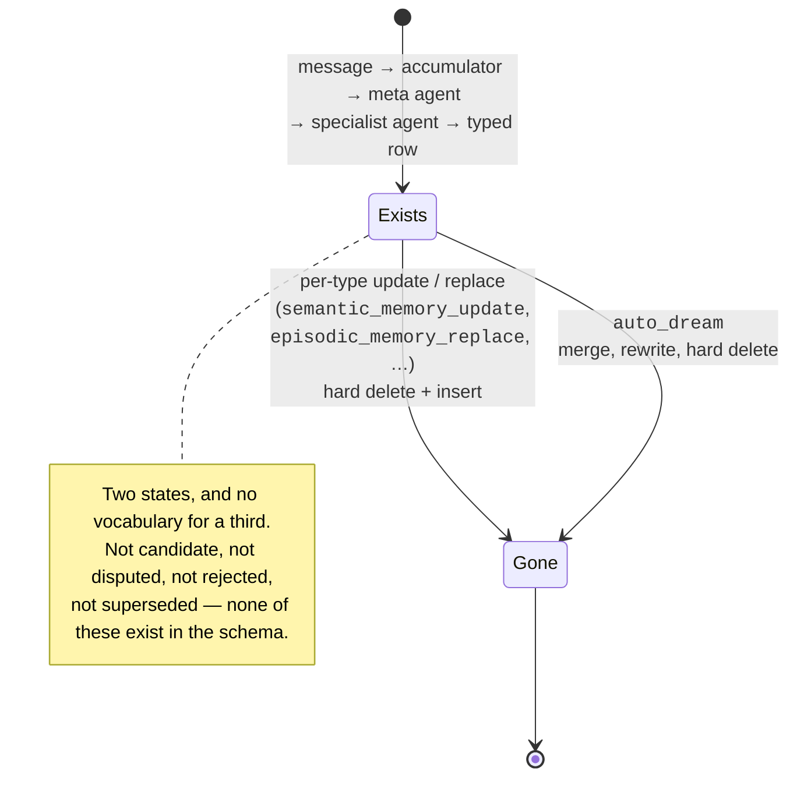
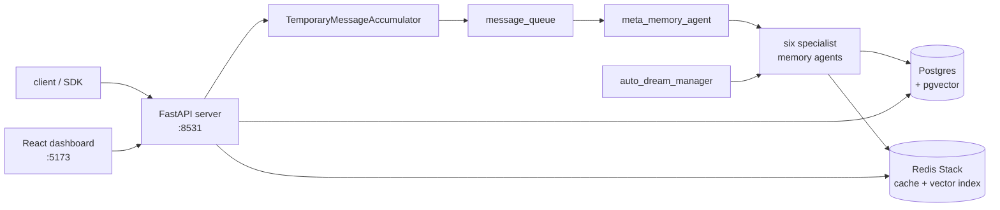

## 1. Executive Summary

MIRIX is a multi-agent personal-assistant memory service: a Postgres (or SQLite)
backend behind a REST API, with six *typed* memory tables — episodic, semantic,
procedural, resource, knowledge vault, and core blocks — each owned by its own
writer agent, and a meta agent that routes incoming material to whichever of them
should handle it. It is built for continuous ingestion, including screen capture
and voice, rather than for a chat turn.

The lineage is visible: `mirix/orm/` carries `sqlalchemy_base.py`,
`organization.py`, `block.py` and an actor-scoped `read()`, which is
[Letta](../letta/)'s shape. What MIRIX adds is the typing — one table, one manager,
one agent, one prompt per memory kind — and a multi-tenant scope model that is
materially stronger than Letta's.

**What is genuinely good here is the scope discipline.** Most of the atlas stores
a scope key and filters on it in the obvious query. MIRIX filters on it in the
obvious query *and* in the Redis cache lookups
(`mirix/services/episodic_memory_manager.py:705`), and has 33 test files, several
of which assert that a memory created under one scope is **not** returned by a
search under another. That last property is carried by two other repositories in
the whole atlas, and MIRIX is the first to reach it from access-control testing
rather than from memory-correctness work — see section 10.

**What is weakest is that nothing above the row can be trusted or repaired.**
There is no trust state, no confidence, no supersession chain, and no tombstone —
a case-insensitive search over `mirix/orm`, `mirix/schemas` and `mirix/services`
returns zero hits for `rejected`, `verified`, `confidence`, `provenance` or
`tombstone`. Correction is `episodic_memory_replace`, which is a loop of
`hard_delete` followed by a loop of `insert`. And a background pass called
`auto_dream` periodically loads the whole store and lets an agent rewrite it under
a prompt that says to resolve conflicts "conservatively". A user's deletion
survives exactly until that pass disagrees.

## 2. Mental Model

A memory in MIRIX is a **typed row that an agent decided to write**, and its type
is a routing decision made once, at write time, by a classifier agent.

The six types are not interchangeable:

| Type | What a row holds |
| --- | --- |
| `core` | A block of always-in-context persona or user text |
| `episodic` | An event — `occurred_at`, `actor`, `event_type`, `summary`, `details` |
| `semantic` | A named concept — `name`, `summary`, `details`, `source` |
| `procedural` | An ordered how-to |
| `resource` | A document or file reference |
| `knowledge` | A credential, bookmark or API key — `sensitivity` plus `secret_value` |

A seventh table sits beside them rather than among them. `raw_memory` holds the
unprocessed task-context string, and it is evidence rather than belief — which is
why the six above are what the classifier routes to and this one is not a routing
destination.

`raw_memory` is the interesting one, and the atlas has a pattern for it:
[evidence before belief](../../patterns/evidence-before-belief/). The raw context
string is stored, embedded, and searchable in its own right, so a bad extraction
into `semantic_memory` does not destroy the material it came from. Little else in
the typed-memory family keeps this.

The state machine is short, which is the point:

There is no state between "exists" and "gone". A row is never a candidate, never
disputed, never rejected, never superseded — the vocabulary does not exist in the
schema. Memory is **background-managed**: the agent writes it, the agent rewrites
it, and the human dashboard can look but not touch (section 8).

The system treats every stored row as ground truth. `semantic_memory.source` is a
free-text string — the ORM's own example is `'user on 2025-03-01'` — so provenance
is a sentence, not a link to the `raw_memory` row it came from.

## 3. Architecture

Four services, all in `docker-compose.yml`:

- **Persistence** is Postgres with `pgvector` (`ankane/pgvector:v0.5.1`) when
  `MIRIX_PG_URI` is set, and SQLite with an FTS5 virtual table otherwise. The ORM
  branches on this per table — `mirix/orm/episodic_memory.py` declares GIN indexes
  over `to_tsvector` for Postgres and plain B-tree indexes plus FTS5 for SQLite.
- **Redis Stack** is not merely a cache. It holds a searchable index per memory
  type (`EPISODIC_INDEX` and siblings) and serves vector, text and recency queries
  directly, with Postgres as the fallback path.
- **Background** is `mirix/services/auto_dream_manager.py`, plus the accumulator's
  own absorb loop.

### Deployment and ergonomics

This is the expensive end of the atlas. `docker compose up` brings up Postgres,
Redis Stack, the API server and the dashboard; you then create an API key in the
dashboard and set `MIRIX_API_KEY`. An LLM API key is required to store anything at
all — every write goes through a meta agent and a specialist agent, so there is no
[zero-LLM capture](../../patterns/zero-llm-capture/) path, and a provider outage
during ingestion means the buffer holds and nothing is written.

It can run local and offline in principle — SQLite and a local model provider are
both supported, and `tests/README_OLLAMA_SETUP.md` documents the latter — but the
Redis search path is where the performance work went, so the degraded mode is the
one you would run in production only reluctantly.

The store is inspectable by hand (it is SQL) and the dashboard renders it, but
repairing it by hand means writing SQL against six tables and then invalidating
the Redis keys yourself, because the cache is written by the managers rather than
derived on read.

## 4. Essential Implementation Paths

**Capture** — `mirix/agent/temporary_message_accumulator.py`. `add_message()`
appends `(timestamp, item)` to a flat list; images upload asynchronously via
`upload_manager`. `should_absorb_content()` (line 168) decides when a batch is
ready — for upload-bearing models it waits on pending uploads to resolve, so
capture is gated on cloud file readiness, not only on message count.

**Routing and extraction** — `absorb_content_into_memory()` (line 313) builds one
message and hands it to `_send_to_meta_memory_agent()` or
`_send_to_memory_agents_separately()`. The meta agent
(`mirix/agent/meta_memory_agent.py`) calls `trigger_memory_update()`
(`mirix/functions/function_sets/memory_tools.py:954`) with a list of memory types,
which fans out to the specialist agents. Each specialist has its own system prompt
under `mirix/prompts/system/base/`.

**Write** — the specialist tools in
`mirix/functions/function_sets/memory_tools.py`: `episodic_memory_insert` (112),
`episodic_memory_merge` (168), `episodic_memory_replace` (216),
`semantic_memory_insert` (603), `semantic_memory_update` (685),
`procedural_memory_insert` (440), `resource_memory_insert` (321),
`knowledge_vault_insert` (754), and `finish_memory_update` (1197) as the
terminator.

**Retrieval** — `mirix/services/*_manager.py`. `list_episodic_memory()`
(`episodic_memory_manager.py:645`) is representative: it takes `search_method`
(`embedding`, `bm25`, `string_match`), `filter_tags`, `scopes`, a date range and an
optional `similarity_threshold`, tries Redis first, and falls through to
`_postgresql_fulltext_search()` (line 1015) or the vector path. The agent-facing
entry point is `search_in_memory` in `mirix/functions/function_sets/base.py:84`.

**Correction/delete** — `episodic_memory_replace` resolves every id first (so a
bad id fails the whole call), then calls
`episodic_memory_manager.delete_event_by_id()` per id, then inserts the new items.
`delete_event_by_id` (line 318) evicts the Redis key and calls
`episodic_memory_item.hard_delete(session)`. The base class offers both `delete()`
(soft, setting `is_deleted`) and `hard_delete()`; the memory path takes the hard
one.

**Background** — `mirix/services/auto_dream_manager.py` reads the last checkpoint,
fetches memories per type, formats them, steps the `AutoDreamAgent`, and writes a
new checkpoint as an episodic event tagged
`filter_tags={"type": "system", "source": "auto_dream"}`. Note `_fetch_episodic()`
at line 113: `start_date=None, end_date=None, limit=500`, with a comment saying
outright that it "fetches ALL current memories regardless of date; the passed
window is only recorded in the response for reference."

**Schema** —
`mirix/orm/{episodic,semantic,procedural,resource,knowledge_vault,raw}_memory.py`,
all inheriting `SqlalchemyBase, OrganizationMixin, UserMixin`.

## 5. Memory Data Model

Every memory table carries the same scope trio: `organization_id` and `user_id`
from the mixins, `client_id` as an explicit foreign key "for access control and
filtering", plus a `filter_tags` JSON whose `scope` key is separately indexed
(`ix_episodic_memory_org_filter_scope`). That is four levels of boundary, and
section 10 shows they are tested.

Temporal fields are where a near-miss lives. `episodic_memory` and `raw_memory`
both carry `occurred_at` alongside the base class's `created_at`/`updated_at` —
event time separate from record time, which is the shape
[bi-temporal fact validity](../../patterns/bi-temporal-fact-validity/) asks for.
**The flag is withheld anyway**, for two reasons. The column's own docstring
collapses the distinction — "Timestamp when the event occurred *or was recorded*" —
and `semantic_memory`, where changing facts actually live, has no validity time at
all, only `created_at`. There is no `valid_from`/`invalid_at` pair and no
supersession chain, so a superseded fact has no interval to close. This is an event
log with an event timestamp, which is a weaker thing.

`last_modify` is a JSON column defaulting to
`{"timestamp": ..., "operation": "created"}` and updated in place on every write.
It records the *last* modification, not a history — so it does not earn
`audit_log`, and it is worth knowing that it silently loses the previous operation
each time.

`knowledge_vault` deserves a warning. It has `entry_type` ('credential',
'bookmark', 'api_key'), a `sensitivity` column, and `secret_value` holding "the
actual credential or data value" — as a plain `String`. No encryption appears in
`mirix/orm/knowledge_vault.py` or `mirix/services/knowledge_vault_manager.py`. The
`sensitivity` field labels the risk without mitigating it, and the value is
embedded and indexed like every other row, which means a credential is reachable by
semantic similarity.

## 6. Retrieval Mechanics

Retrieval is per-type and caller-selected: you name the memory type, the search
method, and the field. There is no fusion across the three methods and no
cross-type ranking — a query that should hit both a semantic concept and an
episodic event runs twice, and the agent reconciles the results in context.

The Redis path handles three shapes: `search_recent` (sorted by `occurred_at_ts`
for episodic), `search_vector` against a named embedding field, and `search_text`
BM25-style over `["details", "summary"]`. All three take `user_id`,
`organization_id`, `filter_tags`, `scopes`, `start_date` and `end_date` as
first-class arguments rather than post-filtering — the boundary is inside the index
query.

Postgres full-text uses three GIN indexes per table: on `summary`, on `details`,
and on a combined `coalesce(summary,'') || ' ' || coalesce(details,'')` expression,
so a phrase spanning both fields is matchable.

The failure mode to expect is over-recall. `limit` defaults to 50 and
`similarity_threshold` is optional and unset by default. Nothing decides that a
turn needs no memory — there is no [gate on the expensive
path](../../patterns/gate-the-expensive-path/) — so retrieval always returns its
top *k*, and MIRIX is a screen-capture system, which means *k* is drawn from a
store that grows continuously whether or not the user did anything memorable.

## 7. Write Mechanics

Writes are **deferred and LLM-mediated**, and both halves matter.

Deferred: content enters `TemporaryMessageAccumulator` and waits. The batch is
released by `should_absorb_content()`, which for Gemini-family models blocks until
pending image uploads resolve. So the lag between "the user said something" and
"the system can recall it" is a function of batch size *and* upload latency, and
nothing in the repository measures it. This is the lag the
[benchmarks page](../../benchmarks/) says nobody reports; MIRIX is a clean example
of why it is not zero.

LLM-mediated: every write goes through at least two model calls — the meta agent
choosing types, then each specialist agent choosing rows. A write is never cheap
and never possible offline.

Deduplication is advisory. `check_semantic_memory` and `check_episodic_memory`
(lines 570 and 288) let an agent fetch rows by id before deciding, but nothing
requires it — they are tools in a prompt, not a gate on the insert path. That is
the atlas's [tool descriptions as
policy](../../compare/#tool-descriptions-as-policy) antipattern in its ordinary
form.

Correction is destructive, and the good intention is in the wrong place. The
`auto_dream` prompt for experience memory
(`mirix/prompts/system/base/auto_dream_agent/experience.txt`) says: "Resolve
conflicts conservatively, preferring the more recent or more detailed item. If
uncertain, keep both and record the discrepancy in the merged details/caption."
That is close to the best correction policy in this atlas — [Memanto](../memanto/)'s
`keep_both` is the same idea — except Memanto's is an enum a validator enforces and
MIRIX's is a sentence in a prompt. When the model does not follow it, the tool it
calls is `episodic_memory_replace`, and the row is hard-deleted.

### Operational cost

- **Synchronous?** No. The agent does not block on extraction; the accumulator
  absorbs on its own schedule.
- **Lag?** Unmeasured, and load-bearing. At minimum a batch boundary; with image
  uploads, as long as the slowest pending upload.
- **Whole-store passes?** Yes — `auto_dream` fetches up to 500 items *per memory
  type* and feeds them to an agent, so its token bill scales with the size of the
  store rather than with the day's activity, and it re-reads material it has
  already processed on every run.
- **Read path?** Bounded by `limit` (default 50) per type, but the agent may search
  several types per turn, and core memory blocks are always in context.

## 8. Agent Integration

The API is REST plus a Python client (`mirix-client` on PyPI). MCP appears in
`mirix/functions/mcp_client/`, but it is an **outbound** client letting MIRIX's
agents call external tools (there is a Gmail client), plus `mcp_marketplace.py` and
`mcp_tool_registry.py`. MIRIX does not expose its memory as an MCP server, so
wiring it into another agent host means the REST API.

Agency over memory is total and unsupervised. The specialist agents insert, update,
replace and delete; `trigger_memory_update_with_instruction` (line 894) lets one
agent direct another's rewrite. There is no approval step anywhere on that path.

The dashboard is where a reader might expect human review, and it is worth being
precise: `dashboard/src/pages/dashboard/Memories.tsx` is 800 lines rendering six
memory types with expand/collapse handlers. Every interactive element is a
`toggle*`; there is no `POST`, `PUT`, `PATCH` or `DELETE` against a memory endpoint
in the file. It is a viewer. Under the atlas's rule that a UI which only displays
is not a review surface, `human_review` is withheld.

## 9. Reliability, Safety, and Trust

Trust is not represented at all. There is no status field, no confidence score, no
corroboration, and no attestation. `semantic_memory.source` is prose. A fact
extracted from a hallucinated screen OCR and a fact the user stated directly are
the same kind of row.

Prompt injection has an unusually large surface here, because MIRIX ingests screen
captures. Text rendered in any window the user has open is fed to a meta agent that
decides what to store and to specialist agents holding `episodic_memory_replace`
and `knowledge_vault_update`. Nothing in the inspected code treats captured screen
content as lower-trust than user speech.

Multi-tenancy is the strong part, and is the reason to read this report if you are
building a service. Four scope levels, applied in the SQL, in the Redis index
queries, and in the tests, with `read_scopes`/`write_scope` distinguished on the
client — `tests/test_multi_scope_access.py` asserts that a read-only client cannot
create memory and cannot modify shared memory.

Data-loss risk is concentrated in one place: `auto_dream` plus `hard_delete`. There
is no soft delete on the memory-replace path, no tombstone, no audit row, and the
raw context for an episodic event is not the same object as the event. If the pass
merges two events badly, the originals are gone — `raw_memory` may still hold the
source context, but nothing links the deleted event back to it.

## 10. Tests, Evals, and Benchmarks

33 test files under `tests/`, which is above the atlas median, and the emphasis is
on boundaries rather than on recall quality: `test_client_agent_isolation.py`,
`test_multi_scope_access.py`, `test_scoped_blocks.py`, `test_filter_tags_db.py`,
`test_search_all_users.py`, `test_deletion_apis.py`, `test_raw_memory.py`,
`test_temporal_queries.py`, plus Redis-cache equivalents.

**This is where MIRIX earns `negative_eval`, and it earns it twice over.**
`tests/test_filter_tags_db.py:300` creates a raw memory under scope `test-ft`,
searches under `scopes=["other-scope"]`, and asserts `mem.id not in result_ids` —
named material, reachable by the same query under a different key, asserted absent.
`tests/test_search_all_users.py:405` does the larger version: four users, a
cross-user search, and explicit assertions that user3 (different scope) and user4
(different organization) do not appear in the results.

That is a **negative retrieval assertion** under the
[rubric](../../methodology/atlas-rubric/)'s definition, and the route is new.
[open-cowork](../open-cowork/) arrived via `forbiddenHits` in a relevance harness
and [Verel](../verel/) via a red-team regression; MIRIX arrived by testing
multi-tenant access control, which is a discipline with its own literature and no
connection to memory research. That is mildly encouraging for the atlas's argument:
the assertion shape is reachable from ordinary engineering practice, not only from
thinking hard about memory.

It is also narrower than the other two. Every negative assertion here is about a
*boundary*. None asserts that a deleted value stays deleted, or that a corrected
value does not return — which is the assertion `auto_dream` most needs and does not
have.

The eval tree (`evals/`) runs LongMemEval, RULER, an LRU eval and MAB
(MemoryAgentBench) through `evals/mab/`, with an LLM judge (`evals/llm_judge.py`,
`evals/mab/llm_judge_substring.py`). The survey that prompted this review reports
MIRIX on LoCoMo and MemoryAgentBench; **no scored results are committed to this
repository**, so those numbers are claims rather than artifacts — the atlas's note
on [published benchmark numbers without committed
artifacts](../../compare/#published-benchmark-numbers-without-committed-artifacts)
applies in its mild form.

The test I would want before trusting this: one that deletes a memory, runs
`auto_dream`, and asserts the memory is still absent. Nothing of that shape exists.

## 11. For Your Own Build

### Steal

- **Put the scope key in the cache query, not just the database query.** The common
  failure of [scope as a first-class
  key](../../patterns/scope-as-a-first-class-key/) is that the boundary holds in
  SQL and leaks through a cache written before anyone thought about tenancy. MIRIX
  passes `user_id` and `organization_id` into every Redis search call as arguments,
  so the fast path cannot be looser than the slow one.
- **Test the boundary by asserting exclusion, not inclusion.** Create the row, query
  under a key that should not see it, assert the id is absent. It is three extra
  lines beside a test you are already writing, and it is the assertion your scope
  claim actually rests on.
- **Keep a raw-context table beside the typed ones.** `raw_memory` costs one table
  and makes a bad extraction survivable.
- **Separate read scope from write scope on the client.** `read_scopes` as a list
  and `write_scope` as a single value is a cheaper, clearer model than a permission
  matrix, and it makes "this integration may read everything and write only here"
  expressible in one field.

### Avoid

- **Do not put the correction policy in the prompt and the deletion in the tool.**
  "If uncertain, keep both" is the right rule and nothing enforces it. If a policy
  matters it belongs in a validator that refuses the call — the [governed write
  gateway](../../patterns/governed-write-gateway/) shape — not in a paragraph the
  model may skip.
- **Do not run a periodic pass that loads the whole store and can hard-delete.**
  Either the pass proposes and something else applies, or deletions leave a record.
  `auto_dream` has neither, so the answer to "does a deletion stay deleted?" is
  "until the next run".
- **Do not store secrets in the same embedded, semantically searchable table as
  everything else.** A `sensitivity: 'high'` column that changes no code path is
  documentation.
- **Do not let a `last_modify` field stand in for an audit trail.** It overwrites
  the only record of what happened last time.

### Fit

MIRIX suits a team building a *hosted, multi-tenant* assistant that has already
decided to run Postgres and Redis and wants the tenancy model to be right from the
start. That is a real and underserved position, and MIRIX is better at it than most
of this atlas.

It does not suit anyone who needs memory to be repairable. No trust state, no
tombstone, hard delete on the correction path, and an unsupervised whole-store
rewriting pass together mean the store's contents are whatever the last agent run
decided, and there is no mechanism by which a user's "no, that's wrong" outlives
it. If your product makes promises about correcting or forgetting, this
architecture cannot keep them without changes to the write path.

Walk away entirely if you cannot run four services, or if you need any write to
succeed without a model call. And if the screen-capture ingestion is what attracts
you, cost the token bill first: continuous capture plus a whole-store `auto_dream`
pass is a bill that grows with the store rather than with the user's activity.

## 12. Open Questions

- **How often does `auto_dream` actually run?** `AutoDreamManager` resolves a window
  from the last checkpoint, but the scheduler that invokes it was not traced from
  the API layer. The blast radius depends entirely on the answer.
- **Is `raw_memory` retained indefinitely?** No TTL or pruning path was found,
  though `delete_by_user_id` and `soft_delete_by_client_id` exist across managers
  and a retention policy may live in deployment configuration rather than in code.
- **What happens to the Redis index when Postgres is written directly?** The
  managers keep both in step; a manual SQL repair would not. Whether a
  reconciliation job exists was not established.
- **Do the committed evals reproduce the LoCoMo and MemoryAgentBench numbers the
  survey reports?** Running them would answer it; no results are committed.
- **Is `secret_value` encrypted at any layer above the ORM** — in the hosted
  product, or by a Postgres extension in a deployment not represented here?

## Appendix: File Index

**Storage/schema** — `mirix/orm/episodic_memory.py`, `semantic_memory.py`,
`procedural_memory.py`, `resource_memory.py`, `knowledge_vault.py`,
`raw_memory.py`, `base.py`, `mixins.py`, `sqlalchemy_base.py`

**Write path** — `mirix/agent/temporary_message_accumulator.py`,
`mirix/agent/meta_memory_agent.py`,
`mirix/functions/function_sets/memory_tools.py`, `mirix/prompts/system/base/`

**Retrieval path** — `mirix/services/episodic_memory_manager.py`,
`mirix/services/semantic_memory_manager.py`, `mirix/database/redis_client.py`,
`mirix/functions/function_sets/base.py`

**Background** — `mirix/services/auto_dream_manager.py`,
`mirix/agent/auto_dream_agent.py`, `mirix/agent/background_agent.py`,
`mirix/prompts/system/base/auto_dream_agent/*.txt`

**API/SDK** — `mirix/functions/mcp_client/`, `mirix/services/mcp_tool_registry.py`,
`dashboard/src/pages/dashboard/Memories.tsx`

**Tests/evals** — `tests/test_filter_tags_db.py`, `tests/test_search_all_users.py`,
`tests/test_multi_scope_access.py`, `tests/test_client_agent_isolation.py`,
`tests/test_deletion_apis.py`, `tests/test_raw_memory.py`, `evals/mab/`,
`evals/llm_judge.py`

## History

**2026-07-29** — [`51f3342d5366b0e215439581f92e0323227146af`](https://github.com/Mirix-AI/MIRIX/commit/51f3342d5366b0e215439581f92e0323227146af) — first reading.
