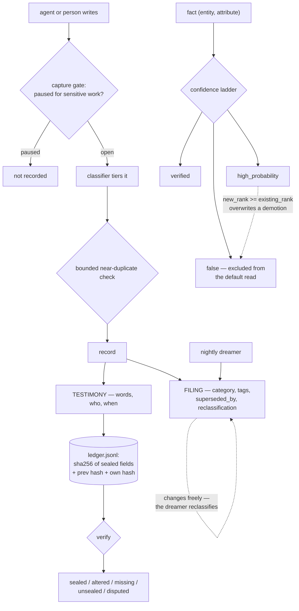

## 1. Executive Summary

Mnemo Cortex is a local memory server for agents — about 36,300 lines of Python,
per-tenant JSON memories, a SQLite facts store, an HTTP API, MCP bridges, a
nightly synthesis pass and a USB courier that syncs two installations with no
cloud and no VPN.

Three marks. The design idea worth taking is **sealing only the half that must
not change.**

`ledger.py` splits every record in two. The TESTIMONY is what the person or agent
said — the summary, the key facts, the decisions, who said it and when. The
FILING is what the store did with it afterwards — category, tags,
`superseded_by`, reclassification marks. The filing is *expected* to change,
because the nightly dreamer reclassifies and a later write supersedes. The
testimony is not: *"once a memory is saved, its words must never silently become
other words."*

So the chain covers the testimony and leaves the filing alone. A hash chain over
the whole record would break every time the dreamer did its job, and a project
that hit that would probably have dropped the chain rather than split the record.

**It is honest about what sealing proves.** The module says so in its own words —
*"local evidence, not third-party proof: whoever can write the memory files can
also rewrite the ledger from scratch"* — and then names what it does catch: *"a
bad migration, a half-finished script, a sync that mangled a file, a stick that
carried something the origin never wrote — and it catches it every time."* That
is the correct claim for a local-first tool, stated where an operator will read
it.

The verification states are unusually careful, and one of them is a state most
designs do not have a name for. A record is `sealed`, `altered`, `missing`,
`unsealed` — or **`disputed`**, which applies only when the chain is broken and
means the record *matches an entry the chain cannot vouch for*, because *"a hash
chain cannot say WHICH"* entry was tampered with. Most systems collapse that into
"invalid".

**And then the finding the report is named for.** `facts_store.py` defines a
three-rung confidence ladder — `false`, `high_probability`, `verified` — and
enforces it on writes so that *"lower confidence cannot silently overwrite
higher"*. `false` is rung zero.

The consequence is at `facts_store.py:280`, in the branch that handles a
contradicting value:

```python
if new_rank >= existing_rank:
```

A fact demoted to `false` — the explicit judgement that a value is wrong — sits at
the bottom of the ladder, so **any ordinary `high_probability` write of a
different value outranks it and overwrites it.** The ladder protects `verified`
from being weakened and leaves `false` unprotected, which is the inverse of what a
correction mechanism needs. `demote()` exists only because *"the promotion ladder
otherwise blocks verified→false"*, so the judgement is hard to record and easy to
erase.

## 2. Mental Model

A memory has two halves with different rules, and a fact has a rung.



The dotted edge on the right is the finding in section 1.

## 3. Architecture

An HTTP server plus a CLI over per-tenant directories of JSON memories, with
`facts.sqlite` shared globally in WAL mode. Nothing about it is hosted: the
README's premise is that the whole thing runs on your machine.

**The sync story is a USB stick.** `stick.py` is *"NOT a server"* — both machines
run full Mnemo and the stick carries the delta between them: memory JSONs,
trajectory JSONLs, the brain git repo and a project pad. *"Plug in → sync; pull
out → carry → plug in → the other machine catches up. No cloud, no VPN."* For a
design whose threat model is that nothing should leave the machine over a network,
a courier is a coherent answer rather than a novelty.

A retired file is kept as `mem0_bridge.py.retired-20260523` — dated in the
filename rather than deleted, which is a small habit that matches the ledger's
philosophy.

## 4. Essential Implementation Paths

- **Ledger** — `agentb/ledger.py:1-34` (the testimony/filing split, the limits,
  the five states).
- **Facts** — `agentb/facts_store.py`: `CONFIDENCE_LEVELS` (24), `get` with
  `include_false` (149), `query` (165), `save` and the rank comparison (206-300),
  `demote` (321), `history` (370), `contradictions` (385).
- **Sync merge rules** — `agentb/stick_facts.py:10-20`, `:72`.
- **Capture gate** — `agentb/capture_gate.py:1-9`.
- **Classifier** — `agentb/classify.py:1-10`; dedup in `agentb/dedup.py`.
- **Courier** — `agentb/stick.py:1-8`.
- **Dreamer** — `mnemo-dream.py:1-8`.
- **Server and scope** — `agentb/server.py`: `_enforce_scope` (994-1000), scoped
  token pinning (966-968, 1857-1859).

## 5. Memory Data Model

Two stores with different shapes. Memories are JSON per tenant with the
testimony/filing split. Facts are rows in SQLite keyed on a composite primary key
of `(entity, attribute)` — one current value per pair — with a confidence rung, an
evidence source, a source memory id and a source agent, and an append-only
`fact_history` beside them.

**Memories are never deleted.** Demotion keeps the JSON, which is what makes
`missing` a meaningful ledger state rather than an ordinary condition: a sealed
file that is gone *"is news"*.

**`tombstone` is withheld, and the project calls it one.**
`agentb/stick_facts.py:20` says *"'false' IS the tombstone state"*, and for
synchronisation that is exactly right — a newer `false` row propagates the
judgement across the courier without needing a delete operation, which is a clean
answer to distributed deletion. Locally it does not bind: `false` ranks lowest,
the contradiction branch admits any write whose rank is greater than or equal to
the existing one, and nothing is keyed on the rejected value. The same wrong value
re-asserted at `high_probability` takes the row back.

## 6. Retrieval Mechanics

Vector search with a lexical channel, and an `explore` mode that deliberately does
not return the best match first — it surfaces an adjacent memory, with a test
asserting both that it returns something and that the noise band does not pad the
result.

Facts read through `get`, which excludes `false` by default, and `query`, which
takes filters and orders by `last_updated`.

Scope is a tenant directory plus a scoped token pinned to one agent, enforced by
`_enforce_scope` as a 403 when the request's `agent_id` does not match the pin —
and it fails closed on a missing id, because *"it would otherwise land in the
'default' tenant."* **`scope_enforced` is withheld** on the rubric's explicit
carve-out: this is a physical partition plus an authorisation check rather than a
stored key applied as a filter on a query. It is arguably a stronger boundary than
a predicate; it is a different one.

## 7. Write Mechanics

Writes are synchronous and pass three things on the way in: a capture gate, a
classifier and a bounded duplicate check.

**The capture gate is a user-facing pause**, and its rationale is a privacy
argument rather than a performance one: the auto-capture pipeline syncs terminal
activity every sixty seconds, and *"during a credential rotation or any
secret-handling work, even redaction-pattern misses"* are a risk worth stopping
recording for. A redaction suite exists and the gate exists because redaction is
not trusted to be complete.

The nightly dreamer reads the day across all agents, synthesizes a brief, and
writes it back so every agent gets it at startup — and its reclassifications land
in the filing, which is the half the ledger does not seal.

## 8. Agent Integration

An HTTP server with scoped tokens, a CLI, and MCP bridges under `integrations/`.
The courier is the cross-machine story.

## 9. Reliability, Safety, and Trust

The ledger is the reliability story and section 1 covers it. Two details belong
here.

`unsealed` is a first-class state rather than an error: pre-ledger stores, records
carried in by a courier, or anything written by a tool that bypassed the server
are unsealed rather than invalid, and `seal_unsealed` adopts them. A system whose
sync mechanism is a USB stick needs that state to exist, and defining it
deliberately is better than discovering it.

The sync merge rules are reasoned in `stick_facts.py`: a newer `false` beats
anything because *"demote() is an explicit judgment ('this is wrong') and must
propagate"*, while *"a STALE 'false' loses"*. So across machines, the judgement is
protected by recency. Locally, on the same ladder, it is not protected at all —
the two halves of the same design disagree about how much a demotion is worth.

## 10. Tests, Evals, and Benchmarks

A substantial suite. `tests/test_explore_mode.py` is the one that earns
`negative_eval`, and its structure is the reason: three positive assertions —
default mode returns the bullseye first, explore returns results at all, explore
surfaces the adjacent memory first — stand between the fixture and
`assert "far" not in explore_ids`, each with the reason attached as an assertion
message. A retriever that returned nothing would fail two of them before reaching
the negative.

`tests/test_redact.py` covers the write path: private key blocks and
high-entropy tokens must not survive redaction. `tests/test_nomic_prefix.py:225`
asserts an embedding prefix does not leak into stored rows, which is the kind of
bug that is invisible until someone greps their own database.

No paper and no `CITATION.cff`.

Nothing was run. The screen reports four dependency manifests under
`integrations/` changed the day of the pin, inside the seven-day cooldown.

## 11. For Your Own Build

### Steal

**Split the record into the half that must not change and the half that must.**
Sealing everything makes the chain break on ordinary work; sealing nothing makes
it worthless. Testimony and filing is the cut, and naming the two halves is what
makes the rule enforceable.

**Say what your integrity check does not prove.** *"Local evidence, not
third-party proof"* costs one sentence and stops an operator trusting it against
an adversary who has the disk.

**Give a broken chain its own state.** `disputed` — matching an entry the chain
cannot vouch for — is honest about the fact that a hash chain localises a break
but not a culprit.

**Make "written by something that bypassed us" a state, not an error.**
`unsealed` plus an adopt operation is what lets a courier-based sync exist at all.

**Let the user stop the recorder.** A capture gate for credential work admits that
redaction patterns miss, which is true, and gives the user the one control that
actually closes the hole.

### Avoid

**Ranking your rejection state at the bottom of your confidence ladder.** `false`
is the judgement that something is wrong, and here it is the rung that everything
outranks. A contradicting `high_probability` write takes the row back, so the
correction survives exactly until the next ordinary assertion. If a ladder governs
overwrites, the rejected state needs to sit outside it or above it — and the sync
code already treats it that way, which makes the local behaviour look like an
oversight rather than a position.

**Calling something a tombstone when it is a sync marker.** It is a good sync
marker — propagating a judgement instead of a delete is the right design for a
courier. It is not a durable record keyed on the rejected value, and the two get
conflated because the word is the same.

### Fit

This suits someone running agents on their own machines who wants memory that
never leaves them, can be carried between them physically, and can be checked for
tampering after a bad migration. The ledger design is the reason to read it even
if you never run it.

It is the wrong fit where a correction must hold against re-assertion, or where
the boundary between agents needs to be a query predicate rather than a directory
and a token.

## 12. Open Questions

- **Should `false` sit outside the ladder?** The sync rules already special-case
  it; the local write path does not.
- **What happens to a `disputed` record?** The state is defined precisely and
  what an operator is meant to do with one is not in the module.
- **Does the dreamer's reclassification ever touch the testimony?** It is supposed
  to write only the filing, and nothing in the ledger would catch it if a future
  pass did — the chain would simply report `altered`, which is the point.
- **How does the courier reconcile two ledgers?** Both machines seal
  independently, and the merge rules are written for facts rather than chains.

## Appendix: File Index

**Integrity**

- `agentb/ledger.py` — testimony/filing (1-10), the chain (11-17), stated limits
  (18-23), the five states (24-34)

**Facts**

- `agentb/facts_store.py` — `CONFIDENCE_LEVELS` (24), `get` (149), `query` (165),
  `save` and the rank comparison (206-300), `demote` (321), `history` (370),
  `contradictions` (385)
- `agentb/stick_facts.py` — merge rules and the tombstone claim (10-20, 72)

**Write path**

- `agentb/capture_gate.py` (1-9), `agentb/classify.py` (1-10), `agentb/dedup.py`

**Sync and synthesis**

- `agentb/stick.py` (1-8), `mnemo-dream.py` (1-8)

**Server**

- `agentb/server.py` — `_enforce_scope` (994-1000), token pinning (966-968, 1857-1859)

**Tests**

- `tests/test_explore_mode.py` (112-124), `tests/test_redact.py` (95-111),
  `tests/test_nomic_prefix.py` (225), `tests/test_stick.py`

### Commands behind the absence claims

```sh
grep -rn -i "tombstone" agentb/*.py
grep -n "confidence" agentb/facts_store.py | grep -iE "WHERE|SELECT|order|filter"
grep -rn -i "arxiv\|bibtex\|@article\|citation\|doi" README.md
ls CITATION.cff
```

## History

**2026-09-13** — [`ef056f3410fc3321c7e6059739f74d687a6cac28`](https://github.com/GuyMannDude/mnemo-cortex/commit/ef056f3410fc3321c7e6059739f74d687a6cac28) — first reading. Screened first: four dependency manifests under `integrations/` changed the day of the pin and inside the seven-day cooldown, so nothing was installed and the suite was not run. Three marks. `audit_log` is earned on a chain that seals the testimony and deliberately leaves the filing mutable, with five verification states including `disputed` for a record a broken chain cannot vouch for, and a stated limit that it is local evidence rather than proof. `trust_state` is earned on a three-value confidence ladder whose lowest rung is excluded from the default read. `tombstone` is withheld although the source calls `false` the tombstone state: it is a good sync marker and does not bind locally, because `false` ranks lowest and the contradiction branch admits any write of equal or greater rank. `scope_enforced` is withheld on the rubric's carve-out — a tenant directory plus a token pin enforced as a 403 is a partition and an authorisation check rather than a key on a query.
