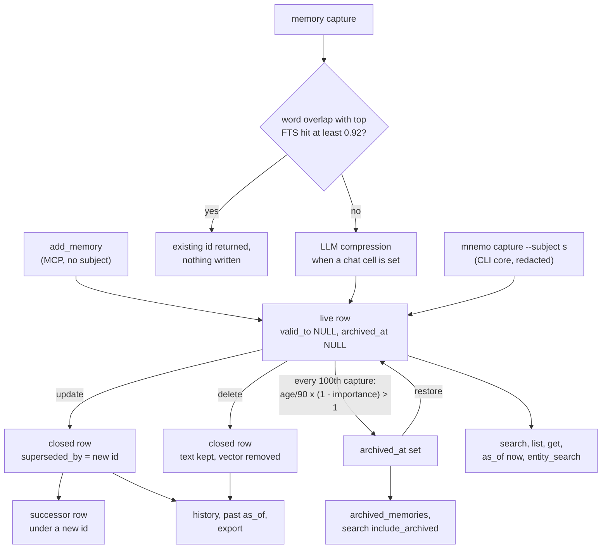

## 1. Executive Summary

Mnemo is a Python memory server for coding agents: one SQLite file per
namespace, hybrid FTS5 and sqlite-vec retrieval fused by reciprocal rank
fusion, LLM importance scoring and entity extraction in the background, and
an update that supersedes the row instead of overwriting it. The same package
ships a second, smaller surface, the `mnemo` CLI over a `mnemo_core` domain
layer, with a `subject` key on rows, secret redaction and a bounded cited
reflect.

What is notable is the care in the storage layer. Supersession is one
guarded statement with a race test written to fail if the guard is removed,
and a changed embedding model is refused at open rather than silently mixed
into the vector space.

What is weak is the distance between the documented design and the wired one.
The `memory_audit` table the README advertises has no writer. The extractor's
`supersedes` list is validated and dropped. A deleted memory stays readable
through `history` and `export`. The subject scope that the evals measure is
absent from every read the MCP server performs.

The MCP server is the primary agent surface in the tree: the Claude Code
plugin, the skills and the hooks all address its tools. The CLI core is
documented as the CLI-first direction, and its `--subject` flag is optional
and absent from every README example.

One mark: `negative_eval`, on a scoped recall that must not return another
subject's row and a current view that must not return a superseded value.
Section 9 names the six withheld.

## 2. Mental Model

A memory is a row of text. It becomes a belief the moment a tool call
inserts it: there is no candidate state, and the model's own `add_memory` or
`capture` is the only gate. It stops being one in four ways.

**Update supersedes.** `update` closes the old row with `valid_to = now` and
`superseded_by` set to the new id, copies every column into a new row, and
carries the vector forward (`src/mnemo/db.py:1374-1501`). Every read path
except `history`, `export`, `archived_memories` and a past `as_of` filters
`valid_to IS NULL`, so the old value leaves search, list and get at once. The id changes, so an agent
holding the old id gets "not found" on its next call.

**Delete soft-closes.** `delete` sets `valid_to` with no forward pointer and
removes the vector (`db.py:1503-1526`). The text stays in the row.
`history_for_entity` deliberately returns closed rows
(`src/mnemo/temporal/queries.py:176-194`), and `export_jsonl` selects every row
with no filter (`db.py:1558-1584`). A memory the agent was asked to forget is
therefore still returned by `memory(action="history")` and by
`export_memories`.

**Archive retires by arithmetic.** `archive_by_score` sets `archived_at` when
`(days since updated_at / 90) * (1 - importance) > 1` (`db.py:1740-1803`). With
no scoring model configured, importance stays 0.5, so every memory not updated
for 180 days archives at the next sweep, however often it is read. `restore`
clears the flag.

**Capture can decline to write.** The duplicate probe searches the first ten
words with FTS only, then compares word sets of the top hit
(`db.py:1909-1943`). At the 0.92 capture threshold the existing id is returned
and nothing is stored (`src/mnemo/capture.py:129-149`). A correction that
changes one word in a sentence of thirteen or more distinct words clears that
threshold, so it is reported as `deduplicated` and the old text stays live.
This was read, not reproduced.

The CLI core has no update or delete. Its corrections are new captures, and
both versions stay retrievable; its own eval corpus says so in `known_gaps`.

## 3. Architecture

Two entry points share one storage class. `mnemo-mcp` runs `mnemo.cli:main`,
which starts an HTTP MCP server under uvicorn behind hull-core's
authentication middleware (`src/mnemo/server.py:2193-2289`). `mnemo` and
`mnemo-pilot` run `mnemo_cli.__main__:main`, a one-shot CLI that opens a
`MemoryDB` at a required `--db` path with `embedding_dims=0`, so the CLI path is
FTS-only (`src/mnemo_cli/__main__.py:86-89`; `pyproject.toml:70-72`).

**Storage.** `MemoryDB` (`src/mnemo/db.py`) opens SQLite in WAL mode, creates
`memories`, an external-content FTS5 index kept by three triggers, a
`memories_vec` sqlite-vec table, the entity graph (`memory_entities`,
`memory_edges`, `memory_entity_links`), a legacy `archived_memories` table and
`store_meta`, then runs Alembic to head after copying the file aside
(`db.py:1960-2030`). One tuple, `MEMORY_COLUMNS`, drives export and import, and
its comment names the defect it replaced: three hand-written column lists that
let an export–import round trip drop ten columns and report success
(`db.py:34-80`).

**Namespaces.** The server opens `~/.mnemo/memories.db` for the `default`
namespace and, in `multi` auth mode, a separate
`~/.mnemo/subs/<namespace>/memories.db` per user, cached per process
(`server.py:328-356`; `src/mnemo/runtime.py:106-129`). hull-core's
authenticator, pinned at `abc27ed4acc5f6033795342a1c0d9a3d28adcfe7`, maps
`no-auth` and `token` modes to the single namespace `default`.

**Background work.** Each `add` and each new `capture` spawns an unawaited
asyncio task that scores importance and extracts entities through the
configured chat cell (`server.py:562`, `:567-626`). A task in flight when the
process stops is lost. Every hundredth capture in a process schedules an
archive sweep on the caller's store (`server.py:1089-1101`).

**Models.** Embedding, rerank, chat and importance each resolve to a provider
cell in `~/.mnemo/config.toml`; an empty embedding or rerank chain selects
local Qwen3 models through the `fastretrieval` dependency. `MemoryDB` stamps the
embedding model and dimension into `store_meta` and raises
`EmbeddingModelMismatch` when they change, unless `REINDEX_ON_MODEL_CHANGE`
drops the vectors for a rebuild (`db.py:330-416`).

### Deployment and ergonomics

One Python 3.13 process and one SQLite file. No API key is needed to store or
search; the first local-embedding run downloads a model of roughly 570 MB.
Compression, importance scoring, entity extraction and consolidation need a
chat cell and degrade to verbatim storage, 0.5 importance and no graph without
one. The store is readable with the `sqlite3` shell or `export_memories`.

The Claude Code plugin manifest launches `uvx --python 3.13 mnemo-mcp` with
`MCP_TRANSPORT=stdio` (`.claude-plugin/plugin.json:40-52`). At this commit
`main()` serves only HTTP and says *"there is no stdio spawn mode"*, and no
Python file under `src/` reads `MCP_TRANSPORT` (`server.py:2276-2289`). What
the plugin runs is whatever version PyPI serves on the day, not this tree.

The README and `docs/passport.md` describe encrypted passport sync to S3 and
Google Drive and a Cloudflare D1 backend. No Python under `src/` implements
either. What remains is a `sync_state` table from migration `mem_002`, a
`getattr(conn, "sub", None)` branch in the graph helpers that targets a `sub`
column the SQLite schema does not have, and a comment in `db.py` naming
`migrations/0001_init.sql` and `tests/test_d1_migrations.py`, neither of which
is in the tree.

## 4. Essential Implementation Paths

**Add.** `add_memory` → `_handle_add` (`server.py:491-564`): `check_duplicate`
at `DEDUP_THRESHOLD` 0.9 attaches a warning and never blocks, `_embed` with a
45-second deadline that degrades to FTS on a transient error and raises on a
permanent one (`:428-488`), `MemoryDB.add` (`db.py:678-723`), then the
enrichment task.

**Capture.** `memory(action="capture")` → `_handle_capture`
(`server.py:1002-1118`) → `capture.capture` (`capture.py:81-187`): validate the
six `context_type` values, run the 0.92 duplicate probe, `compression.compress`
(an awaited LLM call targeting a third of the tokens, original kept in
`text_raw`; `src/mnemo/compression.py:97-171`), then `add_with_context_type`
(`db.py:725-849`).

**Search.** `search_memory` → `_handle_search` (`server.py:629-760`) →
`MemoryDB.search` (`db.py:852-1003`). FTS5 runs the phrase, AND and OR tiers in
order and stops at the first that returns rows (`db.py:171-193`, `:1051-1151`);
sqlite-vec runs over the same filter set; `_compute_hybrid_scores` fuses by RRF
with k = 60 and weights (`db.py:1205-1281`). With a reranker active the server
asks for a pool of at least 50 and reranks to `limit` (`server.py:665-723`).

**Graph boost.** After ranking, `find_related_memory_ids` walks two hops from
the top hit and sets `graph_related: true` on results that share an entity
(`server.py:725-740`). It changes no score or order.

**List, get, as_of, entity_search, history.** `list_memories`
(`db.py:1298-1352`), `get` (`:1354-1372`), and `entity_search`,
`memories_as_of` and `history_for_entity` (`temporal/queries.py:18-229`). The
last three are reachable only through the deprecated composite `memory` tool
(`server.py:1697-1735`).

**Update and delete.** Section 2. `update_memory` re-embeds new content before
the supersede and re-runs enrichment on the new id (`server.py:795-862`).

**Import.** `import_memories` → `import_jsonl` (`db.py:1673-1699`). Mode
`replace` runs `DELETE FROM memories` before parsing (`:1586-1591`), the one
hard delete in the tree, on a tool annotated `destructiveHint=False`
(`server.py:1472-1489`).

**CLI core.** `operations.capture` redacts and calls `store.add` with the
subject; `recall`, `fetch` and `reflect` pass `subject` to `search` and `get`
and redact again on the way out (`src/mnemo_core/operations.py:26-246`).
Standing pages store a reflect answer with the source ids and content hashes it
cited, and a read reports `fresh`, `stale:content_changed` or
`stale:source_missing` without recomputing (`src/mnemo_core/standing.py:108-223`).

## 5. Memory Data Model

| Column | Writer | Notes |
| --- | --- | --- |
| `id` | `uuid4().hex` | changes on every update |
| `content`, `text_raw` | add, capture, compress | `text_raw` holds the uncompressed original |
| `category`, `tags`, `source` | caller | free text; tags a JSON array |
| `context_type` | capture | one of six; `add` leaves the default `conversation` |
| `importance` | background scorer, caller | 0.5 when no scorer is configured |
| `access_count`, `last_accessed` | every search | see section 6 |
| `archived_at` | archive sweep | cleared by restore |
| `valid_from`, `valid_to`, `superseded_by` | update, delete | wall-clock times of the write |
| `commit_sha` | migration backfill only | sha256 of content for pre-migration rows; reset to NULL on update |
| `subject` | CLI core capture only | NULL for every MCP write |

**Scope is the file.** The MCP server never writes or reads `subject`; its
boundary is which SQLite file `_get_ctx` opens. In `no-auth` and `token` modes
that is one file for everyone holding the token.

**Time is one axis.** `valid_from` and `valid_to` are both stamped from the
clock at the moment of the write (`db.py:1408`, `:1444`, `:1514`); no caller
can say when a fact became true. `memories_as_of` therefore answers what the
store held at a time, not what was true then. `memory_edges` carries its own
`valid_from` and `valid_to`, and nothing in `src/` writes `valid_to` there.

**Declared and unwired.**

- `memory_audit`, with `memory_id`, `prev_state_hash`, `new_state_hash`,
  `operation`, `commit_sha` and `occurred_at`, is created by migration `mem_003`
  (`src/mnemo/alembic/versions/mem_003_temporal.py:227-251`). No statement in
  `src/` inserts into it. The README's comparison table lists *"Audit trail
  with state hashes"* as present, and the `knowledge-audit` skill's gap query
  would return every memory in the store.
- `temporal.extract` asks the model for a `supersedes` list of old fact ids
  with confidences, validates it and returns it
  (`src/mnemo/temporal/extract.py:54-66`, `:122-184`). The prompt supplies no
  existing ids, and `store_kg_with_memory_id` ignores the key.
- `temporal_supersession_enabled` and `temporal_supersession_threshold`
  (`src/mnemo/config.py:128-129`) are read only by tests.
- `resolve_entity`, the embedding-KNN entity merge the README describes, is
  called only from tests; production writes use `graph.upsert_entities`.

## 6. Retrieval Mechanics

Retrieval is tool-mediated. Nothing is injected automatically: the
SessionStart hook prints a paragraph telling the agent to invoke the
`recall-context` skill or call `memory(action="search")`, and queries nothing
(`hooks/session-start.sh:23-32`).

**Ranking.** With vectors, each candidate's RRF score over the FTS and vector
orders is normalised, weighted 0.7 against recency 0.2 (half-life 7 days on
`updated_at`) and access frequency 0.1, then multiplied by `1 + importance`.
Without vectors, normalised BM25 takes 0.6 and recency 0.3. A configured
reranker then reorders the pool and its order is final.

**Access counts are inflated by the rerank pool.** `MemoryDB.search` updates
`access_count` and `last_accessed` for every row it returns, and when the server
passes `candidate_pool` it returns the whole pool, at least 50 rows, before
the reranker cuts it to `limit` (`db.py:989-995`). The comment beside that code says
the opposite. Frequency carries 0.1 of the base score, so borderline matches
gain rank from having been candidates.

**Filters.** `category`, `tags`, `context_type`, `since`, `until`,
`min_importance` and `include_archived` reach `search` through the composite
tool; the granular `search_memory` exposes only `category`, `tags` and `limit`
(`server.py:1377-1384`). Results are capped at 100 and contents are returned in
full, up to 5,000 characters each.

**Tiered FTS widens within the filter.** If the phrase and AND tiers return
nothing, the OR tier matches any one word. Each tier carries the same filter
fragment, so widening never crosses archive, supersession or subject.

## 7. Write Mechanics

Writes are explicit. The tool descriptions and the server instructions tell the
model to save preferences, decisions and corrections proactively, and to search
before adding.

**Deduplication is lexical in both paths.** The README and the `capture`
docstring call it embedding-based. `check_duplicate` calls `search` with no
embedding, so the probe is FTS over the first ten words, scored by word-set
overlap divided by the larger set (`db.py:1909-1943`). `add` warns at 0.7 and
0.9 and inserts anyway; `capture` returns the existing id at 0.92.

**Model-generated text is stored as written.** The extraction and importance
prompts wrap content in `<untrusted_memory_content>` and tell the model not to
follow instructions inside it (`src/mnemo/graph.py:44-112`). Nothing screens
what the agent itself saves. The 5,000-character cap is the only content limit
on the MCP path. The CLI core re-declares the cap as 20,000 under a comment
saying it mirrors `db.py`, so the storage layer's check is the one that fires.

**Redaction exists on one surface.** `mnemo_core.defense.redact` replaces AWS,
GitHub, Anthropic, Slack and bearer tokens, emails and Vietnamese phone numbers
with a `[REDACTED:kind]` marker on capture and again on recall and fetch
(`src/mnemo_core/defense.py:23-90`). No module under `src/mnemo/` calls it, so
MCP writes, searches and exports carry secrets verbatim.

### Operational cost

- `add` blocks on the duplicate probe and one embedding call bounded at 45
  seconds; importance and extraction run after the reply.
- `capture` also blocks on the compression call when a chat cell is configured.
- A new memory is searchable by FTS on commit, by vector when its embedding
  was computed before the insert, and in the graph after the background task.
- The archive sweep is one `UPDATE` over the whole table every hundredth
  capture; no pass re-reads content.
- Nothing is injected per turn; a search returns at most `limit` full rows.

## 8. Agent Integration

The MCP server registers eleven granular memory tools — `add_memory`,
`search_memory`, `list_memories`, `update_memory`, `delete_memory`,
`export_memories`, `import_memories`, `memory_stats`, `restore_memory`,
`archived_memories`, `consolidate_memories` — plus the deprecated composite
`memory` tool and `config` (`server.py:1340-1850`). Seven actions — `capture`,
`archive_now`, `as_of`, `compress`, `entity_search`, `entity_graph`,
`history` — exist only on the composite tool, which attaches a deprecation
notice to every response.

The plugin adds a SessionStart nudge, an opt-in PostToolUse hint when a
decision-like file is edited (`hooks/post-tool-use.sh:16-36`), and six skills:
`recall-context`, `memory-commit`, `session-handoff`, `temporal-query`,
`knowledge-audit` and `passport-bootstrap`. The last describes an
`import_passport` action that the `config` tool at this commit does not have.

The agent holds every verb, including bulk replace. `consolidate_memories`
returns an LLM summary and a note to *"Review the summary and use add/delete to
apply changes"* (`server.py:1322-1328`); the agent that receives it holds both
verbs.

## 9. Reliability, Safety, and Trust

**The supersede path is the strongest code here.** Closing the predecessor and
reading it back is one `UPDATE … WHERE valid_to IS NULL RETURNING *`, every exit
path rolls back, and a zero-row match rolls back explicitly because pysqlite
opens a write transaction even then (`db.py:1411-1498`). The tests reproduce
each failure the comments name (section 10).

**Forgetting is incomplete.** A deleted row keeps its text, and two agent
tools return it. Archived rows remain in `export`. The only path that removes
text is `import_memories` in `replace` mode, which removes everything.

**Multi-user isolation is a file boundary.** Two `multi` users read different
SQLite files. In the other two modes every caller shares one file and one
namespace.

**No provenance on the MCP path.** `source` is a free string the agent may
omit, `subject` is never set, and nothing records which session or model wrote
a row.

Capability marks:

- `negative_eval` — awarded; evidence in section 10.
- `tombstone` — delete closes a row by id. `standing_invalidate` writes a page
  it calls a tombstone, keyed on a standing-question key, which hides a cached
  answer until the next refresh (`standing.py:145-165`). Nothing keyed on a
  rejected value prevents it being captured again.
- `trust_state` — no epistemic status. `archived_at` filters reads, but it is
  set by age and importance and says nothing about whether a memory is
  believed; `importance` and `context_type` rank and label.
- `bitemporal` — one time axis, stamped at write; section 5.
- `scope_enforced` — withheld. The CLI core applies `subject = ?` on `search`
  and `get` (`db.py:1042-1047`, `:1366-1370`), and passing no subject reads
  every row, which is what the README's examples do. Every MCP read over the
  same store passes no subject, and `list_memories`, `memories_as_of`,
  `entity_search` and `history_for_entity` take no subject parameter. The
  server's isolation is a physical file per namespace.
- `audit_log` — `memory_audit` has no writer; the `[AUDIT]` lines go to the
  loguru process log, not the store.
- `human_review` — no queue. Consolidation hands its proposal to the agent that
  holds add and delete.

## 10. Tests, Evals, and Benchmarks

Nothing was built or run for this report; everything below is from reading the
tests and committed eval output at the pin. CI runs the default selection with
an 88 per cent coverage floor (`.github/workflows/ci.yml:193-232`); `addopts` deselects
the `integration`, `live`, `full` and `e2e` markers.

**The negative cases.** `test_scoped_recall_returns_only_own_subject` stores two
rows that both match `region`, asserts carol's recall contains her row, then
asserts alice's is absent (`tests/test_mn3_subject_enforcement.py:25-33`).
`test_legacy_null_subject_rows_invisible_to_scoped_probe` does the same against
an unattributed row (`:36-44`), and a scoped fetch of another subject's id must
return `NOT_FOUND` (`:80-90`). `test_update_supersedes_old_row` asserts the
current `as_of` view is exactly v2 and a view before the update exactly v1
(`tests/temporal/test_queries.py:187-209`).
`test_search_excludes_archived_default` asserts an archived row is absent and a
kept one present (`tests/test_archive.py:154-165`). Every one asserts the
included case, so an empty result fails.

**What they do not cover.** The scope cases run on the CLI core. No case found
searches through `search_memory` or `get` after an update or delete and asserts
the old value absent. The eval corpus's two `correction_supersede` cases assert
only that the new value appears, which the CLI core satisfies with both
versions returned.

**Tests built to fail.** `tests/test_db_update_atomicity.py` reproduces a failed
successor insert, an update of an unknown id that would hold the write lock,
and a competing writer that closes the row first; the third asserts one live
row and an intact chain, and its docstring says deleting `AND valid_to IS NULL`
must make it fail (`:165-229`).

**Evals.** `evals/` holds six deterministic runners with committed corpora and
baselines, each asserted by a test: MN-1 recall over thirteen cases in English
and Vietnamese with two leak probes, MN-2 redaction, MN-4 reflect with and
without a paid provider, MN-5 standing pages, MN-6 multilingual recall. All run
against the CLI core with `embedding_dims=0`, so none measures vector search,
reranking or the MCP path. The MN-1 runner's comment still says leakage is
*"expected and recorded, not scored"*, while its report computes
`subject_scoping_enforced` and the test asserts it true
(`evals/run_mn1.py:62-72`, `:135`; `tests/test_mn1_eval.py:32-44`).
`docs/BENCHMARKS.md` lists recall@5 as `TBD` and the compression ratio and fact
retention as targets; no measured result for either is committed. No paper or
citation block is in the tree.

## 11. For Your Own Build

### Steal

- **Supersede in one guarded statement.** An `UPDATE` that sets `valid_to` and
  `superseded_by` only `WHERE valid_to IS NULL`, with `RETURNING *`, makes the
  check and the close atomic, and the loser of a race falls into not-found.
- **Write the race test so removing the guard fails it.** Fire a competing
  writer from inside the first writer's connection and assert one live row.
- **Stamp the embedding identity and refuse a mismatch.** A model or dimension
  change that silently mixes vector spaces corrupts every similarity score;
  refusing at open, with an explicit reindex switch, costs one table.
- **Keep one column list for every serializer.** Export and import share
  `MEMORY_COLUMNS`, so a migration that adds a column is carried by both or by
  neither.
- **Cache a derived answer with the hashes of its sources.** Standing pages make
  staleness a deterministic read rather than a recompute.

### Avoid

- **Soft delete that a read tool still returns.** If `delete` keeps the text for
  history, every read that includes closed rows becomes a way to recall what the
  user asked to forget. Decide which reads may see it, and test that the others
  cannot.
- **Lexical overlap as a gate that discards writes.** A word-set ratio cannot
  tell a paraphrase from a one-word correction; a threshold that returns the old
  id silently drops exactly the edits that matter most.
- **A schema advertised as a feature before it has a writer.** An audit table
  with no inserts reads, from outside, as an audit trail.
- **Scope on one surface of a shared store.** A key that one entry point filters
  and the other ignores protects nothing once both open the same file.

### Fit

This suits a single developer who wants a local MCP memory with good hybrid
recall, careful SQLite handling and no services to run, and who treats delete
as hide rather than erase. It does not suit anyone who needs to show that a
memory was forgotten, who changed it, or that one agent cannot read another's
rows in a shared-token deployment. The tree is mid-migration — an HTTP-only
server, a stdio plugin manifest, documented sync that is no longer in `src/` —
so an adopter should pin a release and read its entry point before trusting the
plugin install path.

## 12. Open Questions

- Which version does `uvx mnemo-mcp` resolve to for plugin users, and does
  that version still accept stdio?
- Is the CLI core meant to share `~/.mnemo/memories.db` with the server, and if
  so, will the server's reads take a subject?
- Was the passport and D1 code removed or moved to another repository, and does
  any deployment still write `sync_state`?
- How often does `capture` return `deduplicated` for an edit in practice? The
  probe was read, not exercised.
- Is `memory_audit` meant to be written by a future migration, or dropped?

## Appendix: File Index

- **Storage and schema:** `src/mnemo/db.py`, `src/mnemo/alembic/versions/`
  (`mem_001` to `mem_006`), `src/mnemo/graph.py`, `src/mnemo/temporal/store.py`.
- **Write path:** `src/mnemo/server.py:491-626`, `:795-1118`;
  `src/mnemo/capture.py`; `src/mnemo/compression.py`;
  `src/mnemo/temporal/extract.py`; `src/mnemo/temporal/resolve.py`.
- **Retrieval:** `src/mnemo/db.py:852-1372`; `src/mnemo/server.py:629-792`;
  `src/mnemo/temporal/queries.py`; `src/mnemo/reranker.py`.
- **CLI core:** `src/mnemo_core/operations.py`, `standing.py`, `defense.py`,
  `ports.py`; `src/mnemo_cli/__main__.py`; `src/mnemo/pilot_tools.py`.
- **Runtime and auth:** `src/mnemo/runtime.py`, `src/mnemo/config.py`,
  `src/mnemo/cli.py`; hull-core `auth/context.py` and `auth/middleware.py` at the
  pinned revision.
- **Agent integration:** `.claude-plugin/plugin.json`, `hooks/`, `skills/`,
  `server.json`, `smithery.yaml`.
- **Tests and evals:** `tests/test_mn3_subject_enforcement.py`,
  `tests/temporal/test_queries.py`, `tests/test_archive.py`,
  `tests/test_db_update_atomicity.py`, `tests/test_mn1_eval.py`,
  `evals/run_mn1.py`, `evals/mn1_corpus.json`.

### Recorded searches

Checked against the checkout at the pinned revision.

- `rg -n 'memory_audit' . --glob '!CHANGELOG.md'` — the migration, its test, the README, `docs/ARCHITECTURE.md` and the `knowledge-audit` skill; no insert.
- `rg -n 'subject' src/ | grep -v '^src/mnemo/docs'` — `mnemo_cli`, `mnemo_core` and `db.py` only; no match in `server.py` or `temporal/queries.py`.
- `rg -n 'redact' src/mnemo` — no match.
- `rg -n '"supersedes"|get\("supersedes' src` — `temporal/extract.py` only.
- `rg -n 'temporal_supersession' . --glob '!CHANGELOG.md'` — `config.py` and two tests.
- `rg -n 'resolve_entity|find_similar_entity' --glob '!src/mnemo/temporal/resolve.py' .` — tests, the changelog and `docs/ARCHITECTURE.md`.
- `rg -n 'MCP_TRANSPORT|stdio' src/` — the "no stdio spawn mode" docstring at `server.py:2279` and one line of `docs/config.md`.
- `rg -n -i 'passport|gdrive|google|boto|argon2|aesgcm|vectorize' src --glob '*.py'` — the `mem_002` docstring and one `server.py` docstring; no implementation.
- `ls migrations tests/test_column_fidelity.py tests/test_d1_migrations.py` — none exists.
- `rg -n 'pilot_tools|pilot_capture|pilot_recall' --glob '!tests/**' .` — only `src/mnemo/pilot_tools.py` itself; no tool registration.
- `rg -n -l '\.update\(' tests | xargs rg -n 'search\(' -l` — eight files; none asserts an updated or deleted value absent from `search`.
- `grep -rliE 'arxiv|bibtex|@article|@misc|doi\.org' . --exclude-dir=.git` — no match, and no `CITATION.cff`.

## History

**2026-10-03** — [`3086abf90a96578ecff431ea1735ed5d1187ce34`](https://github.com/n24q02m/mnemo/commit/3086abf90a96578ecff431ea1735ed5d1187ce34) — first reading, at the head of `main`, a commit dated 3 October 2026; the repository was `n24q02m/mnemo-mcp` until 13 September 2026. One mark, `negative_eval`. Screened before reading: five auto-run surfaces (`.claude-plugin/`, `hooks/` and its `hooks.json`, whose two scripts only print text, and `server.json` and `smithery.yaml` launching through `uvx`), one build-time execution point (`tests/conftest.py`, a network guard), and four dependency files inside the cooldown. Every file in a depth-1 clone dates to the tip; there is no unpinned surface, and `AGENTS.md` and `CLAUDE.md` were recorded as data. hull-core's auth modules were read at its pinned revision through the GitHub API. Nothing installed, built or run.
