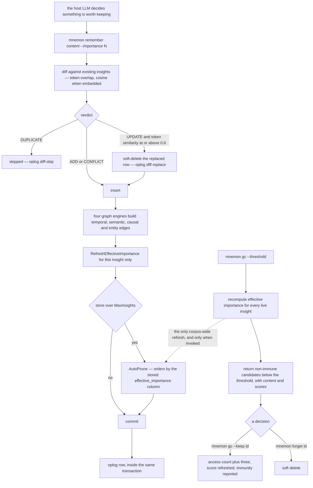

## 1. Executive Summary

Mnemon is a single Go binary — about 60,400 lines across memory and an unrelated "Agency" preview, 8,600 of them the memory path — that gives an LLM agent persistent memory in one SQLite file per store. Apache-2.0, Go 1.24, distributed over npm, no API keys, no server, no vector database unless the user runs a local Ollama model. It implements MAGMA ([arXiv:2601.03236](https://arxiv.org/abs/2601.03236), 6 January 2026, ACL 2026 Main): four orthogonal graphs — temporal, semantic, causal, entity — with intent-adaptive traversal over them.

**The architectural claim is about where the model sits.** The README's table names four patterns and puts Mnemon in the fourth: LLM-embedded (Mem0, Letta), file injection, MCP server, and *LLM-supervised* — "the binary handles deterministic computation (storage, graph indexing, search, decay); the LLM makes judgment calls (what to remember, how to link, when to forget)". That is not marketing framing: `remember` takes the importance as an argument, `link` takes the edge type and weight, `gc` returns candidates and the two commands that resolve them. Nothing in the binary calls a model except the optional local embedder.

**The audit trail is better than the usual.** `oplog` sits in the same file as the insights; `remember` and `link` write their entries inside the same transaction as the write, because `db.execer()` returns the active transaction; and `AutoPrune` uses the error-propagating `RecordOp` whose comment states the rule — destructive transitions need "state change and audit evidence [to] commit or roll back together" — recording the capacity, the minimum age and the insight whose arrival triggered the prune. Two things bound it: the table is trimmed to 5,000 rows on every insert, and retrievals are logged into it beside mutations.

**The finding worth carrying away is a stale consumer.** Effective importance is a real decay formula — `base(importance) × max(1, log(1+accesses)) × 0.5^(days/half-life) × (1 + 0.1·min(edges,5))` — and it is stored in a column. `AutoPrune`, which fires automatically inside `remember` whenever the store is over capacity, orders candidates by that stored column and never refreshes it. The only path that recomputes it for every live insight is `GetRetentionCandidates`, reached through `mnemon gc` — a command the shipped skill files tell the *agent* to run. So on a store where nothing invokes `gc`, automatic deletion ranks rows by the score each had on the day it was written, which is the one moment the decay factor is 1.0 for all of them. The decay is not decorative; the automatic path just does not see it.

**Two smaller things a reader should know.** The README credits MAGMA to "Zou et al."; the paper's authors are Jiang, Li, Li and Li. And the project publishes no benchmark numbers of its own — for a system implementing a paper whose abstract reports LoCoMo and LongMemEval results, that absence is a choice worth noticing rather than a gap to complain about.

## 2. Mental Model

A memory is **an insight with a judged importance**, and the judgement is the host LLM's. Nothing in the binary decides what is worth keeping; `mnemon remember "..." --importance 4` is a sentence the agent composed after deciding, and the integer it passed is what the lifecycle then acts on: `baseWeight` maps 1-5 onto 0.15-1.0, `IsImmune` exempts anything at 4 or above from automatic pruning, and the prune query filters `importance < 4 AND access_count < 3` before it orders by anything.

**Belief is not modelled at all.** There is no status column, no confidence, no provenance beyond a `source` string defaulting to `user`. A memory is live or soft-deleted, and everything in between is the score. That is coherent with the design: an epistemic state would be a judgement, and judgements belong to the supervisor.

**Forgetting has three doors and they are not equally visible.** A person or agent calls `forget <id>`. A replacement arrives through `remember`, whose diff soft-deletes the old row when token similarity clears 0.6 on an UPDATE verdict — with a comment refusing to let embedding similarity alone do it, because a high cosine "is not enough evidence to destroy an existing memory". And auto-prune deletes rows nobody named, inline, when the store is over capacity, protected by a minimum age measured against `stored_at` so that a freshly imported historical row is not dropped the moment it lands.



## 3. Architecture

One binary, one file, no services. `~/.mnemon/data/<name>/mnemon.db` holds a store; `~/.mnemon/active` names the one the CLI opens; `mnemon setup --target <host>` writes a skill file, hooks and a behavioural guide into the agent host. SQLite runs in WAL mode and the design document names the tradeoff it accepted: graph traversal, decay and atomic transactions all lean on SQLite-specific behaviour, so the storage layer is not swappable and abstracting it is named as the next milestone.

Embeddings are optional and local — Ollama with `nomic-embed-text` — and their absence degrades the system rather than breaking it: semantic edges fall back to token overlap, and recall's anchor set comes from keyword search alone.

The repository also contains an "Agency" preview at `mnemon agency ...` — durable responsibility and effect admission for a Pi agent, roughly half the Go in the tree — which the README is careful to separate from memory. This report is about the memory path.

## 4. Essential Implementation Paths

**Remember** — `cmd/memory/remember.go`: classify the content against existing insights with `search.Diff` (keyword candidates, token similarity, cosine when embeddings exist), then one `InTransaction` closure that soft-deletes a replaced row, inserts, stores the embedding, runs `graph.Engine.OnInsightCreated` to build all four edge types, refreshes this insight's effective importance, auto-prunes if over capacity, and appends the oplog row.

**Recall** — `internal/memory/search/recall.go`: classify the query intent (why, when, entity, general), pick that intent's beam width, depth and visited budget from `intentTraversalParams`, gather anchors, and run a bounded beam search over the edge graph scoring structure at 1.0 and semantics at 0.4 — the MAGMA constants, cited in the source.

**Forget** — `cmd/memory/forget.go`: `SoftDeleteInsight`, then an oplog entry.

**GC** — `cmd/memory/gc.go`: recompute every live insight's score in one pass, batch-update the column, return the non-immune ones below the threshold with the two commands that resolve them.

**Auto-prune** — `internal/memory/store/node.go:520-600`: count live rows, take the excess up to a batch size, select non-immune rows older than the minimum age ordered by the stored score ascending, soft-delete each, drop its edges, and `RecordOp` the prune with its reason.

## 5. Memory Data Model

`insights` carries content, category, importance, tags, entities, source, access count, timestamps and `deleted_at`; `edges` carries a source, target, type constrained by CHECK to the four graph types, a weight, metadata and a creation time, with `ON DELETE CASCADE` to both endpoints; `oplog` carries an operation, an optional insight id, a free-text detail and a timestamp.

Two timestamps deserve a note because the schema comment explains them. `created_at` is the insight's own time — which an import can set to a historical value — and `stored_at` is when the row entered *this* store, set by a trigger when a writer omits it. The retention grace in `AutoPrune` is measured against `COALESCE(stored_at, created_at)` precisely so that an imported year-old insight is not instantly eligible. That is a bi-temporal distinction used for one purpose; no read path queries record time as an axis, and nothing asks what the store held as of a past date, which is why the mark is withheld.

`effective_importance` is a materialised column, not a computed one, and section 1 explains where that bites.

## 6. Retrieval Mechanics

Recall is a graph traversal, not a ranking over a flat list. The intent classifier routes a query to one of four parameter sets — a "why" question gets depth 5 and a 500-node budget, an entity question depth 4 and 400 — and the beam expands from anchors found by keyword match and, where embeddings exist, cosine similarity. Structural and semantic contributions are weighted 1.0 and 0.4, the values the MAGMA paper gives, and the constants carry the citation in a comment.

Every read path filters `deleted_at IS NULL`, consistently: `GetInsightByID`, the list query, the entity loader, the edge joins and the neighbourhood walk. That consistency is what the negative tests pin.

Access is recorded: a retrieval bumps `access_count` and `last_accessed_at`, which feeds the decay formula and the immunity rule — three accesses make a row permanent against auto-prune regardless of its importance.

## 7. Write Mechanics

One transaction, synchronous, immediately recallable, and the ordering inside it is deliberate: the replacement is soft-deleted and dropped from the embedding cache *before* the insert, so the new insight cannot build a semantic edge to the row it just replaced; the effective importance is computed after the edges exist, because the edge count is a term in the formula; and the auto-prune runs last with the new insight explicitly excluded from its candidate set. When the transaction fails, the embedding cache — mutated inside the closure — is discarded rather than reused, with a comment saying why.

Deduplication happens before the transaction. `Diff` returns ADD, DUPLICATE, CONFLICT or UPDATE; DUPLICATE skips the write entirely and reports the id it matched. The 0.6 token-similarity floor on an UPDATE is the guard against destroying a memory on embedding evidence alone.

No background worker exists in the memory path. Whatever the design wants to happen over time — decay, pruning of the weak, consolidation — happens because something invoked a command.

## 8. Agent Integration

`mnemon setup --target openclaw --yes` installs four things into the host: a skill file describing the commands, a bootstrap hook that injects a behavioural guide, an extension carrying remind, nudge and compact hooks, and the prompt files under `~/.mnemon/prompt/`. Equivalent asset sets exist for Cursor, NanoClaw, Zcode, Qoderwork and others, each with its own `SKILL.md` under `internal/memory/setup/assets/`.

The protocol argument in the README is worth restating because it is the design: `remember`, `link` and `recall` are named for the LLM's vocabulary rather than SQL's, and every command returns structured JSON with the signals that produced the result — the diff verdict and the id it matched, the edge counts, the effective importance, the pruned ids. An agent can read why it got what it got.

## 9. Reliability, Safety, and Trust

**Transactional discipline is good.** Writes are atomic, the audit row commits with the write, a read-only store is detected and every mutating path refuses early rather than failing halfway, and `readonly_path_test.go` exists for exactly that.

**The install path floats.** The root `package.json` depends on `dsh-mnemon` at `latest`, and the skill files the setup command installs declare `@mnemon-dev/mnemon@latest` as the install target — so a host that follows the documented setup resolves whatever version is current at that moment. The screen flagged the first; the second is the same property inside an artifact the tool writes onto other machines.

**A migration soft-deletes a whole category.** `db.go:396-402` counts insights with `category = 'narrative'` and, when any exist, sets `deleted_at` on all of them — a one-time cleanup of a retired category that runs silently on open, with no oplog entry, since it happens below the store API. A user upgrading loses that category from every read path with nothing in the log to say so.

**Provenance stops at a string.** `source` defaults to `user` and nothing validates it; there is no record of which agent, session or host wrote an insight beyond what the caller put in the content.

**The repository carries `AGENTS.md` and `CLAUDE.md`**, read here as data. Both are instructions to a coding agent working on the project, not to a reader of the memory.

## 10. Tests, Evals, and Benchmarks

**I did not run this suite.** The screen found no auto-run surface, one build-time execution path (the `Makefile`'s default target), five dependency surfaces inside the seven-day cooldown, and one floating npm range; I kept the read-only posture, so every claim above is read from the committed code.

700 test functions across the tree, with the memory path carrying about 7,270 lines of tests against 8,640 lines of implementation — a ratio at the high end of this atlas. `store_test.go` alone is 1,554 lines, `graph/integration_test.go` 923, `search/integration_test.go` 532. They run against a real SQLite file in a temp directory, so there is no mock layer between the assertion and the schema.

The negative assertions are the strong kind in two places and the weak kind in one, and the contrast is instructive. `TestLoadKnownEntities_SkipsDeleted` asserts the live entity is present *and* the deleted one is absent, over the same two-row fixture. `TestGetNeighborhood_SkipsDeletedNodes` iterates the returned neighbours looking for the deleted id and asserts nothing about what came back, so a traversal returning an empty slice passes it — the vacuous shape, one `if len(neighbors) == 0 { t.Fatal }` away from being airtight.

**No benchmark is committed and none is claimed.** There is no LoCoMo or LongMemEval harness in the tree and no accuracy figure in the README, which for a system implementing a paper that reports both is a restraint worth naming rather than a gap. The papers it builds on are cited properly in a References section — MAGMA for the four-graph methodology, RLM ([arXiv:2512.24601](https://arxiv.org/abs/2512.24601)) for the orchestrator paradigm — with one error: MAGMA is credited to "Zou et al." and its authors are Dongming Jiang, Yi Li, Guanpeng Li and Bingzhe Li.

**And the deviations from that paper are tabulated.** `docs/design/08-decisions.md` lists six rows — entity extraction, causal reasoning, node types, storage, embeddings, deployment — with MAGMA's choice beside Mnemon's, and states what was kept: the four-graph separation, intent-adaptive retrieval and multi-signal fusion. A reader comparing implementation to paper is handed the diff instead of having to derive it.

## 11. Patterns Worth Stealing

### Steal

**Publish your deviations from the paper you implement.** Six rows and a paragraph. It converts "inspired by" — which tells a reader nothing — into a claim they can check, and it protects the project from being measured against a method it deliberately did not implement.

**Commit the audit row inside the transaction that made the change.** `RecordOp`'s comment is the rule in one sentence: a destructive transition and its audit evidence must commit or roll back together. The best-effort variant stays available for the rest, and the split is explicit.

**Refuse to destroy a memory on embedding evidence alone.** A cosine above 0.85 marks an UPDATE candidate; the row is only replaced when token overlap also clears 0.6, "because a high cosine is not enough evidence to destroy an existing memory". Two independent signals for a destructive act, one for a suggestion.

**Make retention immunity a rule, not a score.** `importance >= 4 || access_count >= 3` is checked before any ranking, so the thing that matters most is not competing on a number that decays.

**Measure a retention grace against when the row arrived, not when the fact happened.** One `COALESCE(stored_at, created_at)` keeps an import of historical material from being pruned the moment it lands.

### Avoid

**Do not let an automatic path read a materialised score that only a manual command refreshes.** Auto-prune orders by `effective_importance`; nothing in the write path recomputes it for anything but the row being written. Either compute the score in the prune query — every input is a column — or refresh before selecting.

**Do not write a negative test that passes on an empty result.** `TestGetNeighborhood_SkipsDeletedNodes` is the shape, and it sits two tests away from one that does it right.

**Do not soft-delete a category during a schema migration without recording it.** The narrative cleanup runs below the audit layer, so the log a user inspects afterwards does not contain the largest deletion the upgrade performed.

### Fit

Take this if you want **local, inspectable memory for a coding agent** and you are comfortable with the supervisor model: one binary, one file, structured JSON out, and the host LLM making every judgement the binary would otherwise need a model for. The install story is genuinely one command per host, and the four-graph structure gives recall something to traverse that a flat vector store does not have.

Do not take it where **the memory must be scoped or defensible**. Stores are separate files with no key on a row, so multi-user separation is the application's job; there is no epistemic state, so "we recorded this and do not believe it" is inexpressible; and the oplog that would answer "why is this gone" holds the last 5,000 events of any kind.

## 12. Antipatterns / Risks

**Decay that the automatic deleter cannot see.** Stated in section 1 and worth repeating as the risk: a deployment where the agent never runs `gc` prunes by creation-time scores.

**An audit log that is a ring, and that mixes reads with writes.** 5,000 entries total, trimmed on insert, with `recall`, `search` and `show` competing for the same rows as `remember`, `forget` and `prune`. A busy week of retrievals can evict the record of the deletion a user is asking about.

**No value-keyed refusal.** A replacement records `replaced by <id>` and the superseded row is soft-deleted, but nothing is keyed on the content, so the same sentence remembered again is a new live insight and the diff will not find the deleted original — every read path, including the diff's candidate search, filters `deleted_at IS NULL`.

**Floating install pins in an artifact installed onto other machines.** `@mnemon-dev/mnemon@latest` in every shipped skill file.

**A silent bulk deletion on upgrade**, for the retired `narrative` category.

## 13. Build-vs-Borrow Takeaways

**Borrow the four-graph schema and the intent-adaptive traversal** if you have a paper-shaped design to implement and want a compact reference: two tables, a CHECK constraint, four small edge builders and a parameter table keyed by intent.

**Borrow the lifecycle arithmetic** — base weight, log-scaled access, half-life decay, a small edge bonus, and an immunity rule that short-circuits all of it — but compute it where it is consumed.

**Borrow the supervisor split** if you are paying for an embedded extraction model you are not sure earns its cost. Mnemon's position is that importance and linking are judgements the host model already has the context to make, and the binary's job is to be fast, deterministic and honest about what it did.

**Build scoping yourself** before putting this in front of more than one user.

## 14. Open Questions

- Is `gc` expected to run on a schedule? Nothing in the tree schedules it, the shipped skill files list it among commands the agent may run, and the auto-prune path depends on its side effect.
- `MaxOplogEntries` is a constant. Whether 5,000 is a retention policy or a default nobody revisited is not stated, and the receipt command that exports the log inherits the bound.
- The diff runs against live insights only. Whether re-remembering something a user explicitly forgot should be refused, or is deliberately allowed as a correction path, is not addressed anywhere in the docs.
- The Agency preview shares the binary and the `.mnemon` directory with memory but not its store. What a reader should conclude about the memory path from Agency's very different admission machinery is left open by the README's insistence that they are separate.

## 15. Appendix: File Index

**Store**
- `internal/memory/store/db.go` — schema, migrations, `InTransaction`, `execer`, store layout and the `active` file
- `internal/memory/store/node.go` — insert, soft delete, `ComputeEffectiveImportance`, `IsImmune`, `GetRetentionCandidates`, `AutoPrune`, `BoostRetention`
- `internal/memory/store/edge.go`, `oplog.go`

**Graph and search**
- `internal/memory/graph/` — `temporal.go`, `semantic.go`, `causal.go`, `entity.go`, `engine.go`, `bfs.go`
- `internal/memory/search/` — `intent.go`, `recall.go` (beam search and the MAGMA constants), `keyword.go`, `diff.go`

**Commands**
- `cmd/memory/remember.go`, `forget.go`, `link.go`, `recall.go`, `gc.go`, `import.go`, `log.go`, `receipt.go`, `status.go`, `setup.go`
- `internal/memory/setup/assets/*/SKILL.md` — what each host is told the commands are

**Tests cited**
- `internal/memory/store/store_test.go`, `readonly_path_test.go`
- `internal/memory/graph/integration_test.go`

**Docs**
- `docs/design/08-decisions.md` — the deviations table
- `docs/design/06-lifecycle.md` — decay, immunity, pruning

**Commands this reading used**
```sh
python3 scripts/screen_repo.py <checkout>
grep -rn "LogOp(\|RecordOp(" --include="*.go" --exclude="*_test.go" .   # every oplog producer
grep -rn "RefreshEffectiveImportance\|effective_importance" --include="*.go" --exclude="*_test.go" .
grep -rn "stored_at" --include="*.go" --exclude="*_test.go" internal/ cmd/   # retention grace only
grep -rn "deleted_at IS NULL" -r internal/memory/store/                      # the read-path filter
grep -rn -i "magma" --include="*.go" --include="*.md" .                      # the citation and its constants
```

## History

**2026-09-12** — [`6c371ec7dce7af05aa55f31fb1b7c1aea81205db`](https://github.com/mnemon-dev/mnemon/commit/6c371ec7dce7af05aa55f31fb1b7c1aea81205db) — first reading, at the default branch's head on the day it was read. Screened before reading: no auto-run surface; one build-time execution path (the `Makefile`, whose default target was checked); five dependency surfaces inside the seven-day cooldown; one unpinned surface, a `package.json` depending on `dsh-mnemon` at `latest` above a present lockfile; and two agent-directed files, `AGENTS.md` and `CLAUDE.md`, read as data and not as instructions. Nothing was installed, built or run, and no test in this repository was executed. One check was made outside the checkout: the MAGMA paper's abstract, to compare the implementation's citation with the paper's own authors and claims. Licence is Apache-2.0 per `LICENSE`.
