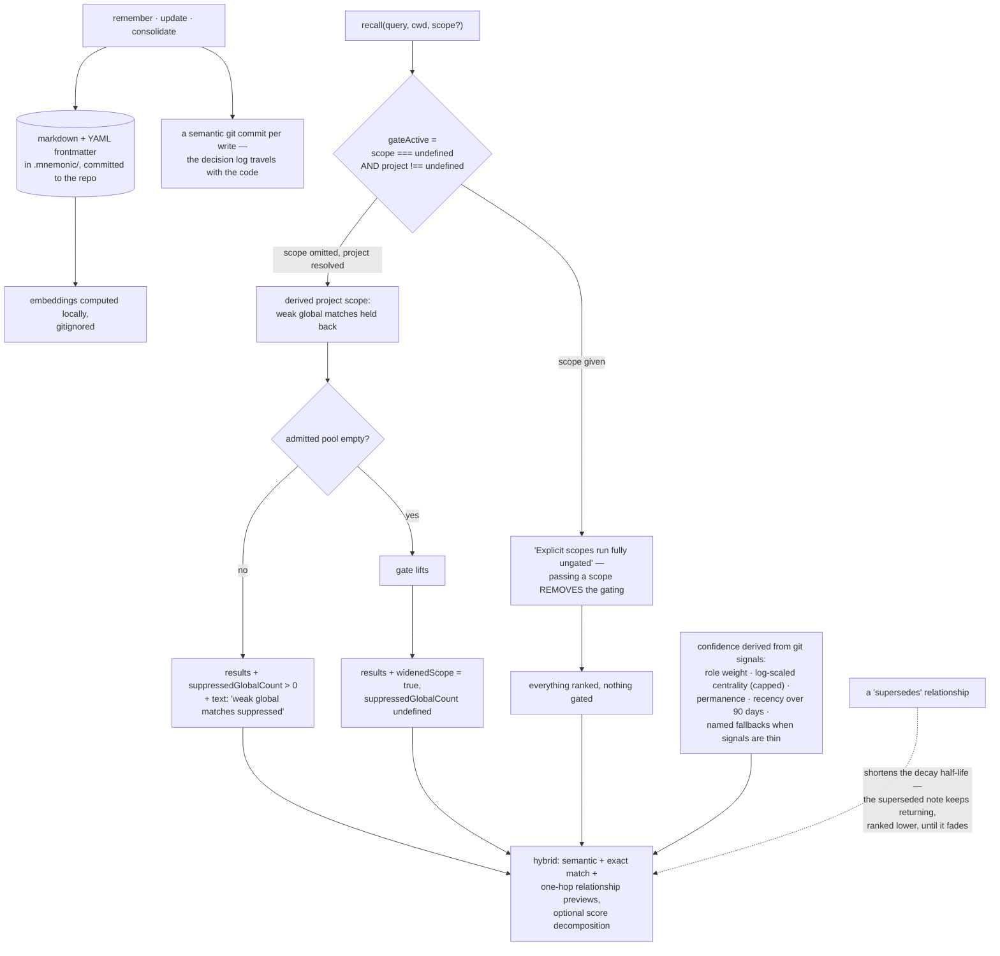

## 1. Executive Summary

mnemonic is "[a] local MCP memory server backed by plain markdown files, synced
via git. No database." Apache-2.0, TypeScript, version 0.45.0, 62,345 lines with
1,686 test cases across eighty-eight test files. Memories are markdown with YAML
frontmatter in a `.mnemonic/` directory committed alongside the code; embeddings
are computed locally and gitignored; `remember`, `update` and `consolidate` each
produce a semantic git commit, so the decision log travels in the same history as
the work it describes.

The thing worth taking from it is one line in the recall response.

**The recall reports what it held back.** Alongside the ranked matches it returns
`suppressedGlobalCount` — weak global matches the project gate withheld — and
`widenedScope`, set when the gate lifted because the admitted pool came back
empty. The response text says it in words too: "weak global matches suppressed".

A retrieval that silently drops candidates below a threshold is the norm here,
and it produces a specific confusion for whoever is reading the results: nothing
distinguishes *nothing matched* from *something matched and I decided against
it*. Two counts fix that, and the tests assert them in both directions — in one
case an off-topic global note is absent while the in-project note is present,
`suppressedGlobalCount` is above zero and `widenedScope` is undefined; in the
other, after the gate lifts, `widenedScope` is `true` and `suppressedGlobalCount`
is undefined. That pairing — a must-not-retrieve assertion with its positive
control on the line above, through the real tool surface — is the mark.

**The scope argument runs the opposite way from the obvious one.** The gate is:

```ts
const gateActive = scope === undefined && project !== undefined;
```

with the comment "[e]xplicit scopes run fully ungated." Omitting `scope` is the
*stricter* path, because that is when the derived project scope applies and weak
global matches are held back; passing a scope removes the gating. For a
single-user local tool that is a defensible relevance decision, and it is worth
naming because in most systems in this corpus an omitted scope is the permissive
case. It is not an access boundary: nothing separates one caller from another,
and a note in a shared `.mnemonic/` directory is readable by anyone with the
repository — which is the point of committing it.

**Confidence is derived, and the derivation is in the open.** `provenance.ts`
computes it from git history signals with every weight and threshold as a named
constant: role weights (a summary counts more than a reference), a log-scaled
centrality bonus with a ceiling, a permanence bonus, a recency term over a
ninety-day window, plus fallbacks keyed on days and centrality when the signals
are thin. Half-lives differ by kind — thirty days for temporary work, forty-five
for temporary context, a year for permanent core — and a superseded note gets its
own, shorter one.

That last choice is the one to weigh. Supersession here *steepens a decay curve*
rather than withholding the superseded note, so the older answer keeps coming
back, ranked lower, until it decays out. Set against the systems in this corpus
that mark a superseded memory and exclude it, this trades a guarantee for a
gradient — deliberate, given that everything else is a gradient too, and the
thing to know if you expected "superseded" to mean "no longer returned".

One mark. `NoteLifecycle` is `temporary | permanent`, a retention genre rather
than a belief state; the write record is git, which this atlas does not credit as
an audit log because it lives outside the store and can be rewritten; and there
is no tenancy to enforce.

The exit story is stated as a feature and the format makes it true: "[i]f you
stop using mnemonic, your notes remain plain markdown with YAML frontmatter. The
knowledge you gather stays independent and remains yours." For a memory system,
being uninstallable without loss is a real property, and one very few here can
claim.

## 2. Mental Model

A **note** is a markdown file your repository carries.

The **project** is where recall starts; **global** is where it looks next, and
reluctantly.

A **suppressed match** is a number in the response, not a silence.

**Superseded** means it fades faster, not that it stops coming back.



## 3. Architecture

| File | Role |
| --- | --- |
| `src/tools/recall.ts` | The recall tool, the gate, and the diagnostics it returns |
| `src/provenance.ts` | Derived confidence and decay half-lives, constants named |
| `src/structured-content.ts` | The note schema and its typed relationships |
| `src/storage.ts`, `src/vault.ts` | Files, frontmatter, and the vault layout |
| `src/document-*.ts` | Read-only document sources from other repositories |
| `src/tools/consolidate-helpers.ts` | Consolidation |

## 4. Essential Implementation Paths

`src/tools/recall.ts:199-205` — the gate, and the comment that inverts the
expectation.

`src/provenance.ts:8-42` — every weight, threshold and half-life, named.

`tests/recall-scope-gating.integration.test.ts:86-95` — the assertion pair, and
the disclosure beside it.

## 5. Memory Data Model

Frontmatter carries a role — `summary`, `decision`, `plan`, `research`, `review`,
`context`, `reference` — a lifecycle of temporary or permanent, tags, and typed
relationships: `related-to`, `explains`, `example-of`, `supersedes`,
`derives-from`, `follows`. The relationship vocabulary being closed, and
`supersedes` being one of six rather than a status column, is what makes
supersession a graph fact here rather than a lifecycle state.

## 6. Retrieval Mechanics

Hybrid semantic and exact matching — the README is specific that exact matters
for "names, identifiers, phrases, error codes, and versions", which is the case
pure embeddings handle worst — with one-hop relationship previews on the top
results and an optional score decomposition, so a ranking can be explained rather
than only produced.

## 7. Write Mechanics

Three tools, one commit each. Because the store is the working tree, a write is
visible in `git diff` before it is committed and in the history afterwards, which
is a stronger inspection story than most databases offer, and is not an audit log
in the sense this atlas uses: history outside the store can be rewritten.

## 8. Agent Integration

A local MCP server over a Node process, with document sources that index another
repository's markdown read-only alongside your own notes — so a dependency's docs
become recallable without being editable. Screening flags three auto-run surfaces
in the distribution, which is what an MCP server installed into a client looks
like and is worth reading before installing.

## 9. Reliability, Safety, and Trust

The disclosure of suppression is the trust mechanism, and it is aimed at the
right party: the model or person reading the results, who otherwise cannot tell a
gate from an empty store.

What is absent is any epistemic state. Nothing marks where a note came from
beyond its role, nothing separates what a person decided from what a model
summarised, and supersession is a gradient.

## 10. Tests, Evals, and Benchmarks

1,686 test cases across eighty-eight files, including integration tests that
drive the real MCP tool against a local embedding server. Nothing was installed
or run for this reading.

## 11. For Your Own Build

Return the count of what you suppressed. Two fields — how many you held back, and
whether you had to widen — turn an ambiguous empty-ish result into a legible one,
and they cost nothing to compute because the filter already knew.

Check which direction your scope argument runs. Here omitting it is stricter;
elsewhere omitting it is permissive. Either is defensible and only one of them is
what your caller assumed.

Name every constant in a derived score. `provenance.ts` is readable precisely
because the role weights, the centrality cap, the recency window and the
fallback thresholds are all constants with names rather than numbers inline.

And decide whether superseded means *ranked lower* or *not returned*. A shorter
half-life is a real answer; so is exclusion; silently choosing the first while a
reader assumes the second is where the surprise lives.

## 12. Open Questions

Whether a superseded note is ever excluded. The half-life shortens and a
maintenance hint can suggest pruning; no read path was found that withholds it.

What the document-source indexing does about staleness. External repositories are
indexed read-only, and how a changed upstream is noticed was not traced.

How confidence behaves in a shallow clone. Every signal is derived from git
history, and the fallbacks are keyed on days and centrality.

## Appendix: File Index

| Path | What to read it for |
| --- | --- |
| `src/tools/recall.ts:199-205` | A gate that an explicit argument turns off |
| `src/tools/recall.ts:111` | The diagnostics the tool promises to return |
| `src/provenance.ts:8-42` | A derived confidence with nothing hidden in a literal |
| `tests/recall-scope-gating.integration.test.ts:86-95` | Absence, its control, and the disclosure |

## History

**2026-09-16** — [`5fc9a5f5be70d25304b45c1af0b83b50d20b4590`](https://github.com/danielmarbach/mnemonic/commit/5fc9a5f5be70d25304b45c1af0b83b50d20b4590) — first reading, at a commit dated 16 September 2026. Screened before opening, from a shallow clone: nine files scanned, three auto-run surfaces, one build-time execution point, one unpinned surface and two dependency files inside the seven-day cooldown. Nothing was installed, built or run.
