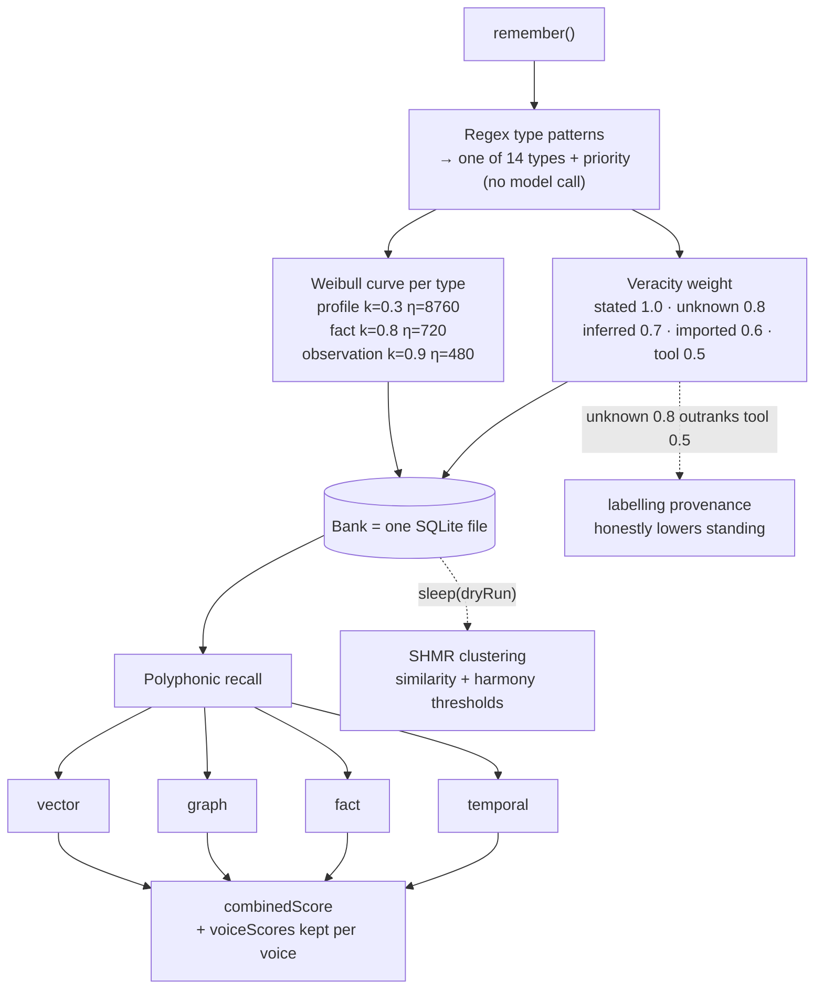

## 1. Executive Summary

Mnemopi is the memory engine inside `oh-my-pi`, MIT-licensed, described in its
own README as a Bun/TypeScript port of the Mnemosyne engine. The package is
30,593 lines, 10,459 of them in `src/core/`, with 71 test files and 420 test
cases across the memory package and the coding agent that consumes it. It is the
densest memory engine in this batch and one of the densest in the atlas.

**Its distinguishing mechanism is a decay curve per memory type, with a shape
parameter and not just a half-life.** `WEIBULL_PARAMS` gives each of fourteen
types a `k` (shape) and an `eta` (scale, in hours): `profile` at k=0.3 and
eta=8760 — a year, with a very heavy tail — `relationship` at 0.35/8760,
`preference` at 0.4/4380, down through `fact` at 0.8/720 to `context` at
0.85/360 and `observation` at 0.9/480. The comment states the intent plainly:
higher eta is slower decay, lower k is more long-term retention.

That directly answers a criticism this atlas makes elsewhere. The
[Helm](../helm/) report argues that a preference should not fall down the
ranking for being old while an event should, and that one ranking function for
both is a decision usually made unexamined. Mnemopi makes it fourteen times,
explicitly, with a two-parameter family that separates *how fast* a memory fades
from *how heavy its tail is* — which is a genuinely better instrument than the
single exponential or Ebbinghaus curve used by
[PowerMem](../powermem/), [NOOA](../nooa-memory/) and
[LivingFeed](../livingfeed/).

**And there is a number in it worth stopping on.** `VERACITY_WEIGHTS` maps
provenance to trust: `stated: 1.0`, `inferred: 0.7`, `tool: 0.5`,
`imported: 0.6`, `unknown: 0.8`. A memory whose origin is *unknown* is weighted
above one the system knows came from a tool, and above one it knows was
inferred. Whatever the intent — a neutral prior for unlabelled legacy rows is
the charitable reading — the effect is that labelling a memory's provenance
honestly can lower its standing, and the highest-trust move for an unattributed
write is to stay unattributed.

## 2. Mental Model

Memory is typed, graded by where it came from, and forgotten on a schedule that
depends on its type. There is no correction and no rejection: the fourteen types
include `COMMITMENT`, `GOAL`, `INSTRUCTION`, `ERROR` and `ARTIFACT`, and none of
them carries a status. A memory stops mattering by decaying, not by being marked
wrong.

`Veracity` is a discrete field — `stated | inferred | tool | imported | unknown`,
with a frozen `VERACITY_ALLOWED` set validating it — which is closer to a trust
state than a float. The mark is withheld because none of the five values
withholds a memory from being treated as true; they scale a weight. It is a
provenance grade, and the atlas's distinction between "how sure" and "may this be
acted on" lands on the first side.

**Commitments decay memorylessly, which is the one place the type table is
backwards.** `commitment: { k: 1.0, eta: 240.0 }` — a Weibull with k=1 is exactly
an exponential, so a commitment's survival probability has no memory of how long
it has been outstanding, and it is gone in about ten days regardless. A
commitment is the one memory type where the right behaviour is to persist
undiminished until it is discharged and then stop entirely, which is a lifecycle
rather than a curve. Mnemopi has the vocabulary for prospective memory —
`COMMITMENT` and `GOAL` as first-class types — and gives them decay where
[NOOA](../nooa-memory/) and [Gobii](../gobii/) give them an open/done state. It
is the third arrangement of that category's three requirements and it satisfies
none of them.

## 3. Architecture

Bun's built-in SQLite, one database per **bank** under
`~/.hermes/mnemopi/data/banks/`, selected by `setBank` / `getBank`. Embeddings
are optional local ONNX through `fastembed`, or an OpenAI-compatible remote, and
the README is explicit that no GGUF model is bundled and that **when no LLM is
configured the engine falls back to deterministic heuristic paths**. That is the
same discipline [LivingFeed](../livingfeed/) applies for a different reason —
here it means the engine is usable and testable without a key, which is why 420
tests can assert real behaviour.

The `~/.hermes/` path places this in the Hermes ecosystem, whose own memory the
atlas reviews as [hermes-agent](../hermes-agent/).

## 4. Essential Implementation Paths

- `src/core/episodic-graph.ts` (708) — the graph tier.
- `src/core/memory.ts` (679) — the `Mnemopi` facade and module functions.
- `src/core/embeddings.ts` (586), `vector-index.ts`, `binary-vectors.ts`,
  `vector-math.ts`, `mmr.ts`.
- `src/core/shmr.ts` (567) — clustered reconsolidation.
- `src/core/polyphonic-recall.ts` (563) — the four voices.
- `src/core/extraction.ts` (491) plus `extraction/client.ts` and
  `extraction/diagnostics.ts`.
- `src/core/patterns.ts` (484), `typed-memory.ts`, `weibull.ts`,
  `veracity-consolidation.ts`, `temporal-parser.ts`, `query-intent.ts`,
  `recall-diagnostics.ts`, `content-sanitizer.ts`, `cost-log.ts`, `banks.ts`.

## 5. Memory Data Model

Fourteen types — `FACT`, `PREFERENCE`, `DECISION`, `COMMITMENT`, `GOAL`,
`EVENT`, `INSTRUCTION`, `RELATIONSHIP`, `CONTEXT`, `LEARNING`, `OBSERVATION`,
`ERROR`, `ARTIFACT`, `UNKNOWN` — and nine `TypePriority` classes: `stable`,
`moderate`, `high`, `time_critical`, `decaying`, `accumulating`, `evolving`,
`persistent`, `reference`. A type pattern is a tuple of regex, type, base
confidence and priority, so classification is a table rather than a prompt.

That taxonomy is the finest-grained in the atlas, and the priority vocabulary is
doing something the type vocabulary cannot: `accumulating` and `evolving`
describe how a memory's *content* changes over time rather than what it is
about, which is a distinction nothing else here draws.

`ConsolidatedFact` is subject/predicate/object, so the fact tier is triples.

## 6. Retrieval Mechanics

**Polyphonic recall** runs four voices — `vector`, `graph`, `fact`, `temporal` —
each returning `{memoryId, score, voice}`, combined into a `PolyphonicResult`
carrying `combinedScore` and a `voiceScores` map keyed by voice. Keeping the
per-voice scores on the result rather than collapsing them is the good part: a
caller can see that a memory surfaced because of a temporal match and a weak
vector one, which is the debuggability that
[CrewAI](../crewai/)'s `match_reasons` provides in a simpler form.

Four lanes is the most in the corpus. [Hindsight](../hindsight/) runs four
independent recall arms, [Agent Memory on Supabase](../agent-memory-supabase/)
three; the *temporal* voice, backed by a `temporal-parser`, is the one nothing
else here has as a first-class lane.

`query-intent.ts` and `recall-diagnostics.ts` sit beside it, and MMR is
available for diversity.

**Scope is a bank, and a bank is a file.** `setBank` switches which SQLite
database the module-level functions address; there is no scope predicate inside
one. That is partition-shaped isolation, so the mark is withheld on the same
basis as [CAMEL](../camel/)'s per-storage-object separation — with the
difference that Mnemopi's partition is explicit and named rather than a
convention.

## 7. Write Mechanics

`remember` is synchronous and cheap: the type pattern table assigns type,
confidence and priority with no model call. Extraction is a separate, optional
path with its own client and a `diagnostics` module.

**`sleep(dryRun = false)` and `sleepAllSessions(dryRun = false)`** are the
consolidation entry points, and the dry-run flag is the detail worth copying.
The atlas records [Memora](../memora/) as making its pair-classifier precision
measurable through exactly this affordance and then never measuring it; Mnemopi
has the same affordance on a heavier pass, and nothing in the repository
indicates it has been used to score anything either.

SHMR clusters by cosine similarity with a second **harmony** threshold, bounded
by batch size, iteration count and minimum cluster size — all five constants
readable from the environment (`MNEMOPI_SHMR_*`), which makes the pass tunable
without a rebuild and, equally, makes any two deployments' consolidation
behaviour incomparable unless the environment is recorded.

## 8. Agent Integration

The coding agent consumes it through `memory-retain`, `memory-reflect`,
`memory-render` and `memory-edit` tools, a `session-memory` module, and an
internal `memory://` URL protocol — so a memory is addressable as a resource
rather than only as a tool result. MCP tool definitions and a dispatcher ship in
the package for host integrations.

## 9. Reliability, Safety, and Trust

**`negative_eval` is earned twice over.**
`e5a-vector-voice-dense-rewire.test.ts` asserts the vector voice *"excludes
superseded and expired rows while tolerating missing query embeddings"* — both
the supersession exclusion this atlas counts and an expiry exclusion — and there
is a whole file called `recall-precision-regressions.test.ts`, one of whose
cases asserts the engine *"does not recall flat facts through storage-only
fact/entity fields"*. A dedicated regression suite for recall *precision* is the
right shape for this column and only a handful of systems here have one.

**No tombstone.** `forget(memoryId)` removes by id; nothing is keyed on the
value, and with fourteen extraction-friendly types and an optional extraction
path, re-derivation is the expected case rather than an edge one.

**No trust state**, for the reason in §2, and the veracity weighting inversion
is the report's sharpest single finding: `unknown: 0.8` above `tool: 0.5`.

**No bi-temporality, no audit log, no human review surface** were found.

## 10. Tests, Evals, and Benchmarks

420 test cases across 71 files, none run here, and their names are unusually
diagnostic — `consolidate-fact-concurrency`, `recall-precision-regressions`,
`e5a-vector-voice-dense-rewire`, and an issue-numbered reproduction file on the
agent side. A suite that names the concurrency hazard and the precision
regression it is defending is a suite written after production incidents rather
than before them.

No memory benchmark, no retrieval-quality measurement and no published numbers.
Given fourteen decay curves with twenty-eight hand-set parameters, four recall
voices with a combination rule, and five veracity weights, the absence of any
committed evaluation is the gap: none of those fifty-odd constants is traced to
a measurement in the repository, and the `sleep(dryRun)` affordance that would
let the consolidation half be scored is unused.

## 11. For Your Own Build

### Steal

- **Give each memory type its own decay shape, not just its own half-life.** A
  Weibull `k` below 1 buys a heavy tail — a profile fact that fades slowly and
  then keeps fading slowly — which a single exponential cannot express. This is
  the best-argued forgetting model in the atlas.
- **Keep the per-voice scores on the result.** `voiceScores` telling you a
  memory came from the temporal lane and not the vector one is the difference
  between tuning retrieval and guessing at it.
- **Make a temporal lane first-class.** "What did I do last Tuesday" is a query
  no embedding answers well, and a parser plus a lane costs less than trying to
  make similarity handle it.
- **Ship a dry-run on every destructive pass.** `sleep(dryRun)` makes
  consolidation precision measurable, which is the only way its thresholds ever
  get better than guesses.
- **Fall back to deterministic paths with no LLM configured.** It is what lets
  420 tests assert behaviour instead of mocking a provider.
- **Name the priority axis separately from the type axis.** `accumulating` and
  `evolving` describe how content changes; `fact` and `preference` describe what
  it is. Conflating them loses one.

### Avoid

- **A provenance scale where "unknown" beats "known".** `unknown: 0.8` above
  `tool: 0.5` means honest labelling costs standing. If unlabelled rows need a
  neutral prior, give them one *below* every labelled class, or exclude them
  from the weighting entirely.
- **An exponential curve on a commitment.** k=1.0 makes a commitment's survival
  memoryless; obligations need a lifecycle, not a half-life.
- **Fifty tuning constants and no evaluation.** Twenty-eight Weibull parameters,
  five veracity weights, five SHMR thresholds — all defensible, none measured,
  and the environment-variable overrides mean two deployments cannot be compared
  unless someone recorded the environment.

### Fit

Take this if you want the most carefully modelled *forgetting* in the atlas and
you can live without correction. The type taxonomy and per-type curves are the
right instrument for a long-running personal assistant where the failure you
actually hit is an old context note crowding out a stable preference.

Look elsewhere if memory must be correctable or provable. There is no
supersession chain exposed at the facade, no rejection, no audit, and the trust
model grades where a memory came from rather than whether it holds.

## 12. Open Questions

- **Is the veracity ordering intentional?** Nothing in the file explains why
  `unknown` sits above `tool` and `inferred`, and it is the one constant here
  whose effect is counter to its evident purpose.
- **Where did fifty tuning constants come from?** The Weibull table is precise
  enough to look derived and there is no derivation in the repository.
- **Has `sleep(dryRun)` ever been used to score consolidation?** The affordance
  is there; nothing consumes it.
- **How do the four voices combine?** `combinedScore` is computed and the
  weighting between voices was not traced here.

## Appendix: File Index

| Path | Lines | What it holds |
| --- | --- | --- |
| `src/core/episodic-graph.ts` | 708 | Graph tier |
| `src/core/memory.ts` | 679 | The `Mnemopi` facade, `sleep`, `forget`, `update` |
| `src/core/embeddings.ts` | 586 | Local ONNX and remote embedding paths |
| `src/core/shmr.ts` | 567 | Clustered reconsolidation with a harmony threshold |
| `src/core/polyphonic-recall.ts` | 563 | Four scored voices |
| `src/core/extraction.ts` | 491 | Optional LLM extraction |
| `src/core/patterns.ts` | 484 | Type pattern table |
| `src/core/weibull.ts` | — | Fourteen types, twenty-eight parameters |
| `src/core/veracity-consolidation.ts` | — | Provenance weights and fact triples |
| `src/core/typed-memory.ts` | — | Fourteen types, nine priority classes |
| `test/` and agent tests | 420 cases | Precision regressions, concurrency, voices |

## History

**2026-07-30** — [`4df68d60438423b384b2b47fb3d6835641624757`](https://github.com/can1357/oh-my-pi/commit/4df68d60438423b384b2b47fb3d6835641624757) — first reading.
