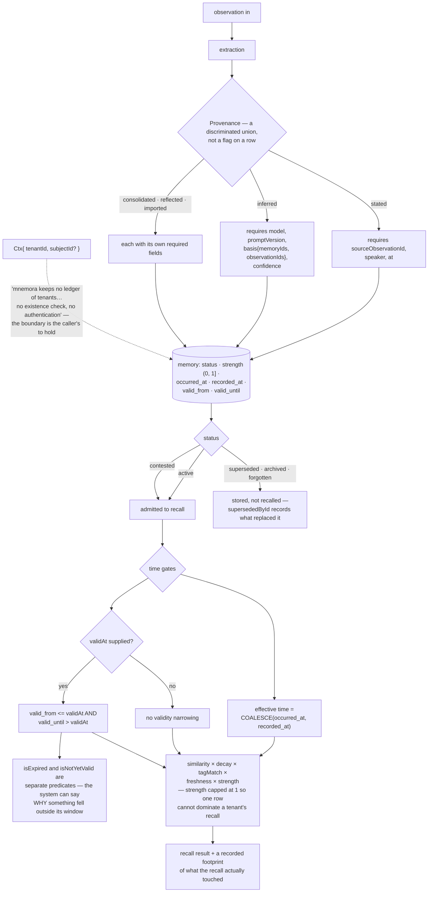

## 1. Executive Summary

mnemora describes itself as a cognitive layer to lay *underneath* an existing LLM
application — MIT, TypeScript, version 0.1.1, 87,938 lines across six packages
with 1,212 test cases in 127 files, documentation in Japanese. Its stated aim is
one sentence: give LLM applications *remembering*, rather than *saving*. It is
explicit that it does not want to replace LangGraph, Mastra or a hand-written
agent — it wants to sit below them, between the agent loop and storage, running
observation, recall, association, reinforcement, forgetting, consolidation and
reflection.

Three things earn marks, and one line of code explains the project better than
its README does.

**Provenance is the tag of a discriminated union.** The module says why:

> "The owner's principle 7, 'distinguish the AI's inference from facts the user
> stated', is implemented as the value of `kind` itself rather than as an
> additional flag."

`stated | inferred | consolidated | reflected | imported`, and each arm carries
what that kind must prove: `stated` needs a source observation id and a time;
`inferred` needs the model, the prompt version, a `basis` of the memory and
observation ids it reasoned from, and a confidence. A memory whose provenance was
never established is not a memory with a null field — it is a value the type
system will not let you build. Nearly every system in this corpus carries
provenance as an optional string; this one carries it as the thing the record
*is*.

The spelling of that union then lives in exactly one place, after it was found
duplicated by hand into the recall query's `excludeProvenanceKinds`:

> "When a closed union's spelling exists in two places, fixing one and forgetting
> the other depends on attention, and will certainly fail."

**A contested memory is still recalled.** `MemoryStatus` is
`active | superseded | contested | archived | forgotten`, and the recall scan
admits two of them: `WHERE status IN ('active', 'contested')`. Superseded,
archived and forgotten stay in the store and leave retrieval; contested stays in
both. A memory under dispute is surfaced rather than resolved away at write time
— the same stance [yacmemo](../yacmemo/) takes with its warning marker, reached
here through a status value. The count beside the scan carries the identical
predicate, so a withheld row does not move the number either.

**Three time concepts are kept apart.** `occurred_at` is when the thing happened,
`recorded_at` is when the store learned it, and `valid_from`/`valid_until` are
the window the memory applies in. The effective time is
`COALESCE(occurred_at, recorded_at)` under a comment tying the convention to the
freshness formula, and a caller's `validAt` gates the window — with `isExpired`
and `isNotYetValid` built as *separate* predicates, so the system can distinguish
a memory that has lapsed from one that has not started, rather than only
excluding both.

The third mark is the conformance kit. `expect(ids).not.toContain(excluded.id)`
with `expect(ids).toContain(kept.id)` on the next line, over a real store call —
and the test after it asserts the eligible count equals the in-scope,
non-excluded total even when the limit is reduced, which is the side channel
rather than the list. It lives in a shared kit every backend must pass, so the
contract binds future adapters and not just Postgres.

**There is no tenancy to enforce, and the code says so before a reader can
assume otherwise:**

> "mnemora keeps no ledger of tenants. `tenantId` is an opaque string the caller
> passes; it performs no existence check and no authentication."

Every read does emit `WHERE tenant_id = ${ctx.tenantId}`, so a correct caller is
isolated — but the string is the caller's, and the safety boundary therefore
lives in the embedding application. For a library meant to sit beneath somebody
else's agent that is the right place for it, and the same file draws the
distinction that makes it workable: the tenant is the isolation boundary, the
unit of safety; the subject is the unit of organisation within a tenant; do not
confuse the asymmetry. [Anda DB](../anda-db/) makes the same separation between a
Space and a Domain, from the opposite end of the scale.

One more decision worth borrowing. `MAX_STRENGTH = 1` exists because without a
ceiling "a Memory written with one larger value would dominate that tenant's
recall — the same hole ADR 0036 closed for `freshness`", and the constant is
exported so a caller can read that the ceiling exists and what it is. A scoring
multiplier with an unbounded tail is a self-service priority escalation, and this
is the second time the project has closed it.

## 2. Mental Model

A **memory** knows what kind of thing it is: something said, something inferred,
something merged, something reflected on, something imported.

**Contested** is not a reason to hide.

**Happened**, **recorded** and **valid between** are three different clocks.

**Strength** has a ceiling, because the second time is when you learn that.

## 3. Architecture

| Package | Role |
| --- | --- |
| `core` | The model, recall runtime, provenance, outbox, strategies (33,220 lines) |
| `postgres` | The store adapters and their SQL (17,544) |
| `testkit` | Conformance suites every adapter must pass (11,238) |
| `openai`, `anthropic`, `local-embedding` | Model and embedding adapters |

Inside `core`, the files worth their names: `provenance.ts`, `recall-footprint.ts`,
`recall-output-validation.ts`, `idempotent-create.ts`, `event-retention-purge.ts`,
`digest-band.ts`, `ann-truncation.ts`.

## 4. Essential Implementation Paths

`packages/core/src/provenance.ts:1-40` — the union, and the argument for it being
a union.

`packages/core/src/memory.ts:5-30` — five statuses and a ceiling with its
history.

`packages/postgres/src/memory-store.ts:999-1050` — three clocks, two admitted
statuses, one predicate shared with the count.

`packages/core/src/ctx.ts:1-20` — what the tenant is and is not.

## 5. Memory Data Model

Content, status, strength, the two timestamps, the validity window,
`supersededById`, and the provenance union. Creation is idempotent on a content
hash, and status changes take an `expectedStatus` so two writers cannot both
believe they performed the transition.

## 6. Retrieval Mechanics

`total = similarity × decay × tagMatch × freshness × strength`, documented in
`docs/recall.md`, with every factor bounded and the bounds exported. A digest
band returns a compact list alongside the full results, and a recall footprint
records what the recall touched — which is what makes a later question about why
something was recalled answerable.

## 7. Write Mechanics

Observations are extracted into memories; background cognition runs through an
outbox rather than inline, with an inline scheduler for tests. Forgetting is a
status, not a delete — and nothing is consulted at write time against a forgotten
memory, so the same content can be created again afterwards.

## 8. Agent Integration

Deliberately none of its own. The positioning — beneath LangGraph, Mastra or a
hand-written agent — is unusual in this corpus, where most projects want to own
the loop, and it is what makes the tenant decision coherent: a library one layer
down should not invent an authentication model for the application above it.

## 9. Reliability, Safety, and Trust

The typed provenance is the trust mechanism and it is the strongest version of
that idea here: not a field a writer may fill, but a tag a writer must choose,
with each choice demanding its own evidence.

What is absent: no record of what a memory said before it changed, beyond the
supersession link; no audit of who changed a status; and no authentication, by
design.

## 10. Tests, Evals, and Benchmarks

1,212 test cases across 127 files, with the conformance kit as the interesting
part — store behaviour is specified once and every adapter is held to it, which
is why the negative-evaluation mark attaches to a contract rather than to an
implementation. Nothing was installed or run for this reading.

## 11. For Your Own Build

Make provenance the tag, not a flag. A discriminated union whose arms demand
different evidence turns "we forgot to record where this came from" into a
compile error.

Spell a closed union once. This project found the same five values copied into a
query schema by hand and wrote down why that always fails eventually.

Let contested stay in recall. Suppressing a disputed memory is a decision made at
write time by whoever wrote last; surfacing it is a decision the reader can make
with both halves in front of them.

Bound every multiplier and export the bound. An uncapped factor in a ranking
formula is a way for one row to outrank everything else, and the fix costs one
constant.

And say what your isolation does not do. "No existence check, no authentication"
in the file that defines the tenant is worth more than a tenancy chapter that
implies otherwise.

## 12. Open Questions

Whether a forgotten memory can be re-created. Nothing consults status at write
time, and idempotency is keyed on a content hash whose interaction with a
forgotten row was not traced.

What the recall footprint is used for downstream. It is recorded per recall;
which surface reads it was not established.

How reflection differs from consolidation in practice. Both are provenance kinds
and both are background passes; the boundary is drawn in the docs rather than in
the types.

## Appendix: File Index

| Path | What to read it for |
| --- | --- |
| `packages/core/src/provenance.ts:1-40` | Provenance as a union, and the duplication that taught them |
| `packages/core/src/memory.ts:5-30` | Five statuses, and a ceiling closed twice |
| `packages/postgres/src/memory-store.ts:999-1050` | Three clocks and two admitted statuses |
| `packages/core/src/ctx.ts:1-20` | An isolation boundary that declines to authenticate |
| `packages/testkit/src/memory-store-conformance.ts:4238-4262` | A negative assertion, its control, and the count beside it |

## History

**2026-09-19** — [`509f4e739ca1ad017876a5b661062d23c2ead773`](https://github.com/takecchi/mnemora/commit/509f4e739ca1ad017876a5b661062d23c2ead773) — `trust_state` re-tested. The mark holds and the vocabulary anchor was exact (`packages/core/src/memory.ts:5-13`, a union and a Zod enum declared together). The recall anchors were not: `:1044` and `:1050` are dead, and the predicate `WHERE status IN ('active', 'contested')` now appears six times — the scan, its count, and the embedding-state variants beside them (`packages/postgres/src/memory-store.ts:1132`, `:1138`, `:1155`, `:1160`, `:1163`, `:1166`). One qualification the record omitted, and the project states it plainly in its own doc comment: the `expectedStatus` compare-and-set is opt-in. Passing it adds `AND status = …` to the UPDATE; when it is absent *nothing changes from today*, because most callers — the transitions to archived and forgotten — are meant to stay unconditional. The same comment is honest about a race the mechanism cannot close: when the conditional update matches no row, a second SELECT tells a missing id from a status mismatch, and because that re-read happens after the rejection the reported observed status is not the value at the moment of rejection. Recording the limit of a guard beside the guard is the habit this atlas looks for; the record now carries it. Screened again first; nothing was installed and no suite was run.

**2026-09-16** — [`509f4e739ca1ad017876a5b661062d23c2ead773`](https://github.com/takecchi/mnemora/commit/509f4e739ca1ad017876a5b661062d23c2ead773) — first reading, at a commit dated 16 September 2026. Screened before opening, from a shallow clone: nineteen files scanned, no auto-run surfaces, no build-time execution points, three unpinned surfaces and nine dependency files inside the seven-day cooldown. Nothing was installed, built or run.
