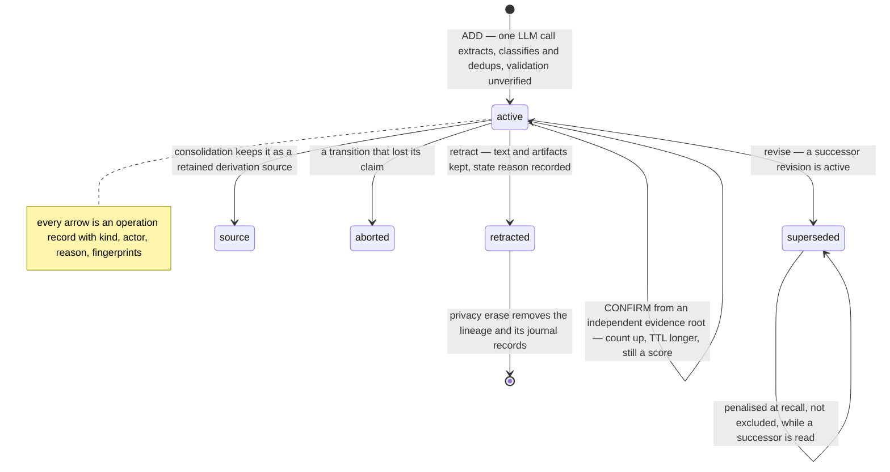

## 1. Executive Summary

mnemory is a self-hosted MCP memory server — Apache-2.0, 254 commits since
16 February 2026, version 1.14.0, 38,809 lines of Python under 34,260 lines of
tests across 35 files. Qdrant holds the vectors, S3 or MinIO holds larger
artifacts, and the service itself is stateless HTTP, which is the shape you
want if you intend to run it on Kubernetes rather than a laptop.

The write path is one LLM call doing three jobs: extract facts from the turn,
classify their metadata, and deduplicate against what is already stored —
resolving contradictions in the same pass, so *"I drive a Skoda"* followed later
by *"I bought a Tesla"* updates rather than accumulating.

**The reason to read it is `fsck`.** `mnemory/fsck.py` is 3,136 lines under a
3,574-line test file, and it applies the filesystem-check metaphor to a memory
store: run a consistency check, get a list of issues, review them, apply the
fixes you accept. Manually, or on a schedule with auto-fix.

Three phases, and **the ordering is the finding**:

```text
Phase 0a  security scan       regex only, no LLM        0–3%
Phase 0b  security re-eval    one LLM call per flag     3–8%
Phase 1   duplicate detection vector clustering + LLM
Phase 2   quality check       LLM batch evaluation
```

Injection screening runs **first, and without a model** (`fsck.py:797-816`).
Only material that survives a regex pass is handed to an LLM for the duplicate
and quality evaluations. That is the correct order and it is rarely the order:
a consistency checker that asks a model to evaluate stored text is feeding
that model attacker-controlled content, and doing the cheap deterministic
screen first means the expensive, steerable stage never sees the worst of it.

**And it re-screens what was already accepted.** `build_fsck_security_reeval_prompt`
exists because a memory that passed the write-time filter can still be
malicious — the pattern list may have been wrong, or the material may only look
hostile in the context of what was stored later. Most systems in this atlas screen
once, at write, and never look again. Treating the store as something to
re-examine rather than something that was validated on the way in is a different
posture, and it is the one an operator of a long-lived store actually needs.

**Since 6 September 2026 the store writes down what it did.** Two commits of
that week — 4,158 lines in `mnemory/revisions.py`, 2,423 in its test file —
put a revision model under every memory: a lineage of revisions, each with a
`revision_state` of `active`, `superseded`, `source`, `retracted` or `aborted`,
and a second Qdrant collection, `_mnemory_operations`, that the code calls a
*"durable revision operation journal and audit store"* (`revisions.py:154`).
An update is `revise`, which creates a successor and marks the predecessor
superseded; a delete is `retract`, which keeps the text and the artifacts under
a retracted state (`:3598-3720`); consolidation marks its inputs `source`
(`:3720`); an fsck apply is checkpointed per action and resumable after a crash.
Every one of those writes an operation record with a kind, an actor kind, a
reason, request fingerprints and UTC times, and `GET /api/memories/{id}/history`
returns a lineage's revisions and operations (`api/memories.py:708`). The read
path admits only active revisions (`storage/vector.py:97-107`). Beside that, a
`validation_state` of `unverified` or `confirmed` with a count of independent
evidence roots, set only through two signed-request routes, extends a confirmed
memory's TTL and slows its decay — and filters nothing.

Three marks: `scope_enforced` and `human_review` as before, and `audit_log`
for the journal. `trust_state` is withheld on the clause that matters: the
revision state withholds non-active rows and is a lifecycle, and the
validation state is spent as a score. `tombstone` is withheld because a
retracted fact's hash blocks nothing at the next extraction.

## 2. Mental Model

A memory is a fact with metadata — a category from a predefined set, an
importance, a memory type — living as a revision in a lineage in Qdrant with
its text. When the content is large (a report, a code dump, a research note)
the searchable memory is a summary and the body goes to the artifact store,
fetched on demand. Two tiers, one searchable and one retrieved by reference.

Belief has two axes. The first is the revision state: a fact enters `active`
and leaves it by being superseded by a successor, marked as the source of a
consolidation, retracted, or aborted mid-transition, and only active
revisions are read. The second is validation: a fact enters `unverified`, and
becomes `confirmed` only when a trusted route delivers the same fact again
from an independent evidence root, which bumps a bounded count, extends the
TTL and slows the decay (`revisions.py:3114-3154`). An ordinary API-key
`remember` cannot confirm anything, so for most deployments every fact is
unverified for its whole life and the axis is a score input.

Layer is the older axis. `memory_layer` is `raw` or
`consolidated`; at recall both raw and superseded memories are **penalised in
score rather than excluded** — `recall_superseded_penalty` subtracts from the
result's score (`config.py:640-645`). So a corrected fact does not disappear;
it sinks. Whether that is right depends on whether you would rather
occasionally surface a stale fact or occasionally lose a true one, and mnemory
has chosen the first.

Death is by TTL (`ttl_days`, `expires_at`), by a retract that keeps the content,
by maintenance pruning rows that consolidation superseded, or by a privacy
erase that removes the lineage and every record of it.



The arrow worth noticing is `superseded → superseded`. Under the layer
penalties a superseded row can still be returned, discounted; under the
revision filter it cannot. The two mechanisms coexist, and which one a caller
meets depends on whether the row carries a `revision_state` at all — rows
written before the field existed pass the filter as active.

## 3. Architecture

**Runtime.** A stateless HTTP service exposing both an MCP server (sixteen tools)
and a REST API with an OpenAPI spec, plus a built-in management UI. `uvx mnemory`
is the documented start. Native plugins exist for Claude Code, ChatGPT, Open
WebUI, OpenClaw, Cursor, Windsurf, Cline, OpenCode and others.

**Persistence.** Qdrant for vectors and for the operations journal; S3 or MinIO
for artifacts. Nothing is kept in the process except a lease lock, which is
what makes the stateless claim real and Kubernetes deployment straightforward.

**Dependencies.** An OpenAI-compatible endpoint for both LLM and embeddings —
the write path is not optional-LLM, it is LLM-first, since extraction,
classification, deduplication and contradiction resolution are one call.

**Auth.** API key or Cognis JWT, with session-level identity binding, and
per-user memory isolation enforced in the query filter. The two trusted routes
— `POST /api/user-events/remember/v1` and `POST /api/evidence/remember/v1` —
require a route-bound signed request; *"ordinary API keys cannot use either
route or supply trusted provenance"* (`docs/rest-api.md`).

**Observability.** A Prometheus `/metrics` endpoint with operation counters and
memory gauges, and a pre-built Grafana dashboard in the tree.

### Deployment and ergonomics

Two services and a model endpoint: Qdrant, an object store, and an
OpenAI-compatible API. That is more than a SQLite system and much less than the
hosted-service family, and the stateless middle means horizontal scaling is not
an afterthought.

What it costs you is that **nothing works without a model**. There is no
degraded mode where extraction falls back to regex — the single-call pipeline is
the write path. Budget an LLM call per remembered turn, plus fsck's per-flagged-
memory calls whenever the check runs.

The store is inspectable through the UI rather than by hand; Qdrant points and S3
objects are not something you read in an editor, and the journal is a second
collection of payload-only points.

## 4. Essential Implementation Paths

- **Write and extraction:** `mnemory/memory.py` (5,793 lines) — the single-call
  extract/classify/dedup pipeline; a new revision's initial metadata carries
  `revision_state: active`, `validation_state: unverified`, a `fact_hash`, a
  `source_kind` and `source_fingerprint` (`:2115-2130`, `:2198-2210`); the
  dedup actions call `revise` for an UPDATE (`:2229`) and `confirm` for a
  CONFIRM (`:2290`); the update and delete APIs call `revise` (`:5083`) and
  `retract` (`:5173`); history is served from `:5232`.
- **Revisions:** `mnemory/revisions.py` (4,158 lines) — `RevisionOperationStore`
  (`:153`) over `_mnemory_operations`: `write` upserts a checkpoint per
  operation token (`:243`), `claim` gives one concurrent winner with a lease
  (`:1706-1888`), `create_fsck_audit` binds an immutable audit (`:288`),
  `delete_lineage` erases records for a privacy delete (`:1976`);
  `RevisionService` (`:2060`) — `confirm` (`:2975`), `revise` (`:3299`),
  `retract` (`:3598`), `mark_source` (`:3720`), `history` (`:3799`), `links`
  (`:3959`), `prepare_privacy_erase` and `finalize_privacy_erase`
  (`:4058-4158`); `_check_replay` refuses an idempotency key reused for a
  different request (`:2896`).
- **Prompts:** `mnemory/prompts.py` (5,379 lines) — including the fsck duplicate,
  content-quality, metadata-normalisation and security re-evaluation prompts.
- **Consistency check:** `mnemory/fsck.py` (3,136 lines) — phases at `:797`
  (regex security) and `:809-816` (LLM re-evaluation), then duplicates and
  quality; an exact audit bound to one operation (`:434-493`, `:638`); a
  validation reconciliation pass that recomputes a memory's confirmation count
  from its evidence roots (`:1850-1878`).
- **Injection patterns:** `mnemory/sanitize.py` — `detect_injection_patterns`.
- **Vector store and scoping:** `mnemory/storage/vector.py` —
  `_build_owner_scope_condition` at `:73`, `_active_revision_condition` at
  `:97`, applied as `must` conditions at `:550-586` and `:755-759`.
- **Consolidation:** `mnemory/consolidation.py` — reads only active revisions
  (`:138`, `:829`) and marks its inputs as sources through `mark_source`
  (`:556`, `:736`).
- **Trusted ingestion:** `mnemory/trusted_events.py` (497 lines) — `process`,
  `plan` and `apply_plan` under a `TrustedEventLease`; a budget rejection is
  committed to the journal before any write and replayed as the same HTTP 422
  afterwards; `mnemory/api/evidence.py` and `api/user_events.py` are the two
  routes.
- **Maintenance:** `mnemory/maintenance.py` — prunes superseded rows.
- **Recall scoring:** `mnemory/memory.py:3112-3140` — the raw and superseded
  penalties, validation and slow decay widen the candidate set before
  reranking.
- **API:** `mnemory/api/` — `memories.py` (`PUT`, `DELETE`, `DELETE …/privacy`,
  `GET …/history`, `GET …/links` at `:590-761`), `recall.py`, `remember.py`,
  `fsck.py`, `sessions.py`, `ui.py`, `ui_projections.py`.
- **Migration:** `mnemory/migration.py` (1,423 lines) with its own 1,170-line
  test; legacy rows get `validation_state: unverified` and a provenance
  quality of `legacy_batch` (`:1170-1210`).
- **Benchmarks:** `benchmarks/locomo/` — ingest, answer, evaluate, report.

## 5. Memory Data Model

A point in Qdrant carrying the memory text, a `user_id`, a category validated
against `PREDEFINED_CATEGORIES`, an importance, a memory type, `ttl_days` and
`expires_at`, a `memory_layer`, an artifact reference, and the revision fields:
`lineage_id`, `revision`, `revision_state`, `state_reason`,
`revision_operation_id`, a `fact_hash` over the normalised text, a
`source_kind` and `source_fingerprint`, `validation_state`, `validation_count`,
`validation_strength`, `evidence_root_ids` and `last_validated_at`. An
operation in the journal carries `operation_kind`, `status`, `actor_kind`,
`user_id`, `owner_id`, `agent_id`, `lineage_id`, the target and previous
revision ids, an idempotency key hash, a request fingerprint, a reason and the
two timestamps; the history response projects each as `HistoryOperationItem`
(`api/schemas.py:345-351`).

**Scoping is the strict form.** `_build_owner_scope_condition` produces a
`FieldCondition(key="user_id", match=MatchValue(value=user_id))` that goes into
`must_conditions` on the search and browse paths — a predicate in the query, not
a filter after it, with a separate owner condition for memories shared beyond
their author, and the active-revision condition beside it.

**Provenance is a source kind, and it is thin for most writers.** A
revision records what kind of source produced it and a fingerprint of the
source; only the two signed routes can assert a trusted source or confirm a
fact against an independent root. For everything that arrives through an API
key, the extraction is still one LLM call over conversation text, and a fact
the model inferred and a fact the user stated are the same kind of row with the
same `unverified` state.

Temporal fields are `expires_at`, `ttl_days` and `last_validated_at` — expiry
and confirmation, both record time. No validity interval, so *"the user lived
in Berlin until March"* has no place to be stored as such.

The artifact tier is the structurally interesting half: the searchable unit and
the retrievable body are different objects in different stores, so a large
document does not have to be chunked into the vector index to be recallable by
reference, and an artifact save or delete is an operation on the lineage.

## 6. Retrieval Mechanics

Multi-query semantic search over Qdrant with temporal awareness — the README's
example is *"What did I decide last week about the database?"* — plus a score
threshold that drops results below a floor, an active-revision condition in the
query, and the layer penalties applied after scoring. When validation or slow
decay is enabled the candidate set is widened to three times the limit, capped
at 500, before reranking (`memory.py:3118-3130`).

The penalty design is the part to weigh. A superseded memory and a raw
(unconsolidated) memory both lose points but stay eligible. That makes recall
robust to a bad consolidation — if the merge was wrong, the original is still
reachable — at the cost of making correction advisory. A caller asking a
question whose true answer was superseded can still be handed the old one, ranked
lower, with nothing in the result marking it as replaced unless the caller reads
the metadata. Under the revision model the predecessor of a `revise` is
superseded *and* filtered, so the penalty applies to rows the older
consolidation superseded by pointer and to rows without a revision state.

The artifact tier changes what a result *is*: a hit may be a summary whose body
must be fetched separately, so a consumer that renders search results without
following the reference sees less than the store holds.

Failure modes visible in the design: everything rests on one extraction call, so
a bad classification is a bad category and a bad category is a filter that
excludes the memory later; and the score threshold is a global floor rather than
a per-query one, so a query whose best match is genuinely weak returns nothing
rather than the best available.

## 7. Write Mechanics

One LLM call per remembered turn does extraction, metadata classification,
deduplication and contradiction resolution together. That is efficient and it is
also a single point of judgement: the same call decides what is a fact, what
category it belongs to, and whether it contradicts something already held.

Writes are synchronous with that call, so the agent waits for a model round trip
before the memory exists. There is no queue and no deferred path. What the call
decides is then a plan of `ADD`, `CONFIRM`, `UPDATE` or `SKIP` actions; *"similarity
alone does not authorize a write"* — a CONFIRM needs complete semantic
equivalence and an independent root, an UPDATE creates a successor revision,
and each action is journaled before and after it lands.

Every mutation goes through the revision service. `revise` claims the current
revision with a lease, writes a successor, marks the predecessor `superseded`
and completes the operation; `retract` sets `revision_state: retracted` with a
`state_reason` and keeps the content; both take an `expected_revision` or an
`If-Match` header and return HTTP 409 on a stale one; an idempotency key
replays the same result and refuses a different request under the same key.
A crash between claim and completion leaves a record in `prepared` or
`claimed`, and the next caller recovers or aborts it (`revisions.py:2248`).

Consolidation is the background half: related memories merge, the survivors get
`memory_layer: consolidated`, and the inputs are marked `source` — retained as
derivation sources rather than deleted. `maintenance.py` later prunes rows
carrying the older `superseded_by` pointer.

**fsck is the other write path, and it is the governed one.** `start_fsck` runs
the three phases and caches the issue list with a TTL; `get_fsck_status` returns
it for review; `apply_fsck` applies the fixes a person selected, and each
applied action is a checkpoint in the journal so that a retry runs only the
pending ones (`tests/test_fsck_journal.py:105-125`). The same pipeline can run on
a schedule with auto-fix, which is the ungoverned mode of the same machinery —
and the difference between the two is a configuration choice, with the journal
recording each action's actor kind either way.

**Anti-injection is applied in two places.** The extraction prompts carry
anti-injection instructions, and fsck phase 0a runs `detect_injection_patterns`
over stored text. A memory flagged and removed is a retract with a reason in
the journal, and its content stays readable through history.

## 8. Agent Integration

Sixteen MCP tools plus a full REST API over the same backend, and native plugins
for ten-plus clients so recall and remember can be automatic rather than
model-initiated. The README is explicit that no system-prompt change is needed,
which is the right ambition for a memory layer: the agent should not have to be
taught to use it.

The model's authority is broad on the write side — it produces the facts, their
categories and their importance in one call — and the human's authority is
concentrated in the UI: a memory browser with full CRUD, a relationship graph,
and the fsck review screen. A client that wants to know what happened to a
memory has `GET /api/memories/{id}/history` for the lineage's revisions and
operations and `GET …/links` for its supersession and derivation links; a
client that wants to confirm a fact against a second source needs a
Cognis-signed request on a trusted route.

That review screen is the mark. `start_fsck` → `get_fsck_status` → `apply_fsck`
is inspect-then-approve over machine-proposed changes, which is what
`human_review` is for. It is not an admission gate — memories enter without
review — but it is a real adjudication surface over what is already there, and
the exact-audit and re-evaluate endpoints let a person check an old fsck
operation against the current store without applying anything.

## 9. Reliability, Safety, and Trust

**`scope_enforced` — earned, in its strict form.** `user_id` is a `must`
condition inside the Qdrant query on the read paths, with a separate owner scope
for shared memories, and session-level identity binding in front of it.

**`human_review` — earned.** The fsck run/review/apply cycle over cached issue
lists, a mutation-free re-evaluation, plus a memory browser with full CRUD.

**`audit_log` — earned, with its shape stated.** `_mnemory_operations` holds
one record per operation with kind, actor, reason, fingerprints and times;
retracted and superseded revisions keep their content; a lineage's history is
an endpoint. The record is a checkpoint upserted as the operation progresses,
not an appended row per state change (`revisions.py:243-262`), and a privacy
erase removes a lineage's records physically (`:1976-2003`) — a documented
exception, journaled while it runs. The fsck audit records are the one part a
test pins as immutable and content-free (`tests/test_fsck_journal.py:692`).

**`trust_state` — withheld, on the usage clause.** `revision_state` has five
values and the read path admits one, so a non-active revision is withheld; but
superseded, source, retracted and aborted are lifecycle outcomes of a mutation,
not verdicts on whether a fact is true. `validation_state` is the epistemic
axis — `unverified` or `confirmed`, with a count — and every read of it in the
tree extends a TTL, slows a decay or reconciles a count; none excludes a row.
A store where every API-key write is unverified forever and unverified rows
are served as freely as confirmed ones has a state with the right shape and
spends it as a score.

**`tombstone` — withheld.** A retracted revision keeps its `fact_hash`, and
nothing on the add path consults it: the dedup candidates are active revisions
only, so the next conversation that mentions the retracted fact adds it fresh
with a new lineage. Supersession is a state and, in the older model, a pointer
with a ranking penalty.

**`bitemporal` — withheld.** `expires_at`, `ttl_days` and `last_validated_at`
are record times.

**`negative_eval` — withheld, by a narrow margin.** `tests/test_api.py:267`
asserts a low-scoring result is absent when a score threshold is set, which pins
the threshold rather than a claim about particular material;
`tests/test_memory.py:3482` asserts an agent-scoped memory is absent from a
shared query with `len(results) == 0`, a predicate an empty store also
satisfies, and its positive control sits in the sibling test rather than the
same one. The retraction test asserts the content survives, not that recall
stops returning it.

Other observations:

- **The security phase runs before the model does**, which is the correct
  ordering for a checker that reads attacker-influenced text.
- **Stored memories are re-screened**, not just incoming ones.
- **Provenance is real on two routes and nominal elsewhere.** A source kind is
  on every revision; a trusted one needs a signed request.
- **Auto-fix on a schedule** is the same machinery as the reviewed path with the
  human removed; the journal records the actor kind of each action.
- **A durable budget rejection.** A trusted event that exceeds an input,
  extraction, action or plan budget is committed to the journal as a rejection
  before any write and replayed as the same HTTP 422 without another model
  call, *"even after configuration changes"*; the source is the caller's to
  keep.

## 10. Tests, Evals, and Benchmarks

34,260 lines of tests across 35 files against 38,809 lines of source — close to
parity. The weighting tracks the risk: `test_memory.py` at 7,001 lines,
`test_fsck.py` at 3,574, `test_e2e.py` at 3,028, `test_revisions.py` at 2,423,
`test_prompts.py` at 1,759, `test_migration.py` at 1,170 beside a 1,423-line
migration module, and nine new files for the revision layer — 145 cases across
`test_revisions.py`, `test_revisions_remote.py`, `test_fsck_journal.py`,
`test_trusted_rejection.py`, `test_validation_decay.py`,
`test_revision_preconditions.py`, `test_evidence_transport.py`,
`test_trusted_semantic.py` and `test_user_event_ingestion.py`. They test the
concurrency the design depends on — one claim winner, an expired claim
reclaimed, only the lease owner writes, a concurrent rejection unable to
override an execution and the reverse — and the properties the docs promise:
a confirmation idempotent and TTL-extending, a validation boost bounded, a
rejection replayed across both routes, an audit store immutable.

A prompts test file of that size is unusual and worth crediting: the prompts are
the system's actual logic, and testing them as artefacts rather than trusting
them is the right instinct.

`benchmarks/locomo/` is a complete harness — `ingest.py`, `answer.py`,
`evaluate.py`, `report.py`, `dataset.py`, `config.py`, `runner.py`, `search.py` —
so LoCoMo can be run against the store, and **the README publishes the scores it
produced**: 63.1 single-hop, 53.1 multi-hop, 74.8 temporal, 78.2 open-domain,
73.2 overall, over 10 multi-session dialogues and 1,540 questions, with the
configuration named (`gpt-5-mini` for extraction, `text-embedding-3-small` for
vectors) and a second row for a cheaper `gpt-oss-120b` alternative at ~5× lower
cost.

**The table is a comparison the project does not win, and that is the notable
part.** Memobase is placed above it at 75.8 overall, with Mem0-Graph, Mem0, Zep
and LangMem below. Publishing a scoreboard whose top row belongs to someone else
is rare enough in this corpus to name — [Palazzo](../palazzo/) and
[ReMe](../reme/) are the other instances — and it is the strongest evidence a
reader has that the numbers were not tuned into existence.

What is not in the tree is the *artifact*: no per-run report, scored output or
committed result file exists under `benchmarks/`, so the figures are reproducible
in principle by running the harness and not recomputable from anything committed.
That is the atlas's published-numbers-without-committed-artifacts shape, one step
better than usual because the harness that produced them is here and the model
configuration is stated.

Nothing was run for this review. `AGENTS.md` is addressed to a reading agent
and was treated as data, and no dependency was installed.

What is missing that the design would most benefit from: a measurement of the
fsck's own accuracy. Phase 0a is a regex list deciding what gets escalated, and
phases 1 and 2 are LLM judgements applied — optionally automatically — to a
user's stored memory. How often the check is right is the number that decides
whether auto-fix is safe, and it is not reported.

## 11. For Your Own Build

### Steal

- **Run the deterministic security screen before the model sees anything.**
  fsck's phase 0a is regex-only and precedes every LLM stage. A consistency
  checker that hands stored text to a model is handing it attacker-influenced
  input; screening first with something unsteerable costs nothing and removes the
  worst of it.
- **Re-screen what you already accepted.** A write-time filter reflects the
  pattern list you had that day. Periodically re-evaluating stored memories for
  injection treats the store as a live surface rather than something validated
  once at the door.
- **Retract, do not delete.** A delete that flips a state and records a reason
  keeps the content for a history endpoint and costs one field.
- **Journal the operation, not only the row.** A record per mutation with the
  actor kind, the reason and a fingerprint of the request is what makes a
  scheduled auto-fix answerable afterwards, and what makes a crashed apply
  resumable rather than repeated.
- **Separate the searchable unit from the retrievable body.** A summary in the
  vector index pointing at an artifact in object storage means a large document
  is recallable without being chunked into the index.
- **Make the checker's output reviewable before it is applied.** Run, cache,
  present, apply-selected is a better shape than a background pass that fixes
  things and tells you afterwards — and mnemory ships both, which makes the
  comparison easy to see.
- **Test your prompts as artefacts.** 1,759 lines of prompt tests, for a system
  whose logic is prompts.

### Avoid

- **Correction as a ranking penalty.** Discounting a superseded memory keeps it
  reachable, which protects you from a bad merge and also means a corrected fact
  can still be served. Choose deliberately, and tell the caller which they got.
- **A verified state nothing filters on.** `confirmed` versus `unverified` is
  the right distinction; spending it only as a TTL multiplier means an
  unverified fact and a confirmed one reach the model with the same standing.
- **One LLM call deciding everything about a write.** Extraction, classification,
  dedup and contradiction resolution in a single judgement is efficient and gives
  you one failure to debug when any of the four is wrong.
- **Auto-fix as a config flag.** The reviewed path and the unreviewed path being
  the same machinery with a boolean between them makes it very easy to end up
  running the unreviewed one.

### Fit

This suits someone who wants a memory service rather than a memory library: an
MCP endpoint several clients share, per-user isolation, Prometheus metrics, a
management UI, and a history per memory, deployed on infrastructure they
control. Within that shape it is one of the more complete things in the corpus
— the plugin coverage, the REST and MCP parity, the UI and the journal are all
real.

It is not a fit if you want memory without a model in the loop; the write path
has no non-LLM mode. Provenance and confirmation are real only for a deployment
that can sign requests through Cognis; everyone else gets a journal of what was
done and no way to raise a fact above unverified. And if you plan to run fsck on
a schedule with auto-fix, understand that you are letting an unmeasured LLM
judgement edit a user's memory unattended — recorded in the journal and unmeasured —
which is a product decision rather than a technical one.

## 12. Open Questions

- **How accurate is the fsck?** Phases 1 and 2 are LLM judgements that can be
  applied automatically to stored memories, and nothing measures how often they
  are right.
- **Will `validation_state` ever filter?** The field, the count and the evidence
  roots exist; every consumer scores. A recall option that returns confirmed
  facts only is one condition away.
- **Will a LoCoMo run be committed as an artifact?** The scores are published
  and the harness is here; a per-run report under `benchmarks/` would make them
  recomputable rather than reproducible, which is the difference between a
  reader checking the arithmetic and a reader paying for model calls.
- **How often does the regex phase flag a legitimate memory?** It gates
  escalation to the LLM stages and its false-positive rate is unreported.
- **Does anything reconcile the artifact store with the vector index?** Artifact
  saves and deletes are operations on the lineage; a memory pointing at a
  deleted object was not traced.
- **Why penalise rather than exclude a superseded memory?** The value is
  configurable, so the intent is deliberate; the reasoning is not stated, and
  the revision filter excludes what `revise` supersedes while the penalty
  governs the rest.

## Appendix: File Index

**Write and extraction**
- `mnemory/memory.py` (5,793) — the single-call pipeline; initial revision
  metadata at `:2115-2130`; dedup actions at `:2229` and `:2290`; the recall
  candidate widening at `:3112-3140`; update, delete and history at
  `:5083-5251`
- `mnemory/prompts.py` (5,379) — extraction and fsck prompts
- `mnemory/consolidation.py` — merges; `mark_source` at `:556` and `:736`
- `mnemory/trusted_events.py` (497), `mnemory/api/evidence.py`,
  `mnemory/api/user_events.py` — the two signed routes

**Revisions and the journal**
- `mnemory/revisions.py` (4,158) — states at `:36-51`; `RevisionOperationStore`
  at `:153`; `RevisionService` at `:2060`; `confirm` `:2975`, `revise` `:3299`,
  `retract` `:3598`, `mark_source` `:3720`, `history` `:3799`, `links` `:3959`,
  privacy erase `:4058-4158`

**Consistency check**
- `mnemory/fsck.py` (3,136) — phases at `:797-816`; exact audit at `:434-493`;
  validation reconciliation at `:1850-1878`
- `mnemory/sanitize.py` — `detect_injection_patterns`
- `mnemory/maintenance.py` — pruning superseded rows

**Storage**
- `mnemory/storage/vector.py` — Qdrant, `_build_owner_scope_condition` at `:73`,
  `_active_revision_condition` at `:97`
- `mnemory/migration.py` (1,423)

**Interfaces**
- `mnemory/server.py`, `mnemory/api/` (`memories.py`, `recall.py`,
  `remember.py`, `fsck.py`, `sessions.py`, `ui.py`, `ui_projections.py`,
  `schemas.py`)
- `integrations/hermes/`, `integrations/openwebui/`, `integrations/opencode/`

**Tests and benchmarks**
- `tests/test_memory.py`, `test_fsck.py`, `test_e2e.py`, `test_revisions.py`,
  `test_fsck_journal.py`, `test_trusted_rejection.py`, `test_validation_decay.py`,
  `test_prompts.py`, `test_migration.py`
- `benchmarks/locomo/`

Searches behind the absence claims above, run from the repository root:

```sh
rg -n 'retracted' mnemory/memory.py                                   # none: the add path never consults a retracted fact
rg -n 'validation_state' mnemory --glob '*.py'                        # twelve hits; every read extends, decays or reconciles, none filters
rg -n -i 'tombstone|rejected_value|denylist' mnemory --glob '*.py'    # none
rg -n -i 'valid_from|valid_until|validity' mnemory --glob '*.py'      # none: no validity interval
rg -n 'def test_.*(retract|superseded)' tests/*.py                    # content preserved and crash recovery; no recall-absence case
find benchmarks -name '*.json' -o -name '*results*'                  # none: no committed LoCoMo artifact
rg -n 'delete_lineage' mnemory/revisions.py                           # :1976 — the one physical erasure of journal records
```

## History

**2026-09-07** — [`c67b9167e18f1730786c07c48f883674425dd681`](https://github.com/fpytloun/mnemory/commit/c67b9167e18f1730786c07c48f883674425dd681) — re-pinned nine commits on — fixes, a docs note and two merges, and two of 6 and 7 September that add a revision model, an operations journal, trusted signed-request ingestion and validation decay: 24,112 lines inserted, 4,158 of them in one new module. The published claim that no audit record of any mutation existed was true at the previous pin and is not true at this one; `audit_log` is awarded for the journal, with its checkpoint shape and its privacy-erase exception stated, and the section 9 and 12 text that pressed on the gap is replaced by what closed it. `trust_state` was checked against the new `validation_state` and stays withheld on the usage clause. Line anchors for the phases, the scope condition and the penalties were re-verified and moved; `stack_source` promoted from `seeded` to `reviewed` after checking the store and arm lists against the code. Screened first: no auto-run surface, two build-time execution paths, two unpinned surfaces, two manifests inside the seven-day cooldown, `AGENTS.md` treated as data; nothing installed or run, the read made from a full clone.

**2026-08-07** — same pin, corrected after the project's author reviewed the report. The published claim that no scored LoCoMo result existed in the tree was wrong at the pinned commit: `README.md` carries a `## Benchmark` section with a six-system comparison table, the configuration used, and mnemory placed second of six. The search behind that claim was scoped to `benchmarks/locomo/` — the directory that ought to hold results — and never grepped the README, which is the third instance of this atlas's *none-found-is-a-claim-about-a-search* hazard and the second caught by a maintainer. Section 10 now carries the figures and the distinction the original sentence was reaching for: the numbers are published and no per-run artifact is committed.

**2026-08-06** — [`cd196704bb3dd148c314a81a32d96752204be5c1`](https://github.com/fpytloun/mnemory/commit/cd196704bb3dd148c314a81a32d96752204be5c1) — first reading. The pinned commit is dated 9 June 2026. Screened before reading: 0 auto-run surfaces, 2 build-time exec paths, 2 unpinned dependency surfaces, none inside the seven-day cooldown, and an `AGENTS.md` addressed to a reading agent, treated as data. Nothing was installed, built or run.
