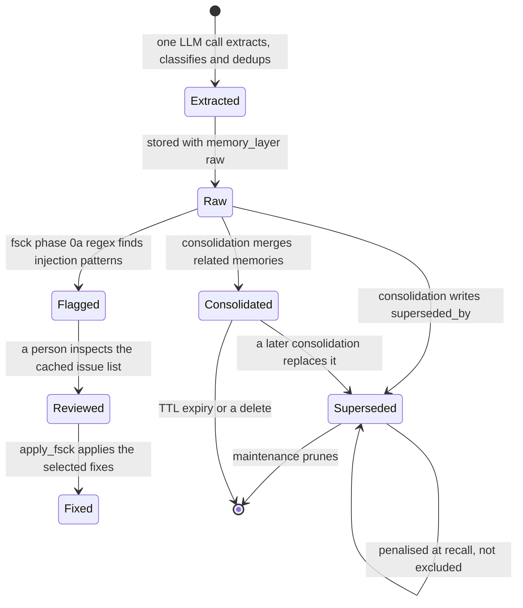

## 1. Executive Summary

mnemory is a self-hosted MCP memory server — Apache-2.0, 245 commits since
16 February 2026, 26,650 lines of Python under 24,205 lines of tests across 24
files. Qdrant holds the vectors, S3 or MinIO holds larger artifacts, and the
service itself is stateless HTTP, which is the shape you want if you intend to
run it on Kubernetes rather than a laptop.

The write path is one LLM call doing three jobs: extract facts from the turn,
classify their metadata, and deduplicate against what is already stored —
resolving contradictions in the same pass, so *"I drive a Skoda"* followed later
by *"I bought a Tesla"* updates rather than accumulating.

**The reason to read it is `fsck`.** `mnemory/fsck.py` is 1,766 lines under a
3,428-line test file, and it applies the filesystem-check metaphor to a memory
store: run a consistency check, get a list of issues, review them, apply the
fixes you accept. Manually, or on a schedule with auto-fix.

Three phases, and **the ordering is the finding**:

```text
Phase 0a  security scan       regex only, no LLM        0–3%
Phase 0b  security re-eval    one LLM call per flag     3–8%
Phase 1   duplicate detection vector clustering + LLM
Phase 2   quality check       LLM batch evaluation
```

Injection screening runs **first, and without a model**. Only material that
survives a regex pass is handed to an LLM for the duplicate and quality
evaluations. That is the correct order and it is rarely the order: a consistency
checker that asks a model to evaluate stored text is feeding that model
attacker-controlled content, and doing the cheap deterministic screen first
means the expensive, steerable stage never sees the worst of it.

**And it re-screens what was already accepted.** `build_fsck_security_reeval_prompt`
exists because a memory that passed the write-time filter can still be
malicious — the pattern list may have been wrong, or the material may only look
hostile in the context of what was stored later. Most systems in this atlas screen
once, at write, and never look again. Treating the store as something to
re-examine rather than something that was validated on the way in is a different
posture, and it is the one an operator of a long-lived store actually needs.

**The gap is that nothing is written down about any of it.** There is no audit
table anywhere in the tree — no record of a mutation, a merge, a supersession or
an fsck fix. The check tells you what it found and what it changed, in a cache
with a TTL, and once that expires the store's history is whatever the store
currently says. For a system whose distinctive feature is periodically deciding
that stored memories are wrong, the absence of a durable record of those
decisions is the sharpest thing to press on.


## 2. Mental Model

A memory is a fact with metadata — a category from a predefined set, an
importance, a memory type — living as a point in Qdrant with its text. When the
content is large (a report, a code dump, a research note) the searchable memory
is a summary and the body goes to the artifact store, fetched on demand. Two
tiers, one searchable and one retrieved by reference.

Belief is a matter of *layer* rather than status. `memory_layer` is `raw` or
`consolidated`, and consolidation writes `superseded_by` on the rows it replaces.
At recall, both raw and superseded memories are **penalised in score rather than
excluded** — `recall_superseded_penalty` subtracts from the result's score. So a
corrected fact does not disappear; it sinks. Whether that is right depends on
whether you would rather occasionally surface a stale fact or occasionally lose a
true one, and mnemory has chosen the first.

Death is by TTL (`ttl_days`, `expires_at`), by batch delete, by a person in the
UI, or by maintenance pruning rows that consolidation superseded.



The arrow worth noticing is `Superseded → Superseded`. In most systems here a
superseded row leaves the read path; here it stays in it, discounted. That is a
deliberate softness, and it is the reason a correction in mnemory is a ranking
change rather than a state change.


## 3. Architecture

**Runtime.** A stateless HTTP service exposing both an MCP server (sixteen tools)
and a REST API with an OpenAPI spec, plus a built-in management UI. `uvx mnemory`
is the documented start. Native plugins exist for Claude Code, ChatGPT, Open
WebUI, OpenClaw, Cursor, Windsurf, Cline, OpenCode and others.

**Persistence.** Qdrant for vectors; S3 or MinIO for artifacts. Nothing is kept
in the process, which is what makes the stateless claim real and Kubernetes
deployment straightforward.

**Dependencies.** An OpenAI-compatible endpoint for both LLM and embeddings —
the write path is not optional-LLM, it is LLM-first, since extraction,
classification, deduplication and contradiction resolution are one call.

**Auth.** API key or Cognis JWT, with session-level identity binding, and
per-user memory isolation enforced in the query filter.

**Observability.** A Prometheus `/metrics` endpoint with operation counters and
memory gauges, and a pre-built Grafana dashboard in the tree.

### Deployment and ergonomics

Two services and a model endpoint: Qdrant, an object store, and an
OpenAI-compatible API. That is more than a SQLite system and much less than the
hosted-service family, and the stateless middle means horizontal scaling is not
an afterthought.

What it costs you is that **nothing works without a model**. There is no
degraded mode where extraction falls back to regex — the single-call pipeline is
the write path. Budget an LLM call per remembered turn, plus fsck's per-flagged-
memory calls whenever the check runs.

The store is inspectable through the UI rather than by hand; Qdrant points and S3
objects are not something you read in an editor.


## 4. Essential Implementation Paths

- **Write and extraction:** `mnemory/memory.py` (4,557 lines) — the single-call
  extract/classify/dedup pipeline.
- **Prompts:** `mnemory/prompts.py` (5,287 lines) — including the fsck duplicate,
  content-quality, metadata-normalisation and security re-evaluation prompts.
- **Consistency check:** `mnemory/fsck.py` — phases at `:464` (regex security)
  and `:476` (LLM re-evaluation), then duplicates and quality.
- **Injection patterns:** `mnemory/sanitize.py` — `detect_injection_patterns`.
- **Vector store and scoping:** `mnemory/storage/vector.py` —
  `_build_owner_scope_condition` at `:80`, applied as a `must` condition at
  `:465` and `:666`.
- **Consolidation:** `mnemory/consolidation.py` — writes `superseded_by` at
  `:342` and `:427`.
- **Maintenance:** `mnemory/maintenance.py` — prunes superseded rows.
- **Recall scoring:** `mnemory/memory.py:2110` — the raw and superseded
  penalties.
- **API:** `mnemory/api/` — `memories.py`, `recall.py`, `remember.py`,
  `fsck.py` (`start_fsck`, `get_fsck_status`, `apply_fsck`), `sessions.py`,
  `ui.py`.
- **Migration:** `mnemory/migration.py` (1,035 lines) with its own 1,143-line
  test.
- **Benchmarks:** `benchmarks/locomo/` — ingest, answer, evaluate, report.


## 5. Memory Data Model

A point in Qdrant carrying the memory text, a `user_id`, a category validated
against `PREDEFINED_CATEGORIES`, an importance, a memory type, `ttl_days` and
`expires_at`, a `memory_layer`, and optionally `superseded_by` and an artifact
reference.

**Scoping is the strict form.** `_build_owner_scope_condition` produces a
`FieldCondition(key="user_id", match=MatchValue(value=user_id))` that goes into
`must_conditions` on the search and browse paths — a predicate in the query, not
a filter after it, with a separate owner condition for memories shared beyond
their author.

**Provenance is thin.** There is a category and an importance and a layer; there
is no source field recording whether a fact came from a user statement, a tool
result or an inference. For a system whose extraction is a single LLM call over
conversation text, the absence of that distinction means a fact the model
inferred and a fact the user stated are the same kind of row.

Temporal fields are `expires_at` and `ttl_days` — expiry, computed from record
time. No validity interval, so *"the user lived in Berlin until March"* has no
place to be stored as such.

The artifact tier is the structurally interesting half: the searchable unit and
the retrievable body are different objects in different stores, so a large
document does not have to be chunked into the vector index to be recallable by
reference.


## 6. Retrieval Mechanics

Multi-query semantic search over Qdrant with temporal awareness — the README's
example is *"What did I decide last week about the database?"* — plus a score
threshold that drops results below a floor, and the layer penalties applied
after scoring.

The penalty design is the part to weigh. A superseded memory and a raw
(unconsolidated) memory both lose points but stay eligible. That makes recall
robust to a bad consolidation — if the merge was wrong, the original is still
reachable — at the cost of making correction advisory. A caller asking a
question whose true answer was superseded can still be handed the old one, ranked
lower, with nothing in the result marking it as replaced unless the caller reads
the metadata.

The artifact tier changes what a result *is*: a hit may be a summary whose body
must be fetched separately, so a consumer that renders search results without
following the reference sees less than the store holds.

Failure modes visible in the design: everything rests on one extraction call, so
a bad classification is a bad category and a bad category is a filter that
excludes the memory later; and the score threshold is a global floor rather than
a per-query one, so a query whose best match is genuinely weak returns nothing
rather than the best available.


## 7. Write Mechanics

One LLM call per remembered turn does extraction, metadata classification,
deduplication and contradiction resolution together. That is efficient and it is
also a single point of judgement: the same call decides what is a fact, what
category it belongs to, and whether it contradicts something already held.

Writes are synchronous with that call, so the agent waits for a model round trip
before the memory exists. There is no queue and no deferred path.

Consolidation is the background half: related memories merge, the survivors get
`memory_layer: consolidated`, and the inputs get `superseded_by` pointing at the
result. `maintenance.py` later prunes rows carrying that pointer.

**fsck is the other write path, and it is the governed one.** `start_fsck` runs
the three phases and caches the issue list with a TTL; `get_fsck_status` returns
it for review; `apply_fsck` applies the fixes a person selected. The same
pipeline can run on a schedule with auto-fix, which is the ungoverned mode of the
same machinery — and the difference between the two is entirely a configuration
choice, with nothing recording which mode made a given change.

**Anti-injection is applied in two places and neither leaves a trace.** The
extraction prompts carry anti-injection instructions, and fsck phase 0a runs
`detect_injection_patterns` over stored text. A memory flagged and removed leaves
no record that it was ever there or why it went.


## 8. Agent Integration

Sixteen MCP tools plus a full REST API over the same backend, and native plugins
for ten-plus clients so recall and remember can be automatic rather than
model-initiated. The README is explicit that no system-prompt change is needed,
which is the right ambition for a memory layer: the agent should not have to be
taught to use it.

The model's authority is broad on the write side — it produces the facts, their
categories and their importance in one call — and the human's authority is
concentrated in the UI: a memory browser with full CRUD, a relationship graph,
and the fsck review screen.

That review screen is the mark. `start_fsck` → `get_fsck_status` → `apply_fsck`
is inspect-then-approve over machine-proposed changes, which is what
`human_review` is for. It is not an admission gate — memories enter without
review — but it is a real adjudication surface over what is already there.


## 9. Reliability, Safety, and Trust

**`scope_enforced` — earned, in its strict form.** `user_id` is a `must`
condition inside the Qdrant query on the read paths, with a separate owner scope
for shared memories, and session-level identity binding in front of it.

**`human_review` — earned.** The fsck run/review/apply cycle over cached issue
lists, plus a memory browser with full CRUD.

**`tombstone` — not found.** Supersession is a pointer and a ranking penalty;
nothing is keyed on a rejected value, so a fact the fsck removed as a duplicate
or an injection can be re-extracted from the next conversation that mentions it.

**`audit_log` — not found, and it is the gap that matters most.** Grepping the
whole tree for an audit table, change log or history record returns nothing. A
system that periodically decides stored memories are wrong — and can be
configured to fix them automatically on a schedule — keeps no durable record of
what it changed. The fsck issue list is an in-memory cache with a TTL.

**`trust_state` — not found.** `memory_layer` is a lifecycle tier (raw versus
consolidated), not an epistemic status; importance is a score.

**`bitemporal` — not found.** `expires_at` and `ttl_days` are expiry derived
from record time.

**`negative_eval` — not found, by a narrow margin.** `tests/test_api.py:267`
asserts a low-scoring result is absent when a score threshold is set, which pins
the threshold rather than a claim about particular material. The test shape is
right and the subject is a number.

Other observations:

- **The security phase runs before the model does**, which is the correct
  ordering for a checker that reads attacker-influenced text.
- **Stored memories are re-screened**, not just incoming ones.
- **No source field**, so a stated fact and an inferred one are indistinguishable
  after extraction.
- **Auto-fix on a schedule** is the same machinery as the reviewed path with the
  human removed, and nothing marks which changes came from which.


## 10. Tests, Evals, and Benchmarks

24,205 lines of tests across 24 files against 26,650 lines of source — close to
parity. The weighting tracks the risk: `test_memory.py` at 6,838 lines,
`test_fsck.py` at 3,428, `test_e2e.py` at 3,028, `test_prompts.py` at 1,673 and
`test_migration.py` at 1,143 beside a 1,035-line migration module.

A prompts test file of that size is unusual and worth crediting: the prompts are
the system's actual logic, and testing them as artefacts rather than trusting
them is the right instinct.

`benchmarks/locomo/` is a complete harness — `ingest.py`, `answer.py`,
`evaluate.py`, `report.py`, `dataset.py`, `config.py`, `runner.py`, `search.py` —
so LoCoMo can be run against the store, and **the README publishes the scores it
produced**: 63.1 single-hop, 53.1 multi-hop, 74.8 temporal, 78.2 open-domain,
73.2 overall, over 10 multi-session dialogues and 1,540 questions, with the
configuration named (`gpt-5-mini` for extraction, `text-embedding-3-small` for
vectors) and a second row for a cheaper `gpt-oss-120b` alternative at ~5× lower
cost.

**The table is a comparison the project does not win, and that is the notable
part.** Memobase is placed above it at 75.8 overall, with Mem0-Graph, Mem0, Zep
and LangMem below. Publishing a scoreboard whose top row belongs to someone else
is rare enough in this corpus to name — [Palazzo](../palazzo/) and
[ReMe](../reme/) are the other instances — and it is the strongest evidence a
reader has that the numbers were not tuned into existence.

What is not in the tree is the *artifact*: no per-run report, scored output or
committed result file exists under `benchmarks/`, so the figures are reproducible
in principle by running the harness and not recomputable from anything committed.
That is the atlas's published-numbers-without-committed-artifacts shape, one step
better than usual because the harness that produced them is here and the model
configuration is stated.

Nothing was run for this review. The screen was clean of cooldown findings, but
`AGENTS.md` is addressed to a reading agent and was treated as data, and no
dependency was installed.

What is missing that the design would most benefit from: a measurement of the
fsck's own accuracy. Phase 0a is a regex list deciding what gets escalated, and
phases 1 and 2 are LLM judgements applied — optionally automatically — to a
user's stored memory. How often the check is right is the number that decides
whether auto-fix is safe, and it is not reported.


## 11. For Your Own Build

### Steal

- **Run the deterministic security screen before the model sees anything.**
  fsck's phase 0a is regex-only and precedes every LLM stage. A consistency
  checker that hands stored text to a model is handing it attacker-influenced
  input; screening first with something unsteerable costs nothing and removes the
  worst of it.
- **Re-screen what you already accepted.** A write-time filter reflects the
  pattern list you had that day. Periodically re-evaluating stored memories for
  injection treats the store as a live surface rather than something validated
  once at the door.
- **Separate the searchable unit from the retrievable body.** A summary in the
  vector index pointing at an artifact in object storage means a large document
  is recallable without being chunked into the index.
- **Make the checker's output reviewable before it is applied.** Run, cache,
  present, apply-selected is a better shape than a background pass that fixes
  things and tells you afterwards — and mnemory ships both, which makes the
  comparison easy to see.
- **Test your prompts as artefacts.** 1,673 lines of prompt tests, for a system
  whose logic is prompts.

### Avoid

- **Changing memory without recording it.** An auto-fixing consistency checker
  with no audit table means the answer to "why is this memory gone" is
  unavailable in principle, not just inconvenient.
- **Correction as a ranking penalty.** Discounting a superseded memory keeps it
  reachable, which protects you from a bad merge and also means a corrected fact
  can still be served. Choose deliberately, and tell the caller which they got.
- **One LLM call deciding everything about a write.** Extraction, classification,
  dedup and contradiction resolution in a single judgement is efficient and gives
  you one failure to debug when any of the four is wrong.
- **Auto-fix as a config flag.** The reviewed path and the unreviewed path being
  the same machinery with a boolean between them makes it very easy to end up
  running the unreviewed one.

### Fit

This suits someone who wants a memory service rather than a memory library: an
MCP endpoint several clients share, per-user isolation, Prometheus metrics and a
management UI, deployed on infrastructure they control. Within that shape it is
one of the more complete things in the corpus — the plugin coverage, the REST and
MCP parity, and the UI are all real.

It is not a fit if you want memory without a model in the loop; the write path
has no non-LLM mode. It is not a fit if you need to answer questions about the
past state of the store, since nothing records it. And if you plan to run fsck on
a schedule with auto-fix, understand that you are letting an unmeasured LLM
judgement edit a user's memory unattended, with no record — which is a product
decision rather than a technical one.


## 12. Open Questions

- **How accurate is the fsck?** Phases 1 and 2 are LLM judgements that can be
  applied automatically to stored memories, and nothing measures how often they
  are right.
- **Will a LoCoMo run be committed as an artifact?** The scores are published
  and the harness is here; a per-run report under `benchmarks/` would make them
  recomputable rather than reproducible, which is the difference between a
  reader checking the arithmetic and a reader paying for model calls.
- **How often does the regex phase flag a legitimate memory?** It gates
  escalation to the LLM stages and its false-positive rate is unreported.
- **Does anything reconcile the artifact store with the vector index?** A
  memory pointing at a deleted artifact was not traced.
- **Why penalise rather than exclude a superseded memory?** The value is
  configurable, so the intent is deliberate; the reasoning is not stated.


## Appendix: File Index

**Write and extraction**
- `mnemory/memory.py` — the single-call pipeline; recall penalties at `:2110`
- `mnemory/prompts.py` — extraction and fsck prompts
- `mnemory/consolidation.py` — merges and `superseded_by`

**Consistency check**
- `mnemory/fsck.py` — phases at `:464` and `:476`
- `mnemory/sanitize.py` — `detect_injection_patterns`
- `mnemory/maintenance.py` — pruning superseded rows

**Storage**
- `mnemory/storage/vector.py` — Qdrant, `_build_owner_scope_condition` at `:80`
- `mnemory/migration.py`

**Interfaces**
- `mnemory/server.py`, `mnemory/api/` (`memories.py`, `recall.py`,
  `remember.py`, `fsck.py`, `sessions.py`, `ui.py`)
- `integrations/hermes/`, `integrations/openwebui/`

**Tests and benchmarks**
- `tests/test_memory.py`, `test_fsck.py`, `test_e2e.py`, `test_prompts.py`,
  `test_migration.py`
- `benchmarks/locomo/`

## History

**2026-08-07** — same pin, corrected after the project's author reviewed the report. The published claim that no scored LoCoMo result existed in the tree was wrong at the pinned commit: `README.md` carries a `## Benchmark` section with a six-system comparison table, the configuration used, and mnemory placed second of six. The search behind that claim was scoped to `benchmarks/locomo/` — the directory that ought to hold results — and never grepped the README, which is the third instance of this atlas's *none-found-is-a-claim-about-a-search* hazard and the second caught by a maintainer. Section 10 now carries the figures and the distinction the original sentence was reaching for: the numbers are published and no per-run artifact is committed.

**2026-08-06** — [`cd196704bb3dd148c314a81a32d96752204be5c1`](https://github.com/fpytloun/mnemory/commit/cd196704bb3dd148c314a81a32d96752204be5c1) — first reading. The pinned commit is dated 9 June 2026. Screened before reading: 0 auto-run surfaces, 2 build-time exec paths, 2 unpinned dependency surfaces, none inside the seven-day cooldown, and an `AGENTS.md` addressed to a reading agent, treated as data. Nothing was installed, built or run.
