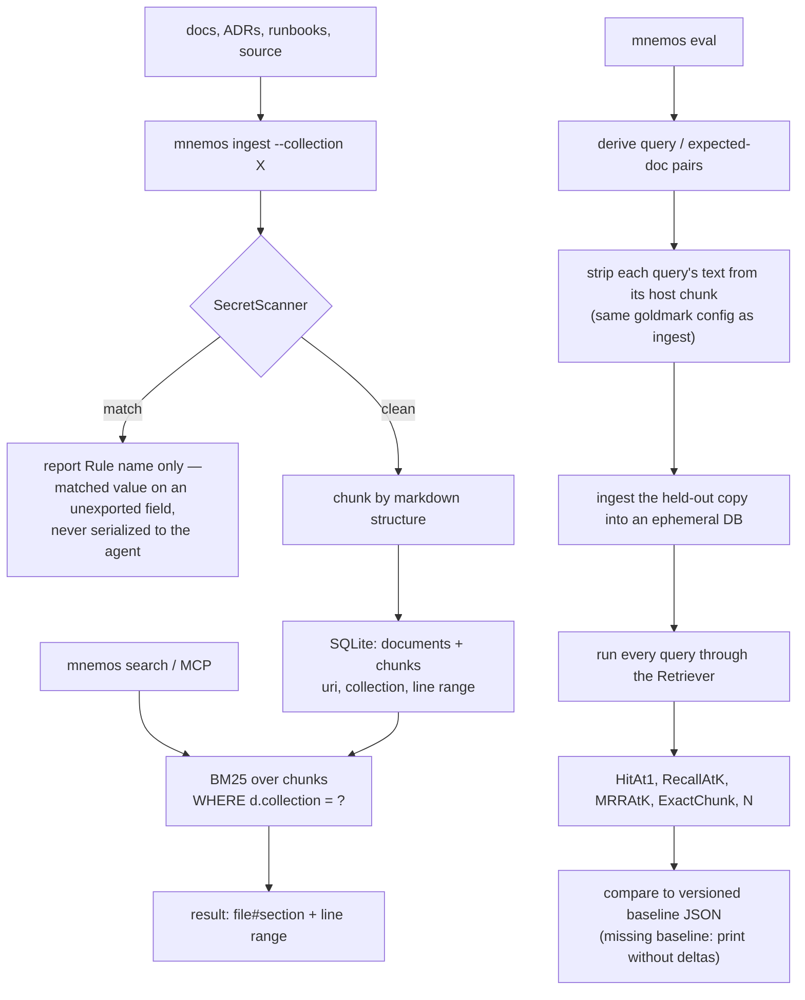

## 1. Executive Summary

mnemos gives a coding agent "a local, cited memory" of ADRs, design docs, notes,
runbooks and source — "No vector database. No Ollama. No Python or Node service.
Just one cgo-free Go binary", with every answer landing "on the exact
`file#section` and line range".

**Two things in it are worth taking, and both are about not fooling yourself.**

**First, `internal/eval` is a held-out retrieval evaluation shipped as a package
of the system**, with the leakage control most self-built retrieval evals miss:

> "Derives example-query/expected-document pairs from a bundle, builds a held-out
> copy of the corpus **with those queries stripped from their host chunks**,
> ingests the copy into an ephemeral database, runs each query through the
> Retriever, and computes doc-level retrieval metrics **against a versioned
> baseline**."

If you generate questions from your documents and then index those same
documents, the question's wording is *inside* the chunk that should answer it,
and a lexical retriever scores near-perfectly for a reason that has nothing to do
with retrieval quality. Stripping the query text from its host chunk before
indexing is the fix, and the AST used to do it is deliberately the same one
ingestion uses — "it mirrors the parser configuration used by the ingest pipeline
(CommonMark defaults) so the AST view of a document matches what ingestion sees."

The metrics are `HitAt1`, `RecallAtK`, `MRRAtK`, `ExactChunk` and `N`, compared
against a baseline JSON, and a missing baseline is "intentionally not an error;
callers print without deltas" — so the first run works and every run after it
shows movement.

**Second, the secret scanner is built so its own findings cannot leak the
secret:**

> "The matched substring is held on an unexported field so it cannot leak through
> serialization or an external caller: the remember tool reports only Rule names
> and never echoes the value back to the agent."

A scanner that finds an AWS key and then hands the model a report containing the
key has moved the secret into the context window it was protecting. Using Go's
visibility rules as the enforcement — the field cannot be marshalled because it
is unexported — is exactly the right mechanism, and this atlas has not seen
another scanner do it.

## 2. Mental Model

Files on disk are the memory. `mnemos ingest` chunks them into a SQLite index
under `.mnemos/`, `mnemos search` returns chunks with their locations, and the
agent reads the cited section rather than being handed a summary.

## 3. Architecture

`internal/` is twenty focused packages: `ingest`, `chunk`, `parse`, `search`,
`storage`, `embed`, `memory`, `okf`, `eval`, `security`, `browse`, `mcp`,
`cli`, `app`, `config`, `doctor`, `model`, `workspace`, `testutil`, `version`.

A `doctor` package and a `THIRD-PARTY-NOTICES.md` alongside a `SECURITY.md` and
a `CODE_OF_CONDUCT.md` is unusually complete for a single-binary tool.

**The distribution claim is the design constraint.** One cgo-free Go binary means
no Python, no Node, no model server, no vector database and no container — the
whole system is `make install` and a TOML file. That rules out embeddings as the
primary retrieval mechanism, which is why BM25 does the work, and it is a
coherent trade rather than an omission.

19,800 lines of Go and **84 test files** — the highest test-to-source ratio in
this batch.

## 4. Essential Implementation Paths

**Evaluate** — `internal/eval/holdout.go` (the package contract `:1-5`, the
shared goldmark instance and why `:19-22`), `eval.go`, `metrics.go`
(`Metrics` `:6-14`), `baseline.go` (`loadBaseline` and the missing-file
decision `:12-25`), `coverage_test.go`,
`buildretriever_noembed_test.go`.

**Screen** — `internal/security/secrets.go` (the package contract and the
unexported-match rationale `:1-12`), `paths.go`.

**Retrieve** — `internal/search/bm25.go` (the collection predicate `:103`),
`engine_test.go`, `bench_test.go`.

**Cite** — `internal/memory/write.go`, `read.go`, `internal/storage/documents.go`.

## 5. Memory Data Model

Documents and chunks in SQLite, addressed by `uri`, grouped by `collection`, with
a section anchor and a line range so a result is a location rather than a blob.

There is no status field, no confidence, no supersession pointer and no
tombstone. The files are the memory and re-ingesting is the update path.

**The consequence is worth stating because it cuts against the product's own
pitch.** The README's first complaint is that an agent "forgets why you rejected
an architecture" — and a rejected ADR, indexed, reads exactly like an accepted
one. mnemos will cite it faithfully, with the file and line, and nothing in the
index says which way the decision went. Citation solves *where did this come
from*; it does not solve *is this still the decision*. Many ADR conventions carry
a `status: superseded` header, and reading it into a retrieval signal is the
obvious next mechanism.

## 6. Retrieval Mechanics

BM25 over chunks with `d.collection = ?` appended as a condition — a stored key
reaching the query, so `scope_enforced` is earned — and the collection filter has
both a unit test ("collection filter narrows results") and a benchmark comparing
"an unfiltered scan and a collection-filtered one" over roughly 10,000 chunks.
Benchmarking the filtered and unfiltered paths against each other is how you find
out whether your scope predicate is also an index-usage bug.

Lexical retrieval with no semantic fallback is the trade the single-binary
constraint buys. For the stated corpus — ADRs, runbooks, design docs, source —
the vocabulary is largely shared between question and document, which is the case
where BM25 does well; it is the wrong tool when the user's words and the
document's diverge.

## 7. Write Mechanics

Ingest a directory into a named collection. Content passes the `SecretScanner`
before it is written — the package docstring calls the security package "the
guardrails that keep mnemos local-first and secret-free: the SecretScanner that
screens captured content before it is written, and the path/exclude rules that
bound what the agent can touch".

Screening at write time rather than read time is the correct side of the
boundary, and pairing it with path rules that bound what may be read at all is
the other half.

## 8. Agent Integration

An MCP server and a CLI from the same binary, a `skills/` directory, `mnemos
init` writing `.mnemos.toml` and `.mnemos/`, and a `doctor` command. The README's
60-second path is clone, `make install`, `init`, `ingest`, `search`.

## 9. Reliability, Safety, and Trust

**One mark: scope enforced**, per section 6.

**Trust state, tombstone, bitemporal, audit log, human review, negative eval —
no.** The system's answer to trust is provenance: every claim lands on a file and
a line range, so a person can check it. That is a real answer to a different
question from the one the other marks ask, and this report's section 5 names
where it stops.

**The secret scanner is the best-designed small component in this batch**, per
section 1, and the path/exclude rules that "bound what the agent can touch" are
its companion. `internal/security/paths.go` with `paths_test.go` beside it means
the boundary is tested, which is more than [DiffMem](../diffmem/)'s comparable
sandbox manages.

**A trust model exists as a proposal and not as a field.** ADR 0008, *Memory
trust model (provenance, review, confidence, enforcement)*, carries the status
`Proposed` and states the problem this report's section 5 identifies, in the
project's own words: mnemos *"commits an agent-authored memory as ground truth
the instant an agent asserts it"*, the only gate is a boolean `allow_write`
capability, and *"the consequence is recall pollution"* — an index filling with
*"agent guesses, superseded decisions, and one-off observations that are
indistinguishable"*. A search of `internal/parse` and `internal/memory` for a
confidence, enforcement, trust, provenance or reviewer field returns nothing, so
this is a design document rather than a mechanism and no mark follows from it.

Its rejected-alternatives section is the part worth reading whatever you build,
because three of the five refusals are arguments this atlas keeps needing. A
hand-set `confidence: 0.0-1.0` float is refused as *"fake precision no human or
agent can calibrate"*, defensible only if machine-derived from corroboration
count or recall hits. A human-approval gate in front of writes is refused because
*"it produces an unbounded review backlog that gets abandoned, and hiding
unreviewed memory just makes agents re-learn the same facts"*, with the
alternative stated as a position: *"Trust is enforced at recall, not at
capture."* And auto-promoting confidence when an agent re-asserts something is
refused because *"it launders a repeated hallucination into a trusted fact"* —
which is the cleanest formulation of that failure in the corpus.

## 10. Tests, Evals, and Benchmarks

**115 test files** against 28,764 lines of Go, and — unusually — the evaluation is not a
`benchmarks/` directory of scripts but `internal/eval`, a package of the system
with its own tests (`eval_test.go`, `coverage_test.go`,
`buildretriever_noembed_test.go`) and testdata.

Four things it does right, in a corpus where self-built retrieval evals are
usually one script and an optimistic number:

- **Leakage control.** The query text is stripped from its host chunk before the
  held-out corpus is indexed. Without this, generated-question evaluations
  measure string matching.
- **The same parser as production.** The goldmark instance "mirrors the parser
  configuration used by the ingest pipeline… so the AST view of a document
  matches what ingestion sees" — an eval that chunks differently from the system
  is measuring a different system.
- **An ephemeral database.** The held-out corpus is ingested fresh, so the
  evaluation cannot accidentally query the developer's real index.
- **A versioned baseline with graceful absence.** Metrics compare against a
  baseline JSON; a missing file "is intentionally not an error: it returns
  `(nil, nil)` so callers print without deltas". The first run works, and every
  subsequent one shows the delta.

`ExactChunk` alongside the doc-level metrics is the right pair: retrieving the
correct document and retrieving the correct *section* of it are different
successes, and a citation-first product should care about the second.

**The numbers are published and the baseline file is not**, which is a narrower
gap than it sounds. The README carries a doc-level table for the shipped
`examples/git-recipes` bundle — lexical FTS5/bm25 at Hit@1 0.83, Recall@12 0.83,
MRR@12 0.83 against semantic-plus-hybrid at 1.00 across all three — and a second
figure for the hard case: on `examples/onpage-seo`, whose held-out answers are
JSON-LD and sitemap-XML blocks *"that share no keywords with their prose"*,
lexical scores 0.00 and `--semantic` recovers Hit@1 0.57 and Recall@12 0.86. Each
metric is defined in place, including that 0.83 is five of six, and the reproduce
block states the sample sizes and refuses the word: *"N is 6 and 7 respectively —
smoke signals, not benchmarks."* Publishing a 0.00 for your default retriever
beside a caveat about your own sample size is the disclosure most projects
decline to make.

What is absent is the versioned baseline JSON the delta mechanism reads — the
code is in `internal/eval/baseline.go` and no file is in the tree — so the
numbers can be reproduced but a regression cannot be caught by the mechanism
built for it.

**A third eval mode measures what link expansion buys.** `mnemos eval <bundle>
--graph` reads a `cases.json` and compares link-neighborhood inclusion and
`GraphRetriever` hit@K against plain lexical search, with `--graph-expansion` as
the non-regression gate on the held-out metrics. The committed
`examples/graph-answerability` bundle is a fictional platform-ops vault built so
the trivial answer fails: in each case the lexical hit is a hub or overview
document and the answer lives one link away in a detail document *"written with
different vocabulary."* The bundle's own description then states a limitation
against itself — the queries are keyword-style on purpose, because the default
lexical retriever quotes each token and ANDs them, so a natural-language question
with stopwords returns nothing, and *"that is itself part of the finding:
injection's value is conditional on search finding the hub."* No numbers are
published for this mode.

**I ran nothing.**

## 11. For Your Own Build

### Steal

- **Strip the query from its host chunk before indexing the held-out corpus.**
  If you generate evaluation questions from your own documents, the question's
  wording sits inside the answer and your lexical retriever will look
  extraordinary for no reason.
- **Use the production parser in the evaluation.** An eval that chunks
  differently from ingestion is measuring a system you do not ship.
- **Ingest the held-out copy into an ephemeral database**, so the evaluation
  cannot read the real index.
- **Compare against a versioned baseline, and let a missing baseline be
  fine.** Returning `(nil, nil)` and printing without deltas means the first run
  is not a special case.
- **Measure exact-chunk alongside doc-level hit rate.** Right document, wrong
  section is a different failure and a citation product should see it.
- **Hold a scanner's match on an unexported field.** The finding reports the rule
  name; the matched secret cannot be serialised out to the agent. Language
  visibility as the enforcement beats remembering not to log it.
- **Screen secrets on the write path**, and pair it with path rules bounding what
  may be read at all — with a test file next to each.
- **Benchmark the scoped and unscoped query against each other.** It tells you
  whether the scope predicate is using the index or scanning.
- **Let the distribution constraint pick the architecture.** One cgo-free binary
  rules out an embedding server, so BM25 does the work — a coherent trade, stated
  as one.

### Avoid

- **Do not commit the harness without a baseline.** Everything needed to produce
  a number is here and no number is, so the methodology cannot be checked against
  a result.
- **Do not treat citation as a substitute for status.** A rejected ADR cites as
  cleanly as an accepted one, and the README's opening complaint is precisely
  about rejected architectures. ADR conventions already carry a `status` header;
  reading it into the retrieval signal is the missing step.

### Fit

The right choice when your memory really is your documents and you want an agent
that quotes them with a line range instead of paraphrasing — and when adding a
Python service or a vector database to the project is not acceptable. `make
install` and a TOML file is the whole footprint.

Read `internal/eval/holdout.go` and `internal/security/secrets.go` whatever you
build. One is the cleanest statement of how to evaluate retrieval on your own
corpus without cheating; the other is a scanner that cannot leak what it finds.

## 12. Open Questions

- **What does mnemos score with graph expansion on?** The mode, the gate and a
  purpose-built case bundle are committed; no figure is.
- **Will the versioned baseline JSON ever be committed?** `baseline.go` reads one
  and returns `(nil, nil)` when it is missing, so the delta machinery is dormant
  in every clone.
- **Is ADR `status` read at all?** Nothing found treats a superseded document
  differently.
- **What does `internal/embed` do given the no-Ollama claim?** An embedding
  package exists beside `buildretriever_noembed_test.go`; the default path was
  not traced.
- **What is OKF?** The README names an "OKF knowledge base" and `internal/okf`
  implements it; the format was not examined.

## Appendix: File Index

**Evaluation** — `internal/eval/holdout.go` (the package contract `:1-5`, the
shared goldmark instance and the parser-parity rationale `:19-22`),
`internal/eval/metrics.go` (`Metrics` `:6-14`), `baseline.go` (`loadBaseline`
and the missing-baseline decision `:12-25`), `eval.go`, `eval_test.go`,
`coverage_test.go`, `buildretriever_noembed_test.go`, `testdata/`

**Security** — `internal/security/secrets.go` (the package contract and the
unexported-match rationale `:1-12`), `secrets_test.go`, `paths.go`,
`paths_test.go`

**Retrieval** — `internal/search/bm25.go` (`d.collection = ?` `:103`),
`engine_test.go` (the collection-filter case `:139`), `bench_test.go` (the
filtered-versus-unfiltered benchmark `:95`)

**Storage and citation** — `internal/storage/documents.go` (`:35`, `:120`),
`internal/memory/write.go` (`:47`, `:155`), `read.go`, `internal/chunk/`,
`internal/parse/`

**Surfaces** — `internal/mcp/`, `internal/cli/`, `internal/doctor/`,
`internal/browse/`, `skills/`, `cmd/`

## History

**2026-09-10** — [`19ac9c06ffa648bdc7b38faf0138e59c685dbfdf`](https://github.com/arhuman/mnemos/commit/19ac9c06ffa648bdc7b38faf0138e59c685dbfdf) — read again, 40 commits and 138 files past the previous pin. The single mark holds and one published claim did not: section 10 said a reader could not see what mnemos scores on its own evaluation, and the README carries doc-level figures for two shipped bundles — `git-recipes` at Hit@1 0.83 lexical against 1.00 semantic-hybrid, and `onpage-seo` at 0.00 lexical against Hit@1 0.57 semantic — with each metric defined, the sample sizes stated and the word benchmark refused. The versioned baseline JSON the delta mechanism reads is still absent from the tree, so that half of the claim stands and the open question was narrowed to it. A third eval mode arrived, `--graph` with a `--graph-expansion` non-regression gate, over a committed `graph-answerability` bundle built so the lexical hit is a hub document and the answer lives one link away in different vocabulary; the bundle states its own limitation, that keyword-style queries are required because the retriever ANDs quoted tokens. ADR 0008 proposes a trust model and names the recall-pollution problem in the project's own words, with no confidence, enforcement, provenance or reviewer field anywhere in `internal/parse` or `internal/memory` — a proposal, not a mechanism, and no mark follows. Test files went from 84 to 115, and the tree from 19,800 lines to 28,764 of Go. Screened before reading: no auto-run surface, two dependency manifests inside the seven-day cooldown, one build-time execution path in the `Makefile`, and no unpinned surface against a `go.sum`; nothing was installed, built or run.

**2026-08-09** — [`27df4b569cc26b25e75356322db72f6461939a66`](https://github.com/arhuman/mnemos/commit/27df4b569cc26b25e75356322db72f6461939a66) — first reading. Screened before reading; the tree was read, never built, and no evaluation was run.
