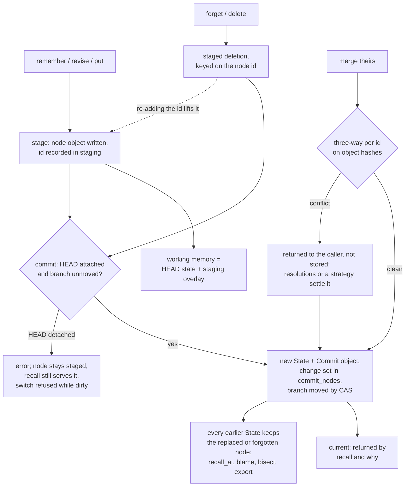

## 1. Executive Summary

Mnemosyne (Nabzx) is version control for an agent's memory: a Rust core that
stores memory nodes as content-addressed objects in one redb file, commits a
full state snapshot per write, and offers branch, three-way merge, `blame` and
`bisect`. It ships a `mnem` CLI, a Python SDK, an MCP server and two framework
adapters. What is notable is that the history is the store, not a log beside
it: every agent write is a commit, and nothing in the code deletes an object.
What is weak is everything past the history. There is no search, no scope key,
no trust state, and `forget` removes a node from the next snapshot while the
agent can still read it at any earlier commit.

This is not the atlas's other [Mnemosyne](../mnemosyne/), a SQLite memory
engine from `mnemosyne-oss`; the two share a name and nothing else. The crates
here are published as `mnem-store` and `mnem-git`, renamed from `mnem-core` and
`mnem-cli` for the first publish (`CHANGELOG.md:447-455`).

The design is honest about its target. It makes no accuracy claim; the
benchmark document says versioned memory does not make an agent answer better
and measures reconstruction, blame, bisect and merge instead
(`docs/benchmark.md:1-12`). Those properties are well tested: 40 seeded
histories check `state_at` against the working memory recorded at each commit
(`crates/mnem-store/tests/time_travel.rs:57-102`), and a chaos harness checks the
merge algebra.

Two marks. `audit_log`, on the commit graph in the system's own store with no
rewriting path; and `negative_eval`, on a CI-run case asserting that a forgotten
memory is not returned while a second one still is. Section 9 names the five
withheld.

## 2. Mental Model

A memory is a node: a string id, JSON content, optional provenance
(`agent_step`, `observation`, `tool_call`, `source`, `note`) and an optional
`event_time` (`crates/mnem-store/src/object.rs:51-101`). A node object is
immutable and addressed by the BLAKE3 hash of its canonical CBOR, so the same id
with new content is a new object. The belief the agent holds is the set of node
ids in the state its `HEAD` commit points at.

**A node becomes current in two steps, and the first is already visible.**
`stage` writes the node object and records its id in the `staging` table in one
transaction; `commit` builds the next state from the parent's state plus
everything staged, in a second transaction (`crates/mnem-store/src/commit.rs:55-66`,
`:90-163`). Working memory, which is what `recall` reads, is the `HEAD` state
minus staged deletions with staging overlaid (`checkout.rs:84-126`). So a staged
node is served before any commit records it.

**It stops being current in one of three ways.** A later write under the same
id replaces it in the next state. `rm`, which MCP `forget` calls, stages a
deletion the next commit applies (`checkout.rs:134-156`). A `checkout` of
another branch or commit changes which state `HEAD` names. None of these
removes anything: every earlier state still holds the node, and
`recall_at`, `blame`, `bisect` and `export` read it there. Nothing expires or
decays.

**The staged deletion is keyed on the id and dies at the commit.** Re-staging
the id lifts it — *"re-adding un-deletes"* (`commit.rs:55-57`) — and the commit
clears the table (`:158-159`). A forgotten value can therefore be remembered
again with nothing consulted.

**Merge is structural.** Two branches are merged per node id on object hashes
against their merge base (`merge.rs:66-89`). Because provenance is inside the
hashed object, two branches that learned the same content from different
sources conflict, and a conflict is returned to the caller, not stored
(`merge.rs:27-29`).

## 3. Architecture

Three crates and three Python packages. `mnem-store` is the object model, the
store and every operation; `mnem-git` is the `mnem` CLI; `mnem-py` is the PyO3
binding behind the `mnem` Python package (`python/mnem/_sdk.py`). The MCP
server (`packages/mnem-mcp`), the LangGraph `BaseStore`
(`packages/mnem-langgraph`) and the OpenAI Agents SDK `Session`
(`packages/mnem-openai-agents`) are built on the Python SDK.

A store is a `.mnem/` directory: `store.redb`, a `HEAD` text file and a
`config` file (`crates/mnem-store/src/store.rs:1-13`). The redb file has five
tables — `objects`, `refs`, `staging`, `staging_tombstones` and `commit_nodes`
(`docs/format/README.md:104-121`). `objects` holds every node, state and
commit; `refs` maps branch names to commits; `commit_nodes` is a derived index
of each commit's change set that readers fall back from when it is missing
(`index.rs:9-13`). A state is a flat sorted map from node id to object id, so
every commit writes a full map (`object.rs:103-111`).

Nothing runs in the background. The crate never calls a model or the network,
and `deny.toml` bans network-capable crates such as `tokio` and `reqwest` (`deny.toml:3-48`).
`export` dumps every object, ref and `HEAD` as one JSON value, and `import`
rebuilds a store at a new path after re-hashing every object against its
claimed id (`portable.rs:157-205`).

### Deployment and ergonomics

One binary or one `pip install`; no server, no API key, no model. The store is
not human-readable on disk — CBOR in redb — but `mnem show`, `mnem log` and
`export` render all of it as text or JSON. The MCP server holds one store handle
for its lifetime, because redb allows one open handle per file per process
(`packages/mnem-mcp/mnem_mcp/server.py:163-182`).

## 4. Essential Implementation Paths

**Write.** MCP `remember` and `revise` (`server.py:193-221`) call
`agents.remember` (`python/mnem/agents.py:52-88`): `store.add` then
`store.commit`, retried up to four times on `ConflictError`. The binding stages
through `Store::stage` and commits through `Store::commit`
(`commit.rs:58-66`, `:90-163`). `remember_many` stages a list and commits once
(`agents.py:91-116`).

**Forget.** MCP `forget` → `agents.forget` → `store.rm` then `commit`
(`agents.py:119-135`). `Store::rm` stages a deletion if the id is in the `HEAD`
state, or unstages a pending add (`checkout.rs:134-156`).

**Read.** MCP `recall` with an id calls `working_node`, which checks staging,
then staged deletions, then the `HEAD` state (`checkout.rs:112-126`); without an
id it returns the whole working memory (`server.py:74-78`). `recall_at` calls
`state_at`, a point read of any commit (`timetravel.rs:35-44`).

**Explain.** `why` is `blame`: walk from a commit toward the root, following the
first parent that holds the exact node object, and return the commit that
introduced it with the node's provenance and its `event_time` or the commit time
(`blame.rs:31-89`). `when_did` is `bisect` over the first-parent chain with a
predicate on the reconstructed state, assuming monotonicity
(`bisect.rs:1-8`).

**Merge.** `Store::merge_with` refuses a detached `HEAD` or a dirty index,
fast-forwards where it can, and otherwise computes the base, classifies each id
and applies explicit resolutions, then the resolver, then a blanket strategy
(`mergeflow.rs:108-178`, `:196-268`). Unresolved conflicts return without a
commit (`:151-153`).

**Adapters.** The LangGraph store maps `(namespace, key)` to the node id
`":".join([*namespace, key])` and filters `search` over the whole working
memory by namespace prefix, a field filter and a substring
(`packages/mnem-langgraph/mnem_langgraph/store.py:42-48`, `:129-144`). The
OpenAI Agents session keys items `session_id:seq` and reads by prefix
(`packages/mnem-openai-agents/mnem_openai_agents/session.py:114-123`).

## 5. Memory Data Model

`MemoryNode` is `id`, `content` (any JSON value), `content_kind`, `provenance`
and `event_time` (`object.rs:83-101`). `ContentKind::Claim` is declared *"so v2
can add it without a format break"* and has no reader that treats it
differently (`object.rs:40-49`). `Commit` is `parents`, `state`, `message`,
`author` and `time`, with a comment that a signature would live in a side table
(`object.rs:113-128`); no signature code exists at this pin.

There is no scope field, no status, no confidence and no validity interval.
Provenance is five free strings with no required field. `event_time` is
*"when the agent formed the node"*, distinct from the commit's record time, and
only `blame` and the LangGraph adapter's timestamps read it. The agent-facing
write helpers do not accept it: `agents.remember` has no `event_time`
parameter, so the MCP server and both adapters never set it
(`agents.py:52-65`); only `mnem add --event-time` and the SDK's `add` do.

A branch is a row in `refs`; a deleted branch's commits stay in `objects`
because nothing collects them (`branch.rs:51-66`). The staged-deletion table is
local working state and is not exported (`staging.rs:16-20`).

## 6. Retrieval Mechanics

There is no ranking of any kind. The agent reads one node by exact id, the whole
working memory, or the whole state at a named commit. No token budget applies:
`recall` with no id returns every node, and the MCP resource `mnem://memory`
does the same (`server.py:236-241`, `:278-280`). Injection is entirely the
agent's or the harness's choice.

The LangGraph adapter's `search` iterates every node in working memory and
filters in Python, so its cost grows with the store
(`mnem_langgraph/store.py:129-144`). Its timestamps come from `event_time` when
set and otherwise from `datetime.now` (`:64-67`); since its own writes never set
`event_time`, every `Item` it returns reports the read time as both
`created_at` and `updated_at`.

`history` returns the newest commits by a full walk sorted on the commit's
`time` (`log.rs:66-73`). Through the SDK that time is caller-supplied, so a
backdated commit can fall outside `history(limit=20)`.

## 7. Write Mechanics

Every write is explicit and synchronous. One MCP call stages and commits; the
commit writes a state holding the full id map, a commit object and a change-set
entry, and the benchmark document reports about 12 ms per write, dominated by
the `fsync` (`docs/benchmark.md:60-75`); this reading did not run it. A memory
is readable from the moment it is staged. No background pass exists and nothing
rewrites the store.

**One call is two transactions.** `agents.py:8` says *"one call is one
commit"*, and it is: but `stage` and `commit` each open their own redb write
transaction. If the commit fails for any reason other than `ConflictError`, the
node stays staged. With the harness tools enabled, `switch` to a commit id
detaches `HEAD`; `remember` then stages its node and fails with *"cannot commit
from a detached HEAD"* (`commit.rs:91-98`). `recall` serves the staged node,
and `switch` back is refused while staging is non-empty, because `do_switch`
calls `checkout` without `discard` (`server.py:145-147`; `checkout.rs:56-70`).
No MCP tool unstages. This chain was traced in code, not run.

No deduplication beyond content addressing, no extraction, no conflict detection
between different ids, and no filter on malicious input: any string the agent
supplies is stored verbatim with whatever provenance it claims.

### Operational cost

Writes block for one durable commit. Reads are one redb read transaction, about
1.5 ms for a 100-key memory in the committed overhead table. Storage per commit
is a full flat map, measured at 7.5 to 10.3 KB per step on that fixture; the ADRs
defer a prolly tree until read latency demands it (`object.rs:103-106`).

## 8. Agent Integration

The MCP server registers ten core tools — `remember`, `revise`,
`remember_many`, `forget`, `recall`, `recall_at`, `history`, `why`, `when_did`,
`whats_new` — and four resources (`server.py:193-292`). `branch`, `switch` and
`merge` are registered only with `tools="all"`, described as *"for an agent
harness rather than the model"* (`:163-167`, `:294-315`), but they sit on the
same server when enabled. No tool deletes a branch, unstages, or discards.

The server's instructions tell the model to record what it learns with provenance
and to trace wrong beliefs with `why` and `when_did` (`server.py:175-180`).
Nothing injects memory automatically. The LangGraph adapter is a drop-in
`BaseStore`, and the OpenAI Agents session is a drop-in for `SQLiteSession`
whose optional hooks fill provenance from tool results
(`session.py:1-26`, `:171-181`). Both add `branch`, `switch` and `history`
methods that act on the whole store, a caveat the session's docstring states.

Adapting it to another agent is cheap: the SDK is small and every operation has
a CLI twin. What an adapter must add is everything above the store — search,
scope and a context budget.

## 9. Reliability, Safety, and Trust

**The history holds.** Every writer to `objects` inserts only if the id is
absent (`objects.rs:18-28`; `commit.rs:29-39`), the one bulk writer is `import`
into a fresh path (`portable.rs:180-199`), and a search for gc, reset, rebase or
purge verbs finds none. A commit's id covers its parents, so an edited commit
would change every descendant's id. Nothing re-verifies stored bytes on read;
`import` is the one place hashes are checked.

**Forget is not erasure, and the agent knows it.** The `forget` tool's own
description is *"Past snapshots keep it"* (`server.py:231-234`), and
`recall_at` returns any past state. A memory the user asked the agent to drop
remains one tool call away, and `export` carries it to any machine. The design
has no path for a privacy delete short of removing the store.

**Adapter scope is a string convention.** The LangGraph adapter joins namespace
segments and the key with `":"` and documents that a colon in a segment is *"not
supported"* without checking it (`mnem_langgraph/store.py:6-7`, `:42-48`).
Namespace `("memories",)` with key `u1:plan` addresses the same node as
namespace `("memories", "u1")` with key `plan`. The OpenAI Agents session reads
by `startswith(f"{session_id}:")` (`session.py:114-123`), so session `u1`
reads, pops and clears the items of a session named `u1:x`
(`:238-251`).

**A contradiction verdict can be silently overruled.** The `SemanticMerge`
seam's `Contradiction` verdict is documented as *"a human or another agent
should see it"* (`semantic.rs:28-43`). In the resolution loop it falls through
to the blanket strategy, so `--strategy ours` settles it and nothing records
the draft (`mergeflow.rs:228-233`). Only `StructuralOnly` ships, which never
returns it (`semantic.rs:64-73`).

**Attribution is caller-supplied.** `author` defaults to `$MNEM_AUTHOR` or
`unknown` and `time_ms` to now, both overridable per call through the SDK
(`_sdk.py:260-266`, `:365-381`).

### Marks

- **`audit_log` — awarded.** The commit graph lives in the system's own redb
  store, every agent-reachable write path produces a commit, and no path deletes
  or rewrites an object. This is not the git-history exclusion the rubric draws
  for [GitLord](../gitlord/); it is the same shape as
  [UltraContext](../ultracontext/)'s version chain. Limits are in the evidence
  record: attribution fields are the caller's, and a deleted branch leaves `log`.
- **`negative_eval` — awarded**, on the by-id exclusion in section 10.
- **`tombstone` — withheld.** `staging_tombstones` is keyed on a node id, lives
  until the next commit, and is lifted by re-adding the id
  (`staging.rs:81-93`; `commit.rs:55-66`). Nothing consults a forgotten value
  when it is written again.
- **`trust_state` — withheld.** No status field exists. `ContentKind::Claim` is
  declared and unread, and the `Contradiction` verdict is not persisted.
- **`bitemporal` — withheld.** `event_time` is a second clock, but it records
  when the agent formed a node, no read filters on it, and no agent-facing
  writer sets it. Time travel is by commit, which is transaction time only, and
  that time is caller-supplied through the SDK.
- **`scope_enforced` — withheld.** No scope key on a node. A store per directory
  is a physical partition; a branch is a pointer. The LangGraph adapter's
  namespace predicate accepts an empty prefix as everything, the case on which
  [LangGraph](../langgraph/)'s own mark was withdrawn, and its separator collides.
- **`human_review` — withheld.** No memory waits for anyone. Merge conflicts are
  transient values handed back to whoever called `merge`, and with the harness
  tools enabled that is the agent, which may pass `resolutions` or `strategy`
  itself (`server.py:306-315`).

## 10. Tests, Evals, and Benchmarks

103 Rust test functions and 91 Python test functions, none run for this reading.
CI runs `cargo test` on the workspace, both Python suites, the overhead
benchmark and the scripted Claude example (`.github/workflows/ci.yml:33`,
`:64-66`, `:84-100`, `:125`).

**The negative case.** `test_forget_tombstones_in_one_commit` remembers `temp`
and `keep`, forgets `temp`, and asserts `working_node("temp") is None` beside
`working_node("keep").content == "real belief"` (`python/tests/test_agents.py:58-67`).
The MCP suite asserts the whole-memory recall holds three ids, forgets `owner`,
and asserts its recall is `None` (`packages/mnem-mcp/tests/test_server.py:36-58`).
Both are by-id; neither checks the whole-memory read after a forget, and none
tests that `recall_at` still returns the forgotten node, which is the behaviour
a reader most needs pinned.

**The correctness harness.** `benchmark.rs` sweeps 80 seeds, three run lengths
and three fault positions, and asserts exact reconstruction, bisect and blame;
the published table shows 100% for each (`docs/benchmark.md:29-49`). Bisect is
measured on a *"planted monotonic fault"*; a belief that goes wrong, is fixed
and goes wrong again is outside what it claims.

**The fuzz figure.** The README says the merge algorithm holds *"across ... a
separate 50,000-case fuzz test ... gated in CI on every change"*
(`README.md:41`). CI runs the defaults, 600 pure and 24 store trials
(`crates/mnem-store/tests/merge_chaos.rs:24-31`), and `docs/chaos-report.md:50-57`
says so and records the 50,000-case run as manual.

**Adapter scope.** `test_read_items_scoped_to_one_session` and the LangGraph
search test assert exact result sets over sessions and namespaces without a
colon, so the collision in section 9 is untested.

No paper; `CITATION.cff` cites the software. No retrieval-quality evaluation,
consistent with a store that does not rank.

## 11. For Your Own Build

### Steal

- **Make the history the store.** When every write is a commit object in an
  insert-only table, the audit trail cannot disagree with the state, because
  there is only one of them.
- **Keep the change index derived.** `commit_nodes` makes blame fast, every
  reader falls back to recomputing from two states, and a rebuild is one call.
- **Hash provenance into identity when merging.** Two agents that learned the
  same thing from different sources surface as a conflict rather than silently
  converging, which is what a merge of beliefs should do.
- **Refuse rather than guess on merge.** Conflicts return typed, with base,
  ours and theirs, and resolutions name ids that must be conflicts.
- **Verify imports by re-hashing.** A hand-edited export is an error, not a
  misread.

### Avoid

- **A forget the agent can undo by reading.** If users expect "forget that" to
  mean the agent stops seeing it, a time-travel read on the same tool surface
  breaks the promise. Put historical reads behind a different principal.
- **A stage visible before its commit.** Serving staged nodes through the
  agent's read makes a failed commit indistinguishable from a successful one.
- **Scope as a joined string with an unchecked separator.** Validate the
  separator or encode segments; prefix reads over joined ids leak.
- **A documented escalation that a default overrides.** If a verdict means a
  person should look, no blanket strategy should be able to settle it.

### Fit

This suits an agent developer who needs to debug what an agent believed and
when — replaying a run, bisecting to the step where a bad fact entered, merging
two exploratory branches — on one machine, with memory small enough to read
whole. It does not suit anyone who needs the agent to find memories by
relevance, keep tenants apart, or honour a deletion request. The store is a
substrate: search, scope, a context budget and any trust model are left to the
adopter, and the roadmap places review and semantic merge in a later era.

## 12. Open Questions

- Does redb refuse a second process opening the same store, and if so, how do
  the CLI and a running MCP server coexist on one store?
- How large does a store grow for a long-running agent, given a full id map per
  commit, and when does the deferred prolly tree become necessary?
- Will the Era 2 `Contradiction` object be consulted on later writes, which is
  where a value-level refusal would come from?
- Is the colon collision in the adapters known upstream?

## Appendix: File Index

- **Object model and storage:** `crates/mnem-store/src/object.rs`,
  `objects.rs`, `store.rs`, `refs.rs`, `staging.rs`, `index.rs`, `codec.rs`,
  `id.rs`, `docs/format/README.md`.
- **Write path:** `crates/mnem-store/src/commit.rs`, `checkout.rs` (`rm`),
  `python/mnem/agents.py`, `python/mnem/_sdk.py`, `crates/mnem-py/src/lib.rs`.
- **Read path:** `crates/mnem-store/src/checkout.rs` (working memory),
  `timetravel.rs`, `blame.rs`, `bisect.rs`, `log.rs`, `diff.rs`.
- **Merge:** `crates/mnem-store/src/merge.rs`, `mergeflow.rs`, `semantic.rs`,
  `graph.rs`.
- **Portability:** `crates/mnem-store/src/portable.rs`.
- **Integration:** `packages/mnem-mcp/mnem_mcp/server.py`,
  `packages/mnem-langgraph/mnem_langgraph/store.py`,
  `packages/mnem-openai-agents/mnem_openai_agents/session.py`,
  `crates/mnem-git/src/main.rs`.
- **Tests and benchmarks:** `python/tests/test_agents.py`,
  `packages/mnem-mcp/tests/test_server.py`,
  `packages/mnem-langgraph/tests/test_store.py`,
  `packages/mnem-openai-agents/tests/`, `crates/mnem-store/tests/`,
  `benchmarks/overhead.py`, `benchmarks/baseline.json`, `docs/benchmark.md`,
  `docs/chaos-report.md`.

### Recorded searches

Checked against the checkout at the pinned revision, each run once.

- `git grep -nE 'objects::delete|fn delete|OBJECTS.*remove' -- crates/mnem-store/src` — only `branch.rs:54` and `refs.rs:105`, both on refs; no object remover.
- `git grep -nE '\b(gc|garbage|purge|prune|redact|erase|squash|rebase|reset|amend)\b' -- crates python packages` — no match.
- `git grep -nE 'as_of|valid_(from|to|until)|event_time *[<>]' -- crates python packages` — no match; no read filters on a time.
- `git grep -nE 'fn (tombstone|untombstone)|STAGING_TOMBSTONES:' -- crates/mnem-store/src` — the staging table and its four functions in `staging.rs`; nothing else.
- `git grep -nE 'delete_branch|unstage|discard|rebuild_index' -- packages python/mnem/agents.py` — no match; no adapter or MCP tool reaches them.
- `git grep -nE 'ContentKind::Claim|Contradiction\(' -- crates python packages` — the binding's name mapping, the unpersisted verdict, its fall-through at `mergeflow.rs:232`, and a test resolver.
- `git grep -nE 'MNEM_CHAOS' -- .github justfile` — no match; CI runs the chaos defaults.
- `git grep -niE 'arxiv|bibtex|@article|@misc|doi\.org' -- README.md CITATION.cff` — no match.
- `git grep -nE 'event_time' -- python/mnem/agents.py packages` — only the LangGraph adapter's reader at `store.py:65-66`; no agent-facing writer.
- `git grep -nE 'join\(\[\*namespace|split\(":"\)|startswith\(prefix\)' -- packages` — the colon join and split in the LangGraph adapter and the prefix read in the session, with no separator check beside them.

## History

**2026-09-28** — [`431f1f0ee1a9e4aa05e9afad0120ad1b80edf9d6`](https://github.com/Nabzx/mnemosyne/commit/431f1f0ee1a9e4aa05e9afad0120ad1b80edf9d6) — first reading, at the head of `main`, a commit from the same day. Two marks, `audit_log` and `negative_eval`. Screened before reading: 1 auto-run surface (`.githooks/pre-commit`, inert unless `core.hooksPath` points at it), no build-time execution point, 8 dependency files inside the cooldown — every file in a depth-1 clone dates to the tip — and 4 unpinned Python surfaces; `AGENTS.md` was treated as data. Read with `git grep` and `sed`; nothing installed, built or run.
