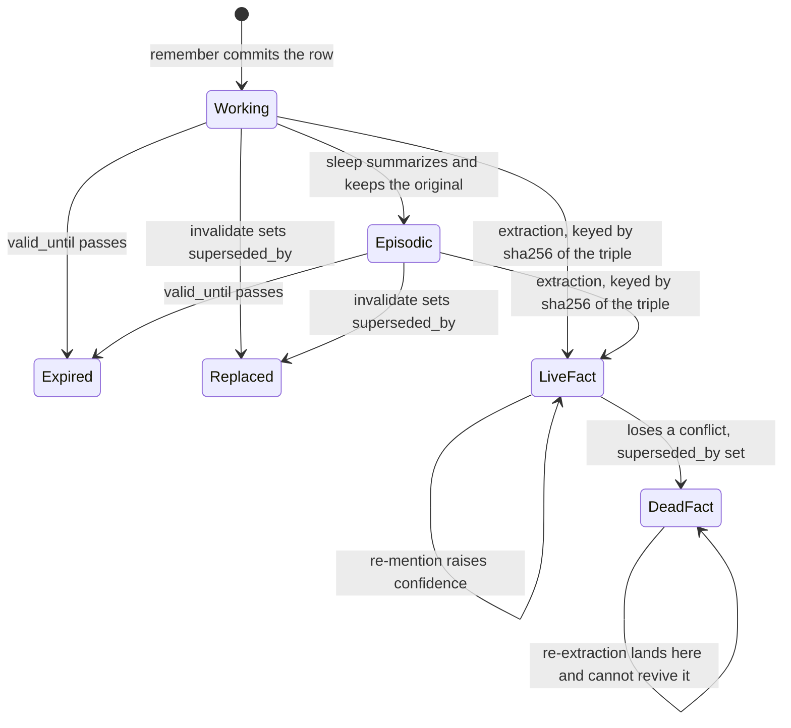

## 1. Executive Summary

Mnemosyne is a local-first memory engine for agents: 43,559 lines of Python
under `mnemosyne/`, MIT-licensed, 956 commits between 5 April 2026 and the
pinned commit of 6 August 2026, with one runtime dependency (`PyYAML`) and
everything else optional. It stores into a single SQLite file, retrieves with
sqlite-vec and FTS5 inside that same file, and exposes forty MCP tools plus a
Python SDK, a CLI, an OpenWebUI bridge, an OpenClaw provider and a first-party
plugin for the Hermes Agent. Its 160 test files run to 51,407 lines — more test
code than the atlas usually sees beside an engine this size — and CI runs them
on every push.

The atlas already carries its port. [Mnemopi](../mnemopi/) is described by its
own README as a Bun/TypeScript port of this engine, and the two share their
vocabulary: banks, veracity, polyphonic recall, SHMR, sleep. This is the Python
original, and it is the larger and stranger of the two.

**Its distinguishing mechanism is a tombstone that exists because a hash is the
primary key.** Extracted facts land in `consolidated_facts`, whose `id` is
`compute_fact_id` — a SHA-256 over NFC-normalized, length-prefixed
subject/predicate/object (`mnemosyne/core/veracity_consolidation.py:38`). When
two facts share a subject and predicate but differ on the object, the loser gets
`superseded_by` set. Every read filters `superseded_by IS NULL`. And the
dedup lookup at the top of `consolidate_fact` does **not**:

```python
cursor.execute("""
    SELECT * FROM consolidated_facts
    WHERE subject = ? AND predicate = ? AND object = ?
""", (subject, predicate, object))
```

So when an LLM re-extracts a fact that was already adjudicated as wrong, the
lookup finds the tombstoned row, bumps its `mention_count` and confidence, and
leaves `superseded_by` exactly where it was. The value is pinned by its own
content. Nothing in the tree ever sets `superseded_by` back to `NULL`. This is
the property the atlas's `tombstone` mark is for — a durable record of a
rejected value, keyed on the value, that later extraction cannot undo — arrived
at by an omitted `AND superseded_by IS NULL` rather than by design. No test
asserts it, and adding that clause during a tidy-up would silently remove the
guarantee. It is worth having and worth pinning.

**Its weakest mechanism is provenance, and it is weak twice over.** Every memory
row carries two independent origin labels. `veracity` is one of `stated`,
`inferred`, `tool`, `imported`, `unknown`, and multiplies the recall score
through `VERACITY_WEIGHTS`:

```python
VERACITY_WEIGHTS = {
    "stated": 1.0,
    "inferred": 0.7,
    "tool": 0.5,
    "imported": 0.6,
    "unknown": 0.8,
}
```

A memory whose origin is unknown outranks one the system knows came from a tool,
and one it knows was inferred. The atlas found this ordering in the Bun port and
it is the same table here, in the module whose docstring calls it *"Our novel
contribution"*. The honest move — labelling where a memory came from — costs it
standing.

The second field is worse. `trust_tier` holds `STATED`, `DERIVED`,
`EXTERNAL_WRITE` or `IMPORTED`, is derived from `source` by `TRUST_TIER_MAP`
(`mnemosyne/core/beam.py:152`), and is documented as *"Trust classification for
prompt-injection defense."* Two things are true about it at this commit. Its
fallbacks resolve upward: an unrecognized source returns `STATED`, an explicitly
supplied value outside the four-item enum is coerced to `STATED`, and the map's
own entry reads `"unknown": "STATED", # Unknown source, conservative default` —
the highest trust tier, called conservative. And nothing reads the column. Across
the whole tree, `trust_tier` appears in schema migrations, in the write
statements, in the sync column allowlist, and in test fixtures; it appears in no
WHERE clause, no score, and no filter. The injection defense is a label.

**And a compressor that rewrites memories has no caller.** `degrade_episodic`
walks episodic rows past 30 and 180 days and replaces `content` in place with an
LLM summary capped at 400 characters, then with a regex-extracted "key signal"
capped at 300 — destructively, with no column holding the original. It is
carefully built: each row's rewrite and embedding refresh share a `SAVEPOINT` so
content and vector cannot drift. It has five test files. It is reachable from no
CLI command, no MCP tool, no `sleep` cycle, and no scheduler in the repository.
Since nothing else writes `tier`, the `TIER2_WEIGHT = 0.5` and
`TIER3_WEIGHT = 0.25` recall multipliers are inert too. The lossy path is a
feature the shipped product does not have — which, given that the path is
irreversible, is a safer failure than the alternative.

Strongest, plainly: the write path is honest about being synchronous, `sleep`
consolidation is additive rather than destructive, the correction primitives are
enforced on the read path and tested, and
`tests/test_recall_precision_regressions.py` asserts what must *not* come back.

## 2. Mental Model

A memory begins as a row in `working_memory`: content, source, timestamp,
session, importance, a JSON metadata blob, a `veracity` label, a `trust_tier`
label, and optional `valid_until` and `scope`. It is a belief the moment it is
committed — there is no candidate state, no review queue, no admission gate. The
agent asserts, the store accepts.

From there it moves along three tracks at once, and they have different
epistemics.

**The row itself is append-and-annotate.** `sleep()` finds working rows older
than half the TTL, writes an episodic summary, and marks the sources
`consolidated_at` rather than deleting them — the docstring is explicit that
*"the source working_memory rows are NOT deleted"* and *"Originals remain
recallable alongside the new episodic summary."* A row dies in one of three
ways: `valid_until` passes, `superseded_by` is set, or something deletes it
outright. All three are honored on the read path; the recall queries carry
`(valid_until IS NULL OR valid_until > ?) AND superseded_by IS NULL`.

**The extracted facts are a separate epistemic layer with a real state
machine.** Regex extraction runs on every write and LLM extraction runs on
request; both feed `consolidated_facts`, keyed by the hash of the triple.
Confidence starts at `VERACITY_WEIGHTS[veracity] * 0.5` and climbs on each
re-mention via `bayesian_update` — `new = old + (1 - old) * weight * 0.3`, a
formula whose docstring states the intended `1 - 0.7^n` and then says it
approximates it. Mentions are not checked for independence, so a single source
repeating itself compounds toward 1.0 exactly as three sources agreeing would.
When two live facts share a subject and predicate with different objects, a row
lands in `conflicts`; `run_consolidation_pass` auto-resolves in favour of the
higher confidence once a fact has more than two mentions, and
`resolve_conflict_by_facts` writes `superseded_by` on the loser.

That last transition is where the system is at its best. A superseded fact is
excluded from every read, and — because the dedup lookup matches on the triple
without excluding superseded rows — a later extraction of the same value updates
the dead row instead of creating a live one. The rejection outlives the
re-assertion.

**The third track is annotation and never dies.** `AnnotationStore` is
explicitly append-only and multi-valued: mentions, facts, occurred-on dates and
sources accumulate against a memory id with no invalidation, because the
`TripleStore` it was split from auto-supersedes on `(subject, predicate)` and
that was wrong for sibling values. The docstring says so directly: *"No
invalidation. Append-only. Multi-valued by design."*

Control is agent-first with a human escape hatch. The model calls `remember`,
`recall`, `invalidate`, `forget`, `sleep`; a person gets a read-only web browser
(`PRAGMA query_only = 1`) and CLI commands. The `mnemosyne_validate` tool looks
like a review surface but is not one — its schema describes *"Agent identifier
performing the validation"* and *"any agent can validate any memory"*, and a
SQLite trigger trims each memory's validation history to the most recent three
entries. It is agents attesting to each other, with a three-deep memory of
having done so.



The inner loop is the mechanism worth reading twice. Every other arrow in this
diagram can be walked backwards by asserting the same thing again; that one
cannot.

## 3. Architecture

One process, one file, no services.

**Runtime shape.** Mnemosyne is a Python library first
(`from mnemosyne import remember, recall`), with four wrappers over the same
core: a CLI (`mnemosyne/cli.py`, 1,732 lines, 28 subcommands), an MCP server
over stdio or SSE (`mnemosyne/mcp_server.py`), a read-only web dashboard
(`mnemosyne/integrations/memory_browser.py`), and an optional HTTP sync server
(`mnemosyne/core/sync_server.py`). Nothing is required to be running for memory
to work.

**Persistence.** A single SQLite database, by default
`~/.hermes/mnemosyne/data/mnemosyne.db`, holding roughly thirty tables. The core
pair is `working_memory` and `episodic_memory`. Beside them sit `scratchpad`,
the `memoria_*` family (`facts`, `timelines`, `instructions`, `preferences`,
`kg`, `persona`) populated by always-on regex extraction, `consolidated_facts`
and `conflicts` for the veracity layer, `gists`/`facts`/`graph_edges` for the
episodic graph, `harmonic_beliefs` and `memory_resonance_log` for SHMR,
`canonical_facts` for single-slot identity, `annotations`, `memory_validations`,
`consolidation_log`, `hygiene_audit_log`, `query_cache`, `cost_entries`, and the
`sync_*` family. `triples` and `annotations` live in a separate `triples.db`.
Named banks (`mnemosyne/core/banks.py`) are separate database files under
`data/banks/<name>/`, which makes tenant isolation a filesystem property rather
than a query predicate.

**Search stack.** `vec_episodes` and `vec_working` are sqlite-vec virtual
tables; `fts_episodes`, `fts_working` and `fts_facts` are FTS5. Vector type is
probed at runtime — `_detect_vec_type` tries the configured `int8` or `bit`
type, falls back to `int8`, then to `float32`, each probe wrapped in a
`SAVEPOINT` so a failed `CREATE VIRTUAL TABLE` cannot roll back unrelated DDL.
When sqlite-vec is absent entirely, embeddings fall back to a
`memory_embeddings` blob table and `_in_memory_vec_search` does the cosine in
NumPy. `mnemosyne/core/binary_vectors.py` implements the information-theoretic
binarization the README advertises: 384 float32 dimensions to 48 bytes, Hamming
distance computed in SQLite.

**External dependencies.** `PyYAML` is the only required one. `fastembed` and
`sqlite-vec` come with `[embeddings]`; `ctransformers`, `llama-cpp-python` and
`huggingface-hub` with `[llm]`; `mcp` and `anyio` with `[mcp]`; `cryptography`
with `[sync]`. Embeddings can instead be fetched from any OpenAI-compatible
endpoint via `MNEMOSYNE_EMBEDDING_API_URL`, which is what makes the ~50 MB core
profile viable on a Raspberry Pi.

**Background processing.** There is none that runs on its own. `sleep`,
`sleep_all_sessions`, SHMR clustering, hygiene audit and clean, persona
promotion, reindexing and repair are all explicit calls — from the CLI, an MCP
tool, or the Hermes plugin's lifecycle hooks. The one pass designed to run
unattended, `degrade_episodic`, has no caller.

### Deployment and ergonomics

`pip install mnemosyne-memory` and one JSON block in an MCP client config. No
API key is required to store anything: with no embedding provider the system
degrades to FTS5 and importance ranking, which is a real degradation of recall
quality but not a failure. Everything is local and offline by default, and the
README's no-telemetry claim matches the tree.

The store is as repairable as SQLite is: readable columns, plain text content,
no opaque blobs except the vectors. That is backed by more tooling than most
systems here carry — `mnemosyne/doctor.py` (1,624 lines) diagnoses schema and
index drift, `mnemosyne/repair.py` (1,036 lines) repairs it, `mnemosyne/dr/`
holds disaster recovery, and `mnemosyne reindex`, `mnemosyne backup`,
`mnemosyne verify` and `mnemosyne migrate` are first-class commands.

The install surface is where the cost shows up. Seven optional-dependency
extras, ten configuration profiles in `mnemosyne/core/profiles.py`, and roughly
sixty environment variables mean two operators running "Mnemosyne" can be
running materially different retrieval. The vector type, the three scoring
weights, the recency half-life, cross-session scoping and every per-voice
ablation toggle are all environment-settable at import time.

## 4. Essential Implementation Paths

**Capture/write.** `mnemosyne/core/memory.py:357` (`Mnemosyne.remember`, the
public facade) into `mnemosyne/core/beam.py:3384` (`BeamMemory.remember`).
Veracity is clamped, `trust_tier` derived from source, exact-content duplicates
found by `_find_duplicate`, then one `INSERT` and an immediate `commit()`.
Everything after the commit is enrichment on the same thread.

**Extraction/consolidation.** Three extractors run from the write path.
`extract_and_store_facts` (`beam.py:4869`) is the always-on regex pass that
fills the `memoria_*` tables with no LLM cost. `_extract_and_store_entities` and
`_extract_and_store_facts` are opt-in per call. `_ingest_graph_and_veracity`
(`beam.py:3865`) extracts a gist and facts into the episodic graph and feeds
each fact to `VeracityConsolidator.consolidate_fact`. All three are wrapped in
bare `except: pass` — the comments say *"Graph failures are non-blocking"* and
*"Veracity failures are non-blocking"*, and the effect is that a memory can be
stored with none of its derived structure and no signal that this happened.

**Retrieval.** `BeamMemory.recall` (`beam.py:5640`) is a 1,266-line method:
query tokenization, hyphenation expansion, CJK and Cyrillic fallbacks, FTS5,
vector search over both tiers, MEMORIA structured routing by inferred ability,
fusion, veracity and tier multipliers, cross-tier dedup and sandwich ordering.
`recall_enhanced` (`beam.py:7036`) layers a query cache over it.
`_recall_polyphonic` (`beam.py:7469`) hands off to
`mnemosyne/core/polyphonic_recall.py` for the four-voice path.

**Context assembly.** `get_context` (`beam.py:4080`) returns the most recent
working rows for prompt injection, excluding consolidated ones unless
`MNEMOSYNE_CONTEXT_INCLUDE_CONSOLIDATED` is set. `format_context` and
`_sandwich_order` (`beam.py:7396`) place the highest-scoring results at the
beginning and end of the block.

**Update/delete/forget/conflict.** `invalidate` (`beam.py:4203`) sets
`valid_until` and optionally `superseded_by`, trying working memory then
episodic, and is scoped by `session_id = ? OR scope = 'global'`.
`forget_working` (`beam.py:4512`) deletes. `_detect_conflicts` (`beam.py:4233`)
compares embeddings at consolidation time above a 0.88 cosine threshold.
`VeracityConsolidator.resolve_conflict` and `resolve_conflict_by_facts`
(`veracity_consolidation.py:593`, `:831`) handle the fact layer.
`mnemosyne/core/hygiene.py` audits and cleans stored noise and secrets.

**Schema.** `init_beam` (`beam.py:594`) is 650 lines of `CREATE TABLE IF NOT
EXISTS` plus in-place `ALTER TABLE ... ADD COLUMN` migrations wrapped in
try/except, which is how the schema has absorbed a dozen versions without a
migration framework. `mnemosyne/migrations/e6_triplestore_split.py` is the one
real migration.

**MCP/API/SDK.** `mnemosyne/tool_schemas.py` holds forty schemas;
`mnemosyne/mcp_tools.py` (1,225 lines) holds the handlers;
`mnemosyne/mcp_server.py` serves them over stdio or SSE.
`mnemosyne/integrations/openclaw.py`, `openwebui_tool.py`,
`auto_save_openwebui.py` and the `integrations/hermes/` package wrap the same
core.

**Tests.** `tests/test_beam.py` covers the core;
`tests/test_recall_precision_regressions.py` pins retrieval precision including
negative cases; `tests/test_beam_e3_additive_sleep.py` pins the additive
consolidation contract; `tests/test_c25_deltasync_allowlist.py` pins what a sync
peer may not do; `tests/test_canonical.py` pins the single-slot identity
semantics.

## 5. Memory Data Model

**The two tiers.** `working_memory` and `episodic_memory` share most columns —
`id`, `content`, `source`, `timestamp`, `session_id`, `importance`,
`metadata_json`, `veracity`, `created_at` — with episodic adding `summary_of`,
`tier` and `degraded_at`, and both acquiring `valid_until`, `superseded_by`,
`scope`, `author_id`, `author_type`, `channel_id`, `memory_type`, `trust_tier`,
`pinned`, `consolidated_at`, `event_date` and `temporal_tags` through migration.

**Scoping** has three levels that do not compose. A `session_id` column with a
`scope = 'global'` escape is applied as a WHERE clause by
`_session_scope_filter` on every read path — a real enforced boundary, not a
tag. `MNEMOSYNE_CROSS_SESSION` collapses the filter to `(1=1)` globally. Banks
are separate files. `author_id`, `author_type` and `channel_id` record
multi-agent authorship but are filters the caller may pass, not boundaries the
system imposes.

**Provenance** is the two fields described in section 1, plus `source` as free
text and `sources_json` on consolidated facts. Three overlapping notions of
where a memory came from, one of which is scored, one of which is dead, and one
of which is a string.

**Temporal fields are genuinely bitemporal in two tables.** `triples` carries
`valid_from`, `valid_until` and `created_at`, and `TripleStore.add` accepts a
caller-supplied `valid_from` while `query(as_of=...)` filters
`valid_from <= as_of AND (valid_until IS NULL OR valid_until > as_of)`. So
"Maya was assigned to auth-migration from 15 January", recorded on 3 February,
stores both times and can be asked either question. `canonical_facts` does the
same for identity slots and adds the constraint that makes it a slot store:

```sql
CREATE UNIQUE INDEX IF NOT EXISTS idx_canonical_current
ON canonical_facts(owner_id, category, name) WHERE valid_until IS NULL
```

A partial unique index over the open rows only — exactly one current value per
slot, full history in the same table, and no migration needed to acquire the
guarantee. That is the cleanest single piece of schema design in the repository.

The `memoria_facts` table takes a third approach, versioning on message index
(`version_id`, `previous_value`, `valid_from_msg_idx`, `valid_to_msg_idx`) —
validity measured in conversation position rather than time.

**Separation of kinds** is by table and it is thorough: episodic rows, semantic
triples, consolidated facts, harmonic beliefs, canonical identity slots, persona
entries with a `permanent`/`long_term`/`working` tier check constraint, a
scratchpad, and annotations. The cost is that a reader must know which of six
stores holds the answer, and `recall` has to route across them.

## 6. Retrieval Mechanics

The default path is hybrid inside SQLite: 0.5 vector similarity, 0.3 FTS5 rank,
0.2 importance, all environment-tunable, with a recency decay on a 168-hour
half-life and an optional temporal boost around a supplied query time. Language
handling is more careful than most: CJK text without spaces falls back to
character n-gram LIKE search, Cyrillic to trigram scoring, and hyphenated tokens
are expanded into components with unit weights.

Above that sits MEMORIA routing. `_classify_ability` inspects the query and
dispatches to one of seven structured retrievers — fact, timeline, negation,
entity, chronological, instruction, preference — each hitting its own table.
This is where the BEAM per-ability scores in the README come from.

The polyphonic path (`mnemosyne/core/polyphonic_recall.py`) runs four voices —
vector, graph, fact, temporal — and fuses them with reciprocal rank fusion at
`RRF_K = 60`. The comment claims the constant is *"proven optimal for 4-voice
retrieval"*; 60 is the value from the original RRF paper and nothing in the
repository tests it against alternatives, so read that as inherited rather than
established. Per-voice ablation toggles exist as environment variables, which is
the right instrument for actually establishing it.

After fusion, scores are multiplied by `VERACITY_WEIGHTS[veracity]` and by the
tier weight — the first of which encodes the inverted provenance ordering
directly into the ranking, and the second of which is inert because nothing
writes a tier other than 1.

Retrieval is tool-mediated by default: the agent calls `mnemosyne_recall`.
Automatic injection exists only through the Hermes plugin's lifecycle hooks and
`get_context`.

Failure modes visible in the code: the query cache is invalidated on write
(the pinned commit is the fix for a stale-cache-after-`remember` bug), so
cross-process cache coherence rests on that one path; `_find_duplicate` matches
exact content only, so near-duplicates accumulate and the conflict detector has
to catch them at 0.88 cosine later; and `_minimum_recall_relevance` gates on
lexical overlap, which will drop a correct dense match phrased differently from
the query.

## 7. Write Mechanics

Writes are synchronous and unqueued. `remember` inserts, commits, then embeds
inline, runs temporal extraction, runs regex extraction, extracts a gist and
facts into the graph, consolidates each fact into the veracity layer, and
proactively links to related memories — all before returning. There is no
worker, no queue, and no deferred lag: a memory is FTS-retrievable the moment the
commit lands, and vector-retrievable a few tens of milliseconds later when the
inline `embed()` returns, in the same call.

That is an honest design for a local single-user store, and it means the cost is
visible. With a local `fastembed` model the write blocks on one embedding; with a
remote endpoint it blocks on a network round trip; with `extract=True` it blocks
on an LLM call. The regex extractor runs on every write regardless.

Deduplication is exact-content within a session. The dedup update refreshes
importance, timestamp, source and veracity, clears `consolidated_at` so the row
is eligible for a fresh summary, and — importantly —
`valid_until = COALESCE(?, valid_until)` preserves an existing expiry when the
caller passes none. Re-asserting a memory you previously invalidated does not
revive it. Since `_find_duplicate` filters on `session_id`, the same content
written from a different session is a new row with no expiry, so that refusal is
session-local.

Consolidation is additive. `sleep()` claims candidate rows by setting
`consolidated_at` *before* writing the summary, gated on the column still being
`NULL`, which makes concurrent sleeps and mid-crash restarts both safe at the
cost of a possible orphaned claim — a tradeoff the code names and accepts. The
originals stay recallable.

Noise and secrets are handled in two places: `mnemosyne/core/filters.py` has
write-time ignore patterns and `detect_secrets`, and
`mnemosyne/core/hygiene.py` retroactively audits and cleans what was written
before those filters existed or through paths that bypassed them, logging every
action to `hygiene_audit_log` with a 200-character preview of what it removed.

### Operational cost

Synchronous, no lag, no background pass over the corpus. `sleep` reads at most
`SLEEP_BATCH_SIZE` (5,000) working rows per call and summarizes them; its token
bill scales with unconsolidated volume, not with corpus size, and it only runs
when something calls it. SHMR clustering is bounded by batch size and iteration
count. Nothing re-reads the whole store.

On the read path, `get_context` returns a caller-set limit of recent rows
(default 10) and recall returns `top_k`, so injection is bounded by the caller.
Injected memory sits in the prompt where it will invalidate a prefix cache on
every turn whose recalled set changed, which is inherent to the pattern rather
than specific to this system.

## 8. Agent Integration

Forty MCP tools is a wide surface, and it is organized rather than sprawling:
core memory (`remember`, `recall`, `get`, `update`, `forget`, `invalidate`,
`validate`, `batch`), a shared multi-agent surface (`shared_remember`,
`shared_recall`, `shared_forget`, `shared_stats`), triples
(`triple_add`, `triple_end`, `triple_query`), canonical identity slots
(`remember_canonical`, `recall_canonical`, `forget_canonical`), scratchpad,
graph, persona (`promote`, `demote`, `list`, `reinforce`), hygiene
(`audit`, `clean`), sync, export/import and diagnose.

The model has near-total agency. It can write, correct, invalidate, delete,
attest to another agent's memory, promote content into the persona tier, and run
consolidation and hygiene passes. The only thing it cannot do is clear a
supersession.

`mnemosyne_remember_canonical` deserves separate mention as an integration
affordance: it gives the agent a way to say "this is *the* value for this slot"
rather than "here is another memory", and the partial unique index enforces it.
Systems in this atlas that lack that distinction accumulate five contradictory
statements of a user's name and rank them.

Adapting to another agent framework is genuinely cheap — the OpenWebUI bridge is
described as a one-line file, the OpenClaw integration is one config entry, and
`hermes_memory_provider/` is a full worked example of a provider. The repository
publishes an integration template, which is unusual and useful.

The Hermes relationship is worth naming: the default data directory is
`~/.hermes/mnemosyne/data`, `HERMES_HOME` is read before any Mnemosyne variable,
and the plugin ships enabled. Mnemosyne is universal by API and Hermes-first by
default path.

## 9. Reliability, Safety, and Trust

**Provenance** is recorded and mostly not acted on, as section 1 details. The
one place it bites is recall scoring, and there it bites the wrong way round.

**Prompt-injection defense** is the field named for it, and it is unread. In
practice a memory written by an MCP tool call from a model that just read a
hostile web page is stored with `trust_tier = 'EXTERNAL_WRITE'`, and is then
retrieved, ranked and injected identically to something the user typed. The one
real mitigation is `get_contaminated`, which surfaces every memory whose
veracity is not `stated` for review — a useful triage list, exposed through
`mnemosyne diagnose`, that nothing consults automatically.

**Uncertainty representation** is partial. Confidence is a float on facts,
triples and beliefs; a discrete epistemic status is absent. A fact is live or
superseded, and "we saw this once and do not believe it yet" is expressible only
as a low number.

**Concurrency** is handled with more care than the size of the codebase would
suggest. `_serialized_write` wraps the consolidator's four write methods in
`BEGIN IMMEDIATE` plus an instance `RLock`; `resolve_conflict` has a
first-writer-wins guard so two callers cannot mark both facts superseded;
`sleep` claims atomically. Three test files exist solely for consolidator races.
The docstrings name the pre-fix failure in each case, which makes the reasoning
auditable.

**Data loss risks.** The bare `except: pass` around graph and veracity ingestion
means derived structure can silently fail to appear. `degrade_episodic` would
destroy original content irrecoverably if anything called it. `hygiene clean`
deletes, and its audit log keeps only a 200-character preview. The
`memory_validations` trigger discards all but the three most recent validations
per memory.

**Sync and multi-tenancy** is where the security work concentrates. Payloads can
be client-side encrypted with Fernet or PyNaCl SecretBox before transmission;
the server sees event ids, timestamps, operation types and device ids.
`test_c25_deltasync_allowlist.py` pins that a peer cannot re-route a row to
another session, cannot set `superseded_by` on a row it does not own, and cannot
write outside an allowlisted column set — an unusually specific threat model for
a personal memory tool. The sync server supports API-key or HS256-JWT bearer
auth plus an HMAC over the request body, refuses CORS deliberately, and reads
secrets from files rather than argv when asked. But `_check_auth` returns
`True` when neither credential is configured, so an operator who binds to a
non-loopback address without setting one is serving an open memory store; the
default bind is `127.0.0.1` and `--behind-tls-proxy` is required for cleartext
elsewhere, which are the right guards, but the unauthenticated case is a
configuration away rather than a refusal.

**Backup** is `mnemosyne backup`, `restore`, `verify`, `backups list`, plus
JSON export/import and importers for Mem0, Zep, Letta, Honcho, Cognee,
Supermemory, Hindsight, Holographic and agentic formats. Migrating *into*
Mnemosyne is a first-class supported path from nine other systems, which is more
migration surface than any other system in this atlas offers.

## 10. Tests, Evals, and Benchmarks

160 test files and 51,407 lines, run in CI on every push against a matrix that
includes a no-optional-dependencies configuration. Coverage is behavioral rather
than nominal: tests exist for the additive-sleep contract, cross-tier dedup,
vector/content alignment after degradation, embedding dimension guards, multiple
consolidator race conditions, CLI failure modes, sync correctness and security,
scope defaults, multilingual recall, and the doctor and repair paths.

`tests/test_recall_precision_regressions.py` is the one that earns the atlas's
`negative_eval` mark. It stores six realistic memories and asserts both what the
top result must be for fifteen natural-language queries and what must *not*
appear — `assertNotIn("orchid care dashboard", joined)`,
`assertNotIn("public release notes", joined)`. Committed cases asserting that
particular material stays out of a result set are rare in this corpus, and they
are the only test shape that catches a ranking change by regression rather than
by someone noticing.

**On the benchmark claims, the README is unusually careful about its own
numbers.** It states plainly that BEAM figures were measured on v3.0.0 in May
2026 and *"predate polyphonic recall, enhanced recall, SHMR, and the persona
tier"* and *"have not been re-run since"*. It notes that its LongMemEval metric
is Recall@All@5 while a competitor's is Recall@5 and that *"the ordering should
not be read as a strict ranking"*. It flags that its BEAM run used a different
judge model than the competitor it is being compared against, and concludes
*"Hindsight leads on this benchmark as published"*. It says the 20% Recall@10 is
low and that *"the flatness rather than the level is the result worth citing"*.

Conceding the comparison to a competitor in your own README table is the
behaviour this atlas's [benchmarks page](../../benchmarks/) keeps asking for and
almost never finds. The measurement discipline is not at the level of
[Perseus Vault](../perseus-vault/), which commits per-run artifacts that
recompute to the published mean — here `_benchmarks/` holds the harnesses and
`docs/beam-benchmark.md` the write-up, and nothing at this commit lets a reader
recompute 65.2% from committed outputs. But the labelling discipline around what
the numbers do and do not support is real, and it is stated where a reader will
actually hit it.

**What is missing.** No test asserts the tombstone property — that re-extracting
a superseded fact leaves it superseded — which is the single most valuable
behaviour in the system and the one most likely to be removed by a
well-intentioned cleanup. No test asserts that `trust_tier` affects anything,
which is consistent with it affecting nothing. And the `1 - 0.7^n` confidence
claim in the docstring is not checked against the implemented increment.

## 11. For Your Own Build

### Steal

**Key a fact table by the hash of the fact.** `compute_fact_id` builds a
SHA-256 over length-prefixed, NFC-normalized components, and the docstring works
through why each part is there: truncation collided, `\x1f` in a component let
two distinct triples produce one id, and NFC makes `café` and `café` agree.
Getting a deterministic content-addressed id right is a solved problem that gets
re-solved badly; this is the version to copy. The payoff beyond dedup is that a
rejection recorded against that id is a rejection of the *value*.

**Make the dedup lookup ignore the rejection flag, on purpose.** If a re-write
of a rejected value finds the tombstone and updates it, the rejection is
permanent for free. If it filters the flag out and inserts a fresh row, every
tombstone is one re-extraction away from being undone. Whichever you choose,
write the test — this system has the good behaviour and no test holding it in
place.

**A partial unique index is how you get one current value and full history in
one table.** `WHERE valid_until IS NULL` on a unique index over
`(owner_id, category, name)` costs one line, needs no migration to adopt, and
removes a whole class of "which of these five is the user's actual name"
retrieval bug.

**Claim the row before you do the expensive work.** `sleep` marks
`consolidated_at` gated on it still being `NULL`, then summarizes. Concurrent
workers and crash-restarts both fall out of that ordering, and the worst case is
a claimed row with no summary rather than a duplicate.

**Write the pre-fix failure into the docstring.** The concurrency comments here
name what raced, what the symptom was, and which review caught it. That is what
makes a subtle invariant survive its author.

### Avoid

**Do not give an unlabelled origin a high trust weight.** Both provenance fields
here resolve unknown upward — `unknown: 0.8` above `tool: 0.5`, and an
unrecognized source mapping to `STATED`. The intent is charitable (do not punish
legacy rows that predate the field), and the effect is a gradient that rewards
not labelling. If a neutral prior for old rows is what you want, backfill the old
rows and make the default the *lowest* tier, so the incentive points at
labelling honestly.

**Do not ship a trust field nothing reads.** A column named for
prompt-injection defense, populated on every write, documented in the API, and
absent from every WHERE clause is worse than no column: it reads to a reviewer
like the defense exists.

**Do not leave a destructive pass wired to nothing.** Code that rewrites stored
content in place, with tests and configuration and no caller, is either a feature
or a hazard depending on which commit adds the scheduler. If it is not ready,
that should be visible from the outside.

**Do not swallow enrichment failures silently.** `except: pass` around graph and
fact extraction means a store can quietly contain memories with no derived
structure, and the retrieval quality drop shows up as "recall got worse" months
later. Count the failures, at minimum.

### Fit

This is a maximalist single-file system, and the fit question is whether you want
that. Six memory stores, forty tools, sixty environment variables and ten
profiles buy you a system that runs on a Raspberry Pi with no services, imports
from nine competitors, survives having no optional dependencies installed, and
ships a doctor that can tell you what is wrong with the database. The
same breadth means the retrieval behaviour of any two installations is a
configuration question, and that a reader has to hold six stores in their head to
predict what `recall` returns.

Take it if you want local, private, agent-controlled memory in one file with no
operational footprint, and you are comfortable pinning your configuration and
treating the defaults as a starting point rather than a design. Take it
especially if you are migrating off a hosted memory service — the importer
coverage here is the best exit path in the corpus.

Walk away if you need memory whose trust decisions you can reason about. The
provenance model is two fields, one scored backwards and one inert, and no
discrete epistemic state anywhere. A team that needs to answer "why did the agent
believe that" will be reconstructing it from a float. Walk away too if you need a
scheduled forgetting or compaction story — the design has one, and it is not
connected.

## 12. Open Questions

- Is the superseded-fact behaviour intended? The missing `superseded_by`
  filter in the dedup lookup produces the atlas's best-defined correction
  primitive, and no comment or test claims it. Asking the maintainers is the
  only way to know whether it is a design or a happy omission.
- Why does `degrade_episodic` have no caller? Tests, config, profile entries and
  documentation all treat tiered degradation as a live feature. Reading the PR
  history would show whether the scheduler was removed, never landed, or is
  expected to come from the Hermes plugin.
- Does anything downstream consume `trust_tier`? It is allowlisted for sync and
  present in the schema, so a consumer may exist outside this repository —
  in the Hermes Agent itself, most plausibly.
- What do the current BEAM and LongMemEval numbers look like? The README says
  the published figures predate four subsystems and have not been re-run. Only
  running the harness would answer it, and this reading did not run anything.
- Do the per-voice ablation toggles show that four voices beat two? The
  instrument is built; no committed result uses it.
- How much does the always-on regex extraction cost on a large write volume? It
  runs on every `remember` and populates six tables, and nothing here measures
  it.

## Appendix: File Index

**Storage and schema**
- `mnemosyne/core/beam.py:594` — `init_beam`, the full schema and its in-place migrations
- `mnemosyne/core/banks.py` — per-bank database files
- `mnemosyne/core/canonical.py` — canonical fact slots and the partial unique index
- `mnemosyne/core/triples.py` — bitemporal triple store
- `mnemosyne/core/annotations.py` — append-only multi-valued annotations
- `mnemosyne/core/binary_vectors.py` — MIB binarization
- `mnemosyne/migrations/e6_triplestore_split.py`

**Write path**
- `mnemosyne/core/memory.py:357` — public `Mnemosyne.remember`
- `mnemosyne/core/beam.py:3384` — `BeamMemory.remember`
- `mnemosyne/core/beam.py:3865` — `_ingest_graph_and_veracity`
- `mnemosyne/core/beam.py:4869` — always-on MEMORIA regex extraction
- `mnemosyne/core/veracity_consolidation.py:445` — `consolidate_fact`
- `mnemosyne/core/filters.py` — write-time noise and secret patterns

**Retrieval path**
- `mnemosyne/core/beam.py:5640` — `recall`
- `mnemosyne/core/beam.py:7036` — `recall_enhanced`
- `mnemosyne/core/polyphonic_recall.py` — four voices and RRF
- `mnemosyne/core/shmr.py` — harmonic belief clustering
- `mnemosyne/core/episodic_graph.py` — gists, facts, edges
- `mnemosyne/core/query_cache.py`

**Context assembly**
- `mnemosyne/core/beam.py:4080` — `get_context`
- `mnemosyne/core/beam.py:7396` — `_sandwich_order` and `format_context`
- `mnemosyne/core/persona.py` — persona tier extraction and `persona.md` rendering

**Correction and maintenance**
- `mnemosyne/core/beam.py:4203` — `invalidate`
- `mnemosyne/core/beam.py:8163` — `degrade_episodic`, the uncalled compressor
- `mnemosyne/core/beam.py:8504` — `sleep`
- `mnemosyne/core/hygiene.py` — noise audit, cleanup, `hygiene_audit_log`
- `mnemosyne/doctor.py`, `mnemosyne/repair.py`, `mnemosyne/dr/recovery.py`

**MCP, API, SDK**
- `mnemosyne/tool_schemas.py` — forty tool schemas
- `mnemosyne/mcp_tools.py` — handlers, including `mnemosyne_validate`
- `mnemosyne/mcp_server.py`, `mnemosyne/cli.py`
- `mnemosyne/integrations/openclaw.py`, `openwebui_tool.py`, `memory_browser.py`
- `mnemosyne/core/importers/` — nine external-system importers

**Sync**
- `mnemosyne/core/sync.py`, `mnemosyne/core/sync_server.py`

**Tests and benchmarks**
- `tests/test_recall_precision_regressions.py` — positive and negative retrieval cases
- `tests/test_beam_e3_additive_sleep.py` — the additive consolidation contract
- `tests/test_c25_deltasync_allowlist.py` — sync peer threat model
- `tests/test_canonical.py`, `tests/test_degrade_vector.py`,
  `tests/test_consolidate_fact_sibling_races.py`
- `_benchmarks/`, `docs/beam-benchmark.md`

## History

**2026-08-06** — [`bd22c0896b9726eb951a100a5015e04ae8769c01`](https://github.com/mnemosyne-oss/mnemosyne/commit/bd22c0896b9726eb951a100a5015e04ae8769c01) — first reading. Screened before
reading: committed `.githooks/`, a `setup.py` and a `tests/conftest.py` that
execute at install and collection time, and a `pyproject.toml` modified within
the seven-day dependency cooldown. Nothing was installed, built or run from the
tree; every claim here is from source at this commit.
