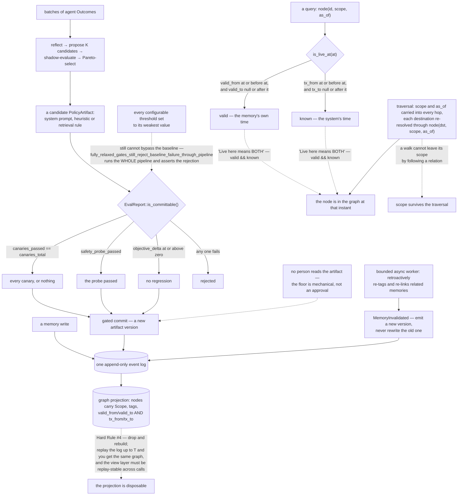

## 1. Executive Summary

mnesio is "[l]ong-term memory for AI agents that learns from outcomes, with a
safety gate before every improvement" — Apache-2.0, Rust, 58,766 lines across
152 files in twenty crates, reachable over HTTP, MCP, Python and Node.

Its claim is procedural rather than factual: it "turns real outcomes into
improved, versioned policies: prompts, heuristics, and retrieval rules", so the
agent "get[s] *better at doing things* over time, rather than only remembering
more facts." Two loops run over one append-only event log — a compiler that
batches outcomes into candidate `PolicyArtifact`s, and an evolution worker that
retroactively re-tags and re-links memories on write.

**The mechanism to take away is a gate defined as a floor rather than as a
policy.**

> "**Hard Rule #1: Nothing procedural commits without passing
> `EvalReport::is_committable()`** — canaries 100%, safety probe passing,
> objective Δ ≥ 0. … Mechanically enforced — setting every configurable gate
> threshold to its weakest value *still* cannot bypass the baseline. Held by a
> dedicated integration test on every commit."

The function is three conjoined conditions and nothing else. The claim about
configuration is the part that usually goes unbacked, and here it is a committed
test —
`fully_relaxed_gates_still_reject_baseline_failure_through_pipeline` — which
relaxes the gates and runs the whole compile pipeline, asserting the rejection
anyway. Beside it, unit tests trip each condition in isolation with messages
naming the invariant that broke: "missing canary trips baseline", "failed probe
trips baseline", "negative delta trips baseline". This atlas keeps finding
systems whose safety gate is a threshold somebody can widen until it admits
anything; this one has something underneath the thresholds.

**The graph is bitemporal and says why.** A node carries `valid_from`/`valid_to`
from the memory's own time, and `tx_from`/`tx_to` from the system's, and
`is_live_at` requires both: "'Live' here means both: the memory was valid at
`at` *and* the system hadn't tombstoned it before `at` (transaction time)." The
second axis exists for a stated failure — "[m]emory evolution invalidates the
previous version and emits a new one … [a] flat 'current' graph would lose that
lineage the moment the worker fires" — and ties into a replay invariant the view
layer also holds: "[r]eplay the log up to `T` and you'd get the same graph."

**Scope travels with the instant.** Each node carries its `Scope` inline "so
traversals can scope-filter without a join", and `scope: &Scope` is a required
argument at every step — including the re-resolution of each hop's destination,
so a walk cannot leave its scope by following a relation.

**What is missing is a person.** `is_committable` is mechanical, and a policy
artifact that clears it activates without anyone reading it. For a system whose
subject is an agent rewriting its own behaviour, that is the interesting
frontier rather than an oversight — and it is the reason the review mark is
absent.

## 2. Mental Model

An **outcome** is evidence; a **policy artifact** is what the compiler proposes from it.

A **gate** is a floor, not a setting.

A **node** is live only when both clocks agree.

A **projection** can be dropped, because the log cannot.

## 3. Architecture

| Area | Role |
| --- | --- |
| `crates/mnesio-core/src/event.rs` | The event vocabulary, and `is_committable` |
| `crates/mnesio-procedural/` | The reflective compiler, the gates, and their tests |
| `crates/mnesio-graph/` | The bitemporal projection, scope-carrying traversal |
| `crates/mnesio-privacy/` | Redaction and the crypto-shredding keyring |
| `crates/mnesio-provenance/` | Point-in-time snapshots of what was believed |
| `crates/mnesio-server`, `-mcp`, `-py` | HTTP, MCP and Python surfaces |

## 4. Essential Implementation Paths

`crates/mnesio-core/src/event.rs:215-219` — the whole floor, in four lines.

`crates/mnesio-procedural/tests/compile_e2e.rs:237` — the test that makes the
configuration claim checkable.

`crates/mnesio-graph/src/record.rs:118-146` — two intervals and a liveness test
that needs both.

`crates/mnesio-graph/src/lib.rs:14-26` — why a flat current graph was not
enough, and why scope sits inline.

`crates/mnesio-graph/src/traversal.rs:48-79` — scope and instant carried into
every hop.

## 5. Memory Data Model

Memory nodes in a property graph, each with a scope, tags, keywords, an optional
source reference, an evolution count and two time intervals; edges keyed on
source, relation, destination and transaction start. Beside the graph, versioned
policy artifacts with their evaluation reports. Both are projections of one
append-only log.

## 6. Retrieval Mechanics

Lexical, vector and graph traversal, with the scope and the as-of instant
threaded through every step rather than applied at the boundary, and each hop's
destination re-resolved under the same pair.

## 7. Write Mechanics

A memory write appends an event and wakes a bounded worker that re-tags and
re-links neighbours. A procedural improvement never writes directly: it is
proposed, shadow-evaluated, Pareto-selected and then either committed through
the gate or rejected.

## 8. Agent Integration

An HTTP service, an MCP server, Python bindings, a Node SDK, and a `mnesio-code`
CLI that maps a codebase with no server. The installer "verifies a SHA-256,
refuses to overwrite a different tool of the same name, and does not touch your
shell profile."

## 9. Reliability, Safety, and Trust

The gate floor and its test are the strongest part, with the bitemporal liveness
rule and the replay invariant behind them. The weaker parts are that the
evaluation behind the gate rests on canaries and an objective nobody has pinned
to a corpus, that crypto-shredding leaves nothing keyed on the erased value, and
that no person is consulted before a rewritten policy takes effect.

## 10. Tests, Evals, and Benchmarks

Unit tests that trip each baseline condition separately with a message naming
it, an end-to-end suite covering the diversity gate, canary failure and the
empty-reflection case, and the relaxed-gates test that holds the README's
strongest claim. A benchmarks document sits beside three competitive-analysis
files.

## 11. For Your Own Build

Put a floor under your thresholds. A gate that is only a set of configurable
numbers can be widened until it admits anything, and the difference between a
floor and a default is one test that relaxes everything and still expects a
refusal.

Make liveness require both clocks. `valid && known` is four words, and it is the
difference between "was true then" and "we knew it then".

Carry the scope into the hop, not just into the query. A traversal that checks
scope once and then follows edges is a traversal that leaves its scope.

Let your projection be disposable. If the graph can be dropped and rebuilt from
the log, the log is where correctness has to live — which is where it is easiest
to keep.

## 12. Open Questions

Whether a person belongs before a policy activates. The floor is mechanical and
well-defended; what it cannot judge is whether a prompt rewrite that improves
the objective is one the operator would have wanted, and the system's own
subject matter makes that the live question.

Whether the canary set and the objective should be pinned the way the gate is.
The gate's strength is that a configuration cannot weaken it; the evaluation
feeding it has no equivalent guard, so a thinned canary set weakens the same
floor from the other side.

## Appendix: File Index

| Path | What to read it for |
| --- | --- |
| `crates/mnesio-core/src/event.rs:215-219` | A safety floor small enough to read in one glance |
| `crates/mnesio-procedural/tests/compile_e2e.rs:237` | Relax every threshold, expect the refusal anyway |
| `crates/mnesio-graph/src/record.rs:138-146` | Liveness as the conjunction of two clocks |
| `crates/mnesio-graph/src/traversal.rs:56-79` | Scope re-resolved at every hop |

## History

**2026-09-16** — [`5831aa0ea0a359b44a3a28b64e7e9f7174d88970`](https://github.com/mnesio/mnesio/commit/5831aa0ea0a359b44a3a28b64e7e9f7174d88970) — first reading, at a commit dated 13 September 2026. Screened before opening, from a shallow clone: one auto-run surface, three build-time execution points, three unpinned dependency surfaces and twenty-five dependency files inside the seven-day cooldown. Nothing was installed, built or run; the install script was read but not executed, and no benchmark or evaluation was reproduced.
