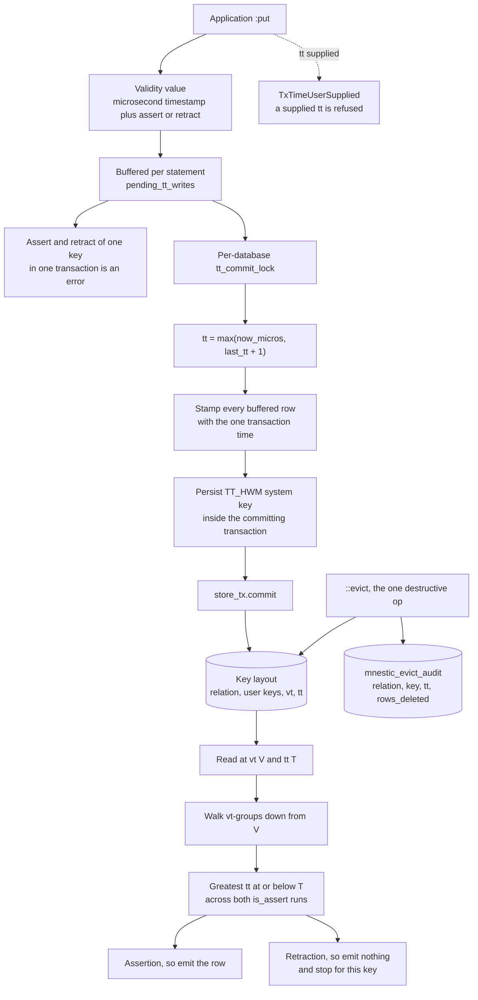

## 1. Executive Summary

mnestic is a hard fork of CozoDB — the transactional relational-graph-vector
database with a Datalog query language — maintained independently *as a
substrate for agentic memory*. It is MPL-2.0, 125,343 lines of Rust with 96,113
in `cozo-core`, forked at upstream `481af05` (2024-12-04, the last commit before
upstream went dormant) and 282 commits ahead of it across 281 files, at
`cozo-core` version 0.18.0.

The provenance handling is worth naming before the engineering. `FORK.md` states
that the fork is not the official project, is not endorsed by the original
authors, claims neither the name nor the package identities, and — citing
MPL-2.0 §2.3 on trademarks and §3.4 on preserved notices — operates under its own
name with upstream's per-file copyright notices intact. The complete upstream
history is retained in the repository.

Three marks. The headline is `bitemporal`, and it is the real thing rather than
two date columns. Upstream Cozo already had **valid time**: when a fact is true
in the modelled world, user-settable into the past and the future, as a trailing
key column. What the fork adds is **transaction time** — when the database
learned it — as a second trailing key component that the engine stamps at commit
and *refuses* to accept from a caller:

```
TxTime is engine-assigned at commit and cannot be supplied: got {0:?}
  help: omit the TxTime column from writes; the engine stamps it with the
        transaction's commit time
```

That refusal is what separates a bitemporal store from a schema with two
timestamps in it. A belief axis a caller can write is a belief axis a caller can
forge, and the whole value of the question — *what did we believe on Tuesday,
before the correction* — depends on nobody being able to answer it retroactively.

`audit_log` is earned on a narrow and well-chosen surface, and `negative_eval` on
as-of reads asserted to return nothing with the positive control alongside them —
a discipline this project has particular reason to hold, for reasons section 9
gets to.

## 2. Mental Model

Two axes, and the engine is careful about which one belongs to whom.

**Valid time is yours.** A `Validity` value is a microsecond timestamp plus an
assert/retract flag, written by the application, freely into the past or the
future. It says when a fact holds in the world. A retraction is not a delete: it
is a new row saying the fact ceased to hold at that moment.

**Transaction time is the engine's.** A `TxTime` column is stamped at commit from
a clock the application cannot reach. It says when the database came to believe
what it believed.

The key layout is `[relation][k1]…[k_{n-1}][vt][tt]`, and the ordering choice is
argued rather than assumed: vt outer, tt inner, because the overwhelmingly common
query — current belief about the current world — then seeks once to
`(key, now, tt-max)` and the first row is the answer, exactly as it costs today.
tt-outer would have made the ordinary query span every belief epoch.

Reading is a two-level walk. For each logical key, descend valid-time groups from
V; within a group, take the record with the greatest tt ≤ T. An assertion is the
answer; a retraction means the key was believed deleted, so nothing is emitted
and older valid-time groups do *not* shine through; a group whose every belief was
recorded after T falls through to the next.

## 3. Architecture



## 4. Essential Implementation Paths

- **Declare.** `ColType::TxTime` is a grammar keyword
  (`cozoscript.pest:264`), and `:create` validation rejects ten distinct
  malformations: tt on a transaction-temp relation (no commit clock), tt as a
  value column, more than one tt, a nullable tt, more than one Validity beside a
  tt, a nullable Validity beside a tt, tt not last, Validity not immediately
  before tt, and so on — each with a `help` line printing the corrected
  declaration (`cozo-core/src/runtime/relation.rs:392-510`). The spec records
  that upstream had *no* `:create`-time enforcement of its single axis at all, so
  a relation with a non-trailing Validity column was legal and simply could not
  be time-travelled.
- **Buffer.** Writes to a tt relation are collected per statement rather than
  written immediately, because every row of one transaction must share one
  timestamp (`runtime/transact.rs:49-56`, `:104-112`).
- **Commit.** `commit_tx_inner` routes any transaction with buffered tt writes —
  or a burned tt — through `commit_tx_with_tt`, which takes the per-database
  lock, advances the clock, stamps the buffered rows, writes the high-water mark
  with `put_externally_serialized`, and commits (`:303-316`, `:362-388`). The
  mutex is the serialisation authority for that key, so RocksDB is told not to
  snapshot-validate it — otherwise two overlapping tt commits would abort the
  later one.
- **Refuse the unbreakable tie.** Before stamping, the pending writes are scanned
  for an assert and a retract of one logical key in one transaction. Both rows
  would carry the same tt, leaving resolution with no way to order them, so the
  transaction is rejected with `eval::txtime_assert_retract_conflict` and the
  advice to split it in two (`:388-430`).
- **Read.** `@ (vt: V, tt: T)` attaches inside the relation's braces
  (`cozoscript.pest:100-101`, where `validity_clause` is the last element before
  the closing bracket), and `:as_of` pins a whole query (`:182`).

## 5. Memory Data Model

The unit is a tuple in a stored relation. What the fork changes is the key tail:

| Piece | Axis | Set by | Behaviour |
|---|---|---|---|
| `Validity { timestamp: ValidityTs(Reverse<i64>), is_assert: Reverse<bool> }` | valid time | the application | newest-first, assert before retract at equal timestamp; settable into past or future |
| `ColType::TxTime` | transaction time | the engine, at commit | never settable; nullable is rejected at `:create` |

The `Reverse` wrappers are the reason an as-of read is a seek rather than a scan:
versions of one logical key are contiguous and descending, so "the newest version
at or before T" is the first row past a seek.

There is no status column and the fork does not add one, which is why
`trust_state` is withheld. The assert/retract flag looks like a candidate and is
not one: the spec is explicit that a valid-time retraction means *the fact ceased
to hold at V*, a statement about the world, not *we no longer believe this* — and
the belief dimension is the transaction-time axis itself, which is what the
bitemporal mark is for. Reading the flag as an epistemic status would double-count
the same mechanism.

`tombstone` is withheld for the atlas's usual reason. A retraction is keyed on the
logical key and its valid time, not on the value, so writing the same content
again produces a fresh live row rather than meeting a record of its own earlier
rejection.

## 6. Retrieval Mechanics

The resolution rule is stated in the spec and implemented to match, and the
subtle part is the group boundary. A valid-time group is *all records of a key
sharing a valid-time timestamp, regardless of the assert flag* — which matters
because the encoding puts the assert run and the retract run in two contiguous
stretches. Resolution has to take the greatest tt ≤ T across both runs. The spec
says what happens if it does not:

> If resolution instead examined only the first (assert) run, a later-recorded
> cessation `(vt=V, retract)` at higher tt would be silently shadowed by the
> older assert — a wrong answer on the most ordinary correction there is.

That exact case is a committed test, and it is the one that would have been easy
to ship broken: write an assert at vt=100, then a retraction at vt=100 in a later
transaction, query at vt=100, and require zero rows with the message *"the later
cessation must win across the is_assert-run boundary"*. Then the mirror — retract
first, assert second — and require the asserted row
(`runtime/tests.rs:2946-2976`).

The correction vocabulary is worked out in a table in the spec rather than left
for users to derive: a **value correction** re-asserts at the same valid time and
a higher tt; a **cessation** writes a retraction; an **existence repudiation** —
"the March assertion should never have existed" — cannot be expressed as a
retraction, because that means cessation and never falls through to the
predecessor. The idiom is to copy the predecessor's value forward, and the spec
names the limit it accepts rather than papering over it: the copy is a snapshot,
not a reference, so if January's value is itself later corrected, the copied March
row keeps answering the old number until the application copies again. A
group-repudiation marker would compose properly; v1 does not build it, and the
encoding reserves the byte that would make it additive later.

## 7. Write Mechanics

Everything is an append. The interesting mechanism is the clock, because a
transaction-time axis is only as good as the monotonicity of the thing stamping
it.

`tt = max(physical_now_µs, last_tt + 1)` — wall-clock-meaningful so the values
mean something to a human, and strictly monotonic so two commits inside one
microsecond, or a backward step of the system clock, cannot collide or invert. An
in-process atomic is the authority; a system key mirroring upstream's
`STORAGE_VERSION` idiom persists the high-water mark **inside the committing
transaction**, so a crash cannot leave the persisted mark behind a tt that
actually committed. Values advanced by transactions that later abort are simply
burned. The lock is held across the commit, not merely across the allocation,
because a transaction that burned a tt outside the buffered-write path still has
to get its mark persisted before an overlapping commit can write a lower one.

Two doc comments have not kept up with the code. `tt_clock.rs` still says *"No
user-visible surface yet: nothing in the write path calls this until step 3
(schema opt-in + stamping) lands"*, and `commit_tx_with_tt` repeats it — *"Nothing
calls this in production yet"*. Step 3 landed: `commit_tx_inner` routes every
qualifying commit through that function, under a comment of its own saying
*"Every call site inherits this automatically."* The spec header records the
feature as shipped in 0.10.0 on 2026-07-04. Nothing is wrong with the code; two
sentences describe a future that has arrived, in the two files a reader checking
whether bitemporality is real would open first.

## 8. Agent Integration

This is an engine, not an agent framework: Rust plus bindings for C, Java,
Node.js, Python, Swift and WebAssembly, a server binary, and Python integration
packages for LangChain, LangGraph, LlamaIndex and MCP, all renamed off the
upstream identities. Scope, identity and tenancy are absent by design and belong
to whatever is built above.

What makes it an agent-memory substrate rather than a general database is the
question the transaction axis answers, which the spec frames in exactly the terms
this corpus keeps running into: reproducing a past query result, auditing belief
changes, and distinguishing a real-world change from a correction — *"'Salary
became 120 in March' (vt change) vs 'we were wrong; it was always 120' (tt
correction) are different facts; single-axis storage conflates them."*

## 9. Reliability, Safety, and Trust

The best thing in this repository is a bug report about itself.

Release 0.12.2 is titled *"the validity float channel (a silent temporal
corruption)"*. Validity timestamps are integer microseconds; `now()` and
`parse_timestamp()` return float seconds; and the shared accessor coerced any
whole-numbered float to an integer without complaint. A `:put` of
`[parse_timestamp('2024-06-01T00:00:00Z'), true]` therefore **succeeded** and
stamped the row at 1970-01-01T00:28:37Z. The changelog names both halves of why
that is the worst possible failure for this particular database:

> The row reads back correctly on an ordinary query; the damage is visible only
> under time travel, which is precisely where a bitemporal database is supposed
> to be trustworthy.

And on the read side, `@ parse_timestamp(…)` *"returned zero rows and no error,
because the misread always lands before any row was asserted — indistinguishable
from 'no data yet'."*

The attribution is the part worth copying. Four call sites shared the bug; three
are byte-identical upstream code from the fork point — the valid-time selector,
the `validity(...)` constructor and the write path — as is the accessor all three
funnel through. Only the fourth, the transaction-time selector, is the fork's own,
and the changelog does not let itself off there either: it did not introduce the
coercion, it inherited it by extending the same accessor onto a new axis. The
conclusion is stated flatly — *"This is not something bitemporality broke; every
CozoDB database with a `Validity` column has it."* All four sites now reject a
float and say what to write instead.

That incident is also the clearest possible argument for why an exclusion test
needs a control beside it: a silently misread timestamp and an empty database
produce the same zero rows, and only an assertion that *something* comes back
from the same fixture tells them apart.

The rest of the safety work is in the same register. `docs/specs/` holds
twenty-two contracts totalling 4,254 lines, one per capability, and
`cozo-core/tests/spec_doc_validation.rs` validates the documents against the
source — the bitemporality spec carries an erratum noting that its own examples
printed the `@` clause outside the closing brace when the shipped grammar attaches
it inside, corrected and then pinned. The spec's status line records an external
contributor review that challenged three surface choices and a verification pass
that found the discomfort was load-bearing, with the resulting decisions signed
off before implementation started. `commit_fence.rs` exists to exercise, from
outside the crate, one race window between a writer's storage commit returning and
its freshness token moving — a window no single-threaded test can reach.

962 test functions in `cozo-core` and integration files named for the thing they
protect: `pre_epoch_validity`, `validity_units`, `snapshot_reads`,
`fork_regressions`, `import_index_staleness`, `fts_lsh_update_leak`.

The `::evict` audit is the narrow surface that earns `audit_log`. Because
everything else is an append, the only operation that destroys information is the
deliberate GDPR exception, and it writes `(relation, key, tt) => rows_deleted`
into a reserved relation in the same transaction. The protection on that relation
is what makes it an audit trail rather than a convention: if a relation of that
name already exists with a different schema, or with any index or any put, rm or
replace trigger, the eviction refuses to run — so nobody can pre-create a hooked
relation that the audit writes would flow through.

## 10. Tests, Evals, and Benchmarks

962 test functions in the core crate; nothing was run here. `benches/time_travel.rs`
measures as-of latency at 1, 10, 100 and 1000 versions per key, which is the
number that decides whether a bitemporal store stays usable as history accumulates,
and the spec carries a stated regression budget for the extra sub-seek that a
historical transaction time costs.

The bitemporal tests run the same fixture across storage engines — the four-quadrant
case loops over memory and SQLite, with a separate RocksDB case — which is the right
shape for a feature implemented in a key encoding: a temporal bug that only appears
on one backend's iterator is exactly the bug that ships.

## 11. For Your Own Build

- **If the belief axis is settable, it is not a belief axis.** The single decision
  that makes this design worth copying is that `TxTime` has its own refusal error.
  Any system where the application can write "when we learned this" can be made to
  lie about it, which removes the only reason to keep the column.
- **Persist the clock's high-water mark inside the transaction it belongs to.** A
  monotonic counter that is written after the commit can be lost in a crash, and
  then a later transaction reuses a timestamp that is already on disk. One system
  key inside the same batch closes it.
- **Order the axes for the query you actually run.** Valid-time-outer keeps
  "current belief about the current world" at one seek, identical to a
  non-temporal store. The other ordering is defensible in a vacuum and would have
  made the common case scan.
- **Write down what the correction idiom cannot do.** Repudiation-by-copy is a
  snapshot, not a reference, and saying so in the spec — with the composition
  failure spelled out — is worth more than a cleverer mechanism nobody understands.
- **Fork honestly, in the changelog as well as the licence file.** Three of four
  sites of an inherited bug were upstream's and the fork said so; the fourth was
  its own and it said that too. A reader can act on that; "fixed a validity bug"
  would have told them nothing about whether their unforked CozoDB is affected.
  It is.

## 12. Open Questions

- The two doc comments that say nothing calls the tt commit path: stale text, or
  a second code path that genuinely never runs? `commit_tx_inner` reads as the
  live route, and the spec calls the feature shipped, so this reading takes them
  as stale — but the sentences are in the two files a sceptical reader checks
  first.
- The group-repudiation marker is deferred with the encoding byte reserved. What
  is the trigger for building it, and does anything downstream currently work
  around its absence with application-level tombstones?
- `VERSION` reads `0.7.6` while `cozo-core/Cargo.toml` reads `0.18.0`. Which one
  do the published package identities follow?

## Appendix: File Index

- Provenance and licence: `FORK.md`, `LICENSE.txt`, `CHANGELOG-FORK.md` (2,762
  lines; the validity-float release at 1074-1112).
- Spec: `docs/specs/bitemporality.md` (306 lines) — status and review history (1),
  why (§1), the verified account of upstream's valid-time model (§2), the
  resolution algorithm and correction table (§3), schema and syntax (§4).
  Twenty-two specs in `docs/specs/`, validated by
  `cozo-core/tests/spec_doc_validation.rs`.
- Types and declaration: `cozo-core/src/data/relation.rs:109` (`ColType::TxTime`),
  `:141-143`, `:346-353` (`TxTimeUserSupplied`);
  `cozo-core/src/runtime/relation.rs:392-510` (the ten `:create` errors).
- Clock: `cozo-core/src/runtime/tt_clock.rs` — the module header (11-28),
  `tt_hwm_key` (37-41), `wall_clock_micros` (45-60), tests (150-319).
- Commit: `cozo-core/src/runtime/transact.rs:303-316` (`commit_tx_inner`),
  `:362-388` (`commit_tx_with_tt`), `:388-430` (`stamp_pending_tt_writes` and the
  assert/retract conflict).
- Grammar: `cozo-core/src/cozoscript.pest:100-101` (the in-brace selector), `:182`
  (`:as_of`), `:264` (`txtime_type`).
- Eviction audit: `cozo-core/src/runtime/db.rs:2517-2562`, `:3002-3005`;
  `cozo-core/src/parse/mod.rs:215-216`; `cozo-core/src/parse/sys.rs:69`.
- Tests: `cozo-core/src/runtime/tests.rs:2819-2851` (the fixture), `:2853-2872`
  (four quadrants), `:2946-2976` (cessation across runs), `:2979-3012`
  (repudiation by copy), `:3031-3083` (`:as_of` pins the whole query);
  `cozo-core/tests/commit_fence.rs`, `validity_units.rs`, `pre_epoch_validity.rs`.

**Searches recorded for the negative claims**

```sh
grep -rn "commit_tx_with_tt" cozo-core/src cozo-core/tests --include='*.rs'   # one live call site (transact.rs:312) plus tests
grep -rn "TxTime" cozo-core/src/data/relation.rs cozo-core/src/parse/schema.rs   # the type, the refusal, the grammar mapping
grep -rn "audit" cozo-core/src --include='*.rs'   # one audited operation: ::evict
grep -rn "status\|confidence" cozo-core/src/data/relation.rs   # no epistemic status column on a relation
curl -s ".../compare/481af05...352bf205"   # ahead_by 282, 281 files changed
```

## History

**2026-09-17** — [`352bf20553275587870c7f230369ded10007e03c`](https://github.com/shuruheel/mnestic/commit/352bf20553275587870c7f230369ded10007e03c)
— first reading, at the head of `main`, 282 commits past the fork point at
`cozo-core` 0.18.0. Screened with `scripts/screen_repo.py` first: one auto-run
surface, six build-time execution paths (cargo build scripts and node-pre-gyp),
five unpinned dependency surfaces — four Python integration packages with no
lockfile beside their `pyproject.toml` — and three lockfiles unchanged for eight
days, so nothing inside the cooldown. Nothing was installed, built or run: no
cargo, no npm, no pip, and no database opened. Three marks. `trust_state` is
withheld deliberately rather than by default: the assert/retract flag is a stored
two-value field that withholds a row from a read, but the spec is explicit that a
retraction is a valid-time statement about the world rather than about belief, and
the belief dimension is the transaction-time axis the bitemporal mark already
covers. `tombstone` is withheld because a retraction is keyed on the logical key
and its valid time, not on the value, so the same content written again is a fresh
live row. `scope_enforced` and `human_review` are absent by design in an embedded
engine.
