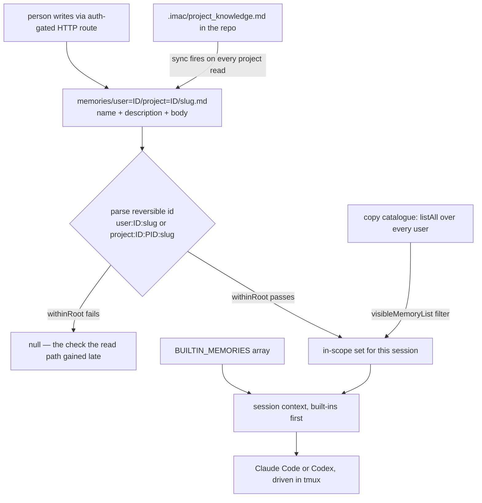

## 1. Executive Summary

Mobius is a team platform from 果壳智算（北京）科技有限公司 that describes itself
as *"the first self-evolving open-source Agent OS, connecting your team, AI
agents, devices, and compute"* — 127,468 lines of TypeScript and Python, 1,131
commits since 19 June 2026, 14 contributors. It runs coding agents by driving
**Claude Code and Codex inside tmux sessions** (`backend/agents/tmux-claude-code.js`,
`tmux-codex.js`) behind a web UI with issues, projects, messages, group
memberships and resource ACLs.

**It is not open source and the README's own word for itself is wrong.** The
`LICENSE` is a bespoke *"Mobius Open Source License"* granting use, modification
and distribution for **non-commercial use only**, with commercial use — including
*"operating the Software on behalf of a for-profit organization as part of its
core business operations"* — requiring a separate licence from the company.
GitHub declines to classify it (`NOASSERTION`). Source-available is not an
exclusion here and the mechanisms are analysed below; it is stated first so a
reader knows what they may do with what they read.

The memory system is small, and its interesting property is that it is *the same
system twice*. A **memory** and a **skill** are both a markdown file with `name`
and `description` frontmatter and a free-text body, parsed by the same
`parseFrontmatter` from `skill-loader`, stored under the same kind of scoped
directory, and exposed through near-identical CRUD, copy, import, access-control
and hide routes. Writing the editing surface, the scope model and the import path
once and using it for both procedural and declarative memory is the design's best
idea and the reason the surface is as complete as it is at this size.

**The scope key is the directory name**, which is the finding that organises the
rest. A memory lives at `memories/user=<userId>/project=<projectId>/<slug>.md`,
and its id is a reversible string — `project:${userId}:${projectId}:${slug}` —
deliberately *"not dependent on the DB"*. That makes scope structural and free,
and it makes id parsing a path-composition step. The repository's own comment
records what that cost: `userId` arrives from the id with no whitelist check, so
`user:../../..:x` composes a path outside the root through `userDefaultDir` and
yields *"arbitrary .md file read"* — and the note adds that the write and delete
paths already had `withinRoot` protection while **the read path originally lacked
it**. At this commit both branches call it. That asymmetry is the most transferable thing
here: the dangerous-looking operations were hardened first, and the read was the
one that got there late.

Against that, the memory layer is thin where the atlas usually looks. There is
**no retrieval** — every in-scope memory is rendered into the session context
wholesale, built-ins first, with no search, ranking or budget. There is **no
epistemic state**: the file format carries a name, a description and a body, so
nothing has a confidence, a provenance, a timestamp or a status. And the agent
has no tool for any of it; memory reaches the model as injected text and is
written by people through a web UI.

## 2. Mental Model

A memory is **a markdown file someone wrote**, and the platform's whole
contribution is deciding which ones a given session sees.

Three tiers stack in `session-context.ts`. `BUILTIN_MEMORIES` is a hardcoded
array in `builtin-memories.ts` — *"platform-level long-term facts, independent of
any user or project"*, always injected and ordered first. Then user-scoped
memories, then project-scoped ones, all concatenated by `zh_add_memory_info` or
its English twin into the prompt body. The built-ins are worth naming because
they are not facts in any sense the atlas uses: both shipped entries are tool
usage instructions — how to invoke `display_images`, and to render file paths as
`[relative](absolute)` markdown so they are clickable. The comment calls them
long-term facts; the content is procedure.

A memory becomes durable when a person creates it, and there is no admission
gate, no review step and no candidate state. It stops being one when a person
deletes it, or when a project is deleted and `deleteForProject` sweeps its
directory. Between those two points it can be **edited in place**, **copied** into
another scope with a fresh slug, **moved** between scopes, **hidden** per user, or
have its **access** changed — and none of those transitions is recorded anywhere.
Renaming is explicitly cheap: the slug is generated backend-side from a timestamp
and randomness and is *"decoupled from `name`, so renaming does not touch the
id"*, which is the right call and means the name carries no identity.

So the epistemic vocabulary is empty by construction, and the interesting
machinery has moved one level out: not "is this true" but **"whose is it, and who
may see it"**. Scope is a directory segment, visibility is an ACL row, and the
copy catalogue enumerates the whole platform and filters it through
`visibleMemoryList(user, …)` before returning. For a multi-user team product that
is the right question to have built, and it is a different question from the one
most systems here answer.

The one write path that is not a person is the **project-knowledge sync**:
`.imac/project_knowledge.md` inside the project's bound repository is promoted
into a project memory with the fixed slug `project-knowledge`, and the sync runs
on *every* `listForProject` call. So a file the agent can edit in the working tree
becomes injected memory on the next read, with 30 timestamped `.bak.md` versions
retained beside it — the only versioning anywhere in this store.



## 3. Architecture

A single Node/Express backend (`mobius/backend`) over `better-sqlite3`, a React
frontend, an Electron desktop shell, a TUI, and a browser extension, deployed by
`docker-compose` with a `pm2` entrypoint. Agents are not libraries: the platform
opens **tmux** sessions and drives Claude Code or Codex inside them, scraping and
relaying their output.

Durable state is split, and the split is not what `schema.sql` suggests:

- **SQLite** holds the platform — `users`, `user_groups`, `projects`, `issues`,
  `messages`, `sessions`, `session_changes`, `project_memberships`,
  `resource_acl_entries`, `resource_policies`, `user_resource_hides`,
  `user_preferences`, three separate audit-log tables — 29 tables in all.
- **The filesystem** holds memory and skills, under `CORE_DATA_PATH`.

`schema.sql` still defines a `skills` table with `id, scope, owner_id, name,
description, body, created_by, created_at, updated_at` and it is dead:
`repositories/skills.ts` is 22 lines whose header says the store *"has now
switched to filesystem storage (skills-fs)"* and that the file exists *"only as a
compatibility layer"*, delegating every method. `repositories/memories.ts` is the
same shape over `memories-fs`. A reader who took the schema as the data model
would describe a system that no longer exists — worth stating because the schema
is the first thing anyone reads.

There is no search stack of any kind: no index, no embeddings, no FTS table over
memories. Nothing runs on a schedule; the one derived write is triggered by a
read.

### Deployment and ergonomics

Docker Compose with a bundled SQLite file, or `start.py` from a checkout. It is a
server product rather than a local tool — there are users, groups and ACLs — so
adopting it means running it for a team, and the non-commercial licence means a
for-profit team running it as part of its core business needs to talk to the
vendor first.

The memory store itself is as repairable as it gets: markdown files in
directories named after the ids that scope them, editable with any editor, and
the id encoding is documented as deliberately reversible so the filesystem stays
the source of truth without the database. That is a genuinely good property and
it is the same one the [memoir format](../memoir-cli/) argues for at length.

## 4. Essential Implementation Paths

**Storage and identity** — `backend/services/memories-fs.ts` (566 lines). The
header documents the layout, the file format, the reversible id encoding and the
copy semantics before any code. `isSafeSlug` rejects a slug that is not
`[A-Za-z0-9._-]`, longer than 128 characters, or containing `..`, `/` or `\`,
with a comment noting the slug is backend-generated *"but must still be validated
defensively"*.

**Containment** — `findById` composes the path from the parsed id and then calls
`withinRoot(file)` before reading, for both scopes. The comment above it is the
report's headline and is quoted in section 1.

**Injection** — `backend/services/session-context.ts` (1,345 lines).
`formatBody({ user, project, issue, research, session, skills, memories, … })`
assembles the prompt; `zh_add_memory_info` and `en_add_memory_info` concatenate
`[...BUILTIN_MEMORIES, ...memories]`. There are parallel Chinese and English
renderers selected by a `language` field, which is a real product decision and a
maintenance surface — the two functions must stay in step by hand.

**Derived write** — `backend/services/project-knowledge.ts` (362 lines) reads
`.imac/project_knowledge.md` from the project's bound path, enforces
`MAX_MEMORY_MARKDOWN_BYTES`, upserts it under `PROJECT_KNOWLEDGE_SLUG`, and keeps
`HISTORY_RETAIN = 30` backups named `project_knowledge.<ts>.bak.md`.
`listForProjectWithKnowledgeSync` runs it on every project-scope list and logs a
warning rather than failing the read when the sync errors.

**Access** — `routes/memories.ts` exposes list, catalogue, catalogue-item, copy,
import-local, import-file, per-item access get/patch, hide, unhide, get, create
and patch, every one behind `auth`. `GET /catalog` runs
`visibleMemoryList(user, Memories.listAll())`, so the platform-wide enumeration
that makes cross-team copying possible is filtered before it is returned.

**Skills** — `routes/skills.ts` (813 lines) mirrors that route list almost
exactly over `skills-fs.ts` (773 lines).

## 5. Memory Data Model

The file is the model, and it is three fields:

```markdown
---
name: <short title, required>
description: <one line, optional>
---
<body = the memory content>
```

No timestamp, no author, no scope field, no confidence, no source, no expiry, no
status. Scope and ownership live in the path and in the id; everything else about
a memory's history is absent from the artifact. That is a deliberate minimalism —
the header says the format is *"identical to SKILL.md"* so one parser serves both
— and it is also the ceiling on what this layer can support. A correction is an
overwrite, and the only record that one happened is 30 backups for the single
`project-knowledge` slug.

The id encoding carries what the file does not: `user:${userId}:${slug}` or
`project:${userId}:${projectId}:${slug}`. Note that even a *project* memory is
filed under a user directory, so project memories are per-user-per-project rather
than shared per project — `listForProject` walks every `user=*` directory looking
for a matching `project=<id>` subdirectory and merges them.

Around it, SQLite carries the multi-tenant model this store leans on:
`resource_acl_entries` and `resource_policies` for who may see what,
`user_resource_hides` for per-user suppression that is not deletion, and
`project_user_context_whitelists` for scoping what context a given user's session
may draw on. Those are the columns doing the epistemic work in this product, and
they are about permission rather than belief.

## 6. Retrieval Mechanics

There is none, and that is a design position rather than an omission. Every
memory in scope is injected; nothing selects among them. No query is ever formed,
so there is no ranking, no embedding, no keyword match, no budget and no
relevance failure mode — the failure mode is the other one, which is that the
prompt grows linearly with how many memories a user or project has accumulated
and nothing bounds it. `MAX_MEMORY_MARKDOWN_BYTES` caps a single file; nothing
caps the set.

For a store whose scope is one project's working context and whose entries are
hand-written, injecting all of them is defensible at small N and is what most
`AGENTS.md`-shaped systems do. It stops being defensible at the size the copy
catalogue is designed to encourage, and there is no mechanism in the tree that
would notice the crossover.

## 7. Write Mechanics

Writes are synchronous file writes on the request path, and there is no
extraction, summarization or dedup anywhere: a memory is what a person typed.
There is no lag before a memory is retrievable, because retrieval is a directory
listing.

Update is overwrite in place. Delete removes the file; `deleteForProject` removes
a project's directory. Copy writes a new file with a fresh slug and the test
`tests/memory-copy-scope.js` pins the semantics that matter — the source survives
a copy, the target is created, and *"memory copies are independent"* — so a copied
memory is a fork rather than a reference, and correcting one does not correct the
other. That is the right choice for a cross-team copy catalogue and it means the
same claim can exist in a dozen scopes with no link between them.

The project-knowledge sync is the one derived write and the one place with
history: 30 retained versions of a single slug. Everywhere else a correction
destroys what it replaced.

Nothing scans a memory's content before it is written or injected, and nothing
distinguishes a memory a person wrote from one that arrived through the
`project_knowledge.md` file an agent can edit in the repository. That second
point is the one to weigh: the agent cannot call a memory-write tool, but it can
write a file that becomes injected memory on the next read.

## 8. Agent Integration

Agents are Claude Code and Codex, driven in tmux — `tmux-claude-code.js`,
`tmux-codex.js`, `tmux-operation-log.js` — with the platform composing a prompt
and relaying terminal output. Memory reaches the model **only as injected
context**. There is no MCP server for it, no tool to read or search memories, and
no tool to write one. The model's entire relationship with this store is that
some text arrives at the top of its context.

That asymmetry is the same one [DeepSeek Harness](../deepseek-harness/) has in
mirror image — there the model may search history and never write it; here it may
neither, and a person curates everything. It is the most conservative position
available and it removes the self-reinforcement failure mode entirely, at the
cost of the memory never learning anything the team did not type.

The committed `skills/` directory shows what the curated path produces in
practice, and one entry is unusually candid.
`skills/mobius-self-evo-demo/SKILL.md` accretes a user's successive corrections
verbatim as a numbered list of `P.S.` lines — *"the transitions are too weird,
make them plainer"*, *"black background white text, typewriter effect"*, and one
that is plainly exasperated — under the instruction that future tasks must *"take
these opinions fully into account"*. Keeping feedback in the order and tone it
arrived, rather than distilling it, is [skills as procedural
memory](../../patterns/skills-as-procedural-memory/) in its rawest observed form.

## 9. Reliability, Safety, and Trust

**Path containment is the safety story and it is documented against its own
history.** The slug validator is defensive about a backend-generated value; the
id parser is not whitelisting `userId`; and the gap that combination opened was
closed on the write and delete paths before the read path. The current code calls
`withinRoot` on both branches of `findById`. A reader adopting this layout should
take the lesson rather than the code: when a scope key becomes a path segment,
every operation that composes the path needs the check, and the read is the one
that looks harmless.

**Authorization is real and layered** — `auth` on every route, `resource_acl_entries`
and `resource_policies`, `visibleMemoryList` over the copy catalogue, per-user
hides that suppress without deleting, and `project_user_context_whitelists`
bounding what a session may draw on. For a multi-user product this is the part
that is properly built.

**Uncertainty cannot be represented at all**, and neither can history. No
timestamp, no author, no version. If two team members disagree about a project
convention, the store records whichever edit landed last and nothing shows that
the other existed.

Three further gaps worth naming. Memory content is **never scanned** before
injection, so a credential typed into a memory is in every session prompt for
that scope. The **read-triggered sync** means a listing can fail partway and log a
warning, so the injected set silently depends on a filesystem write having
succeeded. And the parallel **Chinese and English renderers** are two
hand-maintained functions producing the injected block; a fix to one is not a fix
to the other.

## 10. Tests, Evals, and Benchmarks

40 files under `mobius/tests`, plain `assert`-based Node scripts rather than a
framework suite. The memory-relevant one is `memory-copy-scope.js`, which
asserts copy independence across both project→project and project→user copies —
a real behavioural pin on the semantics most likely to be got wrong.
`access-control-policy.js` covers the ACL layer the memory routes depend on.

What is absent is anything about the parts this report flags. There is **no test
for path containment** — the `withinRoot` guard whose absence the code comments
describe as an arbitrary-file-read is not pinned by a case that would fail if it
were removed again. There is no test that built-ins are injected, no test of the
project-knowledge sync or its 30-version retention, and no measurement of any
kind about the injected prompt's size. For a store with no retrieval, the
context-assembly path is the whole product, and it is the least tested part of
it.

**No paper, arXiv reference or citation file exists in this repository.**

## 11. For Your Own Build

### Steal

**Use one on-disk format for procedural and declarative memory.** A skill and a
memory here are the same markdown-plus-frontmatter file through the same parser,
which is why both got a full CRUD surface, an import path, a copy catalogue and
an access model at a size where most projects would have built one of them.

**Make the id reversible and the filesystem authoritative.**
`project:${userId}:${projectId}:${slug}` encodes everything needed to locate the
file, so the store survives the database and can be inspected, diffed and
repaired with ordinary tools.

**Decouple the slug from the display name.** A backend-generated slug means
renaming a memory is free and never breaks a reference — a two-line decision that
removes a whole class of migration.

**If scope becomes a path segment, check containment on every operation, and
check the read first.** The write and delete paths look dangerous and get guarded;
the read looks like a lookup. The comment in this codebase is the artifact to
copy: it names the exact malicious id, the exact composition that escapes, and
which paths were already covered.

**Promote a file in the working tree into memory, with versions.** A
`project_knowledge.md` the agent can edit, synced into the injected set with 30
retained backups, gives an agent a durable write path without giving it a
memory-write tool — and the backups make it correctable.

### Avoid

**Do not inject an unbounded set.** With no retrieval, the prompt grows with the
number of memories, and a copy catalogue that encourages accumulation across
teams is a mechanism for growing it. Cap the set, or add a selection step before
the number gets large enough to matter.

**Do not ship a schema that no longer backs anything.** A `skills` table with
nine columns beside a repository file saying the store moved to the filesystem is
a trap for the next reader, and the schema is what they will read first.

**Do not let a copy be a silent fork.** Independent copies are the right
semantics for cross-team sharing and the wrong ones for a claim that turns out to
be wrong: correcting the original leaves every copy stale, and nothing here
records that the copies exist.

**Do not maintain two renderers of the injected context by hand.** Parallel
per-language functions assembling the same prompt will drift, and the drift is
invisible because both outputs look correct in isolation.

### Fit

This suits a team that wants a self-hosted place where issues, sessions and
agents live together, and that is comfortable with a non-commercial licence and a
product moving at a thousand commits a quarter. The memory layer is a supporting
feature of that platform, not the reason to adopt it — and read as a supporting
feature it is competently scoped, properly permissioned, and honest about being
hand-curated.

It does not suit anyone who needs memory to be *found* rather than injected, or
to be *judged* rather than trusted. There is no retrieval to tune and no trust
model to configure; what there is instead is an access model, which is the axis a
team product actually competes on and which most systems in this atlas do not
have at all.

The maintenance budget is a company's. 127,000 lines spanning a backend, a React
frontend, an Electron shell, a TUI and a browser extension, with agent
integration by tmux scraping, is a lot of surface — and the tmux coupling in
particular means an upstream change to Claude Code's terminal output is a
breakage this platform absorbs.

## 12. Open Questions

- Is the `skills` table in `schema.sql` scheduled for removal, or does a
  deployment still read it through a path this review did not find?
- Project memories are filed per user *and* per project, so `listForProject`
  merges across every user directory. Is a project memory intended to be shared
  team state or one member's note about a shared project? The read merges them
  and the ACL layer filters them, and the two answers imply different defaults.
- What bounds the injected context? Nothing found caps the number of memories, and
  no test measures the assembled prompt.
- Does anything scan memory bodies before injection? Nothing found does.
- The repository is a mirror of a GitLab-hosted tree — the head commit cleans up
  *"gitlab merge conflict markers"* — so whether the public history is the whole
  history affects what a reader can audit, though not the mechanism.

## Appendix: File Index

**Memory store** — `mobius/backend/services/memories-fs.ts`,
`mobius/backend/repositories/memories.ts`,
`mobius/backend/services/builtin-memories.ts`.

**Derived write** — `mobius/backend/services/project-knowledge.ts`.

**Context assembly** — `mobius/backend/services/session-context.ts`.

**Skills** — `mobius/backend/services/skills-fs.ts`,
`mobius/backend/repositories/skills.ts`, `mobius/backend/routes/skills.ts`,
`skills/` (committed skill directories).

**HTTP surface and access control** — `mobius/backend/routes/memories.ts`,
`mobius/backend/services/access-control.ts`.

**Schema** — `mobius/schema.sql`.

**Agents** — `mobius/backend/agents/tmux-claude-code.js`,
`tmux-codex.js`, `tmux-operation-log.js`.

**Tests** — `mobius/tests/memory-copy-scope.js`,
`mobius/tests/access-control-policy.js`.

## History

**2026-08-13** — [`fe744d5b65c1d8d1665c820753a9404837e983bd`](https://github.com/nutshellai-tech/mobius/commit/fe744d5b65c1d8d1665c820753a9404837e983bd)
— first reading, at the 1,131st commit of a repository created 18 June 2026.
Screened before reading: 0 auto-run surfaces, 0 build-time exec surfaces, 7
dependency surfaces inside the seven-day cooldown, 3 unpinned manifests with
lockfiles beside them. Nothing was installed and nothing was executed. The
licence is a bespoke non-commercial source-available grant rather than an
OSI-approved licence, which GitHub reports as `NOASSERTION` and the README
describes as open source.
