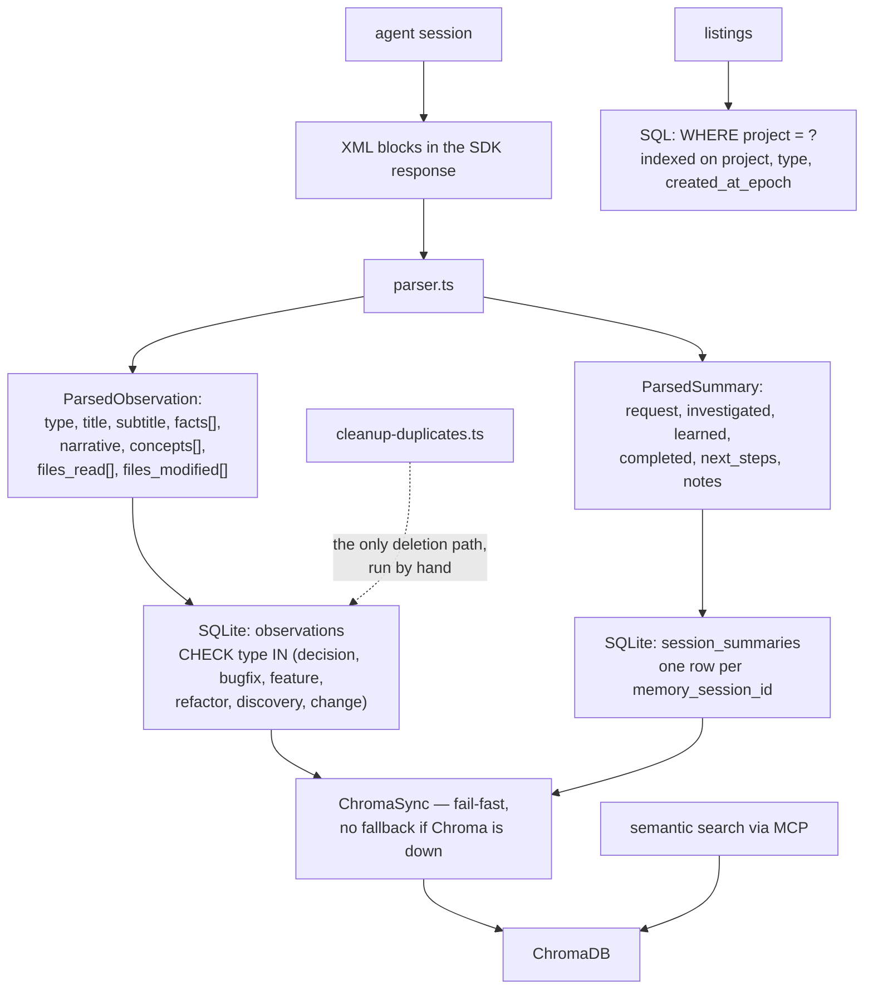

## 1. Executive Summary

MoltBrain is an AGPL-3.0 TypeScript memory layer for Claude Code, OpenClaw and
MoltBook — SQLite plus ChromaDB, an MCP surface, a web viewer at `localhost:37777`
with themes, favourites, filters, export and keyboard shortcuts, and a two-command
plugin install.

**The design decision worth naming is that the session summary has a schema.**

Most systems in this atlas end a session by asking a model for a summary and
storing whatever prose comes back. `session_summaries` here has fields:

```sql
request TEXT, investigated TEXT, learned TEXT, completed TEXT,
next_steps TEXT, files_read TEXT, files_edited TEXT, notes TEXT
```

and `src/parser/parser.ts` parses the model's XML into exactly that shape. The
same applies to observations: `type` is constrained by a `CHECK` to `decision`,
`bugfix`, `feature`, `refactor`, `discovery` or `change`, and each carries a
`title`, `subtitle`, `facts[]`, `narrative`, `concepts[]`, `files_read[]` and
`files_modified[]`.

A summary that is a form rather than a paragraph is queryable — you can ask what
was *learned* across forty sessions without re-reading forty paragraphs — and it
constrains what the model can hand back. That is a real advantage and it is
cheap.

**What the system does not have is any notion of a memory being wrong** —
section 9, and it is the whole of the assessment.

## 2. Mental Model

The agent emits XML blocks during a session. A parser turns them into typed
observations and one structured summary. Both go to SQLite, and a background
service mirrors them into ChromaDB so semantic search works. The web viewer reads
SQLite.



## 3. Architecture

`src/core` splits into `storage` (DataStore, Observations, Sessions, Summaries,
Timeline, Prompts, migrations, transactions), `engine` (session, search, agents,
branch and settings managers, an SSE broadcaster), `vector` (ChromaSync),
`domain`, `queue`, `adapters`, `api`, `infra`.

Around it sits a substantial product surface: `ui`, `themes`, `shortcuts`,
`favorites`, `filters`, `formatters`, `export`, `analytics`, `locales`, an
`extension`, a `plugin` manifest, `integrations`, and a Virtuals Protocol GAME SDK
plugin in a separate repository.

The proportion is worth stating plainly: this is a memory-capture-and-browse
product, and the memory model underneath it is a typed log. 40 test files, plus
`benchmarks/compression.bench.ts` and `search.bench.ts`.

**And the component that decides what gets stored is in the tree as a build
artifact, not as source.** The hooks and the MCP server between them call seven
API paths:

| Called from | Path | Registered in `src/` |
| --- | --- | --- |
| `interface/handlers/user-message.ts` | `/api/context/inject` | yes — `core/engine-service.ts:228` |
| `interface/handlers/session-init.ts` | `/api/sessions/init`, `/sessions/:id/init` | no |
| `interface/handlers/session-init.ts` | `/api/sessions/observations` | no |
| `interface/handlers/summarize.ts` | `/api/sessions/summarize` | no |
| `servers/mcp-server.ts` | `/api/search`, `/api/timeline` | no |
| `servers/mcp-server.ts` | `/api/observations/batch` | no |

`core/api/Server.ts` registers `health`, `readiness`, `version`, `instructions`,
`admin/restart` and `admin/shutdown`; its `RouteHandler.setupRoutes` interface has
no implementor and `registerRoutes` has no caller. Every other path above
resolves inside `plugin/scripts/worker-service.cjs` — 1.86 MB of committed,
minified JavaScript — and its sibling `extension/runtime/engine-runtime.cjs`, a
further 1.85 MB. `scripts/build-worker-binary.js` compiles
`./src/core/worker-service.ts`, which this repository does not contain.

So the read path is readable and the write path is not: the TypeScript here is
the hook layer, the storage layer, the search engine and the viewer, while the
worker that receives a prompt, decides what is observation-worthy and writes it
ships pre-built. That is worth knowing before reading any absence claim in this
report, and it is why several functions below have no caller in `src/` — their
callers are inside the bundle.

## 4. Essential Implementation Paths

**Parse** — `src/parser/parser.ts` (`ParsedObservation` `:9-18`, `ParsedSummary`
`:20-26`, `parseObservations` `:32`).

**Store** — `src/core/storage/DataStore.ts` (`observations` `:96-110`,
`session_summaries` `:112-130`, the migrated `observations_new` `:339-357`).

**Read** — `src/core/storage/observations/recent.ts` `:21`,
`observations/get.ts` `:45`.

**Mirror** — `src/core/vector/VectorSync.ts`.

## 5. Memory Data Model

`observations(id, memory_session_id, project, text, type, title, subtitle, facts,
narrative, concepts, files_read, files_modified, prompt_number, created_at,
created_at_epoch)` with a `CHECK` on `type` and indexes on session, project, type
and time.

`session_summaries` is one row per session with the fixed fields above and a
`UNIQUE` constraint on `memory_session_id`.

Both cascade on delete from `sdk_sessions`.

**There is no confidence, no status, no `superseded_by`, no `verified` flag and
no provenance beyond which session produced it.** An observation is a typed,
timestamped, project-tagged statement, and every observation is equally true
forever.

The migration that added `title`, `subtitle`, `facts`, `narrative`, `concepts`,
`files_read`, `files_modified` and `prompt_number` — creating `observations_new`,
copying the columns explicitly by name, and swapping — is careful SQLite
migration practice and worth noting as such.

## 6. Retrieval Mechanics

Semantic search runs against the Chroma mirror through MCP tools. SQL listings
filter on `project = ?` with indexes on `project`, `type` and
`created_at_epoch DESC`.

`project` is a stored column reaching the query on the observation read paths,
which is what `scope_enforced` certifies. It is coarse — one project string, no
user or agent dimension — and it is genuinely applied.

**ChromaSync is fail-fast on purpose**, and says so:

> "Design: Fail-fast with no fallbacks - if Chroma is unavailable, syncing fails."

That is the right call and it is worth crediting. A sync that silently falls back
leaves the vector index quietly behind SQLite, and semantic search then returns a
subset of what exists with nothing indicating it. Failing loudly is how the
operator finds out.

## 7. Write Mechanics

The agent emits XML; the parser extracts; SQLite stores. There is no
deduplication on the write path, no merge, no supersession and no update.

The only deletion in the tree is `src/bin/cleanup-duplicates.ts`, a standalone
binary that issues `DELETE FROM observations WHERE id IN (…)`. Duplicate
observations are therefore an operational chore run by hand, after the fact,
rather than a write-path concern — which is a reasonable staging post for a young
project and is not a correction mechanism.

## 8. Agent Integration

`/plugin marketplace add nhevers/moltbrain` then `/plugin install moltbrain`,
and capture starts automatically. MCP tools for search, a web viewer on port
37777 for browsing, analytics on tokens and concept trends, tag filters,
favourites, and export to JSON, CSV or Markdown with custom templates.

The capture mechanism is the agent emitting XML blocks, which means the quality
of memory depends entirely on the model following the prompt. There is no
extraction pass over the transcript as a fallback, so a session where the model
forgets to emit an observation block leaves no memory.

## 9. Reliability, Safety, and Trust

**One mark: scope enforced**, per section 6.

**There is one privacy control, and the first version of this report missed it.**
On every context load the hook writes to stderr:
*"💡 Tip: Wrap any message with `<private> ... </private>` to prevent storing
sensitive information."* (`interface/handlers/user-message.ts:39`). The mechanism
is `utils/tag-stripping.ts`, which removes `<private>…</private>` and
`<claude-recall-context>…</claude-recall-context>` blocks from a prompt before it
is stored, and it is unusually well tested — two files and roughly fourteen cases
covering multiple blocks, interleaved tags, an entirely-private prompt reducing
to the empty string, and the JSON variant.

A user-level tag that keeps a message out of the store at all, advertised where
the user will see it, is a better privacy control than most of this atlas
carries. Two things belong beside it. `stripMemoryTagsFromPrompt` and
`PrivacyCheckValidator` have no caller anywhere in `src/` — their callers live in
the pre-built worker of section 3, where the minified
`.replace(/<private>[\s\S]*?<\/private>/g,"")` is present, so the control does
ship and cannot be verified against the source in this tree. And the tag is
prompt-scoped: it protects what the *user* types, not what the model writes about
it, so a private prompt that produces a public assistant turn is only as private
as the observation the worker extracts from that turn.

**Three FTS5 indexes are maintained on every write and read by nothing.**
Migration 006 creates virtual tables for observations and session summaries,
migration 10 adds one for user prompts, and each comes with insert, update and
delete triggers keeping it in sync. No `MATCH` query appears anywhere in `src/`.
`SearchManager` says why, and the reason is a good one rather than an oversight:

```ts
// Chroma returned 0 results - this is the correct answer, don't fall back to FTS5
```

The lexical arm was switched off deliberately, and the write cost of keeping its
three indexes current was not.


**Everything else is absent, and the absences compound.** There is no trust
state, no supersession, no tombstone, no audit log, no review surface and no
negative eval. Combined, they mean:

- **A wrong observation is permanent.** Nothing marks it, nothing outranks it,
  nothing supersedes it. It stays in SQLite, stays mirrored in Chroma, and stays
  retrievable at full weight for as long as the project exists — unless someone
  runs the duplicate-cleanup script and happens to catch it.
- **A superseded decision competes with the decision that replaced it.** Both are
  `type = 'decision'`, both are indexed, both are semantically similar to the same
  query, and only the timestamp distinguishes them. Nothing in retrieval prefers
  the later one.
- **A model that hallucinates during capture writes a fact.** The XML block is
  parsed into typed fields and stored with the same standing as an accurate one.

This is the atlas's most common shape and it is worth stating without
exaggeration: MoltBrain captures well and stores carefully, and it has not yet
built the layer that decides what remains true. For a browse-and-recall product
where a person reads the observations, that is a defensible stage. For automatic
injection into a coding agent's context — which is what the README promises — it
is the missing half.

**The related-repository surface is worth a reader's attention.** The Virtuals
Protocol GAME SDK plugin lives at `nhevers/Moltbrain-virtuals` and was not read;
nothing in this repository was found that puts memory on-chain, despite the
"Storage DApp" navigation link.

## 10. Tests, Evals, and Benchmarks

**No paper, no retrieval benchmark, no committed results.** 40 test files, and
two micro-benchmarks — `benchmarks/compression.bench.ts` and
`benchmarks/search.bench.ts` — measuring the implementation rather than the
memory.

Nothing measures whether recall improves anything, whether observations are
accurate, or how often the model emits a usable XML block.

**I ran nothing.**

## 11. For Your Own Build

### Steal

- **Say "I have nothing" instead of widening the search.** When Chroma returns
  zero matches, MoltBrain stops: *"this is the correct answer, don't fall back to
  FTS5."* And when Chroma is not initialised at all it sets `chromaFailed` and
  returns an error rather than an empty list, so "no results" and "search is
  unavailable" are different answers. Several systems in this atlas quietly
  substitute a worse result for an honest empty one; two lines and a flag are the
  whole difference.
- **Give the user a tag that keeps a message out of the store.**
  `<private> … </private>`, advertised in the same stderr block that shows the
  injected context, is a privacy control the user can reach without reading
  documentation — and the strip happens before storage rather than at render.

- **Give the session summary a schema.** `request`, `investigated`, `learned`,
  `completed`, `next_steps`, `files_read`, `files_edited`, `notes` — parsed into
  columns, not stored as prose. You can then query what was *learned* across
  every session, and the model has a form to fill rather than a paragraph to
  pad.
- **Constrain the observation type with a `CHECK`.** Six values enforced by the
  database means a typo in the writer becomes an error rather than a category
  nobody queries.
- **Fail fast when the vector mirror is unavailable.** A sync that falls back
  silently leaves semantic search returning a stale subset with no signal. The
  docstring here states the choice, which is the part to copy.
- **Migrate SQLite by explicit column list.** `observations_new`, an `INSERT …
  SELECT` naming every column, then the swap. `SELECT *` across a schema change
  is how columns end up in the wrong places.
- **Index what you filter on.** `project`, `type`, `created_at_epoch DESC` and
  the session foreign key, all indexed, at a size where it does not yet matter.

### Avoid

- **Do not ship automatic context injection without a correction path.** If
  memory is going into the agent's prompt, a wrong observation is not a browsing
  nuisance — it is an input. Some field the reader respects, however simple, has
  to exist before injection is safe.
- **Do not let deduplication be a script someone remembers to run.** Duplicate
  observations are a write-path concern; `cleanup-duplicates.ts` is a repair.
- **Do not depend on the model emitting a block with no fallback.** If the XML is
  the only capture path, a session where the model forgets produces no memory and
  nothing reports the gap.

### Fit

Reasonable if you want an automatically-populated, browsable record of what
happened across your coding sessions, with a decent web viewer and export, and
you will read it yourself. The plugin install is two lines and the capture is
genuinely automatic.

Not yet the right choice where memory is injected without a person in the loop:
there is no mechanism by which a wrong observation stops being retrieved.

## 12. Open Questions

- **What happens when Chroma and SQLite diverge?** Sync fails loudly; whether
  anything reconciles afterwards was not traced.
- **Is there a re-extraction path?** If the model omits an observation block, no
  fallback pass over the transcript was found.
- **What does the "Storage DApp" section describe?** The navigation links to it
  and nothing in this tree puts memory on-chain.
- **Does the web viewer allow editing or deleting an observation?** That would be
  the natural place for a human correction surface and it was not established.

## Appendix: File Index

**Parsing** — `src/parser/parser.ts` (`ParsedObservation` `:9-18`,
`ParsedSummary` `:20-26`, `parseObservations` `:32`)

**Schema** — `src/core/storage/DataStore.ts` (`observations` with the type CHECK
and four indexes `:96-110`, `session_summaries` `:112-130`, the migrated
`observations_new` and the explicit column copy `:339-365`, `user_prompts`
`:414`, `pending_messages` `:520`), `src/core/storage/migrations/`

**Read paths** — `src/core/storage/observations/recent.ts` (`WHERE project = ?`
`:21`), `src/core/storage/observations/get.ts` (`project = ?` `:45`),
`src/core/storage/SessionSearch.ts`

**Vector mirror** — `src/core/vector/VectorSync.ts` (the fail-fast design note
`:1-9`)

**Maintenance** — `src/bin/cleanup-duplicates.ts` (the only `DELETE FROM
observations` `:44`)

**Benchmarks** — `benchmarks/compression.bench.ts`, `benchmarks/search.bench.ts`

## History

**2026-09-18** — [`1cb9a70391c7f7fd9da30d2c4c214a393fb6a639`](https://github.com/nhevers/moltbrain/commit/1cb9a70391c7f7fd9da30d2c4c214a393fb6a639) — re-read at the same commit. Nothing upstream had moved, so every addition is the atlas's own, and the first reading had described `src/` as though it were the whole system.

It is the readable half. The hooks and the MCP server call seven API paths; `core/api/Server.ts` registers six unrelated ones plus `/api/context/inject` in `engine-service.ts`, its `RouteHandler` interface has no implementor, and every other path resolves inside `plugin/scripts/worker-service.cjs`, 1.86 MB of committed minified JavaScript, with `extension/runtime/engine-runtime.cjs` another 1.85 MB beside it. `scripts/build-worker-binary.js` compiles `./src/core/worker-service.ts`, a file this repository does not contain. So the component that receives a prompt and decides what to store ships pre-built, and section 3 now says so before any absence claim is made.

Two mechanisms were added to section 9. `<private> … </private>` is a user-level tag that keeps a message out of the store, advertised in the stderr block the user sees on every context load, implemented in `utils/tag-stripping.ts` and covered by about fourteen committed cases — a better privacy control than most of this corpus carries, with the caveat that its caller is inside the bundle and it protects the user's own text rather than what the model writes about it. And three FTS5 virtual tables with their six triggers are maintained on every write while no `MATCH` query exists anywhere in `src/`, because `SearchManager` deliberately refuses to fall back to them: *"Chroma returned 0 results - this is the correct answer."* That refusal, and the separate `chromaFailed` path that distinguishes "no matches" from "search unavailable", are now in section 11. `stack_source` goes from seeded to reviewed.

**2026-08-09** — [`1cb9a70391c7f7fd9da30d2c4c214a393fb6a639`](https://github.com/nhevers/moltbrain/commit/1cb9a70391c7f7fd9da30d2c4c214a393fb6a639) — first reading. Screened before reading; the tree was read, never installed, and no test was run. The companion Virtuals Protocol plugin lives in a separate repository and was not read.
