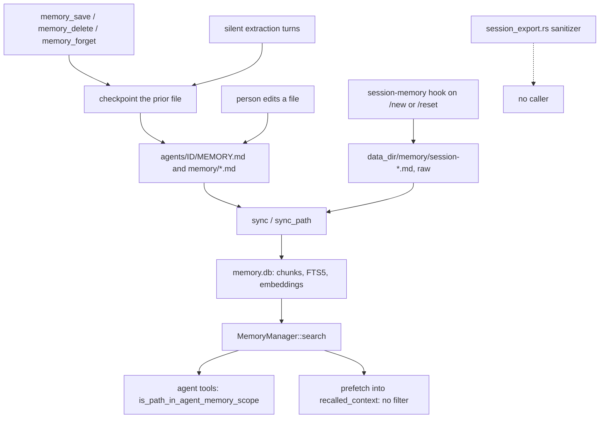

## 1. Executive Summary

Moltis is a Rust agent runtime whose memory is Markdown: a prompt-injected `MEMORY.md` and searchable `memory/*.md` notes per agent, chunked into one SQLite index and hybrid-searched. The notable part is the discipline around the agent's own writes: every save, delete and extraction copies the prior file into a restorable checkpoint, and the memory tools filter results to the calling agent's workspace. The weak part is everything around the tools. A prefetch that runs every turn by default searches all agents' files unfiltered, and session logs enter the corpus raw while a sanitizing exporter sits in the tree with no caller.

The memory crate's module doc states the indexing half of the design:

> "Memory management: markdown files → chunked → embedded → hybrid search in SQLite."

The writing half lives outside that crate. `crates/chat/src/memory_tools.rs` wraps the tools per agent, `crates/agents/src/silent_turn.rs` runs three model extraction turns, and `crates/plugins/src/bundled/session_memory.rs` writes session logs. All of them write Markdown that the same index picks up, so memory and documents are one substrate — the [basic-memory](../basic-memory/) position, reached from a search index rather than from human notes.

Session capture is where the documentation and the code part. `crates/memory/src/session_export.rs` describes itself as saving **sanitized** transcripts, and `docs/src/memory.md` promises files under `memory/sessions/` with sensitive tool results and system messages removed. Nothing outside that file constructs its `SessionExporter`. The live writer is the `session-memory` hook, whose own doc comment says *"The raw conversation is saved as markdown"*.

[OpenClaw](../openclaw/) strips its message envelope and [nanobot](../nanobot/) filters its own cron and dream sessions before capture. Moltis documents the same step and ships it unwired ([section 7](#7-write-mechanics)).

The embedding layer degrades explicitly. `MemoryManager::keyword_only()` is what the gateway builds when `disable_rag` is set or no embedding provider is found, and `has_embeddings()` lets callers tell. A local GGUF provider sits behind the `local-embeddings` feature, and a fallback chain is built when more than one provider is configured. Two modules that read as part of the pipeline are not wired into it: `BatchEmbeddingProvider` and `LlmReranker` have no caller outside their own files.

There is no claim model, trust state or correction record beyond the checkpoint's pre-image. The committed plan `plans/core-memory-lifecycle-unification.md` names the hook-versus-core split as the problem and proposes moving the session-boundary write into core; it adds no status or provenance field.

## 2. Mental Model

The memory unit is a **chunk of a Markdown file**. A belief is whatever text a file holds; the index is a projection of the files, rebuilt from their content hash. Nothing distinguishes a fact from a guess, and nothing records why a line is there.

Four writers put text into files the index walks:

```text
agent tool  memory_save / memory_delete / memory_forget ─┐
silent turn  every 5 turns · before compaction · at reset ─┴→ checkpoint prior file
                                                           → agents/<id>/MEMORY.md or memory/<name>.md
                                                           → sync_path (indexed before the tool returns)
/new or /reset  session-memory hook (raw, no checkpoint)   → <data_dir>/memory/session-<slug>-<date>.md
person edits any .md under the memory dirs                 → file watcher or the 15-minute resync
```

A line stops being memory in three ways. An agent deletes its exact text through `memory_delete`, or through `memory_forget`, which asks a model which chunks match a request. A file disappears and the next sync drops its rows. Or `checkpoint_restore` rewinds a file to a snapshot. None of the three leaves anything keyed on the removed text, so the next periodic extraction turn can write it again.

Each file carries a `source` label: `longterm` when the path contains the substring `MEMORY`, otherwise `daily` (`crates/memory/src/manager.rs:283-286`). A lowercase `memory.md` and every session log are `daily`. The label is returned to the model with each result and no ranking or filter reads it.

Who controls it is split. The agent writes through tools and through extraction turns it does not see; the gateway writes session logs; a person can edit any file. The whole `agents/` directory is a memory root (`crates/gateway/src/server/init_memory.rs:436-441`), so each agent's `SOUL.md`, `AGENTS.md`, `TOOLS.md` and the other persona files are indexed too.



## 3. Architecture

Memory runs in-process inside the Moltis gateway, a single Rust binary. The operator stands up nothing else on the default path: the index is `memory.db` under the data directory, and the Markdown files beside it are the source of truth.

`crates/memory/src/` carries the index. `manager.rs` holds sync, search and the unscoped `MemoryWriter`; `store.rs` the `MemoryStore` trait, with `store_sqlite.rs` behind it; `search.rs` the two fusion functions. `tools.rs` and `writer.rs` hold the unscoped agent tools and their path validation, and `runtime.rs` the `MemoryRuntime` trait the gateway holds. `chunker.rs` re-exports `moltis-splitter`. The chunker splits by tree-sitter grammar where one is compiled in and by line otherwise, at 400 tokens with an 80-token overlap by default (`config.rs:97-98`).

Three backends are selected by `memory.backend` (`crates/gateway/src/server/init_memory.rs:465-515`):

- **builtin** — SQLite with an FTS5 table kept in step by triggers, and embeddings as blobs on the chunk row. The vector arm is a full scan: `vector_search_sqlite` streams every chunk with an embedding and keeps a top-K heap (`store_sqlite.rs:41-52`), so its cost grows with the corpus.
- **zvec** — `crates/memory-zvec`, collections on disk with a redb cache, behind a cargo feature and only when an embedding dimension is known. `crates/memory-zvec/tests/contract.rs` runs one suite against both stores case for case: roundtrip, vector, keyword-only, hybrid with both fusions, file and cache operations.
- **qmd** — the external `qmd` CLI, with the builtin manager kept as a fallback. `resolve_file_by_hash_prefix` exists for this backend: it maps a qmd document id, a content-hash prefix, back to a path by scanning the file table.

`crates/memory-zvec/src/path.rs` refuses absolute, empty and `..` components before joining a config-supplied `db_path` to the data directory, and states why: `Path::join` *"silently discards the base when given an absolute"* component.

### Deployment and ergonomics

Nothing is required beyond the binary. With no embedding provider configured, or with `disable_rag`, the gateway builds `MemoryManager::keyword_only()` and search is FTS5 alone; no API key is needed to store or recall anything. `file-watcher` is a default feature of the memory crate, and `local-embeddings` pulls in llama-cpp-2 under an explicit `#[allow(unsafe_code)]`.

The store is repairable by hand: delete `memory.db` and the next sync rebuilds it from the Markdown. Checkpoints live under `<data_dir>/checkpoints/`, one directory per snapshot with a JSON manifest. `CheckpointManager::cleanup_if_needed` would prune the oldest fifth past 500, and nothing calls it, so they accumulate.

## 4. Essential Implementation Paths

### Agent tool writes

The five memory tools are registered unscoped at startup (`crates/gateway/src/server/prepare_core/post_state.rs:917-935`). On an owner-private turn, `install_agent_scoped_memory_tools` swaps each for an agent-scoped twin (`crates/chat/src/memory_tools.rs:1215-1268`, called from `run_with_tools.rs:156-171`).

The scoped writer resolves the target to `agents/<id>/MEMORY.md` or `agents/<id>/memory/<name>.md`, refuses anything else, checkpoints the file, writes it, and calls `sync_path` so the text is searchable before the tool returns (`memory_tools.rs:417-442`, `:572-615`).

### Model extraction turns

`run_silent_memory_turn_with_prompt` hands a model the conversation and one tool, `write_file`, whose writes go through the same scoped writer (`crates/agents/src/silent_turn.rs`). It runs in three places: before compaction (`crates/chat/src/service/chat_impl.rs:340-376`), every `auto_extract_interval` turns in a spawned task (default 5, `crates/chat/src/service/chat_impl/send.rs:1328-1380`), and at session reset (`crates/gateway/src/session/summary.rs:85`). All three prompts ask the model to append, and `write_file` defaults `append` to `false` (`silent_turn.rs:110`). A call that omits the flag overwrites `MEMORY.md` or the day's log; the checkpoint keeps the prior file.

### Session logs

`SessionMemoryHook` is registered unless `memory.session_export` is `off` (`crates/gateway/src/server/hooks.rs:389-394`). On `/new` or `/reset` it reads the session, takes the last 50 messages, and writes each message's string `content` under a `## <role>` heading, truncated at 2,000 bytes on a character boundary (`crates/plugins/src/bundled/session_memory.rs:92-140`). It filters no role and strips nothing. It writes with `tokio::fs::write` to `<data_dir>/memory/session-<slug>-<date>.md`, so a second log for the same session key on the same day replaces the first, and no checkpoint is taken.

### Retrieval and context assembly

`MemoryManager::search` embeds the query when a provider exists and calls `hybrid_search` (`manager.rs:405-452`). The scoped `memory_search` over-fetches `max(8 × limit, 25)` and drops every result whose path fails `is_path_in_agent_memory_scope` (`memory_tools.rs:657-676`). `memory_get` and `memory_forget` apply the same predicate (`:750-753`, `:982-989`).

The prefetch does not. On a private turn with `enable_prefetch` (default `true`, `crates/config/src/schema/memory.rs:108`), both chat runtimes call `manager.search(query, limit)` directly and splice the results into the system prompt as `<recalled_context>` (`crates/chat/src/run_with_tools.rs:184-213`, `crates/chat/src/streaming.rs:147-173`).

### Delete, forget and restore

`memory_delete` removes exact text or a whole file and reindexes (`crates/memory/src/tools.rs:263-321`). `memory_forget` searches, asks the model which candidate chunks to delete, and refuses a chunk whose text does not occur exactly once in its file (`memory_tools.rs:293-404`). `checkpoint_restore` is an agent tool that rewrites the file from a snapshot (`crates/tools/src/checkpoints.rs:308-338`); it takes no checkpoint of its own and calls no sync.

## 5. Memory Data Model

One migration defines everything (`crates/memory/migrations/20240205100004_init.sql`). `files` holds path, source, hash, mtime and size. `chunks` holds id, path, source, line range, hash, model, text, an embedding blob and `updated_at`, cascading from `files` on delete. `embedding_cache` is keyed by provider, model and chunk hash, and an external-content FTS5 table is kept in step by three triggers.

There is no scope column, status, confidence, actor or validity time. Scope is the path: an agent's memory is whatever sits at `agents/<id>/MEMORY.md`, `agents/<id>/memory.md` or under `agents/<id>/memory/`, and the `main` agent also owns `MEMORY.md`, `memory.md` and `memory/` at the data-directory root (`memory_tools.rs:444-463`). A chunk id is `path:index`, reassigned on every re-chunk.

Episodic and semantic memory share one table. A session log, a model-extracted daily note, a curated `MEMORY.md` and an agent's `SOUL.md` are rows of the same shape, and only the `source` label — `longterm` when the path contains `MEMORY` — separates any of them.

The checkpoint record is the nearest thing to history: `id`, `created_at`, `reason` (the calling tool's name), `source_path`, `existed`, and a copy of the file before the write (`checkpoints.rs:36-45`, `:341-396`). It stores the before state and not the after state or the outcome, and it is written before the mutation, so a delete that then fails on missing text leaves a checkpoint behind.

## 6. Retrieval Mechanics

`hybrid_search` fetches three times the limit from each arm, the FTS5 `MATCH` and the cosine scan, and fuses them by reciprocal rank (`k = 60`) or a weighted sum, with weights 0.7 vector and 0.3 keyword by default (`store.rs:14-27`, `store_sqlite.rs:492-534`). An empty embedding makes it keyword-only; an empty query makes it vector-only.

On the builtin backend nothing reranks. `llm_reranking` changes behaviour only on the qmd backend, where it selects the CLI's rerank mode (`crates/qmd/src/runtime.rs:36-43`). `LlmReranker` in `reranking.rs` has no caller.

The prefetch injects up to `prefetch_limit` results (default 3, clamped to 10), each truncated to 300 bytes and XML-escaped along with its path, so a chunk cannot close the `<recalled_context>` tag it sits in (`run_with_tools.rs:1444-1464`, tested at `run_with_tools/tests.rs:150-161`). Queries under 10 characters or starting with `/` skip it.

Citations are `path#start_line`. In the default `auto` mode they are appended only when results span more than one file (`search.rs:36-48`). A citation names a path, so it breaks when a file is renamed.

The main failure is over-recall across agents: the prefetch ranks every indexed file, including other agents' notes and persona files. Transcripts and curated notes compete at identical rank.

## 7. Write Mechanics

Writes are hot-path, background and manual at once. Agent tools block on `sync_path`, which embeds the changed chunks before returning, so a saved line is retrievable on the next call. Periodic extraction runs in a spawned task and does not block the turn; its lag is the model call plus the reindex. The compaction flush runs before summarization and delays compaction by one model call. Session logs and hand edits wait for the debounced watcher or the 15-minute resync (`init_memory.rs:596-612`).

The extraction prompts ask for preferences, decisions, facts and technical setup, and tell the model to write only new information. The write path compares nothing with what the file holds; the only deduplication is by chunk id at read time (`search.rs:78`), so two turns that extract the same fact append it twice. The `append` default makes the failure worse in one direction, since a call that omits it replaces the file instead of adding to it.

The session-log path is the corpus's unfiltered intake. A `system` or `notice` message, and any tool message persisted with string content, is copied under its role heading. The sanitizer in `session_export.rs` would have dropped lines that start with `<system` or look like tool-result JSON, and capped each turn at 10,000 bytes; it is not called. Its cap also slices a `String` at a byte offset, which panics when the offset falls inside a multibyte character; its test uses ASCII only.

### Operational cost

- **Per turn:** one query embedding for the prefetch on turns with at least 10 characters, and up to three 300-byte snippets in the system prompt. The snippets change the system prompt from turn to turn, which invalidates a provider's prefix cache from that point on (inferred from where they are spliced, not measured).
- **Every 5 turns:** one background model call over the last 10 messages.
- **At compaction and reset:** one model call each.
- **Every 15 minutes:** a walk of the memory directories. Unchanged files are skipped on mtime and size, then on content hash, so nothing is re-embedded; the embedding cache is capped at 50,000 rows by LRU eviction (`manager.rs:561`).

## 8. Agent Integration

The agent sees `memory_search`, `memory_get`, `memory_save`, `memory_delete` and `memory_forget`, plus `checkpoints_list` and `checkpoint_restore`. `memory.style` decides whether `MEMORY.md` is injected into the prompt, whether the tools are exposed, both or neither; `memory.agent_write_mode` confines writes to `MEMORY.md`, to `memory/*.md`, or off. The system prompt tells the model when to reach for `memory_search`, and states that `MEMORY.md` was truncated when it was (`crates/agents/src/prompt/builder.rs:545-622`).

The scoped swap runs only on owner-private turns. A shared channel defaults to the public tool audience with every tool denied, so no memory tool reaches it. An operator who sets a channel's untrusted audience to `trusted` and its tool policy to `policy` keeps the unscoped tools from `post_state.rs:917-935` on that turn, since nothing installs the scoped ones. That path was traced by reading and not run.

Adapting the design for another agent means adopting the gateway: the memory crate is reusable as a library, and the scoping, checkpoints and extraction all live in the chat and gateway crates around it.

## 9. Reliability, Safety, and Trust

**Scope holds on the tools and not on the prompt.** `is_path_in_agent_memory_scope` is applied on three reads — search, get and the forget planner's candidate set — and the two prefetch reads run without it. Because the index walks all of `agents/`, a private turn for one agent can receive another agent's `MEMORY.md`, notes, or `SOUL.md` as recalled context. Every agent's session logs land in the `main` agent's tier, so `main` can search them through its tool and no other agent can search its own. No committed test writes as one agent and reads as another.

`scope_enforced` is withheld on that split. The predicate exists, runs on a stored field, and matches path components rather than characters, so `memory-archive` does not pass as `memory`. The read that runs on every private turn by default lacks it, and a predicate half the read paths cannot express does not earn the mark.

**Trust state:** none. The `longterm`/`daily` label comes from a filename substring and no read filters on it, so an unsanitized transcript and a curated note carry the same authority.

**Correction:** the checkpoint store is an undo mechanism, not a mutation log. It covers the agent's tool and extraction writes and misses the hook, hand edits and `checkpoint_restore` itself, so `audit_log` is withheld. It is a recoverability feature the agent can drive: every snapshot is one tool call from being restored.

**Forgetting:** `memory_forget` is careful about what it deletes — exact text, occurring once, chosen from candidates it retrieved — and deletes a whole chunk or nothing, so a single fact inside a 400-token chunk goes with its neighbours or not at all. Nothing records the forgotten value, so `tombstone` is withheld; the next extraction turn can write it back.

**Review:** `memory_forget` returns `needs_confirmation` when its planner is unsure, to the same agent that called it. No memory waits on a person, so `human_review` is withheld.

**Injection:** prefetched text is XML-escaped before it enters the prompt. Session logs are written raw, so text an attacker places in a conversation reaches the corpus at the next reset and returns in a later prefetch.

## 10. Tests, Evals, and Benchmarks

The memory and memory-zvec crates carry 245 Rust test functions; none were run for this report. The shared contract suite holds the two stores to the same behaviour, and the manager and tool tests cover sync, change detection, stale-file removal, save, append, overwrite and delete.

`negative_eval` is withheld. The nearest case, `test_memory_delete_removes_exact_text_and_reindexes` (`crates/memory/src/tools.rs:881-921`), deletes one of two lines, searches for the deleted one, and asserts with `items.iter().all(...)` that no result contains it. It asserts the surviving line is in the file and never that it is in the results, so a search returning nothing passes. `delete_removes_from_search` in `contract.rs` checks an empty store after deleting its only chunk. Asserting that `board games` appears in the same result set would close both.

The tests for sanitization exercise `session_export.rs`, which nothing calls. The hook that writes session logs has tests that it fires on `/new`, skips other commands and empty sessions, and truncates on a character boundary, and none for what it keeps out. `is_path_in_agent_memory_scope` has no direct test, and every scoped-tool fixture uses one agent, `writer`.

`crates/benchmarks/benches/memory_backends.rs` times ingest, search and cache operations on both stores over random 768-dimension vectors. It measures speed, not retrieval quality, and no result is committed. No paper is cited in the README, `docs/` or `plans/`.

## 11. For Your Own Build

### Steal

- **Snapshot before every agent-initiated memory write**, keyed by an id the tool returns, so a bad save or a bad forget is one call from undone.
- **Make "no embeddings" a constructor, not a failure mode.** `keyword_only()` plus `has_embeddings()` makes the degraded configuration explicit and inspectable.
- **Have forget validate against the stored text**: exact match, exactly once, from candidates the search returned, and refuse otherwise.
- **Escape recalled text before splicing it into a prompt** so a memory cannot close the tag that frames it.
- **Refuse absolute and `..` components before `Path::join`**, as `memory-zvec` does for a config path.

### Avoid

- **A scope predicate on the tools and not on the prefetch.** The read that runs every turn without being asked is the one that needs it most.
- **Indexing a whole workspace tree** when only part of it is memory; persona and instruction files become recall candidates.
- **Documenting a sanitizer the live path does not call.** A reader of the docs believes a guarantee the code does not give.
- **Telling the model to append while the tool defaults to overwrite.**
- **Correction without a record of the value**, when an extraction loop runs every few turns and can restore what was just forgotten.

### Fit

A single user running one agent gets a sound local design: Markdown as the store, an index rebuildable from it, a lexical-only mode, and an undo for every agent write. The scoping gaps matter once there is a second agent or a second person, and the raw session logs matter the first time a transcript holds a secret. Anyone wanting memory as a claim store — status, supersession, provenance — should look elsewhere in [the corpus](../../overview/); this design has chunks and files, and its plans extend the lifecycle rather than the unit.

## 12. Open Questions

- Is the unwired `SessionExporter` the intended session writer, with the hook left over, or the reverse? The lifecycle plan names the hook as current behaviour and the docs describe the exporter.
- Should the prefetch apply the same agent predicate as `memory_search`, and should `agents/` be walked for memory files only?
- Does a session key survive `/reset`, which would make the hook replace the day's earlier log for that session?
- Does anything prune `<data_dir>/checkpoints/`, given `cleanup_if_needed` has no caller?
- Should exported transcripts carry a lower prior than authored notes, and should `source` be set from the writer rather than the filename?

## Appendix: File Index

| Path | Role |
| --- | --- |
| `crates/memory/src/manager.rs` | Sync, search, `keyword_only`, `has_embeddings`, the unscoped `MemoryWriter`, the `source` label |
| `crates/memory/src/store.rs`, `store_sqlite.rs` | The store trait, fusion strategies, SQLite FTS5 and the cosine scan |
| `crates/memory/migrations/20240205100004_init.sql` | The whole schema |
| `crates/memory/src/tools.rs`, `writer.rs` | Unscoped agent tools, path validation, exact-text removal |
| `crates/memory/src/session_export.rs` | The documented sanitizing exporter; no caller |
| `crates/memory/src/reranking.rs`, `embeddings_batch.rs` | LLM reranker and OpenAI batch embedder; no callers |
| `crates/memory/src/embeddings_fallback.rs`, `embeddings_local.rs`, `embeddings_openai.rs` | The wired embedding providers |
| `crates/chat/src/memory_tools.rs` | Agent-scoped tools, the scope predicate, `memory_forget` |
| `crates/chat/src/run_with_tools.rs`, `streaming.rs` | Scoped-tool install and the unscoped prefetch |
| `crates/agents/src/silent_turn.rs` | The three extraction prompts and `write_file` |
| `crates/plugins/src/bundled/session_memory.rs` | The raw session-log hook |
| `crates/tools/src/checkpoints.rs` | Snapshots, restore, the uncalled pruning |
| `crates/gateway/src/server/init_memory.rs`, `hooks.rs`, `prepare_core/post_state.rs` | Backend selection, memory dirs, hook and tool registration |
| `crates/memory-zvec/` | Second store and the shared contract suite |
| `crates/qmd/src/runtime.rs` | The qmd backend and its use of `resolve_file_by_hash_prefix` |
| `crates/benchmarks/benches/memory_backends.rs` | Backend latency benchmark |
| `plans/core-memory-lifecycle-unification.md`, `plans/postgres-pgvector-memory-backend.md` | Committed plans |

### Recorded searches

Run from the repository root at the pinned commit.

```sh
grep -rn -E 'SessionExporter|SessionTranscript' crates apps --include='*.rs' | grep -v '^crates/memory/src/session_export.rs'
grep -rn -E 'BatchEmbeddingProvider' crates apps --include='*.rs' | grep -v '^crates/memory/src/embeddings_batch.rs'
grep -rn -E 'LlmReranker|RerankerProvider' crates apps --include='*.rs' | grep -v '^crates/memory/src/reranking.rs'
grep -rn 'is_path_in_agent_memory_scope' crates --include='*.rs'
grep -rn 'manager.search(query, limit)' crates/chat/src --include='*.rs'
grep -rn 'cleanup_if_needed' crates/tools crates/gateway crates/chat --include='*.rs'
grep -rn 'resolve_file_by_hash_prefix' crates --include='*.rs'
grep -rn -E '\.source ==|source == "' crates/memory crates/chat/src crates/qmd/src --include='*.rs'
grep -rn -E 'agent_id|tenant|user_id|namespace' crates/memory/src crates/memory/migrations
grep -n -i -E 'status|state|trust|verified|valid' crates/memory/migrations/20240205100004_init.sql
grep -rn -E 'valid_from|valid_to|valid_at|as_of' crates/memory crates/memory-zvec
grep -rn -E 'tombstone|suppress|blocklist|denylist|forgotten' crates/memory crates/chat/src/memory_tools.rs crates/agents/src/silent_turn.rs
grep -n 'setup_agent_memory(' crates/chat/src/memory_tools/tests.rs
grep -rn -i -E 'dedup|already exists|duplicate' crates/memory/src crates/chat/src/memory_tools.rs crates/agents/src/silent_turn.rs
grep -n -i 'checkpoint' crates/plugins/src/bundled/session_memory.rs
sed -n 398,430p crates/tools/src/checkpoints.rs | grep -n -i -E 'checkpoint_path|sync'
grep -rn -i -E 'arxiv|bibtex|@article|@misc|doi\.org' README.md docs plans
git ls-files | grep -i citation
git diff --stat 8f633cc36e5a053d6ccd0d1af22e767665a7cb93 HEAD -- crates/memory crates/memory-zvec crates/chat crates/agents crates/tools crates/plugins crates/gateway crates/qmd crates/config
```

## History

**2026-09-26** — [`1f6d28ea750d6654d52d5899b8be67727ebf7a19`](https://github.com/moltis-org/moltis/commit/1f6d28ea750d6654d52d5899b8be67727ebf7a19) — five commits on, none touching memory, so an audit. Screened from a full clone: two auto-run hook surfaces, nothing inside the cooldown, five build scripts; nothing installed, built or run. No mark moved; the scope, audit and negative-eval withholdings rest on new reasons. Corrected: session logs are written raw by the `session-memory` hook and the sanitizing exporter has no caller; the agent tools carry a per-agent path predicate the default-on prefetch lacks ([section 9](#9-reliability-safety-and-trust)); LLM reranking and batch embedding are unwired on the builtin backend; hash-prefix addressing serves the qmd backend, not citations; `crates/cron/src/store_memory.rs` is a test cron store. Added: three model extraction turns, pre-write checkpoints, and a delete test whose `all()` can pass on an empty result ([section 10](#10-tests-evals-and-benchmarks)).

**2026-09-13** — [`8f633cc36e5a053d6ccd0d1af22e767665a7cb93`](https://github.com/moltis-org/moltis/commit/8f633cc36e5a053d6ccd0d1af22e767665a7cb93) — re-read, 148 commits past the previous pin across 776 files. The memory subsystem gained a second backend: `crates/memory-zvec` stores chunks as zvec collections with a redb cache, sits behind the same `MemoryStore` trait as the built-in SQLite store, and is held to it by a shared contract suite that runs the same cases against both. `search.rs` was substantially rewritten and the hybrid path now names its fusion — reciprocal rank or a weighted sum. `capabilities` stays empty and the withholdings were re-checked rather than carried forward: no scope key on any read path, and no trust, tombstone or temporal field on a chunk. `negative_eval` is refused on the new suite specifically — its nearest case, `sqlite_empty_search_returns_empty`, asserts an empty store returns nothing, which is the vacuous shape rather than a committed case keeping particular material out of a populated result. The stack row was promoted from seeded to reviewed and corrected: storage is the SQLite database plus, on the zvec backend, collection files and an embedded key-value cache. Screened again first: two auto-run surfaces, three dependency files inside the 7-day cooldown, five build-time execution surfaces; nothing was installed and no suite was run.

**2026-07-27** — [`1f53cd27b1a21c36b61ceda7a8ea65a35deb7872`](https://github.com/moltis-org/moltis/commit/1f53cd27b1a21c36b61ceda7a8ea65a35deb7872) — first reading.
