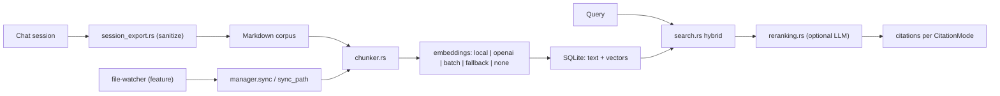

## 1. Executive Summary

Moltis carries the **first Rust memory implementation in this atlas** — `crates/memory/`, about 6,330 lines, whose crate doc states the design in one line:

> "Memory management: markdown files → chunked → embedded → hybrid search in SQLite."

On its own that would be a competent local RAG layer over a notes corpus, and arguably outside this atlas's scope. What closes the loop is `session_export.rs`:

> "Session export: save **sanitized** session transcripts to memory for cross-run recall. This module provides functionality to export chat sessions as markdown files that can be indexed by the memory system, enabling recall of past conversations."

Conversations become Markdown, Markdown becomes the corpus, the corpus is what recall searches. Memory and documents are deliberately the same substrate — the [basic-memory](../basic-memory/) position, implemented in Rust and reached from the other direction. Basic Memory starts from human notes and lets agents write into them; Moltis starts from a search index and feeds sessions into it.

The word **sanitized** is doing real work in that doc comment, and it puts Moltis in a group the atlas has been assembling: [OpenClaw](../openclaw/) strips its message envelope, [Holographic](../holographic/) excludes compaction summaries, [nanobot](../nanobot/) filters its own cron and dream sessions. Systems that capture their own transcripts keep discovering they must first remove their own scaffolding.

The distinctive engineering is in the embedding layer. Four modules — `embeddings_local.rs` (llama-cpp-2 FFI, behind a `local-embeddings` feature), `embeddings_openai.rs`, `embeddings_batch.rs`, and `embeddings_fallback.rs` — give a genuine offline path with a declared degradation route, and `MemoryManager::keyword_only()` constructs the whole system with no embeddings at all. Being able to run purely lexically is a stronger fallback story than most systems here manage.

Reservations: this is a corpus-and-index design, so there is no claim model, no trust state, no correction semantics beyond editing a file, and no scope beyond the indexed directory. Committed plans (`postgres-pgvector-memory-backend.md`, `core-memory-lifecycle-unification.md`) suggest the authors know the lifecycle story is incomplete.

## 2. Mental Model

The memory unit is a **chunk of a Markdown file**, not a claim:

```text
markdown corpus (notes, docs, exported sessions)
  → chunker.rs        split
  → embeddings*.rs    embed (local / OpenAI / batch / fallback / none)
  → SQLite            store vectors + text
  → search.rs         hybrid: keyword + vector
  → reranking.rs      optional LLM reranking
  → citations         per config CitationMode
```

Session capture is a write *into the corpus*:

```text
chat session → sanitize → markdown file → file-watcher / sync() → indexed
```

`MemoryManager` exposes the operational surface: `sync()` and `sync_path()` for reindexing, `has_embeddings()`, `llm_reranking_enabled()`, `citation_mode()`, `db_size_display()`, `data_dir()`, and `resolve_file_by_hash_prefix()` for addressing a file by a content-hash prefix.

## 3. Architecture

`crates/memory/src/` — `lib.rs`, `manager.rs`, `chunker.rs`, `config.rs`, `schema.rs`, `search.rs`, `reranking.rs`, `session_export.rs`, `runtime.rs`, `error.rs`, plus the embedding family and a `contract.rs` compiled under `#[cfg(test)]`.

Feature flags gate real cost: `local-embeddings` pulls in llama-cpp-2 with an explicit `#[allow(unsafe_code)]` and the comment "FFI wrappers for llama-cpp-2 require unsafe Send/Sync impls"; `file-watcher` gates filesystem watching. A deployment that wants neither compiles neither.

Design plans are committed alongside: `plans/postgres-pgvector-memory-backend.md` and `plans/core-memory-lifecycle-unification.md`.



## 4. Essential Implementation Paths

### Sanitized session export

Exporting transcripts as Markdown into the same corpus the user's own notes live in is a clean unification: one index, one retrieval path, one thing to back up. It also means a session becomes *editable* memory — a user can open the exported file and correct it, which is the [basic-memory](../basic-memory/) property of human-owned canonical state.

Sanitization before export is the guard that makes this safe. The doc comment does not enumerate what is stripped, and that is the first thing to check before borrowing: transcripts carry secrets, tool output, system scaffolding, and injected memory blocks, and re-indexing an injected memory block is how a corpus starts citing itself.

### The embedding degradation ladder

```rust
pub fn keyword_only(config: MemoryConfig, store: Box<dyn MemoryStore>) -> Self
pub fn has_embeddings(&self) -> bool
```

A constructor for the no-embeddings case, and a predicate callers can branch on, means "lexical only" is a supported mode rather than a broken state. Combined with `embeddings_fallback.rs` and a local FFI backend, Moltis can run fully offline, fully lexical, or fully hosted, and callers can tell which.

Compare [Holographic](../holographic/), which silently redistributes its fusion weights when NumPy is missing while still reporting itself available. Moltis makes the same situation inspectable.

### Content-hash addressing

`resolve_file_by_hash_prefix()` lets a file be referenced by a short content-hash prefix — git-style addressing for memory. That gives citations a stable, content-derived identity that survives renames, which is more robust than path-based references in a corpus users reorganize.

### Citation modes

`CitationMode` in `config.rs` makes source attribution a configured behaviour rather than a formatting accident. For a system whose memory is file chunks, citations are the whole provenance story — there is no evidence table, so a citation back to `path + chunk` is what makes a recalled statement checkable.

### Reranking and batching

`reranking.rs` with `llm_reranking_enabled()` gates an optional LLM rerank; `embeddings_batch.rs` amortizes embedding cost across a corpus sync. Both are the operational concerns that dominate real indexing workloads and are frequently missing from research-grade implementations.

## 5. Memory Data Model

`schema.rs` defines SQLite storage for chunks, text, and vectors. There is no claim, no status, no confidence, no actor, no scope key, and no supersession — by design, because the unit is a chunk of a file rather than a belief.

The consequences are the ones the atlas expects from corpus-backed memory:

- **Correction is editing a file** and reindexing. Effective, human-legible, and with no record that a correction occurred.
- **Deletion is removing a file** or its chunks. `sync()` presumably reconciles; whether orphaned vectors are cleaned was not traced.
- **No scope** beyond which directory is indexed, so multi-project or multi-user separation is a deployment decision.
- **No trust state**, so an exported session transcript and a carefully written design note carry identical authority in retrieval.

That last point is the sharpest. Once sessions are exported into the corpus, the agent's own conversational output competes with curated notes at the same rank, and nothing in the model distinguishes them. `core-memory-lifecycle-unification.md` suggests this is known.

## 6. Retrieval Mechanics

Hybrid keyword plus vector search in SQLite, optional LLM reranking, citations. Runs lexically when embeddings are unavailable. The design is conventional and well executed; its quality depends on chunking, which `chunker.rs` owns and which was not examined in depth here.

## 7. Write Mechanics

Two write paths: files arriving in the corpus (user-authored or watched), and sessions exported into it. Both converge on `sync()`/`sync_path()`, so there is a single reindex chokepoint — which is the right shape, and makes the file-watcher an optimization rather than a separate ingestion route.

## 8. Agent Integration

Memory is a crate inside the Moltis workspace rather than a plugin contract; `crates/cron/src/store_memory.rs` indicates scheduled memory work elsewhere in the workspace. `runtime.rs` is the integration point.

## 9. Reliability, Safety, and Trust

Strengths:

- **A real no-embeddings mode**, constructible and queryable, rather than silent degradation.
- **Offline-capable local embeddings** behind a feature flag, with the unsafe FFI surface explicitly acknowledged.
- **Sanitization before session capture.**
- **Content-hash file addressing.**
- **Citation mode as configuration.**
- **One reindex chokepoint** for both write paths.
- **Committed design plans** naming the gaps.
- **Rust's type system** doing work the atlas usually sees handled by convention — `Box<dyn MemoryStore>` makes the storage boundary explicit.

Gaps:

- **No trust state**, so exported transcripts and curated notes rank identically.
- **No correction record** — editing a file leaves no trace that memory was corrected.
- **No scope** beyond the indexed directory.
- **Sanitization scope undocumented** in the module comment.
- **Lifecycle explicitly unfinished**, per the committed plan.

## 10. Tests, Evals, and Benchmarks

`contract.rs` is compiled under `#[cfg(test)]`, indicating contract tests against the storage abstraction. No memory-quality benchmark was found, and nothing was run for this review.

For a corpus-and-index system, the measurement that matters is retrieval quality over a realistic corpus, and the natural fixture — an exported session plus queries about it — is something `session_export.rs` already produces.

## 11. Patterns Worth Stealing

- **Make "no embeddings" a constructor, not a failure mode.** `keyword_only()` plus `has_embeddings()` turns degradation into a supported, inspectable configuration.
- **Sanitize transcripts before they become corpus.** Now the fourth independent instance in this atlas of a system needing to strip its own output before capture.
- **Content-hash prefixes for file addressing**, so citations survive renames.
- **Citation mode as explicit configuration** where chunks are the only provenance you have.
- **One reindex entry point** for every write path.
- **Feature-gate expensive backends** so deployments only compile what they use.

## 12. Antipatterns / Risks

- **Session transcripts and curated notes at equal authority** in one undifferentiated index.
- **Correction without a record.**
- **Corpus-wide scope** as the only boundary.
- **Undocumented sanitization** in a module whose safety depends on it.

## 13. Build-vs-Borrow Takeaways

Borrow:

- The `keyword_only()` / `has_embeddings()` degradation pattern.
- Content-hash file addressing.
- The single-chokepoint sync design.
- The feature-gated embedding ladder, if you need an offline option.

Do not copy:

- Exporting sessions into the same index as curated notes without a source distinction and a rank consequence.
- Corpus-only scope for multi-project or multi-user use.

## 14. Open Questions

- What exactly does session sanitization remove? Secrets, tool output, and previously-injected memory blocks are the three that matter.
- Should exported transcripts carry a lower prior than authored notes?
- Does `sync()` remove orphaned vectors when a file disappears?
- What does `core-memory-lifecycle-unification.md` propose, and does it add trust state or only unify storage?
- How does chunking handle the structure of an exported transcript, which is turn-shaped rather than prose-shaped?

## Appendix: File Index

- Crate overview: `crates/memory/src/lib.rs`.
- Orchestration: `crates/memory/src/manager.rs` (`sync`, `sync_path`, `keyword_only`, `has_embeddings`, `resolve_file_by_hash_prefix`, `citation_mode`).
- Session capture: `crates/memory/src/session_export.rs`.
- Chunking and schema: `chunker.rs`, `schema.rs`.
- Search and ranking: `search.rs`, `reranking.rs`.
- Embeddings: `embeddings.rs`, `embeddings_local.rs`, `embeddings_openai.rs`, `embeddings_batch.rs`, `embeddings_fallback.rs`.
- Configuration: `config.rs` (`MemoryConfig`, `CitationMode`).
- Contract tests: `contract.rs`.
- Scheduled memory work: `crates/cron/src/store_memory.rs`.
- Plans: `plans/postgres-pgvector-memory-backend.md`, `plans/core-memory-lifecycle-unification.md`.
