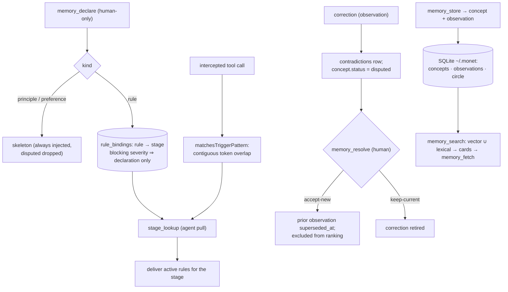

## 1. Executive Summary

Monet is a local-first memory for coding agents — AGPL-3.0 for the packages,
Apache-2.0 for the harness, ~57,000 lines of TypeScript across the core and CLI
(the README's "some 200 ts" is a file count, not a line count; `engine.ts` alone
is 19,401 lines), with a test tree larger than the source. It is MCP-native, runs
entirely on the user's machine over a single SQLite file at `~/.monet`, and embeds
on-device, so there are no accounts, keys or cloud. That much is exactly as
advertised, and it is a well-built local store.

Its pitch is a clean trio — **principles** always in front of the agent, **rules**
read at the moment they bind (commit, release, delegate, PR), **corrections**
recorded so they never need making twice — and the honest way to review it is to
hold each claim against the code, because in each case the mechanism is real but
softer than the sentence. The store underneath the trio is a **concept–observation
graph**: a `concept` (slug, title, body, `kind`, `status`, `confidence`, `circle`,
embedding) with attached `observations` as evidence, and the three marketed kinds
are values of `concepts.kind` plus a rule-to-stage binding (`engine.ts:2956`,
`gates.ts:310`).

**Principles** are the strongest claim and it holds: `kind='principle'` concepts
are momentless, human-authored via `memory_declare`, and enter a standing
"skeleton" that is both materialized to a file and auto-prewarmed into the first
tool response — genuinely always in front of the model. **Rules** are the
distinctive idea and the one to read carefully: a rule is bound to a *stage*, and a
stage's triggers are matched **lexically** — a contiguous run of tokens against the
intercepted tool call (`matchesTriggerPattern`, `gates.ts:1860`). The stages are
*user-authored*, not built-in git-aware detectors; "commit, release, PR" are
example stage names someone writes, not events Monet recognizes. And as shipped by
the agent-first `harness/bootstrap/install.md`, binding is an **agent-behavioral
pull** — the model is taught to call `stage_lookup` at the right moment — because
the mechanical hook that would enforce interception (`monet gate`, reading a
materialized sidecar) exists but the recommended harness does not wire it. So
"rules read at the moment they bind" is, in the default install, *the agent
remembering to look*.

**Corrections** are the third claim, and they are supersession rather than
prevention. A correction attaches as an observation, opens a `contradictions` row,
and flips the concept to `disputed` until `memory_resolve` mediates
(`resolution.ts:264`); on accept-new the prior observation is marked
`superseded_at` and excluded from ranking. So an agent that *reads* the concept
gets the corrected value — but nothing consults a rejected-value list to *block* a
re-proposed bad value by content, so `tombstone` is withheld and "never made twice"
holds only in the weak retrieve-the-winner sense.

What Monet does earn is five marks, and it earns them properly: `trust_state`
(disputed status consumed on read), `scope_enforced` (circle filtered and refused
on read), `audit_log` (append-only resolution and gate event tables),
`human_review` (a real declare/ratify/resolve human loop), and `negative_eval`
(committed tests that disputed and out-of-scope material must not surface). It is
one of the better-governed local memories in the corpus; it just markets two
mechanisms a notch above what ships.

## 2. Mental Model

A memory is a **concept** with **observations** as its evidence, carrying a `kind`
that selects how it is delivered and a `status` that decides whether it is.

```text
memory_store(...)      -> propose concept + observation (kind default 'fact')
memory_declare(...)    -> human-only: principle | preference (momentless) | rule (stage-bound)
principle/preference   -> enter the skeleton (always injected)
rule (kind='rule')     -> bind to a stage via rule_bindings; blocking severity requires declaration
correction (obs)       -> attach to target concept; open contradiction; concept.status = 'disputed'
memory_resolve(...)    -> human mediation: accept-new (supersede prior) | keep-current | dismiss

delivery:
  skeleton   : principles/preferences, minus disputed        (always-on)
  stage_lookup(stage): active rules bound to a matched stage  (agent-initiated pull)
  memory_search      : hybrid vector + lexical pointer cards -> memory_fetch
```

The two claims that define Monet are the stage binding and the correction loop, and
the diagram draws each with the seam the prose hides: a stage is matched lexically
against a tool call and its rules are *pulled* by the agent, and a correction is a
supersession that changes what you retrieve rather than a rejection that blocks
what you can add.



## 3. Architecture

One SQLite file, an MCP server, and a harness of agent roles.

- **`packages/core/src/engine.ts`** (19,401) — the store: schema (`init` at
  `:2925`), concepts/observations, contradiction/resolution, supersession,
  resolution/gate event logs.
- **`packages/core/src/gates.ts`** (5,108) — stages, `rule_bindings`, trigger
  matching, the gate mirror and `gate_events`.
- **`packages/core/src/mcp-server.ts`** — the ~20 MCP tools.
- **`packages/core/src/storage.ts`** — `BetterSqlitePort` over a single WAL file.
- **`packages/core/src/retrieval.ts`**, `lexical-overlap.ts`,
  `embedding-onnx.ts` — hybrid on-device retrieval.
- **`packages/core/src/source-*.ts`** (~10,000) — the RAG source-ingestion
  subsystem, provisionally retired (§7).
- **`packages/cli/src/cli.ts`** — `monet start|status|config|dashboard|gate|source|materialize|install`.
- **`harness/`** — `bootstrap/install.md`, `roster.json`, agent roles
  (`stig`, `investigator`, `developer`, `verifier`), `mcp/monet.json`.

**Storage.** A single-file SQLite database via `better-sqlite3` in WAL mode at
`~/.monet` (`MONET_STORAGE_DIR` override), ~30 tables from `engine.init()` plus the
gate tables and the retired source subsystem's ~20 `source_*` tables. Embeddings
run in-process through transformers.js (ONNX, default `Xenova/bge-m3`, ~590MB,
cached on disk). The only runtime dependencies are the MCP SDK, `better-sqlite3`,
`zod`, and optionally `@huggingface/transformers`; there is no network path — the
local-first claim is exact.

### Deployment and ergonomics

- **Agent-installed, offline after first model download.** The recommended path is
  to paste a one-line instruction into Claude Code, which reads
  `harness/bootstrap/install.md` and wires the MCP server itself. The store is
  yours on disk; nothing leaves the machine.
- **The skeleton is delivered two ways.** Principles are materialized into a
  standing file (a `<!-- BEGIN monet:skeleton -->` block via `monet materialize`)
  and auto-prewarmed into the first tool response (`=== MONET SESSION CONTEXT ===`,
  opt-out via `MONET_NO_AUTOPREWARM`).
- **The mechanical gate is optional and unwired by default.** `monet gate
  <context>` is an offline binary reading a materialized gate mirror off disk; a
  separate `monet install` wraps it as a hook, but the agent-first harness relies on
  `stage_lookup` instead — a distinction that decides whether rule-binding is
  enforced or behavioral (§5).
- The screen flagged FRESH manifests behind a committed `pnpm-lock.yaml`; nothing
  was installed or run, and the mechanisms were read against the Vitest suite.

## 4. Essential Implementation Paths

- **Declare (human)** — `mcp-server.ts:999` `memory_declare` (`species` ∈
  `rule|stage|principle|preference`); principles/preferences are momentless
  (`engine.ts:1270`); a blocking rule requires `origin='declaration'`, enforced in
  SQL (`gates.ts:331`, `CHECK (severity != 'blocking' OR origin = 'declaration')`).
- **Stage binding + match** — `stages` (`gates.ts:292`) with JSON
  `trigger_patterns` of `{tool, tokens}`; `rule_bindings(concept_id PK, stage_id,
  severity, scope, circle)` (`:310`); `matchesTriggerPattern` (`:1860`) matches the
  tool and a contiguous token run; `gateQuery` (`:3325`) returns active,
  non-superseded rules for matched stages.
- **Store / correct** — `memory_store` (`mcp-server.ts:854`); a correction is a
  `kind='correction'` observation opening a `contradictions` row and setting
  `status='disputed'` (`engine.ts:2988-3006`); `memory_resolve`
  (`mcp-server.ts:2040`) returns `accept-new | keep-current | dismiss` and marks
  `superseded_by`/`superseded_at`.
- **Retrieve** — `memory_search` (`mcp-server.ts:1288`) returns ranked pointer
  cards; `memory_fetch` (`:1399`) reads content; ranking blends on-device vector
  similarity (`embedding-onnx.ts`) with a lexical posting-list arm
  (`retrieval.ts:306`, `blendLexical`).
- **Skeleton** — assembled from principles/preferences minus disputed
  (`gates.ts:2873`), delivered via materialize + auto-prewarm; `agent_context`
  (`mcp-server.ts:2629`) returns skeleton, `stageIndex` and open workstreams.
- **Audit** — `resolution_events` append-only per store decision
  (`engine.ts:3203`); `gate_events` per `gateQuery` including silences
  (`gates.ts:407`).

## 5. Memory Data Model

The store is a graph with a `kind` discriminator, not three separate stores.
`concepts` (`engine.ts:2956`): `id, slug, title, body, kind DEFAULT 'fact', status
DEFAULT 'active', confidence DEFAULT 0.6, circle, embedding`. `observations`
(`:2927`): `id, content, embedding, kind DEFAULT 'statement', concept_id,
superseded_by, superseded_at`. On top sit `stages`, `rule_bindings`,
`contradictions`, `resolution_events`, `gate_events`, lifecycle edges, and the
retired `source_*` family.

Three facts decide the marks.

**Status is discrete and consumed on read.** `concepts.status` is `active` or
`disputed`, and the read paths act on it: disputed principles are dropped from the
skeleton (`gates.ts:2873`), only `active` rules are delivered at a stage
(`gates.ts:1355,1424`), and a disputed concept is excluded from the living-model
top (tested). That is `trust_state` — a status field the store gates on, not a
score it ignores. (`confidence` also exists and informs ranking.)

**Scope is a real read filter.** A `circle` column sits on nearly every table and
is filtered on read, with explicit refusals — `memory_resolve` returns "concept not
found" on a circle mismatch (`mcp-server.ts:2073-2087`), and cross-circle exclusion
is tested. `scope_enforced` is earned. Rules additionally carry a `model_tag` for
per-model compensation.

**Correction is supersession, not a value-keyed tombstone.** A `concept_tombstones`
table exists (`engine.ts:3032`) but it is a **content-free retirement lifecycle
event keyed on `concept_id` for sync**, not a rejected-value record; and
`resolveIncoming` (`resolution.ts:230`) admits new evidence by embedding similarity
with no forbidden-value check. So the winner is what you retrieve, but a re-proposed
bad value is not caught by content — `tombstone` withheld. There is no validity-time
axis anywhere (only `created_at`/`updated_at`/`superseded_at`), so `bitemporal` is
withheld too.

## 6. Retrieval Mechanics

Three delivery surfaces, matched to the three kinds. **Principles and preferences**
are the always-on skeleton — materialized to a file and auto-prewarmed into the
first tool response, minus anything disputed. **Rules** are delivered at a *stage*:
either the agent calls `stage_lookup` with a stage name it recognizes (the shipped
path), or the offline `monet gate` binary reads the materialized mirror (the unwired
path). **Facts and concepts** are retrieved by `memory_search`, which returns ranked
pointer cards that the agent then `memory_fetch`es — a two-step retrieval that keeps
the context small until the model asks for content.

The ranking is genuinely hybrid and genuinely local: on-device ONNX embeddings
(`bge-m3`) blended with a lexical-overlap arm over an `observation_tokens` posting
list (`retrieval.ts:306`), all in-process. The stage-matching, by contrast, is
purely lexical — a contiguous token run against the tool call — so "the moment it
binds" is as precise as the tokens someone wrote into the stage, not a semantic
understanding of what the agent is doing. That is the retrieval property to size
correctly: the fact recall is hybrid and good; the rule *triggering* is a keyword
match on user-authored stages.

## 7. Write Mechanics

Writes divide by who may make them. `memory_store` lets the agent propose a
concept/observation (default `kind='fact'`). `memory_declare` is **human-only**
("Never call on agent initiative", `mcp-server.ts:1000`) and is how a principle, a
preference, or a *blocking* rule enters — blocking severity is SQL-gated to
`origin='declaration'`, so an agent cannot self-authorize a hard rule. This
declare/propose split is the spine of the governance story and the reason
`human_review` is earned: the memories that constrain the agent are the ones a
person must put there.

Correction is the contradiction loop. A correction observation attaches to the
concept it contradicts, opens a `contradictions` row, and flips the concept to
`disputed` — so a contested memory is *visibly* contested on read (dropped from the
skeleton, excluded from the living-model top) until a human runs `memory_resolve`.
Resolution is `accept-new` (supersede the prior observation, marking
`superseded_at`), `keep-current` (retire the correction), or `dismiss`. The losing
observation is retained and excluded from ranking, not deleted — the right shape for
an auditable correction — and the `contradictions` row records which observation
lost by id.

What it does not do is prevent recurrence by value. Nothing checks a rejected-value
list on write, so the same bad value re-proposed later is admitted as new evidence
and resolved again by similarity. "Corrections recorded so they never need making
twice" is true in that the *live* concept holds the winner; it is not true that the
system blocks the mistake from being re-added. Background work is the contradiction
detection, near-duplicate handling and on-device embedding; there is no cloud pass.

The **retired source subsystem** belongs here because it is the capture path Monet
chose not to ship. `source-*.ts` (~10,000 lines) registers a git repo or markdown
tree as a "source", clones/scans/chunks/embeds it, and surfaces it via
`memory_search` — a RAG ingestion pipeline. The last commit ("Stop documenting the
provisionally retired source subsystem") withdrew ~97 lines of docs only; the code
and MCP tools remain but are mothballed, with the install notes explaining the
reasoning that reading live files directly beats indexing them
(`install.md:275`, "exists, deliberately not offered … that design question is
open"). It is worth recording because it is a deliberate scope choice — a working
ingestion path set aside — not an unfinished feature.

## 8. Agent Integration

Monet is an MCP server (~20 tools: `memory_store`, `memory_declare`,
`memory_ratify`, `memory_search`, `memory_fetch`, `memory_overview`,
`stage_lookup`, `memory_synthesize`, `memory_checkpoint`, `memory_workstreams`,
`memory_flag_contradiction`, `memory_resolve`, `memory_detach`,
`memory_reassign_circle`, `memory_retire`/`memory_restore`, `memory_circle_manage`,
`agent_context`, and the retired `source_*`). Around it is a *with-monet* harness —
role prompts for a planner, investigator, developer and verifier, plus
`agent_context` as the call-first tool that hands the agent its skeleton, its
`stageIndex` (the cue for which stages exist) and its open workstreams.

The integration's real character is that it teaches a *working method*, not just a
store: restore state at session start, look up rules when moments arrive, record
what you correct. That is a thoughtful design, and it is also where the enforcement
gap lives — the method depends on the agent following it, because the shipped
harness surfaces stages as a cue and asks the agent to `stage_lookup`, rather than
intercepting the tool call mechanically. The `monet gate` hook can enforce it; the
recommended install does not wire it.

`human_review` runs through the whole surface: `memory_declare` is human-only,
`memory_ratify` records the verdict and how it was reached (declaration vs
extraction, `engine.ts:1040`), and `memory_resolve` is a human mediating a
contradiction. This is one of the more complete human-in-the-loop governance
stories in the corpus.

## 9. Reliability, Safety, and Trust

- **Trust is a status the store acts on.** `disputed` is not a label; it drops a
  principle from the skeleton and a concept from the living-model top, and only
  `active` rules are delivered. Contested memory is visibly withheld until resolved.
- **Scope is enforced, not just stored.** `circle` is filtered on read and
  `memory_resolve` refuses a cross-circle target; cross-circle exclusion is tested.
  For a single-user local tool this is more than needed and cleanly done.
- **Governance is human-first where it constrains.** The memories that bind the
  agent — principles, blocking rules — require a human `memory_declare`, and
  corrections are mediated by a human `memory_resolve`. The agent proposes; the
  person ratifies.
- **The instrumentation is append-only.** `resolution_events` (one row per store
  decision) and `gate_events` (one row per gate query, including silences) are
  local, unsynced, append-only logs — real audit surfaces the system writes to its
  own store.

The limits are the two headline softenings, stated so a reader is not surprised:
rule-binding is lexical token-matching on user-authored stages and, as shipped, an
agent-behavioral pull rather than enforced interception; and correction is
retrieve-the-winner supersession, not a value-keyed tombstone that prevents a
mistake from recurring. Neither is a defect so much as a claim to size correctly.
Operationally the surface is small and private: local SQLite, on-device embeddings,
no network.

## 10. Tests, Evals, and Benchmarks

The test tree is larger than the source (~70,000 lines of tests against ~57,000 of
source), Vitest, with ONNX-gated eval suites (`*.onnx.test.ts`, `eval.test.ts`,
`recall-*`). The governance and scope properties are pinned, including as
must-not-retrieve assertions: a disputed concept is excluded from the living model
(`contradiction.test.ts:88`, `not.toContain`), an archived circle is excluded from
store-wide search (`circle-lifecycle.test.ts:332`), an excluded circle returns
empty (`cross-circle.test.ts:205`), and superseded observations are not treated as a
live prior (`contradiction.test.ts:250,337`). That is `negative_eval` in its strong
form.

What the committed tests do not settle is retrieval quality of the hybrid ranker
under a realistic corpus, or the precision of the lexical stage-matcher — how often
a stage fires on the wrong tool call, or misses the right one. Those are the two
places the design's value actually lives (does the right rule surface at the right
moment?), and they are exercised by eval scaffolding rather than measured with a
committed number. There is no external paper.

## 11. For Your Own Build

### Steal

- **Split declare from propose, and gate the constraining memories on a human.**
  Letting the agent propose facts but requiring a person to `declare` principles and
  blocking rules — SQL-enforced so a blocking rule cannot be self-authorized — is a
  clean, auditable governance boundary.
- **Make a contested memory visibly contested.** Flipping a concept to `disputed`
  on a contradiction, dropping it from the always-on context until a human resolves,
  and keeping the losing observation excluded-not-deleted, is correction with an
  audit trail and a safe default.
- **Keep an always-on skeleton separate from retrieved facts.** Principles that
  are materialized and auto-prewarmed, distinct from the searched concept store, is
  the right shape for "things the agent must always hold" versus "things it looks
  up".
- **Log resolutions and gate decisions append-only, including the silences.** A
  `gate_events` row even when no rule fired tells you later why a moment passed
  without guidance.

### Avoid

- **Do not market a keyword matcher as event awareness.** Stage triggers are
  contiguous token overlap on the tool call against user-authored stages; "reads the
  rule at commit/PR" is a stage someone named, not a git-aware detector. Name the
  mechanism.
- **Do not rely on the agent to pull a safety rule.** If binding matters, wire the
  mechanical hook that intercepts the tool call; a `stage_lookup` the agent is asked
  to remember is guidance, not enforcement.
- **Do not call supersession a tombstone.** Retrieve-the-winner means the live
  value is correct, but nothing stops the mistake being re-added; if recurrence is
  the risk, key a rejection on the content, not the concept id.

### Fit

This suits a solo developer or a small team who want a private, local, governed
memory for a coding agent and are willing to work its method — declare the
principles, name the stages, resolve the contradictions. For that user it is one of
the better-built options here: real scope, real human-in-the-loop, on-device hybrid
retrieval, and an append-only audit trail, with no cloud.

Walk away if you need the two headline mechanisms to be enforced rather than
cooperative: rule-binding is an agent-behavioral pull in the shipped harness, and
corrections do not prevent recurrence. And weigh the ambition — this is a ~57,000-
line concept-graph with a retired RAG subsystem behind a trio-shaped README, so the
surface to understand is larger than the pitch implies.

## 12. Open Questions

- How precise is the lexical stage-matcher — how often does a stage fire on the
  wrong tool call or miss the right one? It is the mechanism the "moments" claim
  rests on and nothing measures it.
- Will the mechanical `monet gate` hook become the default, or is agent-pull the
  intended binding model? The shipped harness chooses pull.
- Is a value-keyed rejection planned so a corrected mistake cannot be re-added, or
  is retrieve-the-winner the intended semantics?
- Will the source-ingestion subsystem return, or is direct file reading the settled
  answer? The code remains; the docs were withdrawn.

## Appendix: File Index

- `packages/core/src/engine.ts` — schema, concepts/observations, contradiction/resolution, supersession, `resolution_events`, `concept_tombstones`.
- `packages/core/src/gates.ts` — stages, `rule_bindings`, `matchesTriggerPattern`, `gateQuery`, gate mirror, `gate_events`, blocking-severity CHECK.
- `packages/core/src/mcp-server.ts` — the MCP tools (`memory_declare`, `memory_store`, `stage_lookup`, `memory_resolve`, `memory_ratify`, `agent_context`, …).
- `packages/core/src/retrieval.ts`, `lexical-overlap.ts`, `embedding-onnx.ts` — hybrid on-device retrieval.
- `packages/core/src/resolution.ts` — contradiction resolution (`resolveIncoming`, accept-new/keep-current/dismiss).
- `packages/core/src/source-*.ts` — the provisionally retired RAG ingestion subsystem.
- `harness/bootstrap/install.md`, `harness/agents/*` — the with-monet method.
- Tests: `contradiction.test.ts`, `cross-circle.test.ts`, `circle-lifecycle.test.ts` — disputed/scope exclusion.

## History

**2026-08-15** — [`eafaf3cceb4849293f17d13a7f8864a9ed945906`](https://github.com/team-monet/monet/commit/eafaf3cceb4849293f17d13a7f8864a9ed945906) — first reading, one commit after the source subsystem's documentation was withdrawn. Screened before opening: FRESH manifests behind a committed `pnpm-lock.yaml`; nothing was installed or run. The concept–observation store, the stage/rule binding and its lexical trigger matcher, the declare/ratify/resolve human loop, the circle scoping, and the append-only `resolution_events`/`gate_events` were read from `engine.ts`, `gates.ts`, `mcp-server.ts` and `resolution.ts` and cross-checked against the Vitest suite (`contradiction.test.ts`, `cross-circle.test.ts`, `circle-lifecycle.test.ts`). `trust_state`, `scope_enforced`, `audit_log`, `human_review` and `negative_eval` are earned; `tombstone` (supersession keyed on concept id, `concept_tombstones` content-free) and `bitemporal` (record time only) are withheld. The report sizes two claims below the prose: stage-binding is lexical token-matching on user-authored stages delivered by an agent pull in the shipped harness, and corrections are retrieve-the-winner supersession, not recurrence prevention. No paper exists in the tree.
