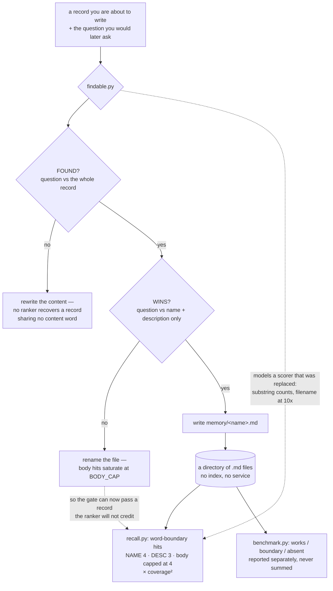

## 1. Executive Summary

A file-based memory format — one fact per Markdown file, with a frontmatter
`name`, a one-line `description` and a four-value `metadata.type` — plus eleven
dependency-free Python tools, two sample corpora with known-answer probes, and a
set of build prompts for the engines that are *not* in the repository. Apache-2.0,
9 commits, all of them dated 30 August 2026.

**The contribution worth taking is on the write side, and it is a genuinely
under-served idea.** `findable.py` asks, before a record is written, whether a
later question would find it — and returns two verdicts because they fail
differently. *FOUND?* runs the question against the whole record: fail it and the
content is unreachable by any ranker, which is a write-time defect no retrieval
engine recovers from. *WINS?* runs it against name and description only, because
body hits saturate: you can be found and still lose to any file with the word in
its name. This atlas asks after retrieval quality in every report and after
write-time reachability in almost none; here it is a tool with a threshold and a
measurement behind it.

**The measurement discipline is unusual and it holds up when you run it.** The
benchmark's probe files carry three named sections that are reported separately
and never summed — `works`, `boundary` and `absent` — with the reason recorded in
the file: the boundary probes used to sit in the same table as the real ones,
*"turning a documented limit into a headline 'MISS'"*. Every tool has a
`--selftest`, and the README says what a passing one is worth: *"A passing
selftest means the code does what the code intends. It says **nothing** about
whether retrieval works."* All eight selftests pass. `benchmark.py --verify` on
both shipped corpora returns 10 of 10 found and 3 of 3 absent topics correctly
empty. And `--overlap` reproduces the README's headline exactly: **zero shared
content words → 0 of 4 found; one or more → 20 of 20, 18 of them at rank 1.**

**What ships is a sixth of what is drawn.** `coverage.py` enumerates twenty-one
architecture boxes and prints the split itself: six CODE rows, thirteen SPEC rows
that are build instructions, two prompts — and then, unprompted, *"ADDRESSED IS
NOT IMPLEMENTED"* and *"That is coverage OF THIS LIST, not of the architecture."*
Stage 10 — the reinforce / supersede / archive lifecycle — is one of the specs.
So every correction mechanism this atlas measures is a prompt here, and the one
mark this report awards is the only one it could award.

**And the write gate has drifted from the ranker it predicts.** A comment in
`findable.py` explains a fix by describing `recall.py`'s scorer as substring
counts crediting a filename match *"at 10x"*. The shipped `recall.py` uses
word-boundary regex — changed on 2026-08-25 by an external review, with its own
comment saying so — and weights a name hit at 4. Running the comment's own
example against the shipped scorer returns 0.0.

One mark. 2,938 lines of standard-library Python, 2,145 lines of prose, 24
memory files across three corpora, pinned at
[`9922f209406e5c0bf9d2329dbe0a5d7f7d73f1fd`](https://github.com/ScPlaceholder/MOTH-agent-memory-template/commit/9922f209406e5c0bf9d2329dbe0a5d7f7d73f1fd).

## 2. Mental Model

A memory is one file holding one fact, and the format states why that constraint
is load-bearing rather than stylistic: *"A file holding three facts matches three
different queries and answers none of them well."*

```markdown
---
name: <short-kebab-case-slug>
description: <one line, used to decide relevance during recall>
metadata:
  type: user | feedback | project | reference
---
```

Readers of this atlas will recognise the shape: it is the frontmatter Claude
Code's own auto-memory writes, down to the four type values, the `[[name]]`
links and the `**Why:**` / `**How to apply:**` convention for feedback and
project memories. Stated as a fact about the artifact's lineage, not a criticism
— a template for agent memory adopting the format its target agent already uses
is the correct decision.

**A memory has exactly one state: it exists.** There is no candidate, no
verified, no rejected, no superseded, no archived — those are stage 10 of the
build prompts. Correction is editing the file; forgetting is deleting it. The
one lifecycle surface that ships is upstream of the store entirely:
`memory_candidates.py` is a rolling append-only queue of things that *might*
become memories, with a design note explaining why it is a queue and not a
classifier — *"the write path is the only place where a mistake is permanent — a
bad classification becomes a memory file that is then retrieved and believed for
months"* — and a counter that increments when a candidate is retrieved, so
*"a candidate nobody ever pulls is evidence it was not worth keeping. That is
usage as the filter, not confidence at write time."*

And then: **⚠⚠ NOTHING HERE PROMOTES TO MEMORY. Not automatically, not on a
threshold, not ever from this module. Promotion is a separate, human-visible
decision.** That is the correct call and the promotion surface is not in the
repository, so the queue's exit is declared and unshipped.

The epistemic event this design actually models is therefore not *how does a
thing become a belief* but *will this belief be reachable when I need it*, and
that is what the diagram below shows.



## 3. Architecture

There is almost nothing to stand up, and that is deliberate: *"Plain Python 3, no
dependencies, no index to build, no service to run."* `THIRD_PARTY.md` backs the
claim rather than asserting it — a full `os.walk` from the root, no depth limit,
testing for eleven weight-file extensions, zero matches, and the note that *"the
tree is small enough that the search covers all of it, which is the only reason
this can be stated as an absolute rather than a 'none found'."*

- **`memory/`** — three example records. **`sample/memory/`** — ten same-genre
  notes with known-answer probes. **`sample/mixed/`** — eleven deliberately
  different kinds of file, including a `hello.py` that exists to demonstrate that
  a non-`.md` file in the folder is not in the corpus.
- **`tools/`** — eleven scripts, 2,938 lines, standard library only. Read side:
  `recall`, `whereis`, `memory_echo`. Write side: `findable`,
  `memory_candidates`, `candidate_classify`. Repository checks: `wired`,
  `coverage`, `lint_prompts`, `benchmark`.
- **`docs/`** — `FORMAT.md`, `AGENT_INSTRUCTIONS.md` (the paste-in prompt block),
  `BUILD_PROMPTS.md` (the staged instructions for the engines not here), and
  `AUDIT.md`.

The one network surface in the tree is `candidate_classify.py`, which posts to a
local Ollama at `/api/embeddings`; the README labels it **MEASURED WEAK** before
a reader can discover that themselves.

### Deployment and ergonomics

Copy the directory. That is the install. The store is a folder of Markdown a
person reads and edits, which puts it at the opposite end of this atlas's range
from the multi-datastore graph systems — and the tradeoff is stated rather than
hidden: retrieval walks the tree on every query, so this is a design for tens or
hundreds of notes, not tens of thousands.

**The screener could not see this tree.** There is no package manifest, no
lockfile and no hook file, so `screen_repo.py` returned `NOTHING SCANNED`, which
is a finding rather than a pass. Read by hand instead: every import across the
eleven tools is standard library, the only writes are into `tempfile` directories
inside `--selftest` paths cleaned up with `shutil.rmtree`, and the only outbound
request is the local Ollama call above. That is what made it safe to run the
tools, and the numbers in this report were produced by running them.

## 4. Essential Implementation Paths

**Retrieval** — `tools/recall.py:118-165`. For each query term: a word-boundary
hit in the name scores `NAME_WEIGHT = 4`, one in the description
`DESC_WEIGHT = 3`, and body occurrences score `min(count, BODY_CAP)` with
`BODY_CAP = 4`. Then the coverage multiplier, which is the design's actual
ranking idea:

```python
score *= (len(matched) / float(len(qterms))) ** 2
```

*"the fraction of the query a file accounts for dominates the raw tally. Without
this multiplier the ranking silently degrades into 'who said it most'."*

**Word boundaries, and why they were not always there.** The scorer used to be
`t in name` and `low.count(t)`, so `"bug"` matched `"debug"`. The comment
recording the fix is the best short statement of a defect class this atlas keeps
finding: *"a false term hit counts toward COVERAGE, which is the headline claim of
this whole tool. And the coverage multiplier IS mutation-tested — the test
verifies the formula gets applied, and never checked that the term matcher
feeding it was correct. **A verified formula over wrong inputs is still wrong.**
The assertion guarded the arithmetic and not its operands."*

**The write gate** — `tools/findable.py`. Two verdicts over the same pair, as
described in section 1.

**Corpus membership** — `recall.py:186`, `if fn.endswith(".md")`. A `.py`, `.pdf`
or `.txt` in the folder produces no error and never appears in a result, and
`FORMAT.md` draws the consequence: *"The note is what makes the artifact
findable; without one it is not in the corpus, it is merely in the folder."*

**The candidate queue** — `tools/memory_candidates.py`, an append-only JSONL with
a per-line failure mode chosen deliberately: *"a corrupt line loses one
candidate, never the file."* The file itself is not committed, so the queue ships
empty.

**Repository checks** — `wired.py` parses the AST rather than grepping, with the
asymmetry stated: *"'wired' is a strong claim from it, 'not wired' is a weak
one."* `coverage.py` walks the box list. `lint_prompts.py` catches build
instructions that cannot be followed, and computes its own rule count rather than
printing one, after a footer advertising six rules while seven ran.

## 5. Memory Data Model

Four fields and a body. `name` must equal the filename without `.md`, and the
tools rely on it. `description` is *"what a search shows first"*, and the format's
highest-leverage rule is about it: **write the description in the words you will
search with**, because *"when you write a note you are thinking in the vocabulary
of the thing that just happened, and months later you search in the vocabulary of
the problem you now have. Those are different languages."*

`metadata.type` is one of `user`, `feedback`, `project`, `reference`. It is a
**kind**, not a status — it says what the memory is about, never whether it is
believed — so `trust_state` is withheld on an absence rather than on an unwired
field. There is no confidence, no provenance, no source pointer, and no
timestamp: the format's answer to time is a rule rather than a column, *"convert
relative dates to absolute"*, enforced by the writer and by nothing else.
`bitemporal` is not a near miss; the axis does not exist.

**Nothing is scoped.** `--root` chooses a directory to walk. No field on a record
is applied as a filter on the read path, so `scope_enforced` is withheld — and
for a single-user note folder that is the right design rather than an omission.

**Nothing records a rejection.** A record that should not have been written is
deleted, and the next capture of the same text is a new candidate with no memory
of the last one. `tombstone` is withheld, and the queue is where it would go:
`memory_candidates.py` already has the append-only file and the per-candidate
row that a rejected-value record would need.

## 6. Retrieval Mechanics

One lexical arm, no index, no embeddings in the shipped path. The interesting
mechanics are in what the tools refuse to claim.

`recall.py`'s own docstring warns against the evaluation error that flatters every
retrieval demo: *"Do not evaluate retrieval by asking about topics you know are
there"* — the note the query was written from is exactly the note the query will
find.

`benchmark.py --overlap` then reports the boundary rather than the score, with
this instruction attached: *"Read this rather than the hit@1 figure. hit@1 mostly
reports how many zero-overlap probes the author happened to write; this reports
the boundary itself."* Run at this commit it prints four probes with no shared
content word, none found, and twenty with at least one, all twenty in the top
three. That is a system publishing the shape of its own failure curve instead of
a single number, and it is the correct instrument for a lexical matcher.

**The failure mode is therefore known, measured and stated**: a question phrased
in a different vocabulary than the record retrieves nothing, and no ranking change
fixes it. The remedy the project offers is the write-side one — put the search
words in the description — and it reports the measurement behind that too: doing
so *"rescued 4 of 4, every one to rank 1."*

## 7. Write Mechanics

Writes are a person or an agent creating a file. Nothing is asynchronous, nothing
is extracted, no model is called on the shipped path, and a memory is retrievable
the moment it is saved.

**The gate is the mechanism, and it has drifted from what it gates.**
`findable.py` carries a long comment explaining why its WINS? check was loosened:
it had failed a record titled `a-single-sample-instrument-cannot-prescribe-waiting`
against the question *"wait"*, and the comment argues the failure was false
because *"`recall.py` does NOT tokenise the target. Its scorer is `b, n, d =
low.count(t), name.count(t), desc.count(t)` — SUBSTRING counts. `\"wait\" in
\"…prescribe-waiting\"` is True, so recall would have credited that filename match
at 10x."*

Neither half of that is true of the shipped scorer. `recall.py` matches on word
boundaries, changed on 2026-08-25, and weights a name hit at 4. Scoring the
comment's own example against `recall.score_file` at this commit returns **0.0
for `"wait"`** and 4.0 for `"waiting"`.

The consequence is the mirror of the defect the file's docstring warns about. It
warns that *"a gate that rejects good records is worse than no gate, because you
learn to ignore it"* — and the loosening made in response to that now lets the
gate **pass** records the ranker will not credit. A false pass is the quieter
failure: a record that clears WINS? and then does not surface produces no signal
at all.

**The README's field weights are the same drift, one file over.** It says name
and description carry *"roughly 10x and 8x the weight"* of a body hit; the
constants are 4 and 3 against a body contribution that starts at 1 and saturates
at 4. In a repository whose README opens by correcting itself for saying "three
small tools" while eight shipped — *"A count typed into prose is a claim nothing
verifies… Prose cannot compute, so prose should not count"* — this is the same
defect the same document diagnoses two paragraphs earlier, about numbers it did
not think of as counts.

### Operational cost

Zero on the write path and zero on the read path: no embedding, no model call, no
index build. The cost is linear in corpus size per query, since `walk` reads every
`.md` on every search. For a folder of a few hundred notes that is the right
trade; the point at which it stops being so is not measured here, and the build
prompts' indexing stage exists for it.

## 8. Agent Integration

`docs/AGENT_INSTRUCTIONS.md` is a paste-in prompt block, and the tools are
command-line programs an agent shells out to. There is no MCP server, no library
API and no hook.

**Agency over memory is total and the design's caution is about exactly that.**
The agent decides what to write, and the two write-side tools exist to put a
checkable step in front of that decision rather than a policy behind it — ask
`findable.py` first, look at `memory_echo.py`'s nearest existing records before
adding another. Neither can refuse a write; both are advisory by construction,
which is consistent with a template a reader is meant to adapt.

## 9. Reliability, Safety, and Trust

**No provenance, no verification, no uncertainty.** A memory says what it says.
Nothing records where it came from, who wrote it, or whether anyone checked it,
and the format is explicit that this is a store of stated facts rather than
adjudicated ones.

**Prompt injection is unaddressed and is a live path**, because the corpus is a
folder an agent both reads and writes and the recall output goes into a prompt
unfenced. Nothing here neutralises markup or marks recalled text as data. For a
personal note folder that is a reasonable posture; for an agent ingesting third
party text into the same directory it is not, and the repository does not draw
that line.

**The strongest safety property is the one about the queue**, and it is a design
argument rather than a mechanism: the write path is where a mistake becomes
permanent, so the classifier was deliberately not wired to it, and the queue that
replaced it is reversible by construction. Beside it sits a measured reason:
*"a real hit scored 0.727 while junk scored 0.693 and 0.719, so the answer sat
inside the noise band. Every score-based gate I own is fighting that."*

**`docs/AUDIT.md` is the document to read**, and it is the rarest artifact in this
repository. It separates mechanical checks — *"a question with an exact answer
should never be sent to a model"* — from model reviews, and reports the reviews
by reproduction rate: a local model claimed twelve findings with zero
reproducible, Codex claimed five with five reproduced and five fixed, *"each now
has a regression test verified by re-introducing the bug."* Verifying a
regression test by re-introducing the fault it guards is the negative control this
atlas asks of every checker, done here by hand. One of its checks is a shadow-copy
test — that `whereis` holds no private copy of `BODY_CAP`, `DESC_WEIGHT`,
`score_file` or `terms`, because *"a shadow copy would let the two files' ranking
drift apart while every test still passed."* The drift documented in section 7 is
that same failure between two files the audit did not pair.

**`human_review` is withheld and the near-miss is worth naming.** Promotion from
the candidate queue to memory is declared a human decision in as many words, in
bold, twice. No tool in the repository performs it. The surface is designed,
argued for, and absent.

## 10. Tests, Evals, and Benchmarks

Every tool carries `--selftest`, and all eight run clean at this commit. The
README pre-empts the reading that would matter: *"A passing selftest means the
code does what the code intends. It says **nothing** about whether retrieval
works — that is what `benchmark.py` is for, and it is the only thing here that
has ever come back red."*

**The probe files are the evaluation, and their structure is the finding.** Three
sections, three jobs, never summed, *"because summing them produces a number that
answers no question anybody has"*:

- `works` — ten questions per corpus phrased the way a person asks months later.
  *"Expected: nearly all at rank 1. If this section drops, there is a bug."*
- `boundary` — questions sharing zero content words with their answer, expected
  *not* to return it. Not scored as failures: *"they are what the limit looks
  like, shown deliberately so a user meets it here rather than by surprise."*
- `absent` — topics not in the corpus, which must return nothing.

The correction that produced the split is recorded in the file: the boundary
probes used to sit in the same table as the real ones, *"turning a documented
limit into a headline 'MISS' and a score that looked like mediocrity."*

**Run at this pin**, `benchmark.py --verify` gives 10 of 10 found on both corpora
with one not first, 3 of 3 absent topics correctly empty, and the boundary probes
listed by name with what they should have found. `--overlap` gives 0 of 4 and 20
of 20 with 18 at rank 1 — the README's headline, reproduced.

**And the harness prints its own limits under a heading that says so.** *"WHAT
THIS DOES NOT TELL YOU"*: nothing about the reader's real notes; nothing about
the engines in the diagram that are not in this repository; and the one that
matters most — *"If your agent WROTE the probes as well as the code, this check
is circular — it picked both the exam and the answers. Write at least a few
questions yourself. That is the part nobody can do for you."* A benchmark naming
circularity as its own most serious threat, in its own output, puts the warning
where the reader is already deciding what to believe.

**What is not tested.** Nothing exercises the format rules the whole design rests
on: no check that `name` equals the filename, that a file holds one fact, or that
a description is written in searchable words — the rules are enforced by the
writer, and `FORMAT.md` says a validator enforces the name rule while no validator
ships. Nothing measures the `.md`-only boundary as a case, though `sample/mixed/hello.py`
exists to demonstrate it. And no test pairs `findable.py` against `recall.py` on
the same input, which is the check that would have caught section 7.

**No paper, and none claimed.** `docs/AUDIT.md` is the closest thing, and it is a
better artifact than most papers in this corpus for the specific purpose of
telling a reader what was and was not verified.

## 11. For Your Own Build

### Steal

- **Ask whether a record will be findable before writing it, and return two
  verdicts.** Unreachable and unrankable are different failures with different
  fixes — rewrite the content, or rename the file — and collapsing them into one
  score tells the writer nothing actionable. This is the idea to take.
- **Report benchmark sections separately and refuse to sum them.** A documented
  limit inside the headline number reads as mediocrity; a fabrication check inside
  it reads as accuracy. Three numbers that each answer a question beat one that
  answers none.
- **Print what the benchmark does not tell you, in the benchmark's own output.**
  Not in a README a reader skips — in the text they are already looking at, at the
  moment they are deciding what to believe.
- **Verify a regression test by re-introducing the bug.** `AUDIT.md` does this for
  all five reproduced findings, which is the difference between a test that passes
  and a test that would notice.
- **Report a model review by reproduction rate.** Twelve claimed and zero
  reproducible, beside five claimed and five reproduced, is more useful than
  either raw count — and it is the number that tells you which reviewer to run
  again.

### Avoid

- **A gate that models the thing it gates instead of calling it.** `findable.py`
  reimplements its idea of `recall.py`'s scorer in a comment and in code, and
  when the scorer changed the gate did not. If the ranker is importable — it is,
  and `whereis.py` and `memory_echo.py` both import it — the gate should score
  through it, so drift becomes impossible rather than merely tested for.
- **Numbers in prose that describe constants in code.** The README diagnoses this
  exactly once, about tool counts, and then states field weights as 10x and 8x
  where the constants are 4 and 3. Anything a reader could check against a
  constant should be printed from it.
- **A queue whose exit is a decision nobody can make yet.** The argument for
  human promotion is right and the promotion surface is absent, so a candidate
  captured today has no path to becoming a memory at all.
- **Shipping the diagram and the specification as if they were the system.**
  `coverage.py` is honest about this and it is still the reader's job to notice
  that six of twenty-one boxes ship code, and that the thirteen specs include
  every correction mechanism.

### Fit

Read this as a **format plus a measurement toolchain**, not as a memory system,
and it is worth an afternoon. The format is Claude Code's own auto-memory shape
with the reasoning written down, and the tools around it are the part that does
not exist elsewhere: a write-time findability check, a benchmark that can come
back red and says so, and an audit that separates what was verified from what was
assumed.

Who should walk away: anyone who needs the memory to be *corrected* rather than
edited. Supersession, archival and reinforcement are build prompts, and a reader
who adopts this gets a folder of notes with a good search over it and no
lifecycle at all. That is a defensible product for a personal note store and it
is not what most of this atlas's readers are shopping for.

The other reason to read it is the prose. Several of the comments in this
repository are better statements of failure modes than the systems that suffer
from them manage — *"A verified formula over wrong inputs is still wrong. The
assertion guarded the arithmetic and not its operands"* is a sentence worth
carrying into any review.

## 12. Open Questions

- **Was the `findable.py` loosening re-checked after `recall.py` moved to
  word-boundary matching?** Both changes are dated to the same week and the
  comment describing the older scorer is still in the file.
- **Where do the 10x and 8x weights come from?** They may describe the BM25
  field-weighted engine specified in `BUILD_PROMPTS.md` rather than the shipped
  scorer, in which case the README is describing two engines in one sentence.
- **What performs promotion from the candidate queue?** The decision is specified
  as human and the surface is not in the repository.
- **At what corpus size does walking the tree per query stop being the right
  choice?** The design is explicit that no index is built and silent about where
  that ends.
- **Is the `metadata.type` vocabulary ever read by anything?** No shipped tool
  filters or weights by it, so it is currently documentation for the writer.

## Appendix: File Index

**Format and store**
- `docs/FORMAT.md` — the four fields, the four types, and the rules with their
  reasons.
- `memory/` (3 files), `sample/memory/` (10), `sample/mixed/` (11, including the
  `hello.py` that demonstrates the `.md`-only boundary).

**Read path**
- `tools/recall.py:48-52` — `BODY_CAP`, `DESC_WEIGHT`, `NAME_WEIGHT`;
  `:118-165` — `score_file`, the word-boundary matchers and the coverage
  multiplier; `:186` — the `.md` filter.
- `tools/whereis.py`, `tools/memory_echo.py` — both importing `recall`.

**Write path**
- `tools/findable.py` — the two verdicts; `:178-192` — the comment describing the
  superseded scorer.
- `tools/memory_candidates.py` — the append-only queue, the retrieval counter,
  and the no-promotion rule.
- `tools/candidate_classify.py` — the local-Ollama classifier, labelled MEASURED
  WEAK.

**Measurement**
- `sample/probes.json`, `sample/mixed_probes.json` — `works` / `boundary` /
  `absent`.
- `tools/benchmark.py` — `--selftest`, `--verify`, `--overlap`.
- `tools/coverage.py` — the twenty-one boxes and the CODE/SPEC/PROMPT split.
- `tools/wired.py` — AST call detection with its asymmetry stated.
- `tools/lint_prompts.py` — computes its own rule count.

**Provenance**
- `docs/AUDIT.md` — mechanical checks, model reviews by reproduction rate, and
  what was not verified.
- `THIRD_PARTY.md` — the bounded absence claim and the optional-tier licence
  table.

## History

**2026-08-30** — [`9922f209406e5c0bf9d2329dbe0a5d7f7d73f1fd`](https://github.com/ScPlaceholder/MOTH-agent-memory-template/commit/9922f209406e5c0bf9d2329dbe0a5d7f7d73f1fd) — first reading, at the ninth commit of a repository whose first commit is dated the same day. Screening returned **`NOTHING SCANNED`** — no manifest, hook or agent file at any path it knows — which is a finding rather than a pass, so the execution surface was read by hand: every import across the eleven tools is standard library, the only writes are into `tempfile` directories inside `--selftest` paths, and the only outbound request is a local Ollama call in the tool the README already labels MEASURED WEAK. On that basis the tools were run, and the numbers in sections 1, 6 and 10 were produced rather than quoted: all eight selftests pass, `--verify` returns 10/10 and 3/3 on both corpora, `--overlap` reproduces the README's 0-of-4 and 20-of-20, and `recall.score_file` returns 0.0 for the example `findable.py`'s comment says would be credited at 10x. One mark.
