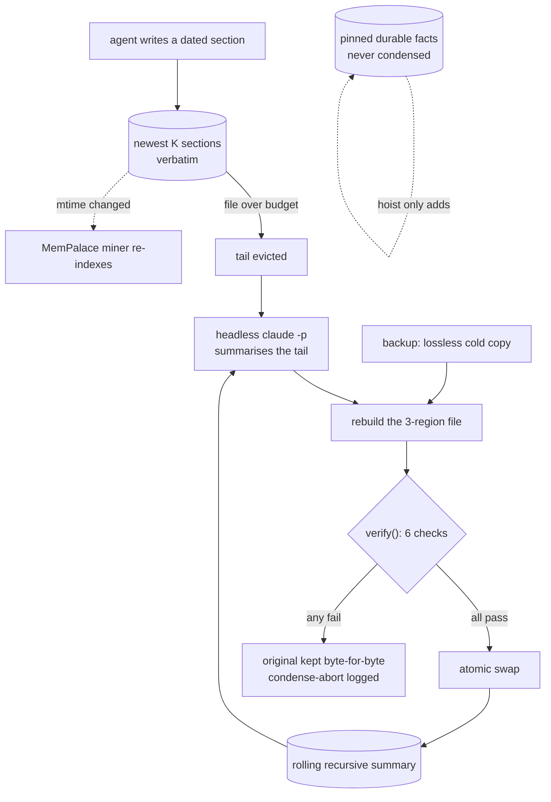

## 1. Executive Summary

Munder Difflin is an Electron desktop harness that runs several terminal coding
CLIs — Claude Code, Codex, Gemini, Grok, Kimi, Qwen, OpenCode and others — as a
team of agents on one machine, messaging each other through an inbox/outbox bus
and drawn as avatars on an office floor. MIT, 666 commits, ~52,000 lines of
TypeScript and TSX. Version 0.4.3, badged by its own README as a working
prototype.

**Its memory is one markdown file per agent, and its own contribution is what
happens when that file gets too big.** Each agent owns
`<harnessHome>/hive/agents/<id>/memory.md`, a sequence of dated
`## <date> — <title>` sections it maintains under a prompt: *"Read your memory.md
and drain every message in your inbox."* That much is the editing surface several
harnesses in this atlas ship.

**Semantic recall is delegated, and the delegate is a separate project.**
`MemoryManager` (293 lines) shells out to the **MemPalace** CLI —
[already in this atlas](../mempalace/) — pointing every agent at one shared
palace and mining each agent's markdown into its own wing, so the team can search
by meaning. It is CLI-only, runs with `--no-llm` heuristics, and the header is
honest about the failure mode: it *"degrades silently to no-op when the
`mempalace` CLI isn't installed — the markdown memory still works."* Nothing in
this tree implements semantic memory; it wires one in.

**`MemoryReflector` is the mechanism this repository owns.** A memory file has
three regions — pinned durable facts under
`## 📌 Durable facts (pinned — never condensed)`, one rolling recursive summary,
and the newest K verbatim sections. On an in-process timer, files past a size or
section threshold have their tail evicted, summarised by a cheap headless
`claude -p`, and folded back in.

**The interesting part is that it does not trust the model it just called.** The
rewrite goes through backup-first, then a `verify()` gate, then an atomic swap,
and the contract is stated as an absolute: *"If any check fails the original file
is left byte-for-byte untouched and the only side effect is a `condense-abort`
log line."* Because the backup is a lossless cold copy taken first, a rejection
is a pure no-op.

**One mark.** `audit_log`, for the hive's append-only `log.jsonl`, which carries
`condense` with old and new byte counts, evicted, kept and hoisted counts and the
backup path, `condense-abort` with a named reason, plus `compact`, `archive` and
`drop`. Withheld and worth naming: scope is *deliberately* absent between agents,
because the hive is meant to share; nothing records a rejected value or a
correction; the pinned region is a retention rule rather than an epistemic state;
and **the repository contains no tests at all**, which lands hardest on the one
mechanism most worth testing.

## 2. Mental Model

An agent writes what it learned into its own markdown, in dated sections. Nothing
grades it, supersedes it or removes it. The file grows until a janitor notices,
and then the oldest half is replaced by a summary of itself — recursively, so the
summary is a summary of previous summaries — while a pinned block and the newest
sections pass through untouched.

The state a memory can be in is therefore positional rather than epistemic: which
region of the file it currently sits in.

## 3. Architecture

An Electron app. The memory work runs in the **main process**, and the reason is
recorded rather than assumed: *"launchd-spawned shells are blocked by macOS TCC
from `~/Documents`; only this process has the folder grant. So the loop lives
alongside `memory.start()` — never a cron."* A platform permission model decided
the scheduler.

State is files: per-agent directories holding `memory.md`, `inbox/`, `outbox/`,
`cursor.json` and `settings.json`, plus a hive registry and `log.jsonl`.

## 4. Essential Implementation Paths

- **Condense.** `src/main/reflect.ts` — threshold check, tail eviction,
  `summarize()` via `runHiddenClaude`, `verify()`, atomic swap.
- **Mine.** `src/main/memory.ts` — `mempalace init/mine/search/wake-up`, one
  shared palace, one wing per agent.
- **Log.** `src/main/hive.ts` — the append-only `log.jsonl` and the registry.
- **Read.** `hiveMemory(id)` over the preload bridge returns raw markdown; the
  graph in `src/renderer/src/components/memoryGraph/` extracts topics from it.

## 5. Memory Data Model

There is no schema. A memory is a markdown section with a date and a title, and
its only structural property is which of three regions it occupies. `parseMemory`
splits the file on the pinned heading and the summary heading; everything after
is a list of `Section { heading, body }`.

That is the whole model. No id, no status, no provenance beyond the owning
agent's directory, no validity time, no supersession pointer.

## 6. Retrieval Mechanics

Two paths, and neither is implemented here. The agent reads its own file because
the prompt tells it to. Cross-agent semantic recall is `mempalace search` and
`mempalace wake-up` against the shared palace — so retrieval quality, ranking and
scoping are properties of [MemPalace](../mempalace/), not of this harness.

A text fallback in `src/renderer/src/realtime/tools.ts` greps every agent's
`memory.md` *"INCLUDING archived"* ones. Between that and the single shared
palace, the design's position on isolation is explicit: there isn't any, on
purpose, because the premise is a hive that knows collectively.

## 7. Write Mechanics

Writes are the agent editing its own markdown. The harness adds two things around
that.

`ensureMineIgnore` drops a `.gitignore` into each agent directory excluding
`settings.json`, `cursor.json`, `inbox/` and `outbox/`, because `mempalace mine`
honours `.gitignore` and those files *"swamp the wake-up digest"*. Keeping
non-memory out of the index by writing an ignore file rather than patching the
miner is a small, correct instinct: it works with the other project's contract
instead of around it.

The condenser is the other. Its budget mirrors the janitor's 128 KB, and its
summarizer is given the pinned block *"for context only — do not rewrite it"*.

## 8. Agent Integration

Terminal CLIs are wrapped rather than replaced, so an agent's memory is whatever
it writes to a file the harness then manages. The memory graph is a read-and-
navigate surface — `hiveMemory` has no write counterpart on the preload bridge —
so a person inspects memory here and edits it, if at all, in their own editor.

## 9. Reliability, Safety, and Trust

**`verify()` is the strongest thing in the tree and it is worth reproducing as a
list**, because it is a good model of what to check when a model rewrites your
store:

1. The rebuilt text parses back into all three regions.
2. Every pinned line survives — a merge may only add.
3. The result is *actually smaller* (`newBytes < oldBytes * 0.95`); a no-op
   condense is a failure.
4. It is non-empty and sane — over 200 bytes, with a non-empty summary.
5. The kept newest sections round-trip **byte-for-byte**.
6. The summary parsed as valid JSON upstream.

Each failure returns a named reason — `structure-missing-region`,
`pinned-line-dropped`, `not-smaller`, `recent-section-altered` — which lands in
the log. The combination of a lossless backup taken first and a rejection that
changes nothing means the worst case of a bad model pass is a log line.

Against that: **there are no tests.** `verify()` is exported, pure, and takes a
plain argument object — it is the easiest function in the repository to test, and
nothing does. The same holds for `parseMemory`. A gate whose whole purpose is to
catch a non-deterministic component is a gate that should be pinned by cases, and
the repository has none of any kind.

The other risk is quieter. Condensation is lossy by design and recursive: a
summary of summaries drifts, and nothing measures the drift. Pinning is the only
defence, and it is manual.

## 10. Tests, Evals, and Benchmarks

None. No test file, no eval, no benchmark, no paper. Six blog posts under
`docs/blog/` and `blog/src/posts/` discuss agent memory — *"markdown-first agent
memory"*, *"compressing agent memory"*, *"keep agent semantic memory clean"* —
and they are marketing prose about the design rather than evidence about it.

For a project whose memory story rests on an LLM rewriting a file in place, the
distance between the care in `verify()` and the absence of a single case
exercising it is the widest gap in the tree.

## 11. For Your Own Build

### Steal

- **Verify the rewrite, not the model.** Back up losslessly *first*, rebuild,
  then check the result against properties you can state — regions present,
  protected lines preserved, actually smaller, kept sections byte-identical — and
  swap only if all pass. A rejection then costs nothing.
- **Treat a no-op as a failure.** `!(newBytes < oldBytes * 0.95)` catches the
  case where the model returned something plausible that achieved nothing, which
  a "did it parse" check would pass.
- **Give every rejection a named reason and log it.** `condense-abort` with
  `pinned-line-dropped` is debuggable; a boolean is not.
- **Pin what must never be summarised, and hand it to the summarizer as
  read-only context.** *"For context only — do not rewrite it."*
- **Work with the other tool's contract.** Dropping a `.gitignore` so
  `mempalace mine` skips the inbox is better than forking the miner.
- **Record why the scheduler is where it is.** The macOS TCC note explains a
  design choice that would otherwise look arbitrary to the next maintainer.

### Avoid

- **Shipping an unexercised gate.** The care in `verify()` is real and nothing
  proves it still works; a checker with no negative control looks identical to a
  clean one.
- **A dependency that disappears quietly.** Semantic recall degrading to a no-op
  when a binary is missing means the difference between "the team can recall by
  meaning" and "it cannot" is invisible at runtime.
- **Compaction as the only lifecycle.** Nothing here can mark a line wrong. A
  false claim in `memory.md` is not corrected; it is eventually summarised, which
  may preserve it in compressed form.

### Fit

Take the condenser's shape if you keep agent memory in markdown and something
will eventually rewrite it — the three-region file plus the verification gate is
about 400 lines and the most transferable idea here.

Take the harness only if you want the whole product: a desktop multi-agent office
with a message bus. Its memory is deliberately shared across agents and has no
correction path, so it suits a single operator running a team on their own
machine and nothing where one agent's material must stay away from another's.

## 12. Open Questions

- `verify()` is pure and exported. What has to happen for it to get a test?
- Condensation is recursive. What does a summary of summaries look like after
  fifty cycles, and does anything sample it?
- Semantic recall vanishes silently without the MemPalace binary. Should the UI
  say which mode the hive is in?
- Nothing can mark a line in `memory.md` wrong. Is a correction meant to arrive
  as a new dated section that contradicts the old one, and if so what resolves
  them at condense time?
- The text fallback searches archived agents' memory. Is an archived agent's
  material intended to stay reachable indefinitely?

## Appendix: File Index

**Memory**
- `src/main/reflect.ts` — the three-region model, the condenser, `verify()`
- `src/main/memory.ts` — the MemPalace wrapper, `ensureMineIgnore`
- `src/main/hive.ts` — the registry and the append-only `log.jsonl`
- `src/renderer/src/components/memoryGraph/` — topic extraction and the graph
- `MEMORY_GRAPH_SPEC.md` — the graph's design contract

**Docs**
- `docs/blog/`, `blog/src/posts/` — six posts about agent memory, prose rather
  than evidence

## History

**2026-08-17** — [`6a09318dafbf99f4c28e8af760a2353fce34c771`](https://github.com/chaitanyagiri/munder-difflin/commit/6a09318dafbf99f4c28e8af760a2353fce34c771) — First reading, at 666 commits. Screened first: 0 auto-run surfaces, 1 build-time execution path (an npm `postinstall` running `electron-rebuild` and two node-pty patch scripts), 2 manifests inside the seven-day cooldown; nothing was installed, built or run. One mark, `audit_log`. Semantic recall is delegated to the MemPalace CLI, which has [its own report](../mempalace/), so retrieval and scoping belong there. Withheld here: no scope key between agents by design, no rejected-value record, no epistemic state, and no tests of any kind — including for `verify()`, which is exported and pure. No paper.
